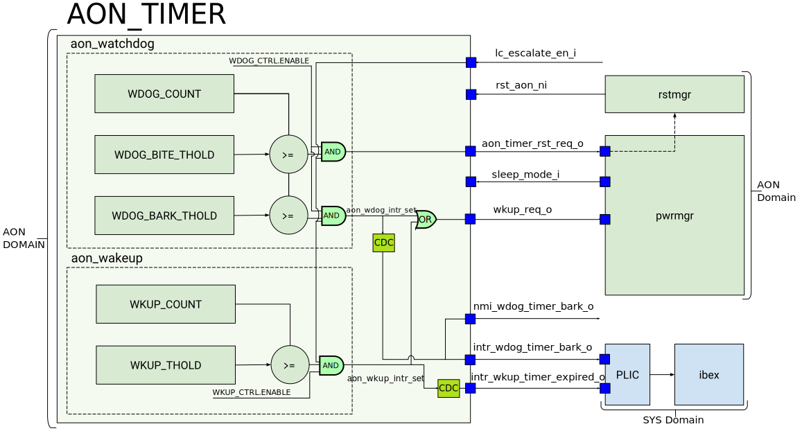

# Theory of Operation

AON Timer interacts with the CPU core and the power manager and reset manager to generate interrupts as well as wakeup and  reset events.
Each timer increases its count as long as its enable signal (`wdog_ctrl.enable` for WDOG and `wkup_ctrl.enable` for WKUP) is set.
Both timers halt the counting if the signal `lc_escalate_en_i` is set, which the alert handler is the system is in a "killed" state.
In addition, the WDOG timer can be configured to stop counting if the `sleep_mode_i` is set.
SW needs to set the field `wdog_ctrl.pause_in_sleep` to 1 in order to enable stopping.
This feature is used to stop the watchdog timer running when in debugging mode.

The diagram below depicts high level functionality and connectivity between AON Timer, the PLIC, Power Manager and the Reset Manager.
The output signals `intr_wkup_timer_expired_o`, `intr_wdog_timer_bark_o` and `nmi_wdog_timer_bark_o` are driven on the SYS domain.
The output signals `wkup_req_o` and `aon_timer_rst_req_o` are driven on the AON domain.
Note the signal `nmi_wdog_timer_bark_o` is a copy of `intr_wdog_timer_bark_o`.

### Block diagram

## Design Details

The always-on timer will run on a ~200KHz clock.
The wakeup timer is 64-bit wide and the watchdog timer is 32-bit wide.
This gives a maximum timeout window of roughly ~6 hours for the watchdog and almost 3 million years for the wakeup timer.
For the wakeup timer, the pre-scaler can be used to slow the count down so the counter value matches some desired time unit (e.g. milliseconds).

Register reads via the TL-UL interface (SYS domain) are synchronized to the slow clock (AON domain) using the "async" register generation feature.
This means that writes can complete before the data has reached its underlying register in the slow clock domain.
If software needs to guarantee completion of a register write, then it can read back the register value - which will guarantee the completion of all previous writes to the peripheral.

The wakeup count and threshold are both 64-bit values accessed through two 32-bit registers.
Bits[63:32] in registers [`WKUP_COUNT_HI`](doc/registers.md#wkup_count_hi) and [`WKUP_THOLD_HI`](doc/registers.md#wkup_thold_hi).
Bits[31:0] in registers [`WKUP_COUNT_LO`](doc/registers.md#wkup_count_lo) and [`WKUP_THOLD_HI`](doc/registers.md#wkup_thold_lo).
It is not possible to do a single atomic read or write of the 64-bit values.
The programmer's guide suggests some ways to access the wakeup count and threshold to avoid issues from race conditions caused by this.

