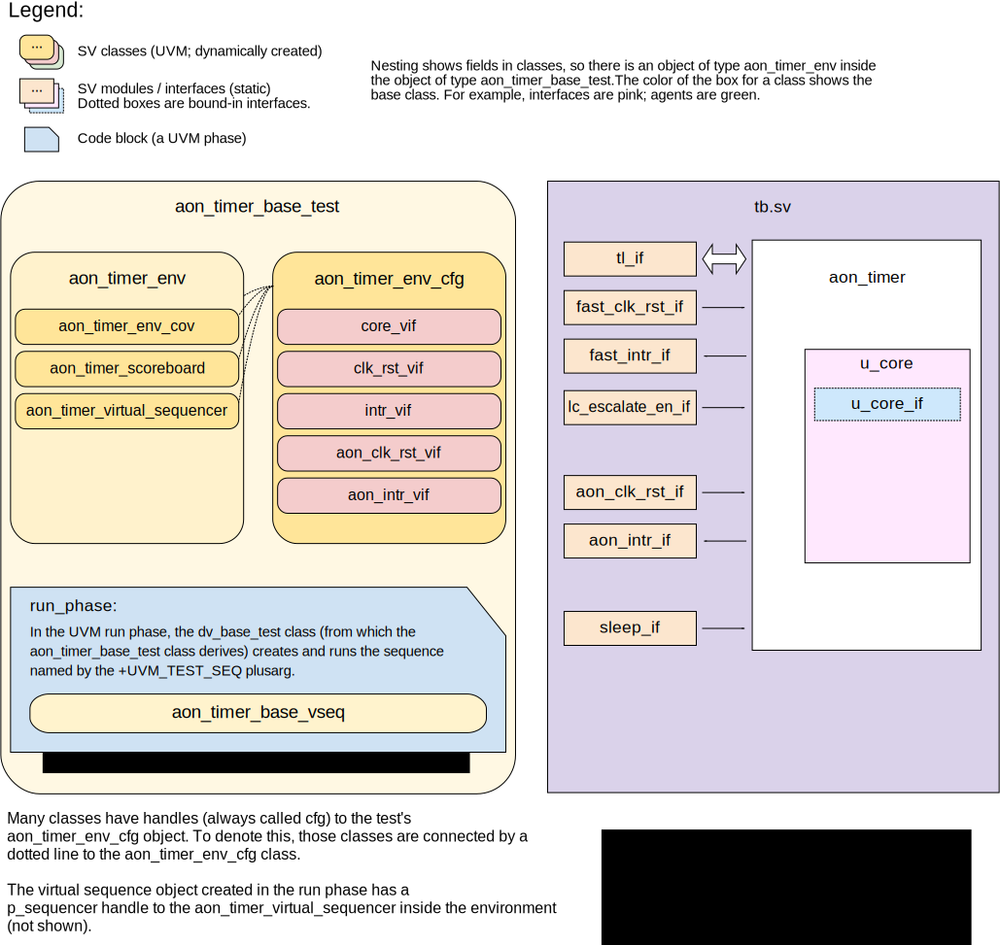
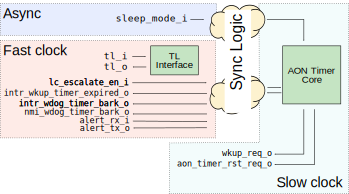

# AON Timer DV Document

## Goals
* **DV**
  * Verify the always-on timer (*AON Timer*) by running dynamic simulations with a SV/UVM based testbench
  * Develop and run all tests based on the [testplan](#testplan) below towards closing code and functional coverage on the IP and all of its sub-modules
* **FPV**
  * Verify TileLink device protocol compliance with an SVA based testbench

## Current status
* [Design & verification stage](../../../README.md)
  * [HW development stages](../../../../doc/project_governance/development_stages.md)
* [Simulation results](https://reports.opentitan.org/hw/ip/aon_timer/dv/latest/report.html)

## Design features

The AON timer is documented in the [AON Timer HWIP technical specification](../README.md).

## Testbench architecture

The testbench is based on the [CIP testbench architecture](../../../dv/sv/cip_lib/README.md).

### Block diagram


### Top-level testbench

The block's testbench is located at `hw/ip/aon_timer/dv/tb/tb.sv`.
It instantiates the `aon_timer` DUT module, defined at `hw/ip/aon_timer/rtl/aon_timer.sv`.

In addition, it instantiates the following interfaces, connects them to the DUT and registers their handles in `uvm_config_db`:
* A [clock and reset interface](../../../dv/sv/common_ifs/README.md) for the fast clock
* A [clock and reset interface](../../../dv/sv/common_ifs/README.md) for the AON clock
* A [TileLink host interface](../../../dv/sv/tl_agent/README.md)
  The AON timer exposes a TL device.
  Here, the testbench is acting as the host CPU; in the OpenTitan SoC, this will be the Ibex core.
* Two interrupts (wakeup timer; watchdog bark) in the fast clock domain
* Two interrupts (wakeup timer; watchdog bite) in the AON clock domain
* The sleep mode input
* The core interface (see below).

The interrupts and sleep mode input are modelled with the basic [`pins_if`](../../../dv/sv/common_ifs/README.md#pins_if) interface.

The AON timer uses three clock domains (`async`, `clk_i` and `clk_aon_i`), with synchronisation logic between them.
The following diagram shows the different inputs and outputs for the module and in which clock domain each resides.



To model this accurately without having to precisely model the timing of the synchronisation logic, the testbench is split into two pieces.
The first piece has a precise model of the AON timer core and checks that the DUT respects it.
The second piece has an approximate timing model and checks forwarding between the async, fast and slow clock domains.
These pieces are connected through a bound-in interface, which observes signals on the `aon_timer_core` instance.
This *core interface* is bound into the design as `u_core_if` and is used to passively monitor the signals coming in and out of the AON Timer Core block in this diagram.

### TileLink agent

In order to communicate through the register interface, the testbench uses the [tl_agent](../../../dv/sv/tl_agent/README.md) that is instantiated in the CIP base environment.
This is also used by generic test sequences to exercise the register interface.

### UVM RAL Model
The `aon_timer` RAL model is created with the [`ralgen`](../../../dv/tools/ralgen/README.md) FuseSoC generator script automatically when the simulation is at the build stage.

It can be created manually by invoking [`regtool`](../../../../util/reggen/doc/setup_and_use.md).
Running
```
util/regtool.py -s -t . hw/ip/aon_timer/data/aon_timer.hjson
```
will generate `aon_timer_ral_pkg.core` and `aon_timer_ral_pkg.sv` in the current directory.

### Stimulus strategy

We want to see timers expire without waiting too long, but we also want to check the counter for large values.
To get this right, we normally set up tests as follows:

- Pick a threshold value
- Pick a start count slightly below the threshold value

Occasionally, we'll pick a start count above the threshold value, to make sure nothing triggers when it shouldn't.
To ensure that we check wrap-around behaviour and see toggles on counter bits, we are careful to pick threshold values more often if they are near zero, the maximum value, or powers of two.

Since the two timers are essentially independent, we use two test sequences, driving them separately.

#### Test sequences

The test sequences can be found in `hw/ip/aon_timer/dv/env/seq_lib`.
The basic test virtual sequence `aon_timer_base_vseq` configures the block in a valid initial state, but doesn't enable either timer.
This is used as a base class for automated tests like the CSR tests.

The smoke sequence initializes both timers and starts them with random threshold values configured.
After that it waits until an interrupt is seen and clears everything before shutting down.

The lock sequence tries to change the configuration of the watchdog timer while it is locked by software.

Stress sequence tries to change all configurations while running.

#### Functional coverage

To ensure high quality constrained random stimulus, it is necessary to develop a functional coverage model.
The following cover points have been developed to prove that the test intent has been adequately met.

`prescale_cp`: Includes possible values for the prescale register of wakeup timer.

`bark_thold_cp`: Includes bark threshold configurations of watchdog timer.

`bite_thold_cp`: Includes bite threshold configurations of watchdog timer.

`wkup_thold_cp`: Includes threshold configurations of wakeup timer.

`wkup_cause_cp`: Makes sure if we ever clear the wakeup interrupt by writing to `WKUP_CAUSE` register.

`wdog_regwen_cp`: Makes sure if the locking feature of watchdog timer is enabled in any test.

`pause_in_sleep_cp`: Makes sure if the pause in sleep mode feature of watchdog timer is enabled in any test.

### Self-checking strategy
#### Scoreboard

As described earlier in this document, the self-checking strategy is in two parts.
The first part of the strategy is to track the domain crossing logic and check that values propagate across unmodified and reasonably quickly.
This does not include precise modelling for the CDC timing.

The second part of the self-checking logic looks at the configuration registers of the timers.
After calculating the amount of clock cycles, it starts checking for an interrupt from either wake-up timer or watchdog timer.
Here, there is a single clock domain (the AON clock) and easily predictable behaviour.
The scoreboard contains an exact model of how the interrupts generated from this specific configuration.

Putting the two parts of the scoreboard together gives a full checker for the block.
An incoming configuration write will be tracked (with slightly flexible timing) through the CDC logic by the first part of the scoreboard.
Once it takes effect in the core, the second part of the scoreboard will check that things behave correctly.
Finally, outputs (in the form of configuration register updates or interrupts) will be tracked by the first part of the scoreboard as they go back through the CDC logic and, eventually, make it out to the top-level.

#### Assertions

TLUL protocol assertions are checked by binding the [TL-UL protocol checker](../../tlul/doc/TlulProtocolChecker.md) into the design.

Outputs are also checked for `'X` values by assertions in the design RTL.

## Building and running tests

Tests can be run with [`dvsim.py`](../../../../util/dvsim/README.md).
The link gives details of the tool's features and command line arguments.
To run a basic smoke test, go to the top of the repository and run:
```console
$ util/dvsim/dvsim.py hw/ip/aon_timer/dv/aon_timer_sim_cfg.hjson -i aon_timer_smoke
```

## Testplan
[Testplan](../data/aon_timer_testplan.hjson)
