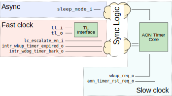

# AON Timer DV Document

This documents describes the verification for AON_TIMER as a block-level IP.

## Useful links
* [AON Timer HWIP technical specification](../README.md).
* [Testplan](#testplan)
* [Simulation results](https://reports.opentitan.org/hw/ip/aon_timer/dv/latest/report.html)
* [HW landing page](../../../README.md)
* [HW/DV development stages](../../../../doc/project_governance/development_stages.md)

## Testbench architecture

The testbench is based on the [CIP testbench architecture](../../../dv/sv/cip_lib/README.md).

### Block diagram


### Block-level Testbench

The block's testbench top is located at `hw/ip/aon_timer/dv/tb/tb.sv`.
It instantiates the `aon_timer` DUT module, defined at `hw/ip/aon_timer/rtl/aon_timer.sv`.

In addition, it instantiates the following interfaces, connects them to the DUT and registers their handles in `uvm_config_db`:
* A [clock and reset interface](../../../dv/sv/common_ifs/README.md) for the fast clock
* A [clock and reset interface](../../../dv/sv/common_ifs/README.md) for the AON clock
* A [TileLink host interface](../../../dv/sv/tl_agent/README.md)
  The AON timer IP exposes a TL device interface.
  Here, the testbench is acting as the host CPU; in the OpenTitan SoC, this will be the Ibex core
* A [Pins inteface](../../../dv/sv/common_ifs/README.md) with two interrupts (wakeup timer; watchdog bark) in the fast clock domain
* A [Pins inteface](../../../dv/sv/common_ifs/README.md) with two interrupts (wakeup timer; watchdog bite) in the AON clock domain
* A [Pins inteface](../../../dv/sv/common_ifs/README.md) for the sleep mode input
* A [Pins inteface](../../../dv/sv/common_ifs/README.md) for the LC escalate input


The AON timer uses three clock domains (`async`, `clk_i` and `clk_aon_i`), with synchronisation logic between them.
The following diagram shows the different inputs and outputs for the module and in which clock domain each resides.



In order to model the RTL behavior, the TB doesn't attempt to predict when will occur a clock domain crossing.
Instead models the delays on each side of the clock and does a backdoor read to ensure when a value has indeed crossed domains.


### TileLink agent

In order to communicate through the register interface, the testbench uses the [tl_agent](../../../dv/sv/tl_agent/README.md) that is instantiated in the CIP base environment.
The Tilelink agent is also used by generic test sequences to exercise the register interface.

### UVM RAL Model
The `aon_timer` RAL model is created with the [`ralgen`](../../../dv/tools/ralgen/README.md) FuseSoC generator script automatically when the simulation is at the build stage.

It can be created manually by invoking [`regtool`](../../../../util/reggen/doc/setup_and_use.md).
Running
```
util/regtool.py -s -t . hw/ip/aon_timer/data/aon_timer.hjson
```
will generate `aon_timer_ral_pkg.core` and `aon_timer_ral_pkg.sv` in the current directory.

### Stimulus strategy

We want to see timers expire without waiting too long, but we also want to check the counter for large values.
To get this right, we normally set up tests as follows:

- Pick a threshold value
- Pick a start count slightly below the threshold value

Occasionally, we'll pick a start count above the threshold value, to make sure nothing triggers when it shouldn't.
To ensure the TB exercises the beginning, middle and end value ranges for threshold and count
registers, the threshold has a constraint such that makes more likely to hit those scenario.

#### Test sequences

The test sequences can be found in `hw/ip/aon_timer/dv/env/seq_lib`. The hierarchy consists of a
base vseq called `aon_timer_base_vseq` and from which most of the child sequences inherit from.
The sequences available are:
 - aon_timer_base_vseq: does not have a body and rather defines common functionality to be used in child Vseqs
 - aon_timer_smoke_vseq: extends from base vseq and serves as stimuli for the TB.
   This sequence initialises, configures the counters and waits for an interrupt disabling the counters.
   This Vseq also tests the `pause_in_sleep` feature.
 - aon_timer_jump_vseq: similar to the smoke vseq, but without testing the `pause_in_sleep` feature.
 - aon_timer_prescaler_vseq: similar to the smoke vseq, but also configuring the prescaler for the WKUP counter.
 - aon_timer_smoke_max_thold_vseq: like the smoke vseq but constraining the thresholds to the maximum value.
 - aon_timer_smoke_min_thold_vseq: like the smoke vseq but constraining the thresholds to the minimum value.
 - aon_timer_custom_intr_vseq: ad-hoc sequence which helps hitting cross-coverage for intr_test, intr_state and the enable for each counter.
 - aon_timer_wkup_count_cdc_hi_vseq: ad-hoc sequence to help close coverage related to the upper-32 bits of the WKUP counter which is implemenented as two separate 32-bit counters (lo/hi).
 - aon_timer_stress_all_vseq: stress all vseq for aon_timer.


#### Functional coverage

To ensure high quality constrained random stimulus, it is necessary to develop a functional coverage model.
The following cover points have been developed to prove that the test intent has been adequately met.

Covergroup `timer_cfg_cg`:

- `prescale_cp`: Includes possible values for the prescale register of wakeup timer.

- `bark_thold_cp`: Includes bark threshold configurations of watchdog timer.

- `bite_thold_cp`: Includes bite threshold configurations of watchdog timer.

- `wkup_thold_cp`: Includes threshold configurations of wakeup timer.

- `wkup_cause_cp`: Makes sure if we ever clear the wakeup interrupt by writing to `WKUP_CAUSE` register.

- `wdog_regwen_cp`: Makes sure if the locking feature of watchdog timer is enabled in any test.

- `pause_in_sleep_cp`: Makes sure if the pause in sleep mode feature of watchdog timer is enabled in any test.

Covergroup `wake_up_timer_thold_hit_cg`:

- `wkup_count_cp`: samples WKUP count.

- `wkup_thold_cp`: samples WKUP threshold.

- `wkup_int_cp`: samples whether an interupt was generated.

- `wkup_thold_cpXwkup_int_cp`: crosses the threshold and interrupt (count is implicit).

Covergroup `watchdog_timer_bite_thold_hit_cg`:

- `wdog_count_cp`: samples WDOG count.

- `wdog_thold_cp`: samples WDOG threshold.

- `wdog_bite_rst_cp`: samples bite WDOG interrupt.

- `wdog_thold_cpXwdog_bite_rst`: Crosses the threshold and interrupt (count is implicit).

Covergroup `watchdog_timer_bark_thold_hit_cg`

- `wdog_count_cp`: samples WDOG count.

- `wdog_thold_cp`: samples WDOG threshold.

- `wdog_bark_rst_cp`: samples bark WDOG interrupt.

- `wdog_thold_cpXwdog_bite_rst`: Crosses the threshold and interrupt (count is implicit).

The covergroups below are reused from agents and common packages.
Covergroup `tl_a_chan_cov_cg`:

- `cp_mask`: samples the mask.

- `cp_opcode`: samples the opcode.

- `cp_size`: samples the size.

- `cp_source`: samples the source

- `tl_a_chan_cov_cg_cc`: cross-coverage of all

Covergroup `pending_req_on_rst_cg`:

- `cp_req_pending`: samples if there's a TL access mid-reset.

Covergroup `max_outstanding_cg`:

- `cp_num_of_outstanding`: samples outstanding transactions on TL bus.

Covergroup `dv_base_lockable_field_cov`:

- `cp_regwen`: samples if a lockable field has been set.

Covergroup `bit_toggle_cg_wrap` is reused for several conditions.
PuFullData opcode with wrong size, address not align with the mask, address not align with the size, an invalid opcode, a mask not enabled in the correct lanes, a size greater than the maximum.
The coverpoints are:

- `cp_transition`: samples a value transition rising/falling.

- `cp_value`: samples a value

Covergroup `tl_intg_err_cg_wrap`:

- `cp_is_mem`: not applicable since there's no memory.

- `cp_num_cmd_err_bits`: samples ecc error in the command.

- `cp_num_data_err_bits`: samples ecc error in the data.

- `cp_tl_intg_err_type`: sampled the type of integrity error.

Covergroup `tl_errors_cg_wrap`:

- `cp_csr_size_err`: samples an CSR size error.

- `cp_instr_byte_err`: samples an instruction byte error.

- `cp_mem_*`: not applicable since there's no memory.

- `cp_tl_protocol_err`: samples a TL protocol error.

- `cp_unmapped_err`: samples an unmapped error.

- `cp_write_w_intr_type_err`: samples a write with an interrupt type error.

Covergroup `intr_test_cg`:

- `cp_intr`: samples an interrupt.

- `cp_intr_en`: samples an interrupt enable.

- `cp_intr_state`: samples intr_state register.

- `cp_intr_test`: samples intr_test register.

Covergroup `intr_pins_cg`:

- `cp_intr_pin`: Samples the interrupt pin.

- `cp_intr_pin_value`: Samples the value for a given interrupt pin.

Covergroup `intr_cg`:

- `cp_intr`: Samples the interrupt.

- `cp_intr_en`: Samples the interrupt enabled (WDOG/WKUP enable for aon_timer).

- `cp_intr_state`: Samples the intr_state register.

### Self-checking strategy
#### Scoreboard

As described earlier in this document, the self-checking strategy is in two parts.
The first part of the strategy is to track the domain crossing logic and check that values propagate across unmodified and reasonably quickly.
This does not include precise modelling for the CDC timing.

The second part of the self-checking logic looks at the configuration registers of the timers.
After calculating the amount of clock cycles, it starts checking for an interrupt from either wake-up timer or watchdog timer.
Here, there is a single clock domain (the AON clock) and easily predictable behaviour.
The scoreboard contains an exact model of how the interrupts generated from this specific configuration.

Putting the two parts of the scoreboard together gives a full checker for the block.
An incoming configuration write will be tracked through the CDC logic.
Once it takes effect in the core (the scoreboard determines when the values have propagated via back-door reads), the second part of the scoreboard will check that things behave correctly.
Finally, outputs (in the form of configuration register updates or interrupts) will be tracked by the first part of the scoreboard as they go back through the CDC logic and, eventually, make it out to the top-level.
The scoreboard is also reset aware.

#### Assertions

TLUL protocol assertions are checked by binding the [TL-UL protocol checker](../../tlul/doc/TlulProtocolChecker.md) into the design.

Outputs are also checked for `'X` values by assertions in the design RTL.

## Building and running tests

Tests can be run with [`dvsim.py`](../../../../util/dvsim/README.md).
The link gives details of the tool's features and command line arguments.
To run a basic smoke test, go to the top of the repository and run:
```console
$ util/dvsim/dvsim.py hw/ip/aon_timer/dv/aon_timer_sim_cfg.hjson -i aon_timer_smoke
```


## Testplan
[Testplan](../data/aon_timer_testplan.hjson)

## Future improvements

To make better verification component reuse, the TB could:
- use agents instead of interfaces directly
- have a separate predictor and checking boundaries.
