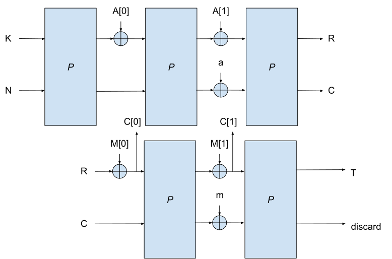
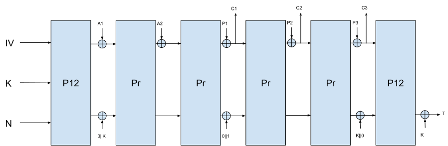

## Background

This section provides simple diagrams on Sponge, Ascon, round based implementations, and the round function.
It describes the basic principles of Sponge and Ascon.
It also lists some performance figures from different (existing) implementations.

#### Duplex Sponge

A cryptographic public permutation is a cryptographic primitive that efficiently applies a permutation over b-bit blocks.
The description of the permutation itself is fully public (unlike block ciphers that take a secret input) and the security stems from how the permutation is used.
The duplex sponge construction[^2] is a popular method for implementing keyed primitives, such as Authenticated Encryption with Associated Data (AEAD)[^3] from public permutations.
For a full description of the duplex construction and its applications we refer to[^4].
Figure 1 depicts a simplified version of an AEAD using the duplex construction.
The state of the algorithm is initialized by concatenating the secret key K and a nonce N, then applying the cryptographic permutation.
Then, the state is divided into a r-bit rate and a c-bit capacity.
The associated data A and the input M are divided into blocks and the blocks are XORed with the rate.
The input corresponds to the plaintext P for encryption and to the ciphertext C for decryption.
To avoid certain attacks while making the scheme slightly more efficient, the different stages (initialization, processing of the associated data, processing of the message) must be separated by a value a and m added to the capacity c. This is known as Monkey Sponge[^5].
After each block is XORed, the permutation is applied.
After all the blocks have been absorbed, the permutation is applied again and the t-bit authentication tag is extracted.
In Figure 1, the tag consists of one block, so size of tag t=r.

Fig 1. Simplified view of the duplex construction.

## Ascon AEAD

Ascon AEAD, depicted in Figure 2, is inspired by the duplex construction using Ascon-p, where the state size is 320 bits, with a few changes.
First, two similar permutations are used instead of 1, where P12 is used for the initialization and finalization (first and last calls)
and is expected to be significantly stronger than Pr, which is used for all other calls.
Both permutations are similar in terms of implementations but P12 consists of 12 rounds, while Pr consists of either 6 or 8 rounds, depending on the variant used.
This strategy is typically known as proof-then-prune strategy, where a theoretical construction (in this case duplex sponge) is shown to be secure using ideal primitives,
then in practice non-ideal primitives are used, taking into account that the adversary is limited in how they can target the primitive when used inside the full construction.
The first call, for instance, absorbs the secret key and and nonce, and a strong primitive is needed to ensure enough unpredictability in the state after applying the permutation.
For subsequent calls, only r bits are added to the secret state, where r = 64 or 128 bits. Due to the limited degrees of freedom in these calls,
Pr uses 6 rounds if r = 64 bits and 8 rounds if r = 128 bits.These are dubbed Ascon-128 and Ascon-128a, respectively.

Fig.2 Ascon AEAD block diagram.

The second difference between Ascon and duplex sponge is that the secret key is added to the capacity in 3 locations:
after the first call to P12, before the last call to P12 and after the last call to P12.
The third difference is that the tag is extracted from the bottom 128 bits of the output, irrespective of the rate size.
These differences are meant to provide Ascon with inherent security against certain classes of side-channel attacks.
For example, if the input/output of any of the calls to Pb is leaked, the adversary can only use this information to decrypt the message for which the leak occurred,
and cannot use this information to recover the key, since the initialization and finalization are hard to invert.

Another useful security feature of Ascon AEAD is its nonce-misuse-resilience. For normal operation, the nonce must not be repeated for two different messages.
However, such nonce repetitions may occur in practice, either intentionally or unintentionally.
If P12 and Pr are ideal primitives, then Ascon ensures that repeating the nonce more than once only leaks information about plaintexts encrypted with that nonce.
Since Ascon is based on the sponge construction, forging a new ciphertext from the misused nonces is similar to finding a collision on a sponge-based hash function, which is believed to be hard.
Besides, the strong initialization function ensures that for nonces that have not been misused, no information is leaked. In other words, misusing the nonce only allows decrypting messages that have been encrypted using misused nonces, but does not allow key recovery, forgery or decrypting any other messages.
In practice, P12 and Pr are not ideal, but the best known attack using nonce misuse[^6], on top decrypting messages encrypted with misused nonces,
leaks the internal state using 240 ciphertexts with misused nonces. However, as we discussed, leaking the state does not directly lead to forgery or key recovery.
Hence, the effect of this attack over generic attacks is minimal.

[^2]: Duplexing the sponge: single-pass authenticated encryption and other applications - Cryptology ePrint Archive. Retrieved August 18, 2023, from [https://eprint.iacr.org/2011/499](https://eprint.iacr.org/2011/499)

[^3]: Authenticated-Encryption with Associated-Data - UC Davis. Retrieved August 18, 2023, from [https://web.cs.ucdavis.edu/~rogaway/papers/ad.pdf](https://web.cs.ucdavis.edu/~rogaway/papers/ad.pdf)

[^4]: View of Understanding the Duplex and Its Security. Retrieved August 18, 2023, from [https://tosc.iacr.org/index.php/ToSC/article/view/10976/10410](https://tosc.iacr.org/index.php/ToSC/article/view/10976/10410)

[^5]: "Understanding the Duplex and Its Security - Cryptology ePrint Archive." [https://eprint.iacr.org/2022/1340](https://eprint.iacr.org/2022/1340). Accessed 21 Aug. 2023.
