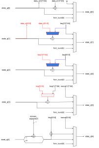
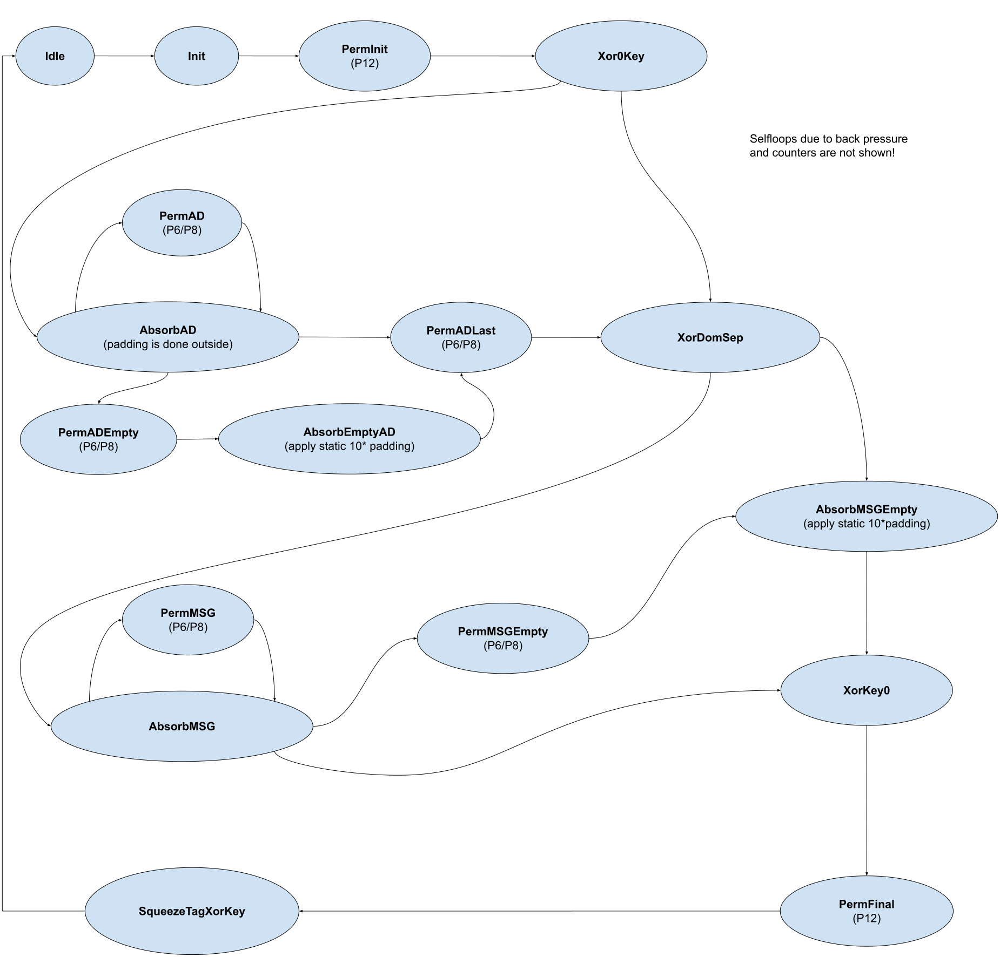

# Theory of Operation

## Data Flow

The internal Ascon core (we shall refer to as “core”) remains idle, until the FSM receives a start signal with either an encrypt or decrypt command.
The core expects that the key and nonce inputs have been initialized and uses them to initialize the duplex state and run P12.

If associated data (AD) is of non-zero length, it absorbs a sequence of blocks of A and runs Pr in between.
It waits between Pr calls in case the next block is not available.
If adlen=0 (advalid = 1) it skips to the next phase.

If AD is skipped or finished, the core performs domain separation and expects plaintext blocks.
If the message length is zero, it still needs to insert one empty (1||0^{63/127}) block and mask the state as in Fig 2.
Finally, P12 is applied one more time and the tag is extracted.

When the tag and/or ciphertext/plaintext are not being outputted, their respective buses must be all 0s.

Because of the difference and separation between applying the permutation iteratively, and absorbing/extracting inputs and outputs.
The state register interacts with two main logic circuits: the duplex switch and the round function, with a multiplexer selecting between the two.

## Block Diagram

The internal Ascon Flow

## Design Details

This section discusses different design details of the Ascon module.

### Datapath Architecture and Operation

As a first version, we propose an unhardened **320-bit data-path 1 round/cycle hardware implementation**.
This version can then be extended to a hardened one in a second step.
DOM seems very promising due to the relatively low area overhead for first order masking. However this is still TBD.

Reason for 1 round/cycle architecture:

* Reducing area further complicates datapath:  Since a one-round per cycle implementation is in the range of only 7kGE, further reductions seem unnecessary.
A 30% decrease in area from serializing the s-box would incur a 600% overhead in runtime.
The area of the datapath of cryptographic engines is often dominated by the S-Box.
In contrast to AES, Ascon’s S-box needs one bit of each 64-bit word at a time.
So a smaller datapath would require a lot of multiplexing.
An implementation with only one S-Box would require 5 64-to-1 multiplexers.
* Further unrolling for more speed in trade for area is not reasonable due to masking:
An unrolled version with multiple rounds per cycle would be possible in terms of latency.
However, as we target an DOM-hardened version eventually, which requires registers anyways,
the speed-up would only apply for the unhardened version since the hardened datapath cannot compute multiple rounds per cycle.
* Note that pipelining is not reasonable since every subsequent application of the multi-round permutation requires the preceding one to finish for its input values.

Further reasoning and examples can be found further down in the document.

For the unhardened version we expect the following area and throughput results:

* Area estimation: From prior experiments and FPGA synthesis we derive that an ASCON-128 based PRF requires 391 FFs plus 128 bit for key.
    * Based on a factor of 4.7 GE per FF and a x2.5 factor from sequential to total area, an area estimation leads to: 6098 GE which is very small compared to our protected AES core at 110 kGE.
* Throughput estimation (based on one block in a long message so that overhead of initialization and finalization is disregarded):
    * At 1 GHz, target throughput requirement could be in the range of 200-400 Mbit/s (QSPI clocked at 50-100 MHz; see [this google doc](https://docs.google.com/document/d/1CNwS8OiEX3GJMBKVt5GXsaVuTNvCLiqly4vU8QOrftI/edit#heading=h.mxfutee66933)). This means for
        * one block of 64 bits, we have 160-320 clock cycles.
        * One block of 128 bits, we have 320-640 clock cycles.
    * With a 1 round per cycle implementation, we can process 64 bits in 6 cycles and 128 in 8 cycles.
    * There is a huge positive margin of > x26 between the target throughput and the achieved throughput of an unprotected implementation.
    It seems a protected implementation will easily fit the throughput requirements, as we expect to only double the cycles per masked round transformation.

### Ascon Round

The internal permutation of Ascon, dubbed Ascon-p, is a Substitution-Permutation Network (SPN) over 320 bits.
The 320 bits are split into five 64-bit words, named X0 to X4.

First, a round constant is added to one byte of the state.
The constant is decided based on the version of the permutation applied and the round order.
Particularly, Ascon specification defines 12 constants added to x2, which are:

00000000000000f0

00000000000000e1

00000000000000d2

00000000000000c3

00000000000000b4

00000000000000a5

0000000000000096

0000000000000087

0000000000000078

0000000000000069

000000000000005a

000000000000004b

For a permutation of 12 rounds, the rounds are counted from 0 to 11.
For a permutation of 8 rounds, the rounds are counted from 4 to 11.
For a permutation of 6 rounds, the rounds are counted from 6 to 11.
The last round constant is always 000000000000004b.
The rnd selector is a control signal that determines the round constant and is generated by the FSM based on the version of the algorithm and which part of the computation is being performed.

Second, the non-linear substitution is applied.
In contrast to AES, it is not applied bytewise on words, but bitwise over all words.
This means all bits with the same index are substituted at the same time.
Hence, as there are five words, the sbox consists of five inputs and outputs.
To perform a complete substitution the Sbox must be applied 64 times.
This can be done either in parallel or in sequential order.
Figure 3 depicts an implementation of one S-Box.

Fig.3. S-Box Operation

Next, a linear operation is applied on each word. Each word gets XORed with two cyclic rotated copies of itself, as follows:

_x0_ := _x0_ ⊕ (_x0_ ⋙ 19) ⊕ (_x0_ ⋙ 28)

_x1_ := _x1_ ⊕ (_x1_ ⋙ 61) ⊕ (_x1_ ⋙ 39)

_x2_ := _x2_ ⊕ (_x2_ ⋙   1) ⊕ (_x2_ ⋙   6)

_x3_ := _x3_ ⊕ (_x3_ ⋙ 10) ⊕ (_x3_ ⋙ 17)

_x4_ := _x4_ ⊕ (_x4_ ⋙   7) ⊕ (_x4_ ⋙ 41)

These three operations are together known as the round function and are repeated 12 times for Pa, while they are repeated either 6 or 8 times for Pb, depending on the rate.

### Duplex Switch

This block performs the operations that occur before, after or in between permutation calls, sometimes referred to as the Duplex phases.
The following figures show the internal structure of the five 64 bit words of the 320 bit state.
The blue parts are needed for Ascon 128, the red parts for Ascon128a.
The overhead to support both variants are basically three 2-to-1 64-bit muxes.

### Tag Compare

This block compares the generated tag with the expected one.

### State Multiplexer

This selects whether a duplex operation or a permutation round is being performed.

### State Register

This register stores the main duplex/permutation 320-bit state.
The update signal is generated by the FSM and when low, the register must maintain its current state.

### Finite State Machine

## Data Formatting

Data is expected to be byte aligned and little endian.
The amount of valid bytes is indicated by the CTRL.VALID_BYTES register.
Padding is done in hardware.

## Key Manager Interface

By default, the Ascon unit is controlled entirely by the processor.
The processor writes both input data as well as the initial key to dedicated registers via the system bus interconnect.

Alternatively, the processor can configure the Ascon unit to use an initial key provided by the [key manager](https://opentitan.org/book/hw/ip/keymgr/index.html) via key sideload interface without exposing the key to the processor or other hosts attached to the system bus interconnect.
To this end, the processor has to set the CTRL.sideload_key bit to 1.
Any write operations of the processor to the Initial Key registers KEY_SHARE0 and KEY_SHARE1 are then ignored.
In normal/automatic mode, the Ascon unit only starts encryption/decryption if the sideload key is marked as valid.
To update the sideload key, the processor has to 1) wait for the Ascon unit to become idle, 2) wait for the key manager to update the sideload key and assert the valid signal,
and 3) write to the CTRL.sideload_key register to start a new message.
After using a sideload key, the processor has to trigger the wiping of all key registers inside the Ascon unit.

## (No) App Manager

There will be no App Manager Interface to share the Ascon IP between multiple other IPs or use cases like importing or exporting of Key Slots (keymgr_dpe).
Reasons for that are the added complexity compared to the expected gain in area saving.
Ascon is expected to have about 7 kGe (unhardened) and 14 to 28 kGE (hardened).
In Contrast AES needs 112 kGE and KMAC 200 kGE.
It therefore seems reasonable to instantiate the Ascon Core multiple times in different use cases like comportable IP, integrated within the DMA controller, etc.

## Security Hardening

The first version only comes with very basic security hardenings that are easy to implement.
There will be a second version with more security features in place.

TBD

### Side Channel Analysis

To deter side-channel analysis (SCA), the Ascon unit implements the following countermeasures.

#### 1st-order Masking of the Cipher Core

Tbd. We plan to use DOM here.

#### Fully parallel Data Path

Tbd. Same reasoning as for AES.

#### Note on Reset vs. Non-Reset Flip-flops

Tbd.

#### Wiping Registers with Pseudo-Random Data

Tbd.

### Fault Injection

Tbd.

#### Control Path

* Sparsely encoded FSM
* Mubi for critical signals
* Shadow registers for CTRL
* Hardened round counter

#### Data Path

The aim of fault attacks on the data path is typically to extract information on the key by means of statistical analysis.
The current version of the Ascon unit does not employ countermeasures against such attacks, but future versions most likely will.

[^6]: Practical Cube Attack against Nonce-Misused Ascon. Retrieved August 18, 2023, from [https://tosc.iacr.org/index.php/ToSC/article/download/9974/9472/8678](https://tosc.iacr.org/index.php/ToSC/article/download/9974/9472/8678)
