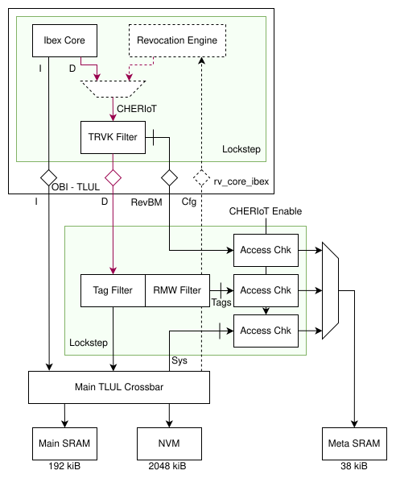

# Theory of Operation

## Block Diagram

| Port | Direction | Peer | Purpose |
|------|-----------|------|---------|
| `cored_tl_d`   | device | `rv_core_ibex`   | Core data accesses with the capability tag support. |
| `cored_tl_h`   | host   | `xbar_main`      | The data half of the access, forwarded to SRAM, NVM and peripherals. |
| `trbe_tl_h`    | host   | `xbar_main`      | Read-only port of the revocation engine towards the SRAMs holding capabilities. |
| `corerevbm_tl` | device | `rv_core_ibex`   | Revocation bitmap reads from the core's TRVK filter. |
| `revbm_tl_d`   | device | `xbar_main`      | Memory window through which software reads and writes the revocation bitmap. |
| `regs_tl_d`    | device | `xbar_main`      | CSR interface. |
| `meta_sram_tl` | host   | `sram_ctrl_meta` | The single port into the unified meta SRAM. |

`cheriot_ena_i` selects the execution mode. It is a `mubi4_t` driven by the write-once mode switch in
`rv_core_ibex`.

## Metadata Encoding

Two kinds of metadata are stored, both at bit granularity, both packed into 32-bit words:

| Metadata | Covered by one bit | Covered by one 32-bit word |
|----------|--------------------|----------------------------|
| Capability tag  | one 8-byte capability | 256 bytes of data |
| Revocation bit  | 8 heap bytes          | 256 heap bytes    |

## Meta SRAM Address Map

The map is derived from the address-map parameters, so it changes with the covered region sizes.
For Earl Grey - 192 KiB main SRAM at `0x1000_0000`, 2 MiB NVM at `0x3000_0000`, meta SRAM at
`0x1100_0000` - it is:

| Offset  | Size   | Region                             | Reachable from |
|---------|--------|------------------------------------|----------------|
| `0x0000` | 3 KiB  | Main SRAM revocation bitmap        | `revbm_tl_d`, `corerevbm_tl` |
| `0x0C00` | 32 KiB | NVM capability tags                | RMW filter |
| `0x8C00` | 3 KiB  | Main SRAM capability tags          | RMW filter |
| `0x9800` | -      | top                                | - |

The revocation bitmap is situated at the base of the meta SRAM.
The `revbm` window and the meta SRAM's own RAM interface consequently share a base address; the
window is the software-visible view of the first region, the RAM interface is only reachable from
`meta_sram_tl`.

In the `revbm` window, bit `b` of word `w` covers the eight heap bytes starting at
`MainSramBaseAddr + (w * 32 + b) * 8`, setting it marks that granule as revoked. Accesses must be
full 32-bit words, and the window returns a TL-UL error while the system is in ePMP mode.

## Datapath

### Tag Filter

The tag filter forks each core data access into up to three streams, the host port, the meta port,
and a small metadata FIFO that carries information from the request to the response channel. After
receiving the responses, the streams are joined together and the data response is returned to the
core.

A meta lookup is needed when CHERIoT mode is enabled, the access targets memory capable of
holding capabilities, and either:

- the access is a 64-bit-aligned read that the core hints as a capability load.
- the access is a write, of any kind.

Writes always look up because a non-capability store must clear the tag of the location it
overwrites.

The returned tag is sticky across the two words of a capability: on a response whose FIFO entry was
marked aligned, the tag read from the meta SRAM is presented and captured; on the following unaligned
response the captured value is presented again and then cleared. This is what lets a 65-bit
capability arrive over two 32-bit responses with one combined validity tag bit.

The FIFO depth sets the number of outstanding transactions the subsystem supports; it is fixed to two,
matching Ibex's LSU, which never issues more than two outstanding split-access halves. Error
responses from either the host or the meta path are merged into `d_error` towards the core.

The meta response is accepted into a buffer, and the join consumes it from there. The fork hands
out its three streams independently, so it can issue one lookup while the metadata FIFO is full.
At most one lookup more than the FIFO depth is therefore unjoined, and the buffer is one entry
deeper than the FIFO, so it never refuses a response (`MetaRspAlwaysAccepted_A`). The meta path
therefore never waits for a data response: with two tag filters sharing the RMW filter, and the
data paths of both reaching the same in-order SRAMs, a meta response held until its data response
arrives could wait on a data response that is itself queued behind the other tag filter's.

A write forks into its data write and its tag update independently. If one of them fails, the core
receives `d_error`, but the other half is not undone: a failed data write still updates the tag, and
a failed tag update leaves the old tag next to the new data. Software must treat a location whose
store was answered with an error as holding a stale tag.

### RMW Filter

Because tags are bit-granular, a tag write cannot be a plain TL-UL write. The RMW filter turns each
access into meta SRAM traffic with a four-state FSM:

| State | Behaviour |
|-------|-----------|
| `Passthrough`  | A read is forwarded and the tag bit is picked out of the response word. A write is turned into a `Get` of the meta word and the FSM advances to `Fill`. |
| `Fill`         | The meta word arrives. If the stored tag bit already equals the tag to be written, the read response is converted into an `AccessAck` towards the core and the FSM returns to `Passthrough`. Otherwise the word is captured, the bit is modified, and the FSM advances. |
| `WriteBackReq` | The modified word is written back with `PutFullData` and freshly computed command and data integrity. |
| `WriteBackAck` | The write response is forwarded to the core and the FSM returns to `Passthrough`. |

Skipping the write-back is the common case and keeps pressure off the shared meta SRAM: it costs one
meta SRAM read per 32-bit store, and a read plus a write only when the tag actually changes.

The filter checks the response integrity and response data integrity of every meta SRAM response
and separately reports `d_error`.

The filter holds the state of a single operation, so it takes a new request only while no
operation is unanswered, including in the cycle an answer is handed over. The meta SRAM reads and
writes it issues for a write carry the requester's `a_source`, so every answer returns to the tag
filter that sent the request.

The RMW filter serves two tag filters, the core's and the revocation engine's: a `cheriot_socket_m1`
arbitrates their meta ports, carrying the tag and bit select sideband, onto the single RMW filter,
so every tag update of the subsystem goes through one read-modify-write.

### Revocation Engine

A write of 1 to `TRBE_START` starts a sweep over `TRBE_NUM_CAPS` capabilities from
`TRBE_BASE_ADDR`, if `TRBE_NUM_CAPS` is not zero, `TRBE_BASE_ADDR` lies in the tagged SRAM range
(`MainSramBaseAddr` up to `MainSramTopAddr`), and the subsystem is in CHERIoT mode (a strict
`MuBi4True` on `cheriot_ena_i`). Any other start is ignored and leaves `TRBE_BUSY` and
`TRBE_REGWEN` unchanged. `TRBE_BUSY` is set until every capability of the sweep is resolved, and
while it is set `TRBE_REGWEN` locks the three registers.

The engine reads both words of every capability, one word at a time, with the capability-load hint,
through a TRVK filter of its own and a tag filter of its own, over `trbe_tl_h`. The TRVK filter
applies the load barrier: a tagged capability that is not a sealing capability and whose base has
its revocation bit set is revoked, and so is one whose bitmap lookup fails. For every revoked
capability the engine clears the tag through its tag filter, which never forwards a write to
`trbe_tl_h`: the engine does not modify memory data.

A sweep that would reach past `MainSramTopAddr` ends there: the engine sweeps
`min(TRBE_NUM_CAPS, (MainSramTopAddr - TRBE_BASE_ADDR) / 8)` capabilities, and `TRBE_NUM_CAPS`
keeps the value software wrote. A sweep therefore never leaves the tagged SRAM range.

### Access Checkers

Each of the four requesters passes an access checker parameterized with the region it owns. An
access is forwarded only if all of the following hold:

- `cheriot_ena_i` is `MuBi4True`.
- The address is inside the allowable region for the requester.
- The address is word-aligned and the access is a full 32-bit word.
- The opcode is `Get` or `PutFullData`.

Everything else is steered to a `tlul_err_resp` instance and answered with a TL-UL error. In
particular, any `cheriot_ena_i` value other than a strict `MuBi4True` - including a strict
`MuBi4False` - makes the entire meta SRAM inaccessible from all three ports.

### Arbitration

A `tlul_socket_m1` arbitrates the four checked streams onto `meta_sram_tl`. Arbitration sits behind
the checkers, on transactions that are already integrity-protected end to end.

## System Bus Access

The debug module's system bus access (SBA) port is a crossbar host of its own and does not pass through the tag filter, so none of the datapath above applies to it.
SBA remains available in CHERIoT mode if the life cycle state allows debug, but:

- reads and writes go straight to memory without any CHERIoT checks.
- writes do not clear the capability tag of the location they overwrite.

Debug accesses in CHERIoT-mode ***MUST*** therefore be performed through Ibex and not through SBA.

## Error Handling

The subsystem distinguishes a denied access from a fault:

| Cause | Result |
|-------|--------|
| Any meta SRAM access while in ePMP mode | TL-UL error response, merged into `d_error` towards the core |
| Access outside the region owned by the requesting port | TL-UL error response |
| `PutPartialData` to the meta SRAM | TL-UL error response |
| Device error on the tag path | Read-modify-write aborted, `d_error` towards the core, and `fatal_fault` alert |
| Integrity fault on a meta SRAM response (`rsp_intg` or `data_intg`) | `fatal_fault` alert |
| Integrity fault on the CSR interface | `fatal_fault` alert |
| Error or integrity fault on a response to the revocation engine | `fatal_fault` alert |
| Error, integrity fault or malformed response on a revocation engine bitmap lookup | Capability counted as revoked, and `fatal_fault` alert |

The first three are reachable by software and surface as a bus fault in the core, so they must not
raise an alert. The others latch the fatal alert until reset; a sweep that could not be completed
correctly must not look successful. There is no interrupt.

## Timing

All internal sockets and the socket towards the meta SRAM are instantiated with zero-depth FIFOs, so
a request propagates combinationally from `cored_tl_d` through the tag filter, RMW filter, access
checker and arbiter to `meta_sram_tl`, and the response propagates back the same way. This keeps the
latency overhead of CHERIoT mode at zero cycles for reads, but places the meta SRAM path on the
critical path.

The design provisions optional pipeline cuts in front of the access checkers to break that path, at
the cost of two extra cycles per meta SRAM access. They are not implemented yet.
