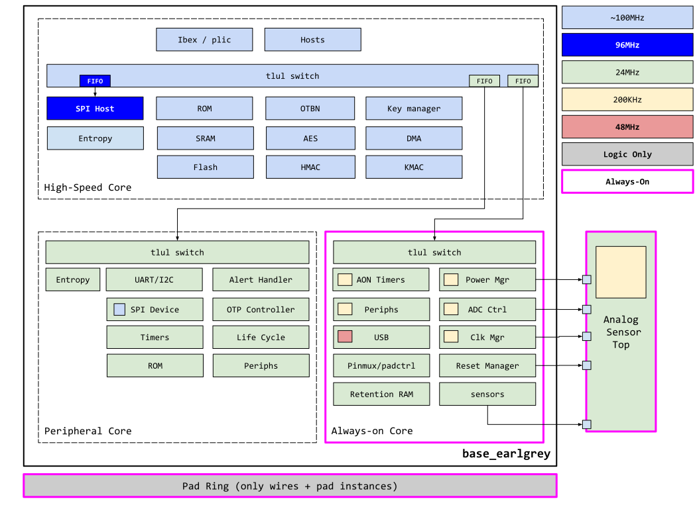
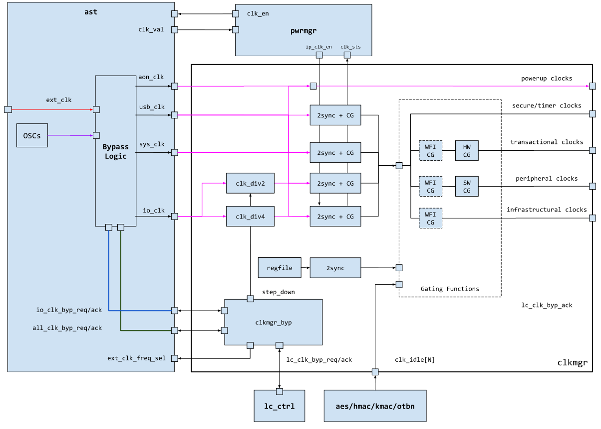

# Overview

This document specifies the functionality of the OpenTitan clock manager.

## Features

- Attribute based controls of OpenTitan clocks.
- Minimal software clock controls to reduce risks in clock manipulation.

# Theory of Operation

Clock management in OpenTitan is divided into groups.
Each group has specific attributes and controls whether software is allowed to influence individual clocks during the active power state.
For low power states, please see [power manager]().

The grouping is derived from the chip partition and related security properties.
For illustrative purposes, this document uses the following assumed chip partition

The actual partition may differ per design, however the general principles are assumed to be the same.
Each group can be made up of more than 1 source clock.
The clocks themselves may be asynchronous - the grouping is thus a logical grouping instead of a physical one.

The grouping is summarized in the table below and described in more detail afterwards.
The table shows the group name, the modules that belong to each group, and whether SW can directly (via register control) or indirectly (via wait-for-interrupt) influence the state of the clock in the form of clock gating.

| Group           | Frequencies                    | Modules                                                        | Software       | Wait for Interrupt |
| -------------   | ------------------------------ | -------------------------------------------------------------- | -------------- | ------------------ |
| Power-up        | 100~200KHz, 24MHz              | Clock Manager, Power Manager, Reset Manager                    | No             | No                 |
| Transactional   | ~100MHz                        | Aes, Hmac, Key Manager, Otbn                                   | Yes (1)        | Yes (2)            |
| Infrastructural | 24MHz, ~100MHz                 | Fabric, Fabric gaskets (iopmp), Memories                       | No             | Yes (3)            |
| Security        | 24MHz, ~100MHz                 | Alert handler, Entropy, Life cycle, Pinmux, Plic, Sensors      | No             | No                 |
| Peripheral      | 24MHz, 48MHz, 96MHz            | I2c, Spi, Uart, Usb, others                                    | Yes            | Yes                |
| Timers          | 100-200KHz, 24MHz              | AON timers, Timers, Watchdog                                   | No             | No                 |

* 1 - Transactional clock group's software control is only a software hint.
* 2 - Transactional clock group's wait-for-interrupt control is only a hint.
* 3 - May require additional complexity to handle multi-host (non-wait-for-interrupt) scenarios

## Power-up Clock Group

The group refers to modules responsible for power up, such as power, reset and clock managers.
Large portions of these modules operate to release clocks and resets for the rest of the design, thus cannot operate on gated versions of the clocks themselves.
They are the only group running clocks directly from the source.
All follow groups are derived after root clock gating.
See [block diagram](#block-diagram) for more details.

## Transactional Clock Group

This group refers to the collection of modules that are transactional by nature (example: `Hmac` / `Aes` / `Kmac`).
This means these modules perform specific tasks (for example encrypt, decrypt or hashing).
While performing these tasks, it is unsafe to manipulate or change the clocks.
Once these tasks are complete, the clocks can be safely shut-off.

To ensure such behavior on the clocks, The final clock enable is qualified with an `Idle` indication to signify that a transaction is ongoing and manipulation of the clock is not permitted.
The `Idle` signal must be sourced from the transactional modules and sent to the clock manager.

For this group software can only express its intent to shut-off, and does not have full control over the final state.
This intent is indicated with a register in the clock manager register file, see .

Wait-for-interrupt based control is already a software hint, it can thus be applied to this group with the same `Idle` requirement.

For modules in this group, each module can be individually influenced, and thus each has its own dedicated clock gating logic.
The added benefit of allowing software control in this group is to save power, as some transactional modules can be both power and area hungry.

## Infrastructure Clock Group

This group refers to the collection of modules that support infrastructure functions.

If the clocks to these modules are turned off, there may not be a way to turn them back on and could thus result in system deadlock.
This includes but is not limited to:
* Turning off fabric / gasket clocks, and thus having no way to access the fabric and resume the clock.
* Turning off memory clocks such that there is no way to execute code that would resume the clocks.

For this group, there is no reason to allow software control over the clocks, as it could be used to create a system deadlock where after disabling infrastructure clocks there is no way to turn them back on.
Wait-for-interrupt controls however can be used, as long as there is a way to break the processor out of wait-for-interrupt and handle other bus hosts, while also separating the functional portions from bus access.
See Wait-for-interrupt clock gating for more details.

## Security Clock Group

The security clock group is made up of security modules that either have background functions (entropy, alert manager, sensors) or perform critical security functions where disabling clocks could have unexpected side effects (life cycle, otp, pinmux, plic).

For this group, no software influence over the clock state is allowed during the active state.
The clocks are always running as long as the source is on.

This group is not functionally identical to the power-up group.
The power-up group is run on clocks directly from the clock source, while the security group is derived after root clock gating.

## Timer Clock Group

The timer clock group is composed of modules that track time for various purposes.
As influencing time can change the perspective of software and potentially reveal security vulnerabilities, the clock state for these modules cannot be directly or indirectly influenced by software.

Functionally, this group is identical to the security group.

## Peripheral Clock Group

The peripheral clock group is composed of I/O peripherals modules.
By their nature, I/O peripherals are both transactional and most of the time not security critical - so long as proper care is taken to sandbox peripherals from the system.

These modules can be both directly and indirectly controlled by software.
The controls can also be individual to each peripheral.

## Wait-for-Interrupt (wfi) Gating

Wait-for-interrupt clock gating refers to the mechanism of using a processor’s sleep indication to actively gate off module clocks.
Of the groups enumerated, only transactional, infrastructural and peripheral groups can be influenced by `wfi`.

As `wfi` is effectively a processor clock request, there are subtleties related to its use.
The interaction with each clock group is briefly described below.

### Transactional Clock Group

While `wfi` gating can be applied to this group, the modules in this category are already expected to be turned off and on by software depending on usage.
Specifically, these modules are already completely managed by software when not in use, thus may not see significant benefit from `wfi` gating.

### Peripheral Clock Group

Since peripherals, especially those in device mode, are often operated in an interrupt driven way, the peripheral's core operating clock frequently must stay alive even if the processor is asleep.
This implies that in order for peripherals to completely support `wfi` clock gating, they must be split between functional clocks and bus clocks.

The bus clocks represent the software interface and can be turned off based on `wfi gating`, while the functional clocks should be kept running to ensure outside activity can be captured and interrupts created.
In this scenario, it is important to ensure the functional clocks are responsible for creating interrupts and not the bus clocks, as the latter may not be available during `wfi`.

This division may only be beneficial for peripherals where register and local fabric size is large relative to the functional component.

### Infrastructural Clock Group

This clock group matches `wfi` functionality well.
Most infrastructural components such as fabric, gaskets and memories, have no need to be clocked when the processor is idle.
Some components such as flash controller however would also need to be split into bus and functional halves to support long, background activities while the processor is idle.

However, there are additional complications.
In systems where the processor is not the only bus host, `wfi` can only be used as the software request and not final clock state decision.
Hardware driven requests, such as those coming from a `dma` or any peripheral driven bus host, would also need to be included as part of the equation.
Further, since it is possible hardware may issue requests at the boundary of a clock state changes, additional fabric gaskets would be required to protect hosts when destinations are temporarily clocked off.
The bus requests themselves thus become dynamic clock request signals to help enable components in its path.

There is thus a moderate design and high verification cost to supporting `wfi` gating for the infrastructural group.

## Block Diagram

The following is a high level block diagram of the clock manager.

## Design Details

### Root Clock Gating and Interface with Power Manager

All clock groups except the power-up group run from gated source clocks.
The source clocks are gated off during low power states as controlled by the power manager.
When the power manager makes a clock enable request, the clock manager ensures all root clock gates are enabled before acknowledging.
Likewise, when the power manager makes a clock disable request, the clock manager ensures all root clock gates off disabled before acknowledging.

### Clock Division

Not all clocks are the same frequency as the source.
In cases where there is a frequency mismatch, the clock manager supports clock dividers to step down the frequency.
The divided frequency is not assumed to be synchronous with its source and are thus treated like another asynchronous branch.
Further, the clock dividers are hardwired and have no software control, this is to further ensure there are no simple paths for faulty or malicious software to tamper.

### Wait-for-Interrupt Support

Given the marginal benefits and the increased complexity of `wfi` support, the first version of this design does not support `wfi` gating.
All `wfi CG` modules in the block diagram are thus drawn with dashed lines to indicate it can be theoretically supported but currently not implemented.

It may be added for future more complex systems where there is a need to tightly control infrastructural power consumption as a result from clocks.

# Programmers Guide

There are in general only two software controllable functions in the clock manager.

## Transactional Clock Hints

To enable a transactional clock, set the corresponding hint in  to `1`.
To disable a transactional clock, set the corresponding hint in  to `0`.
Note, a `0` does not indicate clock is actually disabled, software can thus check  for the actual state of the clock.

## Peripheral Clock Controls
To control peripheral clocks, directly change the bits in .

## Register Table


