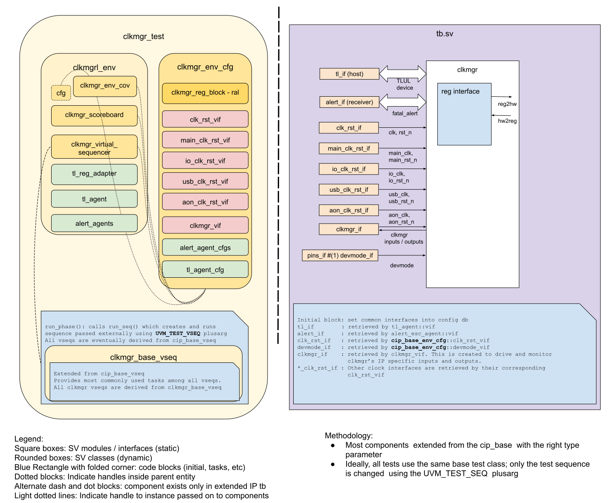

## Goals
* **DV**
  * Verify all CLKMGR IP features by running dynamic simulations with a SV/UVM based testbench.
  * Develop and run all tests based on the [DV plan](#dv-plan) below towards closing code and functional coverage on the IP and all of its sub-modules.
* **FPV**
  * Verify TileLink device protocol compliance with an SVA based testbench.
  * Verify clock gating assertions.

## Current status
* [Design & verification stage]()
  * [HW development stages]()
* [Simulation results](https://reports.opentitan.org/hw/ip/clkmgr/dv/latest/results.html)

## Design features
The detailed information on CLKMGR design features is at [CLKMGR HWIP technical specification]().

## Testbench architecture
CLKMGR testbench has been constructed based on the [CIP testbench architecture]().

### Block diagram


### Top level testbench
Top level testbench is located at `hw/ip/clkmgr/dv/tb.sv`. It instantiates the CLKMGR DUT module `hw/top_earlgrey/ip/clkmgr/rtl/autogen/clkmgr.sv`.
In addition, it instantiates the following interfaces, connects them to the DUT and sets their handle into `uvm_config_db`:

* [Clock and reset interface]()
* [TileLink host interface]()
* CLKMGR IOs: `hw/ip/clkmgr/dv/env/clkmgr_if.sv`

Notice the following interfaces should be connected once the RTL adds support for them:

* Interrupts ([`pins_if`]())
* Alerts ([`alert_esc_if`]())
* Devmode ([`pins_if`]())

### Common DV utility components
The following utilities provide generic helper tasks and functions to perform activities that are common across the project:

* [dv_utils_pkg]()
* [csr_utils_pkg]()

### Global types & methods
All common types and methods defined at the package level can be found in
`clkmgr_env_pkg`. Some of them in use are:

```systemverilog
  typedef virtual clkmgr_if clkmgr_vif;
  typedef virtual clk_rst_if clk_rst_vif;
  typedef enum int {PeriDiv4, PeriDiv2, PeriUsb} peri_e;
  typedef enum int {TransAes, TransHmac, TransKmac, TransOtbn} trans_e;
```
### TL_agent
CLKMGR testbench instantiates (already handled in CIP base env) [tl_agent]()
which provides the ability to drive and independently monitor random traffic via
TL host interface into CLKMGR device.

### UVC/agent 1
[Describe here or add link to its README]

### UVC/agent 2
[Describe here or add link to its README]

### UVM RAL Model
The CLKMGR RAL model is created with the [`ralgen`]() FuseSoC generator script automatically when the simulation is at the build stage.

It can be created manually by invoking [`regtool`]():

### Stimulus strategy
This module is rather simple: the stimulus is just the external pins and the CSR updates.
The tests randomize the inputs and issues CSR updates affecting the specific functions being tested.

#### Test sequences
All test sequences reside in `hw/ip/clkmgr/dv/env/seq_lib`.
The `clkmgr_base_vseq` virtual sequence is extended from `cip_base_vseq` and serves as a starting point.
All test sequences are extended from `clkmgr_base_vseq`.
It provides commonly used handles, variables, functions and tasks that the test sequences can use or call.
Some of the most commonly used tasks / functions are as follows:
* clkmgr_init: Sets the frequencies of the various clocks.

#### Functional coverage
To ensure high quality constrained random stimulus, it is necessary to develop a functional coverage model.
The following covergroups have been developed to prove that the test intent has been adequately met:

* Covergroups for inputs to the peripherals clock gating.
  These are wrapped in class `clkmgr_peri_cg_wrag` and instantiated in `clkmgr_env_cov`.
* Covergroups for inputs to the transactional units clock gating.
  These are wrapped in class `clkmgr_trans_cg_wrag` and instantiated in `clkmgr_env_cov`.

### Self-checking strategy
Given the nature of the CLKMGR module, its functionality can be checked via assertions on its outputs conditioned by both its inputs and CSR values.
The assertions are in the dut interface `ip/hw/clkmgr/dv/env/clkmgr_if.sv`, and are described below.

#### Scoreboard
The `clkmgr_scoreboard` is primarily used to provide CSR updates to the dut interface for the assertions.
It uses the tlul analysis port for this.

#### Assertions
* TLUL assertions: The `tb/clkmgr_bind.sv` binds the `tlul_assert` [assertions]() to the IP to ensure TileLink interface protocol compliance.

* Unknown checks on DUT outputs: The RTL has assertions to ensure all outputs are initialized to known values after coming out of reset.
* Peripheral unit clock gating assertions:
  There are two assertions for each peripheral unit, for example:
    * ClkmgrPeriUsbEnabled_A:
      A few cycles after the usb bit in `clk_enables` CSR and the `ip_clk_en` input from the power manager are both high the `clocks_o.clk_usb_peri` output should start ticking.
    * ClkmgrPeriUsbDisabled_A:
      A few cycles after either the usb bit in `clk_enables` CSR or the `ip_clk_en` input are low the  `clocks_o.clk_usb_peri` output should stop ticking.
* Transactional unit clock gating assertions:
  There are three assertions for each transactional unit, for example:
    * ClkmgrTransAesClkEnabled_A:
      A few cycles after Aes bit in `clk_hints` CSR and the `ip_clk_en` input from the power manager are both high the `clocks_o.clk_main_aes` output should start ticking.
    * ClkmgrTransAesClkDisabled_A:
      A few cycles after Aes bit in `clk_hints` CSR is low the Aes bit in the `idle_i` input is high or or the `ip_clk_en` input is low the `clocks_o.clk_main_aes` output should stop ticking.
    * ClkmgrTransAesClkKeepEnabled_A:
      If Aes is not idle, lowering the Aes bit in the `clk_hints` CSR has no effect, so the clock keeps ticking if `ip_clk_en` is high.
  The few cycles above are due to the synchronizers in the logic.

## Building and running tests
We are using our in-house developed [regression tool]() for building and running our tests and regressions.
Please take a look at the link for detailed information on the usage, capabilities, features and known issues.
Here's how to run a smoke test:

```console
$ $REPO_TOP/util/dvsim/dvsim.py $REPO_TOP/hw/ip/clkmgr/dv/clkmgr_sim_cfg.hjson -i clkmgr_smoke
```

## DV plan

