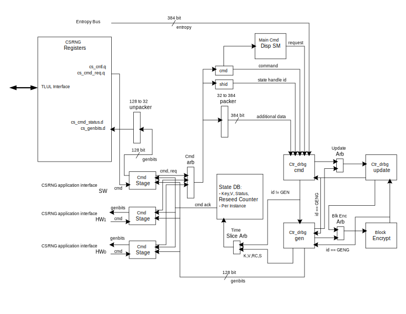

# Overview

This document specifies the Cryptographically Secure Random Number Generator (CSRNG) hardware IP functionality.
Due to the importance of secure random number generation (RNG), it is a topic which is extensively covered in security standards.
This IP targets compliance with both [BSI's AIS31 recommendations for Common Criteria](https://www.bsi.bund.de/SharedDocs/Downloads/DE/BSI/Zertifizierung/Interpretationen/AIS_31_Functionality_classes_for_random_number_generators_e.pdf), as well as [NIST's SP 800-90A](https://nvlpubs.nist.gov/nistpubs/SpecialPublications/NIST.SP.800-90Ar1.pdf) and [NIST's SP 800-90C (Second Draft)](https://csrc.nist.gov/CSRC/media/Publications/sp/800-90c/draft/documents/sp800_90c_second_draft.pdf), both of which are referenced in [FIPS 140-3](https://csrc.nist.gov/publications/detail/fips/140/3/final).
Since these two standards use significantly different terminology, it is recommended that the reader refer to our RNG compliance strategy document for an overview of the various RNG classes and equivalencies between the two standards.
The CSRNG IP supports both of these standards for both deterministic (DRNG) and true random number generation (TRNG).
In NIST terms, it works with the [Entropy Source IP]() to satisfy the requirements as a DRBG (deterministic random-bit-generator) or NRBG (non-deterministic random bit generator).
In AIS31 language, this same implementation can be used to satisfy either the DRG.3 requirements for deterministic generation, or the PTG.3 requirements for cryptographically processed physical generation.

In this document the terms "DRNG" and "TRNG" are used most generally to refer to deterministic or true random number generation functionalities implemented to this specification.
However, the terms "DRBG" or "NRBG" are specifically used when respectively referring to SP 800-90A or SP 800-90C requirements.
Meanwhile, when addressing requirements which originate from AIS31 we refer to the specific DRG.3 or PTG.3 classes of RNGs.

This IP block is attached to the chip interconnect bus as a peripheral module conforming to the [Comportable guideline for peripheral functionality](), but also has direct hardware links to other IPs for secure and software-inaccessible transmission of random numbers. The bus connections to peripheral modules is done using the CSRNG application interface. This interface allows peripherals to manage CSRNG instances, and request for obfuscated entropy to be returned from the CSRNG module.

## Features
- Provides support for both deterministic (DRNG) and true random number generation (TRNG), when combined with a secure entropy source (i.e. one constructed and implemented in compliance with SP 800-90A,B,C and AIS31).
- Compliant with NIST and BSI recommendations for random number generation.
- Hardware peripherals and software applications issue commands to dedicated RNG instances through a common application interface.
- In deterministic mode, meets the requirements given in AIS31 for a DRG.3 class deterministic random number generator (DRNG) meaning it provides Forward Secrecy and Enhanced Backward Secrecy.
- Utilizes the CTR_DRBG construction specified in NIST SP 800-90A, qualifying it as a NIST-approved DRBG (deterministic random bit generator).
    - Operates at 256 bit security strength.
- Support for multiple separate CSRNG instances per IP block.
    - Each instance has its own internal state, control, reseed counters and IO pins.
    - The number of CSRNG instances is set via a module parameter.
- Software access to a dedicated CSRNG instance.
    - One instance, Instance N-1, is always accessible from the bus through device registers,
    - All other instances route to other hardware peripherals (e.g. the key manager, obfuscation engines etc.) and in normal operation these other instances are inaccessible from software.
    - The IP may be configured to support "debug mode" wherein all instances can be accessed by software.
      For security reasons this mode may be permanently disabled using one-time programmable (OTP) memory.
- The IP interfaces with external entropy sources to obtain any required non-determinstic seed material (entropy) and nonces.
    - Requires an external entropy source which is compliant with NIST SP 800-90B, and which also satisfies the requirements for a PTG.2 class physical non-deterministic random number generator as defined in AIS31.
    - Dedicated hardware interface with external entropy source satisfies requirements for `get_entropy_input()` interface as defined in SP 800-90A.
    - When needed, utilizes the `Block_Cipher_df` derivation function (as defined in SP 800-90A) for assembling seed material.
      This allows the use of entropy sources which are not full-entropy (less than one bit of entropy per bit generated).
- Also supports the optional use of personalization strings or other application inputs (e.g. OTP memory values) during instantiation.
- Assuming a continuously-live entropy source, each instance can also optionally be used as a non-determinstic TRNG (true random number generator, also called a non-deterministic random bit generator or NRBG in SP 800-90C).
    - In this mode, an instance also meets the requirements laid out for a PTG.3 class RNG, the strongest class laid out in AIS31.
    - Implementation follows the NRBG "Oversampling Construction" approved by SP 800-90C, to meet both CC and FIPS TRNG constructions.
- In addition to the approved DRNG mode, any instance can also operate in "Fully Deterministic mode", meaning the seed depends entirely on application inputs or personalization strings.
    - This provides an approved means of seed construction in FIPS 140-2 as described in the [FIPS 140-2 Implementation Guidance](https://csrc.nist.gov/csrc/media/projects/cryptographic-module-validation-program/documents/fips140-2/fips1402ig.pdf), section 7.14, resolution point 2(a).

## Description

Though the recommendations in AIS31 are based around broad functional requirements, the recommendations in SP 800-90 are very prescriptive in nature, outlining the exact constructs needed for approval.
Thus the interface and implementation are largely driven by these explicit constructs, particularly the CTR_DBRG construct.

The CSRNG IP consists of four main components:
1. An AES primitive
2. The CTR_DRBG state-machine (`ctr_drbg_fsm`) which drives the AES primitive, performing the various encryption sequences prescribed for approved DRBGs in SP 800-90A.
These include:

    1. **The Derivation Function:**
       Part of the instantiation and reseed routines, this routine assembles the previous seed material (on reseed only), application inputs, and entropy.
    2. **The Instantiation Routine:**
       Combines application inputs, external entropy and nonce (more entropy) via the derivation function.
    3. **The Reseed Routine:**
       Combines the previous seed material with external entropy to generate a new seed.
    4. **The Generate Routine:**
       Generates up to CSRNG_MAX_GENERATE random bits.
       If called with prediction_resistance_flag, forces a reseed.
    5. **The Update Routine:**
       Updates the internal state of the DRNG instance after each generate call.
3. State vectors for each DRNG instance.
4. Interface logic and access control for each instance.

## Note on the term "Entropy"

Every DRNG requires some initial seed material, and the requirements for the generation of that seed material varies greatly between standards, and potentially between CC security targets.
In all standards considered, DRNG's require some "entropy" from an external source to create the initial seed.
However, the rules for obtaining said entropy differ.
Furthermore the required delivery mechanisms differ.
For this reason we must make a clear distinction between "Physical" (or "Live" or "True") entropy and "Factory Entropy".
This distinction is most important when considering the creation of IP which is both compatible with both the relatively new SP 800-90 recommendations, as well as the well-established FIPS 140-2 guidelines.

- Physical entropy is the only type of "entropy" described in SP 800-90.
The means of generation is described in [SP 800-90B](https://nvlpubs.nist.gov/nistpubs/SpecialPublications/NIST.SP.800-90B.pdf).
One statistical test requirement is that physical entropy must be unique between reboot cycles, ruling out sources such as one-time programmable (OTP) memories.
In SP 800-90A, the delivery mechanism must come through a dedicated interface and "not be provided by the consuming application".

- Factory entropy is a type of entropy described in the [FIPS 140-2 implementation guidance (IG)](https://csrc.nist.gov/csrc/media/projects/cryptographic-module-validation-program/documents/fips140-2/fips1402ig.pdf) section 7.14, resolution point 2(a).
It can be stored in a persistent memory, programmed at the factory.
In some use cases, the consuming application needs to explicitly load this entropy itself and process it to establish the expected seed.

This document aims to make the distinction between physical entropy and factory entropy wherever possible.
However, if used unqualified, the term "entropy" should be understood to refer to physical entropy strings which are obtained in accordance with SP 800-90C.
That is either physical entropy, or the output of a DRNG which itself has been seeded (and possibly reseeded) with physical entropy.
In CC terms, "entropy strings" (when used in this document without a qualifier) should be understood to come from either a PTG.2 or PTG.3 class RNG.

## Compatibility
None.

# Theory of Operations

The CSRNG block has been constructed to follow the NIST recommendation for a DRBG mechanism based on block ciphers.
Specifically, it is a CTR_DRBG that uses an approved block cipher algorithm in counter mode.
As such, the block diagram below makes reference to hardware blocks that either directly or closely follow NIST descriptions for the equivalent functions.

There are two major hardware interfaces: the application interface and the entropy request interface.
The application interface, which is described in more detail later, is provided for an application to manage an `instance` in CSRNG.
Once setup, the application interface user can request for entropy bits to be generated, as well as other functions.
The application interface supports up to 15 hardware interfaces, and one software interface.

A walk through of how CSRNG generates entropy bits begins with the application interface.
An `instantiate` command is issued from one of the application interfaces.
This request moves into the `cmd_stage` block.
Here the request is arbitrated between all of the `cmd_stage` blocks.
The winner will get its command moved into the command dispatch logic.
A common state machine will process all application interface commands in order of arbitration.
At this point, some seed entropy may be required depending on the command and any flags.
If needed, a request to the entropy source hardware interface will be made.
This step can take milliseconds if seed entropy is not immediately available.
Once all of the prerequisites have been collected, a CTR_DRBG command can be launched.
This command will go into the `ctr_drbg_cmd` block.
This `ctr_drbg_cmd` block uses two NIST-defined functions, the update and the block_encrypt functions.
If the command is a generate, the `ctr_drbg_cmd` block will process the first half of the algorithm, and then pass it on to the `ctr_drbg_gen` block.
Additionally, the `ctr_drbg_gen` block also uses the update block and the block_encrypt block.
To keep resources to a minimum, both of these blocks have arbiters to allow sharing between the `ctr_drbg_cmd` and `ctr_drbg_gen` blocks.
The command field called `ccmd` (for current command) is sent along the pipeline to not only identify the command, but is also reused as a routing tag for the arbiters to use when returning the block response.

Once the command has traversed through all of the CTR_DRBG blocks, the result will eventually land into the `state_db` block.
This block will hold the instance state for each application interface.
The specific state information held in the instance is documented below.
If the command was a `generate` command, the genbits data word will be returned to the requesting `cmd_stage` block.
Finally, an `ack` response and status will be returned to the application interface once the command has been completely processed.

## Block Diagram



## Hardware Interfaces

 

## Design Details

#### Non-blocking Commands
Regarding command processing, all commands process immediately except for the generate command.
The command generate length count (`glen`) is kept in the `cmd_stage` block.
When the state_db block issues an ack to the `cmd_stage` block, the `cmd_stage` block increments an internal counter.
This process repeats until the `glen` field value has been matched.
Because each request is pipelined, requests from other `cmd_stage` blocks can be processed before the original generate command is completely done.
This provides some interleaving of commands since a generate command can be programmed to take a very long time.

#### Working State Values
The state_db has the follow attributes shown in the following table:

<table>
<caption>State Instance Description</caption>
<thead>
  <tr>
    <th>Bits</th>
    <th>Name</th>
    <th>Description</th>
  </tr>
</thead>
<tbody>
  <tr>
    <td>31:0</td>
    <td>Reseed Counter</td>
    <td> Value required by NIST to be held in the state instance.
    </td>
  </tr>
  <tr>
    <td>159:32</td>
    <td>V</td>
    <td> Value required by NIST to be held in the state instance, and is of size <tt>BlockLen</tt>.
    </td>
  </tr>
  <tr>
    <td>415:160</td>
    <td>Key</td>
    <td> Value required by NIST to be held in the state instance, and is of size <tt>SeedLen</tt>.
    </td>
  </tr>
  <tr>
    <td>416</td>
    <td>Status</td>
    <td> Set when instantiated.
    </td>
  </tr>
  <tr>
    <td>417</td>
    <td>Compliance</td>
    <td> Set when FIPS/CC compliant entropy was used to seed this instance.
    </td>
  </tr>
</table>

#### AES Cipher
The `block_encrypt` block is where the `aes_cipher_core` block is located.
This is the same block used in the AES design.
Parameters are selected such that this is the unmasked version.

#### Software Support
The software application interface uses a set of TL-UL registers to send commands and receive generated bits.
Since the registers are 32-bit words wide, some sequencing will need to be done by firmware to make this interface work properly.

### Application Interface

This section describes the application interface, which is required for performing any operations using a CSRNG instance (i.e. instantiation, reseeding, RNG generation, or uninstantiation).
Each CSRNG instance corresponds to a unique application interface port, which implements the application interface described here.
Any hardware peripherals which require complete control of an instance may connect directly to a dedicated interface port.
Meanwhile peripherals without any special requirements (i.e. personalization strings or non-FIPS-approved, fully-deterministic number sequences) may share access to an instance via the entropy distribution network (EDN) IP.
The EDN's manage the instantiation and reseeding of CSRNG instances for general use-cases, providing either on-demand or timed-delivery entropy streams to hardware peripherals.
Firmware applications can obtain access to random bit sequences directly through application interface port 0, which is directly mapped to a set of TL-UL registers.

The total number of application interface ports (for TL-UL, directly attached peripherals or EDN instances) is determined by the `NHwApp` parameter.

The command bus operates like a FIFO, in which a command is pushed into the interface.
An optional stream of additional data may follow, such as seed material for an `instantiate` application command.
For the `generate` application command, the obfuscated entropy will be returned on the `genbits` bus.
This bus also operates like a FIFO, and the receiving module can provide back pressure to the `genbits` bus.
There is one instance of a firmware application interface, and uses the TL-UL registers.
For more details on how the application interface works, see the Theory of Operations section above.

In general, users of the application interface are either firmware or some hardware module entity.
For hardware, a module can either directly control the application interface, or it can connect to an `entropy distribution network`module (EDN).
Attaching to an EDN block allows for a simpler interface connection to a more layout-friendly distributed-chip network.

#### General Command Format

The general format for the application interface is a 32-bit command header, optionally followed by additional data, such as a personalization string, typically twelve 32-bit words in length.
Depending on the command, these strings are typically required to be 384-bits in length, to match the size of the seed-length when operating with 256-bit security-strength.
The exact function of the additional data field depends in the command.
However, in general, the additional data can be any length as specified by the command length field.
The command header is defined below.

#### Command Header
The application interface requires that a 32-bit command header be provided to instruct the CSRNG how to manage the internal working states.
Below is a description of the fields of this header:

<table>
<caption>Application Interface Command Header</caption>
<thead>
  <tr>
    <th>Bits</th>
    <th>Name</th>
    <th>Description</th>
  </tr>
</thead>
<tbody>
  <tr>
    <td>3:0</td>
    <td>acmd</td>
    <td> Application Command: Selects one of five operations to perform.
         The commands supported are <tt>instantiate</tt>, <tt>reseed</tt>, <tt>generate</tt>, <tt>update</tt>, and <tt>uninstantiate</tt>.
         Each application interface port used by peripheral hardware commands a unique instance number in CSRNG.
    </td>
  </tr>
  <tr>
    <td>7:4</td>
    <td>clen</td>
    <td> Command Length: Number of 32-bit words that can optionally be appended to the command.
         A value of zero will only transfer the command header.
         A value of 4'hc will transfer the header plus an additional twelve 32-bit words of data.
    </td>
  </tr>
  <tr>
    <td>11:8</td>
    <td>flags</td>
    <td> Command Flags: Specific flags associated with a command.
         Used to allow additional features per command. Flags are defined as <tt>flag0</tt>, <tt>flag1</tt>, <tt>flag2</tt>, and <tt>flag3</tt>, where <tt>flag0</tt> is bit 8, and <tt>flag1</tt> is bit 9, etc.
         Note that <tt>flag0</tt> is used for the <tt>instantiate</tt> command. All others are reserved.
    </td>
  </tr>
  <tr>
    <td>30:12</td>
    <td>glen</td>
    <td> Generate Length: Only defined for the generate command, this field is the total number of crytographic entropy bits requested.
         The NIST reference name is <tt>max_number_of_bit_per_request</tt>, and this field size supports the maximum size allowed.
         Each unit represents 128 bits of entropy returned.
         For example, a value of 8 would return a total of 1024 bits.
         The maximum value for this field is 2<sup>19</sup>.
    </td>
  </tr>
  <tr>
    <td>31</td>
    <td>resv</td>
    <td> Unused and reserved.
    </td>
  </tr>
</table>

#### Command Description
The command field of the application command header is described in detail in the table below.
The actions performed by each command, as well as which flags are supported, are described in this table.

<table>
<caption>Application Interface Command Description</caption>
<thead>
  <tr>
    <th>Command Name</th>
    <th>Encoded Value</th>
    <th>Description</th>
  </tr>
</thead>
<tbody>
  <tr>
    <td>Instantiate</td>
    <td>0x1</td>
    <td> Initializes an instance in CSRNG.
         When seeding, if <tt>flag0</tt> is not set and <tt>clen</tt> is zero, then a seed of only the entropy source seed will be used.
         If <tt>flag0</tt> is not set and <tt>clen</tt> is non-zero, then the seed will xor'ed with the provided additional data.
         If <tt>flag0</tt> is set and <tt>clen</tt> is zero, then a seed of zero with no entropy source seed material will be used.
         If <tt>flag0</tt> is set and <tt>clen</tt> is non-zero, then only the provided additional data will be used as the seed.
         WARNING: Though <tt>flag0</tt> may be useful for generating fully-determininistic bit sequences, the use of this flag will render the instance non-FIPS compliant until it is re-instantiated.
         When the <tt>instantiate</tt> command is completed, the active bit in the CSRNG working state will be set.
    </td>
  </tr>
  <tr>
    <td>Reseed</td>
    <td>0x2</td>
    <td> Reseeds an existing instance in CSRNG.
         When <tt>clen</tt> is set to zero for this command, only the entropy source seed will be used to reseed the instance.
         If <tt>clen</tt> is set to non-zero (up to twelve), the additional data provided with be xor'ed with the entropy source seed.
    </td>
  </tr>
  <tr>
    <td>Generate</td>
    <td>0x3</td>
    <td> Starts a request to CSRNG to generate crytographic entropy bits.
         The <tt>glen</tt> field represents how many 128-bit words are to be returned to the application interface.
         The <tt>glen</tt> field needs to be a minimum value of one.
         The NIST reference to the <tt>prediction_resistance_flag</tt> is not directly supported as a flag.
         It is the resposibility of the calling application to reseed as needed before the generate command to properly support prediction resistance.
    </td>
  </tr>
  <tr>
    <td>Update</td>
    <td>0x4</td>
    <td> Updates an existing instance in CSRNG.
         This command does the same function as the <tt>reseed</tt> command, except that:
         <ol>
         <li>only the additional data provided will be used in the update function (i.e. no physical entropy is gathered), and
         <li>the <tt>update</tt> command does not reset the reseed counter.
         </ol>
         When the <tt>update</tt> command is completed, the results will be reflected in the CSRNG working state.
    </td>
  </tr>
  <tr>
    <td>Uninstantiate</td>
    <td>0x5</td>
    <td> Resets an instance in CSRNG.
         Values in the instance are zeroed out.
         When the <tt>uninstantiate</tt> comand is completed, the <tt>active</tt> bit in the CSRNG working state will be cleared.
         Uninstantiating an instance effectively resets it, clearing any errors that it may have encountered due to bad command syntax or entropy source failures.
    </td>
  </tr>
  <tr>
    <td>Reserved</td>
    <td>0x0,0x6-0xf</td>
    <td> Unused and reserved.
    </td>
  </tr>
</table>

#### Command Response

Once a command has been completed, successfully or unsuccessfully, the CSRNG responds with a single cycle pulse on the `csrng_rsp_ack` signal associated with the same application interface port.
If the command is successful the `csrng_rsp_sts` signal will indicate the value 0 (`CSRNG_OK`) in the same cycle.
Otherwise the application will receive the value 1 (`CSRNG_ERROR`) on the `csrng_rsp_sts` signal.
A number of exception cases to be considered are enumerated in NIST SP 800-90A, and may include events such as:
* Failure of the entropy source
* Attempts to use an instance which has not been properly instantiated, or
* Attempts to generate data when an instance has exceeded its maximum seed.life.
In such cases, a 32-bit exception message will be propagated to firmware via the `hw_exc_sts` register, and a `cs_hw_inst_exc` interrupt will be raised.

#### Generated Bits (`genbits`) Interface

In addition to the command response signals there is all the bus for returning the generated bits.
This 129-bit bus consists of 128-bits, `genbits_bus`, for the random bit sequence itself, along with a single bit flag, `genbits_fips`, indicating whether the bits were considered fully in accordance with FIPS standards.

There are two cases when the sequence will not be FIPS compliant:
- Early in the boot sequence, the `entropy_src` generates a seed from the first 384 bits pulled from the noise source.
This initial seed is tested to ensure some minimum quality for obfuscation use- cases, but this boot seed is not expected to be full-entropy nor do these health checks meet the 1024-bit requirement for start-up health checks required by NIST 800-90B.
- If `flag0` is asserted during instantiation, the resulting DRBG instance will have a fully-deterministic seed, determined only by user input data.
Such a seed will be created only using factory-entropy and will lack the physical-entropy required by NIST SP 800-90A, and thus this DRBG instance will not be FIPS compliant.

#### Handshaking signals

The application command signal `csrng_req_bus` is accompanied by a `csrng_valid_signal`, which is asserted by the requester when the command is valid.
CSRNG may stall incoming commands by desserting the `csrng_req_ready` signal.
A command is considered received whenever both `csrng_req_valid` and `csrng_req_ready` are asserted in the same clock cycle.

Likewise a requester must only consider data on the `genbits` bus to be valid when the `genbits_valid` signal is asserted, and should assert `genbits_ready` whenever it is ready to accept the `genbits` data.
The `genbits` data is considered successfully transmitted whenever `genbits_valid` and `genbits_ready` are asserted in the same clock cycle.

A requester must always be ready to receive `csrng_req_sts` signals.
(There is no "ready" signal for command response messages sent to hardware.)

#### Waveforms

##### Application Interface: Instantiate Request


{signal: [
   {name: 'clk'             , wave: 'p...............|.....'},
   {name: 'csrng_req_valid' , wave: '01............0.|.....'},
   {name: 'csrng_req_ready' , wave: '1.............0.|..1..'},
   {name: 'csrng_req_bus'   , wave: 'x5333333333333x.|.....',data: ['ins','sd1','sd2','sd3','sd4','sd5','sd6','sd7','sd8','sd9','sd10','sd11','sd12']},
   {name: 'csrng_rsp_ack'   , wave: '0...............|.10..'},
   {name: 'csrng_rsp_sts'   , wave: 'x...............|.5x..', data: ['ok']},
 {},
]}

##### Application Interface:  Reseed Request


{signal: [
   {name: 'clk'             , wave: 'p...............|.....'},
   {name: 'csrng_req_valid' , wave: '01............0.|.....'},
   {name: 'csrng_req_ready' , wave: '1.............0.|..1..'},
   {name: 'csrng_req_bus'   , wave: 'x5333333333333x.|.....',data: ['res','ad1','ad2','ad3','ad4','ad5','ad6','ad7','ad8','ad9','ad10','ad11','ad12']},
   {name: 'csrng_rsp_ack'   , wave: '0...............|.10..'},
   {name: 'csrng_rsp_sts'   , wave: 'x...............|.5x..', data: ['ok']},
 {},
]}

##### Application Interface:  Generate Request


{signal: [
   {name: 'clk'              , wave: 'p...|...|....|....|...'},
   {name: 'csrng_req_valid'  , wave: '010.|...|....|....|...'},
   {name: 'csrng_req_ready'  , wave: '1...|...|....|....|...'},
   {name: 'csrng_req_bus'    , wave: 'x5x.|...|....|....|...',data: ['gen']},
   {name: 'csrng_rsp_ack'    , wave: '0...|...|....|....|.10'},
   {name: 'csrng_rsp_sts'    , wave: 'x...|...|....|....|.5x', data: ['ok']},
   {name: 'genbits_valid'    , wave: '0...|.10|.1.0|.10.|...'},
   {name: 'csrng_rsp_fips'   , wave: '0...|.10|.1.0|.10.|...'},
   {name: 'genbits_bus'      , wave: '0...|.40|.4.0|.40.|...', data: ['bits0','bits1','bits2']},
   {name: 'genbits_ready'    , wave: '1...|...|0.1.|........'},
]}


##### Application Interface:  Update Request


{signal: [
   {name: 'clk'             , wave: 'p...............|.....'},
   {name: 'csrng_req_valid' , wave: '01............0.|.....'},
   {name: 'csrng_req_ready' , wave: '1.............0.|..1..'},
   {name: 'csrng_req_bus'   , wave: 'x5333333333333x.|.....',data: ['upd','ad1','ad2','ad3','ad4','ad5','ad6','ad7','ad8','ad9','ad10','ad11','ad12']},
   {name: 'csrng_rsp_ack'   , wave: '0...............|.10..'},
   {name: 'csrng_rsp_sts'   , wave: 'x...............|.5x..', data: ['ok']},
 {},
]}

##### Application Interface:  Uninstantiate Request


{signal: [
   {name: 'clk'             , wave: 'p...............|.....'},
   {name: 'csrng_req_valid' , wave: '010.............|.....'},
   {name: 'csrng_req_ready' , wave: '1.0.............|..1..'},
   {name: 'csrng_req_bus'   , wave: 'x5x.............|.....',data: ['uni']},
   {name: 'csrng_rsp_ack'   , wave: '0...............|.10..'},
   {name: 'csrng_rsp_sts'   , wave: 'x...............|.5x..', data: ['ok']},
 {},
]}


##### Entropy Source Hardware Interface
The following waveform shows an example of how the entropy source hardware interface works.



{signal: [
   {name: 'clk'           , wave: 'p...|.........|.......'},
   {name: 'es_req'        , wave: '0..1|..01.0..1|.....0.'},
   {name: 'es_ack'        , wave: '0...|.10.10...|....10.'},
   {name: 'es_bus[383:0]' , wave: '0...|.30.30...|....30.', data: ['es0','es1','es2']},
   {name: 'es_fips'       , wave: '0...|....10...|....10.'},
]}
]}


### Interrupts

The `cs_cmd_req_done` interrupt will assert when a csrng command has been completed.

The `cs_entropy_req` interrupt will assert when csrng requests for entropy from ENTROPY_SRC.

The `cs_hw_inst_exc` interrupt will assert when any of the hardware-controlled CSRNG instances encounters an exception while executing a command, either due to errors on the command sequencing, or an exception within the `entropy_src` IP.

The `cs_fifo_err` interrupt will assert when any of the csrng FIFOs has a malfunction.
The conditions that cause this to happen are either when there is a push to a full FIFO or a pull from an empty FIFO.

# Programmers Guide

## Initialization

The following code snippet demonstrates initializing the CSRNG block.

```cpp
void csrng_init(unsigned int enable) {

  // set the control register enable bit
  *CTRL_REG = enable; // should be 0x1 by default

  // the CSRNG interrupts can optionally be enabled
}
```

## Register Table


