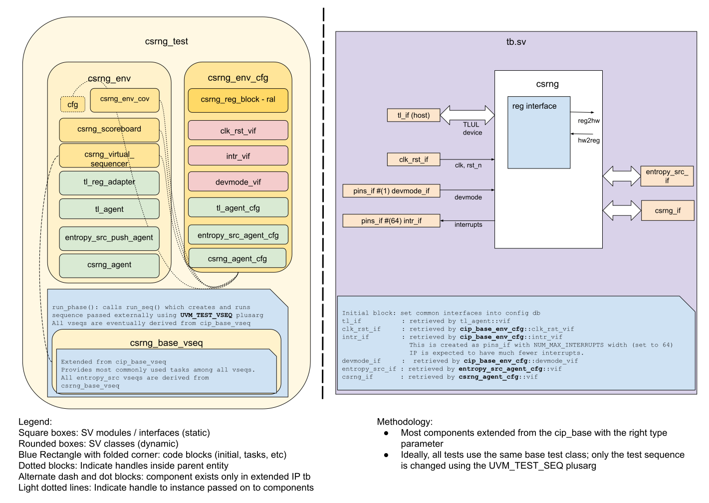

## Goals
* **DV**
  * Verify all CSRNG IP features by running dynamic simulations with a SV/UVM based testbench
  * Develop and run all tests based on the [DV plan](#dv-plan) below towards closing code and functional coverage on the IP and all of its sub-modules
* **FPV**
  * Verify TileLink device protocol compliance with an SVA based testbench

## Current status
* [Design & verification stage]()
* [HW development stages]()
* [Simulation results](https://reports.opentitan.org/hw/ip/csrng/dv/latest/results.html)

## Design features
For detailed information on CSRNG design features, please see the [CSRNG HWIP technical specification]().

## Testbench architecture
CSRNG testbench has been constructed based on the [CIP testbench architecture]().

### Block diagram


### Top level testbench
Top level testbench is located at `hw/ip/csrng/dv/tb/tb.sv`. It instantiates the CSRNG DUT module `hw/ip/csrng/rtl/csrng.sv`.
In addition, it instantiates the following interfaces, connects them to the DUT and sets their handle into `uvm_config_db`:
* [Clock and reset interface]()
* [TileLink host interface]()
* CSRNG IOs
* Interrupts ([`pins_if`]()
* Alerts ([`pins_if`]()
* Devmode ([`pins_if`]()

### Common DV utility components
The following utilities provide generic helper tasks and functions to perform activities that are common across the project:
* [common_ifs]()
* [dv_utils_pkg]()
* [csr_utils_pkg]()

<!--### Compile-time configurations
[list compile time configurations, if any and what are they used for]
TODO-->

### Global types & methods
All common types and methods defined at the package level can be found in
`csrng_env_pkg`. Some of them in use are:
```systemverilog
```
<!--TODO [list a few parameters, types & methods; no need to mention all]-->

### TL_agent
CSRNG testbench instantiates (already handled in CIP base env) [tl_agent]()
which provides the ability to drive and independently monitor random traffic via
TL host interface into CSRNG device.

###  Entropy_src_agent
CSRNG testbench instantiates this push_pull_agent() which models the ENTROPY_SRC module.

###  Csrng_agent
<!--CSRNG testbench instantiates this agent() which models the EDN module.-->

### UVM RAL Model
The CSRNG RAL model is created with the [`ralgen`]() FuseSoC generator script automatically when the simulation is at the build stage.

It can be created manually by invoking [`regtool`]():

### Stimulus strategy
#### Test sequences
All test sequences reside in `hw/ip/csrng/dv/env/seq_lib`.
The `csrng_base_vseq` virtual sequence is extended from `cip_base_vseq` and serves as a starting point.
All test sequences are extended from `csrng_base_vseq`.
It provides commonly used handles, variables, functions and tasks that the test sequences can simple use / call.
Some of the most commonly used tasks / functions are as follows:
* csrng_init:     Initialize the CSRNG module from the randomized environment variables in the config.

#### Functional coverage
To ensure high quality constrained random stimulus, it is necessary to develop a functional coverage model.
The following covergroups have been developed to prove that the test intent has been adequately met:
* common covergroup for interrupts `hw/dv/sv/cip_lib/cip_base_env_cov.sv`: Cover interrupt value, interrupt enable, intr_test, interrupt pin

### Self-checking strategy
#### Scoreboard
The `csrng_scoreboard` is primarily used for end to end checking.
It creates the following analysis ports to retrieve the data monitored by corresponding interface agents:
* tl_a_chan_fifo, tl_d_chan_fifo:  These 2 fifos provide transaction items at the end of Tilelink address channel and data channel respectively
* entropy_src_fifo, genbits_fifo:  The entropy_src_fifo provides transaction items from the predictor and the genbits_fifo provide actual post-entropy_src transaction items to compare


#### Assertions
* TLUL assertions: The `tb/csrng_bind.sv` binds the `tlul_assert` [assertions]() to the IP to ensure TileLink interface protocol compliance.
* Unknown checks on DUT outputs: The RTL has assertions to ensure all outputs are initialized to known values after coming out of reset.

## Building and running tests
We are using our in-house developed [regression tool]() for building and running our tests and regressions.
Please take a look at the link for detailed information on the usage, capabilities, features and known issues.
Here's how to run a smoke test:
```console
$ $REPO_TOP/util/dvsim/dvsim.py $REPO_TOP/hw/ip/csrng/dv/csrng_sim_cfg.hjson -i csrng_smoke
```

## DV plan

