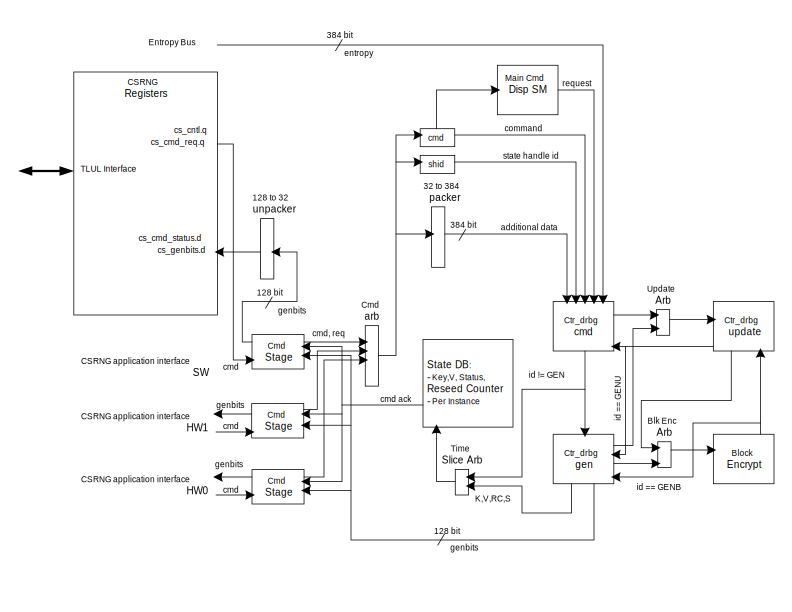

# Theory of Operation

The CSRNG block has been constructed to follow the NIST recommendation for a DRBG mechanism based on block ciphers.
Specifically, it is a CTR_DRBG that uses an approved block cipher algorithm in counter mode.
As such, the block diagram below makes reference to hardware blocks that either directly or closely follow NIST descriptions for the equivalent functions.

There are two major hardware interfaces: the application interface and the entropy request interface.
The application interface, which is described in more detail later, is provided for an application to manage an `instance` in CSRNG.
Once setup, the application interface user can request for entropy bits to be generated, as well as other functions.
The application interface supports up to 15 hardware interfaces, and one software interface.

A walk through of how CSRNG generates entropy bits begins with the application interface.
An `instantiate` command is issued from one of the application interfaces.
This request moves into the `cmd_stage` block.
Here the request is arbitrated between all of the `cmd_stage` blocks.
The winner will get its command moved into the command dispatch logic.
A common state machine will process all application interface commands in order of arbitration.
At this point, some seed entropy may be required depending on the command and any flags.
If needed, a request to the entropy source hardware interface will be made.
This step can take milliseconds if seed entropy is not immediately available.
Once all of the prerequisites have been collected, a CTR_DRBG command can be launched.
This command will go into the `ctr_drbg_cmd` block.
This `ctr_drbg_cmd` block uses two NIST-defined functions, the update and the `block_encrypt` functions.
If the command is a generate, the `ctr_drbg_cmd` block will process the first half of the algorithm, and then pass it on to the `ctr_drbg_gen` block.
Additionally, the `ctr_drbg_gen` block also uses the `update` block and the `block_encrypt` block.
To keep resources to a minimum, both of these blocks have arbiters to allow sharing between the `ctr_drbg_cmd` and `ctr_drbg_gen` blocks.
The command field called `ccmd` (for current command) is sent along the pipeline to not only identify the command, but is also reused as a routing tag for the arbiters to use when returning the block response.

Once the command has traversed through all of the CTR_DRBG blocks, the result will eventually land into the `state_db` block.
This block will hold the instance state for each application interface.
The specific state information held in the instance is documented below.
If the command was a `generate` command, the genbits data word will be returned to the requesting `cmd_stage` block.
Finally, an `ack` response and status will be returned to the application interface once the command has been completely processed.


## Block Diagram



## Design Details

#### Non-blocking Commands
Regarding command processing, all commands process immediately except for the generate command.
The command generate length count (`glen`) is kept in the `cmd_stage` block.
When the `state_db` block issues an ack to the `cmd_stage` block, the `cmd_stage` block increments an internal counter.
This process repeats until the `glen` field value has been matched.
Because each request is pipelined, requests from other `cmd_stage` blocks can be processed before the original generate command is completely done.
This provides some interleaving of commands since a generate command can be programmed to take a very long time.

When sending an unsupported or illegal command, `CS_MAIN_SM_ALERT` will be triggered, but there will be no status response or indication of which app the error occurred in.

#### Working State Values
The CSRNG working state data base (`state_db`) contains the current working state for a given DRBG instance.
It holds the following values:

<table>
<caption>Values stored by <tt>state_db</tt></caption>
<thead>
  <tr>
    <th>Bits</th>
    <th>Name</th>
    <th>Description</th>
  </tr>
</thead>
<tbody>
  <tr>
    <td>31:0</td>
    <td>Reseed Counter</td>
    <td> Value required and defined by NIST's SP 800-90A to be held in the state instance.
    It keeps track of the number of pseudorandom bits requested since the last instantiation or reseeding.
    </td>
  </tr>
  <tr>
    <td>159:32</td>
    <td>V</td>
    <td> Value required and defined by NIST's SP 800-90A to be held in the state instance, and is of size <tt>BlkLen</tt>.
    This value changes every time a <tt>BlkLen</tt> bits of output are generated.
    </td>
  </tr>
  <tr>
    <td>415:160</td>
    <td>Key</td>
    <td> Value required and defined by NIST's SP 800-90A to be held in the state instance, and is of size <tt>KeyLen</tt>.
    The key is changed after a predetermined number of blocks of output have been produced.
    </td>
  </tr>
  <tr>
    <td>416</td>
    <td>Status</td>
    <td> Set when instantiated.
    </td>
  </tr>
  <tr>
    <td>417</td>
    <td>Compliance</td>
    <td> Set when FIPS/CC compliant entropy was used to seed this instance.
    </td>
  </tr>
</table>

#### AES Cipher
The `block_encrypt` block is where the `aes_cipher_core` block is located.
This is the same block used in the AES design.
Parameters are selected such that this is the unmasked version.

#### Software Support
The software application interface uses a set of TL-UL registers to send commands and receive generated bits.
Since the registers are 32-bit words wide, some sequencing will need to be done by firmware to make this interface work properly.

### Application Interface

This section describes the application interface, which is required for performing any operations using a CSRNG instance (i.e. instantiation, reseeding, RNG generation, or uninstantiation).
Each CSRNG instance corresponds to a unique application interface port, which implements the application interface described here.
Any hardware peripherals which require complete control of an instance may connect directly to a dedicated interface port.
Meanwhile peripherals without any special requirements (i.e. personalization strings or non-FIPS-approved, fully-deterministic number sequences) may share access to an instance via the entropy distribution network (EDN) IP.
The EDNs manage the instantiation and reseeding of CSRNG instances for general use-cases, providing either on-demand or timed-delivery entropy streams to hardware peripherals.
Firmware applications can obtain access to random bit sequences directly through application interface port 0, which is directly mapped to a set of TL-UL registers.

The total number of application interface ports (for TL-UL, directly attached peripherals or EDN instances) is determined by the `NHwApp` parameter.

The command bus operates like a FIFO, in which a command is pushed into the interface.
An optional stream of additional data may follow, such as seed material for an `instantiate` application command.
For the `generate` application command, the obfuscated entropy will be returned on the `genbits` bus.
This bus also operates like a FIFO, and the receiving module can provide back pressure to the `genbits` bus.
There is one instance of a firmware application interface, and it uses the TL-UL registers.
For more details on how the application interface works, see the Theory of Operations section above.

In general, users of the application interface are either firmware or some hardware module entity.
For hardware, a module can either directly control the application interface, or it can connect to an EDN module.
Attaching to an EDN module allows for a simpler interface connection to a more layout-friendly distributed-chip network.

#### General Command Format

The general format for the application interface is a 32-bit command header, optionally followed by additional data, such as a personalization string, typically twelve 32-bit words in length.
Depending on the command, these strings are typically required to be 384-bits in length, to match the size of the seed-length when operating with 256-bit security-strength.
The exact function of the additional data field depends in the command.
However, in general, the additional data can be any length as specified by the command length field.
The command header is defined below.

#### Command Header
The application interface requires that a 32-bit command header be provided to instruct the CSRNG how to manage the internal working states.
Below is a description of the fields of this header:

<table>
<caption>Application Interface Command Header</caption>
<thead>
  <tr>
    <th>Bits</th>
    <th>Name</th>
    <th>Description</th>
  </tr>
</thead>
<tbody>
  <tr>
    <td>3:0</td>
    <td>acmd</td>
    <td> Application Command: Selects one of five operations to perform.
         The commands supported are <tt>instantiate</tt>, <tt>reseed</tt>, <tt>generate</tt>, <tt>update</tt>, and <tt>uninstantiate</tt>.
         Each application interface port used by peripheral hardware commands a unique instance number in CSRNG.
    </td>
  </tr>
  <tr>
    <td>7:4</td>
    <td>clen</td>
    <td> Command Length: Number of 32-bit words that can optionally be appended to the command.
         A value of zero will only transfer the command header.
         A value of <tt>4'hc</tt> will transfer the header plus an additional twelve 32-bit words of data.
    </td>
  </tr>
  <tr>
    <td>11:8</td>
    <td>flag0</td>
    <td> Command Flag0: flag0 is associated with current command.
         Setting this field to kMultiBitBool4True will enable flag0 to be enabled.
         Note that <tt>flag0</tt> is used for the <tt>instantiate</tt> and  <tt>reseed</tt> commands only, for all other commands its value is ignored.
    </td>
  </tr>
  <tr>
    <td>23:12</td>
    <td>glen</td>
    <td> Generate Length: Only defined for the generate command, this field is the total number of cryptographic entropy blocks requested.
         Each unit represents 128 bits of entropy returned.
         This field allows values between 1 and 4095.
         A value of 1 returns 1 * 128 bits of entropy.
         A value of 4095 returns 4095 * 128 bits of entropy, which is less than the 2<sup>19</sup> bits allowed by NIST (referenced to as <tt>max_number_of_bit_per_request</tt>).
    </td>
  </tr>
  <tr>
    <td>31:24</td>
    <td>resv</td>
    <td> Unused and reserved.
    </td>
  </tr>
</table>

#### Command Description
The command field of the application command header is described in detail in the table below.
The actions performed by each command, as well as which flags are supported, are described in this table.

<table>
<caption>Application Interface Command Description</caption>
<thead>
  <tr>
    <th>Command Name</th>
    <th>Encoded Value</th>
    <th>Description</th>
  </tr>
</thead>
<tbody>
  <tr>
    <td>Instantiate</td>
    <td>0x1</td>
    <td> Initializes an instance in CSRNG.
         When seeding, the following table describes how the seed is determined based on <tt>flag0</tt> and the <tt>clen</tt> field.
         Note that the last table entry (<tt>flag0</tt> is set and <tt>clen</tt> is set to non-zero) is intended for known answer testing (KAT).
        WARNING: Though <tt>flag0</tt> may be useful for generating fully-deterministic bit sequences, the use of this flag will render the instance non-FIPS compliant until it is re-instantiated.
         When the <tt>Instantiate</tt> command is completed, the active bit in the CSRNG working state will be set.
        <table>
          <thead>
            <tr><th>flag0</th><th>clen</th><th>Description</th></tr>
          </thead>
          <tbody>
            <tr><td>0</td><td>0</td><td>Only entropy source seed is used.</td></tr>
            <tr><td>0</td><td>1-12</td><td>Entropy source seed is xor'ed with provided additional data.</td></tr>
            <tr><td>1</td><td>0</td><td>Seed of zero is used (no entropy source seed used).</td></tr>
            <tr><td>1</td><td>1-12</td><td>Only provided additional data will be used as seed.</td></tr>
          </tbody>
        </table>
    </td>
  </tr>
  <tr>
    <td>Reseed</td>
    <td>0x2</td>
    <td> Reseeds an existing instance in CSRNG.
         The <tt>flag0</tt> and <tt>clen</tt> table in the <tt>Instance</tt> command description above also applies to the <tt>Reseed</tt> command.
         Note that the last table entry (<tt>flag0</tt> is set and <tt>clen</tt> is set to non-zero) is intended for known answer testing (KAT).
         The <tt>Reseed</tt> command only takes in one group (a maximum of twelve 32 bit words) of generic additional data.
         If both a seed and additional data must be provided to the <tt>Reseed</tt> command, the seed and additional data must be xor'ed first.
         This scenario will then pass the NIST vector test requiring both a provided seed and additional data.
    </td>
  </tr>
  <tr>
    <td>Generate</td>
    <td>0x3</td>
    <td> Starts a request to CSRNG to generate cryptographic entropy bits.
         The <tt>glen</tt> field defines how many 128-bit words are to be returned to the application interface.
         The <tt>glen</tt> field needs to be a minimum value of one.
         The NIST reference to the <tt>prediction_resistance_flag</tt> is not directly supported as a flag.
         It is the responsibility of the calling application to reseed as needed before the <tt>Generate</tt> command to properly support prediction resistance.
         Note that additional data is also supported when the <tt>clen</tt> field is set to non-zero.
    </td>
  </tr>
  <tr>
    <td>Update</td>
    <td>0x4</td>
    <td> Updates an existing instance in CSRNG.
         This command does the same function as the <tt>Reseed</tt> command, except that:
         <ol>
         <li>only the additional data provided will be used in the update function (i.e. no physical entropy is gathered), and
         <li>the <tt>Update</tt> command does not reset the reseed counter.
         </ol>
         When the <tt>Update</tt> command is completed, the results will be reflected in the CSRNG working state.
    </td>
  </tr>
  <tr>
    <td>Uninstantiate</td>
    <td>0x5</td>
    <td> Resets an instance in CSRNG.
         Values in the instance are zeroed out.
         When the <tt>Uninstantiate</tt> command is completed, the <tt>Status</tt> bit in the CSRNG working state will be cleared.
         Uninstantiating an instance effectively resets it, clearing any errors that it may have encountered due to bad command syntax or entropy source failures.
         Only a value of zero should be used for <tt>clen</tt>, since any additional data will be ignored.
    </td>
  </tr>
  <tr>
    <td>Reserved</td>
    <td>0x0,0x6-0xf</td>
    <td> Unused and reserved.
    </td>
  </tr>
</table>

#### Command Response

Once a command has been completed, successfully or unsuccessfully, the CSRNG responds with a single cycle pulse on the `csrng_rsp_ack` signal associated with the same application interface port.
If the command is successful, the `csrng_rsp_sts` signal will indicate the value 0 (`CSRNG_OK`) in the same cycle.
Otherwise the application will receive the value 1 (`CSRNG_ERROR`) on the `csrng_rsp_sts` signal.
A number of exception cases to be considered are enumerated in NIST SP 800-90A, and may include events such as:
* Failure of the entropy source
* Attempts to use an instance which has not been properly instantiated, or
* Attempts to generate data when an instance has exceeded its maximum seed life.
In such cases, a 32-bit exception message will be propagated to firmware via the `hw_exc_sts` register, and a `cs_hw_inst_exc` interrupt will be raised.

#### Generated Bits (`genbits`) Interface

In addition to the command response signals there is a bus for returning the generated bits.
This 129-bit bus consists of 128-bits, `genbits_bus`, for the random bit sequence itself, along with a single bit flag, `genbits_fips`, indicating whether the bits were considered fully in accordance with FIPS standards.

There are two cases when the sequence will not be FIPS compliant:
- Early in the boot sequence, the `ENTROPY_SRC` generates a seed from the first 384 bits pulled from the noise source.
This initial seed is tested to ensure some minimum quality for obfuscation use- cases, but this boot seed is not expected to be full-entropy nor do these health checks meet the 1024-bit requirement for start-up health checks required by NIST 800-90B.
- If `flag0` is asserted during instantiation, the resulting DRBG instance will have a fully-deterministic seed, determined only by user input data.
Such a seed will be created only using factory-entropy and will lack the physical-entropy required by NIST SP 800-90A, and thus this DRBG instance will not be FIPS compliant.

#### Handshaking signals

The application command signal `csrng_req_bus` is accompanied by a `csrng_valid_signal`, which is asserted by the requester when the command is valid.
CSRNG may stall incoming commands by de-asserting the `csrng_req_ready` signal.
A command is considered received whenever both `csrng_req_valid` and `csrng_req_ready` are asserted in the same clock cycle.

Likewise a requester must only consider data on the `genbits` bus to be valid when the `genbits_valid` signal is asserted, and should assert `genbits_ready` whenever it is ready to accept the `genbits` data.
The `genbits` data is considered successfully transmitted whenever `genbits_valid` and `genbits_ready` are asserted in the same clock cycle.

A requester must always be ready to receive `csrng_req_sts` signals.
(There is no "ready" signal for command response messages sent to hardware.)

#### Waveforms

##### Application Interface: Instantiate Request

```wavejson
{signal: [
   {name: 'clk'             , wave: 'p...............|.....'},
   {name: 'csrng_req_valid' , wave: '01............0.|.....'},
   {name: 'csrng_req_ready' , wave: '1.............0.|..1..'},
   {name: 'csrng_req_bus'   , wave: 'x5333333333333x.|.....',data: ['ins','sd1','sd2','sd3','sd4','sd5','sd6','sd7','sd8','sd9','sd10','sd11','sd12']},
   {name: 'csrng_rsp_ack'   , wave: '0...............|.10..'},
   {name: 'csrng_rsp_sts'   , wave: 'x...............|.5x..', data: ['ok']},
 {},
]}
```

##### Application Interface:  Reseed Request

```wavejson
{signal: [
   {name: 'clk'             , wave: 'p...............|.....'},
   {name: 'csrng_req_valid' , wave: '01............0.|.....'},
   {name: 'csrng_req_ready' , wave: '1.............0.|..1..'},
   {name: 'csrng_req_bus'   , wave: 'x5333333333333x.|.....',data: ['res','ad1','ad2','ad3','ad4','ad5','ad6','ad7','ad8','ad9','ad10','ad11','ad12']},
   {name: 'csrng_rsp_ack'   , wave: '0...............|.10..'},
   {name: 'csrng_rsp_sts'   , wave: 'x...............|.5x..', data: ['ok']},
 {},
]}
```

##### Application Interface:  Generate Request

```wavejson
{signal: [
   {name: 'clk'              , wave: 'p...|...|....|....|...'},
   {name: 'csrng_req_valid'  , wave: '010.|...|....|....|...'},
   {name: 'csrng_req_ready'  , wave: '1...|...|....|....|...'},
   {name: 'csrng_req_bus'    , wave: 'x5x.|...|....|....|...',data: ['gen']},
   {name: 'csrng_rsp_ack'    , wave: '0...|...|....|....|.10'},
   {name: 'csrng_rsp_sts'    , wave: 'x...|...|....|....|.5x', data: ['ok']},
   {name: 'genbits_valid'    , wave: '0...|.10|.1.0|.10.|...'},
   {name: 'csrng_rsp_fips'   , wave: '0...|.10|.1.0|.10.|...'},
   {name: 'genbits_bus'      , wave: '0...|.40|.4.0|.40.|...', data: ['bits0','bits1','bits2']},
   {name: 'genbits_ready'    , wave: '1...|...|0.1.|........'},
]}
```

##### Application Interface:  Update Request

```wavejson
{signal: [
   {name: 'clk'             , wave: 'p...............|.....'},
   {name: 'csrng_req_valid' , wave: '01............0.|.....'},
   {name: 'csrng_req_ready' , wave: '1.............0.|..1..'},
   {name: 'csrng_req_bus'   , wave: 'x5333333333333x.|.....',data: ['upd','ad1','ad2','ad3','ad4','ad5','ad6','ad7','ad8','ad9','ad10','ad11','ad12']},
   {name: 'csrng_rsp_ack'   , wave: '0...............|.10..'},
   {name: 'csrng_rsp_sts'   , wave: 'x...............|.5x..', data: ['ok']},
 {},
]}
```

##### Application Interface:  Uninstantiate Request

```wavejson
{signal: [
   {name: 'clk'             , wave: 'p...............|.....'},
   {name: 'csrng_req_valid' , wave: '010.............|.....'},
   {name: 'csrng_req_ready' , wave: '1.0.............|..1..'},
   {name: 'csrng_req_bus'   , wave: 'x5x.............|.....',data: ['uni']},
   {name: 'csrng_rsp_ack'   , wave: '0...............|.10..'},
   {name: 'csrng_rsp_sts'   , wave: 'x...............|.5x..', data: ['ok']},
 {},
]}
```


##### Entropy Source Hardware Interface
The following waveform shows an example of how the entropy source hardware interface works.


```wavejson
{signal: [
   {name: 'clk'           , wave: 'p...|.........|.......'},
   {name: 'es_req'        , wave: '0..1|..01.0..1|.....0.'},
   {name: 'es_ack'        , wave: '0...|.10.10...|....10.'},
   {name: 'es_bus[383:0]' , wave: '0...|.30.30...|....30.', data: ['es0','es1','es2']},
   {name: 'es_fips'       , wave: '0...|....10...|....10.'},
 {},
]}
```

### Interrupts

The `cs_cmd_req_done` interrupt will assert when a CSRNG command has been completed.

The `cs_entropy_req` interrupt will assert when CSRNG requests entropy from ENTROPY_SRC.

The `cs_hw_inst_exc` interrupt will assert when any of the hardware-controlled CSRNG instances encounters an exception while executing a command, either due to errors on the command sequencing, or an exception within the `ENTROPY_SRC` IP.

The `cs_fatal_err` interrupt will assert when any of the CSRNG FIFOs has a malfunction.
The conditions that cause this to happen are either when there is a push to a full FIFO or a pull from an empty FIFO.
