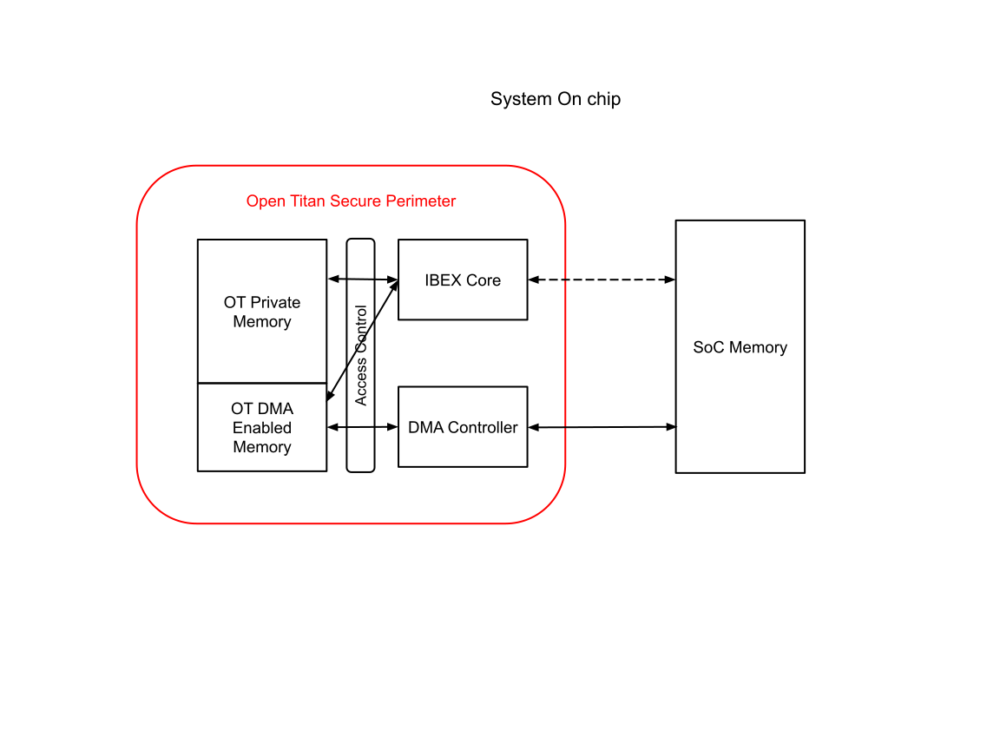

# Theory of Operation

## Block Diagram

## Defining Relevant Memory Regions

|                       |     |
|-----------------------|-----|
| OT Private Memory     | Memory within the OpenTitan RoT secure perimeter
|                       | This memory is allocated to the OT components like Ibex core for its secure code execution and data storage memory |
| OT DMA Enabled Memory | Memory within the OpenTitan RoT secure perimeter. |
|                       | This memory is allocated as a staging area while moving data using the DMA controller |
|                       | DMA operation is allowed to touch this memory |
|                       | DMA controller shall provide configuration range registers to map OT internal memory as DMA enabled memory |
| SoC memory            | Any memory outside the OpenTitan RoT secure perimeter |
|                       | This memory may be untrusted from the OT perspective or may be included in its trust boundary for certain cases by leveraging SoC defined security access control enforcement |

## Mode of operation

The DMA is envisioned to operate in two main modes:

1.  Data movement (bulk data movement or register read / write
    operations). May perform additional smart in-line operations during
    data movement beyond simple copy.
2.  Hardware handshake mode where the DMA controller may be used to fill
    up or drain out hardware FIFO data for low speed IO peripherals (or
    other peripherals) that support it.

### Generic DMA operation

Mode of operation & interactions with components considered external to
the OT Trusted Compute Boundary

-   External agents (e.g. System Host or other SoC Controllers) may
    request certain security services from OpenTitan such as encryption,
    digital signing etc. Such an operation is requested using the
    Mailbox interface and may involve bulk data movement.

    -   Please refer to the
        [*mailbox specification*](../../mbx/doc/theory_of_operation.md) for
        further details on the mailbox structure.

-   Through the mailbox interface following information may be passed:

    -   Source address pointer & address space identifier for the source
        address.

    -   Destination address pointer & address space identifier of the
        destination address.

    -   Size of the data object to be moved.

    -   Opcode - Type of any optionally supported operation e.g.
        Cryptographic hash.

-   OT firmware parses the command object passed through the mailbox.
-   OT firmware sanitizes mailbox objects as required.
-   OT firmware allocates DMA enabled memory space for the data movement
    as needed.
-   OT firmware configures DMA source address register & the
    corresponding address space Identifier.
-   OT firmware configures DMA destination address register &
    corresponding address space Identifier.
-   OT firmware completes other configurations such as operation size,
    OPCODE of any additional inline operations requested (e.g.
    cryptographic hash calculation of data blob being moved).
-   OT firmware triggers the DMA operation.
-   DMA hardware performs appropriate address and configuration checks
    to enforce the defined security and access control properties.
-   OT firmware chooses to poll for status registers until operation
    completes or waits for completion interrupt from the DMA controller.

***Notes***:

-   *Please refer to the Integrated [*OpenTitan: Access to SoC address space document*]()
    for more details on the address spaces (OT internal, Control
    Register address space, System Address Space), corresponding
    identifiers & any involved address translation. Note that the
    address pointer may be an IO Virtual Address (IOVA) when the address
    space identifier is the system address space.*
-   *As mentioned in the aforementioned document, the SoC memory may be
    subject to additional protection schemes - either using
    cryptographic techniques or access control based isolation
    techniques.*
-   *External agents **shall not have direct access** to any addressable
    regions within OT address space other than the mailbox registers.*
-   *The DMA controller shall support hardware range registers to
    configure the address range for DMA enabled OT memory. Range
    registers may be configured by OT firmware at boot time and locked
    from further modification until next reset. Existing specifications
    and implementations of range registers, such as for PMP, may be
    reused, although striking a balance between feature complexity and
    consolidation is needed.*
-   *DMA controller shall perform address checks against this configured
    range.*
-   *Detailed list of hardware checks performed by the DMA controller
    covered under* [*DMAC HW Enforced Security Checks*](#dmac-hw-enforced-security-checks).
-   *Note that the DMA enabled memory may be a physically separate SRAM
    structure or a partitioned and access controlled region of the OT
    SRAM memory.*

### Hardware handshake based DMA operation

DMA based hardware handshake is used to offload the receiving data from
or sending data to a low-speed I/O FIFO (LSIO FIFO). The low speed
device must provide a trigger (or interrupt) signal to initiate data
transfer. (A dedicated trigger/interrupt signal was selected instead of
a polling mechanism to keep the on-chip network to which the DMA
controller control interface is attached clean of many repeated
transactions. The number of interrupt signals is expected to be low,
e.g., 2 or 3.)

Following information regarding the low speed IO peripheral will be known
to firmware at build time and set in the DMAC registers to configure a
hardware handshake DMA operation.

**Receiving data from LSIO**

-   [*Source address*](registers.md#src_addr_lo): address of the low speed IO
    receive FIFO read out register.
-   [*Destination address*](registers.md#dst_addr_lo): address to the memory
    buffer where received data is placed.
-   [*Address space ID*](registers.md#addr_space_id) (ASID): (OT Internal, CTN or System)

    -   Source ASID: Specify the address space in which the LSIO FIFO is
        visible.

    -   Destination ASID: Specify the address space in which the
        destination buffer resides.

-   [*Chunk Size*](registers.md#chunk_data_size): Size of each of the non-final chunks
    of data making up the total transfer. Chunked transfers allowing the DMA controller
    to perform a transfer in a piecemeal fashion, incrementally moving chunks of data
    from the Low Speed IO peripheral FIFO as they become available.
-   [*Total Size*](registers.md#total_data_size): Total size of the data object to be popped
    from the FIFO (equivalent to the number of reads from the FIFO per
    interrupt times the FIFO read data width).
-   [*Transfer Width*](registers.md#transfer_width): Width of each transaction
    (equivalent to FIFO read data width).
-   [*Source Configuration*](registers.md#src_config): Source configuration specifying
    the addressing mode to be used for the source of the data.

    -   Wrap: When set, the source address will wrap back to the programmed start address at
        the end of each data chunk such that all chunks overlap. When clear, chunks are
        retrieved from contiguously-ascending addresses.

    -   Increment: If set, consecutive 'transfer width' bytes of data are transferred to/from
        the source using consecutive addresses. If not set, all data reads within a single
        chunk are performed to/from a single address.

-   [*Destination Configuration*](registers.md#dst_config): Destination configuration
    specifying the addressing mode to be used for the data destination. Addressing modes are as
    per the Source Configuration description above.
-   [*DMAC Control register*](registers.md#control):

    -   Opcode: Type of operation requested. Typically set to copy
        operation in case of hardware handshake mode of operation.

    -   Hardware handshake enable = 1

    -   Initial Transfer: This bit shall be set for the first chunk of any DMA transfer,
        which ensures that the DMA transfer and any inline hashing operation are properly
        initialized. It shall be cleared for all non-initial chunks of the transfer.

    -   Go = 1 to start the operation.

-   DMA engines start listening to input interrupt.
-   Low speed IO peripheral FIFO asserts interrupt once FIFO reaches a
    certain threshold.
-   The DMA engine reads 'chunk size' bytes from the pointer in the source address
    register and transfers them to the destination.
    Note that the width of each read is as per the 'transfer width' setting.
-   **Note**: *the assumption is that the peripheral lowers its interrupt signal once
    the FIFO is cleared. No explicit clearing is necessary.*
-   The DMA engine advances the source and/or destination addresses to the start of the next
    chunk if the source/destination configuration does not specify 'wrap' addressing mode.
-   DMA engine waits for the interrupt to get asserted again (i.e. waits for FIFO to be filled).

**Sending data to LSIO**

-   [*Source address*](registers.md#src_addr_lo): Pointer to the head of the
    memory buffer.
-   [*Destination address*](registers.md#dst_addr_lo): pointer to the FIFO
    register.
-   [*Address space ID*](registers.md#addr_space_id) (ASID): (OT Internal, CTN or System)

    -   Source ASID: Specify the address space in which the source
        buffer resides.

    -   Destination ASID: Specify the address space in which the LSIO
        FIFO is visible.

-   [*Chunk Size*](registers.md#chunk_data_size): Size of each of the non-final chunks
    of data making up the total transfers. Chunked transfers allowing the DMA controller
    to perform a transfer in a piecemeal fashion, incrementally sending chunks of data
    to the Low Speed IO peripheral FIFO as space becomes available.
-   [*Total Size*](registers.md#total_data_size): Size of the data object to be pushed
    into the FIFO.
-   [*Transfer Width*](registers.md#transfer_width): Write Data width of the LSIO FIFO
    register. Each write transaction is equal to this size.
-   [*Source Configuration*](registers.md#src_config): Source configuration specifying
    the addressing mode to be used for the source of the data. Addressing modes are as
    per the Destination Configuration description below.
-   [*Destination Configuration*](registers.md#dst_config): Destination configuration
    specifying the addressing mode to be used for the data destination.

    - Wrap: When set the destination address will return to its programmed start
      address at the end of data chunk such that all chunks overlap. This is normally
      the desired behavior when writing to a destination FIFO.

    - Increment: If clear, all of the data words within a chunk will be written to the
      same address. For a memory-mapped peripheral FIFO this will normally be the
      desired behavior. If this bit is set then the data words within a chunk will be
      sent to contiguously-ascending addresses which may be useful with some peripherals
      that do not present a typical FIFO interface but rather, for example, a set of
      registers.

-   [*DMAC Control register*](registers.md#control)

    -   Opcode: Type of operation requested. Typically set to copy
        operation in case of hardware handshake mode of operation.

    -   Hardware handshake enable = 1

    -   Initial Transfer: This bit shall be set for the first chunk of any DMA transfer,
        which ensures that the DMA transfer and any inline hashing operation are properly
        initialized. It shall be cleared for all non-initial chunks of the transfer.

    -   Go = 1 to start the operation.

-   DMA engines start listening to input interrupt.
-   Low speed IO peripheral FIFO asserts interrupt once FIFO reaches a
    certain 'almost empty' threshold.
-   The DMA engine reads 'total size' bytes from the source address (memory) and
    sends them to the peripheral.
    Note that the width of each write is as per the 'transfer width' setting.
-   **Note**: *the assumption is that the peripheral lowers its 'almost empty'
    interrupt once the FIFO is filled. No explicit clearing is necessary.*
-   The DMA engine advances the source and/or destination addresses to the start of the next
    chunk if the source/destination configuration does not specify 'wrap' addressing mode.
-   DMA engine waits for the interrupt to get asserted again (i.e. waits
    for FIFO to be almost empty).

## Security Considerations

The DMA controller provides the following security value:

-   Separation of roles and responsibilities.

    -   Ibex core involved in control / configuration, security
        monitoring operations.

    -   DMA controller involved in data movement & corresponding
        hardware enforced checks.

-   DMA engine acts as the boundary between OT secure components & the
    SoC for data movement.
-   While moving data from the SoC to OpenTitan, the DMA controller
    protects the Ibex core by staging the moved data into a DMA enabled
    memory location and providing an opportunity to perform additional
    security checks on it, before it is touched by the Ibex core.
-   Similarly, while moving data out of the OT secure perimeter,
    provides an opportunity to inspect it for information leakage within
    the DMA enabled memory, prior to moving it out of the secure
    perimeter.
-   A read to an SoC address may have side effects causing the operation
    to hang. Using the Ibex core directly to perform such a read
    operation could risk hanging the core. Using the DMA controller to
    perform such reads shields the Ibex core from such availability
    issues. The DMA controller must ensure that problems such as hanging
    transactions on the SoC interface do not lead to problems on any
    OpenTitan-internal interfaces.

Note that to ensure secure movement of data, the following assumptions must
hold:

-   The DMA Controller configuration shall be under OpenTitan firmware
    (Ibex core) control only.
-   External agents to the OpenTitan secure boundary *shall not* have
    access to the DMA registers.
-   Following restrictions to data movement are observed and enforced by
    the DMA controller.

| From -> , To ↓    | OT Private Memory | OT DMA Memory | SoC Memory |
|-------------------|-------------------|---------------|------------|
| OT Private Memory | ✔                 | ✔             | ❌         |
| OT DMA Memory     | ✔                 | ✔             | ✔          |
| SoC Memory        | ❌                | ✔             | ✔          |

### DMAC HW Enforced Security Checks

-   DMA enabled memory range registers are configured & locked prior to
    starting any DMA operation.
-   If the configured source address space ID is SOC (CTN or System) and
    destination address space ID is OT internal, then destination
    address pointer must lie within the DMA enabled memory range.
-   If the configured destination address space ID is SOC (CTN or
    System) and source address space ID is OT internal, then source
    address pointer must lie within the DMA enabled memory range.
-   If source (or destination) address space ID is set to CTN, then read
    (or write transactions) are sent to CTN port only. If CTN port is
    configured to be 32 bits, then make sure that the upper 32 bits of
    the source (or destination) address register pointer are all zeroes.
-   If source (or destination) address space ID is set to OT Internal,
    then read (or write transactions) are sent to OT internal port only.
    Make sure that the upper 32 bits of the source (or destination)
    address register pointer are all zeroes.
-   If source (or destination) address space ID is set to System, then
    read (or write transactions) are sent to system port only. Full 64
    bits of the source (or destination) address pointer is available.

## DMA Controller Configuration Notes

DMA requests are initiated by the system software (or SoC firmware
agent) through the appropriately defined [*DOE mailbox
objects*](). Completion status of the DMA operation to
the original requested is done via the DOE response object mechanism.

## Inline Hashing

The DMA controller offers support for on-the-fly calculation of hash digests on
the data being transferred, using any of the following algorithms:

- SHA-256 - SHA-2 hash with a 256-bit digest.
- SHA-384 - SHA-2 hash with a 384-bit digest.
- SHA-512 - SHA-2 hash with a 512-bit digest.

This is achived simply by modifying the [*opcode*](registers.md#control--opcode)
field of the [*CONTROL*](registers.md#control) and collecting the
[digest](registers.md#sha2_digest) from the registers interface when the
transfer has completed.

## Extension: Inline Operations

In a next generation, the DMA controller can be extended to perform
inline operations on data it is transferring. We primarily foresee
cryptographic operations, such as hashing or encryption, with three main
use cases:

1.  Encrypting or hashing data on-the-fly is faster (in terms of latency
    and throughput) than separating the data transfer from the
    cryptographic operation.
2.  Hashing data on-the-fly and only writing the resulting hash to the
    target memory.

    1.  removes size restrictions on the data to be hashed, which would
        otherwise have to fit OT-internal memory, and

    2.  keeps data confidential because it is physically only accessible
        by the hashing (or encryption) engine used by the DMA
        controller.

To implement such inline cryptographic operations, there are two main
options:

1.  Instantiating dedicated cryptographic hardware modules inside the
    DMA controller.
2.  Sharing cryptographic hardware modules (such as the AES Accelerator
    or KMAC) that are already instantiated in OT over a HW application
    interface. KMAC already has such an interface.

The advantage of dedicated modules is that they can be parametrized or
even designed specifically for the needs of the DMA controller (e.g.,
high throughput, low latency, or both) and that no arbitration and load
balancing between the DMA controller and other users of the shared
modules is needed.

The advantage of shared modules is that they save area. Cryptographic
modules that are hardened against SCA and/or support a high throughput
or low latency occupy a substantial amount of area (100 kGE to multiple
hundred kGE, depending on requirements).

Shared modules are thus preferable if they can meet throughput and
latency requirements. To make this design decision, those requirements
have to be known.

## Clocking and reset

The DMA controller uses a single clock and the entire IP block operates synchronously on that clock. An important design consideration is the implementation of clock gating throughout the module to save power.
A single reset input provides an asynchronous reset of the entire IP block. Any clock domain crossings and reset domain crossings required to interface to devices and/or the System On Chip infrastructure are outside of the scope of this IP.

### Clock gating

As a power-saving measure - since it is anticipated that the DMA controller will only be used sporadically - the design includes a clock gate that is used to stop the clock to most of the IP block when it is not in active use.
The `prim_clock_gating` clock gate is enabled by writes to the  `CONTROL` register - used to start a transfer - and remains enabled whilst the DMA controller is operating.
The gating is handled automatically by the hardware and should not be software-visible.

## Integration into Systems On Chips (SoCs)

In accordance with the [comportability specification](../../../../doc/contributing/hw/comportability) the DMA controller offers the following interfaces:

- TileLink-UL interface to registers
- Interrupts
- Alerts
- [RACL](../../../../doc/contributing/hw/racl)

The DMA controller also has up to three host interfaces, permitting it to transfer data to/from a number of devices.
Two of these interfaces are TL-UL (TileLink Uncached Light) as per the register interface:

- host_tl_h_i|o: TL-UL host connection to the RoT-private memory.
- ctn_tl_d2h_i|h2d_o: Host connection to the ConTrol Network of the SoC.

The third host interface of the DMA controller uses a different bus specification which is described below.

### SoC System Bus

Unlike the TL-UL ports, the SoC System Bus requires a 64-bit address space.
The signaling is similar to that of the TL-UL bus except that read and write channels are separated.
The DMA controller, however, presently issues only a single read or a single write request at a time.

#### SoC System Bus Request

| Signal            | Description                     |
|-------------------|---------------------------------|
| vld_vec[cmd]      | Valid request                   |
| metadata_vec[cmd] | Constant, indicating the source |
| opcode_vec[cmd]   | Opcode indicating request type  |
| iova_vec[cmd]     | Requested address (64 bits)     |
| racl_vec[cmd]     | RACL role of DMA controller     |
| write_data[cmd]   | Data for write commands         |
| write_be[cmd]     | Byte enables for write commands |
| read_be[cmd]      | Byte enables for read commands  |

#### SoC System Bus Response

| Signal            | Description                      |
|-------------------|----------------------------------|
| grant_vec[cmd]    | Indicates request accepted       |
| read_data_vld     | Read data is valid               |
| read_data         | Data returned for read request   |
| read_metadata     | Constant from request            |
| error_vld         | Indicates a read/write error     |
| error_vec         | Error condition(s) that occurred |

## Sub-word extraction and replication

The DMA controller supports sub-word transfers on the bus, e.g. for a 32-bit TL-UL implementation it is also capable of transferring 1-byte and 2-byte quantities.
This may be useful for lower-speed peripherals with narrower FIFOs/registers.
Since the `tlul_adapter_host` only issues reads of full bus words the device should normally ignore the least significant bit(s) of the address, which will be zero.
Such a device is normally expected to replicate the sub-word across the width of the returned bus word, making its behavior compatible with that of a regular memory responding to word read requests.
To operate seamlessly with either a memory or a peripheral, the DMA controller will extract the sub-word from the appropriate lane of the returned data word, based upon the least significant bit(s) of the source address.

When writing less than a full bus word, the DMA controller will replicate the selected 8- or 16-bit sub-word across the width of the bus word before writing.
It will also assert the appropriate bits of the `mask` field on the TL-UL A channel (or correspondingly the `write_be` strobes of the SoC System Bus), and a narrower peripheral may thus ascertain which part of the word is to be used.

The example below shows this behavior when performing 1-byte transfers from a source to a destination, with the two least significant address bits being 2'b01 (i.e. the source address is of the form '4n + 1').

The second byte within the 32-bit word ('b') is extracted from the 32-bit word read from the source, and then replicated at every byte position within the 32-bit data word that is written to the destination.

## Low Speed I/O peripheral interrupt lines

The DMA controller also offers hardware-mediated transfers using direct interrupt lines from a peripheral block involved in the transfer.
These lines, instead of signaling to a CPU in the conventional fashion, may be steered to the DMA controller to inform it of the availability of source data (e.g. receive FIFO level in excess of a programmed threshold), or that there is sufficient space at the destination (e.g. transmit FIFO level is below a programmed threshold).

In response to the assertion of an enabled bit of the `lsio_trigger_i` input, the DMA controller will proceed to transfer an entire chunk of data from the source to the destination.
The action of reading/writing this data must cause the interrupt input to become deasserted before the DMA controller has completed the reading/writing of this chunk, unless sufficient additional input/output causes another interrupt-generating condition to occur.
Whilst the `lsio_trigger_i` input is not asserted, the DMA controller will remain in its Idle state awaiting instruction to proceed with the next chunk of the transfer.
Data is thus transferred from source to destination at a rate appropriate for each device involved in the transfer.
