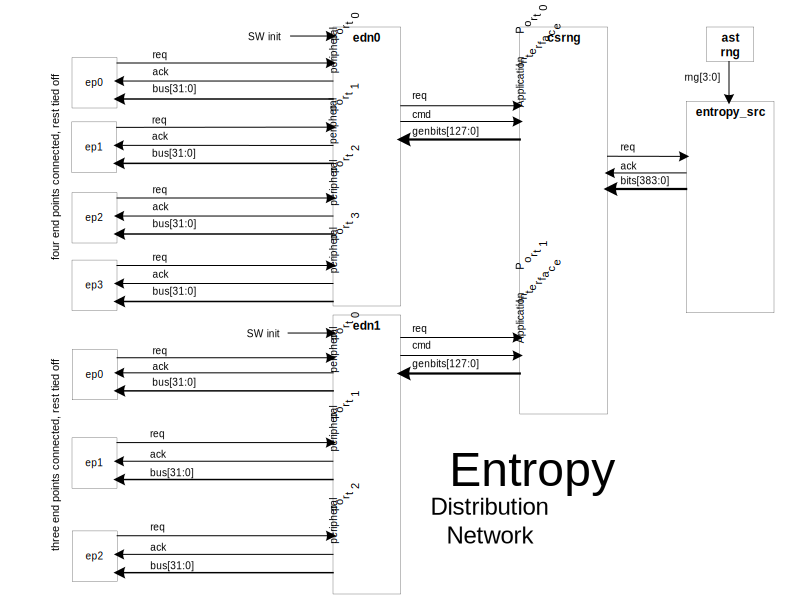

# EDN HWIP Technical Specification

[`edn`](https://reports.opentitan.org/hw/ip/edn/dv/latest/report.html):

# Overview

This document specifies EDN hardware IP functionality.
This module conforms to the [Comportable guideline for peripheral functionality.](../../../doc/contributing/hw/comportability/README.md)

## Features

The Entropy Distribution Network (EDN) block provides both hardware and software interfaces to the [CSRNG IP](../csrng/README.md) module.
A primary objective of the EDN block is to provide a simpler hardware interface for the peripheral blocks to use, in which case they do not have to directly interface with the CSRNG module.
- The EDN block provides a set of registers for firmware to manage a CSRNG application interface port.
- There are eight request/acknowledge hardware interfaces.
- Each hardware interface supports a fixed bus width of 32 bits.
- The EDN block has an "auto request mode" where `generate` and `reseed` CSRNG application commands can be programmed to be done continuously in hardware.
- There is also a "boot-time request mode",  where a single TL-UL configuration write will trigger a proper CSRNG application command sequence to fetch the pre-FIPS entropy for tasks immediately at boot-time or after reset.
- There are two interrupts that are supported:
  - CSRNG application command has completed.
  - An internal FIFO error has occurred.
- There are two alerts that are implemented in this revision:
  - A fatal alert to report common security fatal errors and EDN specific fatal errors. A list of fatal errors are listed in the [`ERR_CODE`](data/edn.hjson#err_code) register.
  - A recoverable alert to report recoverable error. A list of fatal errors are listed in the [`RECOV_ALERT_STS`](data/edn.hjson#recov_alert_sts) register.

## Description

This IP block acts as a gasket between peripheral hardware blocks and the CSRNG block.
One function this IP block performs is to translate data transfer size.
For example, CSRNG will return 128 bits on the `genbits` bus.
A peripheral block will connect with a 32-bit data bus.
The EDN block will move the first 32 bits from the returned `genbits` bus, and hold on to the remaining data until another request asks for more data.
Furthermore, if data is not consumed immediately, the interface to the CSRNG will indicate back pressure to the CSRNG block.
Each of the hardware interfaces can request data such that any `genbits` bus return can supply any requesting peripheral block.

At most one hardware peripheral block can connect to each EDN peripheral port.
Hardware peripherals request more data from the EDN by asserting the `req` signal.
When random values are available, the EDN transmits them on the `bus` and asserts an `ack` signal to signify the arrival of fresh values.

Application interface commands to the CSRNG block can be generated by either firmware or hardware.

Firmware can issue CSRNG commands on behalf of hardware peripherals, by writing the commands to the [`SW_CMD_REQ`](data/edn.hjson#sw_cmd_req) register.
The command status response is captured in the [`SW_CMD_STS`](data/edn.hjson#sw_cmd_sts) register.
Even when CRSNG `generate` commands are issued by firmware, all random values are distributed to the hardware peripherals.

If firmware applications require random values for their *own* use, they must issue the commands directly to the CSRNG, which maintains a dedicated CSRNG instance for firmware that is accessible through TL-UL.

There are two modes for EDN hardware to generate CSRNG commands.
One is the "auto request mode", where two FIFOs are used to send commands.
The general operation of this mode is that the CSRNG instance is set up by firmware, then the FIFOs are preloaded with commands.
One FIFO can be programmed to send `generate` commands.
The other FIFO can be programmed to send `reseed` commands.
The [`MAX_NUM_REQS_BETWEEN_RESEEDS`](data/edn.hjson#max_num_reqs_between_reseeds) register sets the number of `generate` commands allowed between `reseed` commands.
Once this is done, the EDN block can request data from the CSRNG once firmware has instantiated the associated instance through the EDN command forwarding interface.
When in this mode, the EDN emits `generate` commands from the first FIFO to get more data.
Once the [`MAX_NUM_REQS_BETWEEN_RESEEDS`](data/edn.hjson#max_num_reqs_between_reseeds) timer expires, the EDN block emits a `reseed` command from the second FIFO.
The process of sending these two commands will repeat forever until the `EDN_ENABLE` field is cleared, the `AUTO_REQ_MODE` field is cleared, or the EDN is reset.

Any of the command FIFOs can be reset by asserting the `CMD_FIFO_RST` field in the [`CTRL`](data/edn.hjson#ctrl) register.

The other mode is "boot-time request mode", where only the hardware generates CSRNG application interface commands.
In this mode a single `instantiate` command is sent, followed by a stream of `generate` commands.
This sequence fetches the initial random values needed for the system to boot.
Use of boot-time request mode, though simpler in operation, is only for applications which do not require FIPS-approved random values.
Please see the [entropy_src IP documentation](../entropy_src/README.md) for more information on trade-offs when creating CSRNG seeds before the completion of the FIPS-required health checks.
In boot-time request mode the generate commands continue until `EDN_ENABLE` field is cleared (set to false), the `BOOT_REQ_MODE` field is cleared, or the EDN is reset.
Note that when the `EDN_ENABLE` field is cleared or the `BOOT_REQ_MODE` field is cleared, an `uninstantiate` command needs to be sent by firmware to destroy the instance in csrng.
Note that the EDNs and CSRNG should always be reset together to ensure proper instantiation or uninstantiation of state variables.

### Security

All module assets and countermeasures performed by hardware are listed in the hjson countermeasures section.
Labels for each instance of asset and countermeasure are located throughout the RTL source code.

The receiving FIFO for genbits from CSRNG will have a hardware check on the output bus.
This is done to make sure repeated values are not occurring.
Only 64 bits (out of 128 bits) are checked, since this is statistically significant, and more checking would cost more silicon.
It is expected that an endpoint requiring high-quality entropy will do an additional consistency hardware check on the 32 bit data bus.
Additionally the FIPS signal on the endpoint bus should also be checked for high-quality entropy consumers.
Boot request mode is an example where the FIPS signal will not be ever be set, and consuming endpoint of low-quality entropy do not need to check this signal.

## Example Topology
In general, the OpenTitan random number subsystem consists of one `entropy_src`, one CSRNG, and one or more EDNs.
The `entropy_src` only supports one connection to a CSRNG, but the CSRNG has multiple application interface ports for connecting to EDN's or other hardware blocks.
In the example below, two EDN modules are used to distribute `genbits` from the CSRNG to peripheral modules.
(Note that this is just an example; consult the specification of a specific top-level design for the specific configuration used there.)

