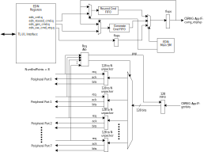

# Overview

This document specifies EDN hardware IP functionality.
This module conforms to the [Comportable guideline for peripheral functionality.]()

## Features

The Entropy Distribution Network (EDN) block provides both hardware and software interfaces to the [CSRNG IP]() module.
A primary objective of the EDN block is to provide a simpler hardware interface for the peripheral blocks to use, in which case they do not have to directly interface with the CSRNG module.
- The EDN block provides a set of registers for firmware to manage a CSRNG application interface port.
- There are four request/acknowledge hardware interfaces.
- Each hardware interface supports a fixed bus width of 32 bits.
- The EDN block has an "auto request mode" where `generate` and `reseed` CSRNG application commands can be programmed to be done continuously in hardware.
- There is also a "boot-time request mode",  where a single TL-UL configuration write will trigger a proper CSRNG application command sequence to fetch the pre-FIPS entropy for tasks immediately at boot-time or after reset.
- There are two interrupts that are supported:
  - CSRNG application command has completed.
  - An internal FIFO error has occurred.
- No alerts are supported by this revision.

## Description

This IP block acts as a gasket between peripheral hardware blocks and the CSRNG block.
One function this IP block performs is to translate data transfer size.
For example, CSRNG will return 128 bits on the `genbits` bus.
A peripheral block will connect with a 32-bit data bus.
The EDN block will move the first 32 bits from the returned `genbits` bus, and hold on to the remaining data until another request asks for more data.
Furthermore, if data is not consumed immediately, the interface to the CSRNG will indicate back pressure to the CSRNG block.
Each of the four interfaces can request data such that any `genbits` bus return can supply any requesting peripheral block.

At most one hardware peripheral block can connect to each EDN peripheral port.
Hardware peripherals request more data from the EDN by asserting the `req` signal.
When random values are available, the EDN transmits them on the `bus` and asserts an `ack` signal to signify the arrival of fresh values.

Application interface commands to the CSRNG block can be generated by either firmware or hardware.

Firmware can issue CSRNG commands on behalf of hardware peripherals, by writing the commands to the  register.
The command status response is captured in the  register.
Even when CRSNG `generate` commands are issued by firmware, all random values are distributed to the hardware peripherals.

If firmware applications require random values for their *own* use, they must issue the commands directly to the CSRNG, which maintains a dedicated CSRNG instance for firmware that is accessible through TL-UL.

There are two modes for EDN hardware to generate CSRNG commands.
One is the "auto request mode", where two FIFOs are used to send commands.
The general operation of this mode is that the CSRNG instance is set up by firmware, then the FIFOs are preloaded with commands.
One FIFO can be programmed to send `generate` commands.
The other FIFO can be programmed to send `reseed` commands.
The  register sets the number of `generate` commands allowed between `reseed` commands.
Once this is done, the EDN block can request data from the CSRNG once firmware has instantiated the associated instance through the EDN command forwarding interface.
When in this mode, the EDN emits `generate` commands from the first FIFO to get more data.
Once the  timer expires, the EDN block emits a `reseed` command from the second FIFO.
The process of sending these two commands will repeat forever until the `EDN_ENABLE` bit is cleared, the `AUTO_REQ_MODE` bit is cleared, or the EDN is reset.

Any of the command FIFOs can be reset by asserting the `CMD_FIFO_RST` bit in the  register.

The other mode is "boot-time request mode", where only the hardware generates CSRNG application interface commands.
In this mode a single `instantiate` command is sent, followed by a stream of `generate` commands.
This sequence fetches the initial random values needed for the system to boot.
Use of boot-time request mode, though simpler in operation, is only for applications which do not require FIPS-approved random values.
Please see the [entropy_src IP documentation]() for more information on trade-offs when creating CSRNG seeds before the completion of the FIPS-required health checks.
In boot-time request mode the generate commands continue until `EDN_ENABLE` bit is cleared, the `BOOT_REQ_DIS` bit is set, or the EDN is reset.
Note that when the `EDN_ENABLE` bit is cleared or the `BOOT_REQ_DIS` bit is set, an `uninstantiate` command needs to be sent by firmware to destroy the instance.
Note that the EDNs and CSRNG should always be reset together to ensure proper instantiation or uninstantiation of state variables.

## Example Topology
In general, the OpenTitan random number subsystem consists of one `entropy_src`, one CSRNG, and one or more EDNs.
The `entropy_src` only supports one connection to a CSRNG, but the CSRNG has multiple application interface ports for connecting to EDN's or other hardware blocks.
The diagram below shows an example topology where two EDN modules are used to distribute `genbits` from the CSRNG to peripheral modules.


# Theory of Operations

The EDN is for distributing random number streams to hardware blocks, via peripheral ports on on the EDN.
Each block connected to a peripheral port is referred to as an endpoint.

To enable the EDN block, set the `EDN_ENABLE` bit in the  register..

## Interaction with CSRNG Application Interface Ports

The CSRNG application interface implements the "function envelopes" recommended by [NIST SP 800-90A](https://nvlpubs.nist.gov/nistpubs/SpecialPublications/NIST.SP.800-90Ar1.pdf) for random number generation, and these function envelopes establish certain requirements for the order of operations.
For instance, the application interface port must receive an explicit `instantiate` command before receiving any `generate` commands.
The sequences of commands generated by a particular EDN are either controlled by the EDN state machine or by commands forwarded from firmware through the  register.

Whenever commands are directly forwarded from firmware to the CSRNG through the  register, firmware must poll and clear the `CMD_ACK` bit of the  register before sending any further commands.

There are two broad modes for state machine control: auto request mode and boot-time request mode.

### Boot-time Request Mode

Random values are needed by peripherals almost immediately after reset, so to simplify interactions with the boot ROM, boot-time request mode is the default mode.

In boot-time request mode, the command sequence is fully hardware-controlled and no command customization is possible.
In this mode, the EDN automatically issues a special reduced-latency `instantiate` command followed by the default `generate` commands.
This means, for instance, that no personalization strings or additional data may be passed to the CSRNG application interface port in this mode.
On exiting, the EDN issues an `uninstantiate` command to destroy the associated CSRNG instance.
Since boot-time request mode is enabled as the default mode on reset, a single write to the `EDN_ENABLE` bit will start the flow of entropy in this mode.

Once firmware initialization is complete, it is important to exit this mode if the endpoints ever need FIPS-approved random values.
This is done by either *clearing* the `EDN_ENABLE` bit or *setting* the `BOOT_REQ_DIS` bit in  to halt the boot-time request state machine.
Firmware must then wait for successful the shutdown of the state machine by polling the `REQ_MODE_SM_STS` field of the  register.

#### Note on Security Considerations when Using Boot-time Request Mode

Boot-time request mode is not intended for normal operation, as it tolerates the potential use of preliminary seeds for the attached CSRNG instance.
These preliminary seeds are described as "pre-FIPS" since they are released from the `entropy_src` before the complete start-up health-checks recommended by FIPS have been completed.
Thus pre-FIPS seeds have weaker guarantees on the amount of physical entropy included in their creation.
As detailed in the [`entropy_src` documentation](), only the first CSRNG seed created after reset is pre-FIPS.
All following seeds from the `entropy_src` are passed through the full FIPS-approved health checks.
Therefore at most one EDN can receive a pre-FIPS seed after reset.
Since boot-time request mode EDN streams may be FIPS non-compliant, firmware must at some point disable boot-time request mode and reinitialize the EDN for either firmware-driven operation or auto request mode.

#### Multiple EDNs in Boot-time Request Mode

If many endpoints require boot-time entropy multiple boot-time EDNs may be required, as the EDN has a fixed maximum number of peripheral ports.
Since physical entropy generation takes time, there exists a mechanism to prioritize the EDNs, to match the boot priority of each group of attached endpoints.
To establish an order to the instantiation of each EDN, enable them one at a time.
To ensure that the most recently enabled EDN will get next priority for physical entropy, poll the `BOOT_INST_ACK` field in the  register before enabling the following EDN.

If using boot-time request mode, the CSRNG seed material used for the first-activated EDN is the special pre-FIPS seed, which is specifically tested quickly to improve latency.
The first random values distributed from this EDN will therefore be available roughly 2ms after reset.
The `entropy_src` only creates only one pre-FIPS seed, so any other EDNs must wait for their seeds to pass the full FIPS-recommended health checks.
This means that each subsequent EDN must wait an additional 5ms before it can start distributing data.
For instance, if there are three boot-time request mode EDN's in the system, the first will start distributing data 2ms after reset, the second will start distributing data 7ms after reset, and the third will start distributing data 12ms after reset.

### Auto Request Mode

Before entering auto request mode, it is the responsibility of firmware to first generate an `instantiate` command for the EDN-associated instance via the  register.
The required `generate` and `reseed` commands must also be custom generated by firmware and loaded into the respective command replay FIFOs via the  and  registers.
These `generate` commands will be issued as necessary to meet the bandwidth requirements of the endpoints.
The `reseed` commands will be issued once every `MAX_NUM_REQS_BETWEEN_RESEEDS` generate requests.
For details on the options for application interface commands please see the [CSRNG IP Documentation]().
Once the CSRNG instance has been instantiated, and the `generate` and `reseed` commands have been loaded, auto request mode can be entered by programming the  register with `EDN_ENABLE`, `AUTO_REQ_MODE` and `BOOT_REQ_DIS` all asserted.
Note that if BOOT_REQ_DIS is deasserted the state machine will enter boot-time request mode, even if AUTO_REQ_MODE is asserted.

To issue any new commands other than those stored in the generate or reseed FIFOs, it is important to disable auto request mode, by deasserting the `AUTO_REQ_MODE` field in the  register.
Firmware must then wait until the current command is completed by polling the `REQ_MODE_SM_STS` bit in the  register
Once `REQ_MODE_SM_STS` reads zero, the state machine is idle and new firmware-driven commands can be passed to the CSRNG via the  register.

### Note on State Machine Shutdown Delays

When leaving boot-time request mode or auto request mode, the EDN state machine waits for completion of the last command, before sending a shutdown acknowledgement to firmware.
The longest possible commands are the `instantiate` or `reseed` requests, which typically take about 5ms, due to the time required to gather the necessary physical entropy.
By contrast, the largest possible `generate` command allowed by [NIST SP 800-90A](https://nvlpubs.nist.gov/nistpubs/SpecialPublications/NIST.SP.800-90Ar1.pdf) is for 2<sup>19</sup> bits (or 4096 AES codewords).
Assuming an AES encryption delay of 16 clocks, and a 100 MHz clock frequency, the longest allowable `generate` command would take only 0.7 ms to complete.

### Note on Sharing of CSRNG Instance State Variables

Once an application interface port has received an `instantiate` command, that application interface port then has access to a unique CSRNG instance, which is shared by all endpoints on the same EDN.
Therefore from a security perspective, an attack to that particular CSRNG instance is an attack on all the endpoints that share the same EDN.
Meanwhile, seeds and other state variables specific to a particular CSRNG instance are not shared between endpoints on *separate* EDN instances, or with any hardware devices with direct connections to dedicated CSRNG application interface ports.

## Interactions with Peripheral Devices

Peripheral ports distribute data to the endpoints using four signals: `req`, `ack`, `bus`, and `fips`.

Fresh (i.e. previously unseen) random values are distributed to the endpoints via the 32 bit `bus` signal, in response to a `req` signal.
Whenever new values are placed on the `bus`, the `ack` is asserted until the values are consumed by the endpoint, as indicated by simultaneous assertion of the `req` and `ack` signals in the same cycle.
Otherwise `ack` is deasserted until enough fresh bits are received from CSRNG.
The bus data will persist on the bus until a new `req` is asserted.
This persistance will allow an asynchonous endpoint to capture the correct data sometime after the `ack` de-asserts.

The `fips` signal is used to identify whether the values received on the `bus` have been prepared with complete adherence to the recommendations in NIST SP 800-90.
If the `fips` signal is deasserted, it means the associated CSRNG instance has been instantiated with a pre-FIPS seed.

## Block Diagram



## Hardware Interfaces



## Design Details

### EDN Initialization

After power-up, the EDN block is disabled.
A single TL-UL configuration write to the   register will start random-number streams processing in boot-time request mode.
CSRNG application commands will be sent immediately.
Once these commands have completed, a status bit will be set.
At this point, firmware can later come and reconfigure the EDN block for a different mode of operation.

The recommended write sequence for the entire entropy system is one configuration write to ENTROPY_SRC, then CSRNG, and finally to EDN.

### Interrupts

The EDN module has two interrupts: `edn_cmd_req_done` and `edn_fifo_err`.

The `es_cmd_req_done` interrupt should be used when a CSRNG command is issued and firmware is waiting for completion.

The `es_fifo_err` interrupt will fire when a FIFO has a malfunction.
The conditions that cause this to happen are either when there is a push to a full FIFO or a pull from an empty FIFO.

#### Waveforms

See the [CSRNG IP]() waveform section for the CSRNG application interface commands.

##### Peripheral Hardware Interface - Req/Ack
The following waveform shows an example of how the peripheral hardware interface works.
This example shows the case where the boot-time mode in the ENTROPY_SRC block is enabled.
This example also shows the case where the next request will change the prior data by popping the data FIFO.


{signal: [
   {name: 'clk'           , wave: 'p...|...........|......'},
   {name: 'edn_enable'    , wave: '01..|...........|......'},
   {name: 'edn_req'       , wave: '0..1|..0..1.0...|1.0...'},
   {name: 'edn_ack'       , wave: '0...|.10...10...|.10...'},
   {name: 'edn_bus[31:0]' , wave: '0...|3....3.....|3.....', data: ['es0','es1','es2']},
   {name: 'edn_fips'      , wave: '0...|...........|......'},
 {},
]}

# Programmers Guide

## Initialization

The following code snippet demonstrates initializing the EDN block.

```cpp

void csrng_init(unsigned int enable) {

  // set the control register enable bit
  *CTRL_REG = enable; // should be 0x1 by default

  // the EDN interrupts can optionally be enabled
}
```

## Error conditions

Need to alert the system of a FIFO overflow condition.

## Register Table


