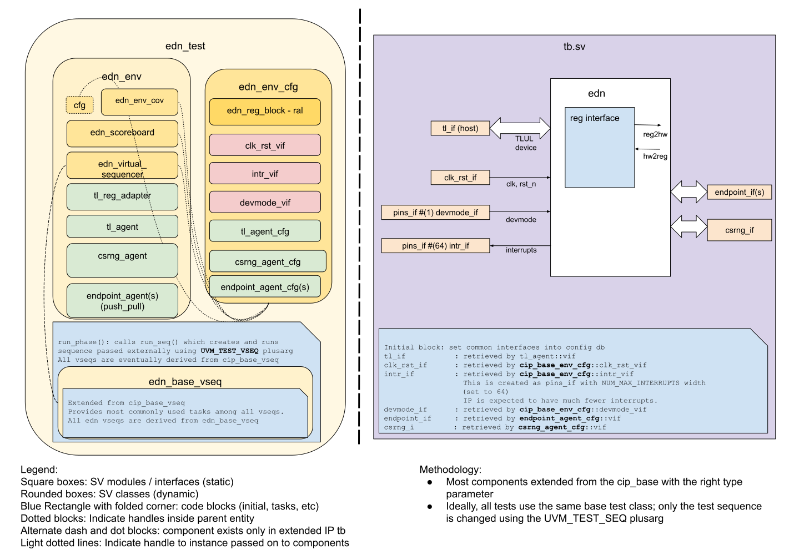

# EDN DV document

## Goals
* **DV**
  * Verify all EDN IP features by running dynamic simulations with a SV/UVM based testbench
  * Develop and run all tests based on the [testplan](#testplan) below towards closing code and functional coverage on the IP and all of its sub-modules
* **FPV**
  * Verify TileLink device protocol compliance with an SVA based testbench

## Current status
* [Design & verification stage](../../../README.md)
  * [HW development stages](../../../../doc/project_governance/development_stages.md)
* [Simulation results](https://reports.opentitan.org/hw/ip/edn/dv/latest/report.html)

## Design features
For detailed information on EDN design features, please see the [EDN HWIP technical specification](../README.md).

## Testbench architecture
EDN testbench has been constructed based on the [CIP testbench architecture](../../../dv/sv/cip_lib/README.md).

### Block diagram


### Top level testbench
Top level testbench is located at `hw/ip/edn/dv/tb.sv`. It instantiates the EDN DUT module `hw/ip/edn/rtl/edn.sv`.
In addition, it instantiates the following interfaces, connects them to the DUT and sets their handle into `uvm_config_db`:
* [Clock and reset interface](../../../dv/sv/common_ifs/README.md)
* [TileLink host interface](../../../dv/sv/tl_agent/README.md)
* EDN IOs
* Interrupts ([`pins_if`](../../../dv/sv/common_ifs/README.md)
* Alerts ([`pins_if`](../../../dv/sv/common_ifs/README.md)

### Common DV utility components
The following utilities provide generic helper tasks and functions to perform activities that are common across the project:
* [common_ifs](../../../dv/sv/common_ifs/README.md)
* [dv_utils_pkg](../../../dv/sv/dv_utils/README.md)
* [csr_utils_pkg](../../../dv/sv/csr_utils/README.md)

### Global types & methods
All common types and methods defined at the package level can be found in
`edn_env_pkg`. Some of them in use are:
```systemverilog
parameter uint MIN_NUM_ENDPOINTS = 1;
parameter uint MAX_NUM_ENDPOINTS = 7;
```

### TL_agent
EDN testbench instantiates (already handled in CIP base env) [tl_agent](../../../dv/sv/tl_agent/README.md)
which provides the ability to drive and independently monitor random traffic via
TL host interface into EDN device.

###  Endpoint_agent
EDN testbench instantiates this push_pull_agent(../../../dv/sv/push_pull_agent/README.md) which models an endpoint module.

###  Csrng_agent
EDN testbench instantiates this agent(../../../dv/sv/csrng_agent/README.md) which models the csrng module.

### UVM RAL Model
The EDN RAL model is created with the [`ralgen`](../../../dv/tools/ralgen/README.md) FuseSoC generator script automatically when the simulation is at the build stage.

It can be created manually by invoking [`regtool`](../../../../util/reggen/doc/setup_and_use.md):

### Stimulus strategy
#### Test sequences
All test sequences reside in `hw/ip/edn/dv/env/seq_lib`.
The `edn_base_vseq` virtual sequence is extended from `cip_base_vseq` and serves as a starting point.
All test sequences are extended from `edn_base_vseq`.
It provides commonly used handles, variables, functions and tasks that the test sequences can simple use / call.
Some of the most commonly used tasks / functions are as follows:
* edn_init:     Initialize the EDN module from the randomized environment variables in the config.

#### Functional coverage
To ensure high quality constrained random stimulus, it is necessary to develop a functional coverage model.
The following covergroups have been developed to prove that the test intent has been adequately met:
* common covergroup for interrupts `hw/dv/sv/cip_lib/cip_base_env_cov.sv`: Cover interrupt value, interrupt enable, intr_test, interrupt pin

### Self-checking strategy
#### Scoreboard
The `edn_scoreboard` is primarily used for end to end checking.
It creates the following analysis ports to retrieve the data monitored by corresponding interface agents:
* tl_a_chan_fifo, tl_d_chan_fifo:           These 2 fifos provide transaction items at the end of Tilelink address channel and data channel respectively
<!-- * analysis port1:
* analysis port2:
explain inputs monitored, flow of data and outputs checked -->

#### Assertions
* TLUL assertions: The `tb/edn_bind.sv` binds the `tlul_assert` [assertions](../../tlul/doc/TlulProtocolChecker.md) to the IP to ensure TileLink interface protocol compliance.
* Unknown checks on DUT outputs: The RTL has assertions to ensure all outputs are initialized to known values after coming out of reset.

## Building and running tests
We are using our in-house developed [regression tool](../../../../util/dvsim/README.md) for building and running our tests and regressions.
Please take a look at the link for detailed information on the usage, capabilities, features and known issues.
Here's how to run a smoke test:
```console
$ $REPO_TOP/util/dvsim/dvsim.py $REPO_TOP/hw/ip/edn/dv/edn_sim_cfg.hjson -i edn_smoke
```

## Testplan
[Testplan](../data/edn_testplan.hjson)
