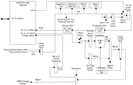

# Overview

This document specifies ENTROPY_SRC hardware IP functionality.
This module conforms to the [Comportable guideline for peripheral functionality.]()


## Features


- This revision provides an interface to an external physical random noise generator (also referred to as a physical true random number generator or PTRNG) source, and an LFSR (linear feedback shift register) digital source.
The LFSR is used as a digital, pseudo-random type of entropy source, while the PTRNG external source is a physical true random noise source.
A noise source and its relation to an entropy source are defined by [SP 800-90B.](https://csrc.nist.gov/publications/detail/sp/800-90b/final)
- A set of registers is provided for firmware to obtain entropy bits.
- The set of registers is designed such that firmware can select between an LFSR or a PTRNG noise source.
- Interrupts are supported:
  - Entropy bits are available for firmware consumption.
  - The internal health tests have detected a test failure.
  - An internal FIFO error has occurred.
- Two health checks that are defined by SP 800-90B are performed by this revision: Repetition Count and Adaptive Proportion tests.
- Two additional hardware health checks are performed by this revision: Bucket and Markov tests.
- Firmware-defined (mailbox-based) and vendor-defined health checks are also supported.
- A health check failure alert is supported by this revision.

## Description

This IP block provides an entropy source that is capable of using a PTRNG noise source to generate random values in a manner that is compliant both with FIPS (though NIST SP 800-90B) and CC (AIS31) recommendations.

<!-- URLS for the following pages not upstream yet, but coming -->
The random values generated by this block serve as non-deterministic seeds for the CSRNG block.
The outputs of the CSRNG are then used either directly by firmware or are distributed to other hardware blocks through the Entropy Distribution Network.

In the terms of AIS31 classes, this block is meant to satisfy the requirements for a PTG.2 class physical entropy source, with "internal" entropy (an AIS31 term, meaning the min-entropy as measured just *before the output pins*) exceeding 0.997 entropy-bits/output-bit.
In NIST terms, this block satisfies the requirements for a "full-entropy" source, which requires even smaller deviations from ideal entropy, at the level of less than one part in 2<sup>64</sup>.
When operating in full-compliance mode, raw outputs from a PTRNG noise source (external to this block) are passed through a conditioning function based on a suitable secure hash function (SHA-2 or SHA-3) which has been vetted by NIST to meet these stringent requirements.

These raw noise bits are subjected to a sequence of health-checks to screen the raw signals for statistical defects which would cause any significant deviations from ideal entropy at the output of the conditioning block.
These tests include:
- The Repetition Count test, which screens for stuck-bits, or a complete failure of the PTRNG noise source,
- The Adaptive Proportion test, which screens for statistical bias in the number of 1's or 0's output by the noise source,
- The "Bucket Test", which looks for correlations between the individual noise channels that the external noise source concatenates together to produce the raw noise sequence,
- The "Markov Test", which looks for unexpected first-order temporal correlations between bits output by the individual noise channels,
- The "Mailbox Test", in which raw-noise data is transferred to firmware in contiguous 2kbit-blocks, so that firmware can perform custom tests, and signal a failure through the same path as the other tests, and
- Optional Vendor Specific tests, which allow silicon creators to extend the health checks by adding a top-level block external to this IP.

The Repetition Count and Adaptive Proportion test are specifically recommended by SP 800-90B, and are implemented in accordance with those recommendations.
In FIPS/CC-compliance mode, all checks except the Repetition Count test are performed on fixed window of data, typically consisting of 1024 bits each.
Per the definition in SP 800-90B, the Repetition Count test does not operate on a fixed window.
The repetition count test fails if any sequence of bits continuously asserts the same value for too many samples, as determined by the programmable threshold, regardless of whether that sequence crosses any window boundaries.
The thresholds for these tests should be chosen to achieve a low false-positive rate (&alpha;) given a conservative estimate of the manufacturing tolerances of the PTRNG noise source.
The combined choice of threshold and window size then determine the false-negative rate (&beta;), or the probability of missing statistical defects at any particular magnitude.

When the IP is disabled by clearing the `ENABLE` bit in , all heath checks are disabled and all counters internal to the health checks are reset.

In order to compensate for the fact our tests (like *all* realistic statistical tests) have finite resolution for detecting defects, we conservatively use 1024 bits of PTRNG noise source to construct each 384 bit conditioned entropy sample.
When passed through the conditioning block, the resultant entropy stream will be full entropy unless the PTRNG noise source has encountered some statistical defect serious enough to reduce the raw min-entropy to a level below 0.375 bits of entropy per output bit.
We choose this level as our definition of "non-tolerable statistical defects" for the purposes of evaluating this system under AIS31.
Given this definition of "non-tolerable defects", the health-checks as implemented for this block will almost certainly detect any of the previously mentioned defects in a single iteration of the health checks (i.e. such serious defects will be detected with very low &beta;).

In addition to the brief, low-latency health checks, various long-term statistics are accumulated in registers for additional diagnostic purposes or for in-depth analysis.
For the hardware interface, entropy bits will be transferred whenever the downstream consumer is ready to receive them.

At a high-level, this ENTROPY_SRC block, when enabled, will continuously collect entropy bits from the entropy source into a FIFO that can be read from the TL-UL bus, or sent out through a hardware interface.
The PTRNG noise source will generate a relatively slow set of bit streams, with a total bit rate on the order of 50 kbps.
The digital source can be programmed to be faster, or much slower if desired.
A digital source rate of flexible speed might be useful in demonstrating how the downstream applications use the entropy.

Once a noise source has been selected through configuration, the raw noise data processing begins.
This ENTROPY_SRC block will do health checks, collect and pack bits, and finally send them through a conditioning unit.
There are two modes in which entropy bits are delivered, boot-time and FIPS/CC mode.
Boot-time mode will deliver bits sooner for specific on-boot obfuscation applications, though the bits may not yet have been subjected to the same level of startup health checks required for FIPS or CC compliance.

In boot-time mode health checks only operate on a window of 384 bits.
The boot-time health checks are the same as the FIPS/CC health-checks, though with different thresholds.
They are sensitive to the same types of statistical defects, though at reduced statistical resolution.
With suitable thresholds, the boot-time health checks can be operate both with low false-alarm rates (low &alpha;), while still confirming with low &beta; that the total entropy of the first seed contains at least 80 bits of total entropy.
During start up the initial 384 bits are held in a buffer until the boot-time start-up health checks are performed.
Storing the seed in this buffer, allows this seed to released to the CSRNG immediately after the entropy has been confirmed.

Boot-time mode also has the feature that it bypasses the SHA conditioning function, as only 384 bits are used in the initial boot-time seed.

For maximal flexibility in normal operation, the conditioning function can also be implemented by firmware.
When this firmware conditioning feature is activated, data read directly out of the noise source can be reinjected into the entropy pipeline via a TL-UL register after it has been processed by firmware.
It should be noted that this firmware algorithm must be vetted by NIST to satisfy the requirements for a full-entropy source.
This feature can also be disabled for security purposes, either by locking the feature via the  register at boot, or by a write to one-time programmable (OTP) memory.

## Compatibility
This IP block does not have any direct hardware compatibility requirements.
However, the general design of this block follows the overall NIST recommendations, as described by SP 800-90B.

# Theory of Operations

As already described, this IP block will collect bits of entropy for firmware or hardware consumption.
This revision supports both an LFSR for the pseudo-random digital implementation, and an external interface for the PTRNG noise source implementation.

The first step is initialization and enabling.
Normally PTRNG noise source mode is selected, and the `ENABLE` field will be set to enable PTRNG noise source mode.
If using LFSR mode, before setting the `ENABLE` field, the LFSR seed input should be initialized, using the  register.
The  register will default to a sample rate of 20 microseconds, assuming a system clock rate of 100 nanoseconds.
The  register will transfer its value to the LFSR block, but the LFSR block is locked once the `ENABLE` field is set.
After the block is enabled and initialized, entropy bits will be collected up indefinitely until disabled.


After a reset, the ENTROPY_SRC block will start up in boot-time mode by default.
This feature is designed to provide an initial seed's worth of entropy with lower latency than the normal FIPS/CC compliant health check process.
Health testing will still be performed on boot-time mode entropy, but the window of checking is, by default, 384 bits instead of 1024 bits.
When entropy is delivered to the downstream hardware block, a signal will indicate what type of entropy it is - FIPS compliant or not.
Boot-time mode can be completely disabled in the  register.

Once the initial boot-time mode phase has completed, the ENTROPY_SRC block will switch to FIPS compliant mode.
In this mode, once the raw entropy has been health checked, it will be passed into a conditioner block.
This block will compress the bits such that the entropy bits/physical bits, or min-entropy value, should be improved over the raw data source min-entropy value.
The compression operation, by default, will compress every 1024 tested bits into 384 full-entropy bits.

The hardware conditioning can also be bypassed and replaced in normal operation with a firmware-defined conditioning algorithm.
This firmware conditioning algorithm, can be disabled on boot for security purposes.
The exact mechanism for this functionality will be described in a future update to this document (TBD).

Health checks are performed on the input raw data from the PTRNG noise source when in that mode.
There are four health tests that will be performed: repetitive count, adaptive proportion, bucket, and Markov tests.
Each test has a pair of threshold values that determine that pass/fail of the test, one threshold for boot-time mode, and one for normal mode.
By default, all tests are enabled, but can be turn off in the  register.
Because of the variability of the PTRNG noise source, there are several registers that log statistics associated with the health tests.
For example, the adaptive proportion test has a high watermark register that logs the highest measured number of ones.
The  register has an entry for both normal and boot-time modes.
This register allows for determining how close the threshold value should be set to the fail over value.
Specific to the adaptive proportion test, there is also the  register, which will hold the lowest number of ones measured.
To help understand how well the thresholds work through time, a running count of test fails is kept in the  register.
The above example for the adaptive proportion test also applies to the other health tests, with the exception of the low watermark registers.
See the timing diagrams below for more details on how the health tests work.
It should be noted that for all error counter registers, they are sized for 16 bits, which prevents any case where counters might wrap.


The firmware override function has the capability to completely override the hardware health tests and the conditioner paths.
In the case of health tests, firwmare can turn off one or all of the health tests and perform the tests in firmware.
A data path is provided in the hardware such that the inbound entropy can be trapped in the pre-conditioner FIFO.
Once a pre-determined threshold of entropy has been reached in this FIFO, the firmware can then read the entropy bits out of the FIFO.
At this point, firmware can do additional health checks on the entropy.
Optionally, firmware can do the conditioning function, assuming the the hardware is configured to bypass the conditioner block.
Once firmware has processed the entropy, it will write the entropy back into the pre-conditioner FIFO.
The firmware override control bits will be set such that the new entropy will resume normal flow operation.

Vendor-specific tests are supported through an external health test interface (xht).
This is the same interface that is used for the internal health tests.
Below is a description of this interface:
- entropy_bit: 4-bit wide bus of entropy to be tested.
- entropy_bit_valid: indication of when the entropy is valid.
- clear: signal to clear counters, and is register driven.
- active: signal to indicate when the test should run, and is register driven.
- thresh_hi: field to indicate what high threshold the test should use, and is register driven.
- thresh_lo: field to indicate what low threshold the test should use, and is register driven.
- window: field to indicate what the size of the test window is, and is register driven.
- test_cnt: generic test count result, to be read from a register.
- test_fail_hi_pulse: indication that a high threshold comparison failed, to be read from a register.
- test_fail_lo_pulse: indication that a low threshold comparison failed, to be read from a register.


The  register determines how many fails can occur before an alert is issued.
By default, the current threshold is set to two, such that the occurrence of two failing test cycles back-to-back would provide a very low &alpha; value.
The  register holds the total number of fails, plus all of the individual contributing failing tests.
Setting the  register to zero will disable alert generation.

Firmware has a path to read entropy from the ENTROPY_SRC block.
The  register allows firmware to set the internal multiplexers to steer entropy data to the  register.
The control bit `ES_TYPE` sets whether the entropy will come from the conditioning block or be sourced through the bypass path.
A status bit will be set that can either be polled or generate an interrupt when the entropy bits are available to be read from the  register.
The firmware needs to read the  register twelve times in order to cleanly evacuate the 384-bit seed from the hardware path (12*32bits=384bits total).
The firmware will directly read out of the main entropy FIFO, and when the control bit `ES_ROUTE` is set, no entropy is being passed to the block hardware interface.
If the main entropy FIFO fills up, additional entropy that has been health checked and conditioned will be dropped at that point.

The above process will be repeated for as long as entropy bits are to be collected and processed.

At any time, the `ENABLE` field can be cleared to halt the entropy generation (and health check testing) immediately.

## Block Diagram



## Hardware Interfaces



## Design Details

### Initialization

After power-up, the ENTROPY_SRC block is disabled.
In this state, the seed register will continuously be loaded into the LFSR.
The seed register can be written without restriction, regardless of any state of any control bits.

For simplicity of initialization, only a single register write is needed to start functional operation of the ENTROPY_SRC block.
This assumes that proper defaults are chosen for thresholds, sampling rate, and other registers.

For security reasons, a configuration and control register locking function is performed by the  register.
Clearing the bit in this register will prevent future modification of the  register or other writeable registers by firmware.

### Entropy Processing

When enabled, the ENTROPY_SRC block will generate entropy bits continuously.
The `es_entropy_valid` bit in the `ENTROPY_SRC_INTR_STATE` register will indicate to the firmware when entropy bits can read from the  register.
The firmware will do 32-bit register reads of the  register to retrieve the entropy bits.
Each read will automatically pop an entry from the entropy unpacker block.
A full twelve 32-bit words need to be read at a time.

The hardware entropy interface will move entropy bits out of the ENTROPY FIFO when it is not empty, and the downstream hardware is ready.
If firmware is not currently reading entropy bits, all processed entropy bits will flow to the hardware entropy interface.

An additional feature is the  register.
The purpose of this register is to simulate faster or slower entropy generation sources than when the digital source is selected.
This will aid firmware design and debug when trying to handle all entropy source types and rates.
When in PTRNG mode, this register must exactly match the sample rate required by the PTRNG source, expected to be in the range of about 25 to 50 kilohertz.

### Interrupts

The ENTROPY_SRC module has several interrupts: `es_entropy_valid`, `es_health_test_failed`, and `es_fifo_err`.

The `es_entropy_valid` interrupt should be asserted when an entropy source has been implemented that is relatively slow.

The `es_health_test_failed` interrupt will trigger when the internal health test fails and exceeds the alert threshold.

The `es_fifo_err` interrupt will fire when an internal FIFO has a malfunction.
The conditions that cause this to happen are either when there is a push to a full FIFO or a pull from an empty FIFO.


## Future Features

- Timer to pace health checks only when there is no demand for entropy seeds
- Support for golden test pattern

### Entropy Source Hardware Interface
The following waveform shows an example of how the entropy source hardware interface works, which is much like a FIFO.



{signal: [
   {name: 'clk'           , wave: 'p...|.........|.......'},
   {name: 'es_req'        , wave: '0..1|..01.0..1|.....0.'},
   {name: 'es_ack'        , wave: '0...|.10.10...|....10.'},
   {name: 'es_bus[383:0]' , wave: '0...|.30.30...|....30.', data: ['es0','es1','es2']},
   {name: 'es_fips'       , wave: '0...|....10...|....10.'},
]}



### PTRNG Hardware Interface
The following waveform shows an example of what the PTRNG timing looks like.



{signal: [
   {name: 'clk'             , wave: 'p.|......|......|......'},
   {name: 'rng_enable'      , wave: '01|......|......|......'},
   {name: 'rng_valid'       , wave: '0.|..10..|..10..|..10..'},
   {name: 'rng_b'           , wave: 'x.|..3...|..4...|..5.....', data: ['es0','es1','es2']},
]}


### Repetition Count Test
The following waveform shows how a sampling of the LFSR data pattern will be tested by the Repetition Count test.
Operating on each bit stream, this test will count when a signal is at a stuck level.
This NIST test is intended to signal a catastrophic failure with the PTRNG noise source.



{signal: [
   {name: 'rng_valid'      , wave: 'p...............'},
  ['rng bits',
   {name: 'rng_bus[3]'     , wave: '1.0.10..1...0101'},
   {name: 'rng_bus[2]'     , wave: '01.0.10..1...010'},
   {name: 'rng_bus[1]'     , wave: '101.0.10..1...01'},
   {name: 'rng_bus[0]'     , wave: '10.10..1...0101.'},
   ],
   {name: 'thresh_i (hex)'      , wave: '3...............',data: ['3']},
   {name: 'rep_cntr_q[3] (hex)' , wave: '4444444444444444',data: ['0','0','1','0','1','0','0','1','2','0','1','2','3','0','0','0']},
   {name: 'rep_cntr_q[2] (hex)' , wave: '4444444444444444',data: ['0','1','0','1','0','1','0','0','1','2','0','1','2','3','0','0']},
   {name: 'rep_cntr_q[1] (hex)' , wave: '4444444444444444',data: ['0','0','0','0','1','0','1','0','0','1','2','0','1','2','3','0']},
   {name: 'rep_cntr_q[0] (hex)' , wave: '4444444444444444',data: ['0','0','0','1','0','0','1','2','0','1','2','3','0','0','0','0']},
   {name: 'test_cnt_q (hex)'    , wave: '4444444444444444',data: ['0','0','0','0','0','0','0','0','0','0','0','1','2','3','4','0']},
   {name: 'window_cnt_q (hex)'  , wave: '5555555555555555',data: ['0','1','2','3','4','5','6','7','8','9','a','b','c','d','e','f']},
], head:{
   text:'Repetition Count Test',
   tick:0,
  },}


### Adaptive Proportion Test
The following waveform shows how a sampling of the LFSR data pattern will be tested by the Adaptive Proportion test.
Operating on all four bit streams, this test will count how many ones are present in the full sample period.
This NIST test is intended to find bias when either too many or too few ones are present.


{signal: [
   {name: 'rng_valid'      , wave: 'p...............'},
  ['rng bits',
   {name: 'rng_bus[3]'     , wave: '1.0.10..1...0101'},
   {name: 'rng_bus[2]'     , wave: '01.0.10..1...010'},
   {name: 'rng_bus[1]'     , wave: '101.0.10..1...01'},
   {name: 'rng_bus[0]'     , wave: '10.10..1...0101.'},
   ],
   {name: 'column_cnt (hex)'   , wave: '3333333333333333',data: ['3','2','2','2','1','1','1','1','2','3', '4', '3', '3', '2', '2','3']},
   {name: 'test_cnt_q (hex)'   , wave: '4444444444444444',data: ['0','3','5','7','9','a','b','c','d','f','12','16','19','1c','1e','20']},
   {name: 'window_cnt_q (hex)' , wave: '5555555555555555',data: ['0','1','2','3','4','5','6','7','8','9','a','b','c','d','e','f']},
], head:{
   text:'Adaptive Proportion Test',
   tick:0,
  },}


### Bucket Test
The following waveform shows how a sampling of the LFSR data pattern will be tested by the Bucket test.
Operating on all four bit streams, this test will identify the symbol and sort it into bin counters, or "buckets".
This test is intended to find bias with a symbol or symbols.


{signal: [
   {name: 'rng_valid'      , wave: 'p...............'},
  ['rng bits',
   {name: 'rng_bus[3]'     , wave: '1.0.10..1...0101'},
   {name: 'rng_bus[2]'     , wave: '01.0.10..1...010'},
   {name: 'rng_bus[1]'     , wave: '101.0.10..1...01'},
   {name: 'rng_bus[0]'     , wave: '10.10..1...0101.'},
   ],
   {name: 'thresh_i (hex)'       , wave: '3...............',data: ['3']},
   {name: 'bin_cntr_q[0] (hex)'  , wave: '4...............',data: ['0']},
   {name: 'bin_cntr_q[1] (hex)'  , wave: '4........4......',data: ['0','1']},
   {name: 'bin_cntr_q[2] (hex)'  , wave: '4.......4.......',data: ['0','1']},
   {name: 'bin_cntr_q[13] (hex)' , wave: '4..........4....',data: ['0','1']},
   {name: 'bin_cntr_q[14] (hex)' , wave: '4............4..',data: ['0','1']},
   {name: 'bin_cntr_q[15] (hex)' , wave: '4...........4...',data: ['0','1']},
   {name: 'test_cnt_q (hex)'     , wave: '4...............',data: ['0']},
   {name: 'window_cnt_q (hex)' , wave: '5555555555555555',data: ['0','1','2','3','4','5','6','7','8','9','a','b','c','d','e','f']},
], head:{
   text:'Bucket Test',
   tick:0,
  },}


### Markov Test
The following waveform shows how a sampling of the LFSR data pattern will be tested by the Markov test.
Operating on all four bit streams, this test will identify pairs of transitions in time per bit stream.
Specifically, only pairs of `0b01` and `0b10` will be counted.


{signal: [
   {name: 'rng_valid'      , wave: 'p...............'},
  ['rng bits',
   {name: 'rng_bus[3]'     , wave: '1.0.10..1...0101'},
   {name: 'rng_bus[2]'     , wave: '01.0.10..1...010'},
   {name: 'rng_bus[1]'     , wave: '101.0.10..1...01'},
   {name: 'rng_bus[0]'     , wave: '10.10..1...0101.'},
   ],
   {name: 'pair_cntr_q[3] (hex)', wave: '4.4.4.4.4.4.4.4.',data: ['0','0','0','1','1','1','1','2']},
   {name: 'pair_cntr_q[2] (hex)', wave: '4.4.4.4.4.4.4.4.',data: ['0','1','2','3','3','4','4','5']},
   {name: 'pair_cntr_q[1] (hex)', wave: '4.4.4.4.4.4.4.4.',data: ['0','1','1','1','2','2','2','2']},
   {name: 'pair_cntr_q[0] (hex)', wave: '4.4.4.4.4.4.4.4.',data: ['0','1','2','2','3','3','4','5']},
   {name: 'window_cnt_q (hex)'  , wave: '5555555555555555',data: ['0','1','2','3','4','5','6','7','8','9','a','b','c','d','e','f']},
], head:{
   text:'Markov Test',
   tick:0,
  },}



# Programmers Guide

## Initialization

The following code snippet demonstrates initializing the ENTROPY_SRC block for entropy bit generation.

```cpp

void entropy_src_init(unsigned int rate) {

  // set the rate value (optional)
  *SEED_REG = rate;

  // set the configuration enable bits (rng mode, all health tests enabled)
  *CONF_REG = 0x1;

  // the ENTROPY_SRC interrupts can optionally be enabled
}
```

## Entropy Processing

The following code snippet demonstrates reading entropy bits from the ENTROPY_SRC block.

```cpp

int entropy_src_entropy(unsigned int numEntropyBits) {

  // read numEntropyBits, check for ENTROPY_SRC_INTR_STATE bit 0
  return *ENTROPY_DATA_REG;

}
```

Note that when software makes frequent re-seed requests to CSRNG, any stored up entropy seeds in the final entropy FIFO will quickly consumed.
Once the FIFO is empty, subsequent entropy seed requests will have to wait the worst case latency time while new entropy is being created.

## Error conditions

Need to alert the system of a FIFO overflow condition.

## Register Table


