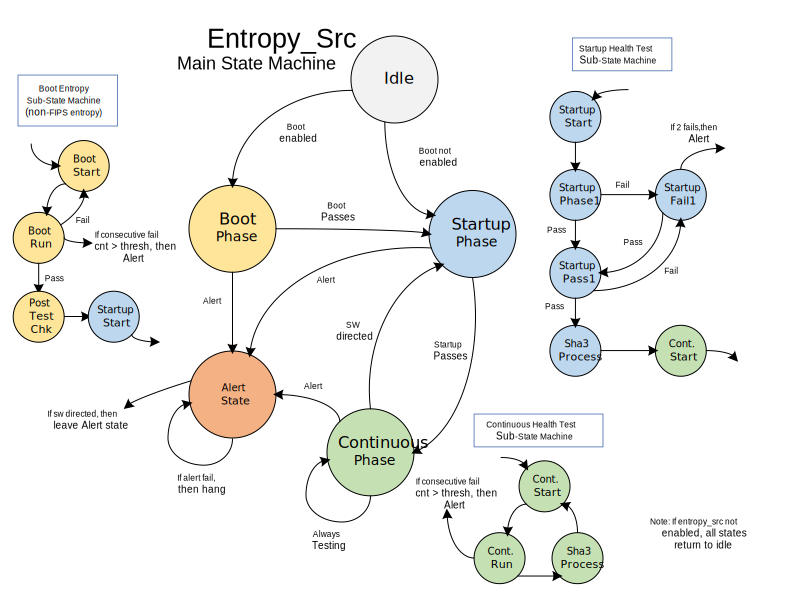

# Theory of Operation

As already described, this IP block will collect bits of entropy for firmware or hardware consumption.
This revision supports only an external interface for a PTRNG noise source implementation.

The first step is initialization and enabling.
The PTRNG noise source mode is selected when the [`MODULE_ENABLE`](registers.md#module_enable) field is set.
After the block is enabled and initialized, entropy bits will be collected up indefinitely until disabled.


After a reset, the ENTROPY_SRC block will start up in boot-time / bypass mode by default.
This feature is designed to provide an initial seed's worth of entropy with lower latency than the normal FIPS/CC compliant health check process.
Health testing will still be performed on boot-time mode entropy, but the window of checking is, by default, 384 bits instead of 2048 bits.
When entropy is delivered to the downstream hardware block, a signal will indicate what type of entropy it is - FIPS/CC compliant or not.

Once the initial boot-time mode phase has completed, the ENTROPY_SRC block can be switched to FIPS/CC compliant mode (for simplicity referred to as FIPS mode) by setting the `FIPS_ENABLE` field in the [`CONF`](registers.md#conf) register to `kMultiBitBool4True`.
In this mode, once the raw entropy has been health checked, it will be passed into a conditioner block.
This block will compress the bits such that the entropy bits/physical bits, or min-entropy value, should be improved over the raw data source min-entropy value.
The compression operation, by default, will compress every 2048 tested bits into 384 full-entropy bits.

The hardware conditioning can also be bypassed and replaced in normal operation with a firmware-defined conditioning algorithm.
This firmware conditioning algorithm can be disabled on boot for security purposes.

The firmware override function has the capability to completely override the hardware health tests and the conditioner paths.
In the case of health tests, firmware can turn off one or all of the health tests and perform the tests in firmware.
A data path is provided in the hardware such that the inbound entropy can be trapped in the observe FIFO.
Once a pre-determined threshold of entropy has been reached in this FIFO, the firmware can then read the entropy bits out of the FIFO.
The exact mechanism for this functionality starts with setting the [`FW_OV_MODE`](registers.md#fw_ov_control--fw_ov_mode) field in the [`FW_OV_CONTROL`](registers.md#fw_ov_control) register.
This will enable firmware to monitor post-health test entropy bits by reading from the [`FW_OV_RD_DATA`](registers.md#fw_ov_rd_data) register.
Firmware can use the [`OBSERVE_FIFO_THRESH`](registers.md#observe_fifo_thresh) and [`OBSERVE_FIFO_DEPTH`](registers.md#observe_fifo_depth) to determine the state of the OBSERVE FIFO.
At this point, firmware can do additional health checks on the entropy.
Optionally, firmware can do the conditioning function, assuming the hardware is configured to bypass the conditioner block.
Once firmware has processed the entropy, it can then write the results back into the [`FW_OV_WR_DATA`](registers.md#fw_ov_wr_data) register (pre-conditioner FIFO).
The [`FW_OV_ENTROPY_INSERT`](registers.md#fw_ov_control--fw_ov_entropy_insert) in the [`FW_OV_CONTROL`](registers.md#fw_ov_control) register will enable inserting entropy bits back into the entropy flow.
The firmware override control fields will be set such that the new entropy will resume normal flow operation.

An additional feature of the firmware override function is to insert entropy bits into the flow and still use the conditioning function in the hardware.
Setting the [`FW_OV_INSERT_START`](registers.md#fw_ov_sha3_start--fw_ov_insert_start) field in the [`FW_OV_SHA3_START`](registers.md#fw_ov_sha3_start) register will prepare the hardware for this flow.
Once this field is set true, the [`FW_OV_WR_DATA`](registers.md#fw_ov_wr_data) register can be written with entropy bits.
The [`FW_OV_WR_FIFO_FULL`](registers.md#fw_ov_wr_fifo_full) register should be monitored after each write to ensure data is not dropped.
Once all of the data has been written, the [`FW_OV_INSERT_START`](registers.md#fw_ov_sha3_start--fw_ov_insert_start) field should be set to false.
The normal SHA3 processing will continue and finally push the conditioned entropy through the module.

Health checks are performed on the input raw data from the PTRNG noise source when in that mode.
There are four health tests that will be performed: repetitive count, adaptive proportion, bucket, and Markov tests.
Each test has a pair of threshold values that determine that pass/fail of the test, one threshold for boot-time / bypass mode, and one for FIPS mode.
By default, all tests are enabled, but can be turn off in the [`CONF`](registers.md#conf) register.
Because of the variability of the PTRNG noise source, there are several registers that log statistics associated with the health tests.
For example, the adaptive proportion test has a high watermark register that logs the highest measured number of ones.
The [`ADAPTP_HI_WATERMARKS`](registers.md#adaptp_hi_watermarks) register has an entry for both FIPS and boot-time modes.
This register allows for determining how close the threshold value should be set to the fail over value.
Specific to the adaptive proportion test, there is also the [`ADAPTP_LO_WATERMARKS`](registers.md#adaptp_lo_watermarks) register, which will hold the lowest number of ones measured.
To help understand how well the thresholds work through time, a running count of test fails is kept in the [`ADAPTP_HI_TOTAL_FAILS`](registers.md#adaptp_hi_total_fails) register.
The above example for the adaptive proportion test also applies to the other health tests, with the exception of the low watermark registers.
See the timing diagrams below for more details on how the health tests work.
It should be noted that for all error counter registers, they are sized for 16 bits, which prevents any case where counters might wrap.


Vendor-specific tests are supported through an external health test interface (xht).
This is the same interface that is used for the internal health tests.
Below is a description of this interface:
- entropy_bit: 4-bit wide bus of entropy to be tested.
- entropy_bit_valid: indication of when the entropy is valid.
- clear: signal to clear counters, and is register driven.
- active: signal to indicate when the test should run, and is register driven.
- thresh_hi: field to indicate what high threshold the test should use, and is register driven.
- thresh_lo: field to indicate what low threshold the test should use, and is register driven.
- window_wrap_pulse: field to indicate the end of the current window.
- threshold_scope: field to indicate whether the thresholds are intended to be applied to all entropy lines collectively or on a line-by-line basis, to be read from a register.
- test_cnt: generic test count result, to be read from a register.
- test_fail_hi_pulse: indication that a high threshold comparison failed, to be read from a register.
- test_fail_lo_pulse: indication that a low threshold comparison failed, to be read from a register.


The [`ALERT_THRESHOLD`](registers.md#alert_threshold) register determines how many fails can occur before an alert is issued.
By default, the current threshold is set to two, such that the occurrence of two failing test cycles back-to-back would provide a very low &alpha; value.
The [`ALERT_FAIL_COUNTS`](registers.md#alert_fail_counts) register holds the total number of fails, plus all of the individual contributing failing tests.
Setting the [`ALERT_THRESHOLD`](registers.md#alert_threshold) register to zero will disable alert generation.

Firmware has a path to read entropy from the ENTROPY_SRC block.
The [`ENTROPY_CONTROL`](registers.md#entropy_control) register allows firmware to set the internal multiplexers to steer entropy data to the [`ENTROPY_DATA`](registers.md#entropy_data) register.
The control bit [`ES_TYPE`](registers.md#entropy_control--es_type) sets whether the entropy will come from the conditioning block or be sourced through the bypass path.
A status bit will be set that can either be polled or generate an interrupt when the entropy bits are available to be read from the [`ENTROPY_DATA`](registers.md#entropy_data) register.
The firmware needs to read the [`ENTROPY_DATA`](registers.md#entropy_data) register twelve times in order to cleanly evacuate the 384-bit seed from the hardware path (12 * 32 bits = 384 bits in total).
The firmware will directly read out of the main entropy FIFO, and when the control bit [`ES_ROUTE`](registers.md#entropy_control--es_route) is set, no entropy is being passed to the block hardware interface.

If the `esfinal` FIFO fills up, additional entropy that has been health checked will be dropped before entering the conditioner.
This drop point will save on conditioner power, and still preserve `esfinal` FIFO entropy that has already been collected.

The above process will be repeated for as long as entropy bits are to be collected and processed.

At any time, the [`MODULE_ENABLE`](registers.md#module_enable) field can be cleared to halt the entropy generation (and health check testing).
See the Programmers Guide section for more details on the ENTROPY_SRC block disable sequence.

## Block Diagram


## Design Details

### Initialization

After power-up, the ENTROPY_SRC block is disabled.

For simplicity of initialization, only a single register write is needed to start functional operation of the ENTROPY_SRC block.
This assumes that proper defaults are chosen for thresholds, sampling rate, and other registers.

For security reasons, a configuration and control register locking function is performed by the [`REGWEN`](registers.md#regwen) register.
Clearing the bit in this register will prevent future modification of the [`CONF`](registers.md#conf) register or other writeable registers by firmware.

### Entropy Processing

When enabled, the ENTROPY_SRC block will generate entropy bits continuously.
The `es_entropy_valid` bit in the [`INTR_STATE`](registers.md#intr_state) register will indicate to the firmware when entropy bits can read from the [`ENTROPY_DATA`](registers.md#entropy_data) register.
The firmware will do 32-bit register reads of the [`ENTROPY_DATA`](registers.md#entropy_data) register to retrieve the entropy bits.
Each read will automatically pop an entry from the entropy unpacker block.
A full twelve 32-bit words need to be read at a time.

The hardware entropy interface will move entropy bits out of the ENTROPY FIFO when it is not empty, and the downstream hardware is ready.
If firmware is not currently reading entropy bits, all processed entropy bits will flow to the hardware entropy interface.

### Security

All module assets and countermeasures performed by hardware are listed in the hjson countermeasures section.
Labels for each instance of asset and countermeasure are located throughout the RTL source code.

For all of the health test threshold registers, these registers could be protected with shadow registers.
A design choice was made here to not use shadow registers and save on silicon cost.
The threshold registers are protected by software.
It is expected that software will read the threshold registers on a periodic basis, and compare these values to what was originally programmed into the threshold registers.

Bus integrity checking is performed for the final seed delivery to CSRNG.
This is done to make sure repeated values are not occurring.
Only 64 bits (out of 384 bits) are checked, since this is statistically significant, and more checking would cost more silicon.


### Interrupts

The ENTROPY_SRC module has several interrupts: `es_entropy_valid`, `es_health_test_failed`, and `es_fifo_err`.

The `es_entropy_valid` interrupt should be asserted when an entropy source has been implemented that is relatively slow.

The `es_health_test_failed` interrupt will trigger when the internal health test fails and exceeds the alert threshold.

The `es_fifo_err` interrupt will fire when an internal FIFO has a malfunction.
The conditions that cause this to happen are either when there is a push to a full FIFO or a pull from an empty FIFO.


## Main State Machine Diagram
The following diagram shows how the main state machine state is constructed.
The larger circles show the how the overall state machine transitions.
The sub-state machines with smaller circles show more detail about how the large circles operate.




### Entropy Source Hardware Interface
The following waveform shows an example of how the entropy source hardware interface works, which is much like a FIFO.


```wavejson
{signal: [
   {name: 'clk'           , wave: 'p...|.........|.......'},
   {name: 'es_req'        , wave: '0..1|..01.0..1|.....0.'},
   {name: 'es_ack'        , wave: '0...|.10.10...|....10.'},
   {name: 'es_bus[383:0]' , wave: '0...|.30.30...|....30.', data: ['es0','es1','es2']},
   {name: 'es_fips'       , wave: '0...|....10...|....10.'},
]}
```


### PTRNG Hardware Interface
The following waveform shows an example of what the PTRNG timing looks like.


```wavejson
{signal: [
   {name: 'clk'             , wave: 'p.|......|......|......'},
   {name: 'rng_enable'      , wave: '01|......|......|......'},
   {name: 'rng_valid'       , wave: '0.|..10..|..10..|..10..'},
   {name: 'rng_b'           , wave: 'x.|..3...|..4...|..5.....', data: ['es0','es1','es2']},
]}
```

### Repetition Count Test
The following waveform shows how a sampling of a data pattern will be tested by the Repetition Count test.
Operating on each bit stream, this test will count when a signal is at a stuck level.
This NIST test is intended to signal a catastrophic failure with the PTRNG noise source.


```wavejson
{signal: [
   {name: 'rng_valid'      , wave: 'p...............'},
  ['rng bits',
   {name: 'rng_bus[3]'     , wave: '1.0.10..1...0101'},
   {name: 'rng_bus[2]'     , wave: '01.0.10..1...010'},
   {name: 'rng_bus[1]'     , wave: '101.0.10..1...01'},
   {name: 'rng_bus[0]'     , wave: '10.10..1...0101.'},
   ],
   {name: 'thresh_i (hex)'      , wave: '3...............',data: ['3']},
   {name: 'rep_cntr_q[3] (hex)' , wave: '4444444444444444',data: ['0','0','1','0','1','0','0','1','2','0','1','2','3','0','0','0']},
   {name: 'rep_cntr_q[2] (hex)' , wave: '4444444444444444',data: ['0','1','0','1','0','1','0','0','1','2','0','1','2','3','0','0']},
   {name: 'rep_cntr_q[1] (hex)' , wave: '4444444444444444',data: ['0','0','0','0','1','0','1','0','0','1','2','0','1','2','3','0']},
   {name: 'rep_cntr_q[0] (hex)' , wave: '4444444444444444',data: ['0','0','0','1','0','0','1','2','0','1','2','3','0','0','0','0']},
   {name: 'test_cnt_q (hex)'    , wave: '4444444444444444',data: ['0','0','0','0','0','0','0','0','0','0','0','1','2','3','4','0']},
   {name: 'window_cnt_q (hex)'  , wave: '5555555555555555',data: ['0','1','2','3','4','5','6','7','8','9','a','b','c','d','e','f']},
], head:{
   text:'Repetition Count Test',
   tick:0,
  },}
```

### Adaptive Proportion Test
This NIST-defined test is intended to detect statistical bias in the raw entropy data.
The test counts the number of 1's in a given sample, and applies thresholds to reject samples which deviate too far from the ideal mean of 50%.

Depending on the value of the [`CONF.THRESHOLD_SCOPE`](registers.md#conf) field, the thresholds can either be applied collectively to the all RNG inputs, or the thresholds can be applied on a line-by-line basis.
Setting [`CONF.THRESHOLD_SCOPE`](registers.md#conf) to `kMultiBitBool4True` will apply the thresholds to the aggregated RNG stream.
This can be useful for lowering the likelihood of coincidental test failures (higher &alpha;).
Meanwhile, setting [`CONF.THRESHOLD_SCOPE`](registers.md#conf) to `kMultiBitBool4False` will apply thresholds on a line-by-line basis which allows the ENTROPY_SRC to detect single line failures.

The following waveform shows how a sampling of a data pattern will be tested by the Adaptive Proportion test.
In this example, the sum is taken over all RNG lines (i.e., [`CONF.THRESHOLD_SCOPE`](registers.md#conf) is True).

```wavejson
{signal: [
   {name: 'rng_valid'      , wave: 'p...............'},
  ['rng bits',
   {name: 'rng_bus[3]'     , wave: '1.0.10..1...0101'},
   {name: 'rng_bus[2]'     , wave: '01.0.10..1...010'},
   {name: 'rng_bus[1]'     , wave: '101.0.10..1...01'},
   {name: 'rng_bus[0]'     , wave: '10.10..1...0101.'},
   ],
   {name: 'Column-wise sum'   , wave: '3333333333333333',data: ['3','2','2','2','1','1','1','1','2','3', '4', '3', '3', '2', '2','3']},
   {name: 'test_cnt_q (hex)'   , wave: '4444444444444444',data: ['0','3','5','7','9','a','b','c','d','f','12','16','19','1c','1e','20']},
   {name: 'window_cnt_q (hex)' , wave: '5555555555555555',data: ['0','1','2','3','4','5','6','7','8','9','a','b','c','d','e','f']},
], head:{
   text:'Adaptive Proportion Test',
   tick:0,
  },}
```

### Bucket Test
The following waveform shows how a sampling of a data pattern will be tested by the Bucket test.
Operating on all four bit streams, this test will identify the symbol and sort it into bin counters, or "buckets".
This test is intended to find bias with a symbol or symbols.

```wavejson
{signal: [
   {name: 'rng_valid'      , wave: 'p...............'},
  ['rng bits',
   {name: 'rng_bus[3]'     , wave: '1.0.10..1...0101'},
   {name: 'rng_bus[2]'     , wave: '01.0.10..1...010'},
   {name: 'rng_bus[1]'     , wave: '101.0.10..1...01'},
   {name: 'rng_bus[0]'     , wave: '10.10..1...0101.'},
   ],
   {name: 'thresh_i (hex)'       , wave: '3...............',data: ['3']},
   {name: 'bin_cntr_q[0] (hex)'  , wave: '4...............',data: ['0']},
   {name: 'bin_cntr_q[1] (hex)'  , wave: '4........4......',data: ['0','1']},
   {name: 'bin_cntr_q[2] (hex)'  , wave: '4.......4.......',data: ['0','1']},
   {name: 'bin_cntr_q[13] (hex)' , wave: '4..........4....',data: ['0','1']},
   {name: 'bin_cntr_q[14] (hex)' , wave: '4............4..',data: ['0','1']},
   {name: 'bin_cntr_q[15] (hex)' , wave: '4...........4...',data: ['0','1']},
   {name: 'test_cnt_q (hex)'     , wave: '4...............',data: ['0']},
   {name: 'window_cnt_q (hex)' , wave: '5555555555555555',data: ['0','1','2','3','4','5','6','7','8','9','a','b','c','d','e','f']},
], head:{
   text:'Bucket Test',
   tick:0,
  },}
```

### Markov Test
The following waveform shows how a sampling of a data pattern will be tested by the Markov test.

The test aims to detect either:

1. Oversampling of AST/RNG outputs leading to "clustered" input values that eventually change, but often are just repeats of the previous sample.
For example the string: "00111111000011000111000111000001111" has roughly equal numbers of 1's and 0's, but no good entropy source should generate such strings, because each bit is likely just a repeat of the previous one.

2. Wild oscillations of the RNG, in a distinctly non-random way.
For instance the string: "010101010101010101" has almost zero entropy, even though the number of 1's and 0's appears unbiased.

The test counts the number of changes in the a fixed number of RNG samples, and comparing the number of "01"/"10" pairs to the number of "00"/"11" pairs.
On average, the number of switching (e.g., "01") vs. non-switching (e.g., "00") pairs should be 50% of the total, with a variance proportional to the sample size.

Like the Adaptive Proportion test, the Markov Test can be computed either cumulatively (summing the results over all RNG lines) or on a per-line basis.
In this example, the RNG lines are scored individually (i.e., [`CONF.THRESHOLD_SCOPE`](registers.md#conf) is False).

```wavejson
{signal: [
   {name: 'rng_valid'      , wave: 'p...............'},
  ['rng bits',
   {name: 'rng_bus[3]'     , wave: '1.0.10..1...0101'},
   {name: 'rng_bus[2]'     , wave: '01.0.10..1...010'},
   {name: 'rng_bus[1]'     , wave: '101.0.10..1...01'},
   {name: 'rng_bus[0]'     , wave: '10.10..1...0101.'},
   ],
   {name: 'pair_cntr_q[3] (hex)', wave: '4.4.4.4.4.4.4.4.',data: ['0','0','0','1','1','1','1','2']},
   {name: 'pair_cntr_q[2] (hex)', wave: '4.4.4.4.4.4.4.4.',data: ['0','1','2','3','3','4','4','5']},
   {name: 'pair_cntr_q[1] (hex)', wave: '4.4.4.4.4.4.4.4.',data: ['0','1','1','1','2','2','2','2']},
   {name: 'pair_cntr_q[0] (hex)', wave: '4.4.4.4.4.4.4.4.',data: ['0','1','2','2','3','3','4','5']},
   {name: 'window_cnt_q (hex)'  , wave: '5555555555555555',data: ['0','1','2','3','4','5','6','7','8','9','a','b','c','d','e','f']},
], head:{
   text:'Markov Test',
   tick:0,
  },}
```
