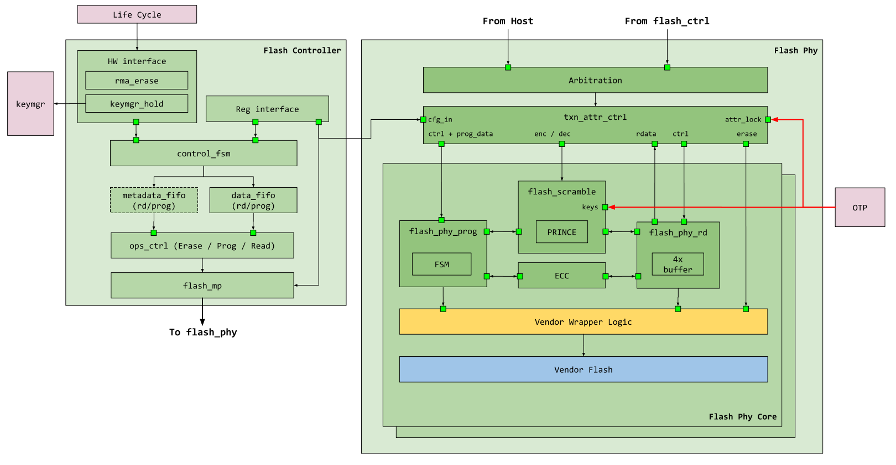
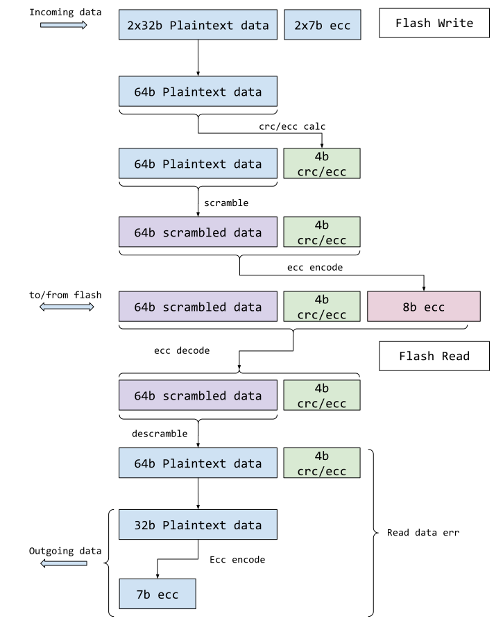
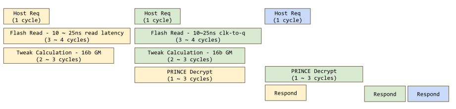

# Overview

This document describes the flash controller functionality.
The flash controller is broken down into 3 major components
* Open source flash controller
* Closed source vendor flash wrapper
* Closed source vendor flash module

A breakdown of the 3 can be seen below

This open source flash controller is divided into two partitions.

* Flash protocol controller
* Flash physical controller

The remaining document focuses primarily on the function of these blocks.

This module conforms to the [Comportable guideline for peripheral functionality.]()
See that document for integration overview within the broader top level system.

## Features

### Flash Protocol Controller Features
The flash protocol controller interfaces with software and other hardware components in the system (such as life cycle, key manager and OTP).
Regardless of the flash size underneath, the flash controller maintains the same data resolution as the bus and processor (default 4B).
The flash physical controller (see section below) is then responsible for bridging that size gap between the default data resolution and the actual flash memory.

The protocol controller currently supports the following features:

*  Controller initiated read, program and erase of flash.
   *  Erase can be either of a page, or an entire bank.
*  Support for differentiation between informational and data flash partitions.
*  Support for accessing multiple types of information partition.
   *  Some flash storage support multiple types of information storage for each information partition.
*  Parameterized support for burst program / read, up to 64B.
   *  Longer programs / reads are supported, however the protocol controller will directly back-pressure the bus if software supplies more data than can be consumed, or if software reads more than there is data available.
   *  Software can also choose to operate by polling the current state of the FIFO or through FIFO interrupts (empty / full / level).
*  Flash memory protection at page boundaries.
*  Life cycle RMA entry.
*  Key manager secret seeds that are inaccessible to software.
*  Support vendor flash module [erase suspend]().
*  Provisioning of flash specific attributes:
   * High endurance.
*  Idle indication to external power managers.
*  Software control of flash code fetch.

### Flash Physical Controller Features

The flash physical controller wraps the actual flash memory and translates both host and controller initiated requests into low level flash transactions.

The physical controller supports the following features
*  Multiple banks of flash memory.
*  For each flash bank, parameterized support for number of flash pages (default to 256).
*  For each flash page, parameterized support for number of words and word size (default to 256 words of 8-bytes each).
*  Data and informational partitions within each bank of flash memory.
*  Arbitration between host requests and controller requests at the bank level.
   *  Host requests are always favored, however the controller priority can escalate if it repeatedly loses arbitration.
   *  Since banks are arbitrated independently and transactions may take different amounts of times to complete, the physical controller is also responsible for ensuring in-order response to both the controller and host.
*  Flash read stage.
   *  Each bank maintains a parameterizable number of read buffers in front of the flash memory (default to 4).
   *  The read buffers behave as miniature read-only-caches to store flash data when flash words are greater than bus words.
   *  When a program or erase collides with an entry already stored in the read buffer, the buffer contents are invalidated.
      * This situation may arise if a read is followed by a program or erase.
*  Flash program stage
   *  Flash data word packing when flash word size is an integer multiple of bus word size.
*  Flash scrambling
   * Flash supports XEX scrambling using the prince cipher.
   * Scrambling is optional based on page boundaries and is configurable by software.
*  Two types of Flash ECC support.
   * A pre-scramble ECC used for integrity verification, this is required on every word.
   * A post-scramble ECC used for reliability detection, this is configurable on a page boundary.
*  Life cycle modulated JTAG connection to the vendor flash module.

### Flash Memory Overview

Unlike sram, flash memory is not typically organized as a contiguous block of generic storage.
Instead it is organized into data partitions and information partitions.

The data partition holds generic data like a generic memory would.
The information partition holds metadata about the data partition as well as design specific secret data.
This includes but is not limited to:
*  Redundancy information.
*  Manufacturer specific information.
*  Manufacturer flash timing information.
*  Design specific unique seeds.
*  The redundancy pages themselves, which are not accessible directly as data partitions.

Note, there **can** be more than one information partition, and none of them are required to be the same size as the data partition.
See the diagram below for an illustrative example.

Which type of partition is accessed is controlled through the  field.
The current flash controller implements one type of information partition and thus is controlled by 1 bit only.
This may change in the future.

Lastly, while the different partitions may be identical in some attributes, they are different in others.
*  All types of partitions must have the same page size and word size; however they are not required to have the same number of pages, thus some partitions may be larger and others smaller.
*  All types of partitions obey the same program and erase rules :
   * A bit cannot be programmed back to 1 once it has been programmed to 0.
   * Only erase can restore a bit to 1 under normal circumstances.
*  All partitions (data and information) can be read, programmed and erased by the flash protocol controller, subject to [memory protection](#memory-protection) and [life cycle qualification](#memory-protection-for-key-manager-and-life-cycle) .
*  System hosts (processor and other entities) can only directly read the data partition, they do not have any kind of access to information partitions.
   * System hosts are also not subject to memory protection rules, as those apply to the flash protocol controller only.

For default assumptions of the design, see the [default configuration]().

#### Addresses Map

##### Bank Address
The flash address map is built upon the bank base address.
The bank size is based upon the number of pages in the data partition.
The first bank's address is always `0x0`.
The second bank's address is `0x0 + size_of_bank_in_bytes`.

For example:
Assume each bank is 512KB in size.
The address of bank 0 is `0x0`.
The address of bank 1 is `0x80000`

##### Page Address
The address of a particular page is calculated based on the page size and the index number of the page.

For example:
Assume each page is 2KB in size.

To access page 0 in bank 1, the address would be the base address of bank 1 plus the base address of page 0.
This would still be `0x80000` in this case.

To access page 4 in bank 1, the address would then be `0x80000 + 2KB * 4 = 0x82000`.

##### Partition Access
All partitions share the same addressing scheme.
For example, the page 0 address of any kind of partition is always the same.

To distinguish which partition is accessed, use the configuration in  and 
Note however, the system host is only able to access the [data partitions]()

##### Default Address Map
Based on the [default configuration](), the following would be the default address map for each partition / page.

Location        | Address      |
----------------|------------- |
Bank 0 Page 0   | 0x0          |
Bank 0 Page 1   | 0x800        |
Bank 0 Page 2   | 0x1000       |
...             | ...          |
Bank 0 Page 255 | 0x7F800      |
Bank 1 Page 0   | 0x80000      |
Bank 1 Page 1   | 0x80800      |
Bank 1 Page 2   | 0x81000      |
...             | ...          |
Bank 1 Page 255 | 0xFF800      |

Note when accessing from host, the system memory address for flash should be added to this offset.

#### Secret Information Partitions

Two information partition pages (one for creator and one for owner) in the design hold secret seeds for the key manager.
These pages, when enabled by life cycle and otp, are read upon flash controller initialization (no software configuration is required).
The read values are then fed to the key manager for later processing.
There is a page for creator and a page for the owner.

The seed pages can be programmed/erased/read by software when the following are set:
* `lc_creator_seed_sw_rw_en` - allows software access to creator seed partition.
* `lc_owner_seed_sw_rw_en` - allows software access to owner seed partition.

The seed pages are read under the following initialization conditions:
*  life cycle sets provision enable - `lc_seed_hw_rd_en` is set.

See [life cycle]() for more details on when this partition is allowed to be populated.

#### Isolated Information Partitions

One information partition page in the design is used for manufacturing time authentication.
The accessibility of this page is controlled by life cycle and otp.

During TEST states, the isolated page is only programmable.
* `lc_iso_part_sw_wr_en` is set, but `lc_iso_part_sw_rd_en` is not.

During production and RMA states, the isolated page is also readable.
* Both `lc_iso_part_sw_wr_en` and `lc_iso_part_sw_rd_en` are set.

See [life cycle]() for more details

# Theory of Operation

## Block Diagram

### Flash Protocol Controller

The Flash Protocol Controller sits between the host software interface, other hardware components and the flash physical controller.
Its primary functions are two fold
*  Translate software program, erase and read requests into a high level protocol for the actual flash physical controller
*  Act as communication interface between flash and other components in the system, such as life cycle and key manager.

The flash protocol controller is not responsible for the detailed timing and waveform control of the flash, nor is it responsible for data scrambling and reliability metadata such as parity and ECC.
Instead, it maintains FIFOs / interrupts for the software to process data, as well as high level abstraction of region protection controls and error handling.

The flash controller selects requests between the software and hardware interfaces.
By default, the hardware interfaces have precendence and are used to read out seed materials from flash.
The seed material is read twice to confirm the values are consistent.
They are then forwarded to the key manager for processing.
During this seed phase, software initiated activities are back-pressured until the seed reading is complete.
It is recommended that instead of blindly issuing transactions to the flash controller, the software polls  until it is 0.

Once the seed phase is complete, the flash controller switches to the software interface.
Software can then read / program / erase the flash as needed.

When an RMA entry request is received from the life cycle manager, the flash controller waits for any pending flash transaction to complete, then switches priority to the hardware interface.
The flash controller then initiates RMA entry process and notifies the life cycle controller when it is complete.
The RMA entry process wipes out all data, creator, owner and isolated partitions.

After RMA completes, if the host system is still available, the flash protocol controller registers can still be accessed.
However, flash memory access are not allowed, either directly by the host or indirectly through flash protocol controller initiated transactions.
It is expected that after an RMA transition, the entire system will be rebooted.

#### Initialization

The flash protocol controller is initialized through .
When initialization is invoked, the flash controller requests the address and data scrambling keys from an external entity, [otp_ctrl]() in this case.

After the scrambling keys are requested, the flash protocol controller reads the root seeds out of the [secret partitions]() and sends them to the key manager.
Once the above steps are completed, the read buffers in the flash physical controller are enabled for operation.

#### RMA Entry
During RMA entry, the flash controller "wipes" the contents of the following:
- Creator partition
- Owner partition
- Isolated partition
- All data partitions

This process ensures that after RMA there is no sensitive information left that can be made use on the tester.
As stated previously, once RMA entry completes, the flash memory can no longer be accessed, either directly or indirectly.
The flash controller registers however, remain accessible for status reads and so forth, although new operations cannot be issued.

#### Memory Protection

Flash memory protection is handled differently depending on what type of partition is accessed.

For data partitions, software can configure a number of memory protection regions such as .
For each region, software specifies both the beginning page and the number of pages that belong to that region.
Software then configures the access privileges for that region.
Subsequent accesses are then allowed or denied based on the defined rule set.
Similar to RISCV pmp, if two region overlaps, the lower region index has higher priority.

For information partitions, the protection is done per indvidual page.
Each page can be configured with access privileges.
As a result, software does not need to define a start and end page for information partitions.
See  as an example.

#### Bank Erase Protection

Unlike read, program and page erase operations, the bank erase command is the only one that can be issued at a bank level.
Because of this, bank erase commands are not guarded by the typical [memory protection mechanisms](#memory-protection).

Instead, whether bank erase is allowed is controlled by , where there is a separate configuration bit per bank.
When the corresponding bit is set, that particular bank is permitted to have bank level operations.

The specific behavior of what is erased when bank erase is issued is flash memory dependent and thus can vary by vendor and technology.
[This section](#flash-bank-erase) describes the general behavior and how open source modeling is done.

#### Memory Protection for Key Manager and Life Cycle

While memory protection is largely under software control, certain behavior is hardwired to support key manager secret partitions and life cycle functions.

Software can only control the accessibility of the creator secret seed page under the following condition(s):
*  life cycle sets provision enable.
*  otp indicates the seeds are not locked.

Software can only control the accessibility of the owner secret seed page under the following condition(s):
*  life cycle sets provision enable.

During life cycle RMA transition, the software configured memory protection for both data and information partitions is ignored.
Instead, the flash controller assumes a default accessibility setting that allows it to secure the chip and transition to RMA.

#### Program Resolution

Certain flash memories place restrictions on the program window.
This means the flash accepts program beats only if all beats belong to the same address window.
Typically, this boundary is nicely aligned (for example, 16 words, 32 words) and is related to how the flash memory amortizes the program operation over nearby words.

To support this function, the flash controller errors back anytime the start of the program beat is in a different window from the end of the program beat.
The valid program range is thus the valid program resolution for a particular memory.

This information is not configurable but instead decided at design time and is exposed as a readable status.

#### Erase Suspend

The flash controller supports erase suspend through .
This allows the software to interrupt an ongoing erase operation.

The behavior of what happens to flash contents when erase is suspended is vendor defined; however, generally it can be assumed that the erase would be incomplete.
It is then up to the controlling software to take appropriate steps to erase again at a later time.

#### Additional Flash Attributes

There are certain attributes provisioned in  that are not directly used by the open source protocol or physical controllers.

Instead, these attributes are fed to the vendor flash module on a per-page or defined boundary basis.
Currently there is only one such attribute .

#### Idle Indication to External Power Manager

The flash controller provides an idle indication to an external power manager.
This idle indication does not mean the controller is doing "nothing", but rather the controller is not doing anything "stateful", ie program or erase.

This is because an external power manager event (such as shutting off power) while a flash stateful transaction is ongoing may be damaging to the vendor flash module.

#### Flash Code Execution Handling

Flash can be used to store both data and code.
To support separate access priviledges between data and code, the flash protocol controller provides  for software control.

If software programs  to `0xa26a38f7`, code fetch from flash is allowed.
If software programs  to any other value, code fetch from flash results in an error.

The flash protocol controller distinguishes code / data transactions through the [instruction type attribute]() of the TL-UL interface.

#### Flash Errors and Faults

The flash protocol controller maintains 3 different categories of observed errors and faults.
In general, errors are considered recoverable and primarily geared towards problems that could have been caused by software or that occurred during a software initiated operation.
Errors can be found in .

Faults, on the other hand, represent error events that are unlikely to have been caused by software and represent a major malfunction of the system.

Faults are further divided into two categories:
- Standard faults
- Custom faults

Standard faults represent errors that occur in the standard structures of the design, for example sparsely encoded FSMs, duplicated counters and the bus transmission integrity scheme.

Custom faults represent custom errors, primarily errors generated by the life cycle management interface, the flash storage integrity interface and the flash macro itself.

See () for further differentiation between standard and custom faults.

#### Transmission Integrity Faults

Since the flash controller has multiple interfaces for access, transmission integrity failures can manifest in different ways.

There are 4 interfaces:
- host direct access to flash controller [register files](#host-direct-reg).
- host direct access to [flash macro](#host-direct-macro)
- host / software initiated flash controller access to [flash macro (read / program / erase)](#host-controller-op)
- life cycle management interface / hardware initiated flash controller access to [flash macro (read / program / erase)](#hw-controller-op)

The impact of transmission integrity of each interface is described below.

##### Host Direct Access to Flash Controller Register Files {#host-direct-reg}
This category of transmission integrity behaves identically to other modules.
A bus transaction, when received, is checked for command and data payload integrity.
If an integrity error is seen, the issuing bus host receives an in-band error response and a fault is registered in .

##### Host Direct Access to Flash Macro {#host-direct-macro}
Flash can only be read by the host.
The transmission integrity scheme used is end-to-end, so integrity generated inside the flash is fed directly to the host.
It is the host's responsibility to check for integrity correctness and react accordingly.

##### Host / Software Initiated Access to Flash Macro {#host-controller-op}
Since controller operations are initiated through writes to the register file, the command check is identical to host direct access to [regfiles](#host-direct-reg).
Controller reads behave similarly to [host direct access to macro](#host-direct-macro), the read data and its associated integrity are returned through the controller read fifo for the initiating host to handle.

For program operations, the write data and its associated integrity are stored and propagated through the flash protocol and physical controllers.
Prior to packing the data for final flash program, the data is then checked for integrity correctness.
If the data integrity is incorrect, an in-band error response is returned to the initiating host and an error is registered in .
An error is also registered in  to indicate that a fatal fault has occurred.

The reasons a program error is registered in two locations are two-fold:
- It is registered in  so software can discover during operation status that a program has failed.
- It is registered in  because transmission integrity failures represent a fatal failure in the standard structure of the design, something that should never happen.

##### Life Cycle Management Interface / Hardware Initiated Access to Flash Macro {#hw-controller-op}
The life cycle management interface issues transactions directly to the flash controller and does not perform a command payload integrity check.

For read operations, the read data and its associated integrity are directly checked by the life cycle management interface.
If an integrity error is seen, it is registered in .

For program operations, the program data and its associated integrity are propagated into the flash controller.
If an integrity error is seen, an error is registered in .

#### ECC Related Read Errors

In addition to transmission integrity errors described above, the flash can also emit read errors based on [ECC checks](#flash-ecc).

Flash reliability ECC errors (multi-bit errors) and integrity ECC errors (storage errors) are both reflected as in-band errors to the entity that issued the transaction.
That means if a host direct read, controller initiated read or hardware initiated read encounters one of these errors, the error is directly reflected in the operation status.

Further, reliability / integrity ECC errors are also captured in  and can be used to generate fatal alerts.

#### Flash Escalation

Flash has two sources of escalation - global and local.

Global escalation is triggered by the life cycle controller through `lc_escalate_en`.
Local escalation is triggered by a standard faults of flash, seen in .
Local escalation is not configurable and automatically triggers when this subset of faults are seen.

For the escalation behavior, see [flash access disable]()

#### Flash Access Disable

Flash access can be disabled through global escalation trigger, local escalation trigger or software command.
The escalation triggers are described [here]().
The software command to disable flash can be found in .

When disabled, the flash has a two layered response:
- The flash protocol controller memory protection () errors back all controller initiated operations.
- The host-facing tlul adapter errors back all host initiated operations.
- The flash physical controller completes any existing stateful operations (program or erase) and drops all future flash transactions.

### Flash Physical Controller

The Flash Physical Controller is the wrapper module that contains the actual flash memory instantiation.
It is responsible for arbitrating high level protocol commands (such as read, program, erase) as well as any additional security (scrambling) and reliability (ECC) features.
The contained vendor wrapper module is then responsible for converting high level commands into low level signaling and timing specific to a particular flash vendor.
The vendor wrapper module is also responsible for any BIST, redundancy handling, remapping features or custom configurations required for the flash.

The scramble keys are provided by an external static block such as the OTP.

#### Host and Protocol Controller Handling

Both the protocol controller and the system host converge on the physical controller.
The protocol controller has read access to all partitions as well as program and erase privileges.
The host on the other hand, can only read the data partitions.

Even though the host has less access to flash, it is prioritized when competing against the protocol controller for access.
When a host request and a protocol controller request arrive at the same time, the host is favored and granted.
Every time the protocol controller looses such an arbitration, it increases an arbitration lost count.
Once this lost count reaches 5, the protocol controller is favored.
This ensures a stream of host activity cannot deny protocol controller access (for example a tight polling loop).

#### Flash Bank Erase Behavior {#flash-bank-erase}

This section describes the open source modeling of flash memory.
The actual flash memory behavior may differ, and should consult the specific vendor or technology specification.

When a bank erase command is issued and allowed, see [bank erase protection](#bank-erase-protection), the erase behavior is dependent on .
- If data partition is selected, all data in the data partition is erased.
- If info partition is selected, all data in the data partition is erased AND all data in the info partitions (including all info types) is also erased.

#### Flash Scrambling

Flash scrambling is built using the [XEX tweakable block cipher](https://en.wikipedia.org/wiki/Disk_encryption_theory#Xor%E2%80%93encrypt%E2%80%93xor_(XEX)).

When a read transaction is sent to flash, the following steps are taken:
*  The tweak is calculated using the transaction address and a secret address key through a galois multiplier.
*  The data content is read out of flash.
*  If the data content is scrambled, the tweak is XOR'd with the scrambled text and then decrypted through the prince block cipher using a secret data key.
*  The output of the prince cipher is XOR'd again with the tweak and the final results are presented.
*  If the data content is not scrambled, the prince and XOR steps are skipped and data provided directly back to the requestor.

When a program transaction is sent to flash, the same steps are taken if the address in question has scrambling enabled.
During a program, the text is scrambled through the prince block cipher.

Scramble enablement is done differently depending on the type of partitions.
*  For data partitions, the scramble enablement is done on contiguous page boundaries.
   *  Software has the ability to configure these regions and whether scramble is enabled.
*  For information partitions, the scramble enablement is done on a per page basis.
   *  Software can configure for each page whether scramble is enabled.

#### Flash ECC

There are two types of flash ECC supported.

The first type is an integrity ECC used to detect whether the de-scrambled data has been modified.
The second type is a reliabilty ECC used for error detection and correction on the whole flash word.

The first type of ECC is required on every flash word.
The second type of ECC is configurable based on the various page and memory property configurations.

##### Overall ECC Application

The following diagram shows how the various ECC tags are applied and used through the life of a transactions.
.

Note that the integrity ECC is calculated over the descrambled data and is only 4-bits.
While the reliability ECC is calculated over both the scrambled data and the integrity ECC.

##### Integrity ECC

The purpose of the integrity ECC is to emulate end-to-end integrity like the other memories.
This is why the data is calculated over the descrambled data as it can be stored alongside for continuous checks.
When descrambled data is returned to the host, the integrity ECC is used to validate the data is correct.

The flash may not always have the capacity to store both the integrity and reliability ECC, the integrity ECC is thus truncated since it is not used for error correction.

##### Reliability ECC

Similar to scrambling, the reliability ECC is enabled based on an address decode.
The ECC for flash is chosen such that a fully erased flash word has valid ECC.
Likewise a flash word that is completely 0 is also valid ECC.

Unlike the integrity ECC, the reliability ECC is actually used for error correction if an accidental bit-flip is seen, it is thus fully stored and not truncated.

ECC enablement is done differently depending on the type of partitions.
*  For data partitions, the ECC enablement is done on contiguous page boundaries.
   *  Software has the ability to configure these regions and whether ECC is enabled.
*  For information partitions,the ECC enablement is done on a per page basis.
   *  Software can configure for each page whether ECC is enabled.

##### Scrambling Consistency

The flash physical controller does not keep a history of when a particular memory location has scrambling enabled or disabled.
This means if a memory locaiton was programmed while scrambled, disabling scrambling and then reading it back will result in garbage.
Similarly, if a location was programmed while non-scrambled, enabling scrambling and then reading it back will also result in garbage.

It it thus the programmer's responsibility to maintain a consistent definition of whether a location is scrambled.
It is also highly recommended in a normal use case to setup up scramble and non-scramble regions and not change it further.

#### Flash Read Pipeline

Since the system host reads directly from the flash for instructions, it is critical to not add significant latency during read, especially if de-scrambling is required.
As such, the flash read is actually a two stage pipeline, where each stage can take multiple cycles.

Additionally, since the flash word size is typically larger than the bus word, recently read flash entries are locally cached.
The cache behaves as a highly simplified read-only-cache and holds by default 4 flash words per flash bank.

When a read transaction is sent to flash, the following steps are taken:
*  A check is performed against the local cache
   * If there is a hit (either the entry is already in cache, or the entry is currently being processed), the transacton is immediately forwarded to the response queue.
   * If there is not a hit, an entry in the local cache is selected for allocation (round robin arbitration) and a flash read is issued.
*  When the flash read completes, its descrambling attributes are checked:
   * If descrambling is required, the read data begins the descrambling phase - at this time, a new flash read can be issued for the following transaction.
   * if descrambling is not required, the descrambling phase is skipped and the transaction is pushed to the response queue.
*  When the descrambling is complete, the descrambled text is pushed to the response queue.

The following diagram shows how the flash read pipeline timing works.

In this example, the first two host requests trigger a full sequence.
The third host requests immediately hits in the local cache and responds in order after the first two.

#### Flash Buffer

The flash buffer is a small read-only memory that holds multiple entries of recently read flash words.
This is needed when the flash word is wider than a bus word.
The flash access time is amortized across the the entire flash word if software accesses in a mostly
linear sequence.

The flash buffer has a round robin replacement policy when more flash words are read.
When an erase / program is issued to the flash, the entries are evicted to ensure new words are fetched.

When a page erase / program is issued to a flash bank, only entries that fall into that address range are evicted.
When a bank erase is issued, then all entires are evicted.

The flash buffer is only enabled after  is invoked.
When an RMA entry sequence is received, the flash buffers are disabled.

As an example, assume a flash word is made up of 2 bus words.
Assume also the following address to word mapping:
- Address 0 - flash word 0, bus word 0 / bus word 1
- Address 2 - flash word 1, bus word 2 / bus word 3

When software reads bus word 1, the entire flash word 0 is captured into the flash buffer.
When software comes back to read bus word 0, instead of accessing the flash again, the data is retrieved directly from the buffer.

#### Accessing Information Partition

The information partition uses the same address scheme as the data partition - which is directly accessible by software.
This means the address of page{N}.word{M} is the same no matter which type of partition is accessed.

Which partition a specific transaction accesses is denoted through a separate field  in the  register.
If  is set, then the information partition is accessed.
If  is not set, then the corresponding word in the data partition is accessed.

Flash scrambling, if enabled, also applies to information partitions.
It may be required for manufacturers to directly inject data into specific pages flash information partitions via die contacts.
For these pages, scramble shall be permanently disabled as the manufacturer should not be aware of scrambling functions.

##### JTAG Connection

The flash physical controller provides a JTAG connection to the vendor flash module.
The vendor flash module can use this interface to build a testing setup or to provide backdoor access for debug.

Due to the ability of this connection to bypass access controls, this connection is modulated by life cycle and only enabled when non-volatile debug, or `lc_nvm_debug_en` is allowed in the system.

## Flash Default Configuration
Since the flash controller is highly dependent on the specific flavor of flash memory chosen underneath, its configuration can vary widely between different integrations.

This sections details the default settings used by the flash controller:
* Number of banks: 2
* Number of data partition pages per bank: 256
* [Program resolution](#program-resolution): 8 flash words
* Flash word data bits: 64
* Flash word metadata bits: 8
* ECC choice: Hamming code SECDED
* Information partition types: 3
* Number of information partition type 0 pages per bank: 10
* Number of information partition type 1 pages per bank: 1
* Number of information partition type 2 pages per bank: 2
* Secret partition 0 (used for creator): Bank 0, information partition 0, page 1
* Secret partition 1 (used for owner): Bank 0, information partition 0, page 2
* Isolated partition: Bank 0, information partition 0, page 3

## Hardware Interfaces



### Signals

In addition to the interrupts and bus signals, the tables below lists the flash controller functional I/Os.

Signal                     | Direction      | Description
------------------------   |-----------     |---------------
`lc_creator_seed_sw_rw_en` | `input`        | Indication from `lc_ctrl` that software is allowed to read/write creator seed.
`lc_owner_seed_sw_rw_en`   | `input`        | Indication from `lc_ctrl` that software is allowed to read/write owner seed.
`lc_seed_hw_rd_en`         | `input`        | Indication from `lc_ctrl` that hardware is allowed to read creator / owner seeds.
`lc_iso_part_sw_rd_en`     | `input`        | Indication from `lc_ctrl` that software is allowed to read the isolated partition.
`lc_iso_part_sw_wr_en`     | `input`        | Indication from `lc_ctrl` that software is allowed to write the isolated partition.
`lc_escalate_en`           | `input`        | Escalation indication from `lc_ctrl`.
`lc_nvm_debug_en`          | `input`        | Indication from lc_ctrl that non-volatile memory debug is allowed.
`core_tl`                  | `input/output` | TL-UL interface used to access `flash_ctrl` registers for activating program / erase and reads to information partitions/
`prim_tl`                  | `input/output` | TL-UL interface used to access the vendor flash memory proprietary registers.
`mem_tl`                   | `input/output` | TL-UL interface used by host to access the vendor flash memory directly.
`otp`                      | `input/output` | Interface used to request scrambling keys from `otp_ctrl`.
`rma_req`                  | `input`        | rma entry request from `lc_ctrl`.
`rma_ack`                  | `output`       | rma entry acknowlegement to `lc_ctrl`.
`rma_seed`                 | `input`        | rma entry seed.
`pwrmgr`                   | `output`       | Idle indication to `pwrmgr`.
`keymgr`                   | `output`       | Secret seed bus to `keymgr`.

In addition to the functional IOs, there are a set of signals that are directly connected to vendor flash module.

Signal                     | Direction      | Description
------------------------   |-----------     |---------------
`scan_en`                  | `input`        | scan enable
`scanmode`                 | `input`        | scan mode
`scan_rst_n`               | `input`        | scan reset
`flash_bist_enable`        | `input`        | enable flash built-in-self-test
`flash_power_down_h`       | `input`        | flash power down indication, note this is NOT a core level signal
`flash_power_ready_h`      | `input`        | flash power ready indication, note this is NOT a core level signal
`flash_test_mode_a`        | `input/output` | flash test mode io, note this is NOT a core level signal
`flash_test_voltage_h`     | `input/output` | flash test voltage, note this is NOT a core level signal
`flash_alert`              | `output`       | flash alert outputs directly to AST

## Design Detials

### Flash Protocol Controller Description

The flash protocol controller uses a simple FIFO interface to communicate between the software and flash physical controller.
There is a read fifo for read operations, and a program fifo for program operations.
Note, this means flash can be read both through the controller and the main bus interface.
This may prove useful if the controller wishes to allocate specific regions to HW FSMs only, but is not a necessary feature.

When software initiates a read transaction of a programmable number of flash words, the flash controller will fill up the read FIFO for software to consume.
Likewise, when software initiates a program transaction, software will fill up the program FIFO for the controller to consume.

The controller is designed such that the overall number of words in a transaction can significantly exceed the FIFO depth.
In the case of read, once the FIFO is full, the controller will cease writing more entries and wait for software to consume the contents (an interrupt will be triggered to the software to alert it to such an event).
In the case of program, the controller will stop writing to flash once all existing data is consumed - it will likewise trigger an interrupt to software to prepare more data.
See detailed steps in theory of operation.
The following is a diagram of the controller construction as well as its over connectivity with the flash module.

### Host Read

Unlike controller initiated reads, host reads have separate rdy / done signals to ensure transactions can be properly pipelined.
As host reads are usually tied to host execution upstream, additional latency can severely harm performance and is not desired.
The expected waveform from the perspective of the physical controller is shown below.


{signal: [
  {name: 'clk_i',           wave: 'p..............'},
  {name: 'rst_ni',          wave: '0.1............'},
  {name: 'host_req_i',      wave: '0..10.1...0....'},
  {name: 'host_addr_i',     wave: 'x..3x.3.33x....', data: ['Adr0', 'Adr1', 'Adr2', 'Adr3']},
  {name: 'host_req_rdy_o',  wave: '1...0..1.......'},
  {name: 'host_req_done_o', wave: '0...10..1110...'},
  {name: 'host_rdata_o',    wave: 'x...4x..444x...',data: ['Dat0', 'Dat1', 'Dat2', 'Dat3']},
]}


The `host_req_done_o` is always single cycle pulsed and upstream logic is expected to always accept and correctly handle the return.
The same cycle the return data is posted a new command / address can be accepted.
While the example shows flash reads completing in back to back cycles, this is typically not the case.

### Controller Read

Unlike host reads, controller reads are not as performance critical and do not have command / data pipeline requirements.
Instead, the protocol controller will hold the read request and address lines until the done is seen.
Once the done is seen, the controller then transitions to the next read operation.
The expected waveform from the perspective of the physical controller is shown below.


{signal: [
  {name: 'clk_i',                 wave: 'p..............'},
  {name: 'rst_ni',                wave: '0.1............'},
  {name: 'flash_ctrl_i.req',      wave: '0..1.....0.....'},
  {name: 'flash_ctrl_i.addr',     wave: 'x..3..3..x.3..x', data: ['Adr0', 'Adr1', 'Adr2']},
  {name: 'flash_ctrl_i.rd',       wave: '0..1.....0.1..0'},
  {name: 'flash_ctrl_o.rd_done',  wave: '0....10.10...10'},
  {name: 'flash_ctrl_o.rdata',    wave: 'x....4x.4x...4x', data: ['Dat0', 'Dat1', 'Dat2']},
]}


### Controller Program

Program behavior is similar to reads.
The protocol controller will hold the request, address and data lines until the programming is complete.
The expected waveform from the perspective of the physical controller is shown below.


{signal: [
  {name: 'clk_i',                  wave: 'p..............'},
  {name: 'rst_ni',                 wave: '0.1............'},
  {name: 'flash_ctrl_i.req',       wave: '0..1.....0.....'},
  {name: 'flash_ctrl_i.addr',      wave: 'x..3..3..x.3..x', data: ['Adr0', 'Adr1', 'Adr2']},
  {name: 'flash_ctrl_i.prog',      wave: '0..1.....0.1..0'},
  {name: 'flash_ctrl_o.prog_data', wave: 'x..4..4..x.4..x', data: ['Dat0', 'Dat1', 'Dat2']},
  {name: 'flash_ctrl_o.prog_done', wave: '0....10.10...10'},
]}


# Programmers Guide

## Issuing a Controller Read

To issue a flash read, the programmer must
*  Specify the address of the first flash word to read
*  Specify the number of total flash words to read, beginning at the supplied address
*  Specify the operation to be 'READ' type
*  Set the 'START' bit for the operation to begin

The above fields can be set in the  and  registers.
See [library code](https://github.com/lowRISC/opentitan/blob/master/sw/device/lib/flash_ctrl.c) for implementation.

It is acceptable for total number of flash words to be significantly greater than the depth of the read FIFO.
In this situation, the read FIFO will fill up (or hit programmable fill value), pause the flash read and trigger an interrupt to software.
Once there is space inside the FIFO, the controller will resume reading until the appropriate number of words have been read.
Once the total count has been reached, the flash controller will post OP_DONE in the  register.

## Issuing a Controller Program

To program flash, the same procedure as read is followed.
However, instead of setting the  register for read operation, a program operation is selected instead.
Software will then fill the program FIFO and wait for the controller to consume this data.
Similar to the read case, the controller will automatically stall when there is insufficient data in the FIFO.
When all desired words have been programmed, the controller will post OP_DONE in the  register.

## Debugging a Read Error
Since flash has multiple access modes, debugging read errors can be complicated.
The following lays out the expected cases.

### Error Encountered by Software Direct Read
If software reads the flash directly, it may encounter a variety of errors (read data integrity / ECC failures, both reliability and integrity).
ECC failures create in-band error responses and should be recognized as a bus exception.
Read data integrity failures also create exceptions directly inside the processor as part of end-to-end transmission integrity.

From these exceptions, software should be able to determine the error address through processor specific means.
Once the address is discovered, further steps can be taken to triage the issue.

### Error Encountered by Software Initiated Controller Operations
A controller operation can encounter a much greater variety of errors, see .
When such an error is encountered, as reflected by  when the operation is complete, software can examine the  to determine the error location.
Once the address is discovered, further steps can be taken to triage the issue.

### Correctable ECC Errors
Correctable ECC errors are by nature not fatal errors and do not stop operation.
Instead, if the error is correctable, the flash controller fixes the issue and registers the last address where a single bit error was seen.
See  and 

## Register Table

The flash protocol controller maintains two separate access windows for the FIFO.
It is implemented this way because the access window supports transaction back-pressure should the FIFO become full (in case of write) or empty (in case of read).


