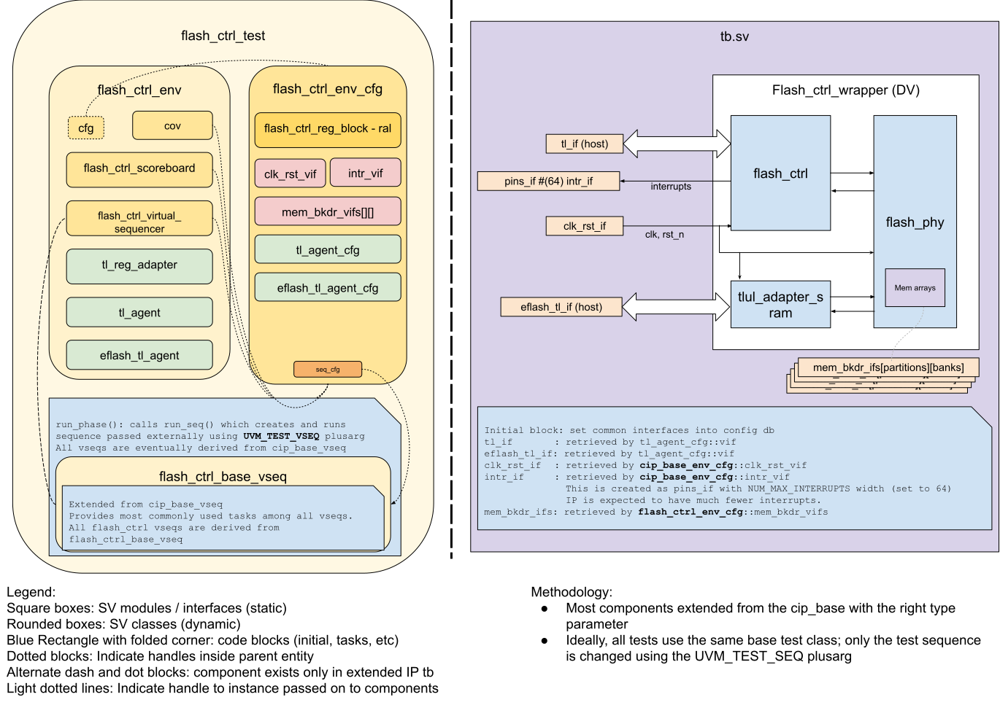

## Goals
* **DV**
  * Verify all `flash_ctrl` IP features by running dynamic simulations with a SV/UVM based testbench
  * Develop and run all tests based on the [DV plan](#dv-plan) below towards closing code and functional coverage on the IP and all of its sub-modules
* **FPV**
  * Verify TileLink device protocol compliance with an SVA based testbench

## Current status
* [Design & verification stage]()
  * [HW development stages]()
* [Simulation results](https://reports.opentitan.org/hw/ip/flash_ctrl/dv/latest/results.html)

## Design features
For detailed information on `flash_ctrl` design features, please see the [`flash_ctrl` HWIP technical specification]().
The design-under-test (DUT) wraps the `flash_ctrl` IP, `flash_phy` and the TLUL SRAM adapter that converts the incoming TL accesses from the from host (CPU) interface into flash requests.
These modules are instantiated and connected to each other and to the rest of the design at the top level.
For the IP level DV, we replicate the instantiations and connections in `flash_ctrl_wrapper` module mainained in DV, located at `hw/ip/flash_ctrl/dv/tb/flash_ctrl_wrapper.sv`.
In future, we will consider having the wrapper maintained in the RTL area instead.

## Testbench architecture
The `flash_ctrl` UVM DV testbench has been constructed based on the [CIP testbench architecture]().

### Block diagram


### Top level testbench
Top level testbench is located at `hw/ip/flash_ctrl/dv/tb/tb.sv`.
It instantiates the `flash_ctrl_wrapper`.
In addition, the testbench instantiates the following interfaces, connects them to the DUT and sets their handle into `uvm_config_db`:
* [Clock and reset interface]()
* [TileLink host interface for the flash controller]()
* [TileLink host interface for the eflash]()
* Interrupts ([`pins_if`]()
* [Memory backdoor interfaces]()

In future, as the design (and DV) matures, the following interfaces will be
instantiated and hooked up to the DUT:
* Secret key interface from the OTP
* Interface to the `key_mgr`
* Interface from the life cycle manager

### Common DV utility components
The following utilities provide generic helper tasks and functions to perform activities that are common across the project:
* [dv_utils_pkg]()
* [csr_utils_pkg]()

### TL_agent
`flash_ctrl` UVM environment instantiates a (already handled in CIP base env) [tl_agent]() which provides the ability to drive and independently monitor random traffic via TL host interface into `flash_ctrl` device.
There is an additional instance of the `tl_agent` for the host interface to the `flash_phy`, to directly fetch the contents of the flash memory, bypassing the `flash_ctrl`.

The `tl_agent` monitor supplies partial TileLink request packets as well as completed TileLink response packets over the TLM analysis port for further processing within the `flash_ctrl` scoreboard.

### UVM RAL Model
The `flash_ctrl` RAL model is created with the [`ralgen`]() FuseSoC generator script automatically when the simulation is at the build stage.

It can be created manually by invoking [`regtool`]():

#### Sequence cfg
An efficient way to develop test sequences is by providing some random varibles that are used to configure the DUT / drive stimulus.
The random variables are constrained using weights and knobs that can be controlled.
These weights and knobs take on a "default" value that will result in the widest exploration of the design state space, when the test sequence is randomized and run as-is.
To steer the randomization towards a particular distribution or to achieve interesting combinations of the random variables, the test sequence can be extended to create a spacialized variant.
In this extended sequence, nothing would need to be done, other than setting those weights and knobs appropriately.
This helps increase the likelihood of hitting the design corners that would otherwise be difficult to achieve, while maximizing reuse.

This object aims to provide such run-time controls.
An example of such a knob is `num_en_mp_regions`, which controls how many flash memory protection regions to configure, set to 'all' by default.

#### Env cfg
The `flash_ctrl_env_cfg`, environment configuration object provides access to the following elements:
* Build-time controls to configure the UVM environment composition during the `build_phase`
* Downstream agent configuration objects for ease of lookup from any environment component
  * This includes the `tl_agent_cfg` objects for both TL interfaces
* All virtual interfaces that connect to the DUT listed above (retrieved from the `uvm_config_db`)
* Sequence configuration object described above

All environment components contain a handle to an instance of this class (that was created in the test class via the parent `dv_base_test`).
By housing all of the above, all pertinent information is more easily shared with all environment components.

### Stimulus strategy
#### Test sequences
All test sequences reside in `hw/ip/flash_ctrl/dv/env/seq_lib`.
The `flash_ctrl_base_vseq` virtual sequence is extended from `cip_base_vseq` and serves as a starting point.
All test sequences are extended from `flash_ctrl_base_vseq`.
It provides commonly used handles, variables, functions and tasks that the test sequences can simple use / call.
Some of the most commonly used tasks / functions are as follows:
* task 1:
* task 2:

#### Functional coverage
To ensure high quality constrained random stimulus, it is necessary to develop a functional coverage model.
The following covergroups have been developed to prove that the test intent has been adequately met:
* cg1:
* cg2:

### Self-checking strategy
#### Scoreboard
The `flash_ctrl_scoreboard` is primarily used for end to end checking.
It creates the following analysis ports to retrieve the data monitored by corresponding interface agents:
* analysis port1:
* analysis port2:
<!-- explain inputs monitored, flow of data and outputs checked -->

#### Assertions
* TLUL assertions: The `tb/flash_ctrl_bind.sv` binds the `tlul_assert` [assertions]() to the IP to ensure TileLink interface protocol compliance.
* Unknown checks on DUT outputs: The RTL has assertions to ensure all outputs are initialized to known values after coming out of reset.
* assert prop 1:
* assert prop 2:

### Global types & methods
All common types and methods defined at the package level can be found in
`flash_ctrl_env_pkg`. Some of them in use are:
```systemverilog
[list a few parameters, types & methods; no need to mention all]
```

## Building and running tests
We are using our in-house developed [regression tool]() for building and running our tests and regressions.
Please take a look at the link for detailed information on the usage, capabilities, features and known issues.
Here's how to run a smoke test:
```console
$ cd $REPO_TOP
$ ./util/dvsim/dvsim.py hw/ip/flash_ctrl/dv/flash_ctrl_sim_cfg.hjson -i flash_ctrl_smoke
```

## DV plan

