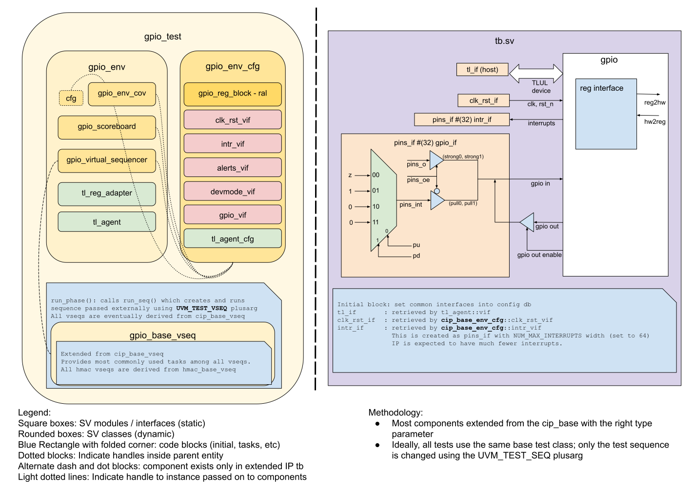

## Goals
* **DV**
  * Verify all GPIO IP features by running dynamic simulations with a SV/UVM based testbench
  * Develop and run all tests based on the [DV plan](#dv-plan) below towards closing code and functional coverage on the IP and all of its sub-modules
* **FPV**
  * Verify TileLink device protocol compliance with an SVA based testbench

## Current status
* [Design & verification stage]()
  * [HW development stages]()
* [Simulation results](https://reports.opentitan.org/hw/ip/gpio/dv/latest/results.html)

## Design features
For detailed information on GPIO design features, please see the [GPIO design specification]().

## Testbench architecture
GPIO testbench has been constructed based on the [CIP testbench architecture]().

### Block diagram


### Top level testbench
Top level testbench is located at `hw/ip/gpio/dv/tb/tb.sv`. It instantiates the GPIO DUT module `hw/ip/gpio/rtl/gpio.sv`.
In addition, it instantiates the following interfaces and sets their handle into `uvm_config_db`:
* [Clock and reset interface]()
* [TileLink host interfac]()
* GPIO IOs ([`pins_if`]())
* Interrupts ([`pins_if`]())

### Common DV utility components
The following utilities provide generic helper tasks and functions to perform activities that are common across the project:
* [common_ifs]()
* [dv_utils_pkg]()
* [csr_utils_pkg]()

### Global types & methods
All common types and methods defined at the package level can be found in `gpio_env_pkg`. Some of them in use are:
```systemverilog
parameter uint NUM_GPIOS = 32;
parameter uint FILTER_CYCLES = 16;
```
### TL_agent
GPIO testbench instantiates (handled in CIP base env) [tl_agent]() which provides the ability to drive and independently monitor random traffic via TL host interface into GPIO device.

### UVM RAL Model
The GPIO RAL model is created with the [`ralgen`]() FuseSoC generator script automatically when the simulation is at the build stage.

It can be created manually by invoking [`regtool`]():

### Stimulus strategy
#### Test sequences
All test sequences reside in `hw/ip/gpio/dv/env/seq_lib`.
The `gpio_base_vseq` virtual sequence is extended from `cip_base_vseq` and serves as a starting point.
All test sequences are extended from `gpio_base_vseq`. It provides commonly used handles, variables, functions and tasks that the test sequences can simple use / call.
Some of the most commonly used tasks / functions are as follows:

* `set_gpio_pulls`: This function overrides values of `pullup_en` and `pulldown_en` members of randomized `gpio_env_cfg`
* `drive_gpio_in`: This task writes all bits of `direct_oe` register to 0's first and then drives specified value on dut GPIO inputs
* `undrive_gpio_in`: This task drives all dut GPIO inputs to 'z' values, so that dut GPIO outputs may be driven

#### Functional coverage
To ensure high quality constrained random stimulus, it is necessary to develop a functional coverage model. The following covergroups have been developed to prove that the test intent has been adequately met:

* `gpio_pin_values_cov_obj`: Covers values and transitions on all GPIO IOs
* `intr_state_cov_obj`: Covers `intr_state` values and transitions for all GPIO interrupts
* `intr_ctrl_en_cov_objs`: Covers values and transitions on all bits of following interrupt control enable registers:
  * `intr_ctrl_en_rising`
  * `intr_ctrl_en_falling`
  * `intr_ctrl_en_lvlhigh`
  * `intr_ctrl_en_lvllow`
* `intr_event_type_cov_objs`: Covers all GPIO interrupts with following interrupt control registers and their cross coverage with `intr_enable` and `intr_state`:
  * `intr_ctrl_en_rising`
  * `intr_ctrl_en_falling`
  * `intr_ctrl_en_lvlhigh`
  * `intr_ctrl_en_lvllow`
* `data_in_cov_obj`: Covers values and transitions on all bits of data_in register
* `out_oe_cov_objs`: Covers values and transitions on all bits of `direct_out`, `direct_oe`, `masked_out_lower`, `masked_oe_lower`, `masked_out_upper` and `masked_oe_upper` registers
* `out_oe_mask_data_cov_objs`: Covers `mask`, `data` fields and their cross coverage for `masked_out_lower` / `masked_oe_lower` and `masked_out_upper` / `masked_oe_upper` registers
* `data_out_data_oe_cov_obj`: Covers data_out, data_oe and their cross coverage based on writes to `direct_out`, `direct_oe`, `masked_out_lower`, `masked_oe_lower`, `masked_out_upper` and `masked_oe_upper` registers

### Self-checking strategy
#### Scoreboard
The `gpio_scoreboard` is primarily used for end to end checking.
It creates the following tlm analysis fifos to retrieve the data monitored by tlul interface agent monitors:
* tl_a_chan_fifo: tl address channel
* tl_d_chan_fifo: tl data channel

GPIO scoreboard monitors all valid GPIO CSR register accesses, activity on GPIO IOs, and interrupt pins. For any monitored write transaction, CSR values are updated in RAL. Based on monitored activity, GPIO scoreboard predicts updated values of required CSRs.

For any activity monitored on GPIO IOs or any write to \*out\* or \*oe\* registers, `gpio_predict_and_compare` task is called which in turn predict any possible update for `data_in` register and GPIO pins. A checker compares predicted value of GPIO pins against actual monitored value.

GPIO IO update or CSR write on most of the GPIO registers may result in GPIO interrupt event. For any such interrupt event, GPIO scoreboard predicts any possible update to `intr_state` register. This also includes `inter_test` reg functionality.

Any CSR read transaction would check actual read data against predicted value.  Additionally, CSR read on intr_state would also check if monitored value of interrupt pins match the predicted value.

#### Assertions
* TLUL assertions: The `tb/gpio_bind.sv` binds the `tlul_assert` [assertions]() to the IP to ensure TileLink interface protocol compliance.
* Unknown checks on DUT outputs: The RTL has assertions to ensure all outputs are initialized to known values after coming out of reset
* `IntrGpioKnown`: Checks that GPIO interrupt pins do not have any unknowns
* `CioGpioEnOKnown`: Checks that GPIO output does not have any unknowns
* `CioGpioOKnown`: Checks that GPIO output enable does not have any unknowns

## Building and running tests
We are using our in-house developed [regression tool]() for building and running our tests and regressions.
Please take a look at the link for detailed information on the usage, capabilities, features and known issues.
Here's how to run a smoke test:
```console
$ $REPO_TOP/util/dvsim/dvsim.py $REPO_TOP/hw/ip/gpio/dv/gpio_sim_cfg.hjson -i gpio_smoke
```

## DV plan

