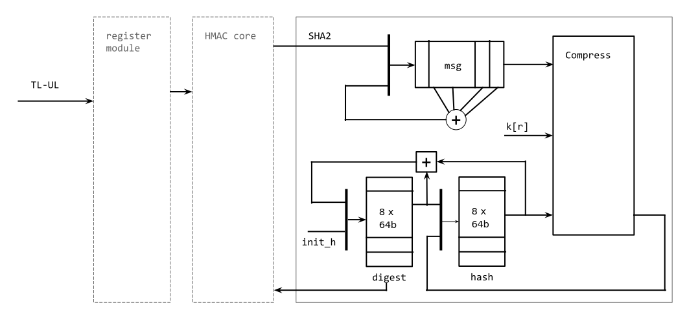
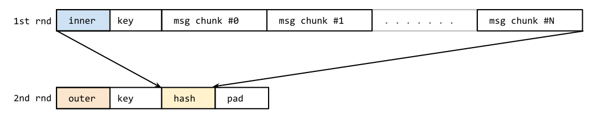

# Overview

This document specifies HMAC hardware IP functionality. This module conforms to
the [OpenTitan guideline for peripheral device functionality.]()
See that document for integration overview within the broader OpenTitan top level system.


## Features

- HMAC with SHA256 hash algorithm
- HMAC-SHA256, SHA256 dual mode
- 256-bit secret key
- 16 x 32-bit Message buffer

## Description

[sha256-spec]: https://csrc.nist.gov/publications/detail/fips/180/4/final

The HMAC module is a [SHA-256][sha256-spec] hash based authentication code
generator to check the integrity of an incoming message and a signature signed
with the same secret key. It generates a different authentication code with the
same message if the secret key is different.

The 256-bit secret key written in  to . The message to authenticate
is written to  and the HMAC generates a 256-bit digest value which can
be read from  to . The `hash_done` interrupt is raised to
report to software that the final digest is available.

The HMAC IP can run in SHA-256-only mode, whose purpose is to check the
correctness of the received message. The same digest registers above are used to
represent the hash result. SHA-256 mode doesn't use the given secret key. It
generates the same result with the same message every time.

The software doesn't need to provide the message length. The HMAC IP
will calculate the length of the message received between **1** being written to
 and **1** being written to .

This version doesn't have many defense mechanisms but is able to
wipe internal variables such as the secret key, intermediate hash results
H, digest and the message FIFO. It does not wipe the software accessible 16x32b FIFO.
The software can wipe the variables by writing a 32-bit random value into
 register. The internal variables will be reset to the written
value. This version of the HMAC doesn't have a internal pseudo-random number
generator to derive the random number from the written seed number.

A later update may provide an interface for external hardware IPs, such as a key
manager, to update the secret key. It will also have
the ability to send the digest directly to a shared internal bus.

# Theory of Operations

## Block Diagram


The HMAC block diagram above shows that the HMAC core converts the secret key
registers into an inner padded key and an outer padded key which are fed to the
hash engine when appropriate. The module also feeds the result of the first
round message (which uses the inner padded key) from the SHA-256 hash engine
into the 16x32b FIFO for the second round (which uses the outer padded key).
The message length is automatically updated to reflect the size of the outer
padded key and first round digest result for the second round.  See the details
at [Design Details](#design-details).



The SHA-256 (SHA-2) block diagram shows the message FIFO inside SHA-256, hash
registers, digest registers, and SHA-256 compression function. The message FIFO
is not software accessible but is fed from the 16x32b FIFO seen in the HMAC
block diagram via the HMAC core. The HMAC core can forward the message directly
from the 16x32b FIFO if HMAC is not enabled. This message is padded with length
appended to fit the 512-bit block size as described in the [SHA-256
specification][sha256-spec].

With the 512-bit block, the compress function runs 64 rounds to calculate the
block hash, which is stored in the hash registers above. After 64 rounds are
completed, the SHA-256 updates the digest registers with the addition of the
hash result and the previous digest registers.

## Hardware Interface



## Design Details

### SHA-256 message feed and pad

A message is fed via a memory-mapped message FIFO. Any write access to the
memory-mapped window  updates the message FIFO. If the FIFO is full,
the HMAC block will block any writes leading to back-pressure on the
interconnect (as opposed to dropping those writes or overwriting existing FIFO
contents). It is recommended this back-pressure is avoided by not writing to the
memory-mapped message FIFO when it is full (As indicated by ).
The logic assumes the received message is big-endian. If it is little-endian,
the software must set  to **1**.  The byte order of the digest
registers, from  to  can be configured with .

The message length is calculated by the [packer logic]().
The packer converts non-word writes into full word writes and feeds into the message FIFO.
While packing the writes, it adds up the recevied message size and calculates the message length.
The message length value is used in HMAC and SHA-256 to complete the hash computation.

The SHA-256 module computes intermediate hashes in every 512-bit block size.
The message must be padded to fill 512-bit blocks. This is done with an initial
**1** bit after the message bits with a 64-bit message length at the end and
enough **0** bits in the middle to result in a full block.The [SHA-256
specification][sha256-spec] describes this in more detail. An example is shown
below. The padding logic handles this so software only needs to write the actual
message bits into the FIFO.


For instance, if the message is empty, the message length is 64-bit 0. In this
case, the padding logic gives `0x80000000` into the SHA-256 module first. Then
it sends (512 - 32 - 64)/32, 13 times of `0x00000000` for Padding `0x00`.
Lastly, it returns the message length which is 64-bit `0x00000000_00000000`. If
incomplete words are written, the packet logic appends `0x80` in the proper byte
location.  Such as `0xXX800000` for the message length % 4B == 1 case.

### SHA-256 computation

SHA-256 engine receives 16 X 32 bits of message from the message FIFO or the
HMAC core then begins 64 rounds of the hash computation which is also called
*compression*. In each round, the compression function fetches 4 byte from the
buffer and computes the internal variables. As the module fetches 16 X 4 byte
message only, other 48 X 4 byte data comes from the shuffling result of the
given 512-bit block. Details are well described in [Wikipedia][sha2-wikipedia]
and the [SHA-256 specification][sha256-spec].

[sha2-wikipedia]: https://en.wikipedia.org/wiki/SHA-2

With the given hash values, 4 byte message, and round constants, the compression
function computes the next round hash values. The 64 X 32-bit round constants
are hard-wired in the design. After the compression at the last round is
finished, the result hash values are added into the digest. The digest, again,
is used as initial hash values for the next 512-bit block compression. During
the compression rounds, it doesn't fetch data from the message FIFO . The
software can push up to 16 entries to the FIFO for the next hash computation.



HMAC can be used with any hash algorithms but this version of HMAC IP only uses
SHA-256 as the hash algorithm. The first phase of HMAC calculates the SHA-256
hash of the inner secret key and the actual message to be authenticated.
The inner secret key is created with 256-bit (hashed) secret key and `0x36` pad.

```verilog
    inner_pad_key = {key[255:0], 256'h0} ^ {64{8'h36}} // big-endian
```

The message length used in the SHA-256 module is calculated by the HMAC core by
adding 512 to the original message length (to account for the length of the
inner_pad_key which is concatenated to the front of the message).

The first round digest is fed into the second round in HMAC.
The second round computes the hash of the outer secret key and the first round digest.
As the result of SHA-256 is 256-bits, it must be padded to fit into 512-bit block size.

```verilog
    outer_pad_key = {key[255:0], 256'h0} ^ {64{8'h5c}} // big-endian
```

In the second round, the message length is fixed to 768.

HMAC assumes the secret key is 256-bit. The onus is on software to shrink the
key to 256-bit using a hash function when setting up the HMAC (e.g. common key
sizes may be 2048-bit or 4096-bit, software will hash these and write the hashed
results to the HMAC).

### Performance in SHA-256 mode and HMAC mode

The SHA-256 hash algorithm computes 512-bit data at a time. The first 16 rounds
needs the actual 16 x 32-bit message and the following 48 rounds need the
computational result of the message.

In these 48 round, the software can feed next 16 x 32-bit message block. But
after the FIFO is full, the software cannot push more data until the current
block is processed. In this version of IP, it fetches next 16 x 32-bit message
after completing the current block. It means it takes 80 cycles to complete a
block. The effective throughput considering this is `64 byte / 80 clk` or `16
clk / 80 clk`, 20% of the maximum throughput. For instance, if the clock
frequency is 100MHz, the SHA-256 can hash out 80MB/s at most.

It can be enhanced if the message is fed into the internal buffer when the round
hits 48, which eliminates extra 16 cycles to feed the message after completing a
block. This version doesn't have the feature.

If HMAC mode is turned on, it introduces extra latency due to the second round
of computing the final hash of the outer key and the result of the first round
using the inner key.  This gives an extra 240 cycles(80 for the inner key, 80
for the outer key, and 80 for the result of the first round) to complete a
message. For instance, if an empty message is given, it takes 360 cycles(80 for
msg itself and 240 for the extra) to get the HMAC authentication token.

### MSG_FIFO

The MSG_FIFO in the HMAC IP has a wide address range not just one 4 byte address.
Any writes to the address range go into the single entry point of the `prim_packer`.
Then `prim_packer` compacts the data into the word-size if not a word-write then writes to the MSG_FIFO.
This is different from the conventional memory-mapped FIFO.

By having wide address range pointing to a single entry point, the FIFO can free from the fixed address restriction.
For instance, the core can use "store multiple" commands to feed the message fifo efficiently.
If the FIFO has fixed word-size address, the core shall maintain the strict-order of the write sequence which may cause the stall of the pipeline in high pipelined processor.
It affects the performance significantly.

Also, the DMA engine which might not have the ability to be configured to the fixed write and incremental read may benefit from this behavior.

# Programmers Guide

This chapter shows how to use the HMAC-SHA256 IP by showing some snippets such
as initialization, initiating SHA-256 or HMAC process and processing the
interrupts. This code is not compilable but serves to demonstrate the IO
required. More detailed and complete code will eventually be found in the
software under `sw/`.

## Initialization

This section of the code describes initializing the HMAC-SHA256, setting up the
interrupts, endianess, and HMAC, SHA-256 mode.  reverses
byte-oder of input message when the software writes message into the FIFO.
 is to reverse the result of the HMAC or SHA hash. It doesn't
reverse the byte-order of the internal logic but to the registers only.

```c
void hmac_init(unsigned int endianess, unsigned int digest_endian) {
  HMAC_CFG(0) = HMAC_CFG_SHA_EN
              | HMAC_CFG_HMAC_EN
              | (endianess << HMAC_CFG_ENDIAN_SWAP_LSB)
              | (digest_endian << HMAC_CFG_DIGEST__SWAP_LSB);

  // Enable interrupts if needed.

  // If secret key is static, you can put the key here
  HMAC_KEY_0 = SECRET_KEY_0;
  HMAC_KEY_1 = SECRET_KEY_1;
  HMAC_KEY_2 = SECRET_KEY_2;
  HMAC_KEY_3 = SECRET_KEY_3;
  HMAC_KEY_4 = SECRET_KEY_4;
  HMAC_KEY_5 = SECRET_KEY_5;
  HMAC_KEY_6 = SECRET_KEY_6;
  HMAC_KEY_7 = SECRET_KEY_7;
}
```

## Trigger HMAC/SHA-256 engine

The following code shows how to send a message to the HMAC, the proceedure is
the same whether a full HMAC or SHA-256 calculation only is wanted (choose
between them using ). In both cases the SHA-256 engine must be
enabled using  (once all other configuration has been properly set).
If the message is bigger than 512-bit, the software must wait until the FIFO
isn't full before writing further bits.

```c
void run_hmac(uint32_t *msg, uint32_t msg_len, uint32_t *hash) {
  // Initiate hash: hash_start
  REG32(HMAC_CMD(0)) = (1 << HMAC_CMD_HASH_START);

  // write the message: below example assumes word-aligned access
  for (uint32_t written = 0 ; written < (msg_len >> 3) ; written += 4) {
    while((REG32(HMAC_STATUS(0)) >> HMAC_STATUS_FIFO_FULL) & 0x1) ;
    // Any write data from HMAC_MSG_FIFO_OFFSET to HMAC_MSG_FIFO_SIZE
    // is written to the message FIFO
    REG32(HMAC_MSG_FIFO(0)) = *(msg+(written/4));
  }

  // Completes hash: hash_process
  REG32(HMAC_CMD(0)) = (1 << HMAC_CMD_HASH_PROCESS);

  while(0 == (REG32(HMAC_INTR_STATE(0)) >> HMAC_INTR_STATE_HMAC_DONE) & 0x1);

  REG32(HMAC_INTR_STATE(0)) = 1 << HMAC_INTR_STATE_HMAC_DONE;

  // Read the digest
  for (int i = 0 ; i < 8 ; i++) {
    *(hash + i) = REG32(HMAC_DIGEST_0(0) + (i << 2));
  }
}
```

## Updating the configurations

The HMAC IP prevents  and  registers from updating during the engine is processing the messages.
The attempts are discarded.
The  discards the attempt of the secret key access in the middle of the process.
In case of when the software tries to update the KEY, the IP reports an error through the Error FIFO. The error code is `SwUpdateSecretKeyInProcess`, `0x0003`.

## Interrupt Handling

### FIFO_FULL

If the FIFO_FULL interrupt occurs, it is recommended the software does not write
more data into  untill the interrupt is cleared and the status
 is lowered. Whilst the FIFO is full the HMAC will block
writes until the FIFO has space which will cause back-pressure on the
interconnect.

## Register Table


