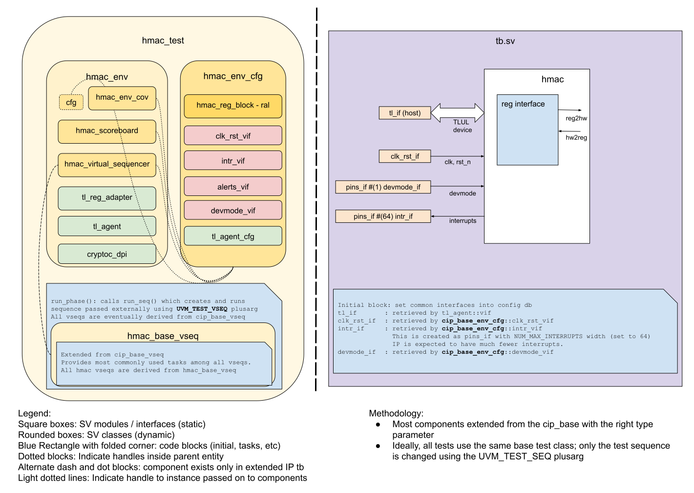

## Goals
* **DV**
  * Verify all HMAC IP features by running dynamic simulations with a SV/UVM based testbench
  * Develop and run all tests based on the [DV plan](#dv-plan) below towards closing code and functional coverage on the IP and all of its sub-modules
* **FPV**
  * Verify TileLink device protocol compliance with an SVA based testbench

## Current status
* [Design & verification stage]()
  * [HW development stages]()
* [Simulation results](https://reports.opentitan.org/hw/ip/hmac/dv/latest/results.html)

## Design features
For detailed information on HMAC design features, please see the
[HMAC design specification]().

## Testbench architecture
HMAC testbench has been constructed based on the
[CIP testbench architecture]().

### Block diagram


### Top level testbench
Top level testbench is located at `hw/ip/hmac/dv/tb/tb.sv`. It instantiates the
HMAC DUT module `hw/ip/hmac/rtl/hmac.sv`. In addition, it instantiates the following
interfaces and sets their handle into `uvm_config_db`:
* [Clock and reset interface]()
* [TileLink host interface]()
* Interrupts ([`pins_if`]())
* Devmode ([`pins_if`]())

### Common DV utility components
The following utilities provide generic helper tasks and functions to perform activities that are common across the project:
* [dv_utils_pkg]()
* [csr_utils_pkg]()

### Global types & methods
All common types and methods defined at the package level can be found in `env/hmac_env_pkg`.
Some of them in use are:
```systemverilog
parameter uint32 HMAC_MSG_FIFO_DEPTH       = 16;
parameter uint32 HMAC_MSG_FIFO_DEPTH_BYTES = HMAC_MSG_FIFO_DEPTH * 4;
parameter uint32 HMAC_MSG_FIFO_SIZE        = 2048;
```

### TL_agent
HMAC instantiates (handled in CIP base env) [tl_agent]()
which provides the ability to drive and independently monitor random traffic via
TL host interface into HMAC device.

### UVM RAL Model
The HMAC RAL model is created with the [`ralgen`]() FuseSoC generator script automatically when the simulation is at the build stage.

It can be created manually by invoking [`regtool`]():

### Reference models
To check the correctness of the output for SHA256 and HMAC, the testbench uses
the [C reference model]().
Messages and keys generated by constrained random test sequences are passed on to the
reference model. Then the hmac scoreboard will compare the reference model's expected
digest data with the DUT output.

### Stimulus strategy
#### Test sequences
All test sequences reside in `hw/ip/hmac/dv/env/seq_lib`. The `hmac_base_vseq`
virtual sequence is extended from `cip_base_vseq` and serves as a starting point.
All test sequences are extended from `hmac_base_vseq`. It provides commonly used handles,
variables, functions and tasks that the test sequences can simple use / call.
Some of the most commonly used tasks / functions are as follows:
* `hmac_init`     : initialize hmac settings including configurations and interrupte
  enables
* `csr_rd_digest` : read digest values from the CSR registers
* `wr_key`        : write key values into the CSR registers
* `wr_msg`        : write messages into the hmac_msg_fifo
* `compare_digest`: compare the read digest result with the expected values

##### Standard test vectors
Besides contrained random test sequences, hmac test sequences also includes [standard
SHA256 and HMAC test vectors]() from
[NIST](https://csrc.nist.gov/Projects/Cryptographic-Algorithm-Validation-Program/Secure-Hashing#shavs)
and [IETF](https://tools.ietf.org/html/rfc4868).
The standard test vectors provide messages, keys (for HMAC only), and expected
results. The expected results are used to cross verify both the DUT and DPI-C model outputs.

#### Functional coverage
To ensure high quality constrained random stimulus, it is necessary to develop
functional coverage model. The following covergroups have been developed to prove
that the test intent has been adequately met:
* `cfg_cg`: Covers configuration registers in HMAC
* `intr_cg`: Covers interrupt registers in HMAC
* `status_cg`: Covers status registers in HMAC
* `msg_len_cg`: Covers streamed-in message length in HMAC

### Self-checking strategy
#### Scoreboard
The `hmac_scoreboard` is primarily used for end to end checking. It creates the
following analysis ports to retrieve the data monitored by corresponding
interface agents:
* tl_a_chan_fifo: tl address channel
* tl_d_chan_fifo: tl data channel

Hmac scoreboard monitors all hmac valid CSR registers, hmac msg_fifo (addr:
'h800 to 'hfff), and interrupt pins.

For a write transaction, during the address channel, CSR values are updated in
RAL. Msg_fifo values are updated to an internal msg queue. Once the data
finishes streaming, hmac scoreboard will input the msg queue to the C model and
calculate the expected output, then update the corresponding RAL registers.

For a read transaction, during the address channel, for status related CSRs
(such as fifo_full, fifo_empty, etc), hmac will predict its value according to
the cycle accurate model. During the data channel, hmac scoreboard will compare
the read data with expected data in RAL.

##### Scoreboard cycle accurate checking model
Hmac scoreboard contains a cycle accurate checking to model the hmac
internal message fifo. It has two pointers(`hmac_wr_cnt` and `hmac_wr_cnt`) to simulate the
read and write of the hmac internal message fifo. These two pointers are updated at the
negedge of the clock cycle to avoid glitch. Read pointer is incremented one
clock cycle after the write pointer (except if HMAC is enabled, then read will
first wait 80 clock cycles for the key padding). Hmac fifo full is asserted when
`hmac_wr_cnt - hmac_wr_cnt == 16`. Hmac fifo depth is checked against the difference
between `hmac_wr_cnt` and `hmac_rd_cnt`.

#### Assertions
* TLUL assertions: The `tb/hmac_bind.sv` binds the `tlul_assert`
  [assertions]() to hmac to ensure TileLink interface protocol compliance.
* Unknown checks on DUT outputs: The RTL has assertions to ensure all outputs are initialized to known values after coming out of reset.

## Building and running tests
We are using our in-house developed
[regression tool]() for building and running our tests and regressions.
Please take a look at the link for detailed information on the usage, capabilities, features and known
issues.
Here's how to run a smoke test:
```console
$ $REPO_TOP/util/dvsim/dvsim.py $REPO_TOP/hw/ip/hmac/dv/hmac_sim_cfg.hjson -i hmac_smoke
```

## DV plan

