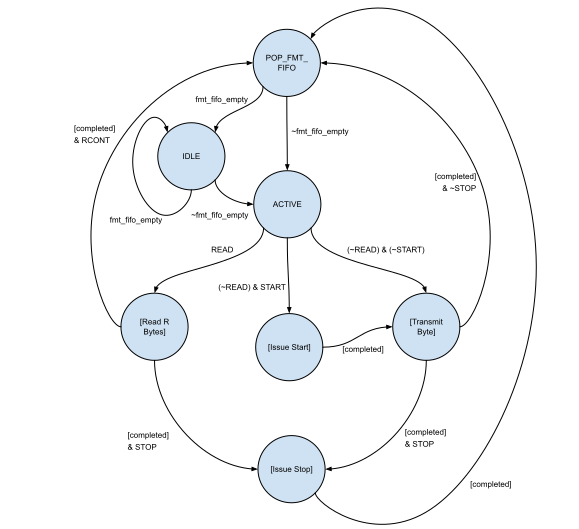

---
title: "I2C HWIP Technical Specification"
---

# Overview

This document specifies I2C hardware IP functionality.
This module conforms to the [Comportable guideline for peripheral functionality.]()
See that document for integration overview within the broader top level system.

## Features

- Two-pin clock-data parallel bidirectional external interface 
- Support for I2C Host ("I2C Master"1) and I2C Target ("I2C Slave"1) device modes
- Support for standard (100 kbaud), fast (400 kbaud) and fast-plus (1 Mbaud) modes
- Bandwidth up to 1 Mbaud
- Support for all "Mandatory" features as specified for I2C Hosts (as listed in Table 2 of the [I2C specification](https://www.nxp.com/docs/en/user-guide/UM10204.pdf)):
    - Start Condition
    - Stop Condition
    - Acknowledge
    - 7-bit target address
- Support for the following optional capabilities:
    - Clock stretching in the host mode
    - Automatic clock stretching in the target mode when TX FIFO is empty during a read2
    - Automatic clock stretching in the target mode when ACQ FIFO is full during a write
    - Clock stretching in the target mode after a complete address acquire, byte read, or byte write transactions
- *No support at this time* for any of the features related to multi-host control:
    - No support for host-host clock synchronization
    - No support for host bus arbitration.
- Byte-formatted register interface with four separate queues: two queues in the host mode, one for holding read data, the other for holding bytes to be transmitted (addresses or write data) and two queues in the target mode, for holding read and write data
- Direct SCL and SDA control in "Override mode" (for debugging)
- SCL and SDA ports mapped to I/O via the pinmux.
- Interrupts in the host mode for FMT and RX FIFO overflow, target NACK, SCL/SDA signal interference, timeout, unstable SDA signal levels, and transaction complete
- Interrupts in the target mode for TX FIFO empty during a read, TX FIFO nonempty at the end of a read, TX and ACQ FIFO overflow, host sending STOP after ACK, and host ceasing to send SCL pulses during an ongoing transaction

1 lowRISC is avoiding the fraught terms master/slave and defaulting to host/target where applicable.

2 The target is only compatible with hosts that support clock stretching.

## Description

This IP block  implements the [I2C specification](https://www.nxp.com/docs/en/user-guide/UM10204.pdf), though with some variation in nomenclature.
For the purposes of this document, a "I2C Host" meets the specifications put forth for a "Master" device.
Furthermore, a device which meets the specifications put forward for an I2C "Slave" device is here referred to as an "I2C Target" or "I2C Target Device".

At a high-level, the I2C protocol is a clock-parallel serial protocol, with at least one host issuing transactions to a number of targets on the same bus.
Though I2C optionally allows for multiple hosts on the same bus, we do not support this feature at this time.

Every transaction consists of a number of bytes transmitted, either from host-to-target or target-to-host.
Each byte is typically followed by a single bit acknowledgement (ACK) from the receiving side.
Typically each transaction consists of:
1. A START signal, issued by host.
1. An address, issued by host, encoded as 7 bits.
1. A R/W bit indicating whether the transaction is a read from the target device, or a write to the target device.
The R/W bit is encoded along with the address.
1. An Acknowledge signal (ACK) sent by the target device.
1. Data bytes, where the number of bytes required is indicated by the host,
in a manner which differs between reads and writes.
    - For write transactions, the target device sends an ACK signal after every byte received.
    The host indicates the end of a transaction by sending a STOP or RESTART signal.
    - For read transactions, the target device continues to send data as long as the host acknowledges the target-issued data by sending an ACK signal.
    Once the host has received all the required data it indicates that no more data is needed by explicitly de-asserting the ACK signal (this is called a NACK signal) just before sending a STOP or RESTART signal.
1. A STOP signal or a RESTART signal.

This protocol is generally quite flexible with respect to timing constraints, and slow enough to be managed by a software microcontroller, however such an implementation requires frequent activity on the part of the microcontroller.
This IP presents a simple register interface and state-machine to manage the corresponding I/O pins directly using a byte-formatted programming model.

## Compatibility

This IP block should be compatible with any target device covered by the [I2C specification](https://www.nxp.com/docs/en/user-guide/UM10204.pdf), operating at speeds up to 1 Mbaud.
This IP in the host mode issues addresses in 7-bit encoding, and in the target mode, receives addresses in 7-bit encoding.
(It remains the obligation of system designers to ensure that devices remain in a 7-bit address space.)
This IP also supports clock-stretching, should that be required by target devices.

# Theory of Operations

## Block Diagram

## Hardware Interfaces



## Design Details

### Functional Modes

I2C IP is a host-target combo that can function as either an I2C host or an I2C target.
Although it is conceivable that an I2C combo can optionally function as both a host and a target at the same time, we do not support this feature at this time.
These functional modes are enabled at runtime by setting the register fields  and .

### Virtual Open Drain

In devices which lack a true open drain buffer functionality, this IP implements a "virtual Open Drain" functionality.
The SDA and SCL outputs are assumed to be connected to a tri-state buffer, with independent enable outputs for both signals.

Rather than toggling the buffer inputs, the buffer inputs are *continuously asserted low*, and instead the buffer *enable* signals are toggled.
The SDA or SCL buffers are enabled for a logical "Low" output on the respective signal, and are disabled for logical "High" outputs.
This arrangement allows the the output pins to float high if there is no conflict from external devices, or to be pulled low if there is a conflict (as is required for clock-stretching or--in future revisions-- multi-host functionality).

This arrangement is necessary for FPGA builds.

### Override Mode for Direct Pin Access

The I2C hardware interface consists of two external pins, SCL and SDA, whose behavior is described in the [I2C specification](https://www.nxp.com/docs/en/user-guide/UM10204.pdf).
These pins are typically controlled by an internal state machine.
However, there is a simpler "override" mode, by which these pins can be directly manipulated by software.
This override mode is useful for troubleshooting or error-recovery.

To enter override mode, the register field  is asserted by software.
In this state the output drivers `scl_tx_o` and `sda_tx_o` are controlled directly by the register fields  and .
When  and  are set high, the virtual open drain configuration will leave the output resistively pulled high, and controllable by remote targets.
In this state, with SCL or SDA asserted high, the register fields  and  can be used to receive inputs (including remote acknowledgments) from target devices.

### Byte-Formatted Programming Mode

This section applies to I2C in the host mode.
The state machine-controlled mode allows for higher-speed operation with less frequent software interaction.
In this mode, the I2C pins are controlled by the I2C state machine, which in turn is controlled by a sequence of formatting indicators.
The formatting indicators indicate:
- The sequence of bytes which should be transmitted on the SDA and SCL pins.
- The periods between transmitted bytes when the state-machine should stop transmission and instead read back a fixed number of bytes.
- Which bytes should be preceded by a START symbol.
- Which bytes should be followed by a STOP symbol
The format indicator consists of 13-bits.
That is of one single Format Byte (entered into the format FIFO through ), and five (5) 1-bit flags (entered into the format FIFO through registers , , ,  and )

The I2C reads each format indicator from the head of FMT_FIFO, and processes them in turn.
If none of the flags are set for the format indicator, the I2C FSM simply transmits the Format Byte onto the SCL and SDA pins according to the specification, waits for acknowledgement, and then proceeds to the next format indicator.
The format flags modulate the behavior as follows.
- READ (corresponds to ):
Signifies the Format Byte () should be treated as an unsigned number, R, and prompts the state machine to read R bytes from the target device.
Bytes read from the bus, are inserted into the RX FIFO where they can be accessed by software.
A value of 0 is treated as a read of 256B.
To read a larger byte stream, multiple 256B reads can be chained together using the RCONT flag.
- RCONT (corresponds to FIFO inputs , only used with READ):
    - If RCONT is set, the Format Byte represents part of a longer sequence of reads, allowing for reads to be chained indefinitely.
    - The RCONT flag indicates the the final byte returned with the current read should be responded to with an ACK, allowing the target to continue sending data.
(Note that the first R-1 bytes read will still be acknowledged regardless of whether RCONT is asserted or not.)
- START (corresponds to , Ignored when used with READ):
Issue a START condition before transmitting the Format Byte on the bus.
    - This flag may also be used to issue a repeated start condition.
- STOP (corresponds to ):
Issue a STOP signal after processing this current entry in the FMT FIFO.
    - Note that this flag is not compatible with (READ & RCONT), and will cause bus conflicts.
- NAKOK (corresponds to , Not compatible with READ):
Typically every byte transmitted must also receive an ACK signal, and the IP will raise an exception if no ACK is received.
However, there are some I2C commands which do not require an ACK.
In those cases this flag should be asserted with FBYTE indicating no ACK is expected and no interrupt should be raised if the ACK is not received.

### Target Address Registers

I2C target device is assigned two 7-bit address and 7-bit mask pairs.
The target device accepts a transaction if the result of the bitwise AND operation performed on the transaction address sent by the host and a mask matches the assigned address corresponding to the mask.
In other words, address matching is performed only for bits where the mask is "1".
Thus, with the masks set to all ones (0x7F), the target device will respond to either of the two assigned unique addresses and no other.
If the mask and the assigned address both have zeros in a particular bit position, that bit will be a match regardless of the value of that bit received from the host.
Note that if, in any bit position, the mask has zero and the assigned address has one, no transaction can match and such mask/address pair is effectively disabled.
The assigned address and mask pairs are set in registers , , , and . 

### Acquired Formatted Data

This section applies to I2C in the target mode.
When the target accepts a transaction, it inserts the transaction address, read/write bit, and START signal sent by the host into ACQ FIFO where they can be accessed by software.
ACQ FIFO output corresponds to .
If the transaction is a write operation (R/W bit = 0), the target proceeds to read bytes from the bus and insert them into ACQ FIFO until the host terminates the transaction by sending a STOP or RESTART signal.
A STOP or RESTART indicator is inserted into ACQ FIFO as the next entry following the last byte received, in which case other bits are junk.
The following diagram shows consecutive entries inserted into ACQ FIFO during a write operation:

If the transaction is a read operation (R/W bit = 1), the target pulls bytes out of TX FIFO and transmits them to the bus until the host signals the end of the transfer by sending a NACK signal.
If TX FIFO holds no data, the target will hold SCL low to stretch the clock and give software time to write data bytes into TX FIFO.
TX FIFO input corresponds to .
Typically, a NACK signal is followed by a STOP or RESTART signal and the IP will raise an exception if the host sends a STOP signal after an ACK.
An ACK/NACK signal is inserted into the ACQ FIFO as the first bit (bit 0), in the same entry with a STOP or RESTART signal. 
For ACK and NACK signals, the value of the first bit is 0 and 1, respectively.
The following diagram shows consecutive entries inserted into ACQ FIFO during a read operation:

The ACQ FIFO entry consists of 10 bits:
- Address (bits 7:1) and R/W bit (bit 0) or data byte
- Format flags (bits 9:8)
The format flags indicate the following signals received from the host:
- START: 01
- STOP: 10
- RESTART: 11
- No START, STOP, or RESTART: 00

### Timing Control Registers

For standard mode, fast-mode and fast-mode plus, the timing requirements for each transaction are detailed in Table 10 of the [I2C specification](https://www.nxp.com/docs/en/user-guide/UM10204.pdf).
In order to claim complete compatibility at each mode, the state machine timings need to be adapted to whether there are Standard-mode, Fast-mode and Fast-mode Plus targets on the bus.
Furthermore, depending on the actual capacitance of the bus, even a bus with all Fast-mode Plus capable targets may have to operate at slower speeds than 1Mbaud.
For example, the host may need to run at lower frequencies, as discussed in Section 5.2 of the specification, but the computation of the nominal frequency will depend on timing specifications in Table 10, in this case particularly, the limits on tLOW, tHIGH, tr, and tf.
Assuming no clock stretching, for a given set of these four parameters the baud rate is then given to be:
$$ 1/f\_{SCL}=t\_{LOW}+t\_{HIGH}+t\_{r}+t\_{f}. $$

Thus in order to ensure compliance with the spec in any particular configuration, software will program the I2C host IP with explicit values for each of the following timing parameters, as defined in Figure 38 of the specification.
- tLOW: set in register .
- tHIGH: set in register .
- tr: set in register .
(Note: The rise time cannot be explicitly controlled by internal hardware, and will be a function of the capacitance of the bus.
Thus this parameter is largely budgetary, meaning that it tells the state machine how much time to wait for an RC rise.)
- tf: set in register .
(Note: The fall time cannot be explicitly controlled by internal hardware, and is a function of the pin driver.
Thus this parameter is also budgetary.
Given that the actual fall time cannot be controlled to stay above the minimum values set in Table 10 of the specification, and so this in this regard this module currently is not strictly compliant to the I2C spec.)
- tSU,STA: set in register 
- tHD,STA: set in register 
- tSU,DAT: set in register .
Taken to be synonymous with TSU,ACK
- tHD,DAT: set in register .
Taken to be synonymous with THD,ACK.
Moreover, since the pin driver fall time is likely to be less then one clock cycle, this parameter is also taken to be synonymous with the parameters TVD,DAT and TVD,ACK
- tSU,STO: set in register .
- tBUF: set in register 

The values programmed into the registers  through  are to be expressed in units of the bus clock period.
Note in order to ensure compliance with the I2C spec, firmware must program these registers with values within the ranges laid out in Table 10 of the specification.
These values can be directly computed using DIFs given the desired speed standard, the desired operating frequency, and the actual line capacitance.
These timing parameters are then fed directly to the I2C state machine to control the bus timing.

A detailed description of the algorithm for determining these parameters--as well as a couple of concrete examples--are given in the [Programmers Guide section of this document.]()

### Timeout Control
A malfunctioning (or otherwise very slow) target device can hold SCL low indefinitely, stalling the bus.
For this reason  provides a clock-stretching timeout mechanism to notify firmware of this sort of condition.
If  is asserted, an interrupt will be asserted when the IP detects that another device (a target or, in possible future revisions, an alternate host) has been holding SCL low for more than  clock ticks.

This feature is added as a utility, though it is not required by the I2C specification.
However, in some applications it could be used in protocols which build upon I2C.
For instance, SMBus applications using this IP could in principle use this to support SMBus timeouts.
(Note: This is just an example application of this feature.
Other features may also be required for complete SMBus functionality.)

### Clock Stretching
As described in the I2C specification, a target device can pause a transaction by holding SCL low.
A target device stretches the clock automatically when a host device reads from the target and the target's TX FIFO is empty.
Also, a target device stretches the clock automatically when a host device writes to the target and the target's ACQ FIFO is full.
The present implementation also supports few additional modes in which a target device can stretch the clock after completing a transaction if it needs more time, e.g., to store the acquired data byte in flash memory, etc.
If  is asserted, a target stretches the clock after acquiring an address and making certain that the transaction is intended for it and not for another device on the bus.


{signal: [
  {name: 'clock', wave: 'p...................'},
  {name: 'stretch_en_addr', wave: '1...................'},
  {name: 'stretch_stop', wave: '0.............1.....'},
  {name: 'bit_ack', wave: '0........1..........'},
  {name: 'address_match', wave: '0........1..........'},
  {name: 'SCL host driver', wave: '0z.0..z.0..z.....0..'},
  {name: 'SCL target driver', wave: 'z.........0....z....'},
  {name: 'SCL bus', wave: '0u.0..u.0......u.0..'},
],
 head: {text: 'Clock stretching after matching an address (cycle 10), normal operation is resumed and address is acknowledged (cycle 15)', tick: 1}
}


If  is asserted, a target stretches the clock after an ongoing byte transmit operation (host is reading) completes and a host acknowledges the receipt.


{signal: [
  {name: 'clock', wave: 'p..................'},
  {name: 'stretch_en_tx', wave: '1..................'},
  {name: 'stretch_stop', wave: '0.............1....'},
  {name: 'host_ack', wave: '0......1...........'},
  {name: 'SCL host driver', wave: '0z.0..z.0..z.....0.'},
  {name: 'SCL target driver', wave: 'z.......0......z...'},
  {name: 'SCL bus', wave: '0u.0..u.0......u.0.'},
],
 head: {text: 'Clock stretching after receiving an acknowledgement from host (cycle 8), normal operation is resumed (cycle 15)', tick: 1}
}


If  is asserted, a target stretches the clock after an ongoing byte acquire operation (host is writing) completes.
The target device stops stretching the clock and resumes normal operation when  is asserted.


{signal: [
  {name: 'clock', wave: 'p..................'},
  {name: 'stretch_en_acq', wave: '1..................'},
  {name: 'stretch_stop', wave: '0.............1....'},
  {name: 'bit_ack', wave: '0........1.........'},
  {name: 'SCL host driver', wave: '0z.0..z.0..z.....0.'},
  {name: 'SCL target driver', wave: 'z.........0....z...'},
  {name: 'SCL bus', wave: '0u.0..u.0......u.0.'},
],
 head: {text: 'Clock stretching after acquiring a byte (cycle 10), normal operation is resumed and byte is acknowledged (cycle 15)', tick: 1}
}


In all three cases described above, a target begins to stretch the clock when SCL is held low by a host.
For instance, if acknowledgement from a host arrives when SCL is held high and  is asserted, a target waits for the host to pull SCL low before stretching the clock.

### Interrupts
The I2C module has a few interrupts including general data flow interrupts and unexpected event interrupts.

#### Host Mode
If the RX FIFO exceeds the designated depth of entries, the interrupt `rx_watermark` is raised to inform firmware.
Firmware can configure the watermark value via the register .

Meanwhile it the FMT FIFO level falls below a designated depth of entries the `fmt_watermark` interrupt is raised.
(Note that this behavior differs from similar interrupts in other modules, such as the UART IP module.)
Firmware can configure the watermark value via the register .

If either FIFO receives an additional write request when its FIFO is full, the interrupt `fmt_overflow` or `rx_overflow` is asserted and the format indicator or character is dropped.

If the module transmits a byte, but receives no ACK signal, the `nak` interrupt is usually asserted.
In cases where a byte is transmitted and no ACK is expected or required, that byte should be submitted with NAKOK flag also asserted.

When the I2C module is in transmit mode, the `scl_interference` or `sda_interference` interrupts will be asserted if the IP identifies that some other device (host or target) on the bus is forcing either signal low and interfering with the transmission.
If should be noted that the `scl_interference` interrupt is not raised in the case when the target device is stretching the clock.
(However, it may be raised if the target allows SCL to go high and then pulls SCL down before the end of the current clock cycle.)

A target device should never assert 0 on the SDA lines, and in the absence of multi-host support, the `sda_interference` interrupt is raised whenever the host IP detects that another device is pulling SDA low.

On the other hand, it is legal for the a target device to assert SCL low for clock stretching purposes.
With clock stretching, the target can delay the start of the following SCL pulse by holding SCL low between clock pulses.
However the target device must assert SCL low before the start of the SCL pulse.
If SCL is pulled low during an SCL pulse which has already started, this interruption of the SCL pulse will be registered as an exception by the I2C core, which will then assert the `scl_interference` interrupt.


{signal: [
  {name: 'Clock', wave: 'p.....|.......|......'},
  {name: 'SCL Host Driver', wave: '0.z..0|.z....0|..z.x.'},
  {name: 'SCL Target Driver', wave: 'z.....|0..z...|...0..'},
  {name: 'SCL bus', wave: '0.u..0|...u..0|..u0..'},
  {name: 'scl_interference', wave: '0.....|.......|....1.'},
],
  head: {text: 'SCL pulses: Normal SCL pulse (Cycle 3),  SCL pulse with clock strectching (cycle 11), and SCL interference (interrupted SCL pulse)',tick:1}}


Though normal clock stretching does not count as SCL interference, if the module detects that a target device has held SCL low and stretched the any given SCL cycle for more than  clock ticks this will cause the stretch timeout interrupt to be asserted.
This interrupt is suppressed, however, if  is deasserted low.


{signal: [
  {name: 'Clock', wave: 'p............'},
  {name: 'SCL Host Driver', wave: '0..z.......x.'},
  {name: 'SCL Target Driver', wave: 'z0...........'},
  {name: 'SCL bus', wave: '0............'},
  {name: 'TIMEOUT_CNTRL.VAL', wave: '2............', data: "8"},
  {name: 'SCL timeout counter', wave: '2...22222222x', data: '0 1 2 3 4 5 6 7 8'},
  {name: 'TIMEOUT_CNTRL.EN', wave: '1............'},
  {name: 'scl_timeout', wave: '0..........1.'},
],
  head: {text: 'SCL Timeout Example',tick:-3}}


Except for START and STOP symbols, the I2C specification requires that the SDA signal remains constant whenever SCL is high.
The `sda_unstable` interrupt is asserted if, when receiving data or acknowledgement pulse, the value of the SDA signal does not remain constant over the duration of the SCL pulse.

Transactions are terminated by a STOP signal.
The host may send a repeated START signal instead of a STOP, which also terminates the preceeding transaction.
In both cases, the `trans_complete` interrupt is asserted, in the beginning of a repeated START or at the end of a STOP.

#### Target Mode
If an I2C target receives a START signal followed by an address and R/W = 1 (read), accepts a read transaction and its TX FIFO is empty, the interrupt `tx_empty` is asserted to inform firmware.
The interrupt `tx_empty` is asserted also when a target keeps transmitting data on the bus and needs more data, but TX FIFO is empty.

If a target receives a STOP or RESTART signal and there are extra bytes left in TX FIFO, the interrupt `tx_nonempty` is asserted and the FIFO is flushed.

When a host receives enough data from a target, it usually signals the end of the transaction by sending a NACK followed by a STOP or a RESTART.
In a case when a target receives an ACK and then a STOP/RESTART, the interrupt `tx_ack_stop` is asserted.

If either TX or ACQ FIFO receives an additional write request when its FIFO is full, the interrupt `tx_overflow` or `acq_overflow` is asserted and the format indicator is dropped.

If a host ceases to send SCL pulses at any point during an ongoing transaction, the target waits for a specified time period and then asserts the interrupt `host_timeout`.
Host sending an address and R/W bit to all target devices, writing to the selected target, or reading from the target are examples of ongoing transactions.
The time period is counted from the last low-to-high SCL transition.
Firmware can configure the timeout value via the register .

### Implementation Details: Format Flag Parsing

To illustrate the behavior induced by various flags added to the formatting queue, the following figure shows a simplified version of the I2C_Host state machine.
In this simplified view, many sequential states have been collapsed into four sub-sequences of states (shown in square brackets):
- Issue start
- Issue stop
- Transmit Byte
- Read Bytes

Within each of these sub-sequences, state transitions depend only on the SDA/SCL inputs or internal timers.
Each sub-sequence has a terminal event--generically labeled "[completed]" which prompts the transition to another sequence or state.

However, all transitions which are dependent on formatting flags are shown explicitly in this figure.

Similarly, the figure below shows a simplified version of the I2C_Target state machine.

In this diagram, "R/W" stands for a R/W bit value. The host is reading when R/W bit is "1" and writing when R/W bit is "0".

# Programmers guide

## Initialization

After reset, the initialization of the I2C HWIP primarily consists of four steps:
1. Timing parameter initialization
1. FIFO reset and configuration
1. Interrupt configuration
1. Enable I2C Host or Target functionality

### Timing Parameter Tuning Algorithm

Of the four initialization steps, the timing parameter initialization is the most involved.  With so many timing parameters, it is essential to have dedicated device interface functions (DIFs) to determine appropriate values for the 10 timing parameters.

The values of these parameters will depend primarily on three bus details:
- The speed mode of the slowest device on the bus: standard mode (100 kbaud), fast mode (400 kbaud) or fast-mode plus (1 Mbaud).
- The input clock period, tclk in ns.
- The expected signal rise time, tr, in ns.
   - This is not a firmware-controlled parameter.
Rather, it is a function of the capacitance and physical design of the bus.
The specification provides detailed guidelines on how to manage capacitance in an I2C system:
   - Section 5.2 of the I2C specification indicates that Fast-mode plus devices may operate at reduced clock speeds if the bus capacitance drives signal rise times (tr) outside the nominal 120ns limit.
Excess capacitance can also be compensated for by reducing the size of the bus pullup resistor, so long as the total open-drain current does not exceed 20mA for fast-mode plus devices (as described in section 7.1 of the I2C specificaion).
However the specification places a hard limit on rise times capping them at 1000ns.
    - If there are standard- or fast-mode target devices on the bus, the specified open-drain current limit is reduced to 3mA (section 7.1), thus further restricting the minimum value of the pull-up resistor.
    - In fast-mode bus designs, where the total line capacitance exceeds 200pF, the specification recommends replacing the pull-up resistor with an active current source, supplying 3mA or less (section 5.1).
Regardless of the physical construction of the bus, the rise time (tr) is a system dependent, parameter that needs to be made known to firmware for I2C initialization.
- The expected fall time, tf, in ns.
   - Like tr, this parameter is not firmware controlled rather it is a function of the SCL driver, which in a strictly compliant device is expected to manage the slew-rate for the falling edge of the SDA and SCL signals, through proper design of the SCL output buffer.
   - See table 10 of the I2C specification for more details.
- (optional) The desired SCL cycle period, tSCL,user in ns.
   - By default the device should operate at the maximum frequency for that mode.
However, If the system developer wishes to operate at slower than the mode-specific maximum, a larger than minimum period  could be allowed as an additional functional parameter when calculating the timing parameters.

Based on the inputs, the timing paramaters may be chosen using the following algorithm:
1. The physical timing parameters tHD,STA, tSU,STA, tHD.DAT, tSU,DAT, tBUF, and tSTO, tHIGH, and tLOW all have minimum allowed values which depend on the choice of speed mode (standard-mode, fast-mode or fast-mode plus).
Using the speed mode input, look up the appropriate minimum value (in ns) for each parameter (i.e. tHD,STA,min, tSU,STA,min, etc)
1. For each of these eight parameters, obtain an integer minimum by dividing the physical minimum parameter by the clock frequency and rounding up to the next highest integer:
$$ \textrm{THIGH_MIN}=\lceil{t\_{HIGH,min}/t\_{clk}}\rceil $$
$$ \textrm{TLOW_MIN}=\lceil{t\_{LOW,min}/t\_{clk}}\rceil $$
$$ \textrm{THD_STA_MIN}= \lceil{t\_{HD,STA,min}/t\_{clk}}\rceil $$
$$ \textrm{TSU_STA_MIN}= \lceil{t\_{SU,STA,min}/t\_{clk}}\rceil $$
$$ \textrm{THD_DAT_MIN}= \lceil{t\_{HD,DAT,min}/t\_{clk}}\rceil $$
$$ \textrm{TSU_DAT_MIN}= \lceil{t\_{HD,DAT,min}/t\_{clk}}\rceil $$
$$ \textrm{T_BUF_MIN}= \lceil{t\_{BUF,min}/t\_{clk}}\rceil $$
$$ \textrm{T_STO_MIN}= \lceil{t\_{STO,min}/t\_{clk}}\rceil $$

1. Input the integer timing parameters, THD_STA_MIN, TSU_STA_MIN, THD_DAT_MIN, TSU_DAT_MIN, T_BUF_MIN and T_STO_MIN into their corresponding registers (`TIMING2.THD_STA`, `TIMING2.TSU_STA`, `TIMING3.THD_DAT`, `TIMING3.TSU_DAT`, `TIMING4.T_BUF`, `TIMING4.T_STO`)
    - This step allows the firmware to manage SDA signal delays to ensure that the SDA outputs are compliant with the specification.
    - The registers `TIMING0.THIGH` and `TIMING0.TLOW` will be taken care of in a later step.
1. Take the given values for for tf and tr and convert them to integer counts as well:
$$ \textrm{T_R}= \lceil{t\_{r}/t\_{clk}}\rceil $$
$$ \textrm{T_F}= \lceil{t\_{f}/t\_{clk}}\rceil $$
1. Store T_R and T_F in their corresponding registers: `TIMING1.T_R` and `TIMING1.T_F`.
1. Based on the input speed mode, look up the maximum permissable SCL frequency (fSCL,max)and calculate the minimum permissable SCL period:
$$ t\_{SCL,min}= 1/f\_{SCL,max} $$
1. As with each of the other physical parameters convert tSCL,min and, if provided, the tSCL,user to integers, MINPERIOD and USERPERIOD..
$$ MINPERIOD = \lceil{t\_{SCL,min}/t\_{clk}}\rceil $$
$$ USERPERIOD = \lceil{t\_{SCL,user}/t\_{clk}}\rceil $$
1. Let PERIOD=max(MINPERIOD, USERPERIOD).
1. Each SCL cycle will now be at least PERIOD clock cycles in duration, divided between four segments: T_R, THIGH, T_F, and TLOW.
    - In other words: PERIOD=T_R+THIGH+T_F+TLOW.
    - With T_R and T_F already established, the remaining integer parameters THIGH and TLOW are to be divided among the remaining clock cycles in PERIOD:
$$ \textrm{THIGH}+\textrm{TLOW} \ge\textrm{PERIOD}-\textrm{T_F}-\textrm{T_R} $$
    - Since tHIGH and tLOW both have minimum allowable values, which depends on the mode, high values of tr or tf may force an increase in the total SCL period, slowing down the data transit rate.
    - The balance between tHIGH and tLOW can be manipulated in a variety of different ways (depending on the desired SCL duty cycle).
    - It is, for instance, perfectly acceptable to simply set TLOW to the minimum possible value:
$$ \textrm{TIMING0.TLOW}=\textrm{TLOW_MIN} $$
1. THIGH is then set to satisfy both constraints in the desired SCL period and in the minimum permissable values for tHIGH:
$$ \textrm{TIMING0.THIGH}=\max(\textrm{PERIOD}-\textrm{T_R} - \textrm{TIMING0.TLOW} -\textrm{T_F}, \textrm{THIGH_MIN}) $$

#### Timing parameter examples

The following tables show a couple of examples for calculating timing register parameters for Fast-mode Plus devices.
Both examples assume a desired datarate of 1 Mbaud (the bus maximum) for an SCL period of 1us, and an internal device clock period of 3ns.

| Parameter       | Spec. Min. (ns)  | Reg. Val.  | Phys. Val (ns) | Comment                                         |
|-----------------|------------------|------------|----------------|-----------------------------------------------|
| TIMING0.THIGH   | 260              | 120        | 360            | Chosen to satisfy SCL Period Minimum          |
| TIMING0.TLOW    | 500              | 167        | 501            | Spec. tLOW Minimum                 |
| TIMING1.T_F     | 20ns * (VDD/5.5V)| 7          | 21             | Signal slew-rate should be controlled         |
| TIMING1.T_R     | 0                | 40         | 120            | Based on pull-up resistance, line capacitance |
| SCL Period      | 1000             | N/A        | 1002           | Constraint on THIGH+TLOW+T_R+T_F              |
| TIMING2.THD_STA | 260              | 87         | 261            | Spec. Minimum                                 |
| TIMING2.TSU_STA | 260              | 87         | 261            | Spec. Minimum                                 |
| TIMING3.THD_DAT | 0                | 0          | 0              | Spec. Minimum                                 |
| TIMING3.TSU_DAT | 260              | 87         | 261            | Spec. Minimum                                 |
| TIMING4.T_BUF   | 500              | 167        | 501            | Spec. Minimum                                 |
| TIMING4.T_STO   | 260              | 87         | 161            | Spec. Minimum                                 |

This next example shows how the first SCL timing registers: `TIMING0` and `TIMING1` are altered in a high-capacitance Fast-mode Plus bus, where the physical value of tr driven to an atypical value of 400ns.
As in the previous example the integer register values are determined based on a system clock period, tclk, of 3ns.
All other parameters in registers `TIMING2`, `TIMING3`, `TIMING4` are unchanged from the previous example.

| Parameter       | Spec. Min. (ns)  | Reg. Val.  | Phys. Val (ns) | Comment                                       |
|-----------------|------------------|------------|----------------|-----------------------------------------------|
| TIMING0.THIGH   | 260              | 87         | 261            | Spec. tHIGH Minimum                |
| TIMING0.TLOW    | 500              | 167        | 501            | Spec. tLOW Minimum                 |
| TIMING1.T_F     | 20ns * (VDD/5.5V)| 7          | 21             | Signal slew-rate should be controlled         |
| TIMING1.T_R     | 0                | 134        | 402            | Atypicallly high line capacitance             |
| SCL Period      | 1000             | N/A        | 395            | Forced longer than minimum by long T_R        |

## Device Interface Functions (DIFs)



## Register Table


