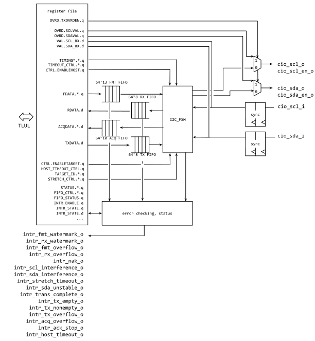

{{% lowrisc-doc-hdr I2C HWIP Technical Specification }}

{{% regfile ../data/i2c.hjson}}

{{% section1 Overview }}

This document specifies I2C hardware IP functionality. This module conforms
to the [Comportable guideline for peripheral
functionality.](https://github.com/lowRISC/stwg-base/blob/master/doc/ComportabilitySpecification.md)
See that document for integration overview within the broader top level system.

{{% toc 3 }}

{{% section2 Features }}

- The initial revision only supports I2C as a Host (I2C Master).
- Support for standard, full and fast modes
- Bandwidth up to 1 Mbaud
- Support for all “Mandatory” features as specified for I2C Hosts (as
listed in Table 2 of the I2C specification): 
    - Start Condition
    - Stop Condition
    - Acknowledge
    - 7-bit device address
- Support for the following optional capabilities:
    - 10-bit device addressing
    - Clock stretching (may be required by some devices)
- *The initial revision does not support I2C Target (I2C Slave)
functionality* 
- *No support at this time* for any of the features related to multi-host
control:
    - No support at this time for any of the features related to multi-host
control:  
    - No support for host-host clock synchronization
    - No support for host bus arbitration.
- Byte-formatted register interface with two separate queues, one for
holding read  data, the other for holding transmitted bytes (addresses or
write data) 
- Direct SCL and SDA control in “Override mode” (for debugging)
- SCL and SDA ports mapped to I/O via the pinmux. 

{{% section2 Description }}

This IP block  implements the [I2C
specification](https://www.nxp.com/docs/en/user-guide/UM10204.pdf), though
with some variation in nomenclature.   For the purposes of this document, a
“I2C Host” meets the specifications put forth for a “Master” device.
Furthermore, a device which meets the specifications put forward for an I2C
“Slave” device is here referred to as an “I2C Target”.

At a high-level, the I2C protocol is a clock-parallel serial protocol, with
at least one host issuing transactions to a number of devices on the same
bus. Though I2C optionally allows for multiple hosts on the same bus, we do
not support this feature at this time.

Every transaction consists of a number of bytes transmitted, either from
host-to-device or device-to-host.  Each byte is typically followed by a
single bit acknowledgement (ACK) from the receiving side.   Typically each
transaction consists of:
1. A START signal, issued by host.
2. An address, issued by host, encoded as 7 or 10 bits.
3. A R/W bit indicating whether the transaction is a read from the target
device, or a write to the target device.  The R/W bit is encoded along with
the address. 
4. An Acknowledge signal (ACK) sent by the target device. 
5. Data bytes, where the number of bytes required is indicated by the host,
in a manner which differs between reads and writes.
    - For write transactions, the target device sends an ACK signal after
    every byte received. The host indicates the end of a transaction by
    sending a STOP or RESTART signal. 
    - For read transactions, the device continues to send data as long as
    the host acknowledges the target-issued data by sending an ACK
    signal. Once the host has received all the required data it indicates
    that no more data is needed by explicitly de-asserting the ACK signal
    (this is called a NACK signal) just before sending a STOP or RESTART
    signal. 
6. A STOP signal or a RESTART signal.

This protocol is generally quite flexible with respect to timing
constraints, and slow enough to be managed by a software microcontroller,
however such an implementation requires frequent activity on the part of
the microcontroller.   This IP presents a simple register interface and
state-machine to manage the corresponding I/O pins directly using a
byte-formatted programming model. 

{{% section2 Compatibility }}

This IP block should be compatible with any device covered by the [I2C
specification](https://www.nxp.com/docs/en/user-guide/UM10204.pdf),
operating at speeds up to 1Mbaud.   In order to support any device, this IP
issues addresses in 7-bit encoding whenever possible, as not all devices
may be able to support 10-bit encoding.  (It remains the obligation of
system designers to ensure that devices which cannot support 10-bit
encoding remain in a 7-bit address space). This IP also supports
clock-stretching, should that be required by remote devices. 

{{% section1 Theory of Operations }}

{{% section2 Block Diagram }}

{{% section2 Hardware Interfaces }}

{{% hwcfg Name }}

{{% section2 Design Details }}

### Override Mode for Direct Pin Access

The I2C hardware interface consists of two external pins, SCL and SDA,
whose behavior is described in the I2C specification.   These pins are
typically controlled by an internal state machine.  However, there is a
simpler “override” mode, by which these pins can be directly addressed by
software. This override mode is useful for troubleshooting or error-recovery.

To enter override mode, the register field !!OVRD.TXOVRDEN is asserted by
software.  In this state the output drivers scl_tx_o and sda_tx_o are
controlled directly by the register fields !!OVRD.SCLVAL and !!OVRD.SDAVAL.
When !!OVRD.SCLVAL and !!OVRD.SDAVAL are set high, the virtual open drain
configuration will leave the output resistively pulled high, and
controllable by remote targets.  In this state, with SCL or SDA asserted
high, the register fields !!VAL.SCL_RX and !!VAL.SDA_RX can be used to
receive inputs (including remote acknowledgments) from target devices.

### Byte-Formatted Programming Mode 

The state machine-controlled mode allows for higher-speed operation with
less frequent software interaction.   In this mode, the I2C pins are
controlled by the I2C state machine, which in turn is controlled by a
sequence of formatting indicators.  The formatting indicators indicate:
- The sequence of bytes which should be transmitted on the SDA and SCL pins.
- The periods between transmitted bytes when the state-machine should stop
transmission and instead read back a fixed number of bytes.
- Which bytes should be preceded by a START symbol.
- Which bytes should be followed by a STOP symbol
The format indicator consists of 13-bits. That is of one single Format Byte
(entered into the format FIFO through !!FDATA.FBYTE), and five (5) 1-bit flags
(entered into the format FIFO through registers !!FDATA.READ,
!!FDATA.RCONT, !!FDATA.START, !!FDATA.STOP and !!FDATA.NAKOK)

The I2C reads each format indicator from the head of FMT_FIFO, and
processes them in turn. If none of the flags are set for the format format
indicator none, the I2C FSM simply transmits the Format Byte onto the SCL
and SDA pins according to the specification, waits for acknowledgement, and
then proceeds to the next format indicator.  The format flags modulate the
behavior as follows.
- READ (Corresponds to !!FDATA.READ): Signifies the Format Byte
(!!FDATA.FBYTE) should be treated as an unsigned number, R, and prompts the
state machine to read R bytes from the target device.  Bytes read from the
bus, are inserted into the RX FIFO where they can be accessed by
software. A value of 0 is treated as a read of 256B.  To read a larger byte
stream, multiple 256B reads can be chained together using the RCONT flag.
- RCONT: (Corresponds to FIFO inputs !!FDATA.RCONT, Only used with READ):
If RCONT is set, the Format Byte represents part of a longer sequence of
reads, allowing for reads to be chained indefinitely.  The RCONT flag
indicates the the final byte returned with the current read should be
responded to which an ACK, allowing the target to continue sending
data. (Note that the first R-1 bytes read will still be acknowledged
regardless of whether RCONT is asserted or not). 
- START: (Corresponds to !!FDATA.START, Ignored when used with READ) Issue
a START condition before transmitting the Format Byte on the bus.  This
flag may also be used to issue a repeated start condition.
- STOP: (Corresponds to !!FDATA.STOP) Issue a STOP signal after processing
this current entry in the FMT FIFO.  Note that this flag is not compatible
with (READ & RCONT), and will cause bus conflicts.
- NAKOK: (Corresponds to !!FDATA.NAKOK, Not compatible with READ) Typically
every byte transmitted must also receive an ACK signal, and the IP will
raise an exception if no ACK is received. However, there are some I2C
commands which do not require an ACK. In those cases this flag should be
asserted with FBYTE indicating no ACK is expected and no interrupt should
be raised if the ACK is not received. 

### Timing Control Registers

For Standard-mode, Fast-mode and Fast-mode Plus, the timing requirements
for each transaction are detailed in Table 10 of the I2C specification.  In
order to claim complete compatibility at each mode, the state machine
timings need to be adapted to whether there are Standard-mode, Fast-mode
and Fast-mode Plus devices on the bus.  Furthermore, depending on the
actual capacitance of the bus, even a bus with all Fast-mode Plus capable
devices may have to operate at slower speeds than 1MBaud.   For example,
the host may need to run at lower frequencies, as discussed in Section 5.2
of the specification, but the computation of the nominal frequency will
depend on timing specifications in Table 10, in this case particularly, the
limits on TLOW, THIGH, Tr, and
Tf.    Assuming no clock stretching, for a given set of these
four parameters the baud rate is then given to be:
$$1/f_{SCL}=T_{LOW}+T_{HIGH}+T_{r}+T_{f}.$$ 

Thus in order to ensure compliance with the spec in any particular
configuration, software will program the I2C host IP with explicit values
for each of the following timing parameters, as defined in Figure 38 of the
specification.   
- TLOW: set in register !!TIMING0.TLOW.
- THIGH: set in register !!TIMING0.THIGH.
- Tr: set in register !!TIMING1.T_R.  (Note: The rise time
cannot be explicitly controlled by internal hardware, and will be a
function of the capacitance of the bus.  Thus this parameter is largely
budgetary, meaning that it tells the state machine how much time to wait
for an RC rise.).
- Tf: set in register !!TIMING1.T_F. (Note: The fall time cannot
be explicitly controlled by internal hardware, and is a function of the pin
driver.  Thus this parameter is also budgetary.  Given that the actual fall
time cannot be controlled to stay above the minimum values set in Table 10
of the specification, and so this in this regard this module currently is
not strictly compliant to the I2C spec.) 
- TSU,STA: set in register !!TIMING2.TSU_STA
- THD,STA: set in register !!TIMING2.THD_STA
- TSU,DAT: set in register !!TIMING3.TSU_DAT, Taken to be
synonymous with TSU,ACK 
- THD,DAT: set in register !!TIMING3.THD_DAT, Taken to be
synonymous with THD,ACK. Moreover, since the pin driver fall
time is likely to be less then one clock cycle, this parameter is also
taken to be synonymous with the parameters TVD,DAT and
TVD,ACK
- TSU,STO: set in register !!TIMING4.TSU_STO.
- TBUF: set in register !!TIMING4.TSU_BUF

The values programmed into the registers !!TIMING0 through !!TIMING4 are to
be expressed in units of the bus clock period.  Note in order to ensure
compliance with the I2C spec, FW must program these registers with values
within the ranges laid out in Table 10 of the specification.
These values can be directly computed using DIF’s given the desired speed
standard, the desired operating frequency, and the actual line capacitance.
These timings are then fed directly to the I2C state machine to control the
bus timing.  

### Timeout Control
A malfunctioning (or otherwise very slow) target device can hold SCL low
indefinitely stalling the bus.  For this reason the !!TIMEOUT_CTRL provide
a clock-stretching timeout mechanism to notify firmware of this sort of
condition.   If !!TIMEOUT_CTRL.EN is asserted, an interrupt will be
asserted the IP detects that a remote device has been holding SCL low for
more than !!TIMEOUT_CTRL.VAL clock ticks. 

Though this feature is not required by the I2C specification. However it
could be used in SMBus applications to support SMBus timeouts.

### Timing Control Registers
The I2C module has a few interrupts including general data flow interrupts
and unexpected event interrupts. 

If the RX FIFO exceeds the designated depth of entries, the interrupt
`rx_watermark` is raised to inform FW. FW can configure the watermark value
via the register !!FIFO_CTRL.RXILVL.

Meanwhile it the FMT FIFO level falls below a designated depth of entries
the `fmt_watermark` interrupt is raised.  (Note that this behavior differs
from similar interrupts in other modules, such as the UART IP module).  FW
can configure the watermark value via the register !!FIFO_CTRL.FMTILVL. 

If either FIFO receives an additional write request when its FIFO is full,
the interrupt `fmt_overflow` or `rx_overflow` is asserted and the format
indicator or character is dropped.

If the module transmits a byte, but receives no ACK signal, the `nak`
interrupt is usually asserted. In cases where a byte is transmitted and no
ACK is expected or required, that byte should be submitted with NAKOK flag
also asserted.

When the I2C module is in transmit mode, the `scl_interference` or
`sda_interference` interrupts will be asserted if the IP identifies that
some other device on the bus is forcing either signal low and interfering
with the transmission.   If should be noted that the `scl_interference`
interrupt is not raised in the case when the target device is stretching
the clock.  (However, it may be raised if the target allows SCL to go high
and then pulls SCL down before the end of the current clock cycle).

Though normal clock stretching does not count as SCL interference, if the
module detects that a target device has held SCL low and stretched the any
given SCL cycle for more than !!TIMEOUT_CTRL.VAL clock ticks this will
cause the stretch timeout interrupt to be asserted.  This interrupt is
suppressed however if !!TIMEOUT_CTRL.EN is deasserted low.

Exempt for START and STOP symbols, the I2C specification requires that the
SDA signal remains constant whenever SCL is high.   The `sda_unstable`
interrupt is asserted if, when receiving data or acknowledgement pulse, the
value of the SDA signal does not remain constant over the duration of the
SCL pulse.

### Implementation Details: Format Flag Parsing

To illustrate the behavior induced by various flags added to the formatting
queue, the following figure shows a simplified version of the I2C_Host
state machine.  In this simplified view, many sequential states have been
collapsed into four sub-sequences of states (shown in square brackets): 
- Issue start
- Issue stop
- Transmit Byte
- Read Bytes

Within each of these sub-sequences, state transitions depend only on the
SDA/SCL inputs or internal timers.   Each sub-sequence has a terminal
event--generically labeled “[completed]” which prompts the transition to
another sequence or state.

However, all transitions which are dependent on formatting flags are shown
explicitly in this figure.

{{% section2 Register Table }}

{{% registers x }}
