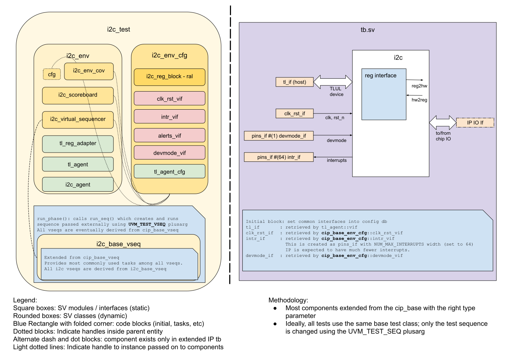

# I2C DV document

## Goals
* **DV**
  * Verify all I2C IP features by running dynamic simulations with a SV/UVM based testbench
  * Develop and run all tests based on the [testplan](#testplan) below towards closing code and functional coverage on the IP and all of its sub-modules
* **FPV**
  * Verify TileLink device protocol compliance with an SVA based testbench

## Current status
* [Design & verification stage](../../../README.md)
  * [HW development stages](../../../../doc/project_governance/development_stages.md)
* [Simulation results](https://reports.opentitan.org/hw/ip/i2c/dv/latest/report.html)

## Design features
For detailed information on I2C design features, please see the
[I2C design specification](../README.md).

## Testbench architecture
I2C testbench has been constructed based on the
[CIP testbench architecture](../../../dv/sv/cip_lib/README.md).

### Block diagram


### Top level testbench
Top level testbench is located at `hw/ip/i2c/dv/tb/tb.sv`. It instantiates the I2C DUT module `hw/ip/i2c/rtl/i2c.sv`.
In addition, it instantiates the following interfaces, connects them to the DUT and sets their handle into `uvm_config_db`:
* [Clock and reset interface](../../../dv/sv/common_ifs/README.md)
* [TileLink host interface](../../../dv/sv/tl_agent/README.md)
* I2C IOs
* Interrupts ([`pins_if`](../../../dv/sv/common_ifs/README.md))

### Common DV utility components
The following utilities provide generic helper tasks and functions to perform activities that are common across the project:
* [common_ifs](../../../dv/sv/common_ifs/README.md)
* [dv_utils_pkg](../../../dv/sv/dv_utils/README.md)
* [csr_utils_pkg](../../../dv/sv/csr_utils/README.md)

### Global types & methods
All common types and methods defined at the package level can be found in [`i2c_env_pkg`](https://github.com/lowRISC/opentitan/blob/master/hw/ip/i2c/dv/env/i2c_env_pkg.sv).
Some of them are imported from [`i2c_reg_pkg`](https://github.com/lowRISC/opentitan/blob/master/hw/ip/i2c/rtl/i2c_reg_pkg.sv).

### TL_agent
I2C instantiates (already handled in CIP base env) [tl_agent](../../../dv/sv/tl_agent/README.md)
which provides the ability to drive and independently monitor random traffic via
TL host interface into I2C device.

### I2C agent
I2C agent is configured to work in device mode and implemented as [reactive agent](https://www.verilab.com/files/mastering_reactive_slaves.pdf).

### UVM RAL Model
The I2C RAL model is created with the [`ralgen`](../../../dv/tools/ralgen/README.md) FuseSoC generator script automatically when the simulation is at the build stage.

It can be created manually by invoking [`regtool`](../../../../util/reggen/doc/setup_and_use.md).

### Stimulus strategy
#### Test sequences
All test sequences reside in `hw/ip/i2c/dv/env/seq_lib`.
The `i2c_base_vseq` virtual sequence is extended from `cip_base_vseq` and serves as a starting point.
All test sequences are extended from `i2c_base_vseq`.
It provides commonly used handles, variables, functions and tasks that the test sequences can simple use / call.
Some of the most commonly used tasks / functions are as follows:
* `i2c_init`: Setup the control register, identifier and clear the FIFOs.
* `wait_{host|target}_for_idle`.

Another test sequence used as a base for other sequences is `i2c_rx_tx_vseq`.
This sequence is useful for tests that want to generate, receive or transmit packets.

#### Functional coverage
To ensure high quality constrained random stimulus, it is necessary to develop a functional coverage model.
Please see the [testplan](../data/i2c_testplan.hjson) for details of the covergroups.

### Self-checking strategy
#### Scoreboard
The `i2c_scoreboard` is primarily used for end to end checking.
It has a TL-UL interface to monitor interactions with the registers.
It also creates the following queues to monitor I2C packets:
* `rd_item_fifo`: for read items.
* `wr_item_fifo`: for write items.

#### Assertions
* TL-UL assertions: The `dv/sva/i2c_bind.sv` binds the `tlul_assert` [assertions](../../tlul/doc/TlulProtocolChecker.md) to the IP to ensure TileLink interface protocol compliance.
* Unknown checks on DUT outputs: The RTL has assertions to ensure all outputs are initialized to known values after coming out of reset.

## Building and running tests
We are using our in-house developed [regression tool](../../../../util/dvsim/README.md) for building and running our tests and regressions.
Please take a look at the link for detailed information on the usage, capabilities, features and known issues.
Here's how to run a smoke test:
```console
$ $REPO_TOP/util/dvsim/dvsim.py $REPO_TOP/hw/ip/i2c/dv/i2c_sim_cfg.hjson -i i2c_host_smoke
```

## Testplan
[Testplan](../data/i2c_testplan.hjson)
