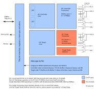
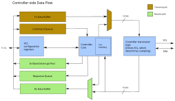
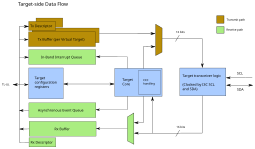
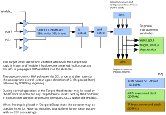

# Theory Of Operation

This IP block implements both Controller and Target functionality for the Improved Inter-Integrated Circuit (I3C) bus.
The I3C bus, specified by the MIPI Alliance, is a successor to the popular I2C bus, offering higher data rates whilst also addressing a number of the well-known deficiencies of the I2C.

It has been designed and built for compliance with the following specifications:

 - [MIPI Alliance Specification for I3C Basic, Version 1.2 Public Release Edition.](https://www.mipi.org/mipi-i3c-basic-download)
 - [MIPI Alliance Specification for I3C TCRI, Version 1.0 (Public Release Edition).](https://www.mipi.org/mipi-i3c-tcri-download)
 - [MIPI Alliance Specification for I3C HCI, Version 1.2 (Public Release Edition).](https://www.mipi.org/mipi-i3c-hci-download)

## Overview

The following diagram presents an overview of the OpenTitan I3C IP block:

In I3C terminology, the Controller is responsible for initiating and managing most of the transfers occurring on the bus, and Targets are typically mostly-passive devices that respond to requests.

Both the Controller and the Target functionality within this IP block support the following bus modes:

 - Single Data Rate (SDR).
   This is broadly similar to the signaling of the I2C bus, including the same start (S), repeated start (Sr) and stop (P) signaling.
   In SDR mode data may be transferred at a theoretical peak bandwidth of 11.1Mbps when operating at 12.5MHz.
 - Double Data Rate (HDR-DDR).
   This mode is new to I3C and employs an entirely different logical protocol whilst also transferring data on both edges of the SCL clock signal.
   HDR-DDR mode also includes error detection using parity and checksums, and offers a theoretical peak bandwidth of 20Mbps when operating at 12.5MHz.

The Controller and Target sides of the IP block are capable of operating independently, either on separate buses or on a shared bus, but they share the TL-UL register interface and in particular the message buffer.

Also shared between the Controller and Target sides of the IP block is a single clock signal, upon which most of the design operates.
The IP block is, however, designed to accommodate a number of different clock frequencies.

In order to achieve low power operation, on frequencies as low as 50MHz, some the Target-side bus-level logic operates directly on the Serial CLock (SCL) and Serial DAta (SDA) lines rather than relying upon an oversampling approach.
This logic performs the conversion between byte- and word-level parallel data and the serial data of the I3C bus itself, whilst the bulk of the Target-side logic operates on the higher frequency IP clock, in order to communicate synchronously with the register interface and the shared message buffer.

## Message buffer

A single internal memory implements a number of logically-separate FIFOs because the data rate into each is substantially lower than the available memory bandwidth; the I3C bus transfers data at less than 25Mbps in HDR-DDR mode with a single data lane, but the internal SRAM is capable of transferring data at 1600Mbps even when operating on a 50MHz IP clock.

Each FIFO is therefore allocated a portion of the single shared memory, and the logic accessing the FIFO employs `valid` and `ready` signals to accommodate the possibility of a slight delay before a read or write operation can occur.
To mitigate the impact of any contention, a single word of read data is prefetched from the FIFO when the FIFO is not empty, thus ensuring that reads - being more performance critical, especially when transmitting over the I3C bus - will normally complete without delay.

## Clocking scheme

To support the inclusion of the I3C block in low power, lower performance products such as mobile devices, the design is capable of operating on lower clock frequencies than most other I3C implementations.
At the time of writing, existing I3C blocks typically rely upon oversampling the received data by a large factor in order to overcome metastability issues on the inputs and still be able to respond promptly; the turnaround time is an important requirement in the I3C protocol, supporting immediate acceptance or rejection of the current data item.

The I3C bus supports signaling at up to 12.5MHz, with HDR-DDR supporting the transfer of data bits on both clock edges.
With this in mind, the I3C IP block expects a clock frequency of 50MHz for most of its internal logic, which naturally lends itself to setup and hold states on each of the two clock edges of a 12.5MHz I3C clock signal ('SCL').

A frequency of 50MHz does not, however, permit a sufficiently prompt response to Controller signaling in the presence of the standard two-stage synchronizer approach to resolving metastability.
For this reason, in addition to concerns over the power consumption of the 'Always On' domain in a sleep state, the Target-side logic operates directly on the Controller-supplied clock signal 'SCL'.
As a result, once a complete data unit (SDR byte or 16-bit HDR-DDR word) has been collected/transmitted from/to the I3C Active Controller, the Target-side logic must transfer it across clock domains to/from the main Target-side logic of the I3C IP block.

The Controller logic within the IP block employs simpler clocking and a synchronous design, with the exception that in order to support some IP clock frequencies and oscillator tolerences, there is an option to extend the SCL high pulse by half an IP clock period.
This is achieved by forming the SCL output signal from a negative-edge triggered flip-flop in combination with the conventional positive-edge triggered logic.

##  Supported clock frequency range

Whilst the design is intended to operate at 50MHz, as described above, in some deployments there may be no suitable 50MHz clock signal, or it may not offer the requisite +/-2.5% accuracy to meet the very strict timing requirements that I3C imposes on the duration of the SCL high interval.

To support such deployments, the Controller-side logic offers default timing parameters - specified in terms of IP clock cycles - that are derived from the IP top-level design parameter `ClkFreq`, allowing the logic to adapt to other frequencies.
Additionally, any subset of these timing parameters may be overridden by software in order to tune the performance or to accommodate oscillator stability/accuracy issues.

See Tables 48, 49 and 50 of the I3C Basic Specification v1.2 for the exact details of the timing requirements, but in outline the duration of the SCL high interval must lie between 24ns and 41ns.
With this in mind, not all IP clock frequencies are suitable, but the design supports a number of different clock frequencies.
The timing parameters and the rest of the IP block design are intended to support clock frequencies within the range 50MHz to 1.5GHz, both inclusive. More information may be found in the [integration notes](integration_notes.md).

## Controller-side logic

The Controller operates entirely on the main clock of the IP block and is a fully synchronous design that, when operating as the Active Controller, drives the SCL line of the I3C bus and is thus in control of all the signal timing.
In generating the SCL clock and driving or sampling SDA, the design cycles through four distinct phases, naturally lending itself to operation on a 50MHz IP clock in order to produce the maximum SCL frequency of 12.5MHz, but the number of IP clock cycles per phase may be varied, according to the configured IP clock frequency and/or software-programmed registers.

The design thus supports a number of different oscillator frequencies and accuracies, with an additional accommodation that the SCL high pulse may optionally support an extension by half of the IP clock period.
This is necessary at certain oscillator frequencies to support less stable oscillators without violating the very strict timing requirements imposed upon the duration of the SCL high interval by the I3C Basic Specification.

## Target-side logic

As noted above, the Target-side transmission and reception logic, including the Target Reset Detector that remains active in sleep states, must operate on the Controller-supplied SCL clock signal, which may be operating at up to 12.5MHz average.
According to the specification it may briefly appear to be 12.9MHz on account of rise/fall times, skew etc.
Since the I3C IP block supports HDR-DDR mode, it includes logic blocks that are triggered on the _negative_ edge of SCL, as well as the conventional _positive_-edge triggered logic.
To this end, the input clock signal is run through an inverting clock buffer as well as a non-inverting clock buffer, to limit skew.

An additional complication, that results from the use of I2C-compatible start (S)/stop (P) signaling in Single Data Rate (SDR) mode, is that the first lane of the I3C data (SDA) must also be used as a clock signal to drive some of the Target-side logic.

## Host Controller Interface

The Controller logic has been built for compliance with the following two MIPI Alliance specifications:

 - I3C Transfer Command Response Interface, Version 1.0 (Public Release Edition).
 - I3C Host Controller Interface, Version 1.2 (Public Release Edition).

The TCRI defines the Command and Response descriptors involved in performing transfers over the I3C bus, including the Common Command Codes defined in the I3C Basic Specification.
The descriptors, constants and behavior are described, but the TCRI does not specify the register-level interface to be presented to driver software.

The register API presented to software is defined in the higher-level Host Controller Interface specification which supports the creation of a portable software driver that may operate with little or no modification on other I3C Controller implementations built to this specification.

A number of the 'Extended Capabilities' defined in the HCI specification are supported by the IP block, as described below.

### Hardware Identification (ID = 0x01) Extended Capability

This extended capability simply presents some additional registers to identify the component manufacturer, product and version.
The values presented in these read only registers are obtained from the IP block top level parameters, so it should be configured appropriately.

### Controller Config (ID = 0x02) Extended Capability

A very simple extended capability that informs the driver software of whether the I3C IP block is able to function as a Controller and/or Target.
The reported value depends upon how the IP block has been configured at its top level.

### Dead Bus Recovery (ID = 0x0B) Extended Capability

In the event of an 'dead' bus, meaning that the Active Controller does not respond to a 'start request' from a Target device, the IP block offers this extended capability, to attempt to recover the bus may be taking over the role of Active Controller.
This mechanism may be employed whether or not the IP block is configured with Secondary Controller support, because a regular Target device is also able to request the attention of the Active Controller by sending an In-Band Interrupt or a Hot-Join request.

### Debug Specific (ID = 0x0C) Extended Capability

Additional information about the current state of the queues and buffers is presented by this extended capability.
The IP block also presents diagnostic information about the current state of the I3C signals SCL and SDA, as well as information about the internal state of the Controller-side logic.

### Target Extension (ID = implementation defined) Extended Capability

A protocol that requires lower-latency responses to Private Read/Write traffic on the I3C bus than can be guaranteed by software, may be implemented as a 'Target Extension' within the IP block itself.
Any specific implementation of the Target Extension extended capability shall identify itself with an appropriate unique Extended Capability ID, add its registers to the register API and identify itself to software via the [`TARG_STATUS` register](registers.md#TARG_STATUS).

## Target Transaction Interface

The I3C Host Controller Specification permits the addition of a 'Target Transaction Interface' that implements Private Read and Write Transfers over the I3C bus.
This is not a standardized interface but rather an opportunity to extend the functionality of the Standby Controller to make it more useful as a Target device.

Documentation on the specific TTI implemented by this IP block may be found in the TTI documentation.
<!-- link to tti.md when available -->

## Virtual Targets

The Target-side peripheral logic is capable of acting as a number of largely-independent targets on the I3C bus.
In the I3C Basic Specification these are called Virtual Targets, and this IP block supports a parameterized number of Virtual Targets.

The default configuration (using the parameter `NumTargets`) permits the implementation of up to two Virtual Targets, the first of which also implements the Standby Controller functionality, but the limit may be altered if required, up to the present maximum of four (`MaxTargets`).

The register map has been specified such that values of `NumTargets` up to `MaxTargets`, inclusive, will not modify the register API or address map.
Increasing `MaxTargets` complicates the task of maintaining software compatibility.

## Group addressing

The IP block supports the configuration of up to 8 different Group Addresses by the I3C Controller, and any subset of the available Virtual Targets may be subscribed to each of these addresses using a bitmap.
Group addresses on the I3C bus support only write traffic and the I3C Controller, under the action of its Driver software, may subscribe or unsubscribe Targets to group addresses at any time.
This is handled automatically in the Target-side logic, with notifications being presented to the Target-side software if required.

## Sleep states, power and wakeup

A Controller that has ceded the role of 'Active Controller' becomes a Standby Controller on the I3C bus.
This is an I3C Target which has the capacity to control the bus, but it may now enter a low power state.
The I3C Basic Specification supports targets entering what it calls a 'Deepest Sleep' state, in which the Target is unresponsive to any directed traffic on the bus.
In this state, the I3C IP block may be powered down or its clock may be stopped.

Note that since I3C is a 'multi-drop' bus it is _not_ sufficient for a Target to respond to a state change at the pins; rather, to awaken a Target from 'Deepest Sleep' the Active Controller sends it a special signaling pattern called a 'Target Reset Pattern'.
For this I3C implementation, that pattern is detected by the `i3c_reset_detector` module, instantiated in a separate power domain and thus outside of the I3C IP block itself.

With the I3C IP block - and much of the System on Chip (SoC) that contains it - in a sleep state, the reset detector logic may continue to monitor the I3C bus for this special pattern, and then instruct another part of the SoC to awaken the SoC from sleep.
Typically this will be a power management block.

In order to minimize the power consumption whilst in this low power state, the reset detector does not require a free-running clock of its own, but is instead driven directly from the SCL and SDA signals of the I3C bus.

## Address blocking

The IP block supports the configuration of two sets of addresses which both the Controller logic and the Target logic will reject as invalid, refusing to initiate communication with any of these addresses.
Instead an error will be raised and the transfer will be aborted.

This allows software to declare any I2C devices present on a Mixed Bus that may try to employ clock-stretching, and provides protection against electrical driver conflict that could potentially damage the hardware.
Clock-stretching by Target devices is not supported by the I3C Basic Specification since the SCL line is driven by the Controller in 'push-pull' mode.

This feature may also be of use diagnostically, by catching and reporting traffic to any devices that were not intentionally addressed.

A set of blocked addresses may be specified by setting the address [mask](registers.md/#blocked_addr--mask0) to a value other than 0x7f, i.e. by leaving one or more bits clear.
This is useful because only I2C devices shall attempt to employ clock-stretching, and I2C devices are commonly configured with one of a small set of static addresses that differ from each other by only one or two address bits.
All instances of a given I2C device may therefore be blocked using a single mask/address pair.

## Memory mapping of the message buffer

Since the 4KiB message buffer is a sizeable amount of memory in an embedded system, the IP block also has the ability to grant direct access to some or all of this memory by mapping it into the address space of the system bus.
This functionality is controlled by a configuration parameter to the design, and may be useful in donating extra SRAM to the system, whether or not the I3C block is transferring traffic.
When the I3C block is not enabled, the entire message buffer may be used safely as RAM.
When it is enabled and may perform transfers to/from the I3C bus, software shall be responsible for ensuring that there is no conflict between the address ranges used by the IP block and those donated to software.

When mapped in this manner for software use, the message buffer supports byte-level granularity of read/write operations.

## Diagnostic and Debugging features

### I3C bus monitoring

Each of the Controller and Target sides of the IP block presents the current state of the SCL and SDA signals within a register for diagnostic use.
This can also be useful in the recovery of a dead or hanged bus.

### Direct drive

In addition to reporting the current state of the SCL and SDA signals, the Controller side of the IP block permits the signals, and their associated driver enables, to be driven directly under software control, disconnecting them from the internal logic.
Direct driving in this fashion may be used to perform a continuity and integrity check of the SCL and SDA signals from the Controller-side to the Target-side of the IP block, but be wary of the potential for causing unpredictable behavior in any other devices that are present.

Direct driving should only be done when the Controller is not enabled, because otherwise the Controller will report errors in response to read/write transfers.

### Traffic capture

<!-- link to tti.md when available -->
As documented in the Target Transaction Interface specification, a Virtual Target may be configured to capture all of the traffic that occurs on the I3C bus.
This can provide useful diagnostic information about bus utilization, any unintended traffic, incorrect addressing etc.
