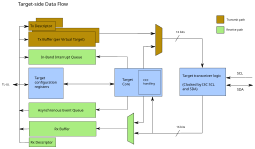

# OpenTitan I3C Target Transaction Interface

## Overview

When a Controller has ceded its role as Active Controller of the I3C bus and is instead operating as a Standby Controller, it is behaving as a Target.
As a Standby Controller it has only minimal responsibilities on the I3C bus - mostly monitoring - but the MIPI Host Controller Interface (HCI) specification makes provision for a 'Target Transaction Interface' (TTI), allowing it also to implement Private Read and Private Write transfers, and to operate as a regular I3C Target device.
The HCI specification does not define how a TTI shall be defined/implemented, i.e., any specific TTI is a proprietary extension.

This document defines the TTI that has been implemented in the OpenTitan I3C IP block.

A single Target peripheral on the I3C may implement multiple 'Virtual Targets' which are presented at different addresses on the I3C bus and operate almost exactly as if they were separate physical Target devices.
This IP block may be configured to implement additional Virtual Targets beyond the single Target required for Standby Controller functionality.

The TTI describes the behavior of all Virtual Targets, with each acting identically and in accordance with this specification.
When Standby Controller support is enabled using [`TARG_CONTROL.STBY_CR_SUPPORT`](registers.md#targ_control--stby_cr_support), the first Virtual Target shall additionally implement the responsibilities of a Standby Controller as defined in the HCI and I3C Basic Specifications.
In this role, configuration from the Standby Controller registers of the HCI override any TTI configuration for the first Virtual Target.

## General approach

Where possible the TTI specification mimics the HCI-specified Controller-side behavior of using data buffers augmented with descriptors that describe the data to be transferred.
This both allows multiple transfers to be queued and, with software assistance to keep the data streaming, supports transfers that exceed the size of the physical FIFOs.

The following diagram presents an overview of the data paths and behavior described below:

## Multiple Virtual Targets

The single physical Target of the OpenTitan I3C block supports a number of Virtual Targets.
For each Virtual Target, the TTI implements a single Transmit Data Buffer and a Transmit Descriptor Queue.
This is necessary to accommodate the Active Controller performing Private Read transfers from multiple Virtual Targets without incurring a performance penalty through retrying, and without assuming the order in which the read operations are performed.

Since all of the transmit buffers and the descriptor queues are implemented within a single physical memory (the 'message buffer'), the cost of having independent logical buffers and queues is minimal.

All Virtual Targets share a single Receive Data Buffer and a single Receive Descriptor Queue because the Active Controller can only perform write transfers to a single Virtual Target at a time, except when writing to a 'Group Address' that has multiple subscribed Virtual Targets.
In this case the Receive Descriptor reports the Group Address, and indicates that the address is that of a group rather than a target.

Whilst the IP block typically supports a maximum of four Virtual Targets (`MaxTargets`), a smaller number of Virtual Targets may be configured if required.
Reducing the configured number of Virtual Targets (`NumTargets`) to be less than the maximum supported number (`MaxTargets`) does not alter the memory map of the IP block, minimizing the impact upon software and aiding driver portability.

Each of the configured Virtual Targets has an independent enable bit in the [`TARG_ENABLE`](registers.md#targ_enable) register.
A Virtual Target that is disabled does not participate on the I3C, i.e., it will ignore address assignment commands and I3C Broadcast CCCs etc.

### Transmission Descriptors

Transmissions from a Virtual Target are described by adding transmission descriptors into a per-Virtual Target queue.
There are two types of transmission descriptor:

 - Description of a Private Read transfer, to be collected by the Active Controller.
 - Pending Read Notification, informing the Active Controller that Private Read data is available.

#### Private Read Transfers

Transmissions from the Target are described by writing a descriptor into the Tx Descriptor Queue, with the format shown below:

| Bits  | Name     | Description                                   |
|-------|----------|-----------------------------------------------|
| 31    | Notify   | This bit shall be set to zero for this format |
| 30    | WROC     | Write Response even On successful Completion  |
| 29:20 | Reserved | SBZ                                           |
| 19:16 | TID      | Transaction ID supplied by software           |
| 15:0  | Length   | Number of bytes to transmit                   |

When transmission notifications via the Asynchronous Event Queue are enabled, a response will always be returned if the transfer is invalid or the transfer is unsuccessful.
A transfer length that exceeds the current 'maximum read length', as established by SETMRL, are rejected by the hardware.
Transfers of zero length will also be rejected because zero length Private Read Transfers are not possible on the I3C bus.

The WROC bit may be set to specify that a response shall also be produced for this transfer if it completes successfully.

Transmission descriptors additionally carry a Transaction ID (TID) which will be mirrored in any response returned via the Asynchronous Event Queue.
The TID is not communicated over the I3C; it is purely a means of connecting an asynchronous event with the transfer that caused it.

Note that in HDR-DDR mode the data is transferred as 16-bit Data Words, so if the transfer length is specified as an odd number of bytes it will be extended by a single zero-valued byte.

#### Pending Read Notifications

A Virtual Target may choose to inform the Active Controller that there is read data available by sending a 'Pending Read Notification' (I3C Basic 4.3.6.2.2) in the same manner as an In-Band Interrupt request.

Pending read notifications are differentiated from regular transmission descriptors by bit 31.
The TTI permits an additional 0-3 data bytes to be specified after the Mandatory Data Byte (MDB) of the notification, as shown below:

| Bits  | Name       | Description                                    |
|-------|------------|------------------------------------------------|
| 31    | Notify     | This bit shall be set to one for this format   |
| 30:26 | LSBs       | The LSBs of the Pending Read Notification MDB  |
| 25:24 | Length     | Count of the number of additional data bytes   |
| 23:0  | Data bytes | Additional data bytes to be sent after the MDB |

### Reception Descriptors

Transfers received from the Active Controller are notified via the Rx Descriptor Queue using a number of reception descriptors.

#### Private Write Transfers

When starting to receive a transfer from the controller, the TTI first supplies a descriptor with the 'Start' bit set and the length will _usually_ be zero.
This initial descriptor allows the driver to direct the received data appropriately.
The received data within the transfer will normally be described by one or more additional descriptors, with the final descriptor having the 'Complete' bit set.

The driver software shall, however, handle a non-zero 'Length' value for this first descriptor, and also the possibility that 'Start' and 'Complete' are both set in a single descriptor.
Received transfers may be zero bytes in length in the event of an error or unusual traffic from the Active Controller.

| Bits  | Name     | Description                                   |
|-------|----------|-----------------------------------------------|
| 31    | Start    | Shall be 1 to denote the start of a transfer  |
| 30    | Complete | Shall be 1 to indicate transfer completion    |
| 29:27 | Status   | Completion status of transfer if 'End' is set |
| 26:23 | Targets  | Bitmap of addressed targets                   |
| 22:16 | Address  | Target/Group address                          |
| 15    | IsGroup  | Indicates whether the transfer is to a group  |
| 14    | Reserved | Reserved for future use                       |
| 13:0  | Length   | Number of bytes in this segment               |

The completion status codes are enumerated below:

| Value | Description                         |
|-------|-------------------------------------|
| 0     | Successful completion               |
| 1     | CRC error detected in received data |
| 2     | Parity error in received data       |
| 3     | Rx buffer overflowed                |
| 4     | Transfer aborted, e.g., HDR Restart |
| 5-7   | Reserved for future use             |

## In-Band Interrupts

The TTI implements a single IBI Data Buffer and a single IBI Status Descriptor Queue, which are shared among all Virtual Targets.
In-Band Interrupts are sent in-order to the Active Controller.
The IBI Status Descriptor serves to delineate In-Band Interrupts within the IBI Data Buffer, as well as permitting the IBI Payload Data to exceed the physical size of the IBI Data Buffer if the software is sufficiently responsive to keep the data streaming.

The IBI Status Descriptor also includes a Transaction ID that is supplied by software and copied into any completion event that may subsequently be posted into the Asynchronous Event Queue.
The transaction ID (TID) thus serves to pair up the request and the response within the software.

### In-Band Interrupt Status Descriptor

An In-Band Interrupt is described by a single-DWORD status descriptor:

| Bits  | Name      | Description                                     |
|-------|-----------|-------------------------------------------------|
| 31    | WROC      | Write Response even On successful Completion    |
| 30:22 | Reserved  | SBZ                                             |
| 21:20 | Target ID | Indicates the source of the IBI                 |
| 19:12 | MDB       | Mandatory Data Byte of the IBI                  |
| 11:8  | TID       | Transaction ID supplied by software             |
| 7:0   | Length    | Number of payload bytes, in addition to the MDB |

The Mandatory Data Byte (MDB) must be provided for all In-Band Interrupts and will always be transmitted to an Active Controller that accepts the IBI request.
The number of bytes of additional IBI payload data may be zero, or it may be up to 255.
It shall always be restricted to less than the current [`IBI_LEN`](registers.md#targ_ibi_len) setting of the Virtual Target that is attempting to transmit the IBI.
The Target-side hardware will reject transfers of greater length and will, if enabled via [`TARG_ASYNC_EVT_CONTROL.IBI_NOTIFY`](registers.md#targ_async_evt_control--ibi_notify), report this by posting into the Asynchronous Event Queue.

As for Private Read Transfers, a successful IBI transmission attempt may also be reported by setting the `WROC` bit within the IBI Status Descriptor.

The IBI Status Descriptor shall be followed by an appropriate number of DWORDs to supply the declared number of bytes, i.e., if the `Length` field specifies 'n', the descriptor shall be followed by '(n + 3) / 4' DWORDs of additional IBI payload data.

## Target-side Interrupts

In a manner that mimics the `PIO_INTR_` registers of the HCI specification, the TTI implements thresholded buffer/queue levels and raises interrupts to the software, indicating available space in transmit buffers/queues, and available data in the reception buffers/queues.
These interrupts may be individually enabled/disabled, and their corresponding thresholds separately configured.

## Errors

Target Errors, as per section 4.3.8 of the I3C Basic specification, are counted and reported to software via the [`TARG_ERROR`](registers.md#targ_error) register.
The occurrence of one or more Target Errors may also be configured to raise an interrupt to software.
This mechanism also counts any Dead Bus Recovery attempts and optionally indicates these to software via the same interrupt.

## Asynchronous Event Queue

In order to keep software informed of any adverse events occurring on the I3C bus or any transfers that are rejected internally by the Target-side hardware, this TTI also specifies the inclusion of an Asynchronous Event Queue.
A single queue is shared among all Virtual Targets, and where an event is target- or group-specific, its address is included in the event type-specific portion of the descriptor.

| Bits  | Name     | Description                     |
|-------|----------|---------------------------------|
| 31:28 | Event    | Indicates the type of event     |
| 27:0  | Info     | Event type-specific information |

The Asynchronous Event Queue may also be used to provide notifications of CCC activity, successful transmissions (Private Read Transfers and In-Band Interrupts), unsuccessful transmission attempts, and significant events occurring on the I3C bus.

The set of asynchronous events to be reported is specified using the register [`TARG_ASYNC_EVT_CONTROL`](registers.md#targ_async_evt_control).

### Asynchronous Event Types

| Type |  Description                                           |
|------|--------------------------------------------------------|
|    0 | Notifications of Common Command Code activity          |
|    1 | Outcome of a transmission attempt                      |
|    2 | Outcome of an attempted In-Band Interrupt transmission |
|    3 | Transmission suspended for Virtual Target(s)           |
|    4 | Transmission suspended for In-Band Interrupts          |
|    5 | Notification of events occurring on the I3C bus        |

Other event types (6 to 15) are not generated by the current hardware and are reserved for future use.
Events having a type in the range 6 to 11 shall be treated as single DWORD descriptors that may be removed from the queue and ignored.
Event types 12-15 shall populate the LSB of the DWORD descriptor with a byte count as illustrated below, allowing the first descriptor DWORD and any trailing data to be removed and ignored:

| Bits  | Name     | Description                 |
|-------|----------|-----------------------------|
| 31:28 | Code     | Event types 12-15; reserved |
| 27:8  | Reserved | Should be ignored           |
| 7:0   | Length   | Data length, in bytes       |

### Type 0 - Notification of CCC activity

| Bits  | Name        | Description                          |
|-------|-------------|--------------------------------------|
| 31:28 | Code        | Event type 0 for this format         |
| 27:20 | CCC         | I3C Common Command Code              |
| 19    | Reserved    | SBZ                                  |
| 18    | Has DEFB    | Indicates if CCC has a DEFining Byte |
| 17    | Has Data    | Indicates if CCC has associated data |
| 16    | Has Length  | Has Length rather than a single byte |
| 15:8  | DEFB        | Defining Byte, iff Has DEFB set      |
| 7:0   | Data/Length | Single data byte, or data length     |

The I3C bus requires that Target-side logic be capable of responding very promptly to the Common Command Codes.
This requirement for very low latency responses means that it must be done autonomously in hardware, so the Target side typically responds to both GET and SET CCCs without software involvement.

For Direct GET CCCs which just read configuration or status information from a Virtual Target, this is not a problem.
For SET CCCs that modify the current configuration settings, however, it may be necessary for software to be informed of such changes.
To this end, the Target-side logic is able to report any CCC handling in which one or more Virtual Targets have engaged, along with the outcome of the CCC operation.

The set of CCCs to be reported may be filtered using the `DIR_GET_CCC`, `DIR_SET_CCC` and `BCST_CCC` fields of the [`TARG_ASYNC_EVT_CONTROL` register](registers.md#targ_async_evt_control).

### Type 1 - Outcome of a transmission attempt

| Bits  | Name           | Description                        |
|-------|----------------|------------------------------------|
| 31:28 | Code           | Event type 1 for this format       |
| 27:24 | Error Status   | I3C TCRI Error code or success (0) |
| 23:22 | Reserved       | SBZ                                |
| 21:20 | Target ID      | Identifies the Virtual Target      |
| 19:16 | Transaction ID | Transaction ID from Tx Descriptor  |
| 15:0  | Data left      | Number of bytes not transmitted    |

Attempted transmissions from a Virtual Target, in the form of Private Reads issued by the Active Controller, may result in a notification via the Asynchronous Event Queue in the event that the transmission attempt was unsuccessful.

The transmission descriptor for the transfer may also specify that a notification is required even in the event of the transfer being successful.

This allows the software to keep track of the success or failure of Private Read transfers, and to recover from any transmission errors before re-enabling transmission from that Virtual Target.

### Type 2 - Outcome of an attempted In-Band Interrupt transmission

| Bits  | Name           | Description                        |
|-------|----------------|------------------------------------|
| 31:28 | Code           | Event type 2 for this format       |
| 27:24 | Error Status   | I3C TCRI Error code or success (0) |
| 23:22 | Reserved       | SBZ                                |
| 21:20 | Target ID      | Identifies the Virtual Target      |
| 19:16 | Transaction ID | Transaction ID from Tx Descriptor  |
| 15:0  | Data left      | Number of bytes not transmitted    |

Similar to the reporting of regular transmission attempts, as described above, it is possible to report the success or failure of attempted In-Band Interrupts from any of the Virtual Targets.

### Type 3 - Transmission suspended for Virtual Target(s)

| Bits  | Name     | Description                                             |
|-------|----------|---------------------------------------------------------|
| 31:28 | Code     | Event type 3 for this format                            |
| 27:24 | Targets  | The target(s) for which transmission has been suspended |
| 23:0  | Reserved | SBZ                                                     |

In the event of a transmission failure, or an abort request from the software, transmission from a Virtual Target may be suspended.
This change is reflected in the `SUSPENDED` bits of the [`TARG_PIO_CONTROL`](registers.md#targ_pio_control--suspended) register, but it may also be reported via the Asynchronous Event Queue to ensure that software is notified by the assertion of an interrupt.

### Type 4 - Transmission suspended for In-Band Interrupts

| Bits  | Name     | Description                  |
|-------|----------|------------------------------|
| 31:28 | Code     | Event type 4 for this format |
| 27:0  | Reserved | SBZ                          |

In the same manner that suspension of Private Read transfers from Virtual Targets may be reported via the Asynchronous Event Queue - described above - this event provides notification that In-Band Interrupt transmission has been suspended.

### Type 5 - Notification of events occurring on the I3C bus

| Bits  | Name     | Description                       |
|-------|----------|-----------------------------------|
| 31:28 | Code     | Event type 5 for this format      |
| 27:16 | Events   | Bitfield of observed bus event(s) |
| 15:0  | Reserved | SBZ                               |

The bus events that may be reported are listed below:

| Bits  | Name        | Description                                       |
|-------|-------------|---------------------------------------------------|
| 27:24 | Reserved    | Ignore; currently unused.                         |
| 23    | UnknownDEFB | CCC was received with unknown DEFining Byte.      |
| 22    | UnknownCCC  | Unknown CCC was received                          |
| 21    | ChksumCCC   | Checksum error occurred during CCC (HDR-DDR)      |
| 20    | ParityCCC   | Parity error occurred during CCC (SDR, HDR-DDR)   |
| 19    | TargetRst   | Target Reset pattern was received                 |
| 18    | Idle        | Bus Idle condition (> 200us with no activity)     |
| 17    | DeadBus     | No response to Start Request on an idle bus       |
| 16    | ReadNoSCL   | No change in SCL for > 150us during Read Transfer |

## Target Characteristics

The TTI maintains separate device characteristics for each Virtual Target, for generality.
Each Virtual Target shall be programmed with its own Device Characteristics Register (DCR), Bus Characteristics Register (BCR), and Provisioned ID (PID).

It is the responsibility of software to ensure that collisions do not occur; the hardware reports the DCR, BCR and PID unmodified, and the driver software is responsible for ensuring that one or more of these fields differ amongst the configured Virtual Targets.

## Group Addressing

There is provision within the I3C Basic Specification for multicasting Write Transfers by addressing a Group rather than a specific I3C Target.
An arbitrary set of Targets may be subscribed to a particular Group Address and any write traffic shall then be received by all subscribed Targets.
This IP block supports up to 8 independent group addresses, and any subset of the available Virtual Targets may be subscribed to each of the Group addresses.
Group addresses support only Write Transfers; Reads are not permitted.

When traffic is addressed to a group that has multiple subscribed Virtual Targets, only a single copy of the data is received, and the Rx Descriptor indicates the address of the group, along with the set of targets subscribed to the group _at that time_.
The latter information is included to guard against the group membership changing after the transfer is received but before the software addresses the notification.
It is the responsibility of the software to ensure that all of the Virtual Targets are notified appropriately.

## Bus Monitoring

As a diagnostic aid, the Target peripheral logic may be instructed to capture all I3C traffic on the bus, irrespective of the intended addressee.
This can provide valuable information about the bus utilization or any unintentional, perhaps misaddressed, transfers.

To activate this bus monitoring feature, simply program one of the group address descriptions, [`TARG_GROUP`](registers.md#targ_group), with a group address of zero and a non-zero set of subscribed targets.

When operating in this mode, the target is entirely passive and will not acknowledge the transfer or attempt to transmit any data, but the traffic will be captured and presented exactly as for Private Write Transfers to valid group addresses.
There is only a negligible increase to the logic area in providing this useful diagnostic functionality.

## Queue Thresholds

To support the transmission and reception of transfers that are longer than the allocated queues, the TTI supports the use of programmable thresholds in the generation of interrupts.
There are thresholds for the Transmission Descriptor queues and for the Data Buffers (see [`TARG_TX_THLD_CTRL`](registers.md#targ_tx_thld_ctrl)).
A third threshold specifies the minimum amount of data that must be present in the data buffer before it is made available on the I3C bus for collection by the Active Controller.
This provides the software driver with some time to prepare the next data to be transmitted as part of the described transfer.

The three thresholds are modeled on those defined by the HCI specification for the Controller-side logic, with a couple of small modifications:

- There are independent thresholds for the transmission of data from each of the Virtual Targets, allowing each to be configured appropriately for its specific transfer lengths, traffic patterns, and buffer sizes.
- The Tx Data Buffer thresholds are specified with DWORD-level granularity, rather than being restricted to powers-of-two; this provides the driver software with greater control over latency and data rates, to aid with data streaming.

## Queue/Buffer Levels

The current state of the TTI queues and buffers is presented to software at all times.
For the transmission buffers, the amount of space available in the queue/buffer is reported, and for the reception buffers the TTI reports the amount of data currently present.

## Retrying of IBI Transmission

<!-- link to the appropriate register field(s) when available.-->
The Target logic may be configured to retry IBI transmission a number of times before reporting a transmission failure.
For each attempt, the address associated with the IBI will be arbitrated onto the bus, following the issue of a Start Request to the Active Controller, if necessary.
If arbitration is won but the request is not accepted by the Controller, i.e., it receives a NACK response, that constitutes one failed attempt.
Losing arbitration is not treated as a failed attempt and the Target logic will continue with that attempt until it is accepted, NACKed or a `DISEC` Common Command Code is received from the Controller.
Receipt of `DISEC` disables IBI transmission and rejects the pending IBI immediately as if all attempts had failed.

## Retrying of Private Read Transfers

Retrying of Private Read Transfers is not possible, because it is the Active Controller that initiates the transfer.
However, if transmission from the addressed Virtual Target is being deferred on account of the buffer start threshold, i.e., the amount of data present in the transmission buffer is still too low, the Target logic will respond to the Private Read attempt with a NACK response, just as it does if there is no descriptor/data ready for transmission.

## Suspending/Aborting Transmission

Software can abort transmission from individual Virtual Targets by setting the corresponding ['Abort' bit(s)](registers.md#targ_pio_control--abort).
This will cause the ['Suspended' bit(s)](registers.md#targ_pio_control--suspended) to become set after transmission has become idle, and no further transmission shall occur until software writes a '1' to the 'Suspended' bit to clear the condition.

Hardware may also set the 'Suspended' bit in the event of a transmission failure that cannot be corrected by retrying.
When software clears the 'Suspended' bit the hardware responds by clearing the 'Abort' bit and once again accepting any queued data for transmission.

Transmission of In-Band Interrupts may similarly be aborted, suspended and resumed using the [`IBI_ABORT`](registers.md#targ_pio_control--ibi_abort) and [`IBI_SUSPENDED`](registers.md#targ_pio_control--ibi_suspended) fields of the same register.
These behave in the same manner as the transmission of Private Reads from the Virtual Targets.

## Discarding Transmission Data

Whilst transmission is suspended for a Virtual Target, or for In-Band Interrupts, the transmission data buffer and associated descriptor queue may be cleared using the appropriate bit in `TARG_PIO_CONTROL`.
<!-- link to the register fields when available-->
There is one such control bit, `TXBUF_CLEAR`, for each Virtual Target; `IBIBUF_CLEAR` provides the same functionality for the IBI transmission path.

In addition to this buffer clearing operation, which discards all data, there is a 'Data Sink' mechanism that software may use to extract a programmable number of DWORDs from a selected transmission data buffer or descriptor queue.
This mechanism will rapidly read and discard data, allowing the remainder of a partial transfer to be discarded without impacting subsequent transfers.
It may also be used to discard transfers that have already been queued for transmission.

## Hot-Join Feature

When the Target logic connects to an idle I3C bus it may need to request the attention of the Active Controller, to announce its presence.
This capability is referred to as 'Hot-Join' and involves the Target attempting to communicate with the Active Controller using address 7'h02.

It comes in two forms:

1. Passive Hot-Join, in which the Target drives 7'h02 into an Arbitrable Address Header.
2. Active Hot-Join, in which the Target issues a Start Request, and then proceeds to drive out the address 7'h02.

When the first Virtual Target is configured to operate as a Standby Controller, the Hot-Join capability is available via the HCI-specified [Standby Controller Control register](registers.md#stby_cr_control--stby_cr_enable_init).

In the event that Standby Controller support is not enabled, or the Target peripheral is operating on a bus of its own, an equivalent capability is available via the [`TARG_CONTROL`](registers.md#targ_control--hj_request) register.

## Handling of Common Command Codes

The following subsections describe the behavior of the Virtual Targets with respect to some of the Common Command Codes (CCCs) of the I3C Basic Specification.

### Address Assignment

Each of the Virtual Targets supports all of the specified methods of assigning dynamic addresses:

- ENTDAA (4.3.7.3.4) - Virtual Targets arbitrate for allocation of a dynamic address supplied by the Controller.
- SETDASA (4.3.7.3.10) - Sets the dynamic address to be the same as the static address of the Virtual Target.
- SETAASA (4.3.7.3.21) - As `SETDASA` but this CCC is broadcast to all supporting Virtual Targets.

### Maximum Read/Write Length

The TTI maintains a record of the maximum read and write lengths that are currently in effect.
These may initially be set up by software, and subsequently modified by the Active Controller.
The Controller is also free to query them at any time using GETMRL and GETMWL.

The Target hardware maintains the maximum write length (SETMWL) and informs software via the Asynchronous Event Queue of any updates.
Changing the maximum write length does not otherwise impact the behavior of the Target hardware.
The Controller is expected to honor the current MWL and not issue write transfers of greater length.

The Target-side logic also maintains a record of maximum read length (SETMRL) and will reject with an error any transfer that is placed into the Transmission Descriptor Queue with a length in excess of the maximum read length currently in effect.
Software will be informed of the rejected transfer and may recover accordingly.

When a transfer is rejected in this manner, transmission from that Virtual Target is suspended and, if queried for data by the Active Controller, the Target logic will respond with a NACK on the I3C bus.

### Other CCCs

TODO(#31337): ENTAS, ENDXFER and CAPS in particular may warrant detailed descriptions here, once the feature set and priorities have stabilized.

## Target Support for HDR-DDR Signaling

The I3C Basic Specification offers increased data rates and improved error detection through the use of a new signaling mode called HDR-DDR.
Both the Controller side and the Target side of this IP block offer support for HDR-DDR signaling, although it is not widely supported among existing I3C devices at this time.

<!-- link to `./registers.md#targ_control--en_hdr_ddr` when the register field is available.-->
As a contingency in the event of compatibility issues, the Target side of this IP may be instructed not to declare support for HDR-DDR mode by clearing the `TARG_CONTROL.EN_HDR_DDR` bit.
This bit should normally be left set, i.e., declaring HDR-DDR support, and it is then the decision of the Active Controller whether to employ HDR-DDR signaling.

On the Controller side of this IP block, the software driver is responsible for determining the signaling mode employed for all I3C transfers, and it is therefore able to avoid the use of HDR-DDR signaling to Target devices, should that prove necessary.

## Target Reset Detector

To comply with the I3C Specification, the Target logic supports a number of 'reset actions' which may be performed in response to the special Target Reset pattern being issued by the Active Controller:

 - Reset the I3C Basic Peripheral Only (Default response).
 - Reset the Whole Target.
 - Wake from 'Deepest Sleep' state.
 - No Reset or other action.

Detection of the Target Reset pattern is performed by a small amount of logic that is external to the main IP block because it is expected to reside within a different power domain.

This 'Target Reset' detector may be activated and deactivated by the Target under software control.
The action to be taken upon detection of the Target Reset pattern may be reconfigured by the Active Controller at any time, by issuing the `RSTACT` Common Command Code.
Using this CCC, the Active Controller may select a particular subset of the Targets to be reset, either at the level of the I3C Peripheral logic or the entire chip.

In order to guard against accidental or inappropriate resets of the entire chip, or even the I3C Peripheral logic, software is provided with overrides to enable/disable these actions that would otherwise be automatic.
It is anticipated that the power manager or reset manager IP to which the I3C Target Reset Detector is connected shall also include the ability to action or ignore the requests issued by the detector logic.

## Diagnostic/Debug Information

To aid with the diagnosis and/or debugging of any issues on the Target-side I3C bus, the [`TARG_STATE_DEBUG`](registers.md#targ_state_debug) register reports at all times the current state of the SCL and SDA inputs to the Target logic, indicating the state of the bus.
Note that, since the I3C bus is expected to be operating at a significant fraction of the sampling frequency that the software may achieve, transitions on the bus may be missed, and this state information is really only an indication of the bus state over longer time frames.

This register also provides instantaneous observations of the Bus Available condition, Bus Idle condition, and the current bus mode, as well as the current states of the two key internal state machines (the Core FSM and the Target transceiver).
