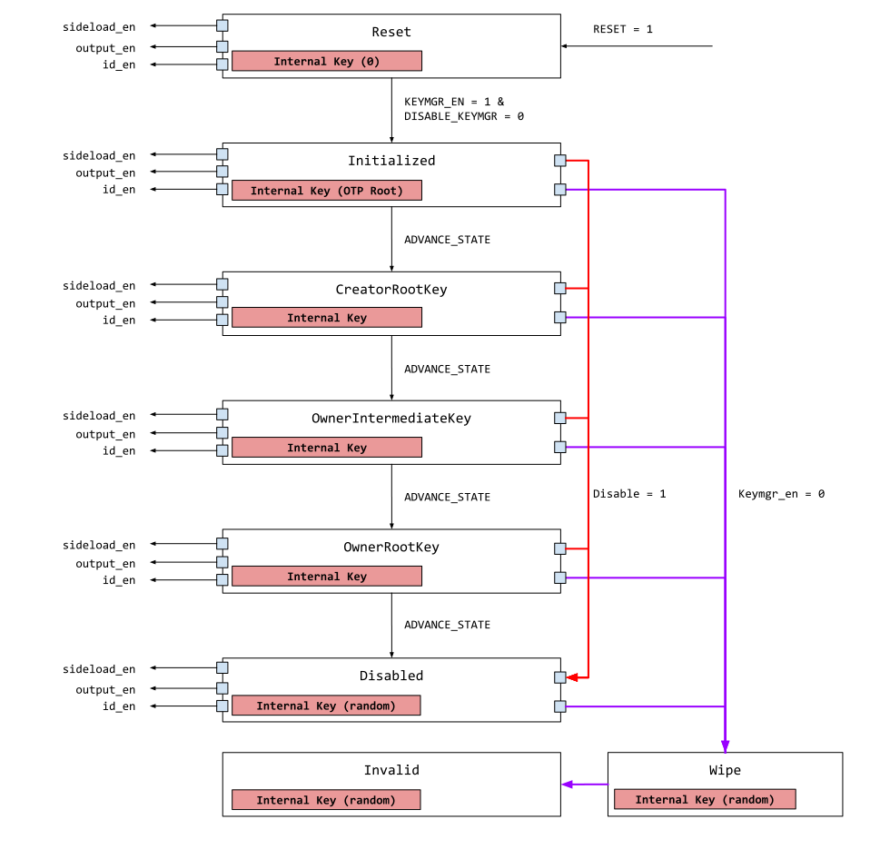

# Overview

This document specifies the functionality of the OpenTitan key manager.

## Features

- One-way key and identity (working) state hidden from software.
- Version controlled identity and key generation.
- Key generation for both software consumption and hardware sideload.

## Description

The key manager implements the hardware component of the [identities and root keys](https://github.com/lowRISC/opentitan/pull/3136) strategy of OpenTitan.

It enables the system to shield critical assets from software directly and provides a simple model for software to use derived key and identity outputs.

# Theory of Operation

Key manager behavior can be summarized by the functional model below.

In the diagram, the red boxes represent the working state and the associated secret value, the black ovals represent derivation functions, the green squares represent software inputs, and the remaining green / purple shapes represent outputs to both software and hardware.

In OpenTitan, the derivation method selected is [KMAC]().
Each valid operation involves a KMAC invocation using the key manager working state as the "key" and other HW / SW supplied inputs as data.
While KMAC can generate outputs of arbitrary length, this design fixes the size to 256b.

Effectively, the key manager behavior is divided into 3 classes of functions
*  Key manager state advancement
   *  The results are never visible to software and not directly usable by any software controlled hardware

*  Output key generation
   *  Results can be visible to software or consumed by hardware (sideload)

*  Identity / seed generation
   *  Results are always visible to software and used for asymmetric cryptography

In general, the key generation and seed generation functions are identical.
They differ only in how software chooses to deploy the outputs.

## Key Manager State

The key manager working state (red boxes in the functional model) represents both the current state of the key manager as well as its related secret material.
Each state, when valid, supplies its secret material as the "key" input to a KMAC operation.
The data input is dependent on each state, see below.

### Reset

The key manager working state is not directly reset to any value.
This ensures there is no deterministic hamming delta upon reset.
Instead at reset time, the state value is simply unknown - which is expected to be some biased value the registers settle to based on silicon corner and environment conditions.

To begin operation, the state must first transition to Initialize.
The advancement from `Reset` to `Initialized` is irreversible during the current power cycle.
Until the initialize command is invoked, the key manager rejects all other software commands.

### Initialized

When transitioning from `Reset` to `Initialized`, random values obtained from the entropy source are used to populate the working state.
This ensures that the hamming delta from both the previous value and the next value are both non-deterministic.
The advancement from `Initialized` to `CreatorRootKey` is irreversible during the current power cycle.

### CreatorRootKey

`CreatorRootKey` is the first operational state of the key manager.
When transitioning from `Initialized` to this state, a KMAC operation is invoked using the `RootKey` as the key (from OTP), and the remaining inputs as data.

See below:
*  `DiversificationKey`: Secret seed from flash
*  `HealthMeasurement`: Current life cycle state
   *  To avoid a state value corresponding to each life cycle state, the raw life cycle value is not used.
   *  Instead, certain life cycle states diversify the same way.
   *  Please see the life cycle controller for more details.
*  `DeviceIdentifier`: Unique device identification.
*  `HardwareRevisionSecret`: A global design time constant.
*  `RomExtSecurityDescriptor`: A software digest of the ROM_ext stage.

Other than the `DiversificationKey`, none of the values above are considered secret.
The `RomExtSecurityDescriptor` is a 256b value calculated by ROM and loaded into key manager registers.

Once the `CreatorRootKey` is reached, software can request key manager to advance state, generate output key or generate output identity.
The key used for all 3 functions is the `CreatorRootKey`.

The advancement from this state to the next is irreversible during the current power cycle.

### OwnerIntermediateKey

This is the second operational state of the key manager.
This state is reached through another invocation of the KMAC operation using the previous working state as the key, and other inputs as data.
The output of the KMAC operation replaces the previous value of the working state, and the new value becomes the `OwnerIntermediateKey`.

The relevant data inputs are:
*  `OwnerRootSecret`: Secret seed from flash.
*  `SoftwareBinding`: A software programmed value representing the first owner code to be run.

Once the `OwnerIntermediateKey` is created, software can request key manager to advance state, generate output key or generate output identity.
The key used for all 3 functions is the `OwnerIntermediateKey`.

The advancement from this state to the next is irreversible during the current power cycle.

### OwnerRootKey

This is the last operational state of the key manager.
This state is reached through another invocation of the KMAC operation using the previous working state as the key, and other inputs as data.
The output of the KMAC operation replaces the previous value of the working state, and the new value becomes the `OwnerRootKey`.

The relevant inputs are:
*   `SoftwareBinding` - A software programmed value representing the owner kernel code.

Once the `OwnerRootKey` is created, software can request key manager to advance state, generate output key or generate output identity.
An advance command invoked from `OwnerRootKey` state simply moves the state to `Disabled`.

The generate output and generate identity functions use `OwnerRootKey` as the KMAC key.
The advancement from this state to the next is irreversible during the current power cycle.

### Disabled

`Disabled` is a terminal state where the key manager is no longer operational.
When entering Disabled random values are used to compute a new random value.

## Life Cycle Connection
The function of the key manager is directly tied to the life cycle controller.
During specific life cycle states, the key manager is explicitly disabled.

When disabled, key manager will not advance or generate and if currently in an operational state, will automatically transition to `Disabled`.

## Commands in Each State
During each state, there are 3 valid commands software can issue:
*  Advance state
*  Output generation
*  Identity generation

The software is able to select a command and trigger the key manager FSM to process one of the commands.
If a command is valid during the current working state, it is processed and acknowledged when complete.
If a command is invalid, the key manager FSM processes with random, dummy data, but does not update working state or relevant output registers.

For each valid command, a set of inputs are selected and sequenced to the KMAC module.

## Generating Output Key
The generate output command is composed of 2 options
*  Generate output key for software, referred to as `generate-output-sw`
*  Generate output key for hardware, referred to as `generate-output-hw`

The hardware option is meant specifically for symmetric side load use cases.
When this option is issued, the output of the KMAC invocation is not stored in software visible registers, but instead in hardware registers that directly output to symmetric primitives such as AES, HMAC and KMAC.

## KMAC Operations
All invoked KMAC operations expect the key in two shares.
This means the working states, even though functionally 256b, are maintained as 512b.

For advance-state and `generate-output` commands, the KMAC emitted output are also in 2-shares.
Software is responsible for determining if the key should be preserved in shares or combined, depending on the use case.

## Block Diagram
The following is a high level block diagram of the key manager.

## Design Details

Key manager is primarily composed of two components:
*  keymgr_ctrl
*  keymgr_kmac_if

### Key Manager Control

The key manager control block manages the working state, sideload key updates, as well as what commands are valid in each state.
It also handles the life cycle keymgr_en input, which helps disable the entire key manager function in the event of an escalation.

### KMAC Interface Control

The KMAC interface control represents the bulk of key manager logic.
Based on input from key manager control, this module selects the inputs for each given command and sequences the data to KMAC.

## Hardware Interfaces


# Programmers Guide

## Initialize

## Advance or Generate
Software selects a command and triggers a "start".
If the command is valid and successful, key manager indicates done and no errors.
If the command is invalid or unsuccessful, key manager indicates done with error.
Regardless of the validity of the command, the hardware sequences are triggered to avoid leaking timing information.

The software is able to read the current state of key manager, however it never has access to the associated secret value

When issuing the `generate-output-hw` command, software must select a destination primitive (aes, hmac or kmac).
At the conclusion of the command, key and valid signals are forwarded by the key manager to the selected destination primitive.
The key and valid signals remain asserted to the selected destination until software explicitly disables the output via another command, or issues another `generate-output-hw` command with a different destination primitive.

More details to come.

## Register Table


