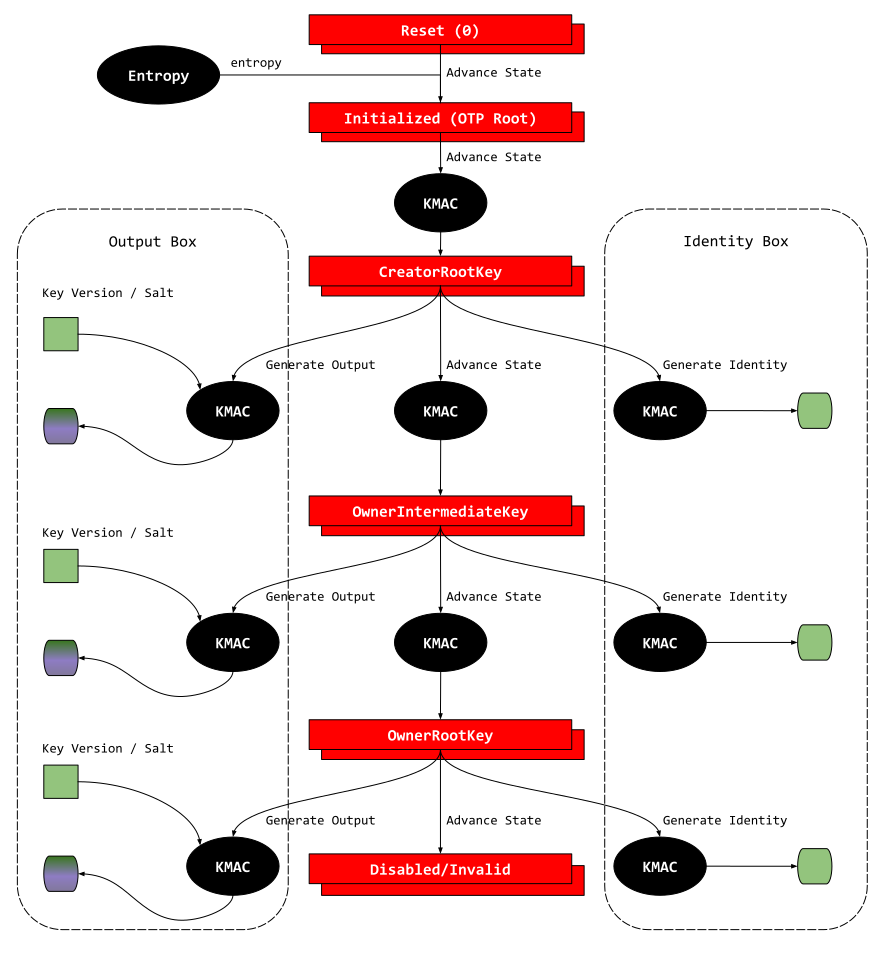

# Overview

This document specifies the functionality of the OpenTitan key manager.

## Features

- One-way key and identity (working) state hidden from software.
- Version controlled identity and key generation.
- Key generation for both software consumption and hardware sideload.

## Description

The key manager implements the hardware component of the [identities and root keys](https://docs.opentitan.org/doc/security/specs/identities_and_root_keys/) strategy of OpenTitan.

It enables the system to shield critical assets from software directly and provides a simple model for software to use derived key and identity outputs.

# Theory of Operation

Key manager behavior can be summarized by the functional model below.

In the diagram, the red boxes represent the working state and the associated internal key, the black ovals represent derivation functions, the green squares represent software inputs, and the remaining green / purple shapes represent outputs to both software and hardware.

In OpenTitan, the derivation method selected is [KMAC]().
Each valid operation involves a KMAC invocation using the key manager working state as the "key" and other HW / SW supplied inputs as data.
While KMAC can generate outputs of arbitrary length, this design fixes the size to 256b.

Effectively, the key manager behavior is divided into 3 classes of functions
*  Key manager state advancement
   *  The results are never visible to software and not directly usable by any software controlled hardware

*  Output key generation
   *  Results can be visible to software or consumed by hardware (sideload)

*  Identity / seed generation
   *  Results are always visible to software and used for asymmetric cryptography

In general, the key generation and seed generation functions are identical.
They differ only in how software chooses to deploy the outputs.

## Key Manager State

The key manager working state (red boxes in the functional model) represents both the current state of the key manager as well as its related secret material.
Each valid state (`Initialized` / `CreatorRootKey` / `OwnerIntermediateKey` / `OwnerRootKey`), supplies its secret material as the "key" input to a KMAC operation.
Invalid states, such as `Reset / Disabled` on the other hand, either do not honor operation requests, or supplies random data when invoked.

The data input is dependent on each state, see below.

### Reset

The key manager working state is not directly reset to any value.
This ensures there is no deterministic hamming delta upon reset.
Instead at reset time, the state value is simply unknown - which is expected to be some biased value the registers settle to based on silicon corner and environment conditions.

To begin operation, the state must first transition to Initialize.
The advancement from `Reset` to `Initialized` is irreversible during the current power cycle.
Until the initialize command is invoked, the key manager rejects all other software commands.

### Initialized

When transitioning from `Reset` to `Initialized`, random values obtained from the entropy source are used to populate the working state.
This ensures that the hamming delta from both the previous value and the next value are both non-deterministic.
The advancement from `Initialized` to `CreatorRootKey` is irreversible during the current power cycle.

### CreatorRootKey

`CreatorRootKey` is the first operational state of the key manager.
When transitioning from `Initialized` to this state, a KMAC operation is invoked using the `RootKey` as the key (from OTP), and the remaining inputs as data.

See below:
*  `DiversificationKey`: Secret seed from flash
*  `HealthMeasurement`: Current life cycle state
   *  To avoid a state value corresponding to each life cycle state, the raw life cycle value is not used.
   *  Instead, certain life cycle states diversify the same way.
   *  Please see the life cycle controller for more details.
*  `DeviceIdentifier`: Unique device identification.
*  `HardwareRevisionSecret`: A global design time constant.

Other than the `DiversificationKey`, none of the values above are considered secret.

Once the `CreatorRootKey` is reached, software can request key manager to advance state, generate output key or generate output identity.
The key used for all 3 functions is the `CreatorRootKey`.

The advancement from this state to the next is irreversible during the current power cycle.

### OwnerIntermediateKey

This is the second operational state of the key manager.
This state is reached through another invocation of the KMAC operation using the previous working state as the key, and other inputs as data.
The output of the KMAC operation replaces the previous value of the working state, and the new value becomes the `OwnerIntermediateKey`.

The relevant data inputs are:
*  `OwnerRootSecret`: Secret seed from flash.
*  `SoftwareBinding`: A software programmed value representing the first owner code to be run.

Once the `OwnerIntermediateKey` is created, software can request key manager to advance state, generate output key or generate output identity.
The key used for all 3 functions is the `OwnerIntermediateKey`.

The advancement from this state to the next is irreversible during the current power cycle.

### OwnerRootKey

This is the last operational state of the key manager.
This state is reached through another invocation of the KMAC operation using the previous working state as the key, and other inputs as data.
The output of the KMAC operation replaces the previous value of the working state, and the new value becomes the `OwnerRootKey`.

The relevant inputs are:
*   `SoftwareBinding` - A software programmed value representing the owner kernel code.

Once the `OwnerRootKey` is created, software can request key manager to advance state, generate output key or generate output identity.
An advance command invoked from `OwnerRootKey` state simply moves the state to `Disabled`.

The generate output and generate identity functions use `OwnerRootKey` as the KMAC key.
The advancement from this state to the next is irreversible during the current power cycle.

### Disabled
`Disabled` is a state where the key manager is no longer operational.
Upon `Disabled` entry, the working state is updated with KMAC computed random values; however, sideload keys are preserved.
This allows the software to keep the last valid sideload keys while preventing the system from further advancing the valid key.

When advance and generate calls are invoked from this state, the outputs and keys are indiscriminately updated with randomly computed values.

### Invalid
`Invalid` state is entered whenever key manager is disabled through the [life cycle connection](#life-cycle-connection).
Upon `Invalid` entry, both the working state and the sideload keys are wiped with entropy directly.
Note, this is different from `Disabled` state entry, which updates with KMAC outputs.

## Life Cycle Connection
The function of the key manager is directly tied to the life cycle controller.
During specific life cycle states, the key manager is explicitly invalidated.

When invalidated, the following key manager behavior applies:
-  If the key manager has not been initialized, it cannot be initialized until life cycle enables key manager.
-  If the key manager has been initialized and is currently in a valid state (including `Disabled`), it immediately wipes its key contents with entropy (working state, sideload keys and software keys) and transitions to `Invalid`.
   -  Note, unlike a normal software requested disable, this path does not gracefully interact with KMAC, instead the secret contents are forcibly wiped.
   -  If there is an ongoing transaction with KMAC, the handshake with KMAC is still completed as usual, however the results are discarded and the value sent to KMAC are also not real.
-  Once the system settles to `Invalid` state, the behavior is consistent with `Disabled` state.

## Commands in Each State
During each state, there are 3 valid commands software can issue:
*  Advance state
*  Output generation
*  Identity generation

The software is able to select a command and trigger the key manager FSM to process one of the commands.
If a command is valid during the current working state, it is processed and acknowledged when complete.

If a command is invalid, the behavior depends on the current state.
If the current state is `Reset`, the invalid command is immediately rejected as the key manager FSM has not yet been initialized.
If the current state is any other state, the key manager FSM processes with random, dummy data, but does not update working state or relevant output registers.
For each valid command, a set of inputs are selected and sequenced to the KMAC module.

During `Disable` and `Invalid` states, working state and output registers are updated based on the input commands as with normal states.
There are however a few differences:
-  Working state and output registers are updated regardless of any error status to ensure their values are further scrambled.
-  Instead of normal input data, random data is selected for KMAC processing.
-  All operations return an invalid operations error, in addition to any other error that might naturally occur.

## Generating Output Key
The generate output command is composed of 2 options
*  Generate output key for software, referred to as `generate-output-sw`
*  Generate output key for hardware, referred to as `generate-output-hw`

The hardware option is meant specifically for symmetric side load use cases.
When this option is issued, the output of the KMAC invocation is not stored in software visible registers, but instead in hardware registers that directly output to symmetric primitives such as AES, HMAC and KMAC.

## KMAC Operations
All invoked KMAC operations expect the key in two shares.
This means the working states, even though functionally 256b, are maintained as 512b.

For advance-state and `generate-output` commands, the KMAC emitted output are also in 2-shares.
Software is responsible for determining if the key should be preserved in shares or combined, depending on the use case.

## Errors, Interrupts and Alerts
An error code register is maintained  to check issues that might rise while using the key manager.
There are two categories of errors
*  Hardware fault errors - These errors indicate something fundamental has gone wrong and are errors that could not have been caused by software.
   *  Invalid command - A non-one-hot command was issued from the key manager controller to the KMAC data interface. This is not possible by software and indicates a hardware fault.  This error can also happen if the KMCA data fsm gets into an invalid state.
   *  Invalid fsm state - The fsm reached an invalid state.  This is not possible by software and indicates a hardware fault.
   *  Invalid kmac operation - The KMAC module itself reported an error.  This is not possible given the set of KMAC data interface inputs.
   *  Invalid output - The data return from KMAC is all 0's or all 1's.  This is not possible given the set of KMAC data interface inputs.

*  Software operation errors - These errors could have been caused by user errors and is a sign that software should examine its usage of key manager.
   *  Invalid operation - An invalid operation (for example `generate` while in Reset) was invoked.
   *  Invalid input - Invalid software and hardware inputs were supplied (for example a greater key version than allowed in , or a root key or seed that has never been initialized.

Two separate alerts are generated, one corresponding to each category above.

### Invalid Command/Fsm/Kmac Operation
When these errors occur, a fault alert is generated.

### Invalid Output
When these errors occur, a fault alert is generated.

### Invalid Input
When these errors occur, an operation alert is generated
What is considered invalid input depends on the current state and the operation called.

When an advance operation is invoked:
- The working state key is checked for all 0's and all 1's.
- During `Initialized` state, creator seed, device ID and health state data is checked for all 0's and all 1's.
- During `CreatorRootKey` state, the owner seed is checked for all 0's and all 1's.
- During all other states, nothing is explicitly checked.

When a generate output key operation is invoked:
- The working state key is checked for all 0's and all 1's.
- The key version is less than or equal to the max key version.

When a generate output identity is invoked:
- The working state key is checked for all 0's and all 1's.

### Invalid Operation
When these errors occur, an operation alert is generated.

The table below enumerates the legal operations in a given state.
When an illegal operation is supplied, the error code is updated and the operation is flagged as `done with error`.

| Current State    | Legal Operations               |
| -------------    | ------------------------------ |
| Reset            | Advance                        |
| Initialized      | Disable / Advance              |
| CreatorRootKey   | Disable / Advance / Generate   |
| OwnerIntKey      | Disable / Advance / Generate   |
| OwnerRootKey     | Disable / Advance / Generate   |
| Invalid/Disabled | None                           |

*  All operations invoked during `Invalid` and `Disabled` states lead to invalid operation error.

### Error Response
In addition to alerts and interrupts, key manager may also update the working state key and relevant outputs based on current state.
See the tables below for an enumeration.

| Current State    | Invalid Command | Invalid Output | Invalid Input | Invalid Operation   |
| -------------    | ----------------| ---------------|---------------|---------------------|
| Reset            | Not Possible    | Not Possible   | Not possible  | Not updated         |
| Initialized      | Updated         | Updated        | Not updated   | Not updated         |
| CreatorRootKey   | Updated         | Updated        | Not updated   | Not possible        |
| OwnerIntKey      | Updated         | Updated        | Not updated   | Not possible        |
| OwnerRootKey     | Updated         | Updated        | Not updated   | Not possible        |
| Invalid/Disabled | Updated         | Updated        | Updated       | Updated             |

*  During `Reset` state, the KMAC module is never invoked, thus certain errors are not possible.
*  During `Initialized`, `CreatorRootKey`, `OwnerIntermediateKey` and `OwnerRootKey` states, a fault error causes the relevant key / outputs to be updated; however an operational error does not.
*  During `Invalid` and `Disabled` states, the relevant key / outputs are updated regardless of the error.
*  Only the relevant collateral is updated -> ie, advance / disable command leads to working key update, and generate command leads to software or sideload key update.

## Block Diagram
The following is a high level block diagram of the key manager.

## Design Details

Key manager is primarily composed of two components:
*  keymgr_ctrl
*  keymgr_kmac_if

### Key Manager Control

The key manager control block manages the working state, sideload key updates, as well as what commands are valid in each state.
It also handles the life cycle `keymgr_en` input, which helps disable the entire key manager function in the event of an escalation.

### KMAC Interface Control

The KMAC interface control represents the bulk of key manager logic.
Based on input from key manager control, this module selects the inputs for each given command and sequences the data to KMAC.

The KMAC interafce works on a simple `valid / ready` protocol.
When there is data to send, the KMAC interface sends out a `valid` and keeps it active.
When the destination accepts the transaction, the `ready` is asserted.
Note just like with any bus interface, the `ready` may already be asserted when `valid` asserts, or it may assert some time later, there are no restrictions.
Since the data to be sent is always pre-buffered in key manager, the valid once asserts, never de-asserts until the entire transaction is complete.

The data interface itself is 64b wide.
However, there may not always be 64b multiple aligned data to be sent.
In these situations, the last transfer beat sent to KMAC has a byte mask / strobe attached.
The byte mask indicates on the last beat which bytes are actually valid, and which are not.
Not beats prior to the last always have fully asserted byte masks.

Once KMAC receives all the required data and the last indication, it begins processing the data into a digest.
This process may take an arbitrary number of cycles.
When this process is complete, a `done` indication pulse is sent back with the digest.
Note, the acceptance of `done` has no back-pressure and `keymgr` must accept it within one cycle.

See diagram below for an example transfer:


{signal: [
  {name: 'kmac_data_o.valid',     wave: '01...........|....0..'},
  {name: 'kmac_data_i.ready',     wave: '1...0..101...|.......'},
  {name: 'kmac_data_o.data',      wave: 'x2222...2.222|2222x..'},
  {name: 'kmac_data_o.last',      wave: '0................10..'},
  {name: 'kmac_data_o.strb',      wave: 'x2...............2x..'},
  {name: 'kmac_data_i.done',      wave: '0..................10'},
  {name: 'kmac_data_i.digest*',   wave: 'x..................3x'},
  ],
}


### Side Load Keys

There are three sideload keys.
One for AES, one for HMAC, and one for KMAC.
When a sideload key is generated successfully through the `generate-output-hw` command, the derived data is loaded into key storage registers.
There is a set of storage registers for each destination.

The KMAC key however is further overloaded as it is the main derivation mechanism for key manager internal stage.
The KMAC key thus has two possible outputs, one is the sideload key, and the other is internal state key.

When a valid operation is called, the internal state key is sent over the KMAC key.
During all other times, the sideloaded value is presented.
Note, there may not be a valid key in the sideload register if it has been cleared or never generated.
The sideload key can be overwritten with another generate command, or cleared with entropy through .

The following diagram illustrates an example when there is no valid key in the KMAC sideload registers and an operation is called.
During the duration of the operation, the key is valid and shows the internal key state.
Once the operation is complete, it falls back to the sideload key state, which is invalid in this case.


{signal: [
  {name: 'u_sideload_ctrl.u_kmac_key.key_o.valid',     wave: '0................'},
  {name: 'u_sideload_ctrl.u_kmac_key.key_o.key_share', wave: 'x................'},
  {name: 'u_ctrl.key_o.valid',                         wave: '0................'},
  {name: 'u_ctrl.key_o.key_share',                     wave: 'x................'},
  {name: 'u_ctrl.op_start_i',                          wave: '0....1.....0.....'},
  {name: 'kmac_key_o.valid',                           wave: '0....1.....0.....'},
  {name: 'kmac_key_o.key_share*',                      wave: 'x....3.....x.....'},
  ],
}


The following diagram illustrates an example when there is a valid key in the KMAC sideload registers and an operation is called.
During the duration of the operation, the key is valid and shows the internal key state.
Once the operation is complete, it falls back to the sideload key state, which is valid and contains a different value.


{signal: [
  {name: 'u_sideload_ctrl.u_kmac_key.key_o.valid',     wave: '01...............'},
  {name: 'u_sideload_ctrl.u_kmac_key.key_o.key_share', wave: 'x4...............'},
  {name: 'u_ctrl.key_o.valid',                         wave: '0....1.....0.....'},
  {name: 'u_ctrl.key_o.key_share',                     wave: 'x................'},
  {name: 'u_ctrl.op_start_i',                          wave: '0....1.....0.....'},
  {name: 'kmac_key_o.valid',                           wave: '01...............'},
  {name: 'kmac_key_o.key_share*',                      wave: 'x4...3.....4.....'},
  ],
}


### Software Binding

The identities flow employs an idea called [software binding](https://docs.opentitan.org/doc/security/specs/identities_and_root_keys/#software-binding) to ensure that a particular key derivation scheme is only reproducible for a given software configuration.
The binding is created through the secure boot flow, where each stage sets the binding used for the next verified stage before advancing to it.
The software binding is used during the following state transitions only:
-  `Initialized` to `CreatorRootKey`
-  `CreatorRootKey` to `OwnerIntermedaiteKey`
-  `OwnerIntermediateKey` to `OwnerRootKey`

In order to save on storage and not have a duplicate copy per stage, the software binding registers  are shared between key manager stages.

Software sets the appropriate values and locks it by clearing .
When later a successful `advance` call is made, the key manager then unlocks by setting  to 1.
An unsuccessful advance call (errors) does not unlock the binding.
This allows the next stage of software to re-use the binding registers.

## Hardware Interfaces


# Programmers Guide

## Initialize

## Advance or Generate
Software selects a command and triggers a "start".
If the command is valid and successful, key manager indicates done and no errors.
If the command is invalid or unsuccessful, key manager indicates done with error.
Regardless of the validity of the command, the hardware sequences are triggered to avoid leaking timing information.

The software is able to read the current state of key manager, however it never has access to the associated internal key.

When issuing the `generate-output-hw` command, software must select a destination primitive (aes, hmac or kmac).
At the conclusion of the command, key and valid signals are forwarded by the key manager to the selected destination primitive.
The key and valid signals remain asserted to the selected destination until software explicitly disables the output via another command, or issues another `generate-output-hw` command with a different destination primitive.

More details to come.

## Register Table


