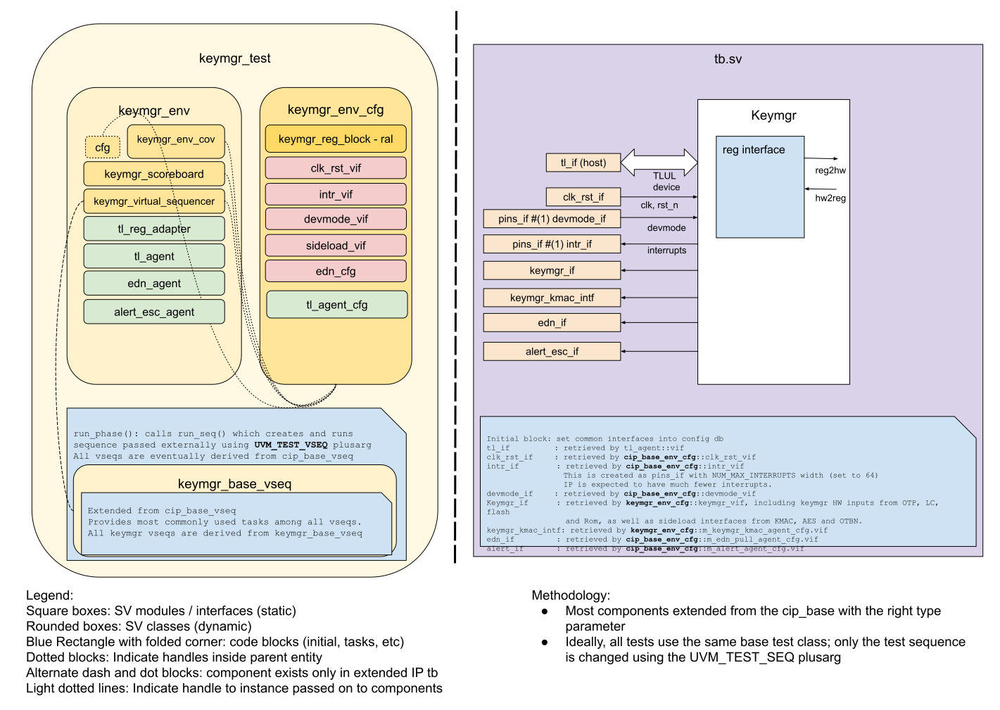

# KEYMGR DV document

## Goals
* **DV**
  * Verify all KEYMGR IP features by running dynamic simulations with a SV/UVM based testbench
  * Develop and run all tests based on the [testplan](#testplan) below towards closing code and functional coverage on the IP and all of its sub-modules
* **FPV**
  * Verify TileLink device protocol compliance with an SVA based testbench

## Current status
* [Design & verification stage](../../../README.md)
  * [HW development stages](../../../../doc/project_governance/development_stages.md)
* [Simulation results](https://reports.opentitan.org/integrated/hw/ip/keymgr/dv/latest/report.html)

## Design features
For detailed information on KEYMGR design features, please see the [KEYMGR HWIP technical specification](../README.md).

## Testbench architecture
KEYMGR testbench has been constructed based on the [CIP testbench architecture](../../../dv/sv/cip_lib/README.md).

### Block diagram


### Top level testbench
Top level testbench is located at `hw/ip/keymgr/dv/tb/tb.sv`. It instantiates the KEYMGR DUT module `hw/ip/keymgr/rtl/keymgr.sv`.
In addition, it instantiates the following interfaces, connects them to the DUT and sets their handle into `uvm_config_db`:
* [Clock and reset interface](../../../dv/sv/common_ifs/README.md)
* [TileLink host interface](../../../dv/sv/tl_agent/README.md)
* KEYMGR IOs (`keymgr_if`)
* Interrupts ([`pins_if`](../../../dv/sv/common_ifs/README.md))
* Alerts ([`alert_esc_if`](../../../dv/sv/alert_esc_agent/README.md))
* Devmode ([`pins_if`](../../../dv/sv/common_ifs/README.md))

### Common DV utility components
The following utilities provide generic helper tasks and functions to perform activities that are common across the project:
* [dv_utils_pkg](../../../dv/sv/dv_utils/README.md)
* [csr_utils_pkg](../../../dv/sv/csr_utils/README.md)

### Compile-time configurations
[list compile time configurations, if any and what are they used for]

### Global types & methods
All common types and methods defined at the package level can be found in
`keymgr_env_pkg`. Some of them in use are:
```systemverilog
[list a few parameters, types & methods; no need to mention all]
```
### TL_agent
KEYMGR testbench instantiates (already handled in CIP base env) [tl_agent](../../../dv/sv/tl_agent/README.md)
which provides the ability to drive and independently monitor random traffic via
TL host interface into KEYMGR device.

### EDN Agent
The KEYMGR testbench instantiates a `push_pull_agent` in `Pull` mode as the agent modelling the [EDN interface](../../../dv/sv/push_pull_agent/README.md) (this is already handled in the CIP base classes).
This agent will return random data as entropy when the KEYMGR sends a request.

### KMAC_APP Agent
The KEYMGR testbench instantiates a [`kmac_app_agent`](../../../dv/sv/kmac_app_agent/README.md) to request a KMAC hash operation on the secret data.

### UVM RAL Model
The KEYMGR RAL model is created with the [`ralgen`](../../../dv/tools/ralgen/README.md) FuseSoC generator script automatically when the simulation is at the build stage.

It can be created manually by invoking [`regtool`](../../../../util/reggen/doc/setup_and_use.md):

### Reference models
[Describe reference models in use if applicable, example: SHA256/HMAC]

### Stimulus strategy
#### Test sequences
All test sequences reside in `hw/ip/keymgr/dv/env/seq_lib`.
The `keymgr_base_vseq` virtual sequence is extended from `cip_base_vseq` and serves as a starting point.
All test sequences are extended from `keymgr_base_vseq`.
It provides commonly used handles, variables, functions and tasks that the test sequences can simple use / call.
Some of the most commonly used tasks / functions are as follows:
* keymgr_operations: This task issues operations as set in the inputs, such as advance operation, generating sw/hw output.
* wait_op_done: This task polls the `op_status` until it returns success / fail status, as well as checking if the status is expected.
* keymgr_rd_clr: This reads `sw_share_output` to allow scoreboard to check the values.

#### Functional coverage
To ensure high quality constrained random stimulus, it is necessary to develop a functional coverage model.
The covergroups defined in testplan have been developed to prove that the test intent has been adequately met.

### Self-checking strategy
#### Scoreboard
The `keymgr_scoreboard` is primarily used for end to end checking.
It creates the following analysis ports to retrieve the data monitored by corresponding interface agents:
* tl_a_chan_fifo: An analysis FIFO to hold transactions from TL address channel.
* tl_d_chan_fifo: An analysis FIFO to hold transactions from TL data channel.
* req_fifo: An analysis FIFO to hold request data sent to KMAC.
* rsp_fifo: An analysis FIFO to hold response digests received from KMAC.
* edn_fifo: An analysis FIFO to hold transactions coming from the EDN interface.

#### Assertions
* TLUL assertions: The `tb/keymgr_bind.sv` binds the `tlul_assert` [assertions](../../tlul/doc/TlulProtocolChecker.md) to the IP to ensure TileLink interface protocol compliance.
* Unknown checks on DUT outputs: The RTL has assertions to ensure all outputs are initialized to known values after coming out of reset.
* Check(Kmac|Aes|Otbn)Key: Check keys on the 3 sideload interfaces.
* CheckEdn1stReq / CheckEdn2ndReq: Check KEYMGR sends 2 EDN request periodically based on the CSR `reseed_interval`.

## Building and running tests
We are using our in-house developed [regression tool](../../../../util/dvsim/README.md) for building and running our tests and regressions.
Please take a look at the link for detailed information on the usage, capabilities, features and known issues.
Here's how to run a smoke test:
```console
$ $REPO_TOP/util/dvsim/dvsim.py $REPO_TOP/hw/ip/keymgr/dv/keymgr_sim_cfg.hjson -i keymgr_smoke
```

## Testplan
[Testplan](../data/keymgr_testplan.hjson)
