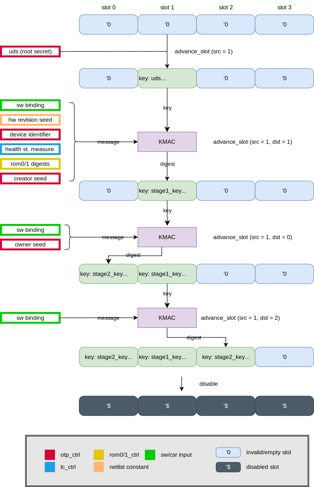

# Theory of Operation

The following diagram gives an example on how keymgr DPE handles multiple DICE contexts.

This example diagram describes a sequence of advance operations on multiple keymgr slots, assuming that keymgr_dpe is instantiated with 4 key slots.
Blue rounded rectangles represent empty key slots and green color is used to denote when they become active. Each slot stores a secret key as well as context data for its key.
Purple rectangles denote key derivation function (KDF) calls that are used to compute slot keys.

In OpenTitan, the KDF is instantiated as [KMAC](../../kmac/README.md).
Each valid operation involves a KMAC invocation, which uses the internal key from the selected source slot for its key input, and other HW / SW supplied inputs as its message.
The concatenated components of the message is dependent on the context of the source slot as well as further inputs provided from HW / SW.

In theory, KMAC can generate outputs of arbitrary length, however this design uses a specific variant with 256-bit security strength, 384-bit digest size, and 256-bit key input.

Effectively, the key manager behavior is divided into 2 classes of functions:
* Key manager state advancement (also referred to as deriving children slots/nodes). The resulting secrets/keys from these operations are not visible to software and not directly usable by any software controlled hardware.

* Key generation. Results can be visible to software or accessible only by hardware (a.k.a. sideloaded keys).

For clarity, all commands issued to the key manager by software are referred to as operations.
Transactions refer to the interaction between key manager and KMAC if a valid operation is issued.
A DPE context refers to what is stored in a keymgr slot, and it consists of a secret key and its associated information.
A keymgr slot refers to the storage unit for DPE contexts, and the actual DPE context it stores is dynamically controlled by SW commands.
In order to address the relationships among keymgr_dpe slots and their stored DPE contexts more clearly, we use the terms _parent slot_ and _child slot_ to mean that their stored DPE contexts follow parent-child relationship in DICE hierarchy.
`a || b` is used to denote the concatenation of two bit strings `a` and `b` (noticeably, not the logical OR operation).

## Key Manager Slots

Keymgr_dpe consists of `DpeNumBootStages` slots, which is a generic parameter.
Each of these key manager slots can store a DPE context, i.e. all DICE-related information for a particular boot stage. That includes a secret key along with additional context information described below.
The secret key size is fixed to 256-bit.

Each slot data consists of the following fields:
* `valid` bit that tells whether the slot is occupied.
* `boot_stage` is a monotonic counter that refers to which boot stage this slot belongs to.
* `max_key_version` stores the maximum allowed key version that is used for comparison during versioned key generation.
* `key_policy` contains policy bits that restrict advance calls that specificy this slot as the source slot.

A slot is a dynamic storage unit and the DPE context it stores is controlled by SW, even though their secret keys never leave HW.
A slot becomes active (i.e. `valid` is set to 1) after a successful advance call that specified this slot as its destination.

When a slot is active, `boot_stage` refers to its DPE context boot stage.
For flexibility, `boot_stage` is a simple unsigned integer that is incremented from the parent's `boot_stage` during advance calls.
Its actual mapping to boot stages such as ROM, BL0 or Kernel can be determined by SW.
Hence, keymgr_dpe is oblivious to this mapping between counter values and the boot stages, though with an exception.
The exception is that the first two stages are treated specially by RTL during KDF advance calls, as they consume other HW-backed inputs that come from keymgr_dpe’s peripheral inputs.
From SW's point of view, they are still treated as any arbitrary DICE layer in that SW can provide further inputs through `SW_CDI_INPUT` CSR.

A slot's `max_key_version` receives its value from `MAX_KEY_VERSION` register during a previous advance call that ends up populating this slot with DPE context.
When a versioned key generation is invoked later, `max_key_version` field of the source slot is compared against the `KEY_VERSION` CSR configured by SW.
The result of this inequality check decides whether keymgr_dpe grants the request by initiating KMAC transaction that computes the requested versioned key.

Similar to `max_key_version`, the slot policy is not a value inherited from parent to child, but instead it is directly copied from `SLOT_POLICY` register into the `key_policy` field (again, during a previous advance call).
`key_policy` is the concatenation of `exportable ||  allow_child || retain_parent` bits, such that:
*  `exportable` decides whether the DPE context secret can be exported in an encrypted manner. However, this feature is not yet implemented, and the bit is simply there to reserve its space.
*  If `allow_child` is set to `true`/`1`, then further advance operations can be requested from this slot (assuming there are no other invalidating preconditions).
Otherwise all advance requests are rejected that specify this slot as its source.
*  If `retain_parent` is set to `true`/`1`, then the parent slot remains valid after an advance call.
Otherwise, after the derivation of a child slot, the DPE context of the parent slot is removed automatically.

## Key Manager State

The key manager working state represents the current working state of the key manager and it is decoupled from the DICE hierarchy.
From SW point of view, keymgr_dpe's FSM can only be in the following states: {`Reset`, `Available`, `Disabled`, `Invalid`}.
After reset, keymgr_dpe remains in `Reset` state until the first advance call that latches the OTP creator root key, which is also referred to as Unique Device Secret (UDS).
After this advance call, the FSM remains in `Available` state, and it can serve the advance/generate/erase requests.
Unless keymgr_dpe encounters a fault or is explicitly disabled, the FSM remains in `Available` state.
Invalid states such as {`Reset`, `Invalid`}, on the other hand, are used to denote out-of-operation states.

### Reset
The advancement from `Reset` to `Available` internally goes through few FSM states, but from the SW point of view, this only requires a single advance call.
During these FSM transitions, the OTP creator root key is latched into a destination slot specified by SW.
The latching of the root key can only happen once until the keymgr_DPE is reset.
Until the initial advance is invoked and keymgr_DPE reaches to `Available` state, the key manager rejects key generation requests.

### Available

During `Available`, keymgr_DPE accepts further advance and key generation requests.
When transitioning from `Reset` to `Available`, as a SCA counter-measure, random values obtained from the entropy source are used to populate the key slot first in a manner that both shares have the same random mask.
Then the root key is XORed on top of this randomness, in order to have fresh randomness for UDS at every power cycle.
During these transitions, keymgr_DPE's working state will be reported as `Reset`, until the latching is done and keymgr_DPE is ready to accept further commands.

### Disabled
`Disabled` is reached through an explicit disable command invocation.
In this state, keymgr_DPE is no longer operational and advance/generate/erase/disable commands return error.
Upon `Disabled` entry, the internal key slots are wiped.
However, previously generated sideload key slots and the software key stored in registers are preserved.
This allows the software to keep the last valid keys while preventing keymgr_DPE to compute further versioned keys.

### Invalid
`Invalid` state is entered whenever key manager is deactivated through the [life cycle connection](#life-cycle-connection) or when an operation encounters a [fault](#faults-and-operational-faults).
Upon `Invalid` entry, the internal key, the sideload key slots and the software key are all wiped.

### Invalid and Disabled State

`Invalid` and `Disabled` states are functionally very similar.
The main difference between the two is how the states are reached and the entry behavior.

`Disabled` state is reached through intentional software commands where the sideload key slots and software key are not wiped, while `Invalid` state is reached through life cycle deactivation or operational faults where the internal key, sideload key slots and the software key are wiped.

This also means that only `Invalid` is a terminal state.
If after entering `Disabled` life cycle is deactivated or a fault is encountered, the same [invalid entry procedure](#Invalid) is followed to bring the system to a terminal `Invalid` state.

If multiple conditions happen to collide (a fault is detected at the same clock cycle SW issues disable command), the `Invalid` entry path always takes precedence.

## Accepted Commands
During each state, there are 4 valid commands software can issue:
* Advance state
* Key generation (a.k.a versioned key generation)
* Erase slot
* Disable

The software is able to select a command and trigger the key manager FSM to process one of the commands.
If a command is valid during the current working state, it is processed and acknowledged when complete.
If a command is invalid, the requested operation is rejected and the values in key slots remain unmodified.
More details about command interactions can be found in Programmers Guide.

### Advance

Advancing a keymgr_dpe slot (also referred to as _deriving a child_) uses multiple inputs.
In particular, since there are multiple slots inside keymgr_dpe, source and destination parameters need to be passed to advance calls.

The very first advance call only latches the OTP creator root key (UDS), therefore most of these registers are ignored during the first call.
The only relevant registers (or register fields) during the first advance call are: `CONTROL_SHADOWED.OPERATION`, `MAX_KEY_VER_SHADOWED`, `CONTROL_SHADOWED.SLOT_DST_SEL` and `START`.

In particular, the destination slot for the UDS is chosen by SW, and there is no designated special slot for it.
Moreover, since the destination slot for this first advance call has no parent, its `boot_stage` value is not incremented but initialized to `0`.
This initial latching can only be done once until the next power cycle.
If the OTP creator root key is not valid during the latching cycle, keymgr_dpe moves to `Invalid`state.

Further advance calls use the key stored in the specified `CONTROL_SHADOWED.SLOT_SRC_SEL` slot (equally referred to as _parent_ or _source_ slot) , and the result of the derivation updates the slot specified by `CONTROL_SHADOWED.SLOT_DST_SEL`  (referred to as _destination_ or _child_ slot).
Assuming that `key_policy`, `boot_stage` or `valid` bits of the parent context permit, the child secret is derived from the parent secret through a key derivation function during advance operation.
`child_key = KDF(parent_key, message)`, where the message input might take few forms depending on the parent slot's `boot_stage` value.
In particular:
* If `boot_stage = 0` for the parent, then `message = SW_CDI_INPUT || hw_revision_seed || device_identifier || health_st_measurement || rom_descriptors || creator_seed`. See [KDF Details](#kdf-details) for more details on HW-backed inputs.
* If `boot_stage = 1` for the parent, then `message = SW_CDI_INPUT || owner_seed`.
* If `boot_stage > 1` for the parent, then `message = SW_CDI_INPUT`.

At the end of a successful advance operation, the following updates are made for the slot selected by `SLOT_DST_SEL`:
* `valid` bit is set to 1.
* `key_policy` is updated with `SLOT_POLICY`.
* `max_key_version` is updated with `MAX_KEY_VERSION`.
* `boot_stage` is set to the parent’s `boot_stage + 1`, except for the initial `Advance` call that initializes the UDS slot `boot_stage` value to `0`.
* `key` is updated from the key received from KMAC.

Whether the same slot can be chosen both as the source and the destination during advance call depends on `retain_parent` policy bit.
If `retain_parent` is set, then the advance operation must provide different source and destination slots.
If `retain_parent` is set to `false`/`0`, then the source and destination slots must be the same.
In other words, `retain_parent = false` forces SW to request in-place update, which automatically removes the parent's DPE context.

When there is no fault and the enable signal is active by life cycle controller, the validity of an advance operation is defined as follows:

* If keymgr_dpe is in `Reset` state (i.e. the first advance call that latches UDS), then an advance operation is valid if:
  * The OTP creator root key is valid during the clock cycle keymgr_DPE tries to latch it.
* If keymgr_dpe is in `Available` state, then an advance operation is valid if all of the following conditions are satisifed (AND clause):
  * Keymgr_DPE is in `Available` state.
  * `valid = true` for the source slot.
  * `allow_child = true` for the source slot.
  * If `retain_parent = true`, then the source and the destination slots are different.
  * If `retain_parent = true`, then the destination slot is not valid (i.e. `valid = 0`).
  * If `retain_parent = false`, then the source and the destination slots are the same.
  * `boot_stage` of the source slot has not reached to the maximum value supported by HW (i.e. `boot_stage + 1 < DpeNumBootStages`.

### Versioned Key Generation

A versioned key generation operation uses the following registers:
* `CONTROL_SHADOWED.DST_SEL` determines the target use for the generated key, and that is either one of {`AES`, `KMAC`, `OTBN`}.
* `CONTROL_SHADOWED.SLOT_SRC_SEL` determines the source slot whose key should be used for the key derivation.
* `SALT` is used as a part of the message during the key derivation.
* `KEY_VERSION` is the target key value, and it also becomes the part of the message for KDF call.

During the generate operation, a versioned key is generated from the secret of the source slot selected by `SLOT_SRC_SEL`.
After a successful key generation operation, if the generated key is requested for HW use, then the generated key is loaded into the sideload slot that drives the specified target peripheral port (`DST_SEL` being either one of {`AES`, `KMAC`, `OTBN`}).
In the case of SW key, the generated key is loaded into a CSR (see `SW_SHARE0_OUTPUT` and `SW_SHARE1_OUTPUT` registers).

The key is generated with a KDF call, where the secret key is read from source slot.
Then, `generated_key = KDF(parent_key, KEY_VERSION || SALT || dest_seed || output_key)` where `dest_seed` and `output_key` are domain separators (i.e. diversification values from netlist) to distinguish SW/HW outputs as well as the target HWIP peripheral {`AES`, `KMAC`, `OTBN`}.

KDF used for key generation calls is the same KMAC instance used in advance calls.
The only difference is that the input messages are 0-padded to another length parameter, `GenDataWidth`.

Key generation request is valid if all of the following conditions are satisfied (AND clause):
* The internal FSM is in `Available` state. Namely, keymgr_dpe rejects key generation requests during `Invalid`/`Disabled` as they are inactive states, and during `Reset` for not having latched the UDS key yet.
* The selected source slot is valid.

### Erase slot

Erasing operation can be used to clear the DICE context from a destination slot. This is done by selecting the slot with `CONTROL_SHADOWED.DST_SEL`, and then configuring and initiating the operation. At the end of a successful erase, the DPE context is removed from the destination slot.

Note that the slots with `retain_parent = false` policy do not require explicit erase calls, as they are automatically erased when advanced.
However, HW does not specifically block such an erase request.
Meanwhile, the slots with `retain_parent = true` can only be destroyed with explicit erase calls, as advance calls will reject overwriting these slots.

Erase request is valid if the following conditions are satisfied:
* The destination slot is valid (i.e. not empty).
* keymgr_dpe FSM's working state is `Available`.

### Disable

Disable operation simply moves the keymgr_DPE's FSM into `Disabled` state. This operation request is valid only if the FSM is in `Available` state.

## Peripheral Connections

### KDF Details

KDF used for advance calls is the KMAC instance with (keylen=256, digest_len=384, sec_lvl = 256) parameters. The input messages to KDF are always 0-padded to the fixed length specified below.

During advance operations, KDF inputs are 0 padded to `AdvDataWidth` bits. Depending on the boot stage, KDF message input also receives the following inputs:
* `hw_revision_seed` is a 256-bit netlist constant.
* `device_identifier` is a 256-bit non-secret device identifier. This value is received from peripheral OTP port.
* `health_st_measurement` is a 128-bit domain separator (i.e. diversification constant) that depends on the life cycle stage. This value is received from peripheral LC port.
* `rom_descriptors` are two hash values for ROM0, ROM1. Each digest is 256-bits. These values are received from their respective ROM controllers.
* `creator_seed` is 256-bit creator secret received from the `SECRET2` OTP partition..
* `owner_seed` is 256-bit owner secret received from the `SECRET3` OTP partition.

During key generation operations, KDF inputs are 0 padded to `GenDataWidth` bits. Some diversification constants are:
* `dest_seed` is a 256-bit diversification value for each cryptograhic key type {AES, KMAC, OTBN}.
* `output_key` is a 256-bit diversification value for distinguishing software and sideload keys.

### Life Cycle Connection
The function of the key manager is directly managed by the [life cycle controller](../../lc_ctrl/README.md#key_manager_en).

Until the life cycle controller activates the key manager, the key manager does not accept any software commands.
Once the key manager is activated by the life cycle controller, it is then allowed to transition to the various states previously [described](#key-manager-states).

When the life cycle controller deactivates the key manager, the key manager transitions to the `Invalid` state.
