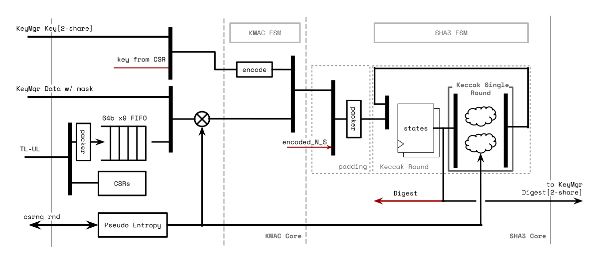
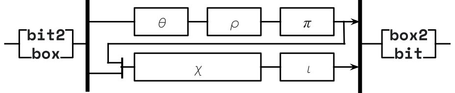
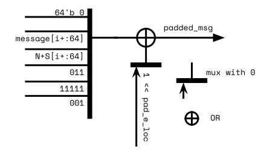
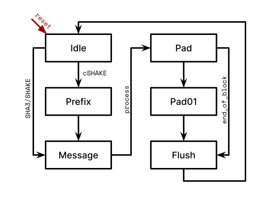
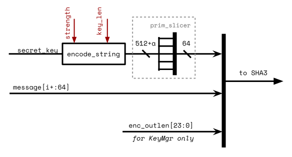
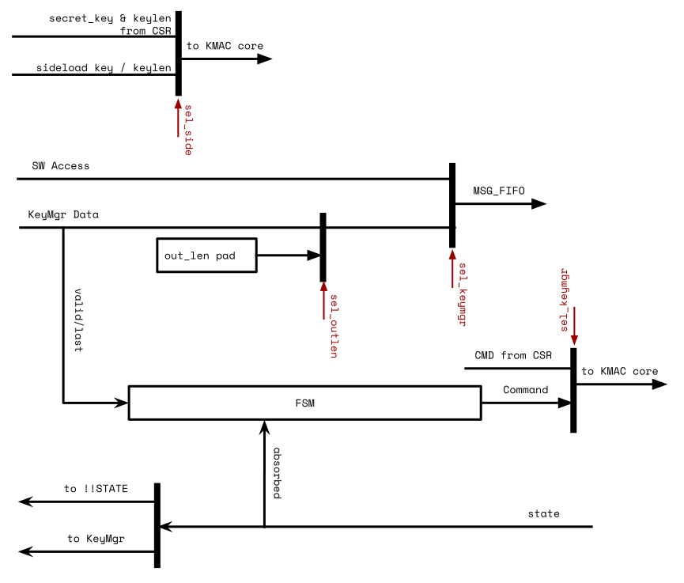
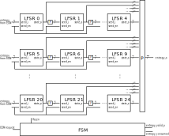

# Overview

This document specifies the Keccak Message Authentication Code (KMAC) and Secure Hashing Algorithm 3 (SHA3) hardware IP functionality.
This module conforms to the OpenTitan guideline for peripheral device functionality.
See that document for integration overview within the broader OpenTitan top level system.

## Features

- Support for SHA3-224, 256, 384, 512, SHAKE[128, 256] and cSHAKE[128, 256]
- Support byte-granularity on input message
- Support 128b, 192b, 256b, 384b, 512b of the secret key length in KMAC mode
- Support arbitrary output length for SHAKE, cSHAKE, KMAC
- Support customization input string S, and function-name N up to 36 bytes total
- 64b x 9 depth Message FIFO
- 1600b of internal state (internally represented in two shares for 1st-order masking)
- Performance goals of >= 72 Mb/s @ 100MHz (when entropy is available always)
    - SHA3-512: roughly 88 MB/s at most
    - SHA3-224: 160 MB/s at most
- Implement 1st-order masked Keccak permutations for Side-Channel Analysis (SCA) protection

## Description

The KMAC module is a Keccak based message authentication code generator to check the integrity of an incoming message and a signature signed with the same secret key.
The secret key length can vary up to 512 bits.

The KMAC generates at most 1600 bits of the digest value at a time which can be read from the STATE memory region.
There's a way for the software to read more digest values by manually running the Keccak rounds.
The details of the operation are described in the [SHA3 specification, FIPS 202]() known as _sponge construction_.

The KMAC HWIP also performs the SHA3 hash functions without the authentication, whose purpose is to check the correctness of the received message.
The KMAC IP supports various SHA3 hashing functions including SHA3 Extended Output Function (XOF) known as SHAKE functions.

The KMAC HWIP implements a defense mechanism to deter SCA attacks.
It is expected to protect against 1st order SCA attacks by implementing masked storage and Domain Oriented Masking (DOM) AND logic inside the Keccak function.

# Theory of Operation

## Block Diagram

The above figure shows the KMAC/SHA3 HWIP block diagram.
The KMAC has register interfaces for SW to configure the module, initiate the hashing process, and acquire the result digest from the STATE memory region.
It also has interfaces tot he KeyMgr to get the secret key (masked) and the message data.
The interface to the KeyMgr is mainly for Key Derivative Functions (KDF).

As similar with HMAC, KMAC HWIP also has a message FIFO (MSG_FIFO) whose depth was determined based on a few criteria such as the register interface width, and its latency, the latency of hashing algorithm (Keccak).
Based on the given criteria, the MSG_FIFO depth was determined to store the incoming message while the SHA3 core is in computation.

The MSG_FIFO has a packer in front.
It packs any partial writes into the size of inernal datapath (64bit) and stores in MSG_FIFO.
It gives some freedome to the software not requiring to align the messages.
It also doesn't need the message length information.

The fed messages go into the KMAC core regardless of KMAC enabled or not.
But the KMAC core just forwards the messages to SHA3 core in case of KMAC disabled.
KMAC core prepends the encoded secret key as described in the SHA3 Derived Functions specification.
It is expected that the software writes the encoded output length at the end of the message.
For KDF triggered by KeyMgr, the encoded output length is appended inside the KeyMgr interface module in KMAC HWIP.

The SHA3 core is the main Keccak processing module.
It supports SHA3 hashing functions, SHAKE128, SHAKE256 extended output functions, and also cSHAKE128, cSHAKE256 functions in order to support KMAC operation.
To support multiple hashing functions, it has the padding logic inside.
The padding logic mainly pads the predefined bits at the end of the message and also performs `pad10*1()` function.
If cSHAKE mode is set, the padding logic also prepends the encoded function name `N` and the customization string `S` prior to the incoming messages according to the spec requirements.

Both the internal state width and the masking of the Keccak core are configurable via compile-time Verilog parameters.
By default, 1600 bits of internal state are used and stored in two shares (1st order masking).
The masked Keccak core takes 3 clock cycles per round if sufficient entropy is available.
If desired, the masking can be disabled and the internal state width can be reduced to 25, 50, or 100 bits at compile time.

## Hardware Interface



## Design Details

### Keccak Round

A Keccak round implements the Keccak_f function described in the SHA3 specification.
Keccak round logic in KMAC/SHA3 HWIP not only supports 1600 bit internal states but also all possible values {25, 50, 100, 200, 400, 800, 1600} based on a parameter `Width`.
Keccak permutations in the specification allow arbitrary number of rounds.
This module, however, supports Keccak_f which always runs `12 + 2*L` rounds, where $$ L = log_2 {( {Width \over 25} )} $$ .
For instance, 200 bits of internal state run 18 rounds.
KMAC/SHA3 instantiates the Keccak round module with 1600 bit.

Keccak round logic has two phases inside.
Theta, Rho, Pi functions are executed at the 1st phase.
Chi and Iota functions run at the 2nd phase.
If the compile-time Verilog parameter `EnMasking` is not set, the first phase and the second phase run at the same cycle.

If the masking feature is enabled, Keccak round logic stores the intermediate state after processing the 1st phase.
The stored value are fed into the Chi function at the next cycle.
Chi function implements [Domain-Oriented Masking (DOM) AND][]logic inside to protect against the 1st order SCA attacks.
The DOM AND logic needs entropy to disperse the power peaks.
Chi function moves forward only when there is valid entropy.

The 2nd phase takes a least two cycles due to the intrinsic behavior of DOM AND logic.
If the entropy is not ready, it may not complete the DOM AND.
Processing a Keccak_f (1600 bit state) takes a total of 72 cycles (24 rounds X 3 cycles/round) including the 1st and 2nd phases.

If the masking compile time option is enabled, Keccak round logic requires an additional 1600 bit to store the state value partially inside DOM AND logic.
In addition to that Keccak round logic needs two sets of the same Theta, Rho, and Pi functions.
As a result, the masked Keccak round logic takes more than twice as much as area than the unmasked version of it.

### Padding for Keccak

Padding logic supports SHA3/SHAKE/cSHAKE algorithms.
cSHAKE needs the extra inputs for the Function-name `N` and the Customization string `S`.
Other than that, SHA3, SHAKE, and cSHAKE share similar datapath inside the padding module except the last part added next to the end of the message.
SHA3 adds `2'b 10`, SHAKE adds `4'b 1111`, cSHAKE adds `2'b00` then `pad10*1()` follows.
All are little-endian values.

Interface between this padding logic and the MSG_FIFO follows the conventional FIFO interface.
So `prim_fifo_*` can talk to the padding logic directly.
This module talks to Keccak round logic with a more memory-like interface.
The interface has an additional address signal on top of the valid, ready, and data signals.

The hashing process begins when the software issues the start command to !!CMD .
If cSHAKE is enabled, the padding logic expands the prefix value (`N || S` above) into a block size.
The block size is determined by the !!CFG.kstrength .
If the value is 128, the block size will be 168 bytes.
If it is 256, the block size will be 136 bytes.
The expanded prefix value is transmitted to the Keccak round logic.
After sending the block size, the padding logic triggers the Keccak round logic to run a full 24 rounds.

If the mode is not cSHAKE, or cSHAKE mode and the prefix block has been processed, the padding logic accepts the incoming message bitstream and forward the data to the Keccak round logic in a block granularity.
The padding logic controls the data flow and makes the Keccak logic to run after sending a block size.

After the software writes the message bitstream, it should issue the Process command into !!CMD register.
The padding logic, after receiving the Process command, appends proper ending bits with respect to the !!CFG.mode value.
The logic writes 0 up to the block size to the Keccak round logic then ends with 1 at the end of the block.

After the Keccak round completes the last block, the padding logic asserts an `absorbed` signal to notify the software.
The signal generates the `kmac_done` interrupt.
At this point, the software is able to read the digest in !!STATE memory region.
If the output length is greater than the Keccak block rate in SHAKE and cSHAKE mode, the software may run the Keccak round manually by issuing Run command to !!CMD register.

The software completes the operation by issuing Done command after reading the digest.
The padding logic clears internal variables and goes back to Idle state.

### Padding for KMAC

KMAC core prepends and appends additional bitstream on top of Keccak padding logic in SHA3 core.
The [NIST SP 800-185][] defines `KMAC[128,256](K, X, L, S)` as a cSHAKE function.
See the section 4.3 in NIST SP 800-185 for details.
If KMAC is enabled, the software should configure !!CFG.mode to cSHAKE and the first six bytes of !!PREFIX to `0x01204B4D4143` (bigendian).
The first six bytes of !!PREFIX represents the value of `encode_string("KMAC")`.

The KMAC padding logic prepends a block containing the encoded secret key to the output message.
The KMAC first sends the block of secret key then accepts the incoming message bitstream.
At the end of the message, the software writes `right_encode(output_length)` to MSG_FIFO prior to issue Process command.

### Message FIFO

The KMAC HWIP has a compile-time configurable depth message FIFO inside.
The message FIFO receives incoming message bitstream regardless of its byte position in a word.
Then it packs the partial message bytes into the internal 64 bit data width.
After packing the data, the logic stores the data into the FIFO until the internal KMAC/SHA3 engine consumes the data.

The depth of the message FIFO is chosen to cover the throughput of the software or other producers such as DMA engine.
The size of the message FIFO is enough to hold the incoming data while the SHA3 engine is processing the previous block.
Details are in `kmac_pkg::MsgFifoDepth` parameter.
Default design parameters assume the system characteristics as below:

- `kmac_pkg::RegLatency`: The register write takes 5 cycles.
- `kmac_pkg::Sha3Latency`: Keccak round latency takes 72 cycles, which is the masked version of the Keccak round.

The message FIFO does not generate the masked message data.
Incoming message bistream is not sensitive to the leakage.
So if the `EnMasking` parameter is set, the second share of the message bistream is zero.
The secret key, however, is stored as masked form always.

### Keccak State Access

After the Keccak round completes the KMAC/SHA3 operation, the contents of the Keccak state contain the digest value.
The software can access the 1600 bit of the Keccak state directly through the window of the KMAC/SHA3 register.

If the compile-time parameter masking feature is enabled, the upper 256B of the window is the second share of the Keccak state.
If not, the upper address space is zero value.
The software reads both of the Keccak state shares and XORed in the software to get the unmasked digest value if masking feature is set.

The Keccak state is valid after the sponge absorbing process is completed.
While in an idle state or in the sponge absorbing stage, the value is zero.
This ensures that the logic does not expose the secret key XORed with the keccak_f results of the prefix to the software.
In addition to that, the KMAC/SHA3 blocks the software access to the Keccak state when it processes the request from KeyMgr for Key Derivation Function (KDF).

### KeyMgr Interface

KMAC/SHA3 HWIP has an option to receive the secret key from KeyMgr via sideload key interface.
The software should set !!CFG.sideload to use the KeyMgr sideloaded key in SW-initiated KMAC operation.
`keymgr_pkg::hw_key_t` defines the structure of the sideloaded key.
KeyMgr provides the sideloaded key in two-share masked form regardless of the compile-time parameter `EnMasking`.
If `EnMasking` is not defined, the KMAC merges the shared key to the unmasked form before uses the key.

KeyMgr may initiate the KMAC operation via the KeyMgr data interface `keymgr_pkg::kmac_data_{req|rsp}_t`.
KeyMgr sends 64-bit data (`MsgWidth`) in a beat with the message strobe signal.
The state machine inside the KeyMgr interface logic starts when it receives the first valid data.
Because this logic sees the first valid data as an initiator, KeyMgr cannot run KDF with an empty message.
After the logic switches to accept the message bitstream from KeyMgr, it forces the KMAC to use the sideloaded key as a secret key.
Also it ignores the command issued from the software.
Instead it generates the commands and sends them to the KMAC core.

The last beat of the KeyMgr data moves the state machine to append the encoded output length.
The output length is the digest width, which is 256 bit.
It means that the logic appends `0x020100` (little-endian) to the end of the message.
The output data from this logic goes to MSG_FIFO.
Because the MSG_FIFO handles un-aligned data inside, KeyMgr interface logic sends the encoded output length value in a separate beat.

After the encoded output length is pushed to the KMAC core, the interface logic issues a Process command to run the hashing logic.

After hashing operation is completed, KMAC does not raise a `kmac_done` interrupt; rather it triggers the `done` status in the KeyMgr data response channel.
The result digest always comes in two shares.
If the `EnMasking` parameter is not set, the second share is always zero.

### Entropy Generator

This section explains the entropy generator inside the KMAC HWIP.

KMAC has an entropy generator to feed the random value while KMAC is processing the secret key block.
The entropy generator fetches initial entropy from the [Entropy Distribution Network (EDN)][edn] module.
The `prim_lfsr` module in this entropy generator consumes the seed entropy from EDN.

[edn]: 

Internal entropy size used in KMAC operation is the length of Keccak state, which is 1600 bit.
However, EDN provides the entropy in much less size.
Requesting multiple entropy to EDN module degrades the KMAC throughput.
This module requests the entropy to EDN then expands the entropy to 1600 bit.

This module, at first, expands the generated random values to 320 bits by stacking the values in every cycle.
Then the 320b of the entropy is duplicated into 1600bit.
Internally, the module stores only 320bit of entropy.
We choose 320bit to cover one plane (5x 64bit).
No requirement of the entropy bit size exists.
But we have decided to prepare the entropy size bigger than the security strength and also cover one plane (5x 64bit).

The module periodically refreshes the LFSR with the new entropy from EDN.
The refresh does not block the internal entropy expansion operation.

### Error Report

_TBD_

# Programmers Guide

## Initialization

The software can update the KMAC/SHA3 configurations only when the IP is in the idle state.
The software should check !!STATUS.sha3_idle before updating the configurations.
The software must first program !!CFG.msg_endianness and !!CFG.state_endianness at the initialization stage.
These determine the byte order of incoming messages (msg_endianness) and the Keccak state output (state_endianness).

## Software Initiated KMAC/SHA3 process

This section describes the expected software process to run the KMAC/SHA3 HWIP.
At first, the software configures !!CFG.kmac_en for KMAC operation.
If KMAC is enabled, the software should configure !!CFG.mode to cSHAKE and !!CFG.kstrength to 128 or 256 bit security strength.
The software also updates !!PREFIX registers if cSHAKE mode is used.
Current design does not convert cSHAKE mode to SHAKE even if !!PREFIX is empty string.
It is the software's responsiblity to change the !!CFG.mode to SHAKE in case of empty !!PREFIX.
The KMAC/SHA3 HWIP uses !!PREFIX registers as it is.
It means that the software should update !!PREFIX with encoded values.

If !!CFG.kmac_en is set, the software should update the secret key.
The software prepares two shares of the secret key and selects its length in !!KEY_LEN then writes the shares of the secret key to !!KEY_SHARE0 and !!KEY_SHARE1 .
The two shares of the secret key are the values that represent the secret key value when they are XORed together.
The software can XOR the unmasked secret key with entropy.
The XORed value is a share and the entropy used is the other share.

After configuring, the software notifies the KMAC/SHA3 engine to accept incoming messages by issuing Start command into !!CMD .
If Start command is not issued, the incoming message is discarded.
If KMAC is enabled, the software pushes the `right_encode(output_length)` value at the end of the message.
For example, if the desired output length is 256 bit, the software writes `0x00020100` to MSG_FIFO.

After the software pushes all messages, it issues Process command to !!CMD for SHA3 engine to complete the sponge absorbing process.
SHA3 hashing engine pads the incoming message as defined in the SHA3 specification.

After the SHA3 engine completes the sponge absorbing step, it generates `kmac_done` interrupt.
Or the software can poll the !!STATUS.squeeze bit until it becomes 1.
In this stage, the software may run the Keccak round manually.

If the desired digest length is greater than the Keccak rate, the software issues Run command for the Keccak round logic to run one full round after the software reads the current available Keccak state.
At this stage, KMAC/SHA3 does not raise an interrupt when the Keccak round completes the software initiated manual run.
The software should check !!STATUS.squeeze register field for the readiness of !!STATE value.

After the software reads all the digest values, it issues Done command to !!CMD register to clear the internal states.
Done command clears the Keccak state, FSM in SHA3 and KMAC, and a few internal variables.
Secret key and other software programmed values won't be reset.

## Endianness

This KMAC HWIP operates in little-endian.
Internal SHA3 hashing engine receives in 64-bit granularity.
The data written to SHA3 is assumed to be little endian.

The software may write/read the data in big-endian order if !!CFG.msg_endianness or !!CFG.state_endianness is set.
If the endianness bit is 1, the data is assumed to be big-endian.
So, the internal logic byte-swap the data.
For example, when the software writes `0xDEADBEEF` with endianness as 1, the logic converts it to `0xEFBEADDE` then writes into MSG_FIFO.

The software managed secret key, and the prefix are always little-endian values.
For example, if the software configures the function name `N` in KMAC operation, it writes `encode_string("KMAC")`.
The `encode_string("KMAC")` represents `0x01 0x20 0x4b 0x4d 0x41 0x43` in byte order.
The software writes `0x4d4b2001` into !!PREFIX0 and `0x????4341` into !!PREFIX1 .
Upper 2 bytes can vary depending on the customization input string `S`.

## KMAC/SHA3 context switching

This version of KMAC/SHA3 HWIP _does not_ support the software context switching.
A context switching scheme would allow software to save the current hashing engine state and initiate a new high priority hashing operation.
It could restore the previous hashing state later and continue the operation.

## Registers



[SHA3 specification, FIPS 202]: https://csrc.nist.gov/publications/detail/fips/202/final
[NIST SP 800-185]: https://csrc.nist.gov/publications/detail/sp/800-185/final
[Domain-Oriented Masking (DOM) AND]: https://eprint.iacr.org/2017/395.pdf
