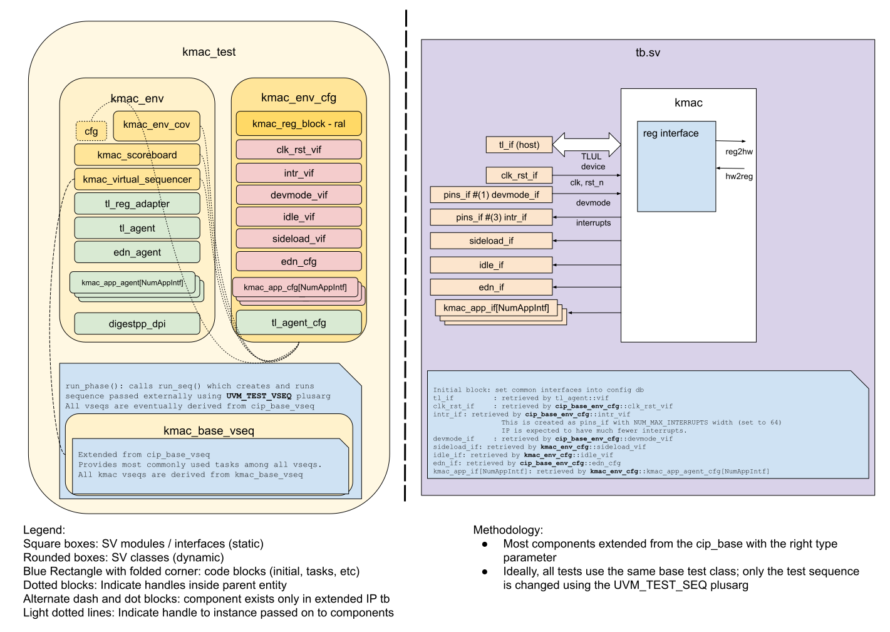

## Goals
* **DV**
  * Verify all KMAC IP features by running dynamic simulations with a SV/UVM based testbench
  * Develop and run all tests based on the [DV plan](#dv-plan) below towards closing code and functional coverage on the IP and all of its sub-modules
* **FPV**
  * Verify TileLink device protocol compliance with an SVA based testbench

## Current status
* [Design & verification stage]()
  * [HW development stages]()
* [Simulation results](https://reports.opentitan.org/hw/ip/kmac/dv/latest/results.html)

## Design features
For detailed information on KMAC design features, please see the [KMAC HWIP technical specification]().

## Testbench architecture
KMAC testbench has been constructed based on the [CIP testbench architecture]().

### Block diagram


### Top level testbench
Top level testbench is located at `hw/ip/kmac/dv/tb/tb.sv`. It instantiates the KMAC DUT module `hw/ip/kmac/rtl/kmac.sv`.
In addition, it instantiates the following interfaces, connects them to the DUT and sets their handle into `uvm_config_db`:
* [Clock and reset interface]()
* [TileLink host interface]()
* KMAC IOs
* Interrupts ([`pins_if`]())
* Devmode ([`pins_if`]())

### Common DV utility components
The following utilities provide generic helper tasks and functions to perform activities that are common across the project:
* [dv_utils_pkg]()
* [csr_utils_pkg]()

### Compile-time configurations
Two compile-time configurations are tested:
* `kmac_masked` - this configuration enables internal secure data masking features
* `kmac_unmasked` - this configuration disables all internal security features

A macro define `EN_MASKING` is defined as a build option in `hw/ip/kmac/dv/kmac_base_sim_cfg.hjson`, which is used to set the correct compile-time settings.

### Global types & methods
All common types and methods defined at the package level can be found in
`kmac_env_pkg`. Some of them in use are:
```systemverilog
parameter int KMAC_NUM_SHARES = 2;

parameter int KMAC_NUM_KEYS_PER_SHARE = 16;

parameter bit [TL_AW-1:0] KMAC_FIFO_BASE = 32'h800;
parameter bit [TL_AW-1:0] KMAC_FIFO_END = 32'FFC;

// interrupt types
typedef enum int {
  KmacDone = 0,
  KmacFifoEmpty = 1,
  KmacErr = 2;
  KmacNumIntrs = 3
} kmac_intr_e;

// types of application interfaces
typedef enum int {
  AppKeymgr,
  AppLc,
  AppRom
} kmac_app_e;

typedef virtual pins_if#(1)      idle_vif;
typedef virtual kmac_sideload_if sideload_vif

// Helper function that returns the KMAC key size in bytes
function automatic int get_key_size_bytes(kmac_pkg::key_len_e len);
  case (len)
    Key128: return 16;
    Key192: return 24;
    Key256: return 32;
    Key384: return 48;
    Key512: return 64;
    default: `uvm_fatal("kmac_env_pkg", $sformatf("%0s is an invalid key length", len.name()))
  endcase
endfunction
```
### TL_agent
KMAC testbench instantiates (already handled in CIP base env) [tl_agent]() which provides the ability to drive and independently monitor random traffic via TL host interface into KMAC device.

### EDN Agent
The KMAC testbench instantiates a `push_pull_agent` in `Pull` mode as the agent modelling the [EDN interface]() (this is already handled in the CIP base classes).
This agent will return random data as entropy after a random delay any time the KMAC sends a request.

### KMAC_APP Agent
The KMAC testbench instantiates an array of [`kmac_app_agent`](<{{ relref "hw/dv/sv/kmac_app_agent/README.md" >}}) to model the application interfaces used by other IP blocks to request a KMAC hash operation on some data.
These interfaces are used to send in message data to the KMAC, and to receive an output digest.

### UVM RAL Model
The KMAC RAL model is created with the [`ralgen`]() FuseSoC generator script automatically when the simulation is at the build stage.

It can be created manually by invoking [`regtool`]():

### Reference models
The KMAC testbench utilizes a [C++ reference model](<{{ relref "hw/ip/dv/kmac/dpi/vendor/kerukuro_digestpp/README.md" >}}) for various hashing operations (SHA3, SHAKE, CSHAKE, KMAC) to check the DUT's digest output for correctness.

### Stimulus strategy
#### Test sequences
All test sequences reside in `hw/ip/kmac/dv/env/seq_lib`.
The `kmac_base_vseq` virtual sequence is extended from `cip_base_vseq` and serves as a starting point.
All test sequences are extended from `kmac_base_vseq`.
It provides commonly used handles, variables, functions and tasks that the test sequences can simple use / call.
Some of the most commonly used tasks / functions are as follows:
* `set_prefix()` - This task encodes 2 input strings (function name and customization string) into a bytestream as per NIST standard specifications and writes the data to the `PREFIX` CSRs
* `write_msg()` - This task breaks down the input messages into chunks less than or equal to the TLUL bus size, and writes each chunk to the message FIFO window of the KMAC
* `read_digest_shares()` - This task reads the output digest data from the `STATE_SHARE` windows, manually squeezing (polling for more output data) as necessary

#### Functional coverage
To ensure high quality constrained random stimulus, it is necessary to develop a functional coverage model.
The following covergroups have been developed to prove that the test intent has been adequately met:
* cg1:
* cg2:

### Self-checking strategy
#### Scoreboard
The `kmac_scoreboard` is primarily used for end to end checking.
It creates the following analysis ports to retrieve the data monitored by corresponding interface agents:
* tl_a_chan_fifo: TL address channel
* tl_d_chan_fifo: TL data channel
* kmac_app_req_fifo[kmac_pkg::NumAppIntf]: An array of analysis FIFOs to hold request transactions coming from the various application interfaces
* kmac_app_rsp_fifo[kmac_pkg::NumAppIntf]: An array of analysis FIFOs to hold response transactions coming from the various application interfaces
* edn_fifo: FIFO used to hold transactions coming from the EDN interface

The KMAC scoreboard implements a cycle-accurate model of the DUT that is used to thoroughly check the operation of the KMAC IP.
Though complex to implement, this is extremely useful for CSR prediction as many of the status fields rely on exact timing of the design (e.g. CSR fields that reflect the internal message FIFO pointers need to be predicted in the scoreboard on the exact cycle that they are updated in the design otherwise it will result in prediction mismatches).

The cycle-accurate model is also designed to check the operation of the various application interfaces as well as the EDN interface to provide full confidence in the design's correctness.

In addition to the cycle-accurate model, the scoreboard tracks the input message as it is written to the message FIFO in chunks, assembles it into a full bytestream, and uses this complete message as input for the DPI-C++ reference model to produce the expected digest value.
As the test sequence reads the output STATE_SHARE windows after a hash operation, the scoreboard will assemble the read digest data into the actual digest value, which can easily be compared against the output of the C++ reference model.

#### Assertions
* TLUL assertions: The `tb/kmac_bind.sv` binds the `tlul_assert` [assertions]() to the IP to ensure TileLink interface protocol compliance.
* Unknown checks on DUT outputs: The RTL has assertions to ensure all outputs are initialized to known values after coming out of reset.

## Building and running tests
We are using our in-house developed [regression tool]() for building and running our tests and regressions.
Please take a look at the link for detailed information on the usage, capabilities, features and known issues.
Here's how to run a smoke test:
```console
$ $REPO_TOP/util/dvsim/dvsim.py $REPO_TOP/hw/ip/kmac/dv/kmac_sim_cfg.hjson -i kmac_smoke
```

## DV plan
<!-- TODO: uncomment the line below after adding the DV plan -->

