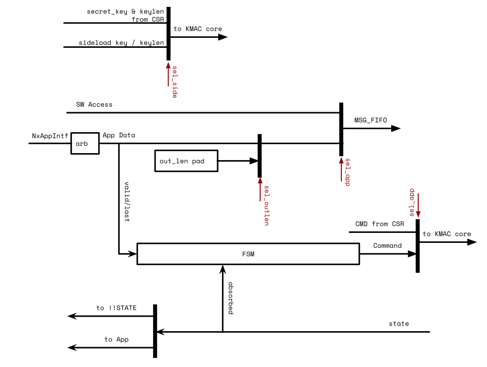

# Theory of Operation

## Block Diagram


The above figure shows the KMAC/SHA3 HWIP block diagram.
The KMAC has register interfaces for SW to configure the module, initiate the hashing process, and acquire the result digest from the STATE memory region.
It also has an interface to the KeyMgr to get the secret key (masked).
The IP has N x [application interfaces](#application-interface), which allows other HWIPs to request any pre-defined hashing operations.

As similar with HMAC, KMAC HWIP also has a message FIFO (MSG_FIFO) whose depth was determined based on a few criteria such as the register interface width, and its latency, the latency of hashing algorithm (Keccak).
Based on the given criteria, the MSG_FIFO depth was determined to store the incoming message while the SHA3 core is in computation.

The MSG_FIFO has a packer in front.
It packs any partial writes into the size of internal datapath (64bit) and stores in MSG_FIFO.
It frees the software from having to align the messages.
It also doesn't need the message length information.

The fed messages go into the KMAC core regardless of KMAC enabled or not.
The KMAC core forwards the messages to SHA3 core in case KMAC hash functionality is disabled.
KMAC core prepends the encoded secret key as described in the SHA3 Derived Functions specification.
It is expected that the software writes the encoded output length at the end of the message.
For hashing operations triggered by an IP through the application interface, the encoded output length is appended inside the AppIntf module in the KMAC HWIP.

The SHA3 core is the main Keccak processing module.
It supports SHA3 hashing functions, SHAKE128, SHAKE256 extended output functions, and also cSHAKE128, cSHAKE256 functions in order to support KMAC operation.
To support multiple hashing functions, it has the padding logic inside.
The padding logic mainly pads the predefined bits at the end of the message and also performs `pad10*1()` function.
If cSHAKE mode is set, the padding logic also prepends the encoded function name `N` and the customization string `S` prior to the incoming messages according to the spec requirements.

Both the internal state width and the masking of the Keccak core are configurable via compile-time Verilog parameters.
By default, 1600 bits of internal state are used and stored in two shares (1st order masking).
The masked Keccak core takes 4 clock cycles per round if sufficient entropy is available.
If desired, the masking can be disabled and the internal state width can be reduced to 25, 50, or 100 bits at compile time.

## Design Details

### Keccak Round

A Keccak round implements the Keccak_f function described in the SHA3 specification.
Keccak round logic in KMAC/SHA3 HWIP not only supports 1600 bit internal states but also all possible values {50, 100, 200, 400, 800, 1600} based on a parameter `Width`.
If masking is disabled via compile-time Verilog parameter `EnMasking`, also 25 can be selected as state width.
Keccak permutations in the specification allow arbitrary number of rounds.
This module, however, supports Keccak_f which always runs `12 + 2*L` rounds, where $$ L = log_2 {( {Width \over 25} )} $$ .
For instance, 200 bits of internal state run 18 rounds.
KMAC/SHA3 instantiates the Keccak round module with 1600 bit.


Keccak round logic has two phases inside.
Theta, Rho, Pi functions are executed at the 1st phase.
Chi and Iota functions run at the 2nd phase.
If the compile-time Verilog parameter `EnMasking` is not set, i.e., if masking is not enabled, the first phase and the second phase run at the same cycle.

If masking is enabled, the Keccak round logic stores the intermediate state after processing the 1st phase.
The stored values are then fed into the 2nd phase computing the Chi and Iota functions.
The Chi function leverages first-order [Domain-Oriented Masking (DOM)](https://eprint.iacr.org/2017/395.pdf) to deter SCA attacks.

To balance circuit area and SCA hardening, the Chi function uses 800 instead 1600 DOM multipliers but the multipliers are fully pipelined.
The Chi and Iota functions are thus separately applied to the two halves of the state and the 2nd phase takes in total three clock cycles to complete.
In the first clock cycle of the 2nd phase, the first stage of Chi is computed for the first lane halves of the state.
In the second clock cycle, the new first lane halves are output and written to state register.
At the same time, the first stage of Chi is computed for the second lane halves.
In the third clock cycle, the new second lane halves are output and written to the state register.

The 800 DOM multipliers need 800 bits of fresh entropy for remasking.
If fresh entropy is not available, the DOM multipliers do not move forward and the 2nd phase will take more than three clock cycles.
Processing a Keccak_f (1600 bit state) takes a total of 96 cycles (24 rounds X 4 cycles/round) including the 1st and 2nd phases.

If the masking compile time option is enabled, Keccak round logic requires an additional 3200 flip flops to store the intermediate half state inside the 800 DOM multipliers.
In addition to that Keccak round logic needs two sets of the same Theta, Rho, and Pi functions.
As a result, the masked Keccak round logic takes more than twice as much as area than the unmasked version of it.

### Padding for Keccak

Padding logic supports SHA3/SHAKE/cSHAKE algorithms.
cSHAKE needs the extra inputs for the Function-name `N` and the Customization string `S`.
Other than that, SHA3, SHAKE, and cSHAKE share similar datapath inside the padding module except the last part added next to the end of the message.
SHA3 adds `2'b 10`, SHAKE adds `4'b 1111`, cSHAKE adds `2'b00` then `pad10*1()` follows.
All are little-endian values.

Interface between this padding logic and the MSG_FIFO follows the conventional FIFO interface.
So `prim_fifo_*` can talk to the padding logic directly.
This module talks to Keccak round logic with a more memory-like interface.
The interface has an additional address signal on top of the valid, ready, and data signals.


The hashing process begins when the software issues the start command to [`CMD`](registers.md#cmd) .
If cSHAKE is enabled, the padding logic expands the prefix value (`N || S` above) into a block size.
The block size is determined by the [`CFG_SHADOWED.kstrength`](registers.md#cfg_shadowed) .
If the value is 128, the block size will be 168 bytes.
If it is 256, the block size will be 136 bytes.
The expanded prefix value is transmitted to the Keccak round logic.
After sending the block size, the padding logic triggers the Keccak round logic to run a full 24 rounds.

If the mode is not cSHAKE, or cSHAKE mode and the prefix block has been processed, the padding logic accepts the incoming message bitstream and forward the data to the Keccak round logic in a block granularity.
The padding logic controls the data flow and makes the Keccak logic to run after sending a block size.

After the software writes the message bitstream, it should issue the Process command into [`CMD`](registers.md#cmd) register.
The padding logic, after receiving the Process command, appends proper ending bits with respect to the [`CFG_SHADOWED.mode`](registers.md#cfg_shadowed) value.
The logic writes 0 up to the block size to the Keccak round logic then ends with 1 at the end of the block.


After the Keccak round completes the last block, the padding logic asserts an `absorbed` signal to notify the software.
The signal generates the `kmac_done` interrupt.
At this point, the software is able to read the digest in [`STATE`](registers.md#state) memory region.
If the output length is greater than the Keccak block rate in SHAKE and cSHAKE mode, the software may run the Keccak round manually by issuing Run command to [`CMD`](registers.md#cmd) register.

The software completes the operation by issuing Done command after reading the digest.
The padding logic clears internal variables and goes back to Idle state.

### Padding for KMAC


KMAC core prepends and appends additional bitstream on top of Keccak padding logic in SHA3 core.
The [NIST SP 800-185](https://csrc.nist.gov/publications/detail/sp/800-185/final) defines `KMAC[128,256](K, X, L, S)` as a cSHAKE function.
See the section 4.3 in NIST SP 800-185 for details.
If KMAC is enabled, the software should configure [`CMD.mode`](registers.md#cmd) to cSHAKE and the first six bytes of [`PREFIX`](registers.md#prefix) to `0x01204B4D4143` (bigendian).
The first six bytes of [`PREFIX`](registers.md#prefix) represents the value of `encode_string("KMAC")`.

The KMAC padding logic prepends a block containing the encoded secret key to the output message.
The KMAC first sends the block of secret key then accepts the incoming message bitstream.
At the end of the message, the software writes `right_encode(output_length)` to MSG_FIFO prior to issue Process command.

### Message FIFO

The KMAC HWIP has a compile-time configurable depth message FIFO inside.
The message FIFO receives incoming message bitstream regardless of its byte position in a word.
Then it packs the partial message bytes into the internal 64 bit data width.
After packing the data, the logic stores the data into the FIFO until the internal KMAC/SHA3 engine consumes the data.

#### FIFO Depth calculation

The depth of the message FIFO is chosen to cover the throughput of the software or other producers such as DMA engine.
The size of the message FIFO is enough to hold the incoming data while the SHA3 engine is processing the previous block.
Details are in `kmac_pkg::MsgFifoDepth` parameter.
Default design parameters assume the system characteristics as below:

- `kmac_pkg::RegLatency`: The register write takes 5 cycles.
- `kmac_pkg::Sha3Latency`: Keccak round latency takes 96 cycles, which is the masked version of the Keccak round.

#### FIFO Depth and Empty status

If the SW is slow and the SHA3 engine pops the data fast enough, the Message FIFO's depth may remain **0**.
The Message FIFO's `fifo_empty` signal, however, is lowered for a cycle.
This enables the HW to fire the interrupt even the FIFO remains empty.

However, the recommended approach to write messages is:

1. Check the FIFO depth [`STATUS.fifo_depth`](registers.md#status). This represents the number of entry slots currently occupied in the FIFO.
2. Calculate the remaining size as `<max number of fifo entries> - <STATUS.fifo_depth>) * <entry size>`.
3. Write data to fill the remaining size.
4. Repeat until all data is written.

In code, this looks something like:
```c
/**
 * Absorb input data into the Keccak computation.
 *
 * Assumes that the KMAC block is in the "absorb" state; it is the caller's
 * responsibility to check before calling.
 *
 * @param in Input buffer.
 * @param in_len Length of input buffer (bytes).
 * @return Number of bytes written.
 */
size_t kmac_absorb(const uint8_t *in, size_t in_len) {
    // Read FIFO depth from the status register.
    uint32_t status = abs_mmio_read32(kBase + KMAC_STATUS_REG_OFFSET);
    uint32_t fifo_depth =
        bitfield_field32_read(status, KMAC_STATUS_FIFO_DEPTH_FIELD);

    // Calculate the remaining space in the FIFO using auto-generated KMAC
    // parameters and take the minimum of that space and the input length.
    size_t free_entries = (KMAC_PARAM_NUM_ENTRIES_MSG_FIFO - fifo_depth);
    size_t max_len = free_entries * KMAC_PARAM_NUM_BYTES_MSG_FIFO_ENTRY;
    size_t write_len = (in_len < max_len) ? in_len : max_len;

    // Note: this example uses byte-writes for simplicity, but in practice it
    // would be more efficient to use word-writes for aligned full words and
    // byte-writes only as needed at the beginning and end of the input.
    for (size_t i = 0; i < write_len; i++) {
      abs_mmio_write8(kBase + KMAC_MSG_FIFO_REG_OFFSET, in[i]);
    }

    return write_len;
}
```

The method recommended above is always safe.
However, in specific contexts, it may be okay to skip polling `STATUS.fifo_depth`.
Normally, KMAC will process data faster than software can write it, and back pressure on the FIFO interface, should ensure that writes from software will simply block until KMAC can process messages.
The only reason for polling, then, is to prevent a specific deadlock scenario:
1. Software has configured KMAC to wait forever for entropy.
2. There is a problem with the EDN, so entropy is never coming.
3. The FIFO is full and KMAC is waiting for entropy to process it.

If either the entropy wait timer is nonzero or `kmac_en` is false (so KMAC will not be refreshing entropy), it is safe to write to the FIFO without polling `STATUS.fifo_depth`.
However, this should be done carefully, and tests should always cover the scenario in which EDN is locked up.

#### Masking

The message FIFO does not generate the masked message data.
Incoming message bitstream is not sensitive to the leakage.
If the `EnMasking` parameter is set and [`CFG_SHADOWED.msg_mask`](registers.md#cfg_shadowed) is enabled, the message is masked upon loading into the Keccak core using the internal entropy generator.
The secret key, however, is stored as masked form always.

If the `EnMasking` parameter is not set, the masking is disabled.
Then, the software has to provide the key in unmasked form by default.
Any write operations to [`KEY_SHARE1_0`](registers.md#key_share1) - [`KEY_SHARE1_15`](registers.md#key_share1) are ignored.

If the `EnMasking` parameter is not set and the `SwKeyMasked` parameter is set, software has to provide the key in masked form.
Internally, the design then unmasks the key by XORing the two key shares together when loading the key into the engine.
This is useful when software interface compatibility between the masked and unmasked configuration is desirable.

If the `EnMasking` parameter is set, the `SwKeyMasked` parameter has no effect: Software always provides the key in two shares.

### Keccak State Access

After the Keccak round completes the KMAC/SHA3 operation, the contents of the Keccak state contain the digest value.
The software can access the 1600 bit of the Keccak state directly through the window of the KMAC/SHA3 register.

If the compile-time parameter masking feature is enabled, the upper 256B of the window is the second share of the Keccak state.
If not, the upper address space is zero value.
The software reads both of the Keccak state shares and XORed in the software to get the unmasked digest value if masking feature is set.

The Keccak state is valid after the sponge absorbing process is completed.
While in an idle state or in the sponge absorbing stage, the value is zero.
This ensures that the logic does not expose the secret key XORed with the keccak_f results of the prefix to the software.
In addition to that, the KMAC/SHA3 blocks the software access to the Keccak state when it processes the request from KeyMgr for Key Derivation Function (KDF).

### Application Interface



KMAC/SHA3 HWIP has an option to receive the secret key from the KeyMgr via sideload key interface.
The software should set [`CFG_SHADOWED.sideload`](registers.md#cfg_shadowed) to use the KeyMgr sideloaded key for the SW-initiated KMAC operation.
`keymgr_pkg::hw_key_t` defines the structure of the sideloaded key.
KeyMgr provides the sideloaded key in two-share masked form regardless of the compile-time parameter `EnMasking`.
If `EnMasking` is not defined, the KMAC merges the shared key to the unmasked form before uses the key.

The IP has N number of the application interface. The apps connected to the KMAC IP may initiate the SHA3/cSHAKE/KMAC hashing operation via the application interface `kmac_pkg::app_{req|rsp}_t`.
The type of the hashing operation is determined in the compile-time parameter `kmac_pkg::AppCfg`.

| Index | App      | Algorithm | Prefix
|:-----:|:--------:|:---------:|------------
| 0     | KeyMgr   | KMAC      | CSR prefix
| 1     | LC_CTRL  | cSHAKE128 | "LC_CTRL"
| 2     | ROM_CTRL | cSHAKE256 | "ROM_CTRL"

In the current version of IP, the IP has three application interfaces, which are KeyMgr, LC_CTRL, and ROM_CTRL.
KeyMgr uses the KMAC operation with CSR prefix value.
LC_CTRL and ROM_CTRL use the cSHAKE operation with the compile-time parameter prefixes.

The app sends 64-bit data (`MsgWidth`) in a beat with the message strobe signal.
The state machine inside the AppIntf logic starts when it receives the first valid data from any of the AppIntf.
The AppIntf module chooses the winner based on the fixed priority.
Then it forwards the selected App to the next stage.
Because this logic sees the first valid data as an initiator, the Apps cannot run the hashing operation with an empty message.
After the logic switches to accept the message bitstream from the selected App, if the hashing operation is KMAC, the logic forces the sideloaded key to be used as a secret.
Also it ignores the command issued from the software.
Instead it generates the commands and sends them to the KMAC core.

The last beat of the App data moves the state machine to append the encoded output length if the hashing operation is KMAC.
The output length is the digest width, which is 256 bit always.
It means that the logic appends `0x020100` (little-endian) to the end of the message.
The output data from this logic goes to MSG_FIFO.
Because the MSG_FIFO handles un-aligned data inside, KeyMgr interface logic sends the encoded output length value in a separate beat.

After the encoded output length is pushed to the KMAC core, the interface logic issues a Process command to run the hashing logic.

After hashing operation is completed, KMAC does not raise a `kmac_done` interrupt; rather it triggers the `done` status in the App response channel.
The result digest always comes in two shares.
If the `EnMasking` parameter is not set, the second share is always zero.

### Entropy Generator

This section explains the entropy generator inside the KMAC HWIP.

KMAC has an entropy generator to provide the design with pseudo-random numbers while processing the secret key block.
The entropy is used for both remasking the DOM multipliers inside the Chi function of the Keccak core as well as for masking the message if [`CFG_SHADOWED.msg_mask`](registers.md#cfg_shadowed) is enabled.


The entropy generator is made up of 25 32-bit linear feedback shift registers (LFSRs).
This allows the module to generate 800 bits of fresh, pseudo-random numbers required by the 800 DOM multipliers for remasking in every clock cycle.
To break linear shift patterns, each LFSR features a non-linear layer.
In addition an 800-bit wide permutation spanning across all LFSRs is used.

Depending on [`CFG_SHADOWED.entropy_mode`](registers.md#cfg_shadowed), the entropy generator fetches initial entropy from the [Entropy Distribution Network (EDN)][edn] module or software has to provide a seed by writing the [`ENTROPY_SEED_0`](registers.md#entropy_seed) - [`ENTROPY_SEED_4`](registers.md#entropy_seed) registers in ascending order.
The module periodically refreshes the LFSR seeds with the new entropy from EDN.

To limit the entropy consumption for reseeding, a cascaded reseeding mechanism is used.
Per reseeding operation, the entropy generator consumes five times 32 bits of entropy from [EDN][edn], one 32-bit word at a time.
These five 32-bit words are directly fed into LFSRs 0/5/10/15/20 for reseeding.
At the same time, the previous states of LFSRs 0/5/10/15/20 from before the reseeding operation are permuted and then forwarded to reseed LFSRs 1/6/11/16/21.
Similarly, the previous states of LFSRs 1/6/11/16/21 from before the reseeding operation are permuted and then forwarded to reseed LFSRs 2/7/12/17/22.
Software can still request a complete reseed of all 25 LFSRs from EDN by subsequently triggering five reseeding operations through [`CMD.entropy_req`](registers.md#cmd).

[edn]: ../../edn/README.md

### Error Report

This section explains the errors KMAC HWIP raises during the hashing operations, their meanings, and the error handling process.

KMAC HWIP has the error checkers in its internal datapath.
If the checkers detect errors, whether they are triggered by the SW mis-configure, or HW malfunctions, they report the error to [`ERR_CODE`](registers.md#err_code) and raise an `kmac_error` interrupt.
Each error code gives debugging information at the lower 24 bits of [`ERR_CODE`](registers.md#err_code).

Value | Error Code | Description
------|------------|-------------
0x01  | KeyNotValid | In KMAC mode with the sideloaded key, the IP raises an error if the sideloaded secret key is not ready.
0x02  | SwPushedMsgFifo | MsgFifo is updated while not being in the Message Feed state.
0x03  | SwIssuedCmdInAppActive | SW issued a command while the application interface is being used
0x04  | WaitTimerExpired | EDN has not responded within the wait timer limit.
0x05  | IncorrectEntropyMode | When SW sets `entropy_ready`, the `entropy_mode` is neither SW nor EDN.
0x06  | UnexpectedModeStrength | SHA3 mode and Keccak Strength combination is not expected.
0x07  | IncorrectFunctionName | In KMAC mode, the PREFIX has the value other than `encoded_string("KMAC")`
0x08  | SwCmdSequence | SW does not follow the guided sequence, `start` -> `process` -> {`run` ->} `done`
0x09  | SwHashingWithoutEntropyReady | SW requests KMAC op without proper config of Entropy in KMAC. This error occurs if KMAC IP masking feature is enabled.
0x80  | Sha3Control | SW may receive Sha3Control error along with `SwCmdSequence` error. Can be ignored.

#### KeyNotValid (0x01)

The `KeyNotValid` error is raised in the application interface module.
When a KMAC application requests a hashing operation, the module checks if the sideloaded key is ready.
If the key is not ready, the module reports `KeyNotValid` error and moves to dead-end state and waits the IP reset.

This error does not provide any additional information.

#### SwPushedMsgFifo (0x02)

The `SwPushedMsgFifo` error happens when the Message FIFO receives TL-UL transactions while the application interface is busy.
The Message FIFO drops the request.

The IP reports the error with an info field.

Bits    | Name        | Description
--------|-------------|-------------
[23:16] | reserved    | all zero
[15:8]  | kmac_app_st | KMAC_APP FSM state.
[7:0]   | mux_sel     | Current APP Mux selection. 0: None, 1: SW, 2: App

#### SwIssuedCmdInAppActive (0x03)

If the SW issues any commands while the application interface is being used, the module reports `SwIssuedCmdInAppActive` error.
The received command does not affect the Application process.
The request is dropped by the KMAC_APP module.

The lower 3 bits of [`ERR_CODE`](registers.md#err_code) contains the received command from the SW.
#### WaitTimerExpired (0x04)

The timer values set by SW is internally used only when pending EDN request is completed.
Therefore, dynamically changing wait timer cannot be used as a way to poke the timer out of a stalling EDN request.
If a non-zero timer expires, the module cancels the transaction and reports the `WaitTimerExpired` error.

When this error happens, the state machine in KMAC_ENTROPY module moves to Wait state.
In that state, it keeps using the pre-generated entropy and asserting the entropy valid signal.
It asserts the entropy valid signal to complete the current hashing operation.
If the module does not complete, or flush the pending operation, it creates the back pressure to the message FIFO.
Then, the SW may not be able to access the KMAC IP at all, as the crossbar is stuck.

The SW may move the state machine to the reset state by issuing [`CFG_SHADOWED.err_processed`](registers.md#cfg_shadowed).

#### IncorrectEntropyMode (0x05)

If SW misconfigures the entropy mode and let the entropy module prepare the random data, the module reports `IncorrectEntropyMode` error.
The state machine moves to Wait state after reporting the error.

The SW may move the state machine to the reset state by issuing [`CFG_SHADOWED.err_processed`](registers.md#cfg_shadowed).

#### UnexpectedModeStrength (0x06)

When the SW issues `Start` command, the KMAC_ERRCHK module checks the [`CFG_SHADOWED.mode`](registers.md#cfg_shadowed) and [`CFG_SHADOWED.kstrength`](registers.md#cfg_shadowed).
The KMAC HWIP assumes the combinations of two to be **SHA3-224**, **SHA3-256**, **SHA3-384**, **SHA3-512**, **SHAKE-128**, **SHAKE-256**, **cSHAKE-128**, and **cSHAKE-256**.
If the combination of the `mode` and `kstrength` does not fall into above, the module reports the `UnexpectedModeStrength` error.

However, the KMAC HWIP proceeds the hashing operation as other combinations does not cause any malfunctions inside the IP.
The SW may get the incorrect digest value.

#### IncorrectFunctionName (0x07)

If [`CFG_SHADOWED.kmac_en`](registers.md#cfg_shadowed) is set and the SW issues the `Start` command, the KMAC_ERRCHK checks if the [`PREFIX`](registers.md#prefix) has correct function name, `encode_string("KMAC")`.
If the value does not match to the byte form of `encode_string("KMAC")` (`0x4341_4D4B_2001`), it reports the `IncorrectFunctionName` error.

As same as `UnexpectedModeStrength` error, this error does not block the hashing operation.
The SW may get the incorrect signature value.

#### SwCmdSequence (0x08)

The KMAC_ERRCHK module checks the SW issued commands if it follows the guideline.
If the SW issues the command that is not relevant to the current context, the module reports the `SwCmdSequence` error.
The lower 3bits of the [`ERR_CODE`](registers.md#err_code) contains the received command.

This error, however, does not stop the KMAC HWIP.
The incorrect command is dropped at the following datapath, SHA3 core.
