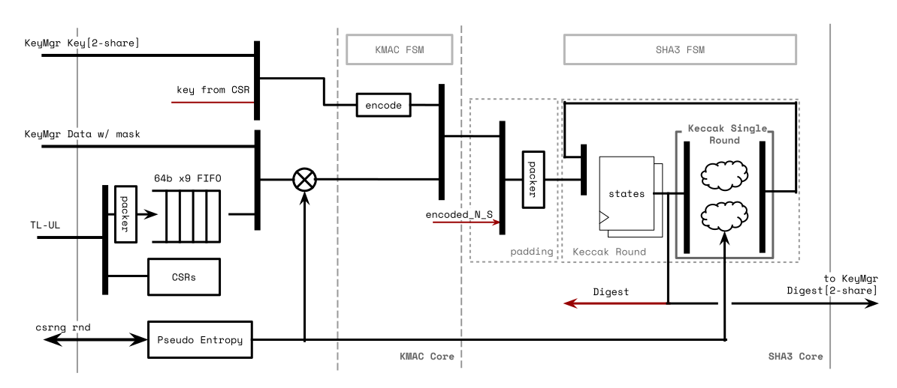
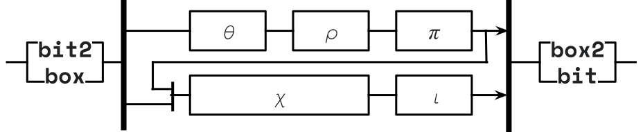
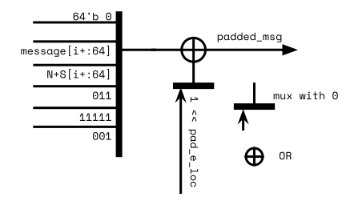
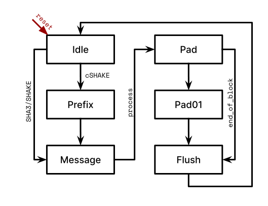
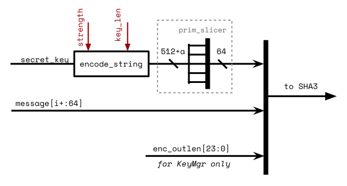
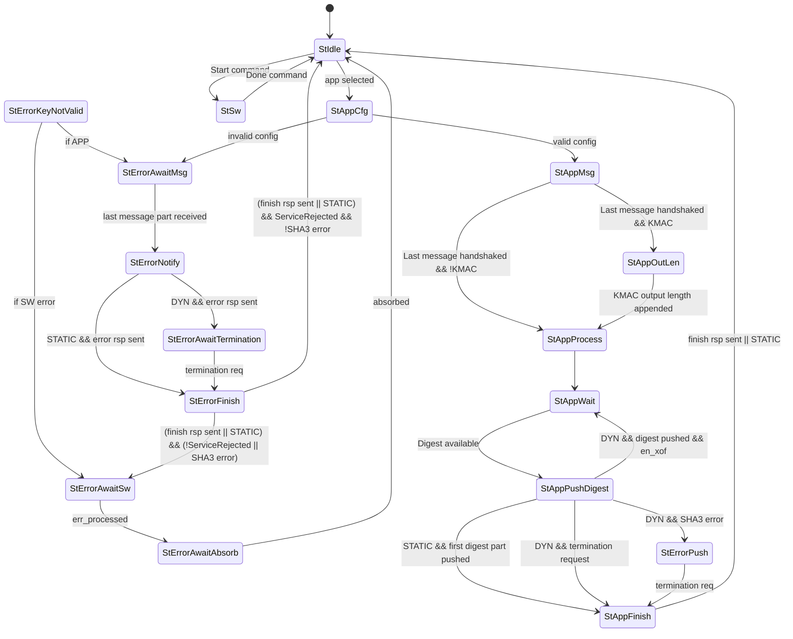

# Theory of Operation

## Block Diagram



The above figure shows the KMAC/SHA3 HWIP block diagram.
The KMAC has register interfaces for SW to configure the module, initiate the hashing process, and acquire the result digest from the STATE memory region.
It also has a sideload interface to the KeyMgr to get a secret key for KMAC operation.
The key is always Boolean masked with two shares.
The IP has N x [application interfaces](#application-interface), which allows other HWIPs to request hashing operations.
An application interface can either be static where the hashing operation is predefined at compile-time or it can be dynamic where the application can select the hashing mode at runtime.

Similar to HMAC, the KMAC HWIP also has a message FIFO (MSG_FIFO) whose depth was determined based on criteria such as the register interface width, its latency, and the latency of the hashing algorithm (Keccak).
Based on the given criteria, the MSG_FIFO depth was determined to store the incoming message while the SHA3 core is in computation.

To support partial writes from SW and an app interface, the MSG_FIFO has a packer in front which packs writes to the size of the internal datapath (64bit).
This frees the software from having to align the messages and it also simplifies the app interface when the message length must be appended (for KMAC operation).
Note that this FIFO is bypassed if the application interface is configured to send the message in shares.

The fed messages go into the KMAC core regardless of KMAC enabled or not.
The KMAC core forwards the messages to SHA3 core in case KMAC hash functionality is disabled.
When performing a KMAC operation, the KMAC core prepends the encoded secret key as described in the SHA3 Derived Functions specification.
It is expected that the software writes the encoded output length at the end of the message.
For hashing operations triggered by an IP through the application interface, the encoded output length is appended inside the AppIntf module in the KMAC HWIP.

There are two ways for a key to be supplied to the KMAC core.
One way is the sideload interface that is connected to the key manager.
The other is to pass the key in two shares with registers ([`KEY_SHARE0`](registers.md#key_share0) and [`KEY_SHARE1`](registers.md#key_share1)).

The software can set [`CFG_SHADOWED.sideload`](registers.md#cfg_shadowed) to use the sideloaded key for the SW and app-initiated KMAC operations.
The key manager always provides the sideloaded key in two-share masked form regardless of the compile-time Verilog parameter `EnMasking`.
If `EnMasking` is false, the KMAC converts the shared key to the unmasked form before the key is used.

The SHA3 core is the main Keccak processing module.
It supports SHA3 hashing functions, SHAKE128, SHAKE256 extended output functions, and also cSHAKE128, cSHAKE256 functions in order to support KMAC operation.
To support multiple hashing functions, it has the padding logic inside.
The padding logic mainly pads the predefined bits at the end of the message and also performs `pad10*1()` function.
If cSHAKE mode is set, the padding logic also prepends the encoded function name `N` and the customization string `S` prior to the incoming messages according to the spec requirements.

Both the internal state width and the masking of the Keccak core are configurable via compile-time Verilog parameters.
By default, 1600 bits of internal state are used and stored in two shares (1st order masking).
The masked Keccak core takes 4 clock cycles per round if sufficient entropy is available.
If desired, the masking can be disabled and the internal state width can be reduced to 25, 50, or 100 bits at compile time.

## Design Details

### Keccak Round

In the KMAC HWIP the Keccak round module is instantiated with a 1600 bit internal state.
Note, this Keccak round implementation not only supports 1600 bit internal states but also all possible values {50, 100, 200, 400, 800, 1600} based on a compile-time Verilog parameter `Width`.
If the compile-time Verilog parameter `EnMasking` is false, disabling masking, then the state width can also be set to 25.

Keccak permutations in the specification allow arbitrary number of rounds.
This module, however, supports Keccak_f which always runs `12 + 2*L` rounds, where $$ L = log_2 {( {Width \over 25} )} $$ .
For instance, 200 bits of internal state run 18 rounds.



Keccak round logic has two phases inside.
Theta, Rho, Pi functions are executed at the 1st phase.
Chi and Iota functions run at the 2nd phase.
If the compile-time Verilog parameter `EnMasking` is not set, i.e., if masking is not enabled, the first phase and the second phase run at the same cycle.

If masking is enabled, the Keccak round logic stores the intermediate state after processing the 1st phase.
The stored values are then fed into the 2nd phase computing the Chi and Iota functions.
The Chi function leverages first-order [Domain-Oriented Masking (DOM)](https://eprint.iacr.org/2017/395.pdf) to deter SCA attacks.

To balance circuit area and SCA hardening, the Chi function uses 800 instead 1600 DOM multipliers but the multipliers are fully pipelined.
The Chi and Iota functions are thus separately applied to the two halves of the state and the 2nd phase takes in total three clock cycles to complete.
In the first clock cycle of the 2nd phase, the first stage of Chi is computed for the first lane halves of the state.
In the second clock cycle, the new first lane halves are output and written to state register.
At the same time, the first stage of Chi is computed for the second lane halves.
In the third clock cycle, the new second lane halves are output and written to the state register.

The 800 DOM multipliers need 800 bits of fresh entropy for remasking.
If fresh entropy is not available, the DOM multipliers do not move forward and the 2nd phase will take more than three clock cycles.
Processing a Keccak_f (1600 bit state) takes a total of 96 cycles (24 rounds X 4 cycles/round) including the 1st and 2nd phases.

If the masking compile time option is enabled, Keccak round logic requires an additional 3200 flip flops to store the intermediate half state inside the 800 DOM multipliers.
In addition to that Keccak round logic needs two sets of the same Theta, Rho, and Pi functions.
As a result, the masked Keccak round logic takes more than twice as much as area than the unmasked version of it.

### Padding for Keccak

Padding logic supports SHA3/SHAKE/cSHAKE algorithms.
cSHAKE needs the extra inputs for the Function-name `N` and the Customization string `S`.
Other than that, SHA3, SHAKE, and cSHAKE share similar datapath inside the padding module except the last part added next to the end of the message.
SHA3 adds `2'b 10`, SHAKE adds `4'b 1111`, cSHAKE adds `2'b00` then `pad10*1()` follows.
All are little-endian values.

Interface between this padding logic and the MSG_FIFO follows the conventional FIFO interface.
So `prim_fifo_*` can talk to the padding logic directly.
This module talks to Keccak round logic with a more memory-like interface.
The interface has an additional address signal on top of the valid, ready, and data signals.



The hashing process begins when the software issues the start command to [`CMD`](registers.md#cmd) .
If cSHAKE is enabled, the padding logic expands the prefix value (`N || S` above) into a block size.
The block size is determined by the [`CFG_SHADOWED.kstrength`](registers.md#cfg_shadowed) .
If the value is 128, the block size will be 168 bytes.
If it is 256, the block size will be 136 bytes.
The expanded prefix value is transmitted to the Keccak round logic.
After sending the block size, the padding logic triggers the Keccak round logic to run a full 24 rounds.

If the mode is not cSHAKE, or cSHAKE mode and the prefix block has been processed, the padding logic accepts the incoming message bitstream and forward the data to the Keccak round logic in a block granularity.
The padding logic controls the data flow and makes the Keccak logic to run after sending a block size.

After the software writes the message bitstream, it should issue the Process command into [`CMD`](registers.md#cmd) register.
The padding logic, after receiving the Process command, appends proper ending bits with respect to the [`CFG_SHADOWED.mode`](registers.md#cfg_shadowed) value.
The logic writes 0 up to the block size to the Keccak round logic then ends with 1 at the end of the block.



After the Keccak round completes the last block, the padding logic asserts an `absorbed` signal to notify the software.
The signal generates the `kmac_done` interrupt.
At this point, the software is able to read the digest in [`STATE`](registers.md#state) memory region.
If the output length is greater than the Keccak block rate in SHAKE and cSHAKE mode, the software may run the Keccak round manually by issuing Run command to [`CMD`](registers.md#cmd) register.

The software completes the operation by issuing Done command after reading the digest.
The padding logic clears internal variables and goes back to Idle state.

### Padding for KMAC



KMAC core prepends and appends additional bitstream on top of Keccak padding logic in SHA3 core.
The [NIST SP 800-185](https://csrc.nist.gov/publications/detail/sp/800-185/final) defines `KMAC[128,256](K, X, L, S)` as a cSHAKE function.
See the section 4.3 in NIST SP 800-185 for details.
If KMAC is enabled, the software should configure [`CMD.mode`](registers.md#cmd) to cSHAKE and the first six bytes of [`PREFIX`](registers.md#prefix) to `0x01204B4D4143` (bigendian).
The first six bytes of [`PREFIX`](registers.md#prefix) represents the value of `encode_string("KMAC")`.

The KMAC padding logic prepends a block containing the encoded secret key to the output message.
The KMAC first sends the block of secret key then accepts the incoming message bitstream.
At the end of the message, the software writes `right_encode(output_length)` to MSG_FIFO prior to issue Process command.

### Message FIFO

The KMAC HWIP has a compile-time configurable depth message FIFO inside.
The message FIFO receives incoming message bitstream regardless of its byte position in a word.
Then it packs the partial message bytes into the internal 64 bit data width.
After packing the data, the logic stores the data into the FIFO until the internal KMAC/SHA3 engine consumes the data.

This FIFO does not support the handling of masked input messages.
For app interfaces providing masked input messages, the FIFO is bypassed.
If the FIFO is bypassed, there is no packer and therefore these apps must always provide full 64-bit messages (except the last message).

#### FIFO Depth calculation

The depth of the message FIFO is chosen to cover the throughput of the software or other producers such as DMA engine.
The size of the message FIFO is enough to hold the incoming data while the SHA3 engine is processing the previous block.
Details are in `kmac_pkg::MsgFifoDepth` parameter.
Default design parameters assume the system characteristics as below:

- `kmac_pkg::RegLatency`: The register write takes 5 cycles.
- `kmac_pkg::Sha3Latency`: Keccak round latency takes 96 cycles, which is the masked version of the Keccak round.

#### Empty and Full status

Under normal operating conditions, the SHA3 engine will process data a lot faster than software can push it to the Message FIFO.
The Message FIFO depth observable from [`STATUS.fifo_depth`](registers.md#status--fifo_depth) will remain **0** while the [`STATUS.fifo_empty`](registers.md#status--fifo_empty) status bit is lowered for one clock cycle whenever software provides new data.

However, if the SHA3 engine is currently busy or if the KMAC block is waiting for fresh entropy from EDN, the Message FIFO may actually run full (indicated by the `fifo_full` status bit).
Resolving these conditions may take hundreds of cycles or more.
After the SHA3 engine starts popping the data again, the Message FIFO will eventually run empty again and the `fifo_empty` status interrupt will fire.
Note that the `fifo_empty` status interrupt will not fire if i) one of the hardware application interfaces is using the KMAC block, ii) the SHA3 core is not in the `Absorb` state, or iii) after software has written the `Process` command.

If software pushes data to the Message FIFO while it is full, the write operation is blocked until there is again space in the FIFO.
This means the processor is effectively stalled.
If the SHA3 engine is currently running and software fills up the Message FIFO, the resulting stall won't take more than 100 clock cycles.
The stall mechanism prevents data loss and the upper bound on the wait time avoids software needing to poll the [`STATUS.fifo_depth`](registers.md#status--fifo_depth) field before writing data.

However, the FIFO can also become full because the KMAC block is waiting for fresh entropy from EDN.
Resolving this condition can take much longer, and it can even result in deadlocking the system if the following conditions are met:
1. Software attempts to push data to the Message FIFO while it is full.
1. The fresh entropy is not delivered and the value of the [`ENTROPY_PERIOD`](registers.md#entropy_period) register is 0, meaning the wait timer never expires.

The entropy not getting delivered in time can in particular happen if the entropy complex or parts of it are disabled, e.g., [to save power](../../csrng/doc/programmers_guide.md#running-csrng-with-entropy_src-disabled).
Refer to [Preventing potential deadlocks in EDN mode](programmers_guide.md#preventing-potential-deadlocks-in-edn-mode) for guidance on how to safely avoid this scenario.


#### Masking

The hashing engine supports a fully masked operation if the `EnMasking` compile-time Verilog parameter is set.
The software, however, can only push unmasked messages into the hashing engine.
The app interfaces operate on either unmasked or masked data, depending on their parameterization.

For all cases, if `EnMasking` is set and [`CFG_SHADOWED.msg_mask`](registers.md#cfg_shadowed) is true, the message is masked (or re-masked) upon loading into the Keccak core using the internal entropy generator.
The secret key is always stored/used in masked form.

If `EnMasking` is not set, masking is disabled and the software has to provide the key in unmasked form.
Any write operations to [`KEY_SHARE1_0`](registers.md#key_share1) - [`KEY_SHARE1_15`](registers.md#key_share1) are ignored.

If `EnMasking` is not set and the `SwKeyMasked` compile-time Verilog parameter is set, software has to provide the key in masked form.
Internally, the design then unmasks the key by XORing the two key shares together when loading the key into the engine.
This is useful when software interface compatibility between the masked and unmasked configuration is desirable.

If `EnMasking` is set, `SwKeyMasked` has no effect: Software must always provide the key in two shares.

### Keccak State Access

After the Keccak round completes the KMAC/SHA3 operation, the contents of the Keccak state contain the digest value.
The software can access the 1600 bit of the Keccak state directly through the window of the KMAC/SHA3 register.

If `EnMasking` is set, the upper 256B of the window is the second share of the Keccak state.
The software can read both of the Keccak state shares and can recover the plain, unmasked digest value by XORing the two shares.
If `EnMasking` is not set, the upper half of the window reads as zero.

The Keccak state is valid after the sponge absorbing process is completed.
While in an idle state or in the sponge absorbing stage, the value is zero.
This ensures that the logic does not expose the secret key XORed with the keccak_f results of the prefix to the software.
In addition to that, the KMAC/SHA3 blocks the software access to the Keccak state when it processes the request from KeyMgr for Key Derivation Function (KDF).

### Application Interfaces

The IP has a number of instances of an application interface.
Each of these interfaces can be either static or dynamic, which is defined at compile time.
A static interface has the hashing operation defined as a compile-time parameter in its `kmac_pkg::AppCfg` struct and only a fixed digest length is returned.
A dynamic interface can specify the hashing operation at runtime and supports XOF operation (eXtendable Output Function), so an unlimited digest size can be retrieved.

In the current version of this IP, there are the following application interfaces implemented:

| Index | App      | Type    | Algorithm | Prefix for cSHAKE / KMAC |
|-------|----------|---------|-----------|------------|
| 0     | KeyMgr   | Static  | KMAC      | "KMAC"     |
| 1     | LC_CTRL  | Static  | cSHAKE128 | "LC_CTRL"  |
| 2     | ROM_CTRL | Static  | cSHAKE256 | "ROM_CTRL" |
| 3     | OTBN     | Dynamic | Dynamic   | "KMAC" for KMAC mode, otherwise the prefix is taken from the `PREFIX` CSRs. |

#### Interface channels
The interface operates with two channels, each with a valid/ready handshake.
The request channel is used by the apps to initiate and control a session and also to send the message.
Once a digest is computed, the KMAC sends it back over the response channel.
The signals of the channels are described below.

| Channel  | Signal       | Description |
|----------|--------------|-------------|
| Request  | `req_valid`  | The valid signal of the request channel. |
| Request  | `data_s0`    | The first share of the message data. |
| Request  | `data_s1`    | The second share of the message data. |
| Request  | `strb`       | The byte-level strobe for the message. Either all-ones, all-zeros (empty message) or a LSB-aligned contiguous mask. |
| Request  | `req_last`   | A flag to signal the end of the message or session. |
| Request  | `req_ready`  | The ready signal of the request channel. |
| Response | `rsp_valid`  | The valid signal of the response channel. |
| Response | `digest_s0`  | First share of the digest data. |
| Response | `digest_s1`  | Second share of the digest data. |
| Response | `error`      | A flag which is set if there was an error and the receiver should discard the digest. |
| Response | `rsp_finish` | A flag which is set to indicate that it is the last response of the session. |
| Response | `rsp_ready`  | The ready signal of the response channel. |

#### Configuration
The type and functionality of an interface are configured by a struct of type `app_config_t`.
The configuration options are listed in the following table.
For a more detailed description see the type definition.
Any parameter marked as 'Session' can be configured by a dynamic interface at runtime for each hashing session.
For static interfaces, these parameters are also fixed at compile time.
Note that the output length for a KMAC operation is the same as the `digest_sx` signal width (`AppDigestW`).

| Parameter       | Validity | Description |
|-----------------|----------|-------------|
| `if_type`       | Static   | Selects the type of the interface. Either `static` or `dynamic`. |
| `masked`        | Static   | Defines whether the message comes in shares or not. If `EnMasking` is enabled and `masked` is 1, both shares are forwarded as are. If `EnMasking` is disabled and `masked` is 1, the shares are XORed. If `masked` is 0, `data_s1` is ignored. |
| `prefix`        | Static   | A compile-time defined prefix used for cSHAKE or KMAC operations. See `prefix_mode` for when this value is used. |
| `en_unsup_comb` | Static   | If 1, non-standard combinations of `mode` and `kstrength` are supported for this interface. Otherwise a non-standard combination will result in a service rejected error. |
| `prefix_mode`   | Static   | The `prefix_mode` determines whether to take the prefix from the CSR or use the hardcoded prefix. For static interfaces, if `prefix_mode` is 1, the `prefix` will be used for both cSHAKE and KMAC operations. If 0, the CSR value is used. For dynamic interfaces, `prefix_mode` has no effect. Independently of the value, if the `mode` is cSHAKE, the CSR prefix is used. If the mode is KMAC, the compile-time value is used. |
| `mode`          | Session  | The hashing mode which is performed. |
| `kstrength`     | Session  | The strength of the selected `mode`. Not to be confused with the output length of a hashing operation. |
| `en_xof`        | Session  | If 1, the app interface will automatically trigger a RUN command once it has pushed the full rate on the response channel. If 0, no squeeze can be performed at all. Usually enabled for SHAKE and cSHAKE and disabled for SHA3 and KMAC. Has no effect on static interfaces. |

The session configuration is sent as the first message request and the configuration values are read from `data_s0` as defined by the struct `app_ses_config_t`.

In addition to the static and session configuration, SW must configure the KMAC HWIP before an app uses its interface.
The relevant CSRs / Fields are:
- `Prefix`
  - See `prefix_mode` configuration for when this CSR is relevant.
- `CFG_SHADOWED.entropy_ready`
- `CFG_SHADOWED.entropy_mode`
- `CFG_SHADOWED.entropy_fast_process`
- `CFG_SHADOWED.sideload`
- `CFG_SHADOWED.msg_mask`
  - Whether masking is performed or not.
    Must be set if `masked` is set in the configuration.

See the KMAC [register description](./registers.md) for more details.
These configuration values are left to the SW as setting these requires system state knowledge, i.e., whether entropy is available or not.

#### Message and digest datapath
The image below depicts the message data path and its related control signals.


The compile-time parameter `EnMasking` and the static parameter `masked` control whether the message FIFO is used or bypassed.
The FIFO is used unless `EnMasking` and `masked` are both set in which case the FIFO is bypassed.

For both types of interface, messages other than the last are sent using the full width of the `data_s0` / `data_s1` width.
See the operation principle section for more details about the last message.

Although the message requests make full use of the `data_s0` / `data_s1` signal width (`MsgWidth`), the returned digest size depends on the interface's `if_type`.
A static interface response uses the full width of the `digest_s0` / `digest_s1` signals (`AppDigestW`) which allows it to transfer the full digest in one response beat.
For dynamic interfaces, the response carries smaller digest parts (`DynAppDigestW`) and only the upper bits of the `digest_s0` / `digest_s1` are invalid.
This width is chosen so that it divides the response width for most supported mode and strength combinations, especially for XOF operation.
This allows the interface not to use a strobe signal.
Doing so simplifies response handing in the receiver and it also reduces the area required if the interface is pipelined.

The number of digest responses can be computed from the selected mode and strength.
For SHA3, the number of responses is `Strength / DynAppDigestW = Strength / 64`.
Note, for SHA3-224 this does not divide properly.
As such, the interface sends back 4 responses where the last one contains some bits which must be ignored.

For SHAKE, cSHAKE and KMAC the standard defines the `StateWidth` to be 1600 bits (Same as SHA3) and these algorithms produce `StateWidth - 2 * Strength` bits of digest per squeeze.
A dynamic app interface then returns this digest data in `(StateWidth - 2 * Strength) / DynAppDigestW` responses.
For example, when performing a SHAKE128 operation, the interface sends `(1600 - 2*128) / 64 = 21` response beats before it triggers a RUN command.

Digest parts are always returned in two shares.
The `masked` parameter affects only the message path.
If `EnMasking` is not active, the second share is set to `'0`.

#### Operation principle
The app interface follows the same command order (START, PROCESS, RUN, DONE) as software but commands are implicitly send with message requests.
An FSM inside the app interface controls the hashing operation.
Its state diagram is shown below and the following text explains how an app can use the interface.
The transitions into error states from an invalid key or a hashing engine error (SHA3 error) are not drawn: see error handling section.

Any app starts a session by placing its first request.
More than one app can have a session request active at a particular time.
The interface uses a fixed priority to arbitrate between multiple outstanding requests.

The sequence of requests for a static app is just its sequence of message words.
A dynamic app sends the message words after sending a request carrying its desired session configuration.
When starting a session for a dynamic app, the interface checks the requested configuration.
For both types of interfaces, if the hashing operation is KMAC, the interface also checks that the `entropy_ready` bit is 1.

If the configuration is not valid, a service rejected error is raised, see error handling section.
If the configuration is valid, the message requests are forwarded to the hashing engine.
This engine then starts absorbing, depending on the hashing mode, the key and the prefix data.
Afterwards it starts absorbing messages from the app interface.

An app must send the full message split up into message requests which make use of the full width.
This means `strb` must be all ones.
An exception is the last message part, which can be less than the full width of the interface.
Sending this last message part is closely related to how the message phase is ended.
There are two ways for an app to terminate the message phase.
In both cases there must be at most one request which has `req_last` asserted.

- Termination on the last data beat
  - The app sets `req_last` on the beat that carries the final data bytes.
  - The strobe on this beat may be partial or zero.
    Its value must always be contiguous and lsb-aligned.
  - A strobe of zero means no bytes are valid, representing an empty message.
- Termination with an explicit empty message
  - The app sends all data beats without ever setting `req_last`.
  - The last beat carrying data is allowed to have a partial strobe which must be contiguous and lsb-aligned (a strobe of zero would be the same as the first option).
  - The app then sends a single empty message (`req_last = 1`, `strb = '0`) to explicitly ending the message phase.
  - Once a partial beat has been sent without `req_last` asserted, no further data beats are permitted.

In any case, a message request with `req_last = 1` causes the state machine to end the message phase.
It then starts to append the encoded output length if the hashing mode is KMAC.
This encoded output length is hard coded to `AppDigestW` which is also the size of the `digest_s0` / `digest_s1` signals.

After the message is completely pushed into the KMAC core (or after the encoded output length if in KMAC mode), the interface logic issues a PROCESS command to run the hashing logic.

Once the hashing operation has completed, the app interface starts to send a digest on the response channel.
Unlike as when SW initiates a hashing operation, the KMAC HW IP does not produce a `kmac_done` interrupt at this point.

For a static app, one full digest is sent (handshaked) and the app interface returns back to its idle state.

For a dynamic app, the interface starts to push the full rate of the hashing operation in `DynAppDigestW` sized responses.
The app can exert back pressure on the response channel to control how fast it consumes the digest data.
If `en_xof` is false, the operation is complete once the full digest has been sent.
The interface will just wait for a termination request.
If `en_xof` is true, the interface automatically sends a RUN command to the hashing engine after sending the first full digest.
It then waits until the new digest is available and begins to push responses again.
After each full digest is sent, the interface will send another RUN command to the hashing engine and repeat.

When the app has received the desired amount of responses, it should send another "message" request with the `req_last` signal asserted.
This termination request tells the interface to stop sending digest responses and it will issue a DONE command to the hashing engine.
One final finish response (`rsp_finish=1`) is sent to the app to acknowledge the end of the session.
Once the app has sent the termination request it must make sure to drain the (pipelined) response channel until the finish response is received.
Once the interface has sent the finish response, it will return to its idle state, ready to serve the next app request.

When the app receives the finish response, it must check it for errors.
The reason is that there could have been an error in the last digest but this was not reported immediately to satisfy to the valid locked-in property (valid locked-in means that once the valid is asserted, the data signals may not change until the handshake happened).

In case `en_xof` is disabled, once the first full digest is sent, the interface will just wait for a termination request and not trigger any RUN commands.


```mermaid
stateDiagram-v2
[*] --> StIdle

StIdle --> StAppCfg: app selected
StIdle --> StSw: Start command

StSw --> StIdle: Done command

StAppCfg --> StAppMsg: valid config

StAppMsg --> StAppProcess: Last message handshaked && !KMAC
StAppMsg --> StAppOutLen: Last message handshaked && KMAC
StErrorKeyNotValid --> StErrorAwaitMsg: if APP

StAppCfg --> StErrorAwaitMsg: invalid config
StAppOutLen --> StAppProcess: KMAC output length appended

StAppProcess --> StAppWait

StAppWait --> StAppPushDigest: Digest available

StAppPushDigest --> StAppWait:   DYN && digest pushed && en_xof
StAppPushDigest --> StAppFinish: STATIC && first digest part pushed
StAppPushDigest --> StAppFinish: DYN && termination request

StAppFinish --> StIdle: finish rsp sent || STATIC

StErrorKeyNotValid --> StErrorAwaitSw: if SW error

StErrorAwaitMsg --> StErrorNotify: last message part received
StErrorNotify --> StErrorAwaitTermination: DYN && error rsp sent
StErrorNotify --> StErrorFinish: STATIC && error rsp sent
StErrorAwaitTermination --> StErrorFinish: termination req

StErrorFinish --> StIdle: (finish rsp sent || STATIC) && ServiceRejected && !SHA3 error
StErrorFinish --> StErrorAwaitSw: (finish rsp sent || STATIC) && (!ServiceRejected || SHA3 error)

StErrorAwaitSw --> StErrorAwaitAbsorb: err_processed

StErrorAwaitAbsorb --> StIdle: absorbed

StAppPushDigest --> StErrorPush: DYN && SHA3 error

StErrorPush --> StAppFinish: termination req

```

#### Example operation

For a SHAKE operation via a dynamic interface instance the interactions look like shown in the waves below.
First, the app sends a request with the configuration.
Once the interface has accepted the request, the app starts sending message parts until in cycle 4 the last message part is sent.
KMAC HWIP then starts processing the data and once finished it starts to send back digest data (states AppProcess and AppWait).
This happens in cycle 7 below (in reality, it takes around 100 cycles).
Once the app has received 2 digest parts, it deasserts `rsp_ready` (cycle 9) and sends the session end request (cycle 10).
The app then must drain the response channel (cycle 10) and must wait for the finish response to arrive which is sent in cycle 11.

```wavejson
{
  signal: [
    {name: 'App state',  wave: '2.22.222...22', data: ["Idle","AppCfg","AppMsg","AppProcess","AppWait","AppPushDigest","AppFinish","Idle"]},
    {},
    ['Request',
    {name: 'req_valid',  wave: '01...0....10.'},
    {name: 'data_s0',    wave: 'x2.22x.......', data: ["config"]},
    {name: 'data_s1',    wave: 'x..22x.......'},
    {name: 'strb',       wave: 'x..22x.......', data: ["","0xFF","0x03"]},
    {name: 'req_last',   wave: 'x0..1x....1x.'},
    {name: 'req_ready',  wave: '0.1..0....10.'},
    ],
    {},
    ['Response',
    {name: 'rsp_valid',  wave: '0......1....0'},
    {name: 'digest_s0',  wave: 'x......222.x.'},
    {name: 'digest_s1',  wave: 'x......222.x.'},
    {name: 'error',      wave: 'x......0....x'},
    {name: 'rsp_finish', wave: 'x......0...1x'},
    {name: 'rsp_ready',  wave: '1........01.0'},
    ],
  ],
  edge: [],
  foot:{
   tock:0
 },
 config:{hscale:2},
}
```

If the app requires more digest parts than a complete rate (in this example 3), a RUN command is automatically triggered by the interface.
Note, this example starts when the last message is received and the app stalls the response in cycle 4 for one cycle.

```wavejson
{
  signal: [
    {name: 'App state',  wave: '2222...2.2..2', data: ["AppMsg","AppProcess","AppWait","AppPushDigest","AppWait","AppPushDigest","AppWait"]},
    {},
    ['Request',
    {name: 'req_valid',  wave: '10...........'},
    {name: 'data_s0',    wave: '2x...........', data: [""]},
    {name: 'data_s1',    wave: '2x...........'},
    {name: 'strb',       wave: '2x...........', data: ["0x03"]},
    {name: 'req_last',   wave: '1x...........'},
    {name: 'req_ready',  wave: '10...........'},
    ],
    {},
    ['Response',
    {name: 'rsp_valid',  wave: '0..1...0.1..0'},
    {name: 'digest_s0',  wave: 'x..22.2x.222x'},
    {name: 'digest_s1',  wave: 'x..22.2x.222x'},
    {name: 'error',      wave: 'x..0...x.0..x'},
    {name: 'rsp_finish', wave: 'x..0...x.0..x'},
    {name: 'rsp_ready',  wave: '1...01.......'},
    ],
  ],
  edge: [],
  foot:{
   tock:0
 },
 config:{hscale:2},
}
```

#### Error handling

The following errors can occur when an app is active:

- Terminal state error
- Service rejected error
- Key invalid error
- SHA3 engine command error

The handling of these errors is described below.

Note, the `WaitTimerExpired` error is not handled by an app interface.
The reason is that it is planned to rework when the entropy engine places EDN requests such that this error cannot occur during a hashing operation.

##### Terminal state error
This error occurs if an FSM in the interface entered its terminal error state because one of the following is true:
- The escalate_i signal is asserted.
- The FSM itself entered an invalid state.

The terminal error state leads to a fatal alert which will result in a chip reset.
As such, this error case does not need to end the app session gracefully.

##### Service rejected error
This error occurs when the configuration is invalid (only for a dynamic interface) or a KMAC operation is requested when the entropy is not ready.
If the app interface rejects an application request, it enters `StErrorAwaitMsg` and the messages from the application are still accepted but directly discarded.
After such an error, no data is sent to the hashing engine until the next session.
After the last message request, the app interface then immediately sends a response with the error flag set.
The data values in this response have no meaning.
A static interface then directly returns into the Idle state without waiting for SW to set the `error_processed` bit.
A dynamic interface waits until a termination request is received and answers with a finish acknowledgment response.
If any other request is sent, the interface will deadlock as it only accepts termination requests in this state.
This finish response has the error bit reset (= 0) indicating that another operation is possible.
After sending the finish response, the interface also immediately returns to the Idle state.
The reason for immediately returning to Idle is to support the case where an app tries to use KMAC before SW is loaded.
If in this case the entropy is not ready yet the app can try again at a later point in time.

The diagram below shows an example for a dynamic interface (note the response backpressure cycles, these are optional).

```wavejson
{
  signal: [
    {name: 'App state',  wave: '222..2.2.2.2', data: ["Idle","AppCfg","ErrorAwaitMsg","ErrorNotify","ErrorAwaitTermination","ErrorFinish","Idle"]},
    {},
    ['Request',
    {name: 'req_valid',  wave: '1....0..10..'},
    {name: 'data_s0',    wave: '2..22x......'},
    {name: 'data_s1',    wave: '2..22x......'},
    {name: 'strb',       wave: '2...2x......', data: ["0xFF","0x03"]},
    {name: 'req_last',   wave: '0...1x..1x..'},
    {name: 'req_ready',  wave: '0.1..0.1.0..'},
    ],
    {},
    ['Response',
    {name: 'rsp_valid',  wave: '0....1.0.1.0'},
    {name: 'digest_s0',  wave: 'x....2.x....'},
    {name: 'digest_s1',  wave: 'x....2.x....'},
    {name: 'error',      wave: 'x1.....x.0.x'},
    {name: 'rsp_finish', wave: 'x......x.1.0'},
    {name: 'rsp_ready',  wave: '0.....10..10'},
    ],
  ],
  edge: [],
  foot:{
   tock:0
 },
 config:{hscale:2},
}
```

#### Key invalid error
This error occurs if the sideloaded key is used but the key is invalid.
The sideloaded key is considered as used when either SW has full control over the KMAC or for an app session from the start of the message absorption phase (`StAppMsg`) until the digest is valid (the processing has finished, `StAppPushDigest`).

There are three cases to consider:
- The key is already invalid when starting the operation because SW didn't configure the KeyMgr correctly.
- The key gets invalidated before the interface sent the PROCESS command.
- The key gets invalidated after the interface sent the PROCESS command.

In case 1 & 2 the interface transitions into the `StErrorAwaitMsg` state as soon as the key is detected as invalid (when entering the message phase).
The app interface then no longer forwards message requests to the hashing engine.
Similar to the service rejected error, the interface still accepts all the message requests but discards the data.
Once the last message has arrived, a static app interface sends an error response (garbage digest with the `error` signal set).
A dynamic interface also sends an immediate error response but then waits until a termination request arrives.
The termination request is then answered with a finish response which has the error flag set (= 1).
Both interface types then wait for SW to acknowledge the error by writing to the `error_processed` bit.
Once SW has cleared the error, the interface then triggers a PROCESS command to bring the hashing engine back into the idle state.

Case 3: If the key gets invalidated after the interface has sent the PROCESS command (i.e., if in `StAppProcess` or `StAppWait`) the message is already complete and the PROCESS command may not be issued again.
The app interface still sends the error response and a dynamic interface waits for the termination request which it responds to with a finish response which has the error flag set (= 1).
Finally, both types of interfaces wait for the SW acknowledgement.
Once acknowledged, the interface waits until the already issued PROCESS command has finished and finally returns to Idle.

Note, the acknowledge of the software can also happen before the app accepted the response.
In case the KMAC is controlled by SW, the app related states are skipped.

The following wave shows an example (case 2) where the key invalid error occurs in cycle 4.

```wavejson
{
  signal: [
    {name: 'App state',  wave: '2222.22.22.2.2', data: ["Idle","AppCfg","AppMsg","ErrorAwaitMsg","ErrorNotify","ErrorAwaitTermination","ErrorFinish","ErrorAwaitSw","ErrorWaitAbsorbed","Idle"]},
    {},
    ['Request',
    {name: 'req_valid',  wave: '1....0.10.....'},
    {name: 'data_s0',    wave: '2..22x........'},
    {name: 'data_s1',    wave: '2..22x........'},
    {name: 'strb',       wave: '2...2x........', data: ["0xFF","0x03"]},
    {name: 'req_last',   wave: '0...1x.10.....'},
    {name: 'req_ready',  wave: '0.1..01.0.....'},
    ],
    {},
    ['Response',
    {name: 'rsp_valid',  wave: '0....10.10....'},
    {name: 'digest_s0',  wave: 'x....2x.......'},
    {name: 'digest_s1',  wave: 'x....2x.......'},
    {name: 'error',      wave: 'x..1..x.1x....'},
    {name: 'rsp_finish', wave: 'x....0x.10....'},
    {name: 'rsp_ready',  wave: '0....10.10....'},
    ],
    {},
    {name: 'error_processed_i', wave: '0.........10..'}
  ],
  edge: [],
  foot:{
   tock:0
 },
 config:{hscale:2},
}
```

#### SHA3 engine internal error
This error arises if an invalid command sequence is sent to the hashing engine or one of these control signals is manipulated.
Usually this error cannot occur during an app session.
However, if the control signals are faulted, this error occurs and any digest value should be considered as invalid.

This error must be handled in two cases, namely:
- The error occurs in the message phase.
- The error occurs after the complete message is received.

The first case is simple and is handled the same way as a key invalid error.
Once the error occurs, the message data is voided.
As soon as the complete message is received the hashing engine is brought back to idle by issuing a process and done command.
There is only one error response sent and a dynamic interface waits for the termination request.
It then waits for SW to acknowledge the error.

If the error occurs after the complete message is received, the behavior depends on the interface type.
A static interface continues to process the message and simply sets the error flag for the digest response.
Once the digest response is sent it then waits for SW to acknowledge the error.

A dynamic interface begins to continuously send error responses once the message is processed.
It continues to send error responses until a termination request arrives.
The interface then sends a finish response with the error flag set (= 1) and returns back to idle without waiting for SW to process the error.
The finish response must have set the error flag so that errors occurred during the last digest handshake are still propagated.

The following wave shows an example for a dynamic interface where the error occurs in cycle 4 / after the complete message is received.
```wavejson
{
  signal: [
    {name: 'App state',  wave: '2222.2..22', data: ["AppMsg","AppProcess","AppWait","AppPushDigest","ErrorPush","AppFinish","Idle"]},
    {},
    ['Request',
    {name: 'req_valid',  wave: '10.....10.'},
    {name: 'data_s0',    wave: '2x........', data: [""]},
    {name: 'data_s1',    wave: '2x........'},
    {name: 'strb',       wave: '2x........', data: ["0x03"]},
    {name: 'req_last',   wave: '1x.....1x.'},
    {name: 'req_ready',  wave: '10.....10.'},
    ],
    {},
    ['Response',
    {name: 'rsp_valid',  wave: '0..1.....0'},
    {name: 'digest_s0',  wave: 'x..22x..2x'},
    {name: 'digest_s1',  wave: 'x..22x..2x'},
    {name: 'error',      wave: 'x..0.1...x'},
    {name: 'rsp_finish', wave: 'x..0....1x'},
    {name: 'rsp_ready',  wave: '1.........'},
    ],
  ],
  edge: [],
  foot:{
   tock:0
 },
 config:{hscale:2},
}
```

### Entropy Generator

This section explains the entropy generator inside the KMAC HWIP.

KMAC has an entropy generator to provide the design with pseudo-random numbers while processing the secret key block.
The entropy is used for both remasking the DOM multipliers inside the Chi function of the Keccak core as well as for masking the message if [`CFG_SHADOWED.msg_mask`](registers.md#cfg_shadowed) is enabled.

The entropy generator is constructed using a [heavily unrolled Bivium stream cipher primitive](https://eprint.iacr.org/2023/1134).
This allows the module to generate 800 bits of fresh, pseudo-random numbers required by the 800 DOM multipliers for remasking in every clock cycle.

Depending on [`CFG_SHADOWED.entropy_mode`](registers.md#cfg_shadowed), the entropy generator fetches initial entropy from the [Entropy Distribution Network (EDN)][edn] module or software has to provide a seed by writing the [`ENTROPY_SEED`](registers.md#entropy_seed) register 9 times.
The module periodically refreshes the PRNG seed with fresh entropy from EDN.
Software can explicitly request a complete reseed of the PRNG state from EDN through [`CMD.entropy_req`](registers.md#cmd).

[edn]: ../../edn/README.md

### Error Report

This section explains the errors KMAC HWIP raises during the hashing operations, their meanings, and the error handling process.

KMAC HWIP has the error checkers in its internal datapath.
If the checkers detect errors, whether they are triggered by the SW mis-configure, or HW malfunctions, they report the error to [`ERR_CODE`](registers.md#err_code) and raise an `kmac_error` interrupt.
Each error code gives debugging information at the lower 24 bits of [`ERR_CODE`](registers.md#err_code).

Value | Error Code | Description
------|------------|-------------
0x01  | KeyNotValid | In KMAC mode with the sideloaded key, the IP raises an error if the sideloaded secret key is not ready.
0x02  | SwPushedMsgFifo | MsgFifo is updated while not being in the Message Feed state.
0x03  | SwIssuedCmdInAppActive | SW issued a command while the application interface is being used
0x04  | WaitTimerExpired | EDN has not responded within the wait timer limit.
0x05  | IncorrectEntropyMode | When SW sets `entropy_ready`, the `entropy_mode` is neither SW nor EDN.
0x06  | UnexpectedModeStrength | SHA3 mode and Keccak Strength combination is not expected.
0x07  | IncorrectFunctionName | In KMAC mode, the PREFIX has the value other than `encoded_string("KMAC")`
0x08  | SwCmdSequence | SW does not follow the guided sequence, `start` -> `process` -> {`run` ->} `done`
0x09  | SwHashingWithoutEntropyReady | SW requests KMAC op without proper config of Entropy in KMAC. This error occurs if KMAC IP masking feature is enabled.
0x80  | Sha3Control | SW may receive Sha3Control error along with `SwCmdSequence` error. Can be ignored.

#### KeyNotValid (0x01)

The `KeyNotValid` error is raised in the application interface module.
When a KMAC application requests a hashing operation, the module checks if the sideloaded key is ready.
If the key is not ready, the module reports `KeyNotValid` error and moves to dead-end state and waits the IP reset.

This error does not provide any additional information.

#### SwPushedMsgFifo (0x02)

The `SwPushedMsgFifo` error happens when the Message FIFO receives TL-UL transactions while the application interface is busy.
The Message FIFO drops the request.

The IP reports the error with an info field.

Bits    | Name        | Description
--------|-------------|-------------
[23:16] | reserved    | all zero
[15:8]  | kmac_app_st | KMAC_APP FSM state.
[7:0]   | mux_sel     | Current APP Mux selection. 0: None, 1: SW, 2: App

#### SwIssuedCmdInAppActive (0x03)

If the SW issues any commands while the application interface is being used, the module reports `SwIssuedCmdInAppActive` error.
The received command does not affect the Application process.
The request is dropped by the KMAC_APP module.

The lower 3 bits of [`ERR_CODE`](registers.md#err_code) contains the received command from the SW.
#### WaitTimerExpired (0x04)

The timer values set by SW is internally used only when pending EDN request is completed.
Therefore, dynamically changing wait timer cannot be used as a way to poke the timer out of a stalling EDN request.
If a non-zero timer expires, the module cancels the transaction and reports the `WaitTimerExpired` error.

When this error happens, the state machine in KMAC_ENTROPY module moves to Wait state.
In that state, it keeps using the pre-generated entropy and asserting the entropy valid signal.
It asserts the entropy valid signal to complete the current hashing operation.
If the module does not complete, or flush the pending operation, it creates the back pressure to the message FIFO.
Then, the SW may not be able to access the KMAC IP at all, as the crossbar is stuck.

The SW may move the state machine to the reset state by issuing [`CMD.err_processed`](registers.md#cmd).

#### IncorrectEntropyMode (0x05)

If SW misconfigures the entropy mode and let the entropy module prepare the random data, the module reports `IncorrectEntropyMode` error.
The state machine moves to Wait state after reporting the error.

The SW may move the state machine to the reset state by issuing [`CMD.err_processed`](registers.md#cmd).

#### UnexpectedModeStrength (0x06)

When the SW issues `Start` command, the KMAC_ERRCHK module checks the [`CFG_SHADOWED.mode`](registers.md#cfg_shadowed) and [`CFG_SHADOWED.kstrength`](registers.md#cfg_shadowed).
The KMAC HWIP assumes the combinations of two to be **SHA3-224**, **SHA3-256**, **SHA3-384**, **SHA3-512**, **SHAKE-128**, **SHAKE-256**, **cSHAKE-128**, and **cSHAKE-256**.
If the combination of the `mode` and `kstrength` does not fall into above, the module reports the `UnexpectedModeStrength` error.

However, the KMAC HWIP proceeds the hashing operation as other combinations does not cause any malfunctions inside the IP.
The SW may get the incorrect digest value.

#### IncorrectFunctionName (0x07)

If [`CFG_SHADOWED.kmac_en`](registers.md#cfg_shadowed) is set and the SW issues the `Start` command, the KMAC_ERRCHK checks if the [`PREFIX`](registers.md#prefix) has correct function name, `encode_string("KMAC")`.
If the value does not match to the byte form of `encode_string("KMAC")` (`0x4341_4D4B_2001`), it reports the `IncorrectFunctionName` error.

As same as `UnexpectedModeStrength` error, this error does not block the hashing operation.
The SW may get the incorrect signature value.

#### SwCmdSequence (0x08)

The KMAC_ERRCHK module checks the SW issued commands if it follows the guideline.
If the SW issues the command that is not relevant to the current context, the module reports the `SwCmdSequence` error.
The lower 3bits of the [`ERR_CODE`](registers.md#err_code) contains the received command.

This error, however, does not stop the KMAC HWIP.
The incorrect command is dropped at the following datapath, SHA3 core.
