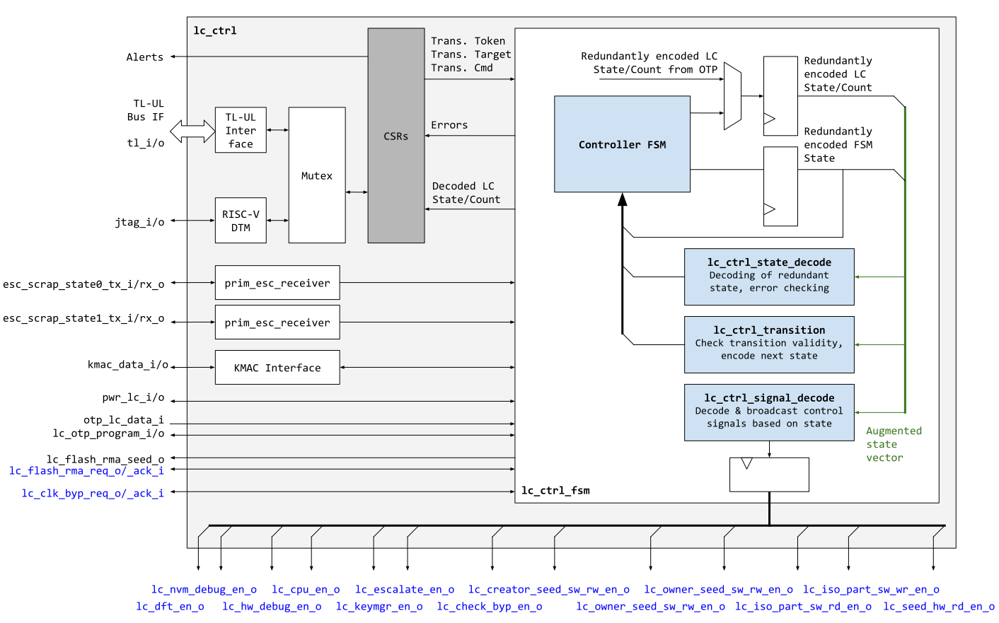
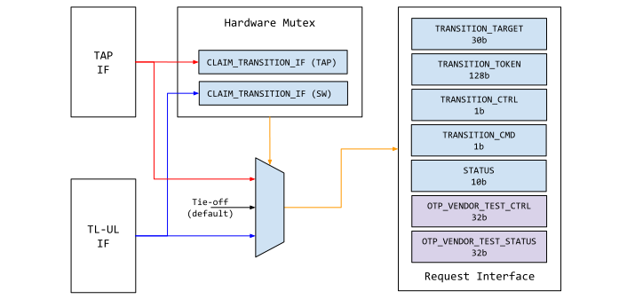

# Overview

This document specifies the functionality of the life cycle controller.
The life cycle controller is a module that is a peripheral on the chip interconnect bus, and thus follows the [Comportability Specification]().
For the high-level description of the life cycle architecture of OpenTitan, please refer to the [Device Life Cycle Spec]().
The life cycle implementation refers to the design that encompasses all life cycle functions.
This touches on the functionality of the following modules, listed in no particular order:
- The life cycle controller itself - A new peripheral
- The key manager
- The flash controller
- The OTP controller
- The reset / power controller
- The debug infrastructure, specifically TAP isolation
- Any other peripheral where life cycle information may alter its behavior

## Features

The life cycle controller provides the following features:
- Dedicated OTP interface to read and update the redundantly encoded device life cycle state.
- A CSR and a JTAG interface for initiating life cycle transitions.
- Dedicated concurrent decoding of the redundant life cycle state and broadcasting of redundantly encoded life cycle qualification signals (e.g., to enable DFT features or the main processor).
- A token hashing and matching mechanism to guard important life cycle transitions.
- An escalation receiver for the alert subsystem, which allows to invalidate the life cycle state as part of an escalation sequence (see also [alert handler subsystem]()).

## Prelude - Why Not Software?

There are many ways to implement life cycle functions in a design.
This document opts for a more hardware driven approach, although there is still significant software hand holding required.

The question must be asked then, why not make it a completely software driven approach?
The life cycle states can be maintained simply as OTP variables, and ROM or a subsequent software stage can be responsible for choosing all subsequent behaviors.

There are a few reasons:
- This document strives to keep critical security functionality in hardware - either real gates or ROM.
- This document aims to keep the ROM as simple as required and not give it too much functionality.
Simple here refers to secure boot verification and jump.
- There is a life cycle escalation mechanism that temporarily alters the state when security vulnerabilities are detected.
It is difficult to manage this kind of fast escalation in software in our working model.
It is more suitable in hardware.
- Advancing life cycle state sometimes must be done in the absence of software for a variety of reasons; thus having a small piece of hardware that understands what to do is simpler than placing restrictions on the entire CPU / memory complex.
- As can be seen from this document, the hardware additions are small and non-complicated.

# Theory of Operations

The following sections give an overview of the life cycle function.
It begins with life cycle sensing at power up, progresses through how life cycle transitions are made, and then focuses specifically on how life cycle impacts various functionality of the design.

## Power Up Sequence

Upon power up, the life cycle controller will default to "RAW" state and wait for the OTP controller to initialize and sense the contents of the [life cycle partition]().
When the OTP is ready, the life cycle controller reads the contents of the life cycle partition, decodes the life cycle state and updates its internal state to match.
This implies that unlike the life cycle definition diagram, there is a one-time "RAW to any state" logical transition that is implicit within the implementation.
Note during OTP sensing, the life cycle controller does not perform any redundant checks upon the value it reads; instead that responsibility is allocated to the OTP controller.

Once the state values are correctly sensed, the life cycle controller performs checks on state consistency and dependencies, and if correct, broadcasts both the raw state value as well as the decoded functional outputs to the rest of the device.

Once the broadcast is complete and signals stable, modules held under reset by ["sys_rst_n"]() are then released from reset to begin mission mode operations (this includes the processor).
Note this point is also when it is safe for DFT to commence operations, as DFT functions may be blocked until life cycle completes its broadcast.

The following diagram illustrates this power-up sequence.
Note the sequence is not designed into one specific module, but rather a result of coordination between the OTP controller, life cycle controller and the reset / power controllers.

## Normal Operation

Once the life cycle system is powered up and stable, its outputs remain static unless specifically requested to change or affected by security escalation.
The life cycle controller can accept [change requests]() from software as well as external entities.

### Unconditional Transitions

For unconditional transitions, the life cycle controller advances the state by requesting an OTP update to the OTP controller.
Once the programming is confirmed, the life cycle controller reports a success to the requesting agent and waits for the device to reboot.

### Conditional Transitions

For conditional transitions, such as those that require a token (RAW_UNLOCK, TEST_UNLOCK, TEST_EXIT, RMA_UNLOCK), the life cycle controller advances the state via OTP programming only after it is supplied with the valid token.
[Some tokens]() are hardcoded design constants, while others are stored in OTP.

Since unlock tokens are considered secret, they are not stored in their raw form.
Instead, the tokens are wrapped and unwrapped based on a global constant using a [PRESENT-based scrambling mechanism]().
This ensures that a breach of fuse physical security does not automatically expose all the relevant information without also breaking the constant key.

RAW_UNLOCK is not exposed in the open source design, rather it is something provisioned by the silicon creators prior to tapeout.
It is the only token among those listed that is a global constant and stored in gates.

All others CAN be device unique and are stored in OTP.

### Token Usage Limits

For conditional transitions, there is a limit to how many times they can be attempted.
This is to prevent an attacker from brute-forcing any specific token, as this also helps to reduce the overall required token size.

For OpenTitan, the total amount of state transitions and transition attempts is limited to 16.
Once this number is reached, the life cycle controller rejects further attempts, effectively locking the device into its current state.

The token counters are maintained in the OTP.
To ensure the security of token limits cannot be bypassed, each request for a conditional transition **FIRST** increments the token count, and **THEN** checks for the validity of the token.

### Token Hashing Mechanism

All 128bit lock and unlock tokens are passed through a cryptographic one way function in hardware before the life cycle controller compares them to the provisioned values in OTP or to the netlist constant in case of RAW_UNLOCK.

This mechanism is used to guard against reverse engineering and brute-forcing attempts.
An attacker able to extract the hashed token values from the scrambled OTP partitions or from the netlist would first have to find a hash collision in order to perform a life cycle transition, since the values supplied to the life cycle controller must be valid hash pre-images.

The token hashing mechanism leverages the PRESENT cipher primitive in order to construct a 128bit -> 128bit hashing function via a Merkle-Damgard construction, as described in the [OTP specification]().

### Post Transition Handling

After a transition request, whether it was unconditional or conditional, the life cycle controller always disables all of its decoded outputs and puts the system in an inert state.
The device is then expected to reboot before returning to a functional state.

Note this happens for either successful or unsuccessful transitions.
This general policy places a time-bound on how quickly life cycle states can change and also forces the device to behave more predictably.

## Security Escalation

The life cycle controller contains two escalation paths that are connected to [escalation severities 1 and 2 of the alert handler]().

The first escalation path is used to trigger escalation mechanisms such as secret wiping devices in OpenTitan.
Upon assertion, the life cycle controller asserts the ESCALATE_EN life cycle signal which is distributed to all IPs in the design that expose an escalation action.

The second escalation path is used to **TEMPORARILY** alter the life cycle state.
I.e. when this escalation path is triggered, the life cycle state is transitioned into "ESCALATE", which behaves like a virtual "SCRAP" state (i.e. this state is not programmed into OTP).
This causes [all decoded outputs]() to be disabled until the next power cycle, with the exception of the escalation enable life cycle signal ESCALATE_EN which is used for the first escalation path.

Whether to escalate to the life cycle controller or not is a software decision, please see the [alert handler]() for more details.

## Life Cycle Decoded Outputs and Controls

The core function of life cycle is how various functions of the design are modulated by what state the design is in.
[This section]() in the life cycle architecture documentation summarizes the overall behavior.
The purpose of each signal and its interaction in the implementation is described more in the sections below

See the summary table below and read on for more details.
All output enable signals are assumed to be 4-bits, with only `4'b1010` as a valid enable value, and all others meaning "disable".
A `"Y"` mark means the function is directly enabled by hardware during that
state.
A `"grey"` box means a particular function is not available during that
state.
The states in RED are volatile, temporary states.
They exist only after specific events, and are restored to normal once the device is power cycled.



### DFT_EN

As its name implies, this signal enables DFT functions.
This is accomplished primarily by providing functional isolation on the SOC inserted DFT TAP module and any other memory macros that are built natively with a DFT function (for example flash and OTP MAY have this feature).

The isolation ensures three things:
- The TAP controller is unable to issue instructions that would put the design into scan mode.
This ensures that secrets cannot be scanned out, and specific values cannot be scanned into the design to emulate a particular functional mode
- The TAP controller is unable to issue any kind of self test that would disrupt and scramble live logic which could lead to unpredictable behavior
- The TAP controller or test function is unable to alter the non-volatile contents of flash or OTP

See [TAP isolation]() for more implementation details.

### NVM_DEBUG_EN

NVM modules like flash implement debug access that bypasses memory protection or lock-down.
This feature may be there for a variety of reasons, but primarily it can be used to debug the normal behavior of the controller.

This type of functionality, if it exists, must be disabled during specific life cycle states.
Since these back-door functions may bypass memory protection, they could be used to read out provisioned secrets that are not meant to be visible to software or a debug host.

### HW_DEBUG_EN

HW_DEBUG_EN refers to the general ungating of both invasive (JTAG control of the processor, bidirectional analog test points) and non-invasive debug (debug bus observation, and register access error returns).

This signal thus needs to be routed to all security-aware and debug capable peripherals.
This signal is used to determine whether OpenTitan peripheral register interfaces should [silently error]().
If HW_DEBUG_EN is set to ON, normal errors should be returned.
If HW_DEBUG_EN is set to OFF, errors should return silently.

Similar to DFT_EN, HW_DEBUG_EN is also used to isolate the processor TAP.
When HW_DEBUG_EN is OFF, the TAP should not be able to perform its normal debug access, thus preventing an external entity from hijacking the processor.

### CPU_EN

CPU_EN controls whether code execution is allowed.
This is implemented as part of the processor's reset controls.
In OpenTitan's [reset topology](), it is not possible to reset only the processor by itself, so this reset control extends to a large population of the OpenTitan peripherals.

This ensures that during specific states (RAW, TEST_LOCKED, SCRAP, INVALID) it is not possible for the processor to execute code that breaks the device out of a non-functional state.

In conjunction with DFT_EN / HW_DEBUG_EN, this acts as the final layer in life cycle defense in depth.

### PROVISION_EN

The PROVISION_EN signal is a separate signal that controls whether the non-volatile provisioning of life cycle related collateral can be accessed (see [OTP]() and [flash]() sections for list of collateral and also what collateral in each area is affected by PROVISION_EN).
This satisfies the dependency requirement between the manufacturing state and the identity state.

PROVISION_EN is active only during DEV / PROD / PROD_END / RMA.
During other states, it is not possible to either read or modify the collateral.
This specifically limits the danger of rogue software images during any TEST_UNLOCKED state.

However, as PROVISION_EN only gates functional access and not DFT access, it is still possible for a malicious agent to bypass this protection by abusing scan shift/capture mechanics.

Note also, PROVISION_EN is a blanket control over all provision related collateral.  Each collateral contains more specific OTP / flash / Software based decoding that further limits accessibility.
See the flash and OTP sections for more details.

### KEY_MANAGER_EN

The KEY_MANAGER_EN signal allows the key manager to function normally.
When this signal is logically disabled, any existing key manager collateral is uninstantiated and wiped; further instantiation and generation calls for the key manager are also made unavailable.

The KEY_MANAGER_EN signal is active only during DEV / PROD / PROD_END / RMA.

### CLK_BYP_EN

The CLK_BYP_EN signal switches the main system clock to an external clock signal in RAW and TEST_LOCKED states when initiating a life cycle transition.
This is needed since the internal clock source may not be fully calibrated yet in those states, and the OTP macro requires a stable clock frequency in order to reliably program the fuse array.

### ESCALATE_EN

The ESCALATE_EN signal is available in all life cycle states and is asserted if for any reason the alert subsystem decides to move the life cycle state into the ESCALATION state.

## Control Signal Propagation

For better security, all the aforementioned control signals are broadcast in multi-bit form.
The active ON state for every signal is broadcast as `4'b1010`, while the inactive OFF state is encoded as `4'b0101`.
For all life cycle signals except the escalation signal ESCALATE_EN, all values different from ON must be interpreted as OFF in RTL.
In case of ESCALATE_EN, all values different from OFF must be interpreted as ON in RTL.

Since many signals cross clock boundaries, their synchronization needs to be taken into account.
However, since the ON / OFF encoding above has been chosen such that **all bits toggle exactly once** for a transition from OFF to ON (and vice-versa), all that needs to be done is guard against metastability using a two-stage synchronizer, as illustrated below.

In other words, since each bit in the encoding flips exactly once upon an OFF -> ON or ON -> OFF transition, we can guarantee that there are no transient patterns toggling back and forth between enabling and disabling a function.
Note that even though synchronization can be achieved with a simple two-stage synchronizer, designs **must** use the `prim_lc_sync` primitive.
This primitive has additional LC-specific assertions and provides a parametric amount of separately buffered copies of the life cycle signal to prevent logic optimization by the synthesis tool (buffers have a 'size_only' constraint in synthesis).
For all signals except ESCALATE_EN, it is recommended to structure the design such that at least two separately buffered copies of the life cycle signals have to be consumed in order to unlock a certain function.

For key manager consumption of the life cycle state, the entire life cycle bus is broadcasted.

## Hardware Interfaces

### Parameters

Parameter                   | Default (Max)         | Top Earlgrey | Description
----------------------------|-----------------------|--------------|---------------

### Signals



Signal                   | Direction        | Type                        | Description
-------------------------|------------------|-----------------------------|---------------

## Design Details

### Block Diagram

The overall integration of the life cycle controller and its various components is summarized by the diagram below.

**TODO: align this description, once implemented**

The life cycle controller implements the manufacturing states directly as an FSM.
The hardware FSM will encompass all the necessary transition conditions including token checks, flash empty checks and so on.
It will also enforce any state dependencies as required by the definition.

The identity states are used primarily for whether specific non-volatile collateral can be consumed by the hardware, and are thus used by the OTP / flash / key manager directly and not by the life cycle controller.

### Life Cycle Manufacturing State Encodings

The encoding of the life-cycle state is used both for OTP storage and as part of the FSM state in the life cycle controller.
In other words the state stored within OTP is not re-encoded before it is consumed as part of the life cycle controller FSM state.



Any decoding that does not fall into the table above is considered **INVALID**.

Each word in the table above maps to an ECC protected 16bit OTP word (i.e., 16bit + 6bit ECC).
Further, each Ax/Bx word used in the LC state is a unique, random netlist constant generated by the silicon creator prior to tapeout based on a custom seed and the employed ECC polynomial.
The values Bx are constructed such that {Bx,ECC(Bx)} can be incrementally written over {Ax,ECC(Ax)} without producing any ECC errors.

The purpose of this encoding is to ensure the following

- It is difficult to jump from PROD / PROD_END / SCRAP into DEV
- It is difficult to jump from DEV / PROD / PROD_END / SCRAP into TEST*
- It is difficult to jump from DEV / PROD / PROD_END / SCRAP into RMA

Further, the encoding has been chosen to minimize the probability of successful glitch attacks attempting to alter the value of bits in the life cycle state.
In particular, this encoding guards against attacks that manipulate the OTP to output all-zeros, or attacks that manipulate the OTP to read from other address locations within OTP to inject specific values.

Note that the RAW state is guarded by the RAW_UNLOCK process, which involves supplying a 128bit UNLOCK_TOKEN and performing a full system reset in case the token was correct. Hence moving the state into RAW does not provide any advantage to an attacker.

The encoded life cycle state is not readable by SW in any way through the OTP or life cycle interfaces.
However a decoded version of the manufacturing life cycle is exposed in the  register.

### Life Cycle Readout Consistency Checks

In order to guard against glitch attacks during OTP sense and readout, the OTP controller makes sure to read out the life cycle partition before releasing the state to the life cycle controller.
I.e., the OTP controller senses and buffers the life cycle in registers in a first readout pass.
Then, as part of the [consistency check mechanism](), the OTP controller performs a second and third readout pass to verify whether the buffered life cycle state indeed corresponds to the values stored in OTP.
The second readout pass uses a linearly increasing address sequence, whereas the third readout pass uses a linearly decreasing address sequence (i.e., reads in reverse order).

### Transition Counter Encoding

The life cycle transition counter has 16 strokes where each stroke maps to one 16bit OTP word.
The strokes are similarly encoded as the life cycle state in the sense that upon the first transition attempt, all words are initialized with unique Cx values that can later be overwritten with unique Dx values without producing an ECC error.



Upon each life cycle transition attempt, the life cycle controller **FIRST** increments the transition counter before initiating any token hashing and comparison operations.

A decoded version of this counter is exposed in the  register.

### Strap Selection

Although technically a life-cycle feature, the sampling of the two strap pins and JTAG muxing is performed in the pinmux after the life-cycle controller has initialized. See pinmux documentation (**TODO: add link**) and detailed selection listed in [Life Cycle Definition Table]().

### Life Cycle State Controller

The life cycle state controller is the main entity that handles life cycle requests, escalation events and transactions with the OTP and flash controllers.

#### Life Cycle Requests

Life cycle requests are the explicit requests made to change life cycle states.
The controller allows requests to come from either the TAP or the software interface.
The interface is common between the two (maintained as external registers).
To arbitrate between the two, a hardware mutex needs to be obtained before either side can proceed.
The hardware mutex internally acts as a mux to block off the unselected path and all accesses to the request interface are blocked until it is claimed.
If two requests arrive simultaneously, the TAP interface is given priority.

The request interface consists of 4 registers:

1. : Specifies the target state to which the agent wants to transition.
2. : Any necessary token for conditional transitions.
3. : Start the life cycle transition.
4. : Indicates whether the requested transition succeeded.
If the transition fails, the cause will be reported in this register as well.

See diagram below

#### Hardware Mutex

In order to claim the hardware mutex, the value 0xA5 must be written to the claim register ().
If the register reads back as 0xA5, then the mutex is claimed, and the interface that won arbitration can continue operations.
If the value is not read back, then the requesting interface should wait and try again later.

When an agent is done with the mutex, it releases the mutex by explicitly writing a 0 to the claim register.
This resets the mux to select no one and also holds the request interface in reset.

#### Escalation Handler

The life cycle controller also handles two escalation requests from the alert manager.
When the first escalation request channel is asserted, the life cycle controller permanently asserts the ESCALATE_EN life cycle signal.
When the second escalation request channel is asserted, the life cycle controller moves the life cycle state into a "virtual" SCRAP state.
This transition is not permanent, and will clear upon the next power cycle.

### OTP Collateral

The following is a list of all life cycle related collateral stored in OTP.
Most collateral also contain associated metadata to indicate when the collateral is restricted from further software access, see [accessibility summary]() for more details.
Since not all collateral is consumed by the life cycle controller, the consuming agent is also shown.



The TOKENs and KEYS are considered secret data and are stored in [wrapped format]().
Before use, the secrets are unwrapped.

The SECRET0_DIGEST and SECRET2_DIGEST are the digest values computed over the secret partitions in OTP holding the tokens and root keys.
As described in more detail in the [OTP controller specification](), these digests have a non-zero value once the partition has been provisioned and write/read access has been locked.

#### ID State of the Device

If the SECRET2_DIGEST is zero, the device is considered to have "blank" ID state, in which case the CREATOR_ROOT_KEY_* (in OTP) and CREATOR_DIV_KEY (in FLASH) can be written by software.
All consumers of these keys are supplied with an invalid all-zero value.

If the SECRET2_DIGEST has a nonzero value, the device is considered "creator personalized", and the CREATOR_ROOT_KEY and CREATOR_DIV_KEY are no longer accessible to software.
Actual values are supplied to the consumers.
If SECRET2_DIGEST has a nonzero value, the PROVISION_EN signal will be disabled.

#### Secret Collateral

Among the OTP life cycle collateral, the following are considered secrets (note there may be other secrets unrelated to life cycle, please see [OTP controller specification]() for more details):

- *_TOKEN
- CREATOR_ROOT_KEY*

Specifically this means after OTP sensing, the above entries are unwrapped to obtain the real value.
Similarly, during programming, they are wrapped before beginning to be written to OTP.

The function used for this wrapping is the lightweight PRESENT-cipher.
The wrapping is a one time event during controlled manufacturing, and unwrapping also cannot be supplied with arbitrary ciphertexts.
Thus the system cannot be abused to generate a large number of traces for informational leakage, and thus a fully hardened cipher (such as AES) is not required.

Note also, a global key is used here because there is no other non-volatile location to store a secret key.
If PUFs were available (either in memory form or fused form), it could become an appealing alternative to hold a device unique fuse key.

See the [OTP controller]() for more details.

#### OTP Accessibility Summary and Impact of PROVISION_EN

A subset of secret collateral is further access-controlled by the life cycle PROVISION_EN signal.
These are

- RMA_UNLOCK_TOKEN
- CREATOR_ROOT_KEY

The table below summarizes the software accessibility of all life cycle collateral.



Note that PROVISION_EN is set to OFF if SECRET2_DIGEST has a nonzero value.

### Flash Collateral

The flash contains both memory mapped and non-memory mapped partitions.
As it pertains to life cycle, the flash contains three sets of important collateral.
They are enumerated in the table below.
Just as with OTP, the consumer and usage of each is also described.



Each collateral belongs to a separate flash partition, the table below enumerates the partition and whether the partition is memory mapped.



The general flash partition refers to any software managed storage in flash, and is not a specific carve out in the non-memory mapped area.

#### Flash Accessibility Summary and Impact of PROVISION_EN

At the moment (**TODO: link to Creator / Owner isolation**), the creator software is trusted to manage the owner partition (OWNER_DATA).
As such, there is no additional hardware used to control the accessibility.
Instead, it is expected that ROM_ext during secure boot programs the protection correctly such that downstream software has appropriate permissions.

The CREATOR_DATA partitions however, are directly manipulated by hardware functions.
Just as with OTP, the table below enumerates accessibility of flash collateral.



Note that PROVISION_EN is set to OFF if SECRET2_DIGEST has a nonzero value.

### TAP Construction and Isolation

### TAP Isolation

**TODO: add section on TAP isolation**
As currently defined, the life cycle controller TAP is a separate entity from the main SOC DFT TAP and the processor TAP.
This physical separation aids in logical isolation, as the SOC DFT tap can be disabled by DFT_EN, while the processor TAP can be disabled by DEBUG_EN.

The actual disablement is implemented as a combination of 2 methods to prevent a single point of failure.
The second of which may be difficult depending on partner SOC DFT TAP design.

#### Life Cycle TAP Controller

The life cycle TAP controller is functionally very similar to the processor TAP, in fact, it is almost identical.
It provides a small interface to read-write a set of registers inside the life cycle controller.
These registers allow an external entity to advance the life cycle state, but more importantly provide specific debug information.
This information includes:

- Device unique ID
- Current life cycle state
- Reasons for failed life cycle transition
- Life cycle metadata, such as token usage count
- Boot failures, especially if power-on-self-test is implemented

**TODO: expand description of TAP registers, once known**

### TAP Isolation

As currently defined, the life cycle controller TAP is a separate entity from the main SOC DFT TAP and the processor TAP.
This physical separation aids in logical isolation, as the SOC DFT tap can be disabled by DFT_EN, while the processor TAP can be disabled by DEBUG_EN.

**TODO: add section explaining on how TAP disablement is implemented**

**TODO: update blockdiagram accordingly, include how TAPs are connected to pinmux**

# Programmer's Guide

The register layout and offsets shown in the [register table] below are identical for both the CSR and JTAG TAP interfaces.
Hence the following programming sequence applies to both SW running on the device and SW running on the test appliance that accesses life cycle through the TAP.

1. In order to perform a life cycle transition, SW should first check whether the life cycle controller has successfully initialized by making sure that the  bit is set to 1, and that all other status and error bits in  are set to 0.

2. Read the  and  registers to determine which life cycle state the device currently is in, and how many transition attempts are still available.

3. Claim exclusive access to the transition interface by writing 1 to the  register, and reading it back. If the value read back equals to 1, the hardware mutex has successfully been claimed and SW can proceed to step 4. If the value read back equals to 0, the mutex has already been claimed by the other interface (either CSR or TAP), and SW should try claiming the mutex again.

4. Write the desired target state to . If the transition is conditional, the corresponding token should be written to  as well. An optional, but recommended step is to read back and verify the values written to these registers before proceeding with step 5.

5. Write 1 to the  register to initiate the life cycle transition.

6. Poll the  register and wait until either  or any of the error bits is asserted.

Note that any life cycle state transition - no matter whether successful or not - increments the LC_TRANSITION_CNT and moves the life cycle state into the temporary POST_TRANSITION state.
Hence, step 6. cannot be carried out in case device SW is used to implement the programming sequence above, since the processor is disabled in the POST_TRANSITION life cycle state.

This behavior is however not of concern, since access to the transition interface via the CSRs is considered a convenience feature for bringup in the lab.
It is expected that the JTAG TAP interface is used to access the life cycle transition interface in production settings.

## Register Table



