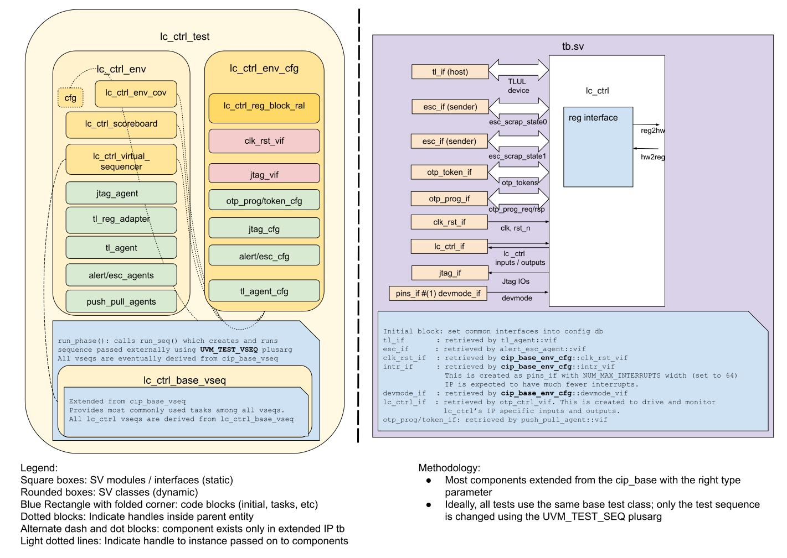

## Goals
* **DV**
  * Verify all LC_CTRL IP features by running dynamic simulations with a SV/UVM based testbench
  * Develop and run all tests based on the [DV plan](#dv-plan) below towards closing code and functional coverage on the IP and all of its sub-modules
* **FPV**
  * Verify TileLink device protocol compliance with an SVA based testbench

## Current status
* [Design & verification stage]()
  * [HW development stages]()
* [Simulation results](https://reports.opentitan.org/hw/ip/lc_ctrl/dv/latest/results.html)

## Design features
For detailed information on LC_CTRL design features, please see the [LC_CTRL HWIP technical specification]().

## Testbench architecture
LC_CTRL testbench has been constructed based on the [CIP testbench architecture]().

### Block diagram


### Top level testbench
Top level testbench is located at `hw/ip/lc_ctrl/dv/tb/tb.sv`. It instantiates the LC_CTRL DUT module `hw/ip/lc_ctrl/rtl/lc_ctrl.sv`.
In addition, it instantiates the following interfaces, connects them to the DUT and sets their handle into `uvm_config_db`:
* [Clock and reset interface]()
* [TileLink host interface]()
* LC_CTRL IOs
* Interrupts ([`pins_if`]())
* Alerts ([`alert_esc_if`]())
* Devmode ([`pins_if`]())

### Common DV utility components
The following utilities provide generic helper tasks and functions to perform activities that are common across the project:
* [dv_utils_pkg]()
* [csr_utils_pkg]()

### Compile-time configurations
[list compile time configurations, if any and what are they used for]

### Global types & methods
All common types and methods defined at the package level can be found in
`lc_ctrl_env_pkg`. Some of them in use are:
```systemverilog
[list a few parameters, types & methods; no need to mention all]
```
### TL_agent
LC_CTRL testbench instantiates (already handled in CIP base env) [tl_agent]()
which provides the ability to drive and independently monitor random traffic via
TL host interface into LC_CTRL device.

### UVC/agent 1
[Describe here or add link to its README]

### UVC/agent 2
[Describe here or add link to its README]

### UVM RAL Model
The LC_CTRL RAL model is created with the [`ralgen`]() FuseSoC generator script automatically when the simulation is at the build stage.

It can be created manually by invoking [`regtool`]():

### Reference models
[Describe reference models in use if applicable, example: SHA256/HMAC]

### Stimulus strategy
#### Test sequences
All test sequences reside in `hw/ip/lc_ctrl/dv/env/seq_lib`.
The `lc_ctrl_base_vseq` virtual sequence is extended from `cip_base_vseq` and serves as a starting point.
All test sequences are extended from `lc_ctrl_base_vseq`.
It provides commonly used handles, variables, functions and tasks that the test sequences can simple use / call.
Some of the most commonly used tasks / functions are as follows:
* task 1:
* task 2:

#### Functional coverage
To ensure high quality constrained random stimulus, it is necessary to develop a functional coverage model.
The following covergroups have been developed to prove that the test intent has been adequately met:
* cg1:
* cg2:

### Self-checking strategy
#### Scoreboard
The `lc_ctrl_scoreboard` is primarily used for end to end checking.
It creates the following analysis ports to retrieve the data monitored by corresponding interface agents:
* analysis port1:
* analysis port2:
<!-- explain inputs monitored, flow of data and outputs checked -->

#### Assertions
* TLUL assertions: The `tb/lc_ctrl_bind.sv` binds the `tlul_assert` [assertions]() to the IP to ensure TileLink interface protocol compliance.
* Unknown checks on DUT outputs: The RTL has assertions to ensure all outputs are initialized to known values after coming out of reset.
* assert prop 1:
* assert prop 2:

## Building and running tests
We are using our in-house developed [regression tool]() for building and running our tests and regressions.
Please take a look at the link for detailed information on the usage, capabilities, features and known issues.
Here's how to run a smoke test:
```console
$ $REPO_TOP/util/dvsim/dvsim.py $REPO_TOP/hw/ip/lc_ctrl/dv/lc_ctrl_sim_cfg.hjson -i lc_ctrl_smoke
```

## DV plan

