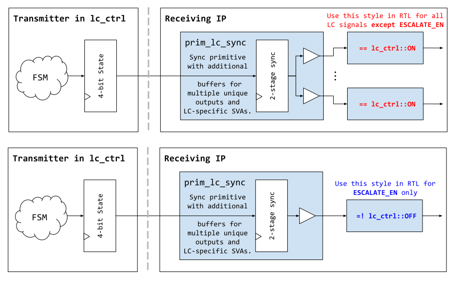

# Hardware Interfaces

### Parameters

Note that parameters prefixed with `RndCnst` are random netlist constants that need to be regenerated via topgen before the tapeout (typically by the silicon creator).

Parameter                      | Default (Max)         | Top Earlgrey   | Description
-------------------------------|-----------------------|----------------|---------------
`AlertAsyncOn`                 | 2'b11                 | 2'b11          |
`IdcodeValue`                  | `32'h00000001`        | `32'h00000001` | Idcode for the LC JTAG TAP.
`RndCnstLcKeymgrDivInvalid`    | (see RTL)             | (see RTL)      | Life cycle state group diversification value for keymgr.
`RndCnstLcKeymgrDivTestDevRma` | (see RTL)             | (see RTL)      | Life cycle state group diversification value for keymgr.
`RndCnstLcKeymgrDivProduction` | (see RTL)             | (see RTL)      | Life cycle state group diversification value for keymgr.

### Signals

<!-- BEGIN CMDGEN util/regtool.py --interfaces ./hw/ip/lc_ctrl/data/lc_ctrl.hjson -->
Referring to the [Comportable guideline for peripheral device functionality](https://opentitan.org/book/doc/contributing/hw/comportability), the module **`lc_ctrl`** has the following hardware interfaces defined
- Primary Clock: **`clk_i`**
- Other Clocks: **`clk_kmac_i`**
- Bus Device Interfaces (TL-UL): **`tl`**
- Bus Host Interfaces (TL-UL): *none*
- Peripheral Pins for Chip IO: *none*
- Interrupts: *none*

## [Inter-Module Signals](https://opentitan.org/book/doc/contributing/hw/comportability/index.html#inter-signal-handling)

| Port Name                | Package::Struct                  | Type    | Act   |   Width | Description                                                                                                                                                                                                                                                                     |
|:-------------------------|:---------------------------------|:--------|:------|--------:|:--------------------------------------------------------------------------------------------------------------------------------------------------------------------------------------------------------------------------------------------------------------------------------|
| jtag                     | jtag_pkg::jtag                   | req_rsp | rsp   |       1 |                                                                                                                                                                                                                                                                                 |
| esc_scrap_state0_tx      | prim_esc_pkg::esc_tx             | uni     | rcv   |       1 |                                                                                                                                                                                                                                                                                 |
| esc_scrap_state0_rx      | prim_esc_pkg::esc_rx             | uni     | req   |       1 |                                                                                                                                                                                                                                                                                 |
| esc_scrap_state1_tx      | prim_esc_pkg::esc_tx             | uni     | rcv   |       1 |                                                                                                                                                                                                                                                                                 |
| esc_scrap_state1_rx      | prim_esc_pkg::esc_rx             | uni     | req   |       1 |                                                                                                                                                                                                                                                                                 |
| pwr_lc                   | pwrmgr_pkg::pwr_lc               | req_rsp | rsp   |       1 |                                                                                                                                                                                                                                                                                 |
| lc_otp_vendor_test       | otp_ctrl_pkg::lc_otp_vendor_test | req_rsp | req   |       1 |                                                                                                                                                                                                                                                                                 |
| otp_lc_data              | otp_ctrl_pkg::otp_lc_data        | uni     | rcv   |       1 |                                                                                                                                                                                                                                                                                 |
| lc_otp_program           | otp_ctrl_pkg::lc_otp_program     | req_rsp | req   |       1 |                                                                                                                                                                                                                                                                                 |
| kmac_data                | kmac_pkg::app                    | req_rsp | req   |       1 |                                                                                                                                                                                                                                                                                 |
| lc_dft_en                | lc_ctrl_pkg::lc_tx               | uni     | req   |       1 |                                                                                                                                                                                                                                                                                 |
| lc_nvm_debug_en          | lc_ctrl_pkg::lc_tx               | uni     | req   |       1 |                                                                                                                                                                                                                                                                                 |
| lc_hw_debug_en           | lc_ctrl_pkg::lc_tx               | uni     | req   |       1 |                                                                                                                                                                                                                                                                                 |
| lc_cpu_en                | lc_ctrl_pkg::lc_tx               | uni     | req   |       1 |                                                                                                                                                                                                                                                                                 |
| lc_keymgr_en             | lc_ctrl_pkg::lc_tx               | uni     | req   |       1 |                                                                                                                                                                                                                                                                                 |
| lc_escalate_en           | lc_ctrl_pkg::lc_tx               | uni     | req   |       1 |                                                                                                                                                                                                                                                                                 |
| lc_clk_byp_req           | lc_ctrl_pkg::lc_tx               | uni     | req   |       1 |                                                                                                                                                                                                                                                                                 |
| lc_clk_byp_ack           | lc_ctrl_pkg::lc_tx               | uni     | rcv   |       1 |                                                                                                                                                                                                                                                                                 |
| lc_flash_rma_req         | lc_ctrl_pkg::lc_tx               | uni     | req   |       1 |                                                                                                                                                                                                                                                                                 |
| lc_flash_rma_seed        | lc_ctrl_pkg::lc_flash_rma_seed   | uni     | req   |       1 |                                                                                                                                                                                                                                                                                 |
| lc_flash_rma_ack         | lc_ctrl_pkg::lc_tx               | uni     | rcv   |       1 |                                                                                                                                                                                                                                                                                 |
| lc_check_byp_en          | lc_ctrl_pkg::lc_tx               | uni     | req   |       1 |                                                                                                                                                                                                                                                                                 |
| lc_creator_seed_sw_rw_en | lc_ctrl_pkg::lc_tx               | uni     | req   |       1 |                                                                                                                                                                                                                                                                                 |
| lc_owner_seed_sw_rw_en   | lc_ctrl_pkg::lc_tx               | uni     | req   |       1 |                                                                                                                                                                                                                                                                                 |
| lc_iso_part_sw_rd_en     | lc_ctrl_pkg::lc_tx               | uni     | req   |       1 |                                                                                                                                                                                                                                                                                 |
| lc_iso_part_sw_wr_en     | lc_ctrl_pkg::lc_tx               | uni     | req   |       1 |                                                                                                                                                                                                                                                                                 |
| lc_seed_hw_rd_en         | lc_ctrl_pkg::lc_tx               | uni     | req   |       1 |                                                                                                                                                                                                                                                                                 |
| lc_keymgr_div            | lc_ctrl_pkg::lc_keymgr_div       | uni     | req   |       1 |                                                                                                                                                                                                                                                                                 |
| otp_device_id            | otp_ctrl_pkg::otp_device_id      | uni     | rcv   |       1 |                                                                                                                                                                                                                                                                                 |
| otp_manuf_state          | otp_ctrl_pkg::otp_manuf_state    | uni     | rcv   |       1 |                                                                                                                                                                                                                                                                                 |
| hw_rev                   | lc_ctrl_pkg::lc_hw_rev           | uni     | req   |       1 |                                                                                                                                                                                                                                                                                 |
| strap_en_override        | logic                            | uni     | req   |       1 | This signal transitions from 0 -> 1 by the lc_ctrl manager after volatile RAW_UNLOCK in order to re-sample the HW straps. The signal stays at 1 until reset. Note that this is only used in test chips when SecVolatileRawUnlockEn = 1. Otherwise this signal is tied off to 0. |
| tl                       | tlul_pkg::tl                     | req_rsp | rsp   |       1 |                                                                                                                                                                                                                                                                                 |

## Security Alerts

| Alert Name            | Description                                                                                       |
|:----------------------|:--------------------------------------------------------------------------------------------------|
| fatal_prog_error      | This alert triggers if an error occurred during an OTP programming operation.                     |
| fatal_state_error     | This alert triggers if an error in the life cycle state or life cycle controller FSM is detected. |
| fatal_bus_integ_error | This fatal alert is triggered when a fatal TL-UL bus integrity fault is detected.                 |

## Security Countermeasures

| Countermeasure ID                  | Description                                                                                                                                                                                                                                                                                                                                                                                                                                                                                                                                                                                                             |
|:-----------------------------------|:------------------------------------------------------------------------------------------------------------------------------------------------------------------------------------------------------------------------------------------------------------------------------------------------------------------------------------------------------------------------------------------------------------------------------------------------------------------------------------------------------------------------------------------------------------------------------------------------------------------------|
| LC_CTRL.BUS.INTEGRITY              | End-to-end bus integrity scheme.                                                                                                                                                                                                                                                                                                                                                                                                                                                                                                                                                                                        |
| LC_CTRL.TRANSITION.CONFIG.REGWEN   | The transition interface registers are REGWEN protected. The REGWEN is governed by hardware, and is only set to 1 if the interface mutex has been successfully claimed. Also, the REGWEN is set to 0 while a state transition is in progress in order to prevent any accidental changes to the transition interface CSRs during that phase.                                                                                                                                                                                                                                                                             |
| LC_CTRL.MANUF.STATE.SPARSE         | The manufacturing state vector is sparsely encoded. Although the encoding is randomly chosen, it satisfies specific Hamming weight and Hamming distance thresholds (see lc_ctrl_state_pkg.sv for the statistics). All manufacturing state encodings (except for the RAW state) have been constructed so that all OTP words belonging to the manufacturing state vector have a non-zero value. The individual OTP words are unique and have been engineered so that each word can be incrementally overwritten with another engineered value without causing the ECC bits added by the OTP macro to become inconsistent. |
| LC_CTRL.TRANSITION.CTR.SPARSE      | The life cycle transition counter state is sparsely encoded. Although the encoding is randomly chosen, it satisfies specific Hamming weight and Hamming distance thresholds (see lc_ctrl_state_pkg.sv for the statistics). All counter state encodings (except for the 0 state) have been constructed so that all OTP words belonging to the counter state vector have a non-zero value. The individual OTP words are unique and have been engineered so that each word can be incrementally overwritten with another engineered value without causing the ECC bits added by the OTP macro to become inconsistent.      |
| LC_CTRL.MANUF.STATE.BKGN_CHK       | The manufacturing state vector is continuously decoded and checked, once the life cycle controller has initialized. If any mismatch is detected, local escalation is triggered (MAIN.FSM.LOCAL_ESC).                                                                                                                                                                                                                                                                                                                                                                                                                    |
| LC_CTRL.TRANSITION.CTR.BKGN_CHK    | The life cycle transition counter is continuously decoded and checked, once the life cycle controller has initialized. If any mismatch is detected, local escalation is triggered (MAIN.FSM.LOCAL_ESC). Note that any non-RAW manufacturing state requires the transition counter to be nonzero. Also, the transition counter is used to enforce a limit of maximum 24 state transitions in order to guard against bruteforcing.                                                                                                                                                                                        |
| LC_CTRL.STATE.CONFIG.SPARSE        | The decoded manufacturing state uses a replicated enum encoding to fill the 32bit value exposed in the CSRs (both the LC_STATE and TRANSITION_TARGET registers). This is done to 1) ease hardening of firmware code, and 2) to ensure that even the decoded life cycle state vector inside the life cycle controller still has a redundant encoding.                                                                                                                                                                                                                                                                    |
| LC_CTRL.MAIN.FSM.SPARSE            | The main state FSM is sparsely encoded.                                                                                                                                                                                                                                                                                                                                                                                                                                                                                                                                                                                 |
| LC_CTRL.KMAC.FSM.SPARSE            | The KMAC interface FSM is sparsely encoded.                                                                                                                                                                                                                                                                                                                                                                                                                                                                                                                                                                             |
| LC_CTRL.MAIN.FSM.LOCAL_ESC         | Upon local escalation due to an invalid state encoding of the life cycle state vector or an invalid KMAC interface FSM state, the main state FSM moves to the InvalidSt state which behaves like a virtual scrap state.                                                                                                                                                                                                                                                                                                                                                                                                 |
| LC_CTRL.MAIN.FSM.GLOBAL_ESC        | Upon global escalation (triggered by the alert escalation receivers), the main state FSM moves to the EscalateSt state which behaves like a virtual scrap state.                                                                                                                                                                                                                                                                                                                                                                                                                                                        |
| LC_CTRL.MAIN.CTRL_FLOW.CONSISTENCY | The control flow of the main FSM is constructed so that the FSM only progresses linearly in one direction. There are no transition arcs that loop back to previous FSM states.                                                                                                                                                                                                                                                                                                                                                                                                                                          |
| LC_CTRL.INTERSIG.MUBI              | Life cycle control signals are multibit encoded.                                                                                                                                                                                                                                                                                                                                                                                                                                                                                                                                                                        |
| LC_CTRL.TOKEN_VALID.CTRL.MUBI      | The token valid signals coming from OTP are MUBI encoded.                                                                                                                                                                                                                                                                                                                                                                                                                                                                                                                                                               |
| LC_CTRL.TOKEN.DIGEST               | Life cycle transition tokens are hashed with cSHAKE128, using a custom 'LC_CTRL' prefix.                                                                                                                                                                                                                                                                                                                                                                                                                                                                                                                                |
| LC_CTRL.TOKEN_MUX.CTRL.REDUN       | The life cycle transition token mux is broken into two halves that are steered with separately decoded and buffered MUBI valid signals (see also TOKEN_VALID.CTRL.MUBI).                                                                                                                                                                                                                                                                                                                                                                                                                                                |
| LC_CTRL.TOKEN_VALID.MUX.REDUN      | The life cycle transition token valid mux is replicated twice. If a transition is initiated and the two mux index signals are inconsistent or if any of the two valid mux outputs is not set to valid, the transition will fail with a TRANSITION_ERROR.                                                                                                                                                                                                                                                                                                                                                                |

<!-- END CMDGEN -->

Signal                       | Direction        | Type                                     | Description
-----------------------------|------------------|------------------------------------------|---------------
`jtag_i`                     | `input`          | `jtag_pkg::jtag_req_t`                   | JTAG input signals for life cycle TAP.
`jtag_o`                     | `output`         | `jtag_pkg::jtag_rsp_t`                   | JTAG output signals for life cycle TAP.
`esc_scrap_state0_tx_i`      | `input`          | `prim_esc_pkg::esc_tx_t`                 | Escalation input from alert handler. Moves the life cycle state into an invalid state upon assertion.
`esc_scrap_state0_rx_o`      | `output`         | `prim_esc_pkg::esc_rx_t`                 | Escalation feedback to alert handler
`esc_scrap_state1_tx_i`      | `input`          | `prim_esc_pkg::esc_tx_t`                 | Escalation input from alert handler. Moves the life cycle state into an invalid state upon assertion.
`esc_scrap_state1_rx_o`      | `output`         | `prim_esc_pkg::esc_rx_t`                 | Escalation feedback to alert handler
`pwr_lc_i`                   | `input`          | `pwrmgr::pwr_lc_req_t`                   | Initialization request coming from power manager.
`pwr_lc_o`                   | `output`         | `pwrmgr::pwr_lc_rsp_t`                   | Initialization response and programming idle state going to power manager.
`lc_otp_program_o`           | `output`         | `otp_ctrl_pkg::lc_otp_program_req_t`     | Life cycle state transition request.
`lc_otp_program_i`           | `input`          | `otp_ctrl_pkg::lc_otp_program_rsp_t`     | Life cycle state transition response.
`kmac_data_o`                | `output`         | `kmac_pkg::app_req_t`                    | Life cycle RAW token hashing request.
`kmac_data_i`                | `input`          | `kmac_pkg::app_rsp_t`                    | Life cycle RAW token hashing response.
`otp_lc_data_i`              | `input`          | `otp_ctrl_pkg::otp_lc_data_t`            | Life cycle state output holding the current life cycle state, the value of the transition counter and the tokens needed for life cycle transitions.
`lc_keymgr_div_o`            | `output`         | `lc_keymgr_div_t`                        | Life cycle state group diversification value.
`lc_flash_rma_seed_o`        | `output`         | `lc_flash_rma_seed_t`                    | Seed for flash RMA.
`otp_device_id_i`            | `input`          | `otp_device_id_t`                        | HW_CFG bits from OTP ([`DEVICE_ID_0`](registers.md#device_id)).
`otp_manuf_state_i`          | `input`          | `otp_manuf_state_t`                      | HW_CFG bits from OTP ([`MANUF_STATE_0`](registers.md#manuf_state)).
`lc_otp_vendor_test_o`       | `output`         | `otp_ctrl_pkg::lc_otp_vendor_test_req_t` | Vendor-specific test bits to OTP ([`OTP_VENDOR_TEST_CTRL`](registers.md#otp_vendor_test_ctrl)).
`lc_otp_vendor_test_i`       | `input`          | `otp_ctrl_pkg::lc_otp_vendor_test_rsp_t` | Vendor-specific test bits to OTP ([`OTP_VENDOR_TEST_STATUS`](registers.md#otp_vendor_test_status)).
`lc_dft_en_o`                | `output`         | `lc_tx_t`                                | [Multibit control signal](theory_of_operation.md#life-cycle-decoded-outputs-and-controls).
`lc_nvm_debug_en_o`          | `output`         | `lc_tx_t`                                | [Multibit control signal](theory_of_operation.md#life-cycle-decoded-outputs-and-controls).
`lc_hw_debug_en_o`           | `output`         | `lc_tx_t`                                | [Multibit control signal](theory_of_operation.md#life-cycle-decoded-outputs-and-controls).
`lc_cpu_en_o`                | `output`         | `lc_tx_t`                                | [Multibit control signal](theory_of_operation.md#life-cycle-decoded-outputs-and-controls).
`lc_creator_seed_sw_rw_en_o` | `output`         | `lc_tx_t`                                | [Multibit control signal](theory_of_operation.md#life-cycle-decoded-outputs-and-controls).
`lc_owner_seed_sw_rw_en_o`   | `output`         | `lc_tx_t`                                | [Multibit control signal](theory_of_operation.md#life-cycle-decoded-outputs-and-controls).
`lc_iso_part_sw_rd_en_o`     | `output`         | `lc_tx_t`                                | [Multibit control signal](theory_of_operation.md#life-cycle-decoded-outputs-and-controls).
`lc_iso_part_sw_wr_en_o`     | `output`         | `lc_tx_t`                                | [Multibit control signal](theory_of_operation.md#life-cycle-decoded-outputs-and-controls).
`lc_seed_hw_rd_en_o`         | `output`         | `lc_tx_t`                                | [Multibit control signal](theory_of_operation.md#life-cycle-decoded-outputs-and-controls).
`lc_keymgr_en_o`             | `output`         | `lc_tx_t`                                | [Multibit control signal](theory_of_operation.md#life-cycle-decoded-outputs-and-controls).
`lc_escalate_en_o`           | `output`         | `lc_tx_t`                                | [Multibit control signal](theory_of_operation.md#life-cycle-decoded-outputs-and-controls).
`lc_check_byp_en_o`          | `output`         | `lc_tx_t`                                | [Multibit control signal](theory_of_operation.md#life-cycle-decoded-outputs-and-controls).
`lc_clk_byp_req_o`           | `output`         | `lc_tx_t`                                | [Multibit control signal](theory_of_operation.md#life-cycle-decoded-outputs-and-controls).
`lc_clk_byp_ack_i`           | `output`         | `lc_tx_t`                                | [Multibit control signal](theory_of_operation.md#life-cycle-decoded-outputs-and-controls).
`lc_flash_rma_req_o`         | `output`         | `lc_tx_t`                                | [Multibit control signal](theory_of_operation.md#life-cycle-decoded-outputs-and-controls).
`lc_flash_rma_ack_i`         | `output`         | `lc_tx_t`                                | [Multibit control signal](theory_of_operation.md#life-cycle-decoded-outputs-and-controls).

#### Power Manager Interface

The power manager interface is comprised of three signals overall: an initialization request (`pwr_lc_i.lc_init`), an initialization done response (`pwr_lc_o.lc_done`) and an idle indicator (`pwr_lc_o.lc_idle`).

The power manager asserts `pwr_lc_i.lc_init` in order to signal to the life cycle controller that it can start initialization, and the life cycle controller signals completion of the initialization sequence by asserting `pwr_lc_o.lc_done` (the signal will remain high until reset).

The idle indication signal `pwr_lc_o.lc_idle` indicates that the life cycle controller is idle.
If this bit is 0, the life cycle controller is either not initialized or in the middle of carrying out a life cycle state transition.
The power manager uses that indication to determine whether a power down request needs to be aborted.

Since the power manager may run in a different clock domain, the `pwr_lc_i.lc_init` signal is synchronized within the life cycle controller.
The power manager is responsible for synchronizing the `pwr_lc_o.lc_done` and `pwr_lc_o.lc_idle` signals.

See also [power manager documentation](../../pwrmgr/README.md).

#### OTP Interfaces

All interfaces to and from OTP are explained in detail in the [OTP Specification Document](../../otp_ctrl/README.md#life-cycle-interfaces).

#### KMAC Interface

The life cycle controller interfaces with KMAC through a [side load interface](../../kmac/README.md#keymgr-interface) in the same way as the key manager.
Since the KMAC and life cycle controller are in different clock domains, the KMAC interface signals are synchronized to the life cycle clock inside the life cycle controller.

#### Control Signal Propagation

For better security, all the [life cycle control signals](theory_of_operation.md#life-cycle-decoded-outputs-and-controls) are broadcast in multi-bit form.
The active ON state for every signal is broadcast as `4'b1010`, while the inactive OFF state is encoded as `4'b0101`.
For all life cycle signals except the escalation signal ESCALATE_EN, all values different from ON must be interpreted as OFF in RTL.
In case of ESCALATE_EN, all values different from OFF must be interpreted as ON in RTL.
To that end the functions `lc_tx_test_true_strict()`, `lc_tx_test_true_loose()`, `lc_tx_test_false_strict()` and `lc_tx_test_false_loose()` in the `lc_ctrl_pkg` must be employed unless there is a strong reason not to.
The reason must be documented and agreed at block sign-off.

Since many signals cross clock boundaries, their synchronization needs to be taken into account.
However, since the ON / OFF encoding above has been chosen such that **all bits toggle exactly once** for a transition from OFF to ON (and vice-versa), all that needs to be done is guard against metastability using a two-stage synchronizer, as illustrated below.

In other words, since each bit in the encoding flips exactly once upon an OFF -> ON or ON -> OFF transition, we can guarantee that there are no transient patterns toggling back and forth between enabling and disabling a function.
It is crucial however that the design follows the guidance above and interprets all undefined values as either ON or OFF in order to avoid issues due to staggered bits after synchronization.

Note that even though synchronization can be achieved with a simple two-stage synchronizer, designs **must** use the `prim_lc_sync` primitive.
This primitive has additional LC-specific assertions and provides a parametric amount of separately buffered copies of the life cycle signal to prevent logic optimization by the synthesis tool (buffers have a 'size_only' constraint in synthesis).
For all signals except ESCALATE_EN, it is recommended to structure the design such that at least two separately buffered copies of the life cycle signals have to be consumed in order to unlock a certain function.

#### Key Manager Interface

The `lc_keymgr_div_o` signal is a 128bit diversification constant that is output to the key manager once the life cycle controller has initialized, and is asserted at the same time as `lc_keymgr_en_o`.
Depending on which group the life cycle state is in, this signal is assigned a different random netlist constant as defined in the table below.

Life Cycle State Group     | Assigned Diversification Constant
---------------------------|----------------------------------
TEST_UNLOCKED\*, DEV, RMA  | `LcKeymgrDivTestDevRma`
PROD, PROD_END             | `LcKeymgrDivProduction`
All Other States           | `LcKeymgrDivInvalid`

Note that this signal is quasistatic.
It is hence recommended to place a max-delay constraint on it and leverage the synchronized version of `lc_keymgr_en_o` to enable any downstream register in different clock domains than the life cycle controller.
