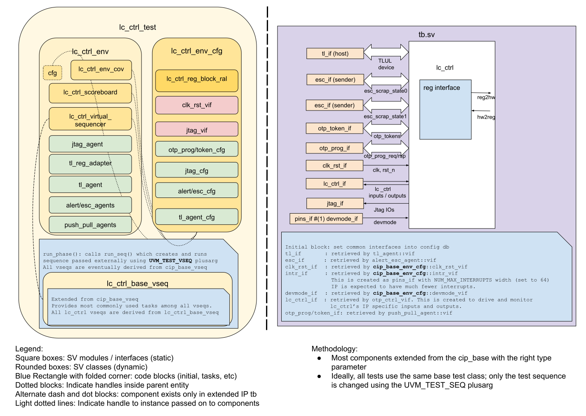

# LC_CTRL DV document

## Goals
* **DV**
  * Verify all LC_CTRL IP features by running dynamic simulations with a SV/UVM based testbench
  * Develop and run all tests based on the [testplan](#testplan) below towards closing code and functional coverage on the IP and all of its sub-modules
* **FPV**
  * Verify TileLink device protocol compliance with an SVA based testbench

## Current status
* [Design & verification stage](../../../README.md)
  * [HW development stages](../../../../doc/project_governance/development_stages.md)
* [Simulation results](https://reports.opentitan.org/hw/ip/lc_ctrl/dv/latest/report.html)

## Design features
For detailed information on LC_CTRL design features, please see the [LC_CTRL HWIP technical specification](../README.md).

## Testbench architecture
LC_CTRL testbench has been constructed based on the [CIP testbench architecture](../../../dv/sv/cip_lib/README.md).

### Block diagram


### Top level testbench
Top level testbench is located at `hw/ip/lc_ctrl/dv/tb/tb.sv`. It instantiates the LC_CTRL DUT module `hw/ip/lc_ctrl/rtl/lc_ctrl.sv`.
In addition, it instantiates the following interfaces, connects them to the DUT and sets their handle into `uvm_config_db`:
* [Clock and reset interface](../../../dv/sv/common_ifs/README.md)
* [TileLink host interface](../../../dv/sv/tl_agent/README.md)
* LC_CTRL IOs
* Interrupts ([`pins_if`](../../../dv/sv/common_ifs/README.md))
* Alerts ([`alert_esc_if`](../../../dv/sv/alert_esc_agent/README.md))

### Common DV utility components
The following utilities provide generic helper tasks and functions to perform activities that are common across the project:
* [dv_utils_pkg](../../../dv/sv/dv_utils/README.md)
* [csr_utils_pkg](../../../dv/sv/csr_utils/README.md)

### Compile-time configurations
[list compile time configurations, if any and what are they used for]

### Global types & methods
All common types and methods defined at the package level can be found in
`lc_ctrl_env_pkg`.

### TL_agent
LC_CTRL testbench instantiates (already handled in CIP base env) [tl_agent](../../../dv/sv/tl_agent/README.md)
which provides the ability to drive and independently monitor random traffic via
TL host interface into LC_CTRL device.

### JTAG RISCV Agent
[jtag_riscv_agent](../../../dv/sv/jtag_riscv_agent/README.md) is used to read and write LC_CTRL registers via
the JTAG interface. It contains an embedded instance of [jtag_agent] ../../../dv/sv/jtag_agent/README.md which
uses the jtag_if interface in the testbench.

### PUSH/PULL Agent
[push_pull_agent](../../../dv/sv/push_pull_agent/README.md) is used to emulate the Token and
OTP programming interfaces.

### UVM RAL Model
The LC_CTRL RAL model is created with the [`ralgen`](../../../dv/tools/ralgen/README.md) FuseSoC generator script automatically when the simulation is at the build stage.

It can be created manually by invoking [`regtool`](../../../../util/reggen/doc/setup_and_use.md):


### Stimulus strategy
#### Test sequences
All test sequences reside in `hw/ip/lc_ctrl/dv/env/seq_lib`.
The `lc_ctrl_base_vseq` virtual sequence is extended from `cip_base_vseq` and serves as a starting point.
All test sequences are extended from `lc_ctrl_base_vseq`.
It provides commonly used handles, variables, functions and tasks that the test sequences can simple use / call.


#### Functional coverage
To ensure high quality constrained random stimulus, it is necessary to develop a functional coverage model.
The following covergroups have been developed to prove that the test intent has been adequately met:
*  err_inj_cg: indicates what error conditions have been injected.


### Self-checking strategy
#### Scoreboard
The `lc_ctrl_scoreboard` is primarily used for end to end checking.
It creates the following analysis exports to retrieve the data monitored by corresponding interface agents:
* tl_[a_chan, d_chan, dir]_fifo_lc_ctrl_reg_block.analysis_export: TileLink CSR reads/writes.
* jtag_riscv_fifo.analysis_export: JTAG CSR reads/writes
* alert_fifo[fatal_bus_integ_error, fatal_prog_error, fatal_state_error].analysis_export: Alert traffic from DUT
* otp_prog_fifo.analysis_export:  OTP program data from LC_CTRL and response to LC_CTRL.
* otp_token_fifo.analysis_export:  OTP token data from LC_CTRL and response to LC_CTRL.

##### Scoreboard Checks
* TL CSR data is used to check against expected values predicted by the scoreboard.
It also updates the UVM register model.
* JTAG CSR data is used to check against expected values predicted by the scoreboard.
It also updates the UVM register model.
* Alert data is decoded and used to indicate an alert has occurred

#### Assertions
* TLUL assertions: The `tb/lc_ctrl_bind.sv` binds the `tlul_assert` [assertions](../../tlul/doc/TlulProtocolChecker.md) to the IP to ensure TileLink interface protocol compliance.
* Unknown checks on DUT outputs: The RTL has assertions to ensure all outputs are initialized to known values after coming out of reset.


## Building and running tests
We are using our in-house developed [regression tool](../../../../util/dvsim/README.md) for building and running our tests and regressions.
Please take a look at the link for detailed information on the usage, capabilities, features and known issues.
Here's how to run a smoke test for the LC_CTRL variant with volatile RAW unlock disabled:
```console
$ $REPO_TOP/util/dvsim/dvsim.py $REPO_TOP/hw/ip/lc_ctrl/dv/lc_ctrl_volatile_unlock_disabled_sim.hjson -i lc_ctrl_smoke
```

## Testplan
[Testplan](../data/lc_ctrl_testplan.hjson)
