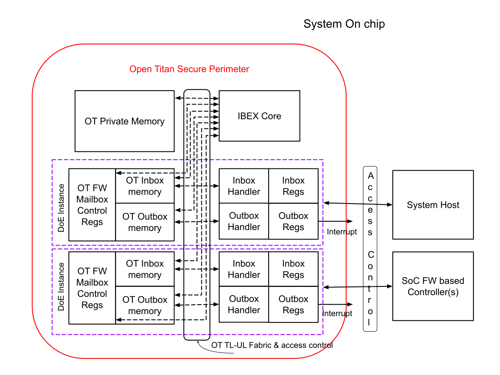
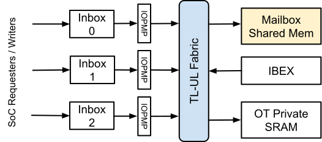
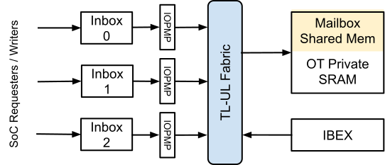

# Theory of Operation

The integrated version of OpenTitan Root-Of-Trust may provide security services to the SoC such as:

- Encryption or decryption of data blobs.
- Cryptographic hashing of data blobs.
- Key derivation.
- Random seed generation service.
- Public Key ( PK ) signing.
- PK verification.
- Root of Trust for Measurement, Reporting and Storage.
- Secure Firmware update.
- Access to secure storage.
- Mutual authentication / attestation services.
- SoC security monitoring / book-keeping services.
- Debug authentication / unlock service.

As an example, a DMA controller may be used in conjunction with the newly defined OpenTitan mailbox interface.
The mailbox interface is used to pass pointers to data blobs external to the OT RoT and request operations via pre-defined command objects.

## Secure Mailbox Interface

### Mailbox Terminology

- **Requester**\
*Typically System Host or an SoC firmware agent that would request a security service via predefined DOE objects.*

- **Responder**\
*Entity that processes the DOE request object and generates a DOE response in case one is expected for the original request.*\
OpenTitan would generally have the responder role; however there may be use cases where OpenTitan is a DOE requester.

- **OT Mailbox registers (Inbox/Outbox regs)**\
*PCIe DOE specification defined registers used for reading and writing to the mailbox.*\
These registers may be mapped into the PCIe Config space for the System Host to access the mailbox via the PCIe defined mechanism.
Accesses from other SoC firmware based agents may not be mapped into the config address space.
The access mechanism and relevant address space for such agents is defined by the SoC integrator.
*(See the PCI Express Base Specification 6.0 section 7.9.24 for further details.)*

- **OT Inbox Memory**\
*Memory within the OpenTitan RoT secure perimeter that is allocated to the mailbox mechanism to store data objects passed from System/SoC mailbox writer.*\
System/SoC mailbox writer can write this memory via mailbox interface registers only.
OpenTitan Ibex core may have direct read/write access to this memory.
Please refer to the section below for inbox memory implementation options.

- **OT Outbox Memory**\
*Memory within the OpenTitan RoT secure perimeter that is allocated to the mailbox mechanism to store data objects passed from OT to System/SoC mailbox reader.*\
System/SoC mailbox reader can read this memory via mailbox interface registers only.
OpenTitan Ibex core may have direct read/write access to this memory.
Please refer to the section below for outbox memory implementation options.

- **DOE mailbox instance**\
*A collection of the mailbox registers, inbound mailbox memory and outbound mailbox memory that can be used to exchange objects between OT and an SoC agent.*\
A separate mailbox instance is required for each uncoordinated SoC agent that communicates with Integrated OpenTitan via the mailbox mechanism.
OpenTitan may arbitrate between (read or write) objects from each DOE mailbox instance in a simple round robin fashion.
Note that this is firmware controlled based on pending mailbox interrupts.

- **Inbox / Outbox Handler**\
*Hardware widget to move mailbox data back and forth between mailbox registers and corresponding memories.*

### Mailbox Memory Topology

The mailbox IP acts as a host on the TL-UL fabric and expects to transfer the request/response messages to/from external memory that holds the contents of the Outbox and Inbox. Two basic configurations are therefore possible:

#### **Shared Mailbox Memory On RoT Fabric**

- (separate instance than RoT private memory)

✅ Pros

- Memory access arbitration handled by fabric.
- Easier to implement memory protection schemes such as scrambling, if desired.
- Easy to prevent IBEX instruction fetch port from accessing mailbox memory (prevent address decode).

❌ Cons

- Mailbox port is an initiator port on the fabric; requires firmware to ensure that the shared mailbox memory
  is partitioned among the mailbox instances in a manner that prevents conflicts.

#### **Shared Mailbox Memory (carved out of existing RoT memory)**

- *Note that this option is not preferred*

✅ Pros

- Easier to manage memory size requirements (flexible range setup).

❌ Cons

- Hard address decode based prevention of IBEX instruction fetch from this memory not possible (mixed with IBEX code memory)

### Mailbox Basics

- PCIe specification section 6.30 defines the (optional) Data Object Exchange mechanism.\
It is accessed using a PCIe extended capability defined in section 7.9.24 that provides a Mailbox for data exchange.
- All inbound and outbound mailbox communication takes place via a set of mailbox registers
    - [DOE Control Register](#doe-control-register)
    - [DOE Status Register](#doe-status-register)
    - [DOE Write Data Mailbox Register](#doe-write-data-mailbox-register)
    - [DOE Read Data Mailbox Register](#doe-read-data-mailbox-register)
- [DOE Control Register](#doe-control-register) and [DOE Status Register](#doe-status-register) are used by the requester and the responder to perform a valid handshake protocol while transferring objects back and forth.
- An entity that supports the DOE mechanism is permitted to specify its own vendor defined data objects.
- DOE Inbox is used by a ‘requester’ to query the supported data object formats
    - A mailbox instance is not required to support all DOE object formats.
    - PCIe Vendor ID and an object format index number together uniquely identify the supported object format.
    - Mailbox requester FW/SW knows how to interpret the data object format(s) of interest.
    - DOE specification defined query mechanism enables Mailbox requester to check if the DOE instance supports the data object format of interest.
- DOE Inbox is used by a ‘requester’ to write supported data objects into the DOE mailbox.
    - DOE mailbox drops the object in case it is an unsupported format or does not match the expected format.
    - Each mailbox write is a non-posted transaction and expects a response back.
    - [DOE Write Data Mailbox Register](#doe-write-data-mailbox-register) is used to write the inbox, one DWORD (32 bit) at a time.
- DOE Outbox is used by the responder to populate a response, in case one is expected
- DOE instances have the ability to send an interrupt to notify that an object response is ready. Note that a PCIe compatible DOE mailbox instance shall have the ability to send an MSI interrupt.
- Various error handling scenarios are described later in this document.

Following is a basic mailbox read / write sequence:

1. System host consults the DOE Busy bit in the [DOE Status Register](#doe-status-register) to check if the DOE instance is free..\
Busy being Clear indicates that the mailbox instance is not being actively used and is ready to accept new requests.\
2. System host writes the entire data object one DWORD at a time via the [DOE Write Data Mailbox Register](#doe-write-data-mailbox-register).
    - The inbox handler places each DWORD into the appropriate location of the OT inbox memory to assemble the object being transferred.
3. System host sets the DOE Go bit in [DOE Control Register](#doe-control-register)
    - The inbox handler generates an interrupt to notify the responder (e.g. OpenTitan Ibex core) to start parsing the transferred object.
    - The parser consumes the DOE request from the DOE mailbox.
4. After successful processing, the responder (OT Ibex core) generates a response, in case one is expected.
    - OT host places the response in the outbox memory.
    - OT host sets the Data Object Ready bit.
    - DOE outbox handler generates a notification interrupt, if supported and enabled.
5. System host waits for an interrupt if applicable.\
Upon receiving an interrupt, it checks the [DOE Status Register](#doe-status-register).*ready* bit to see if the object is ready.\
Alternatively, if an interrupt is not supported, it polls the [DOE Status Register](#doe-status-register).*ready* bit.\
Note that SoC level power management schemes and related interrupt delivery mechanism are outside the scope of this document.\
Any logic required to support SoC wake from deeper power management states for interrupt delivery shall be implemented at the SoC level at the time of integration.
6. If the ready bit is Set:
    - System host reads data from the  [DOE Read Data Mailbox Register](#doe-read-data-mailbox-register) one DWORD at a time.
    - For each DWORD, it writes the  [DOE Read Data Mailbox Register](#doe-read-data-mailbox-register) to indicate a successful read.
    - The process is repeated until the entire object is read.

**Note**: Sequence above assumes System Host as the requester of the mailbox object write.
In this case a PCIe compatible DOE mailbox instance is implemented.
Similar mechanism and sequence would apply for communication with other SoC firmware controllers.
For such a DOE mailbox instance, a fully PCIe compatible implementation is not required.
See [below](#system-level-use-cases) for more details.

**Note**: Please refer to the [PCIe Specification](https://members.pcisig.com/wg/PCI-SIG/document/18363) for more detailed and up to date information on the PCIe compatible DOE Mailbox operation basics.

### Integrated OpenTitan Usage Of DOE Mailbox Mechanism

Integrated OpenTitan shall:

- Adopt the basic mechanisms as defined in the PCIe specification.
- Support one or more DOE mailbox instances.
- Support design options to allow configuration of number of mailbox instances depending upon the needs of the integrating SoC.
- Support the following Interrupt mechanisms:
    - A firmware based mechanism to generate an interrupt.\
Such a mechanism may require a method to ‘write’ to a predefined address in the appropriate address space (System, CTN or other) via the corresponding port of a DMA controller.\
Example: Write to a location within system address space via the [SYS port of the Integrated OT DMA controller](../../dma/README.md) to generate an MSI-interrupt for PCIe compatible DOE instance(s).
    - Wired interrupt output(s) for each DOE instance.\
Such a mechanism may be applied for DOE instances assigned to agents that support wired interrupt mechanism.
    - Depending upon the application & PCIe compatibility requirement for the instance, SoC may decide to use the wired interrupt or firmware based MSI interrupt mechanism at the time of SoC integration.\
Alternatively, for PCIe compatible DOE mailbox instance, an SoC may also decide to convert the wired interrupt into an MSI via dedicated hardware support at the SoC level.
- Not required to support a dedicated mutex mechanism for more than one agent to access the same DOE instance.
- Object Definition; Vendor ID

The integrating SoC shall:

- For the DOE instance dedicated to System Host:
    - Provide the plumbing to map into PCIe Config address space.
    - Provide the plumbing necessary to route the MSI interrupt to the appropriate location in the SoC’s system address space.
- For mailboxes dedicated to other SoC FW agents:
    - Provide an access controlled path for the SoC FW Agent to access the DOE registers.
    - Provide the plumbing necessary to route the MSI interrupt to the appropriate location in the SoC’s relevant address space (System, CTN or otherwise).
- For Access Control:
    - Provide proper protection to make sure that no requester other than the one to which the mailbox is assigned, is able to access the mailbox registers.
    - May be static or dynamic based on SoC level access mechanisms.
- Regarding assignment of more than one coordinated requesters / agents to the same DOE instance
    - If the SoC chooses to do so, it will be the responsibility of the cooperating agents to get ownership of the DOE mailbox in a SoC defined synchronization mechanism.\
For example, consider the case where there is more than one physical instance of SoC firmware based controllers implementing a common function like power management.\
In such a case, the two power management controllers may acquire a software mutex or a hardware mutex, as defined and implemented by SoC.

### Mailbox Use Cases

#### Interprocessor Communication

A basic usage of the DOE mailbox mechanism is to achieve Interprocessor communication (IPC) between the OpenTitan-based SoC root of trust and other SoC firmware based controllers.
An example scenario is as follows:

Such an IPC mechanism may be deployed during a system secure boot up operation.
Here OT RoT has the responsibility to fetch firmware images from external flash, verify / measure & them and place in appropriate memory locations on the SoC that are protected via access control mechanisms to prevent further modification of firmware images.
Other firmware based controllers may be configured to boot from such a memory location.
Proper reset sequencing, voltage, clock and other configuration of the SoC region / subsystem under consideration may be needed prior to this operation.
An SoC power management controller (PMC) may be responsible for these activities.
OT RoT and the PMC may need to work together to complete the operation to bootstrap the firmware based controller of a subsystem under consideration.
OT RoT and the PMC may exchange messages via DOE based mailbox mechanism through predefined message data objects to achieve this coordination.
More coordination may be required during runtime as well and may continue to use the mailboxes for further communication beyond boot time operation.

In another example, more than one OT RoT instance may exist within an SoC - for example an RoT on each chiplet in an SoC composed of multiple chiplets.
Such RoTs may have a primary - secondary relationship, and may require communication to perform different operations.
A dedicated DOE mailbox channel and predefined DOE objects may be assigned for such communication.

#### System level use cases

DOE mailbox is used to perform various security protocols like SPDM based component measurement and authentication.

#### PCIe component measurement

A PCIe device, either discrete or integrated within a system, may need to establish a security trust level with the appropriate software running on the System Host for various security based applications like:

- Allowing a datacenter operator to query the state of the platform via remote mechanisms before deploying any workloads to the platform.\
Such mechanisms may involve cryptographic measurements of the hardware components including any unique device bindings and firmware running on that platform, and attestation to a local (e.g sideband management controller) or a remote (e.g. datacenter operator) agent.\
An OpenTitan-based root of trust integrated within a PCIe device may participate in such an authentication protocol, with the responsibility to create such measurements and present them to the system software upon request via a standard PCIe based DOE mailbox communication channel.
- Similar authentication scheme may be used for PCIe device hot plug support (adding new cards during system runtime) where the system software may decide to include the hot plugged device within its operation only upon successfully attesting to a local agent or a remote agent.

#### Setup of Trusted Execution Environments

An SoC may participate in providing Trusted Execution environments.
An integrated root of trust would have the responsibility to bring up, perform secure boot, measure, establish the proper chain of trust in order to bootstrap the trusted execution environment.
Trusted Software would use the DOE mailbox communication channel to establish secure protocols with the additional components (e.g. a new PCIe virtual function) before allowing them into the trusted execution boundary.

#### Generic security services

An integrated OpenTitan RoT may provide generic security services to the SoC or system as a whole, such as secure storage, secure firmware update, PK crypto based certificate signing, encryption/decryption.
Such operations require exchange of information (commands as well as data) back and forth between the requesters of these security services and OT.
DOE mailbox mechanism with properly defined DOE objects supporting such information exchange is envisioned to be the method to expose these security services to other components.

## Data Object Definition

### PCIe defined

Following are the PCIe specification defined object types that shall be supported by the OT DOE implementation:
Vendor ID 0x0001, Data Object Types 0x00, 0x01, 0x02, 0x03, 0x04 and 0x05.

### OT defined

An example DOE mapping for integrated OpenTitan can be found [here](DOE.md)

## External DOE Registers

Note: The DOE mailbox is accessible in two different forms:

1. PCIe compatible DOE mailbox - exposed as part of the PCIe configuration space.\
The [DOE Extended Capability Header](#doe-extended-capability-header) and the [DOE Capability Header](#doe-capability-header) registers are supported for such a DOE mailbox instance only.
2. Firmware to Firmware communication mailboxes - uses the same underlying mechanism to transferring data objects between a firmware requester and a firmware responder.\
However such mailboxes do not require the DOE capability registers.\
For such mailbox instances, these address offsets are utilized to specify / configure the address of the register where a doorbell interrupt shall be sent as well as the corresponding data to be sent.

### DOE Extended Capability Header

|          |                                |
|----------|--------------------------------|
| Register | DOE Extended Capability Header |
| Width    | 32 bits                        |
| Offset   | 0x00                           |
| Access   | RO                             |

| Bit Pos | Bit Definition         | Notes                                                                                                                                                               |
|---------|------------------------|---------------------------------------------------------------------------------------------------------------------------------------------------------------------|
| 15:0    | Capability ID          | PCIe defined Capability ID. Should read value of 0x002E for DOE capability                                                                                          |
| 19:16   | Capability Version     | Second version; Value of 2                                                                                                                                          |
| 31:20   | Next Capability Offset | Offset to the next capability structure. Equal to zero if no other items exist. Can be tool generated to link to other extended capabilities that may be supported. |

### DOE Capability Header

|          |                       |
|----------|-----------------------|
| Register | DOE Capability Header |
| Width    | 32 bits               |
| Offset   | 0x04                  |
| Access   | RO                    |

| Bit Pos | Bit Definition               | Notes                                                                                                                                                                                                                                                                                                                                                                                                                                                                                                                                                                                            |
|---------|------------------------------|--------------------------------------------------------------------------------------------------------------------------------------------------------------------------------------------------------------------------------------------------------------------------------------------------------------------------------------------------------------------------------------------------------------------------------------------------------------------------------------------------------------------------------------------------------------------------------------------------|
| 0       | DOE Interrupt Support        | One when interrupts are supported. In the PCIe world, this means MSI/MSI-x support.                                                                                                                                                                                                                                                                                                                                                                                                                                                                                                              |
| 11:1    | DOE Interrupt Message number | When value is 0: Responder only support MSI (not MSI-X); and same message data for all interrupts including the DOE interrupt. MSI address/data pairs are configured in the MSI or MSI-X capability of the PCIe function hosting the mailbox. When MSI-X is implemented, this message number indexes into the table of address/data pairs to determine the one to use. **Note:** Non-PCIe DOE mailboxes (e.g. Firmware - Firmware communication mailbox) may use the wired interrupt capability. [Please see above for interrupt support.](#integrated-opentitan-usage-of-doe-mailbox-mechanism) |
| 31:12   | Reserved                     |                                                                                                                                                                                                                                                                                                                                                                                                                                                                                                                                                                                                  |

The following DOE-related registers are present in all mailbox instances:

- [`SOC_CONTROL`](registers.md#soc_control) - DOE Control Register
- [`SOC_STATUS`](registers.md#soc_status) - DOE Status Register
- [`WDATA`](registers.md#wdata) - DOE Write Data Mailbox Register
- [`RDATA`](registers.md#rdata) - DOE Read Data Mailbox Register
- [`SOC_DOE_INTR_MSG_ADDR`](registers.md#soc_doe_intr_msg_addr) - DOE Interrupt Message Address Register
- [`SOC_DOE_INTR_MSG_DATA`](registers.md#soc_doe_intr_msg_data) - DOE Interrupt Message Data Register

## Glossary

| Term  | Description                                             |
|-------|---------------------------------------------------------|
| PCIe  | PCI Express                                             |
| DOE   | Data Object Exchange                                    |
| SPDM  | Security Protocol and Data Model                        |
| OT    | OpenTitan                                               |
| RoT   | Root Of Trust                                           |
| CTN   | ConTrol Network                                         |
| SoC   | System On Chip                                          |
| ECR   | Engineering Change Request                              |

## Appendix

A few important constraints from the PCIe specification for correct mailbox operation and error handling.
Please refer to the PCIe specification section 6.30 for detailed information, specifically the sections titled:

- Response time
- Abort function
- Error handling
