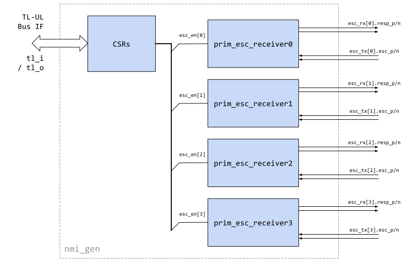

# Overview

This document specifies the functionality of the non-maskable interrupt generator (`nmi_gen`) peripheral.
This module conforms to the [OpenTitan guideline for peripheral device functionality.]().
See that document for integration overview within the broader OpenTitan top level system.
The module provides a mechanism to test the alert handler escalation signals (see [alert handler spec]()), and will be modified or even replaced in the near future.

## Features

- Contains four escalation receivers to receive escalation signals from the alert handler
- Produces four regular interrupts that are derived from the alert handler escalation signals

## Description

The NMI generator module is a simple wrapper module that instantiates four escalation receivers (which are described in more detail in the alert handler spec).
The output of these receivers are converted into regular interrupt requests that can be connected to the PLIC/processor core in order to test the escalation mechanism.

## Parameters

The following table lists the main parameters used throughout the `nmi_gen` design.

Localparam     | Default (Max)         | Description
---------------|-----------------------|---------------
N_ESC_SEV      | 4 (-)                 | Number of escalation receivers (should be left as is).

## Signals



The table below lists other `nmi_gen` signals.

Signal                               | Direction        | Type                    | Description
-------------------------------------|------------------|-------------------------|---------------
`esc_tx_i[N_ESC_SEV-1:0]`            | `input`          | packed `esc_tx_t` array | Differentially encoded escalation signals coming from the alert handler.
`esc_rx_o[N_ESC_SEV-1:0]`            | `output`         | packed `esc_rx_t` array | Differentially encoded response signals to alert handler.

## Register Table


