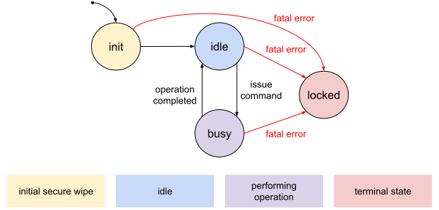

# OpenTitan Big Number Accelerator (OTBN) Technical Specification

{{#block-dashboard otbn}}

# Overview

This document specifies functionality of the OpenTitan Big Number Accelerator, or OTBN.
OTBN is a coprocessor for asymmetric cryptographic operations like RSA or Elliptic Curve Cryptography (ECC).

This module conforms to the [Comportable guideline for peripheral functionality](../../../doc/contributing/hw/comportability/README.md).
See that document for integration overview within the broader top level system.

## Features

* Processor optimized for wide integer arithmetic
* 32b wide control path with 32 32b wide registers
* 256b wide data path with 32 256b wide registers
* Full control-flow support with conditional branch and unconditional jump instructions, hardware loops, and hardware-managed call/return stacks.
* Reduced, security-focused instruction set architecture for easier verification and the prevention of data leaks.
* Built-in access to random numbers.

## Description

OTBN is a processor, specialized for the execution of security-sensitive asymmetric (public-key) cryptography code, such as RSA or ECC.
Such algorithms are dominated by wide integer arithmetic, which are supported by OTBN's 256b wide data path, registers, and instructions which operate these wide data words.
On the other hand, the control flow is clearly separated from the data, and reduced to a minimum to avoid data leakage.

The data OTBN processes is security-sensitive, and the processor design centers around that.
The design is kept as simple as possible to reduce the attack surface and aid verification and testing.
For example, no interrupts or exceptions are included in the design, and all instructions are designed to be executable within a single cycle.

OTBN is designed as a self-contained co-processor with its own instruction and data memory, which is accessible as a bus device.

## Compatibility

OTBN is not designed to be compatible with other cryptographic accelerators.
It received some inspiration from assembly code available from the [Chromium EC project](https://chromium.googlesource.com/chromiumos/platform/ec/),
which has been formally verified within the [Fiat Crypto project](http://adam.chlipala.net/papers/FiatCryptoSP19/FiatCryptoSP19.pdf).

# Instruction Set

OTBN is a processor with a custom instruction set.
The full ISA description can be found in our [ISA manual](./doc/isa.md).
The instruction set is split into two groups:

* The **base instruction subset** operates on the 32b General Purpose Registers (GPRs).
  Its instructions are used for the control flow of a OTBN application.
  The base instructions are inspired by RISC-V's RV32I instruction set, but not compatible with it.
* The **big number instruction subset** operates on 256b Wide Data Registers (WDRs).
  Its instructions are used for data processing.

## Processor State

### General Purpose Registers (GPRs)

OTBN has 32 General Purpose Registers (GPRs), each of which is 32b wide.
The GPRs are defined in line with RV32I and are mainly used for control flow.
They are accessed through the base instruction subset.
GPRs aren't used by the main data path; this operates on the [Wide Data Registers](#wide-data-registers-wdrs), a separate register file, controlled by the big number instructions.

<table>
  <tr>
    <td><code>x0</code></td>
    <td>Zero register. Reads as 0; writes are ignored.</td>
  </tr>
  <tr>
    <td><code>x1</code></td>
<td>

Access to the [call stack](#call-stack)

</td>
  </tr>
  <tr>
    <td><code>x2</code> ... <code>x31</code></td>
    <td>General purpose registers</td>
  </tr>
</table>

Note: Currently, OTBN has no "standard calling convention," and GPRs other than `x0` and `x1` can be used for any purpose.
If a calling convention is needed at some point, it is expected to be aligned with the RISC-V standard calling conventions, and the roles assigned to registers in that convention.
Even without a agreed-on calling convention, software authors are encouraged to follow the RISC-V calling convention where it makes sense.
For example, good choices for temporary registers are `x6`, `x7`, `x28`, `x29`, `x30`, and `x31`.

### Call Stack

OTBN has an in-built call stack which is accessed through the `x1` GPR.
This is intended to be used as a return address stack, containing return addresses for the current stack of function calls.
See the documentation for {{#otbn-insn-ref JAL}} and {{#otbn-insn-ref JALR}} for a description of how to use it for this purpose.

The call stack has a maximum depth of 8 elements.
Each instruction that reads from `x1` pops a single element from the stack.
Each instruction that writes to `x1` pushes a single element onto the stack.
An instruction that reads from an empty stack or writes to a full stack causes a `CALL_STACK` [software error](#design-details-errors).

A single instruction can both read and write to the stack.
In this case, the read is ordered before the write.
Providing the stack has at least one element, this is allowed, even if the stack is full.

### Control and Status Registers (CSRs) {#csrs}

Control and Status Registers (CSRs) are 32b wide registers used for "special" purposes, as detailed in their description;
they are not related to the GPRs.
CSRs can be accessed through dedicated instructions, {{#otbn-insn-ref CSRRS}} and {{#otbn-insn-ref CSRRW}}.
Writes to read-only (RO) registers are ignored; they do not signal an error.
All read-write (RW) CSRs are set to 0 when OTBN starts an operation (when 1 is written to [`CMD.start`](data/otbn.hjson#cmd)).

<!-- This list of CSRs is replicated in otbn_env_cov.sv, wsr.py, the
     RTL and in rig/model.py. If editing one, edit the other four as well. -->
<table>
  <thead>
    <tr>
      <th>Number</th>
      <th>Access</th>
      <th>Name</th>
      <th>Description</th>
    </tr>
  </thead>
  <tbody>
    <tr>
      <td>0x7C0</td>
      <td>RW</td>
      <td>FG0</td>
      <td>
        Wide arithmetic flag group 0.
        This CSR provides access to flag group 0 used by wide integer arithmetic.
        <strong>FLAGS</strong>, <strong>FG0</strong> and <strong>FG1</strong> provide different views on the same underlying bits.
        <table>
          <thead>
            <tr><th>Bit</th><th>Description</th></tr>
          </thead>
          <tbody>
            <tr><td>0</td><td>Carry of Flag Group 0</td></tr>
            <tr><td>1</td><td>MSb of Flag Group 0</td></tr>
            <tr><td>2</td><td>LSb of Flag Group 0</td></tr>
            <tr><td>3</td><td>Zero of Flag Group 0</td></tr>
          </tbody>
        </table>
      </td>
    </tr>
    <tr>
      <td>0x7C1</td>
      <td>RW</td>
      <td>FG1</td>
      <td>
        Wide arithmetic flag group 1.
        This CSR provides access to flag group 1 used by wide integer arithmetic.
        <strong>FLAGS</strong>, <strong>FG0</strong> and <strong>FG1</strong> provide different views on the same underlying bits.
        <table>
          <thead>
            <tr><th>Bit</th><th>Description</th></tr>
          </thead>
          <tbody>
            <tr><td>0</td><td>Carry of Flag Group 1</td></tr>
            <tr><td>1</td><td>MSb of Flag Group 1</td></tr>
            <tr><td>2</td><td>LSb of Flag Group 1</td></tr>
            <tr><td>3</td><td>Zero of Flag Group 1</td></tr>
          </tbody>
        </table>
      </td>
    </tr>
    <tr>
      <td>0x7C8</td>
      <td>RW</td>
      <td>FLAGS</td>
      <td>
        Wide arithmetic flag groups.
        This CSR provides access to both flags groups used by wide integer arithmetic.
        <strong>FLAGS</strong>, <strong>FG0</strong> and <strong>FG1</strong> provide different views on the same underlying bits.
        <table>
          <thead>
            <tr><th>Bit</th><th>Description</th></tr>
          </thead>
          <tbody>
            <tr><td>0</td><td>Carry of Flag Group 0</td></tr>
            <tr><td>1</td><td>MSb of Flag Group 0</td></tr>
            <tr><td>2</td><td>LSb of Flag Group 0</td></tr>
            <tr><td>3</td><td>Zero of Flag Group 0</td></tr>
            <tr><td>4</td><td>Carry of Flag Group 1</td></tr>
            <tr><td>5</td><td>MSb of Flag Group 1</td></tr>
            <tr><td>6</td><td>LSb of Flag Group 1</td></tr>
            <tr><td>7</td><td>Zero of Flag Group 1</td></tr>
          </tbody>
        </table>
      </td>
    </tr>
    <tr>
      <td>0x7D0</td>
      <td>RW</td>
      <td>MOD0</td>
      <td>
        Bits [31:0] of the modulus operand, used in the {{#otbn-insn-ref BN.ADDM}}/{{#otbn-insn-ref BN.SUBM}} instructions.
        This CSR is mapped to the MOD WSR.
      </td>
    </tr>
    <tr>
      <td>0x7D1</td>
      <td>RW</td>
      <td>MOD1</td>
      <td>
        Bits [63:32] of the modulus operand, used in the {{#otbn-insn-ref BN.ADDM}}/{{#otbn-insn-ref BN.SUBM}} instructions.
        This CSR is mapped to the MOD WSR.
      </td>
    </tr>
    <tr>
      <td>0x7D2</td>
      <td>RW</td>
      <td>MOD2</td>
      <td>
        Bits [95:64] of the modulus operand, used in the {{#otbn-insn-ref BN.ADDM}}/{{#otbn-insn-ref BN.SUBM}} instructions.
        This CSR is mapped to the MOD WSR.
      </td>
    </tr>
    <tr>
      <td>0x7D3</td>
      <td>RW</td>
      <td>MOD3</td>
      <td>
        Bits [127:96] of the modulus operand, used in the {{#otbn-insn-ref BN.ADDM}}/{{#otbn-insn-ref BN.SUBM}} instructions.
        This CSR is mapped to the MOD WSR.
      </td>
    </tr>
    <tr>
      <td>0x7D4</td>
      <td>RW</td>
      <td>MOD4</td>
      <td>
        Bits [159:128] of the modulus operand, used in the {{#otbn-insn-ref BN.ADDM}}/{{#otbn-insn-ref BN.SUBM}} instructions.
        This CSR is mapped to the MOD WSR.
      </td>
    </tr>
    <tr>
      <td>0x7D5</td>
      <td>RW</td>
      <td>MOD5</td>
      <td>
        Bits [191:160] of the modulus operand, used in the {{#otbn-insn-ref BN.ADDM}}/{{#otbn-insn-ref BN.SUBM}} instructions.
        This CSR is mapped to the MOD WSR.
      </td>
    </tr>
    <tr>
      <td>0x7D6</td>
      <td>RW</td>
      <td>MOD6</td>
      <td>
        Bits [223:192] of the modulus operand, used in the {{#otbn-insn-ref BN.ADDM}}/{{#otbn-insn-ref BN.SUBM}} instructions.
        This CSR is mapped to the MOD WSR.
      </td>
    </tr>
    <tr>
      <td>0x7D7</td>
      <td>RW</td>
      <td>MOD7</td>
      <td>
        Bits [255:224] of the modulus operand, used in the {{#otbn-insn-ref BN.ADDM}}/{{#otbn-insn-ref BN.SUBM}} instructions.
        This CSR is mapped to the MOD WSR.
      </td>
    </tr>
    <tr>
      <td>0x7D8</td>
      <td>RW</td>
      <td>RND_PREFETCH</td>
      <td>
        Write to this CSR to begin a request to fill the RND cache.
        Always reads as 0.
      </td>
    </tr>
    <tr>
      <td>0xFC0</td>
      <td>RO</td>
      <td>RND</td>
      <td>
An AIS31-compliant class PTG.3 random number with guaranteed entropy and forward and backward secrecy.
Primarily intended to be used for key generation.

The number is sourced from the EDN via a single-entry cache.
Reads when the cache is empty will cause OTBN to be stalled until a new random number is fetched from the EDN.
      </td>
    </tr>
    <tr>
      <td>0xFC1</td>
      <td>RO</td>
      <td>URND</td>
      <td>
A random number without guaranteed secrecy properties or specific statistical properties.
Intended for use in masking and blinding schemes.
Use RND for high-quality randomness.

The number is sourced from an local PRNG.
Reads never stall.
      </td>
    </tr>
  </tbody>
</table>

### Wide Data Registers (WDRs)

In addition to the 32b wide GPRs, OTBN has a second "wide" register file, which is used by the big number instruction subset.
This register file consists of NWDR = 32 Wide Data Registers (WDRs).
Each WDR is WLEN = 256b wide.

Wide Data Registers (WDRs) and the 32b General Purpose Registers (GPRs) are separate register files.
They are only accessible through their respective instruction subset:
GPRs are accessible from the base instruction subset, and WDRs are accessible from the big number instruction subset (`BN` instructions).

| Register |
|----------|
| w0       |
| w1       |
| ...      |
| w31      |

### Wide Special Purpose Registers (WSRs) {#wsrs}

OTBN has 256b Wide Special purpose Registers (WSRs).
These are analogous to the 32b CSRs, but are used by big number instructions.
They can be accessed with the {{#otbn-insn-ref BN.WSRR}} and {{#otbn-insn-ref BN.WSRW}} instructions.
Writes to read-only (RO) registers are ignored; they do not signal an error.
All read-write (RW) WSRs are set to 0 when OTBN starts an operation (when 1 is written to [`CMD.start`](data/otbn.hjson#cmd)).

<!-- This list of WSRs is replicated in otbn_env_cov.sv, wsr.py, the
     RTL and in rig/model.py. If editing one, edit the other four as well. -->
<table>
  <thead>
    <tr>
      <th>Number</th>
      <th>Access</th>
      <th>Name</th>
      <th>Description</th>
    </tr>
  </thead>
  <tbody>
    <tr>
      <td>0x0</td>
      <td>RW</td>
      <td>MOD</td>
<td>

The modulus used by the {{#otbn-insn-ref BN.ADDM}} and {{#otbn-insn-ref BN.SUBM}} instructions.
This WSR is also visible as CSRs `MOD0` through to `MOD7`.

</td>
    </tr>
    <tr>
      <td>0x1</td>
      <td>RO</td>
      <td>RND</td>
      <td>
An AIS31-compliant class PTG.3 random number with guaranteed entropy and forward and backward secrecy.
Primarily intended to be used for key generation.

The number is sourced from the EDN via a single-entry cache.
Reads when the cache is empty will cause OTBN to be stalled until a new random number is fetched from the EDN.
      </td>
    </tr>
    <tr>
      <td>0x2</td>
      <td>RO</td>
      <td>URND</td>
      <td>
A random number without guaranteed secrecy properties or specific statistical properties.
Intended for use in masking and blinding schemes.
Use RND for high-quality randomness.

The number is sourced from a local PRNG.
Reads never stall.
      </td>
    </tr>
    <tr>
      <td>0x3</td>
      <td>RW</td>
      <td>ACC</td>
      <td>
        The accumulator register used by the {{#otbn-insn-ref BN.MULQACC}} instruction.
      </td>
    </tr>
    <tr>
      <td>0x4</td>
      <td>RO</td>
      <td><a name="key-s0-l">KEY_S0_L</a></td>
      <td>
Bits [255:0] of share 0 of the 384b OTBN sideload key provided by the [Key Manager](../keymgr/README.md).

A `KEY_INVALID` software error is raised on read if the Key Manager has not provided a key.
      </td>
    </tr>
    <tr>
      <td>0x5</td>
      <td>RO</td>
      <td><a name="key-s0-h">KEY_S0_H</a></td>
      <td>
Bits [255:128] of this register are always zero.
Bits [127:0] contain bits [383:256] of share 0 of the 384b OTBN sideload key provided by the [Key Manager](../keymgr/README.md).

A `KEY_INVALID` software error is raised on read if the Key Manager has not provided a valid key.
      </td>
    </tr>
    <tr>
      <td>0x6</td>
      <td>RO</td>
      <td><a name="key-s1-l">KEY_S1_L</a></td>
      <td>
Bits [255:0] of share 1 of the 384b OTBN sideload key provided by the [Key Manager](../keymgr/README.md).

A `KEY_INVALID` software error is raised on read if the Key Manager has not provided a valid key.
      </td>
    </tr>
    <tr>
      <td>0x7</td>
      <td>RO</td>
      <td><a name="key-s1-h">KEY_S1_H</a></td>
      <td>
Bits [255:128] of this register are always zero.
Bits [127:0] contain bits [383:256] of share 1 of the 384b OTBN sideload key provided by the [Key Manager](../keymgr/README.md).

A `KEY_INVALID` software error is raised on read if the Key Manager has not provided a valid key.
      </td>
    </tr>
  </tbody>
</table>

### Flags

In addition to the wide register file, OTBN maintains global state in two groups of flags for the use by wide integer operations.
Flag groups are named Flag Group 0 (`FG0`), and Flag Group 1 (`FG1`).
Each group consists of four flags.
Each flag is a single bit.

- `C` (Carry flag).
  Set to 1 an overflow occurred in the last arithmetic instruction.

- `M` (MSb flag)
  The most significant bit of the result of the last arithmetic or shift instruction.

- `L` (LSb flag).
  The least significant bit of the result of the last arithmetic or shift instruction.

- `Z` (Zero Flag)
  Set to 1 if the result of the last operation was zero; otherwise 0.

The `M`, `L`, and `Z` flags are determined based on the result of the operation as it is written back into the result register, without considering the overflow bit.

### Loop Stack

OTBN has two instructions for hardware-assisted loops: {{#otbn-insn-ref LOOP}} and {{#otbn-insn-ref LOOPI}}.
Both use the same state for tracking control flow.
This is a stack of tuples containing a loop count, start address and end address.
The stack has a maximum depth of eight and the top of the stack is the current loop.

# Security Features

OTBN is a security co-processor.
It contains various security features and is hardened against side-channel analysis and fault injection attacks.
The following sections describe the high-level security features of OTBN.
Refer to the [Design Details](#design-details) section for a more in-depth description.

## Data Integrity Protection

OTBN's data integrity protection is designed to protect the data stored and processed within OTBN from modifications through physical attacks.

Data in OTBN travels along a data path which includes the data memory (DMEM), the load-store-unit (LSU), the register files (GPR and WDR), and the execution units.
Whenever possible, data transmitted or stored within OTBN is protected with an integrity protection code which guarantees the detection of at least three modified bits per 32 bit word.
Additionally, instructions and data stored in the instruction and data memory, respectively, are scrambled with a lightweight, non-cryptographically-secure cipher.

Refer to the [Data Integrity Protection](#design-details-data-integrity-protection) section for details of how the data integrity protections are implemented.

## Secure Wipe

OTBN provides a mechanism to securely wipe all state it stores, including the instruction memory.

The full secure wipe mechanism is split into three parts:
- [Data memory secure wipe](#design-details-secure-wipe-dmem)
- [Instruction memory secure wipe](#design-details-secure-wipe-imem)
- [Internal state secure wipe](#design-details-secure-wipe-internal)

A secure wipe is performed automatically in certain situations, or can be requested manually by the host software.
The full secure wipe is automatically initiated as a local reaction to a fatal error.
In addition, it can be triggered by the [Life Cycle Controller](../lc_ctrl/README.md) before RMA entry using the `lc_rma_req/ack` interface.
In both cases OTBN enters the locked state afterwards and needs to be reset.
A secure wipe of only the internal state is performed after reset, whenever an OTBN operation is complete, and after a recoverable error.
Finally, host software can manually trigger the data memory and instruction memory secure wipe operations by issuing an appropriate [command](#design-details-commands).

Refer to the [Secure Wipe](#design-details-secure-wipe) section for implementation details.

## Instruction Counter

In order to detect and mitigate fault injection attacks on the OTBN, the host CPU can read the number of executed instructions from [`INSN_CNT`](data/otbn.hjson#insn_cnt) and verify whether it matches the expectation.
The host CPU can clear the instruction counter when OTBN is not running.
Writing any value to [`INSN_CNT`](data/otbn.hjson#insn_cnt) clears this register to zero.
Write attempts while OTBN is running are ignored.

## Key Sideloading

OTBN software can make use of a single 384b wide key provided by the [Key Manager](../keymgr/README.md), which is made available in two shares.
The key is passed through a dedicated connection between the Key Manager and OTBN to avoid exposing it to other components.
Software can access the first share of the key through the [`KEY_S0_L`](#key-s0-l) and [`KEY_S0_H`](#key-s0-h) WSRs, and the second share of the key through the [`KEY_S1_L`](#key-s1-l) and [`KEY_S1_H`](#key-s1-h) WSRs.

It is up to host software to configure the Key Manager so that it provides the right key to OTBN at the start of the operation, and to remove the key again once the operation on OTBN has completed.
A `KEY_INVALID` software error is raised if OTBN software accesses any of the `KEY_*` WSRs when the Key Manager has not presented a key.

## Blanking {#blanking}

To reduce side channel leakage OTBN employs a blanking technique on certain control and data paths.
When a path is blanked it is forced to 0 (by ANDing the path with a blanking signal) preventing sensitive data bits producing a power signature via that path where that path isn't needed for the current instruction.

Blanking controls all come directly from flops to prevent glitches in decode logic reducing the effectiveness of the blanking.
These control signals are determined in the [prefetch stage](#instruction-prefetch) via pre-decode logic.
Full decoding is still performed in the execution stage with the full decode results checked against the pre-decode blanking control.
If the full decode disagrees with the pre-decode OTBN raises a `BAD_INTERNAL_STATE` fatal error.

Blanking is applied in the following locations:

* Read path from the bignum, CSR and WDR register files.
  This is achieved with a one-hot mux with a two-level AND-OR structure.
* Write data into the bignum, CSR and WDR register files.
  Blanking is done separately for each register (as opposed to once on incoming write data that fans out to each register).
* All relevant data paths within the bignum ALU and MAC.
  Data paths not required for the instruction being executed are blanked.

Note there is no blanking on the base side (save for the CSRs as these provide access to WDRs such as ACC).

# Theory of Operations

## Block Diagram


## Hardware Interfaces

* [Interface Tables](data/otbn.hjson#interfaces)

### Hardware Interface Requirements

OTBN connects to other components in an OpenTitan system.
This section lists requirements on those interfaces that go beyond the physical connectivity.

#### Entropy Distribution Network (EDN)

OTBN has two EDN connections: `edn_urnd` and `edn_rnd`.
What kind of randomness is provided on the EDN connections is configurable at runtime, but unknown to OTBN.
To maintain its security properties, OTBN requires the following configuration for the two EDN connections:

* OTBN has no specific requirements on the randomness drawn from `edn_urnd`.
  For performance reasons, requests on this EDN connection should be answered quickly.
* `edn_rnd` must provide AIS31-compliant class PTG.3 random numbers.
  The randomness from this interface is made available through the `RND` WSR and intended to be used for key generation.

## Design Details {#design-details}

### Memories

The OTBN processor core has access to two dedicated memories: an instruction memory (IMEM), and a data memory (DMEM).
Each memory is 4 kiB in size.

The memory layout follows the Harvard architecture.
Both memories are byte-addressed, with addresses starting at 0.

The instruction memory (IMEM) is 32b wide and provides the instruction stream to the OTBN processor.
It cannot be read from or written to by user code through load or store instructions.

The data memory (DMEM) is 256b wide and read-write accessible from the base and big number instruction subsets of the OTBN processor core.
There are four instructions that can access data memory.
In the base instruction subset, there are {{#otbn-insn-ref LW}} (load word) and {{#otbn-insn-ref SW}} (store word).
These access 32b-aligned 32b words.
In the big number instruction subset, there are {{#otbn-insn-ref BN.LID}} (load indirect) and {{#otbn-insn-ref BN.SID}} (store indirect).
These access 256b-aligned 256b words.

Both memories can be accessed through OTBN's register interface ([`DMEM`](data/otbn.hjson#dmem) and [`IMEM`](data/otbn.hjson#imem)).
All memory accesses through the register interface must be word-aligned 32b word accesses.

When OTBN is in any state other than [idle](#design-details-operational-states), reads return zero and writes have no effect.
Furthermore, a memory access when OTBN is neither idle nor locked will cause OTBN to generate a fatal error with code `ILLEGAL_BUS_ACCESS`.
A host processor can check whether OTBN is busy by reading the [`STATUS`](data/otbn.hjson#status) register.

The underlying memories used to implement the IMEM and DMEM may not grant all access requests (see [Memory Scrambling](#design-details-memory-scrambling) for details).
A request won't be granted if new scrambling keys have been requested for the memory that aren't yet available.
Functionally it should be impossible for either OTBN or a host processor to make a memory request whilst new scrambling keys are unavailable.
OTBN is in the busy state whilst keys are requested so OTBN will not execute any programs and a host processor access will generated an `ILLEGAL_BUS_ACCESS` fatal error.
Should a request not be granted due to a fault, a `BAD_INTERNAL_STATE` fatal error will be raised.

While DMEM is 4kiB, only the first 3kiB (at addresses `0x0` to `0xbff`) is visible through the register interface.
This is to allow OTBN applications to store sensitive information in the other 1kiB, making it harder for that information to leak back to Ibex.

Each memory write through the register interface updates a checksum.
See the [Memory Load Integrity](#mem-load-integrity) section for more details.

### Instruction Prefetch {#instruction-prefetch}

OTBN employs an instruction prefetch stage to enable pre-decoding of instructions to enable the [blanking SCA hardening measure](#blanking).
Its operation is entirely transparent to software.
It does not speculate and will only prefetch where the next instruction address can be known.
This results in a stall cycle for all conditional branches and jumps as the result is neither predicted nor known ahead of time.
Instruction bits held in the prefetch buffer are unscrambled but use the integrity protection described in [Data Integrity Protection](#design-details-data-integrity-protection).

### Random Numbers

OTBN is connected to the [Entropy Distribution Network (EDN)](../edn/README.md) which can provide random numbers via the `RND` and `URND` CSRs and WSRs.

`RND` provides bits taken directly from the EDN connected via `edn_rnd`.
The EDN interface provides 32b of entropy per transaction and comes from a different clock domain to the OTBN core.
A FIFO is used to synchronize the incoming package to the OTBN clock domain.
Synchronized packages are then set starting from bottom up to a single `WLEN` value of 256b.
In order to service a single EDN request, a total of 8 transactions are required from EDN interface.

The `RND` CSR and WSR take their bits from the same source.
A read from the `RND` CSR returns the bottom 32b; the other 192b are discarded.
On a read from the `RND` CSR or WSR, OTBN will stall while it waits for data.
It will resume execution on the cycle after it receives the final word of data from the EDN.

As an EDN request can take time, `RND` is backed by a single-entry cache containing the result of the most recent EDN request in OTBN core level.
Writing any value to the `RND_PREFETCH` CSR initiates a prefetch.
This requests data from the EDN, storing it in the cache, and can hide the EDN latency.
Writes to `RND_PREFETCH` will be ignored whilst a prefetch is in progress or when the cache is already full.
If the cache is full, a read from `RND` returns immediately with the contents of the cache, which is then emptied.
If the cache is not full, a read from `RND` will block as described above until OTBN receives the final word of data from the EDN.

OTBN discards any data that is in the cache at the start of an operation.
If there is still a pending prefetch when an OTBN operation starts, the results of the prefetch will also discarded.

`URND` provides bits from a local XoShiRo256++ PRNG within OTBN; reads from it never stall.
This PRNG is seeded once from the EDN connected via `edn_urnd` when OTBN starts execution.
Each new execution of OTBN will reseed the `URND` PRNG.
The PRNG state is advanced every cycle when OTBN is running.

The PRNG has a long cycle length but has a fixed point: the sequence of numbers will get stuck if the state ever happens to become zero.
This will never happen in normal operation.
If a fault causes the state to become zero, OTBN raises a `BAD_INTERNAL_STATE` fatal error.

### Operational States {#design-details-operational-states}

<!--
Source: https://docs.google.com/drawings/d/1C0D4UriRk5pKGFoFtAXYLcJ1oBG1BCDd2omCLPYHtr0/edit

Download the SVG from Google Draw, open it in Inkscape once and save it without changes to add width/height information to the image.
-->


OTBN can be in different operational states.
After reset (*init*), OTBN performs a secure wipe of the internal state and then becomes *idle*.
OTBN is *busy* for as long it is performing an operation.
OTBN is *locked* if a fatal error was observed or after handling an RMA request.

The current operational state is reflected in the [`STATUS`](data/otbn.hjson#status) register.
- After reset, OTBN is busy with the internal secure wipe and the [`STATUS`](data/otbn.hjson#status) register is set to `BUSY_SEC_WIPE_INT`.
- If OTBN is idle, the [`STATUS`](data/otbn.hjson#status) register is set to `IDLE`.
- If OTBN is busy, the [`STATUS`](data/otbn.hjson#status) register is set to one of the values starting with `BUSY_`.
- If OTBN is locked, the [`STATUS`](data/otbn.hjson#status) register is set to `LOCKED`.

OTBN transitions into the busy state as result of host software [issuing a command](#design-details-commands); OTBN is then said to perform an operation.
OTBN transitions out of the busy state whenever the operation has completed.
In the [`STATUS`](data/otbn.hjson#status) register the different `BUSY_*` values represent the operation that is currently being performed.

A transition out of the busy state is signaled by the `done` interrupt ([`INTR_STATE.done`](data/otbn.hjson#intr_state)).

The locked state is a terminal state; transitioning out of it requires an OTBN reset.

### Operations and Commands {#design-details-commands}

OTBN understands a set of commands to perform certain operations.
Commands are issued by writing to the [`CMD`](data/otbn.hjson#cmd) register.

The `EXECUTE` command starts the [execution of the application](#design-details-software-execution) contained in OTBN's instruction memory.

The `SEC_WIPE_DMEM` command [securely wipes the data memory](#design-details-secure-wipe).

The `SEC_WIPE_IMEM` command [securely wipes the instruction memory](#design-details-secure-wipe).

### Software Execution {#design-details-software-execution}

Software execution on OTBN is triggered by host software by [issuing the `EXECUTE` command](#design-details-commands).
The software then runs to completion, without the ability for host software to interrupt or inspect the execution.

- OTBN transitions into the busy state, and reflects this by setting [`STATUS`](data/otbn.hjson#status) to `BUSY_EXECUTE`.
- The internal randomness source, which provides random numbers to the `URND` CSR and WSR, is re-seeded from the EDN.
- The instruction at address zero is fetched and executed.
- From this point on, all subsequent instructions are executed according to their semantics until either an {{#otbn-insn-ref ECALL}} instruction is executed, or an error is detected.
- A [secure wipe of internal state](#design-details-secure-wipe-internal) is performed.
- The [`ERR_BITS`](data/otbn.hjson#err_bits) register is set to indicate either a successful execution (value `0`), or to indicate the error that was observed (a non-zero value).
- OTBN transitions into the [idle state](#design-details-operational-states) (in case of a successful execution, or a recoverable error) or the locked state (in case of a fatal error).
  This transition is signaled by raising the `done` interrupt ([`INTR_STATE.done`](data/otbn.hjson#intr_state)), and reflected in the [`STATUS`](data/otbn.hjson#status) register.

### Errors {#design-details-errors}

OTBN is able to detect a range of errors, which are classified as *software errors* or *fatal errors*.
A software error is an error in the code that OTBN executes.
In the absence of an attacker, these errors are due to a programmer's mistake.
A fatal error is typically the violation of a security property.
All errors and their classification are listed in the [List of Errors](#design-details-list-of-errors).

Whenever an error is detected, OTBN reacts locally, and informs the OpenTitan system about it by raising an alert.
OTBN generally does not try to recover from errors itself, and provides no error handling support to code that runs on it.

OTBN gives host software the option to recover from some errors by restarting the operation.
All software errors are treated as recoverable, unless [`CTRL.software_errs_fatal`](data/otbn.hjson#ctrl) is set, and are handled as described in the section [Reaction to Recoverable Errors](#design-details-recoverable-errors).
When [`CTRL.software_errs_fatal`](data/otbn.hjson#ctrl) is set, software errors become fatal errors.

Fatal errors are treated as described in the section [Reaction to Fatal Errors](#design-details-fatal-errors).

### Reaction to Recoverable Errors {#design-details-recoverable-errors}

Recoverable errors can be the result of a programming error in OTBN software.
Recoverable errors can only occur during the execution of software on OTBN, and not in other situations in which OTBN might be busy.

The following actions are taken when OTBN detects a recoverable error:

1. The currently running operation is terminated, similar to the way an {{#otbn-insn-ref ECALL}} instruction [is executed](#writing-otbn-applications-ecall):
   - No more instructions are fetched or executed.
   - A [secure wipe of internal state](#design-details-secure-wipe-internal) is performed.
   - The [`ERR_BITS`](data/otbn.hjson#err_bits) register is set to a non-zero value that describes the error.
   - The current operation is marked as complete by setting [`INTR_STATE.done`](data/otbn.hjson#intr_state).
   - The [`STATUS`](data/otbn.hjson#status) register is set to `IDLE`.
2. A [recoverable alert](#alerts) is raised.

The host software can start another operation on OTBN after a recoverable error was detected.

### Reaction to Fatal Errors {#design-details-fatal-errors}

Fatal errors are generally seen as a sign of an intrusion, resulting in more drastic measures to protect the secrets stored within OTBN.
Fatal errors can occur at any time, even when an OTBN operation isn't in progress.

The following actions are taken when OTBN detects a fatal error:

1. A [secure wipe of the data memory](#design-details-secure-wipe-dmem) and a [secure wipe of the instruction memory](#design-details-secure-wipe-imem) is initiated.
2. If OTBN [is not idle](#design-details-operational-states), then the currently running operation is terminated, similarly to how an operation ends after an {{#otbn-insn-ref ECALL}} instruction [is executed](#writing-otbn-applications-ecall):
   - No more instructions are fetched or executed.
   - A [secure wipe of internal state](#design-details-secure-wipe-internal) is performed.
   - The [`ERR_BITS`](data/otbn.hjson#err_bits) register is set to a non-zero value that describes the error.
   - The current operation is marked as complete by setting [`INTR_STATE.done`](data/otbn.hjson#intr_state).
3. The [`STATUS`](data/otbn.hjson#status) register is set to `LOCKED`.
4. A [fatal alert](#alerts) is raised.

Note that OTBN can detect some errors even when it isn't running.
One example of this is an error caused by an integrity error when reading or writing OTBN's memories over the bus.
In this case, the [`ERR_BITS`](data/otbn.hjson#err_bits) register will not change.
This avoids race conditions with the host processor's error handling software.
However, every error that OTBN detects when it isn't running is fatal.
This means that the cause will be reflected in [`FATAL_ALERT_CAUSE`](data/otbn.hjson#fatal_alert_cause), as described below in [Alerts](#alerts).
This way, no alert is generated without setting an error code somewhere.

### List of Errors {#design-details-list-of-errors}

<table>
  <thead>
    <tr>
      <th>Name</th>
      <th>Class</th>
      <th>Description</th>
    </tr>
  </thead>
  <tbody>
    <tr>
      <td><code>BAD_DATA_ADDR</code></td>
      <td>software</td>
      <td>A data memory access occurred with an out of bounds or unaligned access.</td>
    </tr>
    <tr>
      <td><code>BAD_INSN_ADDR</code></td>
      <td>software</td>
      <td>An instruction memory access occurred with an out of bounds or unaligned access.</td>
    </tr>
    <tr>
      <td><code>CALL_STACK</code></td>
      <td>software</td>
      <td>An instruction tried to pop from an empty call stack or push to a full call stack.</td>
    </tr>
    <tr>
      <td><code>ILLEGAL_INSN</code></td>
      <td>software</td>
      <td>
        An illegal instruction was about to be executed.
      </td>
    <tr>
      <td><code>LOOP</code></td>
      <td>software</td>
      <td>
        A loop stack-related error was detected.
      </td>
    </tr>
    <tr>
      <td><code>KEY_INVALID</code></td>
      <td>software</td>
      <td>
        An attempt to read a `KEY_*` WSR was detected, but no key was provided by the key manager.
      </td>
    </tr>
    <tr>
      <td><code>RND_REP_CHK_FAIL</code></td>
      <td>recoverable</td>
      <td>
        The random number obtained from the last read of the RND register failed the repetition check.
        The RND EDN interface returned identical random numbers on two subsequent entropy requests.
      </td>
    </tr>
    <tr>
      <td><code>RND_FIPS_CHK_FAIL</code></td>
      <td>recoverable</td>
      <td>
        The random number obtained from the last read of the RND register has been generated from entropy that at least partially failed the FIPS health checks in the entropy source.
      </td>
    </tr>
    <tr>
      <td><code>IMEM_INTG_VIOLATION</code></td>
      <td>fatal</td>
      <td>Data read from the instruction memory failed the integrity checks.</td>
    </tr>
    <tr>
      <td><code>DMEM_INTG_VIOLATION</code></td>
      <td>fatal</td>
      <td>Data read from the data memory failed the integrity checks.</td>
    </tr>
    <tr>
      <td><code>REG_INTG_VIOLATION</code></td>
      <td>fatal</td>
      <td>Data read from a GPR or WDR failed the integrity checks.</td>
    </tr>
    <tr>
      <td><code>BUS_INTG_VIOLATION</code></td>
      <td>fatal</td>
      <td>An incoming bus transaction failed the integrity checks.</td>
    </tr>
    <tr>
      <td><code>BAD_INTERNAL_STATE</code></td>
      <td>fatal</td>
      <td>The internal state of OTBN has become corrupt.</td>
    </tr>
    <tr>
      <td><code>ILLEGAL_BUS_ACCESS</code></td>
      <td>fatal</td>
      <td>A bus-accessible register or memory was accessed when not allowed.</td>
    </tr>
    <tr>
      <td><code>LIFECYCLE_ESCALATION</code></td>
      <td>fatal</td>
      <td>A life cycle escalation request was received.</td>
    </tr>
    <tr>
      <td><code>FATAL_SOFTWARE</code></td>
      <td>fatal</td>
      <td>A software error was seen and [`CTRL.software_errs_fatal`](data/otbn.hjson#ctrl) was set.</td>
    </tr>
  </tbody>
</table>

### Alerts

An alert is a reaction to an error that OTBN detected.
OTBN has two alerts, one recoverable and one fatal.

A **recoverable alert** is a one-time triggered alert caused by [recoverable errors](#design-details-recoverable-errors).
The error that caused the alert can be determined by reading the [`ERR_BITS`](data/otbn.hjson#err_bits) register.

A **fatal alert** is a continuously triggered alert caused by [fatal errors](#design-details-fatal-errors).
The error that caused the alert can be determined by reading the [`FATAL_ALERT_CAUSE`](data/otbn.hjson#fatal_alert_cause) register.
If OTBN was running, this value will also be reflected in the [`ERR_BITS`](data/otbn.hjson#err_bits) register.
A fatal alert can only be cleared by resetting OTBN through the `rst_ni` line.

The host CPU can clear the [`ERR_BITS`](data/otbn.hjson#err_bits) when OTBN is not running.
Writing any value to [`ERR_BITS`](data/otbn.hjson#err_bits) clears this register to zero.
Write attempts while OTBN is running are ignored.

### Reaction to Life Cycle Escalation Requests {#design-details-lifecycle-escalation}

OTBN receives and reacts to escalation signals from the [life cycle controller](../lc_ctrl/README.md#security-escalation).
An incoming life cycle escalation is a fatal error of type `lifecycle_escalation` and treated as described in the section [Fatal Errors](#design-details-fatal-errors).

### Idle

OTBN exposes a single-bit `idle_o` signal, intended to be used by the clock manager to clock-gate the block when it is not in use.
This signal is in the same clock domain as `clk_i`.
The `idle_o` signal is high when OTBN [is idle](#design-details-operational-states), and low otherwise.

OTBN also exposes another version of the idle signal as `idle_otp_o`.
This works analogously, but is in the same clock domain as `clk_otp_i`.

TODO: Specify interactions between `idle_o`, `idle_otp_o` and the clock manager fully.

### Data Integrity Protection {#design-details-data-integrity-protection}

OTBN stores and operates on data (state) in its dedicated memories, register files, and internal registers.
OTBN's data integrity protection is designed to protect all data stored and transmitted within OTBN from modifications through physical attacks.

During transmission, the integrity of data is protected with an integrity protection code.
Data at rest in the instruction and data memories is additionally scrambled.

In the following, the Integrity Protection Code and the scrambling algorithm are discussed, followed by their application to individual storage elements.

#### Integrity Protection Code {#design-details-integrity-protection-code}

OTBN uses the same integrity protection code everywhere to provide overarching data protection without regular re-encoding.
The code is applied to 32b data words, and produces 39b of encoded data.

The code used is an (39,32) Hsiao "single error correction, double error detection" (SECDED) error correction code (ECC) [[CHEN08](#ref-chen08)].
It has a minimum Hamming distance of four, resulting in the ability to detect at least three errors in a 32 bit word.
The code is used for error detection only; no error correction is performed.

#### Memory Scrambling {#design-details-memory-scrambling}

Contents of OTBN's instruction and data memories are scrambled while at rest.
The data is bound to the address and scrambled before being stored in memory.
The addresses are randomly remapped.

Note that data stored in other temporary memories within OTBN, including the register files, is not scrambled.

Scrambling is used to obfuscate the memory contents and to diffuse the data.
Obfuscation makes passive probing more difficult, while diffusion makes active fault injection attacks more difficult.

The scrambling mechanism is described in detail in the [section "Scrambling Primitive" of the SRAM Controller Technical Specification](../sram_ctrl/README.md#scrambling-primitive).

When OTBN comes out of reset, its memories have default scrambling keys.
The host processor can request new keys for each memory by issuing a [secure wipe of DMEM](#design-details-secure-wipe-dmem) and a [secure wipe of IMEM](#design-details-secure-wipe-imem).

#### Actions on Integrity Errors

A fatal error is raised whenever a data integrity violation is detected, which results in an immediate stop of all processing and the issuing of a fatal alert.
The section [Error Handling and Reporting](#design-details-error-handling-and-reporting) describes the error handling in more detail.

#### Register File Integrity Protection

OTBN contains two register files: the 32b GPRs and the 256b WDRs.
The data stored in both register files is protected with the [Integrity Protection Code](#design-details-integrity-protection-code).
Neither the register file contents nor register addresses are scrambled.

The GPRs `x2` to `x31` store a 32b data word together with the Integrity Protection Code, resulting in 39b of stored data.
(`x0`, the zero register, and `x1`, the call stack, require special treatment.)

Each 256b Wide Data Register (WDR) stores a 256b data word together with the Integrity Protection Code, resulting in 312b of stored data.
The integrity protection is done separately for each of the eight 32b sub-words within a 256b word.

The register files can consume data protected with the Integrity Protection Code, or add it on demand.
Whenever possible the Integrity Protection Code is preserved from its source and written directly to the register files without recalculation, in particular in the following cases:

* Data coming from the data memory (DMEM) through the load-store unit to a GPR or WDR.
* Data copied between WDRs using the {{#otbn-insn-ref BN.MOV}} or {{#otbn-insn-ref BN.MOVR}} instructions.
* Data conditionally copied between WDRs using the {{#otbn-insn-ref BN.SEL}} instruction.
* Data copied between the `ACC` and `MOD` WSRs and a WDR.
* Data copied between any of the `MOD0` to `MOD7` CSRs and a GPR.
  (TODO: Not yet implemented.)

In all other cases the register files add the Integrity Protection Code to the incoming data before storing the data word.

The integrity protection bits are checked on every read from the register files, even if the integrity protection is not removed from the data.

Detected integrity violations in a register file raise a fatal `reg_error`.

#### Data Memory (DMEM) Integrity Protection

OTBN's data memory is 256b wide, but allows for 32b word accesses.
To facilitate such accesses, all integrity protection in the data memory is done on a 32b word granularity.

All data entering or leaving the data memory block is protected with the [Integrity Protection Code](#design-details-integrity-protection-code);
this code is not re-computed within the memory block.

Before being stored in SRAM, the data word with the attached Integrity Protection Code, as well as the address are scrambled according to the [memory scrambling algorithm](#design-details-memory-scrambling).
The scrambling is reversed on a read.

The ephemeral memory scrambling key and the nonce are provided by the [OTP block](../otp_ctrl/README.md).
They are set once when OTBN block is reset, and changed whenever a [secure wipe](#design-details-secure-wipe-dmem) of the data memory is performed.


The Integrity Protection Code is checked on every memory read, even though the code remains attached to the data.
A further check must be performed when the data is consumed.
Detected integrity violations in the data memory raise a fatal `dmem_error`.

#### Instruction Memory (IMEM) Integrity Protection

All data entering or leaving the instruction memory block is protected with the [Integrity Protection Code](#design-details-integrity-protection-code);
this code is not re-computed within the memory block.

Before being stored in SRAM, the instruction word with the attached Integrity Protection Code, as well as the address are scrambled according to the [memory scrambling algorithm](#design-details-memory-scrambling).
The scrambling is reversed on a read.

The ephemeral memory scrambling key and the nonce are provided by the [OTP block](../otp_ctrl/README.md).
They are set once when OTBN block is reset, and changed whenever a [secure wipe](#design-details-secure-wipe-imem) of the instruction memory is performed.

The Integrity Protection Code is checked on every memory read, even though the code remains attached to the data.
A further check must be performed when the data is consumed.
Detected integrity violations in the data memory raise a fatal `imem_error`.

### Memory Load Integrity {#mem-load-integrity}

As well as the integrity protection discussed above for the memories and bus interface, OTBN has a second layer of integrity checking to allow a host processor to ensure that a program has been loaded correctly.
This is visible through the [`LOAD_CHECKSUM`](data/otbn.hjson#load_checksum) register.
The register exposes a cumulative CRC checksum which is updated on every write to either memory.

This is intended as a light-weight way to implement a more efficient "write and read back" check.
It isn't a cryptographically secure MAC, so cannot spot an attacker who can completely control the bus.
However, in this case the attacker would be equally able to control responses from OTBN, so any such check could be subverted.

The CRC used is the 32-bit CRC-32-IEEE checksum.
This standard choice of generating polynomial makes it compatible with other tooling and libraries, such as the [crc32 function](https://docs.python.org/3/library/binascii.html#binascii.crc32) in the python 'binascii' module and the crc instructions in the RISC-V bitmanip specification [[SYMBIOTIC21]](#ref-symbiotic21).
The stream over which the checksum is computed is the stream of writes that have been seen since the last write to [`LOAD_CHECKSUM`](data/otbn.hjson#load_checksum).
Each write is treated as a 48b value, `{imem, idx, wdata}`.
Here, `imem` is a single bit flag which is one for writes to IMEM and zero for writes to DMEM.
The `idx` value is the index of the word within the memory, zero extended from 10b to 15b.
Finally, `wdata` is the 32b word that was written.
Writes that are less than 32b or not aligned on a 32b boundary are ignored and not factored into the CRC calculation.

The host processor can also write to the register.
Typically, this will be to clear the value to `32'h00000000`, the traditional starting value for a 32-bit CRC.
Note the internal representation of the CRC is inverted from the register visible version.
This is done to maintain compatibility with existing CRC-32-IEEE tooling and libraries.

To use this functionality, the host processor should set [`LOAD_CHECKSUM`](data/otbn.hjson#load_checksum) to a known value (traditionally, `32'h00000000`).
Next, it should write the program to be loaded to OTBN's IMEM and DMEM over the bus.
Finally, it should read back the value of [`LOAD_CHECKSUM`](data/otbn.hjson#load_checksum) and compare it with an expected value.

### Secure Wipe {#design-details-secure-wipe}

Applications running on OTBN may store sensitive data in the internal registers or the memory.
In order to prevent an untrusted application from reading any leftover data, OTBN provides the secure wipe operation.
This operation can be applied to:
- [Data memory](#design-details-secure-wipe-dmem)
- [Instruction memory](#design-details-secure-wipe-imem)
- [Internal state](#design-details-secure-wipe-internal)

The three forms of secure wipe can be triggered in different ways.

A secure wipe of either the instruction or the data memory can be triggered from host software by issuing a `SEC_WIPE_DMEM` or `SEC_WIPE_IMEM` [command](#design-details-command).

A secure wipe of instruction memory, data memory, and all internal state is performed automatically when handling a [fatal error](#design-details-fatal-errors).
In addition, it can be triggered by the [Life Cycle Controller](../lc_ctrl/README.md) before RMA entry using the `lc_rma_req/ack` interface.
In both cases OTBN enters the locked state afterwards and needs to be reset.

A secure wipe of the internal state only is triggered automatically after reset and when OTBN [ends the software execution](#design-details-software-execution), either successfully, or unsuccessfully due to a [recoverable error](#design-details-recoverable-errors).

If OTBN cannot complete a secure wipe of the internal state (e.g., due to failing to obtain the required randomness), it immediately becomes locked.
In this case, OTBN must be reset and will then retry the secure wipe.
The secure wipe after reset must succeed before OTBN can be used.

#### Data Memory (DMEM) Secure Wipe {#design-details-secure-wipe-dmem}

The wiping is performed by securely replacing the memory scrambling key, making all data stored in the memory unusable.
The key replacement is a two-step process:

* Overwrite the 128b key of the memory scrambling primitive with randomness from URND.
  This action takes a single cycle.
* Request new scrambling parameters from OTP.
  The request takes multiple cycles to complete.

Host software can initiate a data memory secure wipe by [issuing the `SEC_WIPE_DMEM` command](#design-details-commands).

#### Instruction Memory (IMEM) Secure Wipe {#design-details-secure-wipe-imem}

The wiping is performed by securely replacing the memory scrambling key, making all instructions stored in the memory unusable.
The key replacement is a two-step process:

* Overwrite the 128b key of the memory scrambling primitive with randomness from URND.
  This action takes a single cycle.
* Request new scrambling parameters from OTP.
  The request takes multiple cycles to complete.

Host software can initiate a data memory secure wipe by [issuing the `SEC_WIPE_IMEM` command](#design-details-commands).

#### Internal State Secure Wipe {#design-details-secure-wipe-internal}

OTBN provides a mechanism to securely wipe all internal state, excluding the instruction and data memories.

The following state is wiped:
* Register files: GPRs and WDRs
* The accumulator register (also accessible through the ACC WSR)
* Flags (accessible through the FG0, FG1, and FLAGS CSRs)
* The modulus (accessible through the MOD0 to MOD7 CSRs and the MOD WSR)

The wiping procedure is a two-step process:
* Overwrite the state with randomness from URND and request a reseed of URND.
* Overwrite the state with randomness from reseeded URND.

Note that after internal secure wipe, the state of registers is undefined.
In order to prevent mismatches between ISS and RTL, software needs to initialise a register with a full-word write before using its value.

Loop and call stack pointers are reset.

Host software cannot explicitly trigger an internal secure wipe; it is performed automatically after reset and at the end of an `EXECUTE` operation.

# Running applications on OTBN

OTBN is a specialized coprocessor which is used from the host CPU.
This section describes how to interact with OTBN from the host CPU to execute an existing OTBN application.
The section [Writing OTBN applications](#writing-otbn-applications) describes how to write such applications.

## High-level operation sequence

The high-level sequence by which the host processor should use OTBN is as follows.

1. Optional: Initialise [`LOAD_CHECKSUM`](data/otbn.hjson#load_checksum).
1. Write the OTBN application binary to [`IMEM`](data/otbn.hjson#imem), starting at address 0.
1. Optional: Write constants and input arguments, as mandated by the calling convention of the loaded application, to the half of DMEM accessible through the [`DMEM`](data/otbn.hjson#dmem) window.
1. Optional: Read back [`LOAD_CHECKSUM`](data/otbn.hjson#load_checksum) and perform an integrity check.
1. Start the operation on OTBN by [issuing the `EXECUTE` command](#design-details-commands).
   Now neither data nor instruction memory may be accessed from the host CPU.
   After it has been started the OTBN application runs to completion without further interaction with the host.
1. Wait for the operation to complete (see below).
   As soon as the OTBN operation has completed the data and instruction memories can be accessed again from the host CPU.
1. Check if the operation was successful by reading the [`ERR_BITS`](data/otbn.hjson#err_bits) register.
1. Optional: Retrieve results by reading [`DMEM`](data/otbn.hjson#dmem), as mandated by the calling convention of the loaded application.

OTBN applications are run to completion.
The host CPU can determine if an application has completed by either polling [`STATUS`](data/otbn.hjson#status) or listening for an interrupt.

* To poll for a completed operation, software should repeatedly read the [`STATUS`](data/otbn.hjson#status) register.
  The operation is complete if [`STATUS`](data/otbn.hjson#status) is `IDLE` or `LOCKED`, otherwise the operation is in progress.
  When [`STATUS`](data/otbn.hjson#status) has become `LOCKED` a fatal error has occurred and OTBN must be reset to perform further operations.
* Alternatively, software can listen for the `done` interrupt to determine if the operation has completed.
  The standard sequence of working with interrupts has to be followed, i.e. the interrupt has to be enabled, an interrupt service routine has to be registered, etc.
  The [DIF](#dif) contains helpers to do so conveniently.

Note: This operation sequence only covers functional aspects.
Depending on the application additional steps might be necessary, such as deleting secrets from the memories.

## Device Interface Functions (DIFs) {#dif}

- [Device Interface Functions](../../../sw/device/lib/dif/dif_otbn.h)

## Driver {#driver}

A higher-level driver for the OTBN block is available at `sw/device/lib/runtime/otbn.h`.

Another driver for OTBN is part of the silicon creator code at `sw/device/silicon_creator/lib/drivers/otbn.h`.

## Register Table

* [Register Table](data/otbn.hjson#registers)

# Writing OTBN applications {#writing-otbn-applications}

OTBN applications are (small) pieces of software written in OTBN assembly.
The full instruction set is described in the [ISA manual](./doc/isa.md), and example software is available in the `sw/otbn` directory of the OpenTitan source tree.

A hands-on user guide to develop OTBN software can be found in the section [Writing and building software for OTBN](../../../doc/contributing/sw/otbn_sw.md).

## Toolchain support

OTBN comes with a toolchain consisting of an assembler, a linker, and helper tools such as objdump.
The toolchain wraps a RV32 GCC toolchain and supports many of its features.

The following tools are available:
* `otbn_as.py`: The OTBN assembler.
* `otbn_ld.py`: The OTBN linker.
* `otbn_objdump.py`: objdump for OTBN.

Other tools from the RV32 toolchain can be used directly, such as objcopy.

## Passing of data between the host CPU and OTBN {#writing-otbn-applications-datapassing}

Passing data between the host CPU and OTBN is done through the first 2kiB of data memory (DMEM).
No standard or required calling convention exists, every application is free to pass data in and out of OTBN in whatever format it finds convenient.
All data passing must be done when OTBN [is idle](#design-details-operational-states); otherwise both the instruction and the data memory are inaccessible from the host CPU.

## Returning from an application {#writing-otbn-applications-ecall}

The software running on OTBN signals completion by executing the {{#otbn-insn-ref ECALL}} instruction.

Once OTBN has executed the {{#otbn-insn-ref ECALL}} instruction, the following things happen:

- No more instructions are fetched or executed.
- A [secure wipe of internal state](#design-details-secure-wipe-internal) is performed.
- The [`ERR_BITS`](data/otbn.hjson#err_bits) register is set to 0, indicating a successful operation.
- The current operation is marked as complete by setting [`INTR_STATE.done`](data/otbn.hjson#intr_state) and clearing [`STATUS`](data/otbn.hjson#status).

The first 2kiB of DMEM can be used to pass data back to the host processor, e.g. a "return value" or an "exit code".
Refer to the section [Passing of data between the host CPU and OTBN](#writing-otbn-applications-datapassing) for more information.

## Using hardware loops

OTBN provides two hardware loop instructions: {{#otbn-insn-ref LOOP}} and {{#otbn-insn-ref LOOPI}}.

### Loop nesting

OTBN permits loop nesting and branches and jumps inside loops.
However, it doesn't have support for early termination of loops: there's no way to pop an entry from the loop stack without executing the last instruction of the loop the correct number of times.
It can also only pop one level of the loop stack per instruction.

To avoid polluting the loop stack and avoid surprising behaviour, the programmer must ensure that:
* Even if there are branches and jumps within a loop body, the final instruction of the loop body gets executed exactly once per iteration.
* Nested loops have distinct end addresses.
* The end instruction of an outer loop is not executed before an inner loop finishes.

OTBN does not detect these conditions being violated, so no error will be signaled should they occur.

(Note indentation in the code examples is for clarity and has no functional impact.)

The following loops are *well nested*:

```
LOOP x2, 3
  LOOP x3, 1
    ADDI x4, x4, 1
  # The NOP ensures that the outer and inner loops end on different instructions
  NOP

# Both inner and outer loops call some_fn, which returns to
# the body of the loop
LOOP x2, 5
  JAL x1, some_fn
  LOOP x3, 2
    JAL x1, some_fn
    ADDI x4, x4, 1
  NOP

# Control flow leaves the immediate body of the outer loop but eventually
# returns to it
LOOP x2, 4
  BEQ x4, x5, some_label
branch_back:
  LOOP x3, 1
    ADDI x6, x6, 1
  NOP

some_label:
  ...
  JAL x0, branch_back
```

The following loops are not well nested:

```
# Both loops end on the same instruction
LOOP x2, 2
  LOOP x3, 1
    ADDI x4, x4, 1

# Inner loop jumps into outer loop body (executing the outer loop end
# instruction before the inner loop has finished)
LOOP x2, 5
  LOOP x3, 3
    ADDI x4, x4 ,1
    BEQ  x4, x5, outer_body
    ADD  x6, x7, x8
outer_body:
  SUBI  x9, x9, 1
```

## Algorithic Examples: Multiplication with BN.MULQACC

The big number instruction subset of OTBN generally operates on WLEN bit numbers.
{{#otbn-insn-ref BN.MULQACC}} operates with WLEN/4 bit operands (with a full WLEN accumulator).
This section outlines two techniques to perform larger multiplies by composing multiple {{#otbn-insn-ref BN.MULQACC}} instructions.

### Multiplying two WLEN/2 numbers with BN.MULQACC

This instruction sequence multiplies the lower half of `w0` by the upper half of
`w0` placing the result in `w1`.

```
BN.MULQACC.Z      w0.0, w0.2, 0
BN.MULQACC        w0.0, w0.3, 64
BN.MULQACC        w0.1, w0.2, 64
BN.MULQACC.WO w1, w0.1, w0.3, 128
```

### Multiplying two WLEN numbers with BN.MULQACC

The shift out functionality can be used to perform larger multiplications without extra adds.
The table below shows how two registers `w0` and `w1` can be multiplied together to give a result in `w2` and `w3`.
The cells on the right show how the result is built up `a0:a3 = w0.0:w0.3` and `b0:b3 = w1.0:w1.3`.
The sum of a column represents WLEN/4 bits of a destination register, where `c0:c3 = w2.0:w2.3` and `d0:d3 = w3.0:w3.3`.
Each cell with a multiply in takes up two WLEN/4-bit columns to represent the WLEN/2-bit multiply result.
The current accumulator in each instruction is represented by highlighted cells where the accumulator value will be the sum of the highlighted cell and all cells above it.

The outlined technique can be extended to arbitrary bit widths but requires unrolled code with all operands in registers.

<table>
  <thead>
    <tr>
      <th></th>
      <th>d3</th>
      <th>d2</th>
      <th>d1</th>
      <th>d0</th>
      <th>c3</th>
      <th>c2</th>
      <th>c1</th>
      <th>c0</th>
    </tr>
  </thead>
  <tbody>
    <tr>
      <td><code>BN.MULQACC.Z w0.0, w1.0, 0</code></td>
      <td></td>
      <td></td>
      <td></td>
      <td></td>
      <td style="background-color: orange"></td>
      <td style="background-color: orange"></td>
      <td style="background-color: orange" colspan="2" rowspan="1"><code>a0 * b0</code></td>
    </tr>
    <tr>
      <td><code>BN.MULQACC w0.1, w1.0, 64</code></td>
      <td></td>
      <td></td>
      <td></td>
      <td></td>
      <td style="background-color: orange"></td>
      <td style="background-color: orange" colspan="2" rowspan="1"><code>a1 * b0</code></td>
      <td style="background-color: orange"></td>
    </tr>
    <tr>
      <td><code>BN.MULQACC.SO w2.l, w0.0, w1.1, 64</code></td>
      <td></td>
      <td></td>
      <td></td>
      <td></td>
      <td style="background-color: orange"></td>
      <td style="background-color: orange" colspan="2" rowspan="1"><code>a0 * b1</code></td>
      <td style="background-color: orange"></td>
    </tr>
    <tr>
      <td><code>BN.MULQACC w0.2, w1.0, 0</code></td>
      <td></td>
      <td></td>
      <td style="background-color: yellow"></td>
      <td style="background-color: yellow"></td>
      <td style="background-color: yellow" colspan="2" rowspan="1"><code>a2 * b0</code></td>
      <td></td>
      <td></td>
    </tr>
    <tr>
      <td><code>BN.MULQACC w0.1, w1.1, 0</code></td>
      <td></td>
      <td></td>
      <td style="background-color: yellow"></td>
      <td style="background-color: yellow"></td>
      <td style="background-color: yellow" colspan="2" rowspan="1"><code>a1 * b1</code></td>
      <td></td>
      <td></td>
    </tr>
    <tr>
      <td><code>BN.MULQACC w0.0, w1.2, 0</code></td>
      <td></td>
      <td></td>
      <td style="background-color: yellow"></td>
      <td style="background-color: yellow"></td>
      <td style="background-color: yellow" colspan="2" rowspan="1"><code>a0 * b2</code></td>
      <td></td>
      <td></td>
    </tr>
    <tr>
      <td><code>BN.MULQACC w0.3, w1.0, 64</code></td>
      <td></td>
      <td></td>
      <td style="background-color: yellow"></td>
      <td style="background-color: yellow" colspan="2" rowspan="1"><code>a3 * b0</code></td>
      <td style="background-color: yellow"></td>
      <td></td>
      <td></td>
    </tr>
    <tr>
      <td><code>BN.MULQACC w0.2, w1.1, 64</code></td>
      <td></td>
      <td></td>
      <td style="background-color: yellow"></td>
      <td style="background-color: yellow" colspan="2" rowspan="1"><code>a2 * b1</code></td>
      <td style="background-color: yellow"></td>
      <td></td>
      <td></td>
    </tr>
    <tr>
      <td><code>BN.MULQACC w0.1, w1.2, 64</code></td>
      <td></td>
      <td></td>
      <td style="background-color: yellow"></td>
      <td style="background-color: yellow" colspan="2" rowspan="1"><code>a1 * b2</code></td>
      <td style="background-color: yellow"></td>
      <td></td>
      <td></td>
    </tr>
    <tr>
      <td><code>BN.MULQACC.SO w2.u, w0.0, w1.3, 64</code></td>
      <td></td>
      <td></td>
      <td style="background-color: yellow"></td>
      <td style="background-color: yellow" colspan="2" rowspan="1"><code>a0 * b3</code></td>
      <td style="background-color: yellow"></td>
      <td></td>
      <td></td>
    </tr>
    <tr>
      <td><code>BN.MULQACC w0.3, w1.1, 0</code></td>
      <td style="background-color: olive"></td>
      <td style="background-color: olive"></td>
      <td style="background-color: olive" colspan="2" rowspan="1"><code>a3 * b1</code></td>
      <td></td>
      <td></td>
      <td></td>
      <td></td>
    </tr>
    <tr>
      <td><code>BN.MULQACC w0.2, w1.2, 0</code></td>
      <td style="background-color: olive"></td>
      <td style="background-color: olive"></td>
      <td style="background-color: olive" colspan="2" rowspan="1"><code>a2 * b2</code></td>
      <td></td>
      <td></td>
      <td></td>
      <td></td>
    </tr>
    <tr>
      <td><code>BN.MULQACC w0.1, w1.3, 0</code></td>
      <td style="background-color: olive"></td>
      <td style="background-color: olive"></td>
      <td style="background-color: olive" colspan="2" rowspan="1"><code>a1 * b3</code></td>
      <td></td>
      <td></td>
      <td></td>
      <td></td>
    </tr>
    <tr>
      <td><code>BN.MULQACC w0.3, w1.2, 64</code></td>
      <td style="background-color: olive"></td>
      <td style="background-color: olive" colspan="2" rowspan="1"><code>a3 * b2</code></td>
      <td style="background-color: olive"></td>
      <td></td>
      <td></td>
      <td></td>
      <td></td>
    </tr>
    <tr>
      <td><code>BN.MULQACC.SO w3.l, w0.2, w1.3, 64</code></td>
      <td style="background-color: olive"></td>
      <td style="background-color: olive" colspan="2" rowspan="1"><code>a2 * b3</code></td>
      <td style="background-color: olive"></td>
      <td></td>
      <td></td>
      <td></td>
      <td></td>
    </tr>
    <tr>
      <td><code>BN.MULQACC.SO w3.u, w0.3, w1.3, 0</code></td>
      <td style="background-color: lightblue" colspan="2" rowspan="1"><code>a3 * b3</code></td>
      <td></td>
      <td></td>
      <td></td>
      <td></td>
      <td></td>
      <td></td>
    </tr>
  </tbody>
</table>

Code snippets giving examples of 256x256 and 384x384 multiplies can be found in `sw/otbn/code-snippets/mul256.s` and `sw/otbn/code-snippets/mul384.s`.

# References

<a name="ref-chen08">[CHEN08]</a> L. Chen, "Hsiao-Code Check Matrices and Recursively Balanced Matrices," arXiv:0803.1217 [cs], Mar. 2008 [Online]. Available: https://arxiv.org/abs/0803.1217

<a name="ref-symbiotic21">[SYMBIOTIC21]</a> RISC-V Bitmanip Extension v0.93 Available: https://github.com/riscv/riscv-bitmanip/releases/download/v0.93/bitmanip-0.93.pdf
