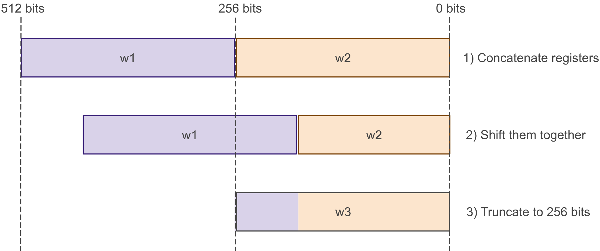

# Developer's Guide
This chapter contains guides about:

- How to [run applications on OTBN](#running-applications-on-otbn) from a host CPU.
- How to [write OTBN applications](#writing-otbn-applications) and make best use of the OTBN ISA.
- How to [develop OTBN](#developing-otbn) by using the simulator as well as the hardware simulator.
- Some details about OTBN's [Device Interface Functions](#device-interface-functions-difs).
  This is part of the documentation is work in progress.

## Running applications on OTBN

The high-level structure of how to run an OTBN program was described in [Introduction to OTBN](./otbn_intro.md#how-otbn-executes-programs).
The following list gives more detail of the steps that the host processor must follow.

1. Optional: Initialise [`LOAD_CHECKSUM`](registers.md#load_checksum).
1. Write the OTBN application binary to [`IMEM`](registers.md#imem), starting at address 0.
1. Optional: Write constants and input arguments, as mandated by the calling convention of the loaded application, to the DMEM accessible through the [`DMEM`](registers.md#dmem) window.
1. Optional: Read back [`LOAD_CHECKSUM`](registers.md#load_checksum) and perform an integrity check.
1. Start the operation on OTBN by [issuing the `EXECUTE` command](./theory_of_operation.md#operations-and-commands).
   Now neither data nor instruction memory may be accessed from the host CPU.
   After it has been started the OTBN application runs to completion without further interaction with the host.
1. Wait for the operation to complete (see below).
   As soon as the OTBN operation has completed the data and instruction memories can be accessed again from the host CPU.
1. Check if the operation was successful by reading the [`ERR_BITS`](registers.md#err_bits) register.
1. Optional: Retrieve results by reading [`DMEM`](registers.md#dmem), as mandated by the calling convention of the loaded application.

OTBN applications are run to completion.
The host CPU can determine if an application has completed by either polling [`STATUS`](registers.md#status) or listening for an interrupt.

* To poll for a completed operation, software should repeatedly read the [`STATUS`](registers.md#status) register.
  The operation is complete if [`STATUS`](registers.md#status) is `IDLE` or `LOCKED`, otherwise the operation is in progress.
  When [`STATUS`](registers.md#status) has become `LOCKED` a fatal error has occurred and OTBN must be reset to perform further operations.
* Alternatively, software can listen for the `done` interrupt to determine if the operation has completed.
  The standard sequence of working with interrupts has to be followed, i.e. the interrupt has to be enabled, an interrupt service routine has to be registered, etc.
  The [DIF](#device-interface-functions-difs) contains helpers to do so conveniently.

Note: This operation sequence only covers functional aspects.
Depending on the application additional steps might be necessary, such as deleting secrets from the memories.

## Writing OTBN applications

OTBN applications are (small) pieces of software written in OTBN assembly.
The full instruction set is described in the [ISA manual](./isa.md), and example software is available in the `sw/otbn` directory of the OpenTitan source tree.
The following subsections give insights into the build tools as well as providing some examples how to make best use of the ISA.
See the [developing](#developing-otbn) section for how to run programs on the simulator or with the RTL simulation.

> For specific formatting and secure coding guidelines, see the [OTBN style guide](../../../../doc/contributing/style_guides/otbn_style_guide.md).

### ISA specification
The instruction set is defined in machine readable form in `data/insns.yml`.
This is parsed by Python code in `util/insn_yaml.py`, which runs various basic checks on the data.
The binutils-based toolchain described below uses this information.
Other users include:
  - `util/yaml_to_doc.py`: Generates a Markdown snippet which is included in the [ISA manual](./isa.md).
  - `dv/rig/otbn-rig`: A random instruction generator for OTBN.
    See its [README](../dv/rig/README.md) for further information.

### Toolchain

OTBN comes with a toolchain consisting of an assembler, a linker, and helper tools such as objdump.

The following tools are available in `hw/ip/otbn/util`:
* `otbn_as.py`: The OTBN assembler.
* `otbn_ld.py`: The OTBN linker.
* `otbn_objdump.py`: objdump for OTBN.

These tools are wrappers around a RISC-V binutils toolchain so one must be available.
The toolchain can be installed with the [`util/get-toolchain.py`](../../../../util/get-toolchain.py) script.
Simply call the script from `$REPO_TOP` and make sure to select the correct architecture.

Other tools from the RV32 toolchain can be used directly, such as objcopy.

#### Assembler
The OTBN assembler is `otbn_as.py` and has the same command line interface as `riscv32-unknown-elf-as`.
The only difference in default flags is that `otbn_as.py` passes `-mno-relax`, telling the assembler not to request linker relaxation.
This is needed because one of these relaxations generates GP-relative loads, which assume `x3` is treated as a global pointer (not true for OTBN code).

To assemble some code in `foo.s` to an ELF object called `foo.o`, run:
```shell
hw/ip/otbn/util/otbn_as.py -o foo.o foo.s
```

#### Linker
The OTBN linker is `otbn_ld.py` which is a thin wrapper around `riscv32-unknown-elf-ld`.
This wrapper supplies a default linker script that matches the OTBN memory layout.
This linker script creates `.start`, `.text` and `.data` output sections.
The `.start` and `.text` sections go to IMEM, with `.start` coming first.
The `.data` section goes to DMEM.
Since OTBN has a strict Harvard architecture with IMEM and DMEM both starting at address zero, the `.start` and the `.data` sections will both start at VMA zero.
The instruction and data segments have distinct LMAs (for addresses, see the IMEM and DMEM windows at `hw/ip/otbn/data/otbn.hjson`).

Since the entry point for OTBN is always address zero, the entry vector should be the one and only thing in the `.start` section.
To achieve that, put your entry point (and nothing else) in the `.text.start` input section like this:
```armasm
.section .text.start
  jal x0, main

.text
  ...
```
This ensures that even if there are multiple objects being linked together, the intended entry point will appear in the right place.

To link ELF object files to an OTBN ELF binary, run
```shell
hw/ip/otbn/util/otbn_ld.py -o foo foo0.o foo1.o foo2.o
```

#### Objdump

The OTBN objdump is `otbn_objdump.py` which wraps `riscv32-unknown-elf-objdump`.
This wrapper enables the disassembly of the custom OTBN instructions when run with the `-d` flag.

To disassemble the ELF binary linked in the previous section, run
```shell
hw/ip/otbn/util/otbn_objdump.py -d foo
```

### Passing of data between the host CPU and OTBN

Passing data between the host CPU and OTBN is done through the first part of the data memory (DMEM, see [otbn.hjson](../data/otbn.hjson) for the size of the visible DMEM range).
No standard or required calling convention exists, every application is free to pass data in and out of OTBN in whatever format it finds convenient.
All data passing must be done when OTBN [is idle](./theory_of_operation.md#operational-states); otherwise both the instruction and the data memory are inaccessible from the host CPU.

### Returning from an application

The software running on OTBN signals completion by executing the {{#otbn-insn-ref ECALL}} instruction.

Once OTBN has executed the {{#otbn-insn-ref ECALL}} instruction, the following things happen:

- No more instructions are fetched or executed.
- A [secure wipe of internal state](./theory_of_operation.md#internal-state-secure-wipe) is performed.
- The [`ERR_BITS`](registers.md#err_bits) register is set to 0, indicating a successful operation.
- The current operation is marked as complete by setting [`INTR_STATE.done`](registers.md#intr_state) and clearing [`STATUS`](registers.md#status).

The first part of DMEM can be used to pass data back to the host processor, e.g. a "return value" or an "exit code".
Refer to the section [Passing of data between the host CPU and OTBN](#passing-of-data-between-the-host-cpu-and-otbn) for more information.

### Using hardware loops

OTBN provides two hardware loop instructions: {{#otbn-insn-ref LOOP}} and {{#otbn-insn-ref LOOPI}}.

#### Loop nesting

OTBN permits loop nesting and branches and jumps inside loops.
However, it doesn't have support for early termination of loops: there's no way to pop an entry from the loop stack without executing the last instruction of the loop the correct number of times.
It can also only pop one level of the loop stack per instruction.

To avoid polluting the loop stack and avoid surprising behavior, the programmer must ensure that:
* Even if there are branches and jumps within a loop body, the final instruction of the loop body gets executed exactly once per iteration.
* Nested loops have distinct end addresses.
* The end instruction of an outer loop is not executed before an inner loop finishes.

OTBN does not detect these conditions being violated, so no error will be signaled should they occur.

(Note indentation in the code examples is for clarity and has no functional impact.)

The following loops are *well nested*:

```armasm
LOOP x2, 3
  LOOP x3, 1
    ADDI x4, x4, 1
  # The NOP ensures that the outer and inner loops end on different instructions
  NOP

# Both inner and outer loops call some_fn, which returns to
# the body of the loop
LOOP x2, 5
  JAL x1, some_fn
  LOOP x3, 2
    JAL x1, some_fn
    ADDI x4, x4, 1
  NOP

# Control flow leaves the immediate body of the outer loop but eventually
# returns to it
LOOP x2, 4
  BEQ x4, x5, some_label
branch_back:
  LOOP x3, 1
    ADDI x6, x6, 1
  NOP

some_label:
  ...
  JAL x0, branch_back
```

The following loops are *not well nested*:

```armasm
# Both loops end on the same instruction
LOOP x2, 2
  LOOP x3, 1
    ADDI x4, x4, 1

# Inner loop jumps into outer loop body (executing the outer loop end
# instruction before the inner loop has finished)
LOOP x2, 5
  LOOP x3, 3
    ADDI x4, x4 ,1
    BEQ  x4, x5, outer_body
    ADD  x6, x7, x8
outer_body:
  SUBI  x9, x9, 1
```

### Multiplying big numbers

OTBN's {{#otbn-insn-ref BN.MULQACC}}, {{#otbn-insn-ref BN.MULQACC.SO}}, and {{#otbn-insn-ref BN.MULQACC.WO}} instructions provide a convenient way to implement big number multiplications.
All of them do roughly the same thing:
- they perform a 64x64-bit multiplication (the `q` in `mulqacc` is for "quarter-word")
- they accumulate the 128-bit product into a special 256-bit special accumulator register called `ACC`

The `.wo` variant copies the entire accumulator value to a destination WDR.
The `.so` variant writes the low 128 bits of the accumulator into a WDR and then shifts the accumulator 128 bits.
All variants accept an offset argument, so the product can be added to the accumulator with a shift of 0, 64, 128, or 192 bits.
Instructions with a `.z` suffix accumulate from zero, rather than the previous value of the accumulator.

The following instruction sequence multiplies the lower half of `w0` by the upper half of `w0` placing the result in `w1`.
```armasm
BN.MULQACC.Z      w0.0, w0.2, 0
BN.MULQACC        w0.0, w0.3, 64
BN.MULQACC        w0.1, w0.2, 64
BN.MULQACC.WO w1, w0.1, w0.3, 128
```

And this is a 256x256-bit multiplication of wide registers `w2` and `w4`:
```armasm
bn.mulqacc.z          w2.0, w4.0, 0     /* a0b0 */
bn.mulqacc            w2.0, w4.1, 64    /* a0b1 */
bn.mulqacc.so  w10.L, w2.1, w4.0, 64    /* a1b0 */
bn.mulqacc            w2.0, w4.2, 0     /* a0b2 */
bn.mulqacc            w2.1, w4.1, 0     /* a1b1 */
bn.mulqacc            w2.2, w4.0, 0     /* a2b0 */
bn.mulqacc            w2.0, w4.3, 64    /* a0b3 */
bn.mulqacc            w2.1, w4.2, 64    /* a1b2 */
bn.mulqacc            w2.2, w4.1, 64    /* a2b1 */
bn.mulqacc.so  w10.U, w2.3, w4.0, 64    /* a3b0 */
bn.mulqacc            w2.1, w4.3, 0     /* a1b3 */
bn.mulqacc            w2.2, w4.2, 0     /* a2b2 */
bn.mulqacc            w2.3, w4.1, 0     /* a3b1 */
bn.mulqacc            w2.2, w4.3, 64    /* a2b3 */
bn.mulqacc            w2.3, w4.2, 64    /* a3b2 */
bn.mulqacc.wo    w11, w2.3, w4.3, 128   /* a3b3 */
```
In algebraic terms with 64-bit limbs, we are computing:
\\[
\begin{aligned}
a \* b &= a_0b_0 \\\\ &+ 2^{64}a_0b_1 + 2^{64}a_1b_0 \\\\ &+ 2^{128}a_0b_2 + 2^{128}a_1b_1 + 2^{128}a_2b_0 \\\\ &+ 2^{192}a_0b_3 + 2^{192}a_1b_2 + 2^{192}a_2b_1 + 2^{192}a_3b_0 \\\\ &+ 2^{256}a_1b_3 + 2^{256}a_2b_2 + 2^{256}a_3b_1 \\\\ &+ 2^{320}a_2b_3 + 2^{320}a_2b_3 \\\\ &+ 2^{384}a_3b_3
\end{aligned}
\\]

We use the shift arguments to place partial products like \\(a_0b_1\\) at the right offset, and then use half-word writebacks so that we can safely continue adding to the accumulator without overflowing.

Code snippets giving examples of 256x256 and 384x384 multiplies can be found in `sw/otbn/code-snippets/mul256.s` and `sw/otbn/code-snippets/mul384.s`.

There are significant performance benefits in elliptic-curve cryptography and RSA from speeding up bignum multiplication, since it is by far the most time-consuming operation in those domains.
For example, 66% of instructions executed on OTBN during an ECDSA-P256 signature generation are some form of `bn.mulqacc`.
The proportion is similarly high across other ECC and RSA computations.
See the [performance](otbn_intro.md#performance) section for exact benchmarks.

### Modulo computations

OTBN has a special `MOD` WSR that holds a modulus (up to 256 bits).
The instructions {{#otbn-insn-ref BN.ADDM}} and {{#otbn-insn-ref BN.SUBM}} as well as their vectorized counterparts {{#otbn-insn-ref BN.ADDVM}} and {{#otbn-insn-ref BN.SUBVM}} perform addition and subtraction over that modulus.
This is especially useful for elliptic-curve cryptography such as ECDSA-P256 and Ed25519, where `bn.addm` replaces a common "add and then conditionally subtract the modulus in constant-time if the sum is greater" pattern.
The vectorized instructions are useful for PQC algorithms.

### Montgomery multiplication

A key building block for polynomial arithmetic in PQC algorithms such as ML-DSA and ML-KEM, is to compute a modular multiplication.
Such multiplications are usually computationally expensive as it requires division to reduce.
The Montgomery multiplication avoids expensive division by the modulus by working in a scaled representation.
An operand `a` in Montgomery form is `a * 2^d mod q`, where `d` is the element bit-width (32 in OTBNs case).
The instruction then computes:
```
r = a * b * 2^(-d) mod q
```
This can be implemented in hardware using multiplications, additions and shift operations only (see description of {{#otbn-insn-ref BN.MULVM}} for more details).

The {{#otbn-insn-ref BN.MULVM}} instruction performs such a Montgomery multiplication over a vector of 32-bit elements. It requires that the `MOD` WSR must be initialised with:
- `MOD[31:0]`: the modulus `q`
- `MOD[63:32]`: the Montgomery constant `mu = (-q)^(-1) mod 2^d`

To optimize area, the final conditional subtraction step of the Montgomery algorithm is not implemented in hardware.
The result is therefore in `[0, 2q[` rather than `[0, q[`.
To reduce back to `[0, q[`, a conditional subtraction with `q` can be performed with {{#otbn-insn-ref BN.ADDVM}} using a zero source operand like this:
```armasm
bn.xor       w31, w31, w31 /* zero w31 */
bn.mulvm.8S  w2,  w0,  w1
bn.addvm.8S  w2,  w2,  w31
```

When chaining multiplications the conditional subtraction can be postponed to the last step,
provided the inputs stay within `[0, 2q[` and `q < 2^d / 4` holds.

For a more concrete example how to use {{#otbn-insn-ref BN.MULVM}} see `sw/otbn/crypto/mldsa87/mldsa87_ntt.s`.

### Concatenate-and-shift

OTBN's {{#otbn-insn-ref BN.RSHI}} instruction concatenates two wide registers and then shifts them together.
For example, `bn.rshi w3, w1, w2 >> 63` would do something like in the below diagram:



This is very useful for bignum arithmetic, when the two registers might represent two adjacent parts of a huge number, or for selecting only certain parts of a bignum.
Note that `bn.rshi` can work as a more typical right-shift by setting the high register to 0, and as a left-shift by setting the low register to 0.

### Shifted operands

Many bignum instructions on OTBN include a shift argument.
For example, to compute `w1 + (w2 << 32)`, you can simply write:
```armasm
bn.add   w3, w1, w2 << 32
```
Similarly, you can shift-left:
```armasm
bn.add   w3, w1, w2 >> 32
```
This works on all binary arithmetic operators and also all bitwise operations.
Specifically, that means the following instructions:
- {{#otbn-insn-ref BN.ADD}} : add
- {{#otbn-insn-ref BN.ADDC}} : add with carry
- {{#otbn-insn-ref BN.SUB}} : subtract
- {{#otbn-insn-ref BN.SUBB}} : subtract with borrow
- {{#otbn-insn-ref BN.CMP}} : compare
- {{#otbn-insn-ref BN.CMPB}} : compare with borrow
- {{#otbn-insn-ref BN.AND}} : bitwise and
- {{#otbn-insn-ref BN.NOT}} : bitwise not
- {{#otbn-insn-ref BN.OR}}: bitwise or
- {{#otbn-insn-ref BN.XOR}} : bitwise xor

This shift argument makes manipulating sub-parts of words on OTBN concise and ergonomic.
For example, here is how you can flip the endianness of each 32-bit word in a 256-bit word in 7 instructions (taken directly from our OTBN SHA-256 implementation):
```armasm
/**
 * Flip the bytes in each 32-bit word of a 256-bit value.
 *
 * This routine runs in constant time.
 *
 * Flags: Flags have no meaning beyond the scope of this subroutine.
 *
 * @param[in,out]   w23: Wide register to flip (modified in-place).
 * @param[in]       w29: Byte-swap mask (0x000000ff, repeated 8x).
 *
 * clobbered registers: w23 to w27
 * clobbered flag groups: FG0
 */
bswap32_w23:
  /* Isolate each byte of each 32-bit word.
       w24 <= byte 0 of each word = a
       w25 <= byte 1 of each word = b
       w26 <= byte 2 of each word = c
       w27 <= byte 3 of each word = d */
  bn.and   w24, w29, w23
  bn.and   w25, w29, w23 >> 8
  bn.and   w26, w29, w23 >> 16
  bn.and   w27, w29, w23 >> 24

  /* Shift/or the bytes back in reversed order.
       w23 <= a || b || c || d */
  bn.or    w23, w25, w24 << 8
  bn.or    w23, w26, w23 << 8
  bn.or    w23, w27, w23 << 8
  ret
```

### Packing and unpacking 24-bit element vectors
The vectorized subset of Bignum instructions enable SIMD computation on 32-bit elements.
However, some PQC algorithms operate on smaller values.
To optimize the memory footprint of such programs, vectors can be compressed and then be stored in memory in a compressed 24-bit format.
The `bn.pack` and `bn.unpk` instructions convert 32-bit vectors into a dense 24-bit representation and vice-versa as described in the [ISA manual](./isa.md).
These packed vectors can then be stored in the memory as shown below.


To pack vectors one can use the following snippet:
```armasm
/*
 * Assume we have 4 vectors with 8 32-bit elements currently in WDRs w0-w3
 * which we want to store in the packed format.
 * The color in the image corresponds to the WDRs as follows:
 * w0: Red vector
 * w1: Yellow vector
 * w2: Green vector
 * w3: Blue vector
 */

/* Pack the vectors into temporary WDRs */
bn.pack w10, w1, w0, 64
bn.pack w11, w2, w1, 128
bn.pack w12, w3, w2, 192

/* Store packed vectors to memory */
...
```
The inner workings of the `bn.pack` instruction are visualized in the following figure for the case of `bn.pack w11, w2, w1, <shift>`.
The two vectors are first converted in a dense format (192 bits each), then concatenated with additional zero bits.
Finally, the 512 bits are shifted to produce the marked 256 bits which are stored to the destination WDR.
This allows one to construct all the required packings.


The unpacking works by concatenating two 256-bit strings loaded from memory and shifting the desired bits to the lower 192 bits.
These 192 bits are then expanded to 8x 32 bits by inserting zero bytes every 3 bytes.
```armasm
/*
 * Load packed vectors from memory into WDRs w10-w12 such that:
 * w10 corresponds the 1st line in the first image
 * w11 corresponds the 2nd line in the first image
 * w12 corresponds the 3rd line in the first image
 */
...

/* Unpack vectors */
bn.unpk w0, w11, w10, 0   /* unpack the red vector to w0 */
bn.unpk w1, w11, w10, 192 /* unpack the yellow vector to w1 */
bn.unpk w2, w12, w11, 128 /* unpack the green vector to w2 */
bn.unpk w3, wXX, w12, 64  /* unpack the blue vector to w3, wXX represents that any WDR can be used */
```

### Transposing vector elements
To efficiently shuffle vectors, one can use the `bn.trn1` and `bn.trn2` instructions.
These instructions reorder the vector elements as illustrated in the image below for `bn.trn1.4d` and `bn.trn2.4d`.
- The `bn.trn1 wrd, wrs1, wrs2` instruction places even-indexed vector elements from `wrs1` into even-indexed elements of `wrd` and even-indexed vector elements from `wrs2` are placed into odd-indexed elements of `wrd`.
- The `bn.trn2 wrd, wrs1, wrs2` instruction places odd-indexed vector elements from `wrs1` into even-indexed elements of `wrd` and odd-indexed vector elements from `wrs2` are placed into odd-indexed elements of `wrd`.


### An example program

This is an entire, standalone OTBN program that computes `(a + b << 16) mod m`, where `a`, `b` and `m` are all up to 256 bits (and `a, b < m`):
```armasm
.section .text.start
main:
  /* Load the operands.
       w10 <= dmem[input_a]
       w11 <= dmem[input_b] */
  la        x2, input_a
  li        x3, 10
  bn.lid    x3++, 0(x2)
  la        x2, input_b
  bn.lid    x3++, 0(x2)

  /* Load the modulus and write it to the MOD register.
       MOD <= dmem[input_m] */
  la        x2, input_m
  bn.lid    x3, 0(x2)
  bn.wsrw   0x0, w12 /* special register 0 = MOD */

  /* Compute (b << 16) mod m by repeatedly doubling b.

     Loop invariants at start of loop (i=0..15):
       w11 = (b << i) mod m */
  loopi     16, 1
    bn.addm   w11, w11, w22

  /* Add to the first operand.
       w10 <= (w10 + w11) mod m = (a + b << 16) mod m */
  bn.addm   w10, w10, w11

  /* Store the result. */
  la        x2, result
  li        x3, 10
  bn.sid    x3, 0(x2)

  /* End the program. */
  ecall

.bss

/* Input buffer for the first operand, a (256 bits). */
input_a:
.zero 32

/* Input buffer for the second operand, b (256 bits). */
input_b:
.zero 32

/* Input buffer for the modulus (256 bits). */
input_m:
.zero 32

/* Output buffer. */
result:
.zero 32
```

Some notes to help explain the code above:
- Execution always starts from the label `.text.start`
- `la` is "load address" from the RISC-V instruction set
- `li` is "load immediate", a pseudo-instruction that loads a small constant
- `bn.lid` is a wide-register load instruction
  - The first argument is a small register *whose value points to a wide register*: for example, if the small register's value is 5 we will load to wide register `w5`
  - Adding a `++` on the pointer register increments it by 1, so you can easily load to consecutive wide registers (e.g. w3, w4, w5, ...)
  - It is also possible to add a `++` on the register that holds the address; in this case the value will be incremented by 32 so it points to the end of the load and you can easily load contiguous stretches of DMEM
- `bn.sid` is a wide-register store instruction with syntax similar to `bn.lid`
- The first argument to `loopi` is the number of iterations, and the second is the number of instructions in the loop body
- `.bss` marks data memory that is not initialized; the program would still work if we used `.data`, but the binary would be bigger because Ibex would store a bunch of placeholder zeroes

To see all current OTBN programs from the OpenTitan codebase, see the [sw/otbn](https://github.com/lowRISC/opentitan/tree/master/sw/otbn) directory.
The `crypto/` subdirectory contains code we use in production, while the `code-snippets` subdirectory contains small example programs.

## Developing OTBN
OTBN applications as well as RTL changes can be tested by using a python simulator or a RTL co-simulation.

### Run the ISS (Instruction Set Simulator)
The quickest way to run an OTBN-only program is to use the standalone Python simulator.
First, generate a `.elf.` file, then run:
```console
$ hw/ip/otbn/dv/otbnsim/standalone.py path/to/prog.elf
```
The final DMEM can be dumped with the `--dmem-dump` argument.
To see an instruction trace, pass the `--verbose` flag.

There is also `dv/otbnsim/stepped.py` which is controlled via CLI commands and is used by the UVM tests.
It requires to send detailed commands to step the model and handle state updates etc. and is probably not very convenient for user-based command-line use.

#### Test the ISS

The ISS has a simple test suite, which runs various instructions and
makes sure they behave as expected.
See the [simulator page](../dv/otbnsim/README.md) for more details.

### Run the standalone RTL simulation
A standalone environment to run OTBN alone in Verilator is included.
Build it with `fusesoc` as follows:

```sh
fusesoc --cores-root=. run --target=sim --setup --build \
  --mapping=lowrisc:prim_generic:all:0.1 lowrisc:ip:otbn_top_sim \
  --make_options="-j$(nproc)"
```

It includes functionality to set the initial Dmem and Imem contents from a .elf file.
The start address is hard coded to 0.
Modify the `ImemStartAddr` parameter in `./dv/verilator/otbn_top_sim.sv` to change this.
A .elf can be loaded and run as follows:

```sh
./build/lowrisc_ip_otbn_top_sim_0.1/sim-verilator/Votbn_top_sim \
  --load-elf=prog_bin/prog.elf
```

The simulation automatically halts on an `ecall` instruction and prints the final register values.
The ISS is run in parallel and the final register and memory state will be cross-checked.

Tracing functionality is available in the `Votbn_top_sim` binary.
To obtain a full .fst wave trace pass the `-t` flag.
To get an instruction level trace pass the `--otbn-trace-file=trace.log` argument.
The instruction trace format is documented in [`hw/ip/otbn/dv/tracer`](../dv/tracer/).

To run several auto-generated binaries against the Verilated RTL, use the script at `dv/verilator/run-some.py`.
For example,
```sh
hw/ip/otbn/dv/verilator/run-some.py --size=1500 --count=50 X
```

will generate and run 50 binaries, each of which will execute up to 1500 instructions when run.
The generated binaries, a Verilated model and the output from running them can all be found in the directory called `X`.

### Run the smoke test

A smoke test which exercises some functionality of OTBN can be found, together with its expected outputs (in the form of final register values), in
`./hw/ip/otbn/dv/smoke`.
The test can be run using a script.
```sh
hw/ip/otbn/dv/smoke/run_smoke.sh
```

This will build the standalone simulation, build the smoke test binary, run it and check the results are as expected.

The vectorized bignum instructions can be smoke-tested by adding the 'vectorized' argument:
```sh
hw/ip/otbn/dv/smoke/run_smoke.sh vectorized
```

## Device Interface Functions (DIFs)

A higher-level driver for the OTBN block is available at `sw/device/lib/runtime/otbn.h`.

Another driver for OTBN is part of the silicon creator code at `sw/device/silicon_creator/lib/drivers/otbn.h`.
