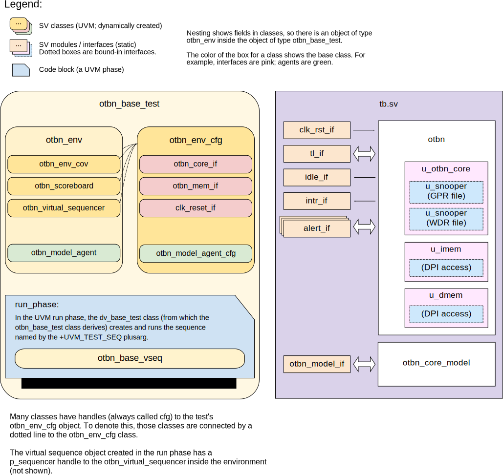

## Goals
* **DV**
  * Verify the OTBN processor by running dynamic simulations with a SV/UVM based testbench
  * These simulations are grouped in tests listed in the [DV plan](#dv-plan) below.
  * Close code and functional coverage on the IP and all of its sub-modules
* **FPV**
  * Verify TileLink device protocol compliance with an SVA based testbench

## Current status
* [Design & verification stage]()
  * [HW development stages]()
* [Simulation results](https://reports.opentitan.org/hw/ip/otbn/dv/latest/results.html)

## Design features

OTBN, the OpenTitan Big Number accelerator, is a cryptographic accelerator.
For detailed information on OTBN design features, see the [OTBN HWIP technical specification]().

## Testbench architecture

The OTBN testbench is based on the [CIP testbench architecture]().
It builds on the [dv_utils]() and [csr_utils]() packages.

### Block diagram

OTBN testing makes use of a DPI-based model called `otbn_core_model`.
This is shown in the block diagram.
The dotted interfaces in the `otbn` block are bound in by the model to access internal signals (register file and memory contents).



### Top level testbench

The top-level testbench is located at `hw/ip/otbn/dv/uvm/tb.sv`.
This instantiates the OTBN DUT module `hw/ip/otbn/rtl/otbn.sv`.

OTBN has the following interfaces:
- A [Clock and reset interface]()
- A [TileLink interface]().
  OTBN is a TL device, which expects to communicate with a TL host.
  In the OpenTitan SoC, this will be the Ibex core.
- An idle signal, `idle_o`
- Two interrupts
- An [alert interface]()

The idle and interrupt signals are modelled with the basic
[`pins_if`]() interface.

As well as instantiating OTBN, the testbench also instantiates an `otbn_core_model`.
This module wraps an ISS (instruction set simulator) subprocess and performs checks to make sure that OTBN behaves the same as the ISS.
The model communicates with the testbench through an `otbn_model_if` interface, which is monitored by the `otbn_model_agent`, described below.

### OTBN model agent

The model agent is instantiated by the testbench to monitor the OTBN model.
It is a passive agent (essentially just a monitor): the inputs to the model are set in `tb.sv`.
The monitor for the agent generates transactions when it sees a start signal or a done signal.

The start signal is important because we "cheat" and pull it out of the DUT.
To make sure that the processor is starting when we expect, we check start transactions against TL writes in the scoreboard.

### Reference models

The main reference model for OTBN is the instruction set simulator (ISS), which is run as a subprocess by DPI code inside `otbn_core_model`.
This Python-based simulator can be found at `hw/ip/otbn/dv/otbnsim`.

## Stimulus strategy

When testing OTBN, we are careful to distinguish between

- behaviour that can be triggered by particular instruction streams
- behaviour that is triggered by particular external stimuli (register writes; surprise resets etc.)

Testing lots of different instruction streams doesn't really use the UVM machinery, so we have a "pre-DV" phase of testing that generates constrained-random instruction streams (as ELF binaries) and runs a simple block-level simulation on each to check that the RTL matches the model.
The idea is that this is much quicker for designers to use to smoke-test proposed changes, and can be run with Verilator, so it doesn't require an EDA tool licence.
This pre-DV phase cannot drive sign-off, but it does use much of the same tooling.

Once we are running full DV tests, we re-use this work, by using the same collection of randomised instruction streams and randomly picking from them for most of the sequences.
At the moment, the full DV tests create binaries on the fly by running `hw/ip/otbn/dv/uvm/gen-binaries.py`.
This results in one or more ELF files in a directory, which the simulation then picks from at random.

The pre-DV testing doesn't address external stimuli like resets or TileLink-based register accesses.
These are driven by specialised test sequences, described below.

### Test sequences

The test sequences can be found in `hw/ip/otbn/dv/uvm/env/seq_lib`.
The basic test sequence (`otbn_base_vseq`) loads the instruction stream from a randomly chosen binary (see above), configures OTBN and then lets it run to completion.

More specialized sequences include things like multiple runs, register accesses during operation (which should fail) and memory corruption.
We also check things like the correct operation of the interrupt registers.

## Functional coverage

We distinguish between *architectural* and *micro-architectural* functional coverage.
The idea is that the points that go into architectural coverage are those that a DV engineer could derive by reading the block specification.
The points that go into micro-architectural coverage are those that require knowledge of the block's micro-architecture.
Some of these will come from DV engineers; others from the block's designers.
These two views are complementary and will probably duplicate coverage points.
For example, an architectural coverage point might be "the processor executed `ADDI` and the result overflowed".
This might overlap with something like "the `overflow` signal in the ALU was true when adding".

### Block-based coverage

#### Call stack

The [call stack]() is exposed as a special register behind `x1`.
It has a bounded depth of 8 elements.
We expect to see the following events:

- Push to the call stack
- Pop from the call stack
- Push and pop from the call stack on a single instruction
- An instruction with multiple reads from `x1`

All four of these events should be crossed with the three states of the call stack: empty, partially full, and full.

#### Loop stack

The [loop stack]() is accessed by executing `LOOP` and `LOOPI` instructions.
Important events for it are tracked at those instructions, rather than separately.

#### Flags

Each flag in each flag group should be set to one from zero by some instruction.
Similarly, each flag in each flag group should be cleared to zero from one by some instruction.

### Instruction-based coverage

As a processor, much of OTBN's coverage points are described in terms of instructions being executed.
Because OTBN doesn't have a complicated multi-stage pipeline or any real exception handling, we don't track much temporal information (such as sequences of instructions).

As well as instruction-specific coverage points detailed below, we include a requirement that each instruction is executed at least once.

For any instruction with one or more immediate fields, we require "toggle coverage" for those fields.
That is, we expect to see execution with each bit of each immediate field being zero and one.
We also expect to see each field with values `'0` and `'1` (all zeros and all ones).
If the field is treated as a signed number, we also expect to see it with the extremal values for its range (just the MSB set, for the most negative value; all but the MSB set, for the most positive value).

For any instruction that reads from or writes to a GPR, we expect to see that operand equal to `x0`, `x1` and an arbitrary register in the range `x2 .. x31`.
We don't have any particular coverage requirements for WDRs (since all of them work essentially the same).

For any source GPR, we require "toggle coverage" for its value.
For example, `ADD` reads from its `<grs1>` operand.
We want to see each of the 32 bits of that operand set and unset (giving 64 coverage points).

If an instruction can generate flag changes, we expect to see each flag that the instruction can change being both set and cleared by the instruction.
This needn't be crossed with the two flag groups (that's tracked separately in the "Flags" block above).
For example, `BN.ADD` can write to each of the flags `C`, `M`, `L` and `Z`.
This paragraph implies eight coverage points (four flags times two values) for that instruction.

#### ADD

- Cross the three possible signs (negative, zero, positive) for each input operand (giving 9 points).

#### ADDI

As for `ADD`.

#### LUI

Nothing beyond immediate toggle coverage.

#### SUB

- Cross the three possible signs (negative, zero, positive) for each input operand (giving 9 points).

#### SLL

- A shift of a nonzero value by zero.
- A shift of a value by `0x1f` which leaves the top bit set.

#### SLLI

As for `SLL`.

#### SRL

- A shift of a nonzero value by zero.
- A shift of a value by `0x1f` which leaves the bottom bit set.
  (Note that this point also checks that we're performing a logical, rather than arithmetic, right shift)

#### SRLI

As for `SRL`.

#### SRA

- A shift of a nonzero value by zero.
- A shift of a value by `0x1f` which leaves the bottom bit set.
  (Note that this point also checks that we're performing an arithmetic, rather than logical, right shift)

#### SRAI

As for `SRA`.

#### AND

- Toggle coverage of the output result, not to `x0` (to ensure we're not just AND'ing things with zero)

#### ANDI

As for `AND`.

#### OR

- Toggle coverage of the output result, not to `x0` (to ensure we're not just OR'ing things with `'1`)

#### ORI

As for `OR`.

#### XOR

- Toggle coverage of the output result, not to `x0` (to ensure we're not just XOR'ing things with zero)

#### XORI

As for `XOR`.

#### LW

- Load from a valid address, where `<grs1>` is above the top of memory and a negative `<offset>` brings the load address in range.
- Load from a valid address, where `<grs1>` is negative and a positive `<offset>` brings the load address in range.
- Load from address zero
- Load from the top word of memory
- Load from an invalid address (aligned but above the top of memory)
- Load from a misaligned address

#### SW

- Store to a valid address, where `<grs1>` is above the top of memory and a negative `<offset>` brings the load address in range.
- Store to a valid address, where `<grs1>` is negative and a positive `<offset>` brings the load address in range.
- Store to address zero
- Store to the top word of memory
- Store to an invalid address (aligned but above the top of memory)
- Store to a misaligned address

#### BEQ

All points should be crossed with branch taken / branch not taken.

- Branch forwards
- Branch backwards
- Branch to a misaligned address (offset not a multiple of 4)
- Branch forwards to an invalid address, above the top of memory
- Branch backwards to an invalid address (wrapping past zero)
- Branch to current address.
- Branch instruction at end of a loop.

The "branch to current address" item is problematic if we want to take the branch.
Probably we need some tests with short timeouts to handle this properly.

#### BNE

As for `BEQ`.

#### JAL

- Jump forwards
- Jump backwards
- Jump to a misaligned address (offset not a multiple of 4)
- Jump forwards to an invalid address, above the top of memory
- Jump backwards to an invalid address (wrapping past zero)
- Jump to current address.
- Jump when the current PC is the top word in IMEM.
- Jump instruction at end of a loop.

Note that the "jump to current address" item won't be a problem to test since it will quickly overflow the call stack.

#### JALR

- Jump with a positive offset
- Jump with a negative offset
- Jump with a misaligned base address which `<offset>` aligns (each of the 3 possible misalignments).
- Jump with a large base address which wraps to a valid address by adding a positive `<offset>`.
- Jump with a base address just above top of IMEM but wih a negative `<offset>` to give a valid target.
- Jump with a negative offset, wrapping to give an invalid target.
- Jump with a positive offset, giving an invalid target above top of IMEM.
- Jump to current address.
- Jump when the current PC is the top word in IMEM.
- Jump instruction at end of a loop.

Note that the "jump to current address" item won't be a problem to test since it will quickly over- or underflow the call stack, provided `<grd>` and `<grs1>` aren't both `x1`.

#### CSRRS

- Write with a non-zero `bits_to_set` to each valid CSR.

#### CSRRW

- Write to every valid CSR with a `<grd>` other than `x0`.
- Write to every valid CSR with `<grd>` equal to `x0`.

#### ECALL

No special coverage points for this instruction.

#### LOOP

- Loop with a zero iteration count (causing an error)
- Loop with a count of `'1` (the maximal value)
- Loop when the loop end address would be above the top of memory.
- Loop when the loop stack is full, causing an overflow.
- Loop at the end of a loop.
- Duplicate loop end address, matching top of stack
- Duplicate loop end address, further down stack

#### LOOPI

As for `LOOP`, but without the count of `'1` (not achievable with an immediate).

#### BN.ADD

- Extremal values of shift for both directions where the shifted value is nonzero
- A nonzero right shift with a value in `wrs2` whose top bit is set

#### BN.ADDC

- Extremal values of shift for both directions where the shifted value is nonzero
- A nonzero right shift with a value in `wrs2` whose top bit is set
- Execute with both values of the carry flag for both flag groups (to make sure things are wired through properly)

#### BN.ADDI

As for `BN.ADD`.

#### BN.ADDM

- Execute with the two extreme values of `MOD` (zero and all ones)
- Perform a subtraction (because the sum is at least `MOD`) when `MOD` is nonzero.
- Don't perform a subtraction (because the sum is less than `MOD`) when `MOD` is nonzero.
- Perform a subtraction where the sum is at least twice a nonzero value of `MOD`.
- A calculation where the sum exactly equals a nonzero `MOD`
- A calculation where the intermediate sum is greater than `2^256-1`, crossed with whether the subtraction of `MOD` results in a value that will wrap.

#### BN.MULQACC

- Cross `wrs1_qwsel` with `wrs2_qwsel` to make sure they are applied to the right inputs
- See the accumulator overflow

#### BN.MULQACC.WO

As for `BN.MULQACC`, plus the generic flag group cover points.

#### BN.MULQACC.SO

As for `BN.MULQACC` plus the following:

- Cross the generic flag updates with `wrd_hwsel`, since the flag changes are different in the two modes.

#### BN.SUB

As for `BN.ADD`.

#### BN.SUBB

As for `BN.ADDC`.

#### BN.SUBI

As for `BN.SUB`.

#### BN.SUBM

- Execute with the two extreme values of `MOD` (zero and all ones)
- A non-negative intermediate result with a nonzero `MOD` (so `MOD` is not added).
- A negative intermediate result with a nonzero `MOD` (so `MOD` is added).
- A very negative intermediate result with a nonzero `MOD` (so `MOD` is added, but the top bit is still set)
- An intermediate result that exactly equals a nonzero `-MOD`.

#### BN.AND

- Extremal values of shift for both directions where the shifted value is nonzero
- Toggle coverage of the output result (to ensure we're not just AND'ing things with zero)

#### BN.OR

- Extremal values of shift for both directions where the shifted value is nonzero
- Toggle coverage of the output result (to ensure we're not just OR'ing things with zero)

#### BN.NOT

- Extremal values of shift for both directions where the shifted value is nonzero
- Toggle coverage of the output result (to ensure nothing gets clamped)

#### BN.XOR

- Extremal values of shift for both directions where the shifted value is nonzero
- Toggle coverage of the output result (to ensure we're not just XOR'ing things with zero)

#### BN.RSHI

No special coverage.

#### BN.SEL

- Cross flag group, flag and flag value (2 times 4 times 2 points)

#### BN.CMP

As for `BN.SUB`.

#### BN.CMPB

As for `BN.SUBB`.

#### BN.LID

- Load from a valid address, where `grs1` is above the top of memory and a negative `offset` brings the load address in range.
- Load from a valid address, where `grs1` is negative and a positive `offset` brings the load address in range.
- Load from address zero
- Load from the top word of memory
- Load from an invalid address (aligned but above the top of memory)
- Load from a misaligned address
- See an invalid instruction with both increments specified
- See `grd` greater than 31, giving an illegal instruction error
- Cross the three types of GPR for `grd` with `grd_inc`
- Cross the three types of GPR for `grs1` with `grd_inc`

#### BN.SID

- Store to a valid address, where `grs1` is above the top of memory and a negative `offset` brings the load address in range.
- Store to a valid address, where `grs1` is negative and a positive `offset` brings the load address in range.
- Store to address zero
- Store to the top word of memory
- Store to an invalid address (aligned but above the top of memory)
- Store to a misaligned address
- See an invalid instruction with both increments specified
- See `grd` greater than 31, giving an illegal instruction error
- Cross the three types of GPR for `grs2` with `grs2_inc`
- Cross the three types of GPR for `grs1` with `grd_inc`

#### BN.MOV

No special coverage.

#### BN.MOVR

- See an invalid instruction with both increments specified
- Since MOVR signals an error if either of its source registers has a value greater than 31, cross whether the input register value at `grd` is greater than 31 with whether the register value at `grs` is greater than 31

#### BN.WSRR

- Read from each valid WSR
- Read from an invalid WSR

#### BN.WSRW

- Write to each valid WSR, including read-only WSRs.
- Write to an invalid WSR

## Self-checking strategy
### Scoreboard

Much of the checking for these tests is actually performed in `otbn_core_model`, which ensures that the RTL and ISS have the same behaviour.
However, the scoreboard does have some checks, to ensure that interrupt and idle signals are high at the expected times.

### Assertions

Core TLUL protocol assertions are checked by binding the [TL-UL protocol checker]() into the design.

Outputs are also checked for `'X` values by assertions in the design RTL.
The design RTL contains other assertions defined by the designers, which will be checked in simulation (and won't have been checked by the pre-DV Verilator simulations).

Finally, the `otbn_idle_checker` checks that the `idle_o` output correctly matches the running state that you'd expect, based on writes to the `CMD` register and responses that will appear in the `DONE` interrupt.

## Building and running tests

Tests can be run with [`dvsim.py`]().
The link gives details of the tool's features and command line arguments.
To run a basic smoke test, go to the top of the repository and run:
```console
$ util/dvsim/dvsim.py hw/ip/otbn/dv/uvm/otbn_sim_cfg.hjson -i otbn_smoke
```

## DV plan

