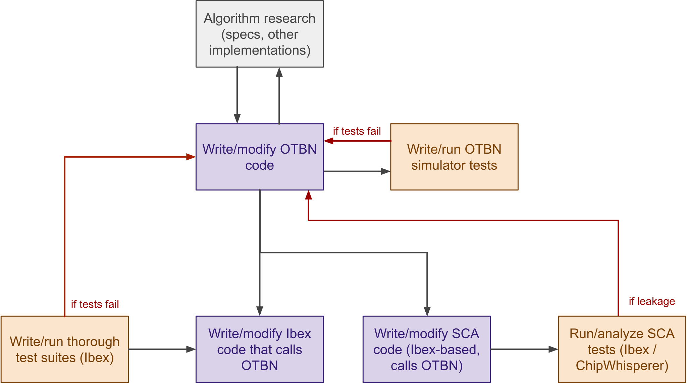

# Introduction to OTBN

OTBN (the **O**pen**T**itan **B**ig **N**umber accelerator) is a specialized coprocessor designed for cryptography.
It runs as part of OpenTitan in addition to the main processor, Ibex.
The OTBN hardware block could also run as part of a different system and interact with a different main processor, but this page will focus on the OpenTitan context.

This page is an introduction and overview of OTBN.
For more detailed information, see the [technical specification](../README.md) and the [ISA guide](isa.md).

## How OTBN executes programs

The following diagram illustrates how OTBN and the main processor interact:


OTBN has its own data and instruction memories, distinct from the memories of the Ibex main processor.
To run an OTBN program, Ibex loads the program into OTBN's instruction memory (and data memory if the program contains stored constants), then writes the input data into the data memory and flips the "execute" bit.
When OTBN is done, it sends an interrupt to Ibex, which reads back the results from data memory.
See [below](#an-example-program) for an example of a standalone OTBN program.

OTBN protects its data from Ibex in various ways:
- Ibex cannot read OTBN's memory while it is busy executing a program.
- Ibex cannot stop OTBN in the middle of execution; it has to wait until OTBN is done.
- The [key manager][keymgr] can sideload keys directly into OTBN without giving Ibex access to them.
- If OTBN encounters an error, it will lock itself, meaning that Ibex can't read back any data from the program when OTBN is finished (only an error code from a special register).

All together, this mode of interaction keeps OTBN separate enough from Ibex to act as a security boundary.

## Security features

Because OTBN exclusively runs cryptographic algorithms, it is built with extra security features to protect secrets during and after execution.
See the [technical specification](../README.md#security-features) for a full description, but at a high level these features include:
- **no branch prediction or speculative execution**: OTBN stalls for one cycle after jump and branch instructions rather than attempt to predict the next PC, as a mitigation against Spectre-style attacks.
- **no cache**: OTBN's load/store instructions always stall for one cycle, preventing cache-timing attacks.
- **scratchpad memory**: part of OTBN's memory is not accessible by Ibex over the bus, even when OTBN is idle.
- **register blanking**: data paths for unused registers are forced to 0 to avoid leakage via power side-channels.
- **direct access to hardware randomness**: OTBN has a special `RND` register that it can read from to block until entropy is available and then get 256 bits of randomness from a dedicated hardware random-number generator.
- **memory scrambling**: OTBN uses a lightweight cipher to scramble its memories, which helps against data leakage and side-channel attacks.
- **checksum register**: OTBN keeps a register with a checksum of all data written to IMEM and DMEM since the last time the checksum was cleared, which serves as a lightweight write-and-read-back check.
- **instruction count register**: OTBN counts the number of instructions during each program's execution; Ibex can check it as a mitigation against fault-injection attacks that might skip or replay instructions.

Generally speaking, because we expect all the code that runs on OTBN to be sensitive cryptographic routines, the processor does not make tradeoffs for speed over security.
Other aspects of the ISA design (see [below](#instruction-set-highlights)) allow us to meet our performance requirements despite the speed tradeoffs.

## Instruction set highlights

This section is a quick tour of a few of the more interesting or unique OTBN instructions.
For a full overview of the ISA, see the [ISA guide](isa.md).

### Multiplying big numbers

OTBN's multiplication instructions are `bn.mulqacc`, `bn.mulqacc.so`, and `bn.mulqacc.wo`.
All of them do roughly the same thing:
- they perform a 64x64-bit multiplication (the `q` in `mulqacc` is for "quarter-word")
- they accumulate the 128-bit product into a special 256-bit special register called `ACC`

The `.wo` variant then copies the entire accumulator value to another wide register.
The `.so` variant writes the low 128 bits of the accumulator into a register and then shifts the accumulator 128 bits.
All variants accept an offset argument, so the product can be added to the accumulator with a shift of 0, 64, 128, or 192 bits.
Finally, adding a `.z` to any `mulqacc` instruction will zero the old value of the accumulator.

Ultimately, all this means that multiplying huge numbers on OTBN is very, very smooth.
You usually don't need any instructions other than `bn.mulqacc`.
For example, this is a 256x256-bit multiplication of wide registers `w2` and `w4`:
```armasm
bn.mulqacc.z          w2.0, w4.0, 0     /* a0b0 */
bn.mulqacc            w2.0, w4.1, 64    /* a0b1 */
bn.mulqacc.so  w10.L, w2.1, w4.0, 64    /* a1b0 */
bn.mulqacc            w2.0, w4.2, 0     /* a0b2 */
bn.mulqacc            w2.1, w4.1, 0     /* a1b1 */
bn.mulqacc            w2.2, w4.0, 0     /* a2b0 */
bn.mulqacc            w2.0, w4.3, 64    /* a0b3 */
bn.mulqacc            w2.1, w4.2, 64    /* a1b2 */
bn.mulqacc            w2.2, w4.1, 64    /* a2b1 */
bn.mulqacc.so  w10.U, w2.3, w4.0, 64    /* a3b0 */
bn.mulqacc            w2.1, w4.3, 0     /* a1b3 */
bn.mulqacc            w2.2, w4.2, 0     /* a2b2 */
bn.mulqacc            w2.3, w4.1, 0     /* a3b1 */
bn.mulqacc            w2.2, w4.3, 64    /* a2b3 */
bn.mulqacc            w2.3, w4.2, 64    /* a3b2 */
bn.mulqacc.wo    w11, w2.3, w4.3, 128   /* a3b3 */
```
In algebraic terms with 64-bit limbs, we are computing:
\\[
\begin{aligned}
a \* b &= a_0b_0 \\\\ &+ 2^{64}a_0b_1 + 2^{64}a_1b_0 \\\\ &+ 2^{128}a_0b_2 + 2^{128}a_1b_1 + 2^{128}a_2b_0 \\\\ &+ 2^{192}a_0b_3 + 2^{192}a_1b_2 + 2^{192}a_2b_1 + 2^{192}a_3b_0 \\\\ &+ 2^{256}a_1b_3 + 2^{256}a_2b_2 + 2^{256}a_3b_1 \\\\ &+ 2^{320}a_2b_3 + 2^{320}a_2b_3 \\\\ &+ 2^{384}a_3b_3
\end{aligned}
\\]
Performing this multiplication on a more standard processor would involve many shifts and adds-with-carry to avoid overflow when adding the partial products together.
For example, [OpenSSL's code](https://github.com/openssl/openssl/blob/8ed76c62b5d3214e807e684c06efd69c6471c800/crypto/ec/asm/x25519-x86_64.pl#L526) for a similar 256x256-bit multiplication on x86-64 is about 80 instructions long, compared to OTBN's 16 instructions.
We use the shift arguments to place partial products like \\(a_0b_1\\) at the right offset, and then use half-word writebacks so that we can safely continue adding to the accumulator without overflowing.

There are significant performance benefits in elliptic-curve cryptography and RSA from speeding up bignum multiplication, since it is by far the most time-consuming operation in those domains.
For example, 66% of instructions executed on OTBN during an ECDSA-P256 signature generation are some form of `bn.mulqacc`.
The proportion is similarly high across other ECC and RSA computations.
See the [performance](#performance) section for exact benchmarks.

### Add/subtract modulo

OTBN has a special `MOD` register that holds a modulus (up to 256 bits).
The instructions `bn.addm` and `bn.subm` perform addition and subtraction over that modulus.
This is especially useful for elliptic-curve cryptography such as ECDSA-P256 and Ed25519, where `bn.addm` replaces a common "add and then conditionally subtract the modulus in constant-time if the sum is greater" pattern.

### Hardware loops

The `loop` and `loopi` instructions construct loops for a dynamic and constant number of iterations, respectively.
The first argument is the number of iterations, and the second is the number of instructions in the loop body.
So, to compute `(w1 * 2^5) mod MOD`, you could write:
```armasm
loopi    5, 1
  bn.addm   w1, w1, w1
```
Or, to compute `(w1 * 2^x2) mod MOD` for some value in the `x2` register:
```armasm
loopi    x2, 1
  bn.addm   w1, w1, w1
```

### Concatenate-and-shift

OTBN's `bn.rshi` instruction concatenates two wide registers and then shifts them together.
For example, `bn.rshi w3, w1, w2 >> 63` would do something like the below diagram:


This is very useful for bignum arithmetic, when the two registers might represent two adjacent parts of a huge number, or for selecting only certain parts of a bignum.
Note that `bn.rshi` can work as a more typical right-shift by setting the high register to 0, and as a left-shift by setting the low register to 0.

### Shifted operands

Many bignum instructions on OTBN include a shift argument.
For example, to compute `w1 + (w2 << 32)`, you can simply write:
```armasm
bn.add   w3, w1, w2 << 32
```
Similarly, you can shift-left:
```armasm
bn.add   w3, w1, w2 >> 32
```
This works on all binary arithmetic operators and also all bitwise operations.
Specifically, that means the following instructions:
- `bn.add` : add
- `bn.addc` : add with carry
- `bn.sub` : subtract
- `bn.subb` : subtract with borrow
- `bn.cmp` : compare
- `bn.cmpb` : compare with borrow
- `bn.and` : bitwise and
- `bn.not` : bitwise not
- `bn.or` : bitwise or
- `bn.xor` : bitwise xor

This shift argument makes manipulating sub-parts of words on OTBN concise and ergonomic.
For example, here is how you can flip the endianness of each 32-bit word in a 256-bit word in 7 instructions (taken directly from our OTBN SHA-256 implementation):
```armasm
/**
 * Flip the bytes in each 32-bit word of a 256-bit value.
 *
 * This routine runs in constant time.
 *
 * Flags: Flags have no meaning beyond the scope of this subroutine.
 *
 * @param[in,out]   w23: Wide register to flip (modified in-place).
 * @param[in]       w29: Byte-swap mask (0x000000ff, repeated 8x).
 *
 * clobbered registers: w23 to w27
 * clobbered flag groups: FG0
 */
bswap32_w23:
  /* Isolate each byte of each 32-bit word.
       w24 <= byte 0 of each word = a
       w25 <= byte 1 of each word = b
       w26 <= byte 2 of each word = c
       w27 <= byte 3 of each word = d */
  bn.and   w24, w29, w23
  bn.and   w25, w29, w23 >> 8
  bn.and   w26, w29, w23 >> 16
  bn.and   w27, w29, w23 >> 24

  /* Shift/or the bytes back in reversed order.
       w23 <= a || b || c || d */
  bn.or    w23, w25, w24 << 8
  bn.or    w23, w26, w23 << 8
  bn.or    w23, w27, w23 << 8
  ret
```

## Implementation process

At a high level, the process for developing code on OTBN looks something like this:



OTBN-simulator tests usually function as a quick check or as unit tests for internal routines, so they are most useful for quick feedback on changes.
Ibex-side tests are more useful for running large or randomized test suites on completed programs, which helps to find bugs in corner cases.
Finally, [SCA analysis](#sca-methodology) can run on either whole programs or small, sensitive subroutines, and helps to determine whether defenses against power and EM side-channels are working.

## An example program

This is an entire, standalone OTBN program that computes `(a + b << 16) mod m`, where `a`, `b` and `m` are all up to 256 bits (and `a, b < m`):
```armasm
.section .text.start
main:
  /* Load the operands.
       w10 <= dmem[input_a]
       w11 <= dmem[input_b] */
  la        x2, input_a
  li        x3, 10
  bn.lid    x3++, 0(x2)
  la        x2, input_b
  bn.lid    x3++, 0(x2)

  /* Load the modulus and write it to the MOD register.
       MOD <= dmem[input_m] */
  la        x2, input_m
  bn.lid    x3, 0(x2)
  bn.wsrw   0x0, w12 /* special register 0 = MOD */

  /* Compute (b << 16) mod m by repeatedly doubling b.

     Loop invariants at start of loop (i=0..15):
       w11 = (b << i) mod m */
  loopi     16, 1
    bn.addm   w11, w11, w22

  /* Add to the first operand.
       w10 <= (w10 + w11) mod m = (a + b << 16) mod m */
  bn.addm   w10, w10, w11

  /* Store the result. */
  la        x2, result
  li        x3, 10
  bn.sid    x3, 0(x2)

  /* End the program. */
  ecall

.bss

/* Input buffer for the first operand, a (256 bits). */
input_a:
.zero 32

/* Input buffer for the second operand, b (256 bits). */
input_b:
.zero 32

/* Input buffer for the modulus (256 bits). */
input_m:
.zero 32

/* Output buffer. */
result:
.zero 32
```

Some notes to help explain the code above:
- Execution always starts from the label `.text.start`
- `la` is "load address" from the RISC-V instruction set
- `li` is "load immediate", a pseudo-instruction that loads a small constant
- `bn.lid` is a wide-register load instruction
  - The first argument is a small register *whose value points to a wide register*: for example, if the small register's value is 5 we will load to wide register `w5`
  - Adding a `++` on the pointer register increments it by 1, so you can easily load to consecutive wide registers (e.g. w3, w4, w5, ...)
  - It is also possible to add a `++` on the register that holds the address; in this case the value will be incremented by 32 so it points to the end of the load and you can easily load contiguous stretches of DMEM
- `bn.sid` is a wide-register store instruction with syntax similar to `bn.lid`
- The first argument to `loopi` is the number of iterations, and the second is the number of instructions in the loop body
- `.bss` marks data memory that is not initialized; the program would still work if we used `.data`, but the binary would be bigger because Ibex would store a bunch of placeholder zeroes

To see all current OTBN programs from the OpenTitan codebase, see the [sw/otbn](https://github.com/lowRISC/opentitan/tree/master/sw/otbn) directory.
The `crypto/` subdirectory contains code we use in production, while the `code-snippets` subdirectory contains small example programs.

## Performance

Here are some cycle counts from OTBN programs!
Look below for instructions on how to reproduce these benchmarks.

| Operation | Cycles | Commit | Target | Constant time |
|-----------|-------:|--------|:-------|---------------|
| P256 scalar mult | 833356 | 875b3a | p256_scalar_mult_test | yes |
| ECDSA-P256 sign | 867291 | 875b3a | p256_ecdsa_sign_test | yes |
| ECDH-P256 verify | 517465 | 875b3a | p256_ecdsa_verify_test | no |
| P384 scalar mult | 1632638 | 875b3a | p384_scalar_mult_test | yes |
| ECDSA-P384 sign | 1697985 | 875b3a | p384_ecdsa_sign_test | yes |
| ECDSA-P384 verify | 1075092 | 875b3a | p384_ecdsa_verify_test | no |
| X25519 | 114488 | 636cb7 |  x25519_test1 | yes |
| RSA-2048 modexp (e=65537) | 585405 | 5e539c | rsa_2048_enc_test | no |
| RSA-2048 modexp | 19860177 | 5e539c | rsa_2048_dec_test | yes |
| RSA-3072 modexp (e=65537) | 1262245 | 5e539c | rsa_3072_enc_test | no |
| RSA-3072 modexp | 64041529 | 5e539c | rsa_3072_dec_test | yes |
| RSA-4096 modexp (e=65537) | 2196429 | 5e539c | rsa_4096_enc_test | no |
| SHA-256 (2 blocks) | 6851 | 875b3a | sha256_test | yes |
| SHA-512 (1 block) | 3971 | 875b3a | sha512_test | yes |


A few notes:
- Because some OTBN code is still under development, these cycle counts are expected to change a bit as we optimize the code and add hardening countermeasures against fault injection and power/EM side-channel attacks.
- Some of these benchmarks include significant overhead from these countermeasures (for example, we run the inner loop of P-256 scalar multiplication 320 times instead of 256), but in OpenTitan's threat model the price is worthwhile.
- For non-constant-time code, due to the nature of the OTBN benchmarks, it is currently difficult to run multiple tests, so the numbers above reflect only one test each and should be treated as a rough estimate.

### Benchmark reproduction

To reproduce these benchmarks yourself, checkout the specified commit from OpenTitan, then run the OTBN simulator directly on the specified programs.

#### Step 1: Build the tests.

To build the tests with Bazel, run `bazel build //sw/otbn/crypto/tests:<target_name>`, e.g. `bazel build //sw/otbn/crypto/tests:p256_ecdsa_verify_test`.
Then you'll need to find the `.elf` file that Bazel generates; for me this is e.g. `bazel-out/k8-fastbuild-ST-2cc462681f62/bin/sw/otbn/crypto/tests/p256_ecdsa_verify_test.elf`.
You can find the path for yours by running:
```
bazel aquery 'outputs(".*.elf", //sw/otbn/crypto/tests:p256_ecdsa_verify_test)' | grep 'Outputs'`
```

Alternatively, you can build the tests manually with `otbn_as.py` and `otbn_ld.py`, as described in the [OTBN development guide](developing_otbn.md#build-otbn-software).
In this case you won't need to dig around for the `.elf` file, but you will need to look at `sw/otbn/crypto/tests/BUILD` to see which assembly files need to be included in each target.

#### Step 2: Run the simulator.

Once you have the `.elf` file, either from Bazel or from the manual build process, run `hw/ip/dv/otbnsim/standalone.py --dump-stats - path/to/test.elf` to get a nice printout with the cycle counds plus other statistics.
See the [OTBN development guide](developing_otbn.md#run-the-python-simulator) for more information about using the OTBN simulator.

## SCA methodology

Current code for side channel analysis (SCA) on OTBN is in the [sw/device/sca](https://github.com/lowRISC/opentitan/blob/7528f848214589e837ce3b0dacac8385c458b772/sw/device/sca) directory.
The main focus of this code is analysis of power/EM side channels.
For timing side channels, we use [static analysis scripts](#static-checks) instead.

This code runs on Ibex and communicates with scripts from the [ot-sca](https://github.com/lowRISC/ot-sca) repository.
Typically, the SCA code uses a binary entrypoint to the OTBN program that has more degrees of freedom than the one intended for production code.
For example, ECDSA-P256 has the entrypoint [p256_ecdsa](https://github.com/lowRISC/opentitan/blob/7528f848214589e837ce3b0dacac8385c458b772/sw/otbn/crypto/p256_ecdsa.s) for production code, and [p256_ecdsa_sca](https://github.com/lowRISC/opentitan/blob/7528f848214589e837ce3b0dacac8385c458b772/sw/otbn/crypto/p256_ecdsa_sca.s) for side channel analysis.
They call the same underlying library, but the SCA-specific entrypoint allows the caller to select the per-signature secret value `k`, which is always randomly generated in the production-code version.
We can then determine if information about `k` is leaking by trying different known values and seeing if values of `k` that are similar in a certain way have similarities in their traces.
For example, during development we were able to fix a bug in our original implementation that leaked information about the number of leading zeroes in `k`.

## Modeling and formal methods

OTBN is well-suited to modeling because of its relatively simple ISA (52 instructions) and predictable timing behavior.
This means we can easily simulate OTBN's behavior in software and in formal methods tools.

### Machine-readable instruction specifications

OTBN instructions are recorded in [YAML files](https://github.com/lowRISC/opentitan/blob/7528f848214589e837ce3b0dacac8385c458b772/hw/ip/otbn/data/bignum-insns.yml) that include syntax, encoding, and information-flow data.
The OTBN [ISA documentation](isa.md), assembler, simulation tools, and static checkers all read these files.

### OTBN simulator

The OTBN simulator is a Python model of OTBN that is regularly tested against the exact behavior of the SystemVerilog implementation.
Both software and hardware engineers on OpenTitan use it for debugging.
Detailed information on the OTBN simulator can be found [here](developing_otbn.md#run-the-python-simulator), but the highlights are:
- cycle-by-cycle printouts for instructions and updates to registers/flags/memory
- much faster than simulating OTBN in Verilator

A typical workflow when developing for OTBN is to write both the program itself and a few self-contained tests that can run on the simulator.
If the tests fail, then the cycle-by-cycle printouts help to determine what went wrong.
The simulator is also a good way to get accurate OTBN cycle counts.

You can see the current OTBN simulator tests under [sw/otbn/crypto/tests](https://github.com/lowRISC/opentitan/tree/master/sw/otbn/crypto/tests).

### Formal methods

OTBN is a large part of the reason OpenTitan has a long history of successful formal-methods collaborations.

For example, the OTBN program we use for RSA signature verification in secure boot is [formally verified](https://www.andrew.cmu.edu/user/bparno/papers/galapagos.pdf) in Dafny/Vale.
The authors of the paper created a system called Galápagos, in which a proven-correct low-level impementation can be instantiated for different architectures, including OTBN.
For RSA, they proved that the low-level implementation was equivalent to modular exponentiation, i.e. that it indeed computed `(sig ^ e) mod n`, where `sig` is the signature and `(n, e)` is the RSA public key.
We use their OTBN code in production silicon.
There is no performance hit from the verified code, and since it is burned into hardware ROM it is essential that this code is correct.

We are also pursuing other ongoing collaborations in formal methods, including adding OTBN to the Jasmin compiler.
In the meantime, we occasionally prove small and particularly tricky parts of programs against simplified OTBN models in Coq, such as [here](https://github.com/lowRISC/opentitan/pull/19768).

### Static checks

Building on top of the OTBN simulator, we also have Python tools that model OTBN's control flow and statically:
- [check](https://github.com/lowRISC/opentitan/blob/7528f848214589e837ce3b0dacac8385c458b772/hw/ip/otbn/util/check_const_time.py) if an OTBN program or function is constant-time relative to secrets
- [print](https://github.com/lowRISC/opentitan/blob/7528f848214589e837ce3b0dacac8385c458b772/hw/ip/otbn/util/analyze_information_flow.py) out the information-flow graph for OTBN functions
- [determine](https://github.com/lowRISC/opentitan/blob/7528f848214589e837ce3b0dacac8385c458b772/hw/ip/otbn/util/get_instruction_count_range.py) the minimum and maximum possible instruction count for a program

Some of these have Bazel build integration.
For example, many OTBN functions have a Bazel build target like this that runs the constant-time checker in CI:
```
otbn_consttime_test(
    name = "p256_base_mult_consttime",
    subroutine = "p256_base_mult",
    deps = [
        "//sw/otbn/crypto:p256_ecdsa",
    ],
)
```

## Future Ideas

For future versions of OTBN, we are considering:
- ISA extensions and more memory to support lattice-based cryptography
- A direct interface from OTBN to the [KMAC][kmac] hardware block, which would allow OTBN to directly run SHA-3 and SHAKE functions
- More isolation from Ibex, including potentially giving OTBN its own ROM so that Ibex doesn't need to load secrets into it

[kmac]:  ../../../../hw/ip/kmac/README.md
[keymgr]:  ../../../../hw/ip/keymgr/README.md
