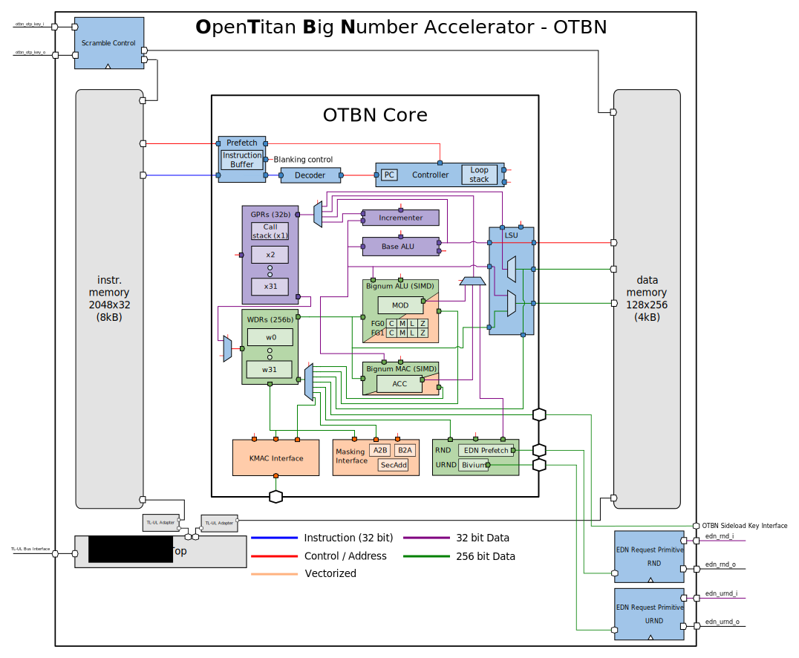
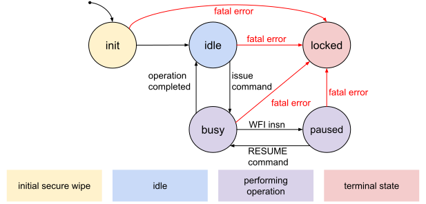
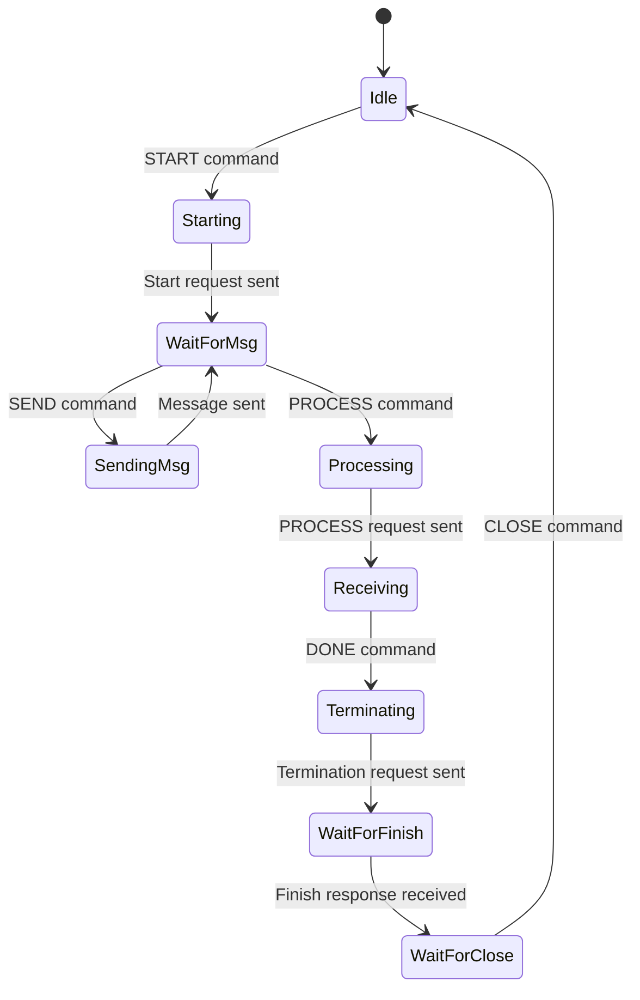
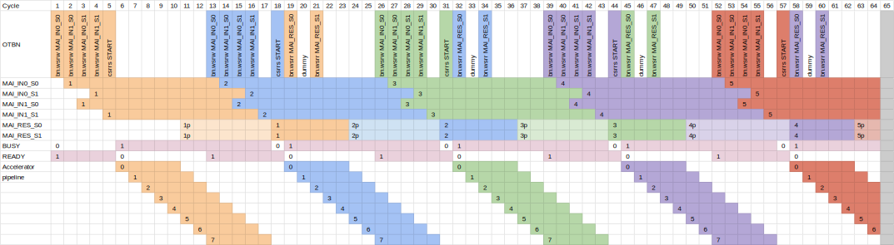

# Theory of Operation

## Block Diagram



## Design Details

### Memories

The OTBN processor core has access to two dedicated memories: an instruction memory (IMEM), and a data memory (DMEM).
The IMEM is 16 KiB, the DMEM is 32 KiB.

The memory layout follows the Harvard architecture.
Both memories are byte-addressed, with addresses starting at 0.

The instruction memory (IMEM) is 32b wide and provides the instruction stream to the OTBN processor.
It cannot be read from or written to by user code through load or store instructions.

The data memory (DMEM) is 256b wide and read-write accessible from the base and big number instruction subsets of the OTBN processor core.
There are four instructions that can access data memory.
In the base instruction subset, there are {{#otbn-insn-ref LW}} (load word) and {{#otbn-insn-ref SW}} (store word).
These access 32b-aligned 32b words.
In the big number instruction subset, there are {{#otbn-insn-ref BN.LID}} (load indirect) and {{#otbn-insn-ref BN.SID}} (store indirect).
These access 256b-aligned 256b words.

Both memories can be accessed through OTBN's register interface ([`DMEM`](registers.md#dmem) and [`IMEM`](registers.md#imem)).
All memory accesses through the register interface must be word-aligned 32b word accesses.

When OTBN is [idle](#operational-states), both memories are accessible through the register interface.
When OTBN is [paused](#operational-states) by a {{#otbn-insn-ref WFI}} instruction, only the DMEM is unlocked and accessible, while the IMEM remains locked.
Note that pausing is only possible when the {{#otbn-insn-ref WFI}} instruction is enabled in the [`CTRL`](registers.md#ctrl) register.
For any memory that is not accessible in the current state, reads return zero and writes have no effect.
Furthermore, an access to such an inaccessible memory will cause OTBN to generate a fatal error with code `ILLEGAL_BUS_ACCESS`, unless OTBN is locked.
A host processor can check the current state by reading the [`STATUS`](registers.md#status) register.

The underlying memories used to implement the IMEM and DMEM may not grant all access requests (see [Memory Scrambling](#memory-scrambling) for details).
A request won't be granted if new scrambling keys have been requested for the memory that aren't yet available.
Functionally it should be impossible for either OTBN or a host processor to make a memory request whilst new scrambling keys are unavailable.
OTBN is in the busy state whilst keys are requested so OTBN will not execute any programs and a host processor access will generated an `ILLEGAL_BUS_ACCESS` fatal error.
Should a request not be granted due to a fault, a `BAD_INTERNAL_STATE` fatal error will be raised.

Although the DMEM is 32kiB, only the first 16kiB (at addresses `0x0` to `0x3fff`) is visible through the register interface.
This is to allow OTBN applications to store sensitive information in the other 16kiB, making it harder for that information to leak back to Ibex.

Each memory write through the register interface updates a checksum.
See the [Memory Load Integrity](#memory-load-integrity) section for more details.

### Instruction Prefetch

OTBN employs an instruction prefetch stage to enable pre-decoding of instructions to enable the [blanking SCA hardening measure](../README.md#blanking).
Its operation is entirely transparent to software.
It does not speculate and will only prefetch where the next instruction address can be known.
This results in a stall cycle for all conditional branches and jumps as the result is neither predicted nor known ahead of time.
Instruction bits held in the prefetch buffer are unscrambled but use the integrity protection described in [Data Integrity Protection](#data-integrity-protection).

### Random Numbers

OTBN is connected to the [Entropy Distribution Network (EDN)](../../edn/README.md) which can provide random numbers via the `RND` and `URND` CSRs and WSRs.

`RND` provides bits taken directly from the EDN connected via `edn_rnd`.
The EDN interface provides 32b of entropy per transaction and comes from a different clock domain to the OTBN core.
A FIFO is used to synchronize the incoming package to the OTBN clock domain.
Synchronized packages are then set starting from bottom up to a single `WLEN` value of 256b.
In order to service a single EDN request, a total of 8 transactions are required from EDN interface.

The `RND` CSR and WSR take their bits from the same source.
A read from the `RND` CSR returns the bottom 32b; the other 192b are discarded.
On a read from the `RND` CSR or WSR, OTBN will stall while it waits for data.
It will resume execution on the cycle after it receives the final word of data from the EDN.

As an EDN request can take time, `RND` is backed by a single-entry cache containing the result of the most recent EDN request in OTBN core level.
Writing any value to the `RND_PREFETCH` CSR initiates a prefetch.
This requests data from the EDN, storing it in the cache, and can hide the EDN latency.
Writes to `RND_PREFETCH` will be ignored whilst a prefetch is in progress or when the cache is already full.
If the cache is full, a read from `RND` returns immediately with the contents of the cache, which is then emptied.
If the cache is not full, a read from `RND` will block as described above until OTBN receives the final word of data from the EDN.

OTBN discards any data that is in the cache at the start of an operation.
If there is still a pending prefetch when an OTBN operation starts, the results of the prefetch will also discarded.

`URND` provides bits from a local Bivium PRNG within OTBN; reads from it never stall.
This PRNG is seeded once from the EDN connected via `edn_urnd` when OTBN starts execution.
Each new execution of OTBN will reseed the `URND` PRNG.
In normal operation, the PRNG state is advanced every cycle when OTBN is running.
OTBN SW can stop and restore the PRNG via the URND control interface.
See the section [below](#urnd-control-interface).

The PRNG has a long cycle length but has a fixed point: the sequence of numbers will get stuck if the state ever happens to become zero.
This will never happen in normal operation.
If a fault causes the state to become zero, OTBN raises a `BAD_INTERNAL_STATE` fatal error.

### URND control interface
OTBN SW has the option to control the URND PRNG at runtime via the URND control interface.
With this interface the state of the PRNG can be saved and restored at runtime which gives an OTBN program the option to generate twice the same stream of random numbers.
This is especially useful, for example, to compress masked variables.
See the [developer guide](developers_guide.md#urnd-context-saving-and-restoring) for how to do this.

This interface is based upon the `URND_CTRL` and `URND_STATUS` CSRs and the `URND_STATE` WSR and must be enabled by the host via the `urnd_ctrl_enabled` bit of the [`CTRL`](registers.md#ctrl) register.
OTBN SW can check if the URND control is enabled by checking `URND_STATUS.URND_CTRL_ENABLED`.
If the interface is disabled, all commands provided via `URND_CTRL` have no effect and the PRNG state cannot be read via `URND_STATE`.
If enabled, the PRNG can be manipulated in the following ways:
- The PRNG can be stopped by writing a 1 to `URND_CTRL.STOP`.
  This stops the PRNG from updating its state until `URND_CTRL.START` is issued.
  - Note that if bits from the PRNG are actively used whilst the PRNG is stopped, for security reasons the state is nonetheless advanced in the cycle the randomness is used.
  This is the case when SW reads from URND or any accelerator like the MAI uses bits for its masking.
  - If such a forced update happens, `URND_STATUS.USED_WHILE_STOPPED` is set to 1.
- The current state of the PRNG can be read at any time via the `URND_STATE` WSR.
- The PRNG can be restored to a state, see explanation below.
- The PRNG can be resumed by writing a 1 to `URND_CTRL.START`.
  This is also possible whilst a restore process is ongoing.

To provide URND as a glitch free signal to all its consumers (URND is used for hardware based masking), the URND value is the registered version of the PRNG output.
Due to this, the URND value lacks one cycle behind the PRNG state.
This has the implications when issuing a start or stop command or reading URND whilst the PRNG is stopped.

When a stop command is issued, URND is still advance in the cycle immediately afterwards.
When a start command is issued, URND changes only in the 2nd cycle.
The following diagram illustrates this:

```wavejson
{
  signal: [
    {name: 'Command',             wave: '0.20.20...', data: ["Stop","Start"]},
    {name: 'URND_STATUS.stopped', wave: '0.1...0...'},
    {name: 'PRNG State',          wave: '345...6789'},
    {name: 'URND',                wave: '2345...678'},
  ],
  edge: [],
  foot:{
   tock:0
 },
 config:{hscale:1},
}
```

If the URND value is used while stopped (SW reads it or MAI is busy), the URND is also updated only in the 2nd cycle afterwards.
In case two reads happen subsequently, the same URND value is returned.
This is illustrated in the following diagram (examples with one and three reads).

```wavejson
{
  signal: [
    {name: 'Command',                        wave: '020..........', data: ["Stop","Start"]},
    {name: 'URND_STATUS.stopped',            wave: '0.1..........'},
    {name: 'URND_STATUS.used_while_stopped', wave: '0....1.......'},
    {name: 'Forced URND usage',              wave: '0...10..1..0.'},
    {name: 'PRNG State',                     wave: '45...6...789.'},
    {name: 'URND',                           wave: '345...6...789'},
  ],
  edge: [],
  foot:{
   tock:0
 },
 config:{hscale:1},
}
```

#### Restoring a state
A PRNG restore happens in steps and OTBN SW must:
- Issue the `URND_CTRL.RESTORE` command.
  - This starts the restore process and `URND_STATUS.RESTORING` is set to 1.
  - A restore can be started when the PRNG is stopped or running.
    However, if it is running each cycle will advance the state.
- Write the desired state in `URND_STATUS.URND_RESTORE_WIDTH` words to `URND_STATE`.
  - The restore starts with the least significant word of the state.
  - Only the lowest `URND_STATUS.URND_RESTORE_WIDTH` bits (or fewer for the last restore word) are used for the restore step.
    The upper bits of the write are ignored.
  - The restore process is complete once the last restore word is written to the `URND_STATE`.
    The `URND_STATUS.RESTORING` is then cleared to 0.
  - The number of restore words can be determined based upon `URND_STATUS.URND_RESTORE_WIDTH` and `URND_STATUS.URND_STATE_WIDTH`.
    Note, these values are constant and just provided for SW flexibility.

There is no immediate state validation when restoring a state.
If an invalid state (e.g., all-zero) is provided, the PRNG will raise a fatal error on the next state update.

The diagram shows a complete save and restore process.
Note there is no read command but in the diagram this represents reading the `URND_STATE` WSR.
```wavejson
{
  signal: [
    {name: 'Command',               wave: '02220..220...20.', data: ["Stop","Read","Start","Stop","RST","Start"]},
    {name: 'URND_STATUS.stopped',   wave: '0.1.0..1......0.'},
    {name: 'URND_STATUS.restoring', wave: '0........1...0.'},
    {name: 'Restore word',          wave: '0........22|20..', data: ["1","2","6"]},
    {name: 'PRNG State',            wave: '45..67|x.....567'},
    {name: 'URND',                  wave: '345..6|x......56'},
  ],
  edge: [],
  foot:{
   tock:0
 },
 config:{hscale:1},
}
```

### Operational States

<!--
Source: https://docs.google.com/drawings/d/1C0D4UriRk5pKGFoFtAXYLcJ1oBG1BCDd2omCLPYHtr0/edit

Download the SVG from Google Draw, open it in Inkscape once and save it without changes to add width/height information to the image.
-->


OTBN can be in different operational states.
After reset (*init*), OTBN performs a secure wipe of the internal state and then becomes *idle*.
OTBN is *busy* for as long it is performing an operation.
While executing an application, OTBN can become *paused* when executing the {{#otbn-insn-ref WFI}} instruction if this instruction is enabled in the [`CTRL`](registers.md#ctrl) register.
OTBN resumes the execution once the `RESUME` command is issued.
OTBN is *locked* if a fatal error was observed or after handling an RMA request.

The current operational state is reflected in the [`STATUS`](registers.md#status) register.
- After reset, OTBN is busy with the internal secure wipe and the [`STATUS`](registers.md#status) register is set to `BUSY_SEC_WIPE_INT`.
- If OTBN is idle, the [`STATUS`](registers.md#status) register is set to `IDLE`.
- If OTBN is busy, the [`STATUS`](registers.md#status) register is set to one of the values starting with `BUSY_`.
- If OTBN gets paused by a {{#otbn-insn-ref WFI}} instruction, the [`STATUS`](registers.md#status) register is set to `PAUSED`.
- If OTBN is locked, the [`STATUS`](registers.md#status) register is set to `LOCKED`.

OTBN transitions into the busy state as result of host software [issuing a command](#operations-and-commands); OTBN is then said to perform an operation.
OTBN transitions out of the busy state whenever the operation has completed or the execution gets paused.
In the [`STATUS`](registers.md#status) register the different `BUSY_*` values represent the operation that is currently being performed.

A transition out of the busy state or entering the `PAUSED` state is signaled by the `done` interrupt ([`INTR_STATE.done`](registers.md#intr_state)).

When paused, issuing a `RESUME` command makes the OTBN continue with the next instruction.

The locked state is a terminal state; transitioning out of it requires an OTBN reset.

### Operations and Commands

OTBN understands a set of commands to perform certain operations.
Commands are issued by writing to the [`CMD`](registers.md#cmd) register.

The `EXECUTE` command starts the [execution of the application](#software-execution) contained in OTBN's instruction memory.

The `SEC_WIPE_DMEM` command [securely wipes the data memory](#secure-wipe).

The `SEC_WIPE_IMEM` command [securely wipes the instruction memory](#secure-wipe).

The `RESUME` command resumes the execution after a {{#otbn-insn-ref WFI}} instruction.

### Software Execution

Software execution on OTBN is triggered by host software by [issuing the `EXECUTE` command](#operations-and-commands).
The software then runs to completion, without the ability for host software to interrupt or inspect the execution.

- OTBN transitions into the busy state, and reflects this by setting [`STATUS`](registers.md#status) to `BUSY_EXECUTE`.
- The internal randomness source, which provides random numbers to the `URND` CSR and WSR, is re-seeded from the EDN.
- The instruction at address zero is fetched and executed.
- From this point on, all subsequent instructions are executed according to their semantics until either:
  - A {{#otbn-insn-ref WFI}} instruction is executed (if enabled).
    In this case, the execution is paused and the DMEM is unlocked for the host.
    The execution must be resumed by the host by issuing the `RESUME` command.
    There can be multiple pauses per execution and each {{#otbn-insn-ref WFI}} instruction issues the `done` interrupt ([`INTR_STATE.done`](registers.md#intr_state)).
  - An {{#otbn-insn-ref ECALL}} instruction is executed, or an error is detected.
    This marks the end of the execution.
- A [secure wipe of internal state](#internal-state-secure-wipe) is performed.
- The [`ERR_BITS`](registers.md#err_bits) register is set to indicate either a successful execution (value `0`), or to indicate the error that was observed (a non-zero value).
- OTBN transitions into the [idle state](#operational-states) (in case of a successful execution, or a recoverable error) or the locked state (in case of a fatal error).
  This transition is signaled by raising the `done` interrupt ([`INTR_STATE.done`](registers.md#intr_state)), and reflected in the [`STATUS`](registers.md#status) register.

### Errors

OTBN is able to detect a range of errors, which are classified as *software errors* or *fatal errors*.
A software error is an error in the code that OTBN executes.
In the absence of an attacker, these errors are due to a programmer's mistake.
A fatal error is typically the violation of a security property.
All errors and their classification are listed in the [List of Errors](#list-of-errors).

Whenever an error is detected, OTBN reacts locally, and informs the OpenTitan system about it by raising an alert.
OTBN generally does not try to recover from errors itself, and provides no error handling support to code that runs on it.

OTBN gives host software the option to recover from some errors by restarting the operation.
All software errors are treated as recoverable, unless [`CTRL.software_errs_fatal`](registers.md#ctrl) is set, and are handled as described in the section [Reaction to Recoverable Errors](#reaction-to-recoverable-errors).
When [`CTRL.software_errs_fatal`](registers.md#ctrl) is set, software errors become fatal errors.

Fatal errors are treated as described in the section [Reaction to Fatal Errors](#reaction-to-fatal-errors).

### Reaction to Recoverable Errors

Recoverable errors can be the result of a programming error in OTBN software.
Recoverable errors can only occur during the execution of software on OTBN, and not in other situations in which OTBN might be busy.

The following actions are taken when OTBN detects a recoverable error:

1. The currently running operation is terminated, similar to the way an {{#otbn-insn-ref ECALL}} instruction [is executed](#software-execution):
   - No more instructions are fetched or executed.
   - A [secure wipe of internal state](#internal-state-secure-wipe) is performed.
   - The [`ERR_BITS`](registers.md#err_bits) register is set to a non-zero value that describes the error.
   - The current operation is marked as complete by setting [`INTR_STATE.done`](registers.md#intr_state).
   - The [`STATUS`](registers.md#status) register is set to `IDLE`.
2. A [recoverable alert](#alerts) is raised.

The host software can start another operation on OTBN after a recoverable error was detected.

### Reaction to Fatal Errors

Fatal errors are generally seen as a sign of an intrusion, resulting in more drastic measures to protect the secrets stored within OTBN.
Fatal errors can occur at any time, even when an OTBN operation isn't in progress.

The following actions are taken when OTBN detects a fatal error:

1. A [secure wipe of the data memory](#data-memory-dmem-secure-wipe) and a [secure wipe of the instruction memory](#instruction-memory-imem-secure-wipe) is initiated.
2. If OTBN [is not idle](#operational-states), then the currently running operation is terminated, similarly to how an operation ends after an {{#otbn-insn-ref ECALL}} instruction [is executed](#software-execution):
   - No more instructions are fetched or executed.
   - A [secure wipe of internal state](#internal-state-secure-wipe) is performed.
   - The [`ERR_BITS`](registers.md#err_bits) register is set to a non-zero value that describes the error.
   - The current operation is marked as complete by setting [`INTR_STATE.done`](registers.md#intr_state).
3. The [`STATUS`](registers.md#status) register is set to `LOCKED`.
4. A [fatal alert](#alerts) is raised.

Note that OTBN can detect some errors even when it isn't running.
One example of this is an error caused by an integrity error when reading or writing OTBN's memories over the bus.
In this case, the [`ERR_BITS`](registers.md#err_bits) register will not change.
This avoids race conditions with the host processor's error handling software.
However, every error that OTBN detects when it isn't running is fatal.
This means that the cause will be reflected in [`FATAL_ALERT_CAUSE`](registers.md#fatal_alert_cause), as described below in [Alerts](#alerts).
This way, no alert is generated without setting an error code somewhere.

### List of Errors

<table>
  <thead>
    <tr>
      <th>Name</th>
      <th>Class</th>
      <th>Description</th>
    </tr>
  </thead>
  <tbody>
    <tr>
      <td><code>BAD_DATA_ADDR</code></td>
      <td>software</td>
      <td>A data memory access occurred with an out of bounds or unaligned access.</td>
    </tr>
    <tr>
      <td><code>BAD_INSN_ADDR</code></td>
      <td>software</td>
      <td>An instruction memory access occurred with an out of bounds or unaligned access.</td>
    </tr>
    <tr>
      <td><code>CALL_STACK</code></td>
      <td>software</td>
      <td>An instruction tried to pop from an empty call stack or push to a full call stack.</td>
    </tr>
    <tr>
      <td><code>ILLEGAL_INSN</code></td>
      <td>software</td>
      <td>
        An illegal instruction was about to be executed.
      </td>
    <tr>
      <td><code>LOOP</code></td>
      <td>software</td>
      <td>
        A loop stack-related error was detected.
      </td>
    </tr>
    <tr>
      <td><code>KEY_INVALID</code></td>
      <td>software</td>
      <td>
        An attempt to read a <code>KEY_*</code> WSR was detected, but no key was provided by the key manager.
      </td>
    </tr>
    <tr>
      <td><code>MAI_SOFTWARE_ERROR</code></td>
      <td>software</td>
      <td>
        An illegal SW interaction towards the MAI occurred.
        See the MAI error handling section.
      </td>
    </tr>
    <tr>
      <td><code>RND_REP_CHK_FAIL</code></td>
      <td>recoverable</td>
      <td>
        The random number obtained from the last read of the RND register failed the repetition check.
        The RND EDN interface returned identical random numbers on two subsequent entropy requests.
      </td>
    </tr>
    <tr>
      <td><code>RND_FIPS_CHK_FAIL</code></td>
      <td>recoverable</td>
      <td>
        The random number obtained from the last read of the RND register has been generated from entropy that at least partially failed the FIPS health checks in the entropy source.
      </td>
    </tr>
    <tr>
      <td><code>IMEM_INTG_VIOLATION</code></td>
      <td>fatal</td>
      <td>Data read from the instruction memory failed the integrity checks.</td>
    </tr>
    <tr>
      <td><code>DMEM_INTG_VIOLATION</code></td>
      <td>fatal</td>
      <td>Data read from the data memory failed the integrity checks.</td>
    </tr>
    <tr>
      <td><code>REG_INTG_VIOLATION</code></td>
      <td>fatal</td>
      <td>Data read from a GPR or WDR failed the integrity checks.</td>
    </tr>
    <tr>
      <td><code>BUS_INTG_VIOLATION</code></td>
      <td>fatal</td>
      <td>An incoming bus transaction failed the integrity checks.</td>
    </tr>
    <tr>
      <td><code>BAD_INTERNAL_STATE</code></td>
      <td>fatal</td>
      <td>The internal state of OTBN has become corrupt.</td>
    </tr>
    <tr>
      <td><code>ILLEGAL_BUS_ACCESS</code></td>
      <td>fatal</td>
      <td>A bus-accessible register or memory was accessed when not allowed.</td>
    </tr>
    <tr>
      <td><code>LIFECYCLE_ESCALATION</code></td>
      <td>fatal</td>
      <td>A life cycle escalation request was received.</td>
    </tr>
    <tr>
      <td><code>FATAL_SOFTWARE</code></td>
      <td>fatal</td>
      <td>A software error was seen and <code>CTRL.software_errs_fatal</code> was set.</td>
    </tr>
  </tbody>
</table>

### Alerts

An alert is a reaction to an error that OTBN detected.
OTBN has two alerts, one recoverable and one fatal.

A **recoverable alert** is a one-time triggered alert caused by [recoverable errors](#reaction-to-recoverable-errors).
The error that caused the alert can be determined by reading the [`ERR_BITS`](registers.md#err_bits) register.

A **fatal alert** is a continuously triggered alert caused by [fatal errors](#reaction-to-fatal-errors).
The error that caused the alert can be determined by reading the [`FATAL_ALERT_CAUSE`](registers.md#fatal_alert_cause) register.
If OTBN was running, this value will also be reflected in the [`ERR_BITS`](registers.md#err_bits) register.
A fatal alert can only be cleared by resetting OTBN through the `rst_ni` line.

The host CPU can clear the [`ERR_BITS`](registers.md#err_bits) when OTBN is not running.
Writing any value to [`ERR_BITS`](registers.md#err_bits) clears this register to zero.
Write attempts while OTBN is running are ignored.

### Reaction to Life Cycle Escalation Requests

OTBN receives and reacts to escalation signals from the [life cycle controller](../../lc_ctrl/doc/theory_of_operation.md#security-escalation).
An incoming life cycle escalation is a fatal error of type `lifecycle_escalation` and treated as described in the section [Fatal Errors](#reaction-to-fatal-errors).

### Idle

OTBN exposes a single-bit `idle_o` signal, intended to be used by the clock manager to clock-gate the block when it is not in use.
This signal is in the same clock domain as `clk_i`.
The `idle_o` signal is high when OTBN [is idle](#operational-states), and low otherwise.

OTBN also exposes another version of the idle signal as `idle_otp_o`.
This works analogously, but is in the same clock domain as `clk_otp_i`.

TODO: Specify interactions between `idle_o`, `idle_otp_o` and the clock manager fully.

### Data Integrity Protection

OTBN stores and operates on data (state) in its dedicated memories, register files, and internal registers.
OTBN's data integrity protection is designed to protect all data stored and transmitted within OTBN from modifications through physical attacks.

During transmission, the integrity of data is protected with an integrity protection code.
Data at rest in the instruction and data memories is additionally scrambled.

In the following, the Integrity Protection Code and the scrambling algorithm are discussed, followed by their application to individual storage elements.

#### Integrity Protection Code

OTBN uses the same integrity protection code everywhere to provide overarching data protection without regular re-encoding.
The code is applied to 32b data words, and produces 39b of encoded data.

The code used is an (39,32) Hsiao "single error correction, double error detection" (SECDED) error correction code (ECC) [[CHEN08](#ref-chen08)].
It has a minimum Hamming distance of four, resulting in the ability to detect at least three errors in a 32 bit word.
The code is used for error detection only; no error correction is performed.

#### Memory Scrambling

Contents of OTBN's instruction and data memories are scrambled while at rest.
The data is bound to the address and scrambled before being stored in memory.
The addresses are randomly remapped.

Note that data stored in other temporary memories within OTBN, including the register files, is not scrambled.

Scrambling is used to obfuscate the memory contents and to diffuse the data.
Obfuscation makes passive probing more difficult, while diffusion makes active fault injection attacks more difficult.

The scrambling mechanism is described in detail in the [section "Scrambling Primitive" of the SRAM Controller Technical Specification](../../sram_ctrl/doc/theory_of_operation.md#scrambling-primitive).

When OTBN comes out of reset, its memories have default scrambling keys.
The host processor can request new keys for each memory by issuing a [secure wipe of DMEM](#data-memory-dmem-secure-wipe) and a [secure wipe of IMEM](#instruction-memory-imem-secure-wipe).

#### Actions on Integrity Errors

A [fatal error](#reaction-to-fatal-errors) is raised whenever a data integrity violation is detected, which results in an immediate stop of all processing and the issuing of a fatal alert.

#### Register File Integrity Protection

OTBN contains two register files: the 32b GPRs and the 256b WDRs.
The data stored in both register files is protected with the [Integrity Protection Code](#integrity-protection-code).
Neither the register file contents nor register addresses are scrambled.

The GPRs `x2` to `x31` store a 32b data word together with the Integrity Protection Code, resulting in 39b of stored data.
(`x0`, the zero register, and `x1`, the call stack, require special treatment.)

Each 256b Wide Data Register (WDR) stores a 256b data word together with the Integrity Protection Code, resulting in 312b of stored data.
The integrity protection is done separately for each of the eight 32b sub-words within a 256b word.

The register files can consume data protected with the Integrity Protection Code, or add it on demand.
Whenever possible the Integrity Protection Code is preserved from its source and written directly to the register files without recalculation, in particular in the following cases:

* Data coming from the data memory (DMEM) through the load-store unit to a GPR or WDR.
* Data copied between WDRs using the {{#otbn-insn-ref BN.MOV}} or {{#otbn-insn-ref BN.MOVR}} instructions.
* Data conditionally copied between WDRs using the {{#otbn-insn-ref BN.SEL}} instruction.
* Data copied between the `ACC` and `MOD` WSRs and a WDR.
* Data copied between any of the `MOD0` to `MOD7` CSRs and a GPR.
  (TODO: Not yet implemented.)

In all other cases the register files add the Integrity Protection Code to the incoming data before storing the data word.

The integrity protection bits are checked on every read from the register files, even if the integrity protection is not removed from the data.

Detected integrity violations in a register file raise a fatal `reg_error`.

#### Data Memory (DMEM) Integrity Protection

OTBN's data memory is 256b wide, but allows for 32b word accesses.
To facilitate such accesses, all integrity protection in the data memory is done on a 32b word granularity.

All data entering or leaving the data memory block is protected with the [Integrity Protection Code](#integrity-protection-code);
this code is not re-computed within the memory block.

Before being stored in SRAM, the data word with the attached Integrity Protection Code, as well as the address are scrambled according to the [memory scrambling algorithm](#memory-scrambling).
The scrambling is reversed on a read.

The ephemeral memory scrambling key and the nonce are provided by the OTP block.
They are set once when OTBN block is reset, and changed whenever a [secure wipe](#data-memory-dmem-secure-wipe) of the data memory is performed.
For example, see earlgrey's [OTP block](../../../top_earlgrey/ip_autogen/otp_ctrl/doc/theory_of_operation.md#scrambling-key-derivation).

The Integrity Protection Code is checked on every memory read, even though the code remains attached to the data.
A further check must be performed when the data is consumed.
Detected integrity violations in the data memory raise a fatal `dmem_error`.

#### Instruction Memory (IMEM) Integrity Protection

All data entering or leaving the instruction memory block is protected with the [Integrity Protection Code](#integrity-protection-code);
this code is not re-computed within the memory block.

Before being stored in SRAM, the instruction word with the attached Integrity Protection Code, as well as the address are scrambled according to the [memory scrambling algorithm](#memory-scrambling).
The scrambling is reversed on a read.

The ephemeral memory scrambling key and the nonce are provided by the OTP block (for example, see earlgrey's [scrambling specification](../../../top_earlgrey/ip_autogen/otp_ctrl/doc/theory_of_operation.md#scrambling-key-derivation)).
They are set once when OTBN block is reset, and changed whenever a [secure wipe](#instruction-memory-imem-secure-wipe) of the instruction memory is performed.

The Integrity Protection Code is checked on every memory read, even though the code remains attached to the data.
A further check must be performed when the data is consumed.
Detected integrity violations in the data memory raise a fatal `imem_error`.

### Memory Load Integrity

As well as the integrity protection discussed above for the memories and bus interface, OTBN has a second layer of integrity checking to allow a host processor to ensure that a program has been loaded correctly.
This is visible through the [`LOAD_CHECKSUM`](registers.md#load_checksum) register.
The register exposes a cumulative CRC checksum which is updated on every write to either memory.

This is intended as a light-weight way to implement a more efficient "write and read back" check.
It isn't a cryptographically secure MAC, so cannot spot an attacker who can completely control the bus.
However, in this case the attacker would be equally able to control responses from OTBN, so any such check could be subverted.

The CRC used is the 32-bit CRC-32-IEEE checksum.
This standard choice of generating polynomial makes it compatible with other tooling and libraries, such as the [crc32 function](https://docs.python.org/3/library/binascii.html#binascii.crc32) in the python 'binascii' module and the crc instructions in the RISC-V bitmanip specification [[SYMBIOTIC21](#ref-symbiotic21)].
The stream over which the checksum is computed is the stream of writes that have been seen since the last write to [`LOAD_CHECKSUM`](registers.md#load_checksum).
Each write is treated as a 48b value, `{imem, idx, wdata}`.
Here, `imem` is a single bit flag which is one for writes to IMEM and zero for writes to DMEM.
The `idx` value is the index of the word within the memory, zero-extended to 15b.
Finally, `wdata` is the 32b word that was written.
Writes that are less than 32b or not aligned on a 32b boundary are ignored and not factored into the CRC calculation.

The host processor can also write to the register.
Typically, this will be to clear the value to `32'h00000000`, the traditional starting value for a 32-bit CRC.
Note the internal representation of the CRC is inverted from the register visible version.
This is done to maintain compatibility with existing CRC-32-IEEE tooling and libraries.

To use this functionality, the host processor should set [`LOAD_CHECKSUM`](registers.md#load_checksum) to a known value (traditionally, `32'h00000000`).
Next, it should write the program to be loaded to OTBN's IMEM and DMEM over the bus.
Finally, it should read back the value of [`LOAD_CHECKSUM`](registers.md#load_checksum) and compare it with an expected value.

### Secure Wipe

Applications running on OTBN may store sensitive data in the internal registers or the memory.
In order to prevent an untrusted application from reading any leftover data, OTBN provides the secure wipe operation.
This operation can be applied to:
- [Data memory](#data-memory-dmem-secure-wipe)
- [Instruction memory](#instruction-memory-imem-secure-wipe)
- [Internal state](#internal-state-secure-wipe)

The three forms of secure wipe can be triggered in different ways.

A secure wipe of either the instruction or the data memory can be triggered from host software by issuing a `SEC_WIPE_DMEM` or `SEC_WIPE_IMEM` [command](#operations-and-commands).

A secure wipe of instruction memory, data memory, and all internal state is performed automatically when handling a [fatal error](#reaction-to-fatal-errors).
In addition, it can be triggered by the [Life Cycle Controller](../../lc_ctrl/README.md) before RMA entry using the `lc_rma_req/ack` interface.
In both cases OTBN enters the locked state afterwards and needs to be reset.

A secure wipe of the internal state only is triggered automatically after reset and when OTBN [ends the software execution](#software-execution), either successfully, or unsuccessfully due to a [recoverable error](#reaction-to-recoverable-errors).

If OTBN cannot complete a secure wipe of the internal state (e.g., due to failing to obtain the required randomness), it immediately becomes locked.
In this case, OTBN must be reset and will then retry the secure wipe.
The secure wipe after reset must succeed before OTBN can be used.

#### Data Memory (DMEM) Secure Wipe

The wiping is performed by securely replacing the memory scrambling key, making all data stored in the memory unusable.
The key replacement is a two-step process:

* Overwrite the 128b key of the memory scrambling primitive with randomness from URND.
  This action takes a single cycle.
* Request new scrambling parameters from OTP.
  The request takes multiple cycles to complete.

Host software can initiate a data memory secure wipe by [issuing the `SEC_WIPE_DMEM` command](#operations-and-commands).

#### Instruction Memory (IMEM) Secure Wipe

The wiping is performed by securely replacing the memory scrambling key, making all instructions stored in the memory unusable.
The key replacement is a two-step process:

* Overwrite the 128b key of the memory scrambling primitive with randomness from URND.
  This action takes a single cycle.
* Request new scrambling parameters from OTP.
  The request takes multiple cycles to complete.

Host software can initiate a data memory secure wipe by [issuing the `SEC_WIPE_IMEM` command](#operations-and-commands).

#### Internal State Secure Wipe

OTBN provides a mechanism to securely wipe all internal state, excluding the instruction and data memories.

The following state is wiped:
* Register files: GPRs and WDRs
* The accumulator register (also accessible through the ACC WSR) and the intermediate result registers for the Montgomery computation (hidden registers).
* Flags (accessible through the FG0, FG1, and FLAGS CSRs)
* The modulus (accessible through the MOD0 to MOD7 CSRs and the MOD WSR)
* The WSRs and CSRs for the [KMAC interface](#kmac-interface).
* The WSRs and CSRs for the [Masking Accelerator Interface](#masking-accelerator-interface).

The wiping procedure is a two-step process:
* Overwrite the state with randomness from URND and request a reseed of URND.
* Overwrite the state with randomness from reseeded URND.

Note that after internal secure wipe, the state of registers is undefined.
In order to prevent mismatches between ISS and RTL, software needs to initialise a register with a full-word write before using its value.

Loop and call stack pointers are reset.

A secure wipe terminates any ongoing KMAC interface session.
See the [secure wipe section](#kmac-interface-secure-wipe-behaviour) of the interface description.
Any ongoing masking accelerator (MAI) operation ends regularly but all results are voided.
See the [secure wipe section](#mai-secure-wipe-behaviour) of the MAI.

Host software cannot explicitly trigger an internal secure wipe; it is performed automatically after reset and at the end of an `EXECUTE` operation.

### KMAC interface
The OTBN features an interface towards the KMAC HWIP which can be used to offload hashing operations.
It consists of the following CSRs / WSRs:
- `KMAC_STATUS`
- `KMAC_CTRL`
- `KMAC_CFG`
- `KMAC_STRB`
- `KMAC_DATA_S0` / `KMAC_DATA_S1`

Behind these CSRs/WSRs, which are described in more detail [here](../README.md#Control-and-Status-Registers-(CSRs)), OTBN uses a [dynamic application interface](../../kmac/doc/theory_of_operation.md#application-interfaces) of the KMAC HWIP.

Before OTBN can make use of this interface, system SW must setup the KMAC HWIP correctly.
See the KMAC HWIP documentation what must be configured before OTBN can use the interface.

OTBN software can control this interface by configuring it via `KMAC_CFG` and issuing commands via `KMAC_CTRL`.
These commands are then translated to dynamic application interface requests.
The responses from the interface are translated and exposed to OTBN SW via `KMAC_STATUS` and `KMAC_DATA_S0` / `KMAC_DATA_S1`.

The interface supports multiple successive sessions where each session follows the following high-level steps:
- Check if the interface is ready by checking for `KMAC_STATUS.READY = 1`.
- Configure the desired hashing mode via `KMAC_CFG`.
- Start a session by issuing the `KMAC_CTRL.START` command.
- Send the message parts by issuing one or more `KMAC_CTRL.SEND` commands.
- Issue the `KMAC_CTRL.PROCESS` command to process the full message.
- Wait for the first response by polling until `KMAC_STATUS.RSP_VALID = 1`.
- Check for errors by reading `KMAC_STATUS.RSP_ERROR`.
  - If there is an error, the session must be terminated, see error handling.
- Read the digest in 64-bit parts from `KMAC_DATA_S0` and `KMAC_DATA_S1`.
- For more digest data, poll again until `KMAC_STATUS.RSP_VALID = 1` after reading both data WSRs.
- Once the digest or the desired XOF output is read, end the digest reading phase by issuing a `KMAC_CTRL.DONE` command.
- Wait until the `KMAC_CTRL.DONE` command has completed by polling until `KMAC_STATUS.RSP_VALID = 1`.
- Check for errors by reading `KMAC_STATUS.RSP_ERROR`, `KMAC_STATUS.MSG_WRITE_ERROR`, and `KMAC_STATUS.CTRL_ERROR`.
  - If there is an error, the digest data must be considered as invalid.
- Issue the `KMAC_CTRL.CLOSE` command to end the session.

Note that this high-level outline simplifies some steps, especially the error handling.
If there is no error at the end, OTBN can start the next session with a new configuration and message.
See the detailed explanations for the different steps in the next sections and the error handling section for more details.

#### Session details
This section elaborates on the previously presented high-level steps how to use the interface.
The interface keeps track of the current session with the following state machine.
Note, a command is issued by OTBN SW and a request/response refers to a KMAC HWIP application interface request/response which is generated/received by the OTBN-KMAC interface module.
For simplicity, additional states to handle a secure wipe are not depicted.


```mermaid
stateDiagram-v2
[*] --> Idle

Idle --> Starting: START command

Starting --> WaitForMsg: Start request sent

WaitForMsg --> SendingMsg: SEND command
WaitForMsg --> Processing: PROCESS command

SendingMsg --> WaitForMsg: Message sent

Processing --> Receiving: PROCESS request sent

Receiving --> Terminating: DONE command

Terminating --> WaitForFinish: Termination request sent

WaitForFinish --> WaitForClose: Finish response received

WaitForClose --> Idle: CLOSE command
```

##### Starting a session
To start a session the OTBN SW has to:
- Poll until `KMAC_STATUS.READY = 1`.
  - This should be 1 in most cases when OTBN starts executing a program, however, the interface could still be terminating a previous session due to a secure wipe (see secure wipe behaviour).
- Write the desired hashing configuration to `KMAC_CFG`.
  - There is no validation when writing a configuration to `KMAC_CFG` but KMAC HWIP does check the configuration once the session is started.
    See [error handling](#kmac-interface-error-handling) section for more details.
- Issue the `KMAC_CTRL.START` command by writing a 1 to it.
- There may be no write to `KMAC_CFG` until `KMAC_STATUS.READY` is 1 again (polled for before sending message).
  - Otherwise the configuration can be changed while the start request is being sent.
    The behaviour of the interface in this case is undefined.
  - Writing `KMAC_CFG` while `KMAC_STATUS.READY` is 0 sets `KMAC_STATUS.MSG_WRITE_ERROR`.

There is no immediate response indicating whether the session was started successfully or not.
This can be detected when sending the message or is reported along the first digest response: see [error handling](#kmac-interface-error-handling).
As such, after sending the `KMAC_CTRL.START` command OTBN SW must continue with sending the message.

##### Sending the message
Once the `KMAC_CTRL.START` command was issued, OTBN SW can send the message by following these steps:
- Poll until `KMAC_STATUS.READY = 1`.
  - This can time out in certain error cases, see [error handling](#kmac-interface-error-handling).
- Write a message into `KMAC_DATA_S0` and `KMAC_DATA_S1` (share 0 and 1, respectively) and set the corresponding strobe in `KMAC_STRB`.
  - All messages, including the last one, must be contiguous and LSB aligned.
  - Only the last message may be partial.
  - For an unmasked message, write the plaintext into one of the input WSRs and write zeros into the other one.
- Send the message by writing a 1 to `KMAC_CTRL.SEND`.
- Repeat these steps until the full message has been sent.

To end the message phase:
  - Poll until `KMAC_STATUS.READY = 1`.
  - Issue the `KMAC_CTRL.PROCESS` command by writing a 1 to it.

##### Retrieving digest data
Once the `PROCESS` command is issued, the KMAC HWIP starts hashing the message.
As soon as the first digest part is ready, the app interface automatically pushes it towards OTBN without any additional requests from OTBN.
After issuing the `PROCESS` command, OTBN software thus must do the following:
- Wait for the first response by polling until `KMAC_STATUS.RSP_VALID = 1`.
- Check `KMAC_STATUS.RSP_ERROR`.
  - If 1, an error occurred and the app interface does not send any further responses.
  - The session must be terminated as described in the error section.
- If there is no error, OTBN can read the first digest data (64-bit) from `KMAC_DATA_S0` and `KMAC_DATA_S1`.
  - The digest data always comes in a shared representation.
    To recover the plaintext digest the values read from `KMAC_DATA_S0` and `KMAC_DATA_S1` must be XORed.
- Once both WSRs, `KMAC_DATA_S0` and `KMAC_DATA_S1`, have been read the interface clears `KMAC_STATUS.RSP_VALID` and the interface will accept the next digest part from the app interface.
  (i.e., the `KMAC_STATUS.RSP_VALID` bit serves as back-pressure.)
- Repeat the steps until the full digest or the required XOF output is received.
  - As the `KMAC_STATUS.RSP_ERROR` flag is sticky, subsequent checks can be postponed until the last element is read.
  - The first check is however essential as in case of an error no more responses arrive and polling `KMAC_STATUS.RSP_VALID` would deadlock.

The number of digest parts pushed by the app interface depends on the selected mode, strength and XOF setting.

For SHA3 and KMAC, `KMAC_CFG.EN_XOF` must be `0` and the interface pushes only the SHA3 digest or the requested output length for KMAC.
The requested output length of KMAC is fixed by the KMAC HWIP to 384 bits.
For SHA3 it pushes `roundup(digest_width / 64)` responses.
For KMAC it pushes `384 / 64 = 6` responses.
Once these are pushed, the interface waits for a `DONE` command as explained [below](#ending-a-session).

If the mode is SHAKE or cSHAKE, `KMAC_CFG.EN_XOF` controls whether the KMAC HWIP automatically issues RUN commands.
If `KMAC_CFG.EN_XOF = 0`, the KMAC HWIP pushes only the digest parts that make up the first rate.
Once these are pushed, the interface waits for a `DONE` command as explained [below](#ending-a-session).

If `KMAC_CFG.EN_XOF = 1`, the KMAC HWIP pushes infinite responses.
For this it automatically squeezes more digest by issuing a KMAC HWIP internal squeeze command each time it finishes pushing one full rate.
As soon as the squeezing has finished, the app starts again to push the new rate towards OTBN.
When the OTBN software has received enough XOF output, the session can be terminated as explained [below](#ending-a-session).

For SHAKE and cSHAKE the number of responses per rate depends on the strength and can be computed with (The `StateWidth` is defined by NIST FIPS-202 to be 1600):
`#Responses = (StateWidth - 2 * Strength) / 64 = (1600 - 2 * Strength) / 64`.

###### Optimizing the digest retrieval
The KMAC hashing operation is fully deterministic and thus the polling until `KMAC_STATUS.RSP_VALID = 1` can be optimized.
The first polling after issuing the `PROCESS` command is required as it is unknown when exactly the first response arrives (error response arrives earlier than the first digest).
However, once the first response has arrived, the arrival of the subsequent responses is fully deterministic.
The KMAC HWIP pushes the full rate back to back and the squeezing is also a deterministic operation.
On the OTBN interface side, each time both shares are read, the next digest is accepted by the interface in the same cycle (assuming the KMAC HWIP is currently pushing digest data).
This allows OTBN SW to read the digest responses back to back, exploiting the full bandwidth the KMAC provides.

##### Ending a session

A session must always be ended with the `DONE` command followed by a `CLOSE` command, regardless of whether an error was detected during the message or digest phase.
This is required to bring the KMAC HWIP back to idle so that the next session can begin or in case of an error to release the interface so that system SW then can handle the KMAC HWIP error (see KMAC HWIP documentation how errors must be handled).

To end a session:
- Issue the `KMAC_CTRL.DONE` command by writing a 1 it.
  - `KMAC_STATUS.RSP_VALID` is cleared immediately upon issuing `DONE`, even if the current values in `KMAC_DATA_S0`/`KMAC_DATA_S1` have not been read yet.
- Poll until `KMAC_STATUS.RSP_VALID = 1`.
  - This final response acknowledges the end of the session.
- Check the error flags (see [error handling](#kmac-interface-error-handling) for more details):
  - `KMAC_STATUS.RSP_ERROR`
  - `KMAC_STATUS.MSG_WRITE_ERROR`
  - `KMAC_STATUS.CTRL_ERROR`
- Once the errors have been checked, issue the `KMAC_CTRL.CLOSE` command to end the session.
  - This will clear all error flags.

If there has been no error detected, the digest from this session is valid and the interface is ready to start the next session.

#### KMAC interface error handling

The possible errors during a session can be separated between KMAC related errors and OTBN SW errors.

The OTBN SW related errors are:
1. `KMAC_STATUS.MSG_WRITE_ERROR`
    - OTBN SW wrote to `KMAC_DATA_S0` / `KMAC_DATA_S1`, `KMAC_STRB` or `KMAC_CFG` when the interface was not ready to accept new data or a new configuration, i.e, when `KMAC_STATUS.READY = 0`.
    - OTBN SW wrote to `KMAC_DATA_S0` / `KMAC_DATA_S1` in the same cycle the interface wrote an incoming digest response into them during the receive phase (even though `KMAC_STATUS.READY = 1`).
      The digest response has priority, so the SW write to the least significant word is ignored.
    - In this case the configuration / message sent to KMAC HWIP could be corrupted and any digest must be considered invalid.
1. `KMAC_STATUS.CTRL_ERROR`
    - OTBN SW issued an unexpected command sometime during the session.
    - As any unexpected commands are ignored the digest data is still valid.
      However, it gives a hint for a programming error or that OTBN was attacked during the session.

The KMAC related errors cases are:
1. `KMAC_STATUS.READY` remains low after issuing the `KMAC_CTRL.START` or a `KMAC_CTRL.SEND` command:
    - The KMAC HWIP does not accept the session request because:
      - It is busy serving another request.
        - Note, if the request channel is pipelined, the timeout can happen as soon as the pipeline is full, i.e., after sending the first few messages.
      - It is in a terminal error state.
1. A digest response has `KMAC_STATUS.RSP_ERROR = 1`.
   This happens if either:
    - The session request is rejected because:
        - The requested hashing configuration is invalid.
        - System SW did not set `CFG_SHADOWED.entropy_ready` of the KMAC HWIP before OTBN SW is started.
      - This service rejected error is reported with the first response after the `KMAC_CTRL.PROCESS` command.
    - A KMAC HWIP internal error occurred during the session.
      - Can occur at any time when receiving digest data.
      - See the KMAC HWIP documentation for error causes.

In case the `KMAC_STATUS.READY` remains low, the KMAC must be assumed as locked up and OTBN SW must abort the execution.
If OTBN aborts its execution, the system SW then must take the required steps to recover the KMAC HWIP.
See also the section explaining the secure wipe behaviour.

If a service rejected error or the KMAC HWIP internal error occurs, all digest data must be considered as invalid.
OTBN SW then must end the session.
For this OTBN SW should:
- Clear the `KMAC_STATUS.RSP_ERROR` bit (W1C).
- Issue the `KMAC_CTRL.DONE` command.
- Poll until `KMAC_STATUS.RSP_VALID = 1`.
- Check the `KMAC_STATUS.RSP_ERROR` bit
  - If it is set again, this means the KMAC HWIP experienced an internal error and this cannot be handled from the OTBN side.
  - If it is 0, a service rejected error occurred and OTBN can try again with a new session (e.g., with a valid configuration).
- In any case, issue the `KMAC_CTRL.CLOSE` command to end the session.

#### KMAC interface secure wipe behaviour

When a secure wipe starts, the behaviour depends on whether a session is ongoing or not.

If no session is ongoing, then:
- `KMAC_DATA_S0` / `KMAC_DATA_S1` are overwritten with randomness twice like any other WSR (regular secure wipe behaviour).
- `KMAC_CFG` and `KMAC_STRB` are reset to their default values.
- All flags in `KMAC_STATUS` are cleared.

If a session is ongoing, then:
- `KMAC_DATA_S0` / `KMAC_DATA_S1` are overwritten with randomness twice like any other WSR (regular secure wipe behaviour).
- The `KMAC_STATUS.READY` is immediately cleared to 0.
- The interface starts immediately to end the session in a graceful way.
  - A message beat that is already being sent is completed (its request `valid` stays asserted until the beat is accepted), but no further beats are sent.
  - If the session is still in the message phase, a `PROCESS` request is sent.
  - If required a termination request is sent, and any digest responses that still arrive are discarded until the finish response is received.
- Once the session has been ended, `KMAC_CFG` and `KMAC_STRB` are reset to their default values and all flags in `KMAC_STATUS` are cleared.
- Once no secure wipe is ongoing anymore, `KMAC_STATUS.READY` returns back to 1.

Because the data WSRs are wiped immediately, a wipe that coincides with an in-flight message beat can change that beat's data while its request `valid` is asserted.
This would violate the valid locked-in principle and leads to undefined digest data.
However, this is a rare corner case and is deliberately accepted because in this case any produced digest data will get discarded.

Terminating the session requires the KMAC HWIP to accept the requests.
If the KMAC HWIP never does this, the termination could take arbitrarily long.
A secure wipe can therefore finish before the session is terminated, after which OTBN returns to its idle state (or locks up in the error case).
It would then be possible for system SW to start another OTBN program before the previous program's session has been terminated.
Therefore, any OTBN program must check for `KMAC_STATUS.READY = 1` before starting a session.
If a further secure wipe occurs before the termination completes, the `KMAC_DATA_S0` / `KMAC_DATA_S1` WSRs are wiped again while the termination process continues unaffected.

### Masking accelerator interface

OTBN features a masking accelerator interface (MAI) which is based on CSRs/WSRs and connects to the masking accelerator (MA).
This MA implements a collection of core functions in hardware which are particularly useful when implementing masking countermeasures for hardening OTBN applications against SCA, and which themselves are challenging to harden against SCA.
Internally, the MA uses a heavily pipelined first-order masking countermeasure combined with shuffling to deter SCA.
The masking countermeasure is formally verified under the transition- and glitch-extended probing model.
For details, refer to our [CocoAlma](https://github.com/lowRISC/opentitan/blob/master/hw/ip/otbn/pre_sca/alma/README.md#formally-verifying-the-mask-accelerator-interface-modules) and [PROLEAD](https://github.com/lowRISC/opentitan/tree/master/hw/ip/otbn/pre_sca/prolead#otbn-masking-leakage-analysis-using-prolead) verification setups.

The OTBN SW can control this accelerator through the following CSRs / WSRs (see [here](../README.md#Control-and-Status-Registers-(CSRs)) for more details):
- `MAI_CTRL`
- `MAI_STATUS`
- `MAI_RES_S0`
- `MAI_RES_S1`
- `MAI_IN0_S0`
- `MAI_IN0_S1`
- `MAI_IN1_S0`
- `MAI_IN1_S1`

The `MAI_CTRL` and `MAI_STATUS` CSRs allow OTBN software to configure and start operations.
All other WSRs are used either to load data into or retrieve results from the accelerator.
These WSRs are 256-bit wide and are interpreted by the MAI as 8 first-order shared 32-bit elements the same way as the vectorized instructions operate on WDRs.
The `_Sx` suffix identifies the share index.

The accelerator supports the following vectorized operations:
- secAdd
  - Securely computes arithmetic additions of two Boolean shared operands and presents the results again as Boolean sharings.
  - `MAI_IN0_S0`/`MAI_IN0_S1` carry Boolean sharings `(a0, a1)` of `a`, where `a = a0 XOR a1`.
  - `MAI_IN1_S0`/`MAI_IN1_S1` carry Boolean sharings `(b0, b1)` of `b`, where `b = b0 XOR b1`.
  - `MAI_RES_S0`/`MAI_RES_S1` will hold Boolean sharings `(c0, c1)` of `c`, where `c = c0 XOR c1 = (a + b) mod 2^32`.
  - Processing the full vector takes 14 cycles.
    The first result is written to the output WSRs after 7 cycles.
- secAddMod
  - Similar to the secAdd operation but the addition is performed modulo a configurable modulus.
    The modulus is taken from bits 31:0 of the MOD WSR hereinafter referred to as `MOD`.
  - Let `inp1` and `inp2` be the true unmasked operands with `inp1 + inp2 < MOD`.
  - `MAI_IN0_S0`/`MAI_IN0_S1` and `MAI_IN1_S0`/`MAI_IN1_S1` carry Boolean sharings `(a0, a1)`, `(b0, b1)` of `inp1`/`inp2` such that `a + b = inp1 + inp2 + (2^32 - MOD)`.
  - This means that the two's-complement negation of `MOD` must be absorbed into the XOR-sums.
  - `MAI_RES_S0`/`MAI_RES_S1` will hold Boolean sharings of `(inp1 + inp2) mod MOD`.
  - Processing the full vector takes 22 cycles.
    The first result is written to the output WSRs after 15 cycles.
- A2B
  - Convert values represented with an Arithmetic sharing to a Boolean shared representation.
  - `MAI_IN0_S0`/`MAI_IN0_S1` carry Arithmetic sharings `(a0, a1)` of `a`, where `a = a0 + a1 mod MOD`.
  - `MAI_IN1_S0`/`MAI_IN1_S1` are unused.
  - `MAI_RES_S0`/`MAI_RES_S1` will hold Boolean sharings `(b0, b1)` of `a`, where `b0 XOR b1 = a`.
  - Processing the full vector takes 22 cycles.
    The first result is written to the output WSRs after 15 cycles.
- B2A
  - Convert values represented with a Boolean sharing to an Arithmetic shared representation.
  - `MAI_IN0_S0`/`MAI_IN0_S1` carry Boolean sharings `(a0, a1)` of `a`, where `a = a0 XOR a1`.
  - `MAI_IN1_S0`/`MAI_IN1_S1` are unused.
  - `MAI_RES_S0`/`MAI_RES_S1` will hold arithmetic sharings `(b0, b1)` of `a`, where `b0 + b1 mod MOD = a`.
  - Internally, there is a rejection-sampling step for each element.
    This sampling makes the execution nondeterministic.
    If no samples must be rejected, processing the full vector would take 23 cycles.
    The first result would be written to the output WSRs after 16 cycles.

For all operations except the secAdd, the MOD WSR must stay constant as long as an execution is ongoing.
Otherwise the results are invalid.

#### MAI usage

OTBN SW can perform a masking operation by following these steps (see also illustration below):
- Poll until `MAI_STATUS.BUSY = 0`.
- Write the input data to the input WSRs `MAI_INx_Sy`(where `x` represents the input, `y` the share index).
- Write the desired operation type to `MAI_CTRL.OPERATION`.
  - This step can also come before the data is transferred or be combined with the `START` command.
- Issue the `MAI_CTRL.START` command by writing a 1 to it.
  - The MAI will then start to push all 8 elements of the input WSRs sequentially into the masking accelerator.
  - As soon as the first result is available, the MAI will begin to overwrite the `MAI_RES_S0` / `MAI_RES_S1` WSRs with the new data.
  - `MAI_CTRL.OPERATION` and any input data may not be changed as long as `MAI_STATUS.BUSY = 1`.
    Otherwise a SW error occurs, see below.
- Poll until `MAI_STATUS.BUSY = 0`.
- Read back the results from `MAI_RES_S0` / `MAI_RES_S1`.
- Repeat this sequence for the next data.

This sequence can be optimized, because:
- The input WSRs can be overwritten with the next data as soon as the MAI pushed all elements into the accelerator.
  - This is the case as soon as `MAI_STATUS.INPUT_READY = 1`.
  - Note that `MAI_STATUS.INPUT_READY = 1` does not signal that the MAI is ready to start the next execution.
    It just indicates that it is ready to receive new data.
- The START command of the next execution can be issued before the results are read back.
  - This is possible because the accelerator latency delays the update to the result WSRs.
    See operation details for exact latency numbers.
  - The START command can be issued as soon as `MAI_STATUS.BUSY = 0`.

This allows overlapping data transfers with the accelerator latency.
The overlapping execution software flow is:
- Setup the MAI as described above.
- Start the first execution by issuing the `MAI_CTRL.START` command.
- Poll until `MAI_STATUS.INPUT_READY = 1`.
- Update the `MAI_INx_Sy` with the next data.
- Poll until `MAI_STATUS.BUSY = 0`.
- Issue the `MAI_CTRL.START` command for the next execution.
- Read back the result of the first execution.
- Repeat the steps starting with "Poll until `MAI_STATUS.INPUT_READY = 1`".

This procedure can be even further optimized for secAdd, secAddMod, and A2B because their latency is deterministic and thus the polling can be replaced with the correct number of other instructions.
It is only possible to overlap executions of the same type / configuration as `MAI_CTRL.OPERATION` must remain constant as long as `MAI_STATUS.BUSY = 1`.

The following image depicts the flow for multiple secAdd executions without any memory operations (to load data from/to WDRs / DMEM).
A result with “1p” means that this WSR contains partial results (vector elements) / is being overwritten with results from the current conversion (2p for results of the second conversion, etc).
The dummy instruction between the two `bn.wsrr` instructions is to avoid leakage when reading the two shares of the results.

In the example, the latency of the secAdd accelerator is assumed to be 5 cycles.
The unused cycles can be used by OTBN to do other tasks like loading the next inputs.



#### MAI error handling
An erroneous use of the MAI will result in a `MAI_SOFTWARE_ERROR`.
This will trigger an abortion of the OTBN execution with a secure wipe.

The `MAI_SOFTWARE_ERROR` is triggered when:
- `MAI_CTRL.OPERATION` contains an invalid selection when the `MAI_CTRL.START` bit is set.
- The `MAI_CTRL.START` bit is set or `MAI_CTRL.OPERATION` is written to whilst `MAI_STATUS.BUSY = 1`.
- A write to input WSRs is detected whilst `MAI_STATUS.INPUT_READY = 0`.
  - The `MAI_INx_Sy` registers are used as input buffers.
    Modifying the register content can lead to unexpected results.
- A write to the reserved section of `MAI_CTRL` is detected.
  - Note that the MOD WSR must also remain constant but this is not checked for in HW.

A write to the output WSRs whilst an operation is ongoing is on purpose not handled as an error.
This allows clearing the output WSRs between two overlapping operations if this would be required for security reasons.
It is the SW's responsibility to make sure not to overwrite results.

#### MAI secure wipe behaviour

When a secure wipe starts, any ongoing execution is allowed finishing.
This means that the MAI still dispatches the input values into the accelerator but any result is discarded.
To make the duration deterministic, the rejection sampling for B2A is disabled during a secure wipe.

There is no special handling for the WSRs or CSRs.
The WSRs are cleared with randomness and the CSRs are reset to their default values.

Letting the MAI end the execution is fine because the highest execution latency is 23 cycles.
The secure wipe however only clears the WSRs and CSRs after at least 32 cycles (after URND reseeding and clearing GPRs / WDRs).
Therefore it is ensured that any ongoing execution has a constant configuration and input data.

## References

<a name="ref-chen08">[CHEN08]</a> L. Chen, "Hsiao-Code Check Matrices and Recursively Balanced Matrices," arXiv:0803.1217 [cs], Mar. 2008 [Online]. Available: <a href="https://arxiv.org/abs/0803.1217">https://arxiv.org/abs/0803.1217</a>

<a name="ref-symbiotic21">[SYMBIOTIC21]</a> RISC-V Bitmanip Extension v0.93 Available: <a href="https://github.com/riscv/riscv-bitmanip/releases/download/v0.93/bitmanip-0.93.pdf">https://github.com/riscv/riscv-bitmanip/releases/download/v0.93/bitmanip-0.93.pdf</a>
