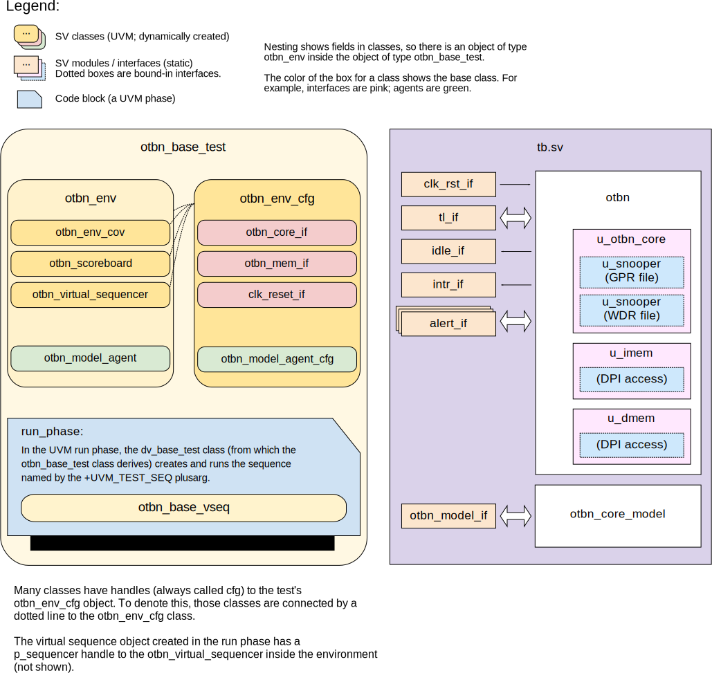
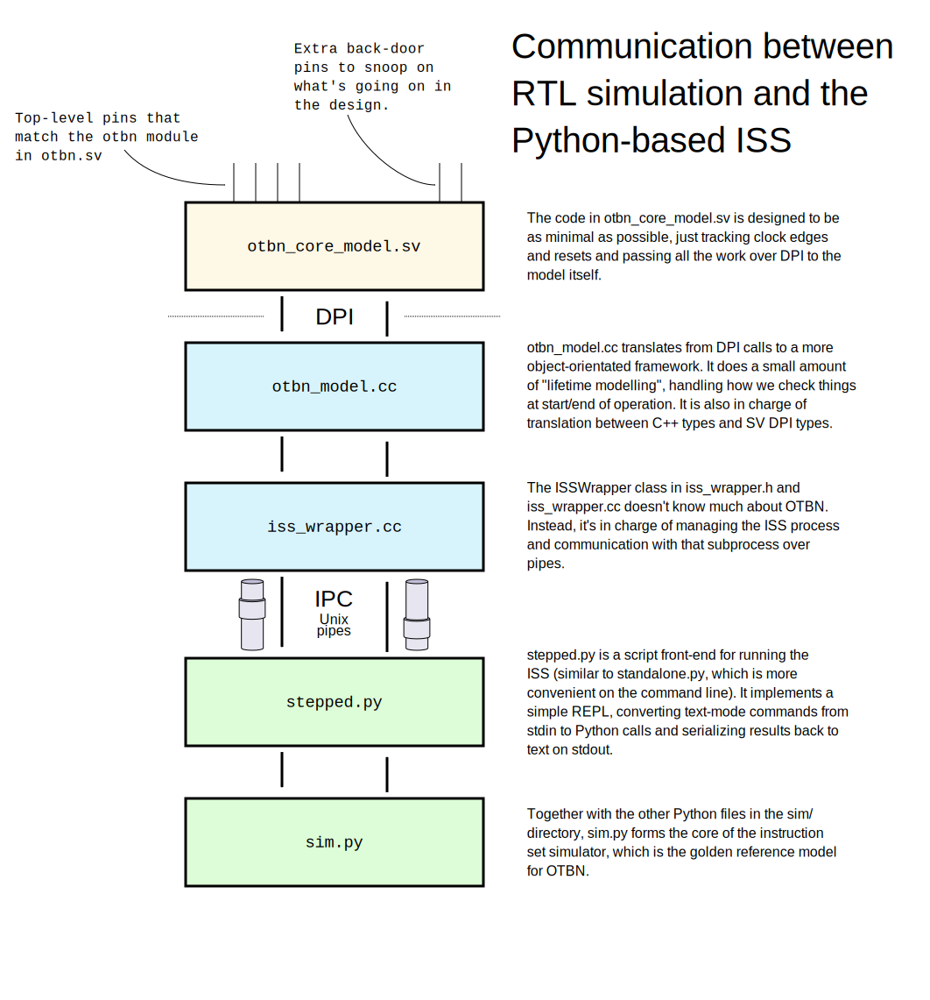

# OTBN DV document

## Goals
* **DV**
  * Verify the OTBN processor by running dynamic simulations with a SV/UVM based testbench
  * These simulations are grouped in tests listed in the [testplan](#testplan) below.
  * Close code and functional coverage on the IP and all of its sub-modules
* **FPV**
  * Verify TileLink device protocol compliance with an SVA based testbench

## Current status
* [Design & verification stage](../../../README.md)
  * [HW development stages](../../../../doc/project_governance/development_stages.md)
* [Simulation results](https://reports.opentitan.org/hw/ip/otbn/dv/uvm/latest/report.html)

## Design features

OTBN, the OpenTitan Big Number accelerator, is a cryptographic accelerator.
For detailed information on OTBN design features, see the [OTBN HWIP technical specification](../README.md).

## Testbench architecture

The OTBN testbench is based on the [CIP testbench architecture](../../../dv/sv/cip_lib/README.md).
It builds on the [dv_utils](../../../dv/sv/dv_utils/README.md) and [csr_utils](../../../dv/sv/csr_utils/README.md) packages.

### Block diagram

OTBN testing makes use of a DPI-based model called `otbn_core_model`.
This is shown in the block diagram.
The dotted interfaces in the `otbn` block are bound in by the model to access internal signals (register file and memory contents).



### Top level testbench

The top-level testbench is located at `hw/ip/otbn/dv/uvm/tb.sv`.
This instantiates the OTBN DUT module `hw/ip/otbn/rtl/otbn.sv`.

OTBN has the following interfaces:
- A [Clock and reset interface](../../../dv/sv/common_ifs/README.md#clk_rst_if)
- A [TileLink interface](../../../dv/sv/tl_agent/README.md).
  OTBN is a TL-UL device, which expects to communicate with a TL-UL host.
  In the OpenTitan SoC, this will be the Ibex core.
- Idle signals in each clock domain, `idle_o`, and `idle_otp_o`
- One interrupt
- An [alert interface](../../../dv/sv/alert_esc_agent/README.md)
- A life cycle escalation interface
- An [OTP](../../otp_ctrl/README.md) connection
- Two [EDN](../../edn/README.md) connections
- A RAM configuration interface, which is passed through to the SRAM macros

The idle and interrupt signals are modelled with the basic
[`pins_if`](../../../dv/sv/common_ifs/README.md#pins_if) interface.

As well as instantiating OTBN, the testbench also instantiates an `otbn_core_model`.
This module wraps an ISS (instruction set simulator) subprocess and performs checks to make sure that OTBN behaves the same as the ISS.
The `otbn_core_model` module communicates with test sequences through an `otbn_model_if` interface, which is monitored by the `otbn_model_agent`, described below.
The module communicates with the Python subprocess as shown in the diagram below.




### OTBN model agent

The model agent is instantiated by the testbench to monitor the OTBN model.
It is a passive agent (essentially just a monitor): the inputs to the model are set in `tb.sv`.
The monitor for the agent generates transactions when it sees a start signal or a done signal.

The start signal is important because we "cheat" and pull it out of the DUT.
To make sure that the processor is starting when we expect, we check start transactions against TL writes in the scoreboard.

### Reference models

The main reference model for OTBN is the instruction set simulator (ISS), which is run as a subprocess by DPI code inside `otbn_core_model`.
This Python-based simulator can be found at `hw/ip/otbn/dv/otbnsim`.

## Stimulus strategy

When testing OTBN, we are careful to distinguish between

- behaviour that can be triggered by particular instruction streams
- behaviour that is triggered by particular external stimuli (register writes; surprise resets etc.)

Testing lots of different instruction streams doesn't really use the UVM machinery, so we have a "pre-DV" phase of testing that generates constrained-random instruction streams (as ELF binaries) and runs a simple block-level simulation on each to check that the RTL matches the model.
The idea is that this is much quicker for designers to use to smoke-test proposed changes, and can be run with Verilator, so it doesn't require an EDA tool licence.
This pre-DV phase cannot drive sign-off, but it does use much of the same tooling.

Once we are running full DV tests, we re-use this work, by using the same collection of randomised instruction streams and randomly picking from them for most of the sequences.
At the moment, the full DV tests create binaries on the fly by running `hw/ip/otbn/dv/uvm/gen-binaries.py`.
This results in one or more ELF files in a directory, which the simulation then picks from at random.

The pre-DV testing doesn't address external stimuli like resets or TileLink-based register accesses.
These are driven by specialised test sequences, described below.

### Functional coverage

As a complicated IP block, OTBN has a lot of functional coverage points defined.
To avoid overwhelming this document, these are described in [OTBN functional coverage](./doc/fcov.md).

### Test sequences

The test sequences can be found in `hw/ip/otbn/dv/uvm/env/seq_lib`.
The basic test sequence (`otbn_base_vseq`) loads the instruction stream from a randomly chosen binary (see above), configures OTBN and then lets it run to completion.

More specialized sequences include things like multiple runs, register accesses during operation (which should fail) and memory corruption.
We also check things like the correct operation of the interrupt registers.

## Self-checking strategy
### Scoreboard

Much of the checking for these tests is actually performed in `otbn_core_model`, which ensures that the RTL and ISS have the same behaviour.
However, the scoreboard does have some checks, to ensure that interrupt and idle signals are high at the expected times.

### Assertions

Core TLUL protocol assertions are checked by binding the [TL-UL protocol checker](../../tlul/doc/TlulProtocolChecker.md) into the design.

Outputs are also checked for `'X` values by assertions in the design RTL.
The design RTL contains other assertions defined by the designers, which will be checked in simulation (and won't have been checked by the pre-DV Verilator simulations).

Finally, the `otbn_idle_checker` checks that the `idle_o` output correctly matches the running state that you'd expect, based on writes to the `CMD` register and responses that will appear in the `DONE` interrupt.

## Building and running tests

Tests can be run with [`dvsim.py`](../../../../util/dvsim/README.md).
The link gives details of the tool's features and command line arguments.
To run a basic smoke test, go to the top of the repository and run:
```console
$ util/dvsim/dvsim.py hw/ip/otbn/dv/uvm/otbn_sim_cfg.hjson -i otbn_smoke
```

## Testplan
[Testplan](../data/otbn_testplan.hjson)
