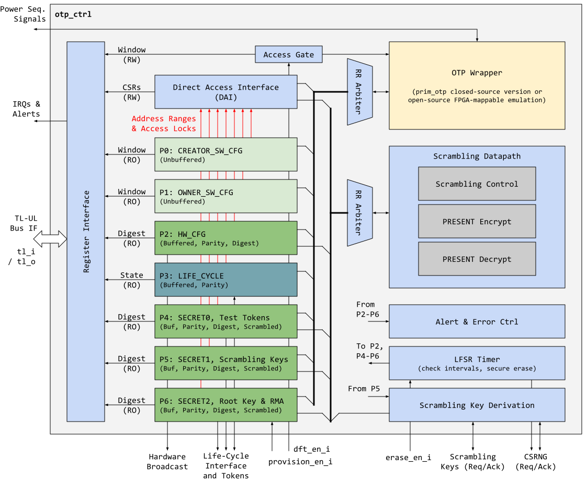
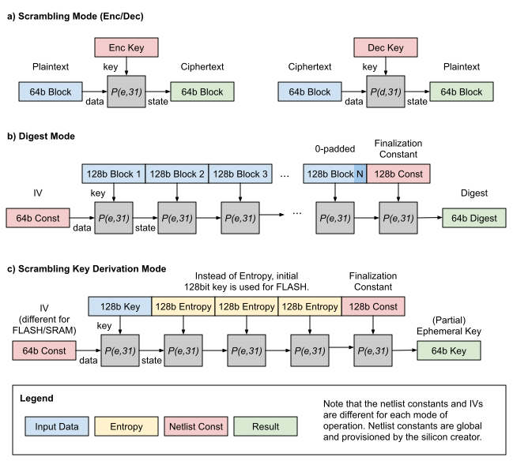
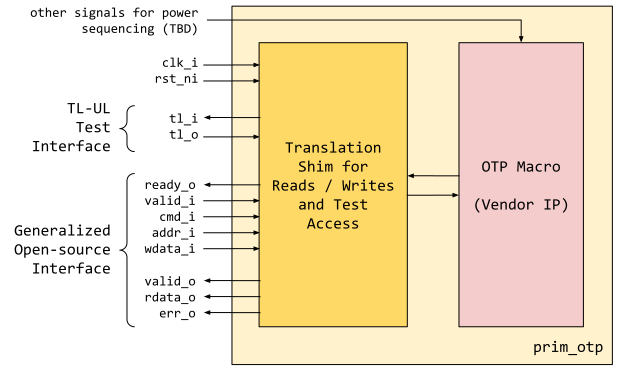

# Overview

This document specifies the functionality of the one time programmable (OTP) memory controller.
The OTP controller is a module that is a peripheral on the chip interconnect bus, and thus follows the [Comportability Specification]().

The OTP is a module that provides a device with one-time-programming functionality.
The result of this programming is non-volatile, and unlike flash, cannot be reversed.
The OTP functionality is constructed through an open-source OTP controller and a proprietary OTP IP.

The OTP controller provides:
- An open-source abstraction interface that software can use to interact with a proprietary OTP block underneath.
- An open-source abstraction interface that hardware components (for example life cycle controller and key manager (**TODO: add links here**)) can use to interact with a proprietary OTP block underneath.
- High level logical security protection, such as integrity checks and scrambling of sensitive content.
- Software isolation for when OTP contents are readable and programmable.

The proprietary OTP IP provides:
- Reliable, non-volatile storage.
- Technology-specific redundancy or error correction mechanisms.
- Physical defensive features such as SCA and FI resistance.
- Visual and electrical probing resistance.

Together, the OTP controller and IP provide secure one-time-programming functionality that is used throughout the life cycle of a device.

## Features

- Multiple logical partitions of the underlying OTP IP
	- Each partition is lockable and integrity checked
	- Integrity digests are stored alongside each logical bank
- Periodic / persistent checks of OTP values
	- Periodic checks of shadowed content vs digests
	- Periodic checks of OTP stored content and shadowed content
	- Persistent checks for immediate errors
- Separate life cycle partition and interface to life cycle controller
	- Supports life cycle functions, but cannot be integrity locked
- Lightweight scrambling of secret OTP partition using a global netlist constant
- Lightweight ephemeral key derivation function for RAM scrambling mechanisms
- Lightweight key derivation function for FLASH scrambling mechanism

## OTP Controller Overview

The functionality of OTP is split into an open-source and a closed-source part, with a clearly defined boundary in between, as illustrated in the simplified high-level block diagram below.

It is the task of the open-source controller to provide a common, non-technology specific interface to OTP users with a common register interface and a clearly defined I/O interface to hardware.
The open-source controller implements logical isolation and partitioning of OTP storage that enables users to separate different functions of the OTP into "partitions" with different properties.
Finally, the open-source controller provides a high level of security for specific partitions by provisioning integrity digests for each partition, and scrambling of partitions where required.

The proprietary IP on the other hand translates a common access interface to the technology-specific OTP interface, both for functional and debug accesses (for example register accesses to the macro-internal control structure).

This split implies that every proprietary OTP IP must implement a translation layer from a standardized OpenTitan interface to the module underneath.
It also implies that no matter how the OTP storage or word size may change underneath, the open-source controller must present a consistent and coherent software and hardware interface.
This standardized interface is defined further below, and the wrapper leverages the same [technology primitive mechanism]() that is employed in other parts of OpenTitan in order to wrap and abstract technology-specific macros (such as memories and clocking cells) that are potentially closed-source.

In order to enable simulation and FPGA emulation of the OTP controller even without access to the proprietary OTP IP, a generalized and synthesizable model of the OTP IP is provided in the form of a [generic technology primitive](https://github.com/lowRISC/opentitan/blob/master/hw/ip/prim_generic/rtl/prim_generic_otp.sv).

# Theory of Operations

Conceptually speaking, the OTP functionality is at a high level split into "front-end" and "back-end".
The "front-end" contains the logical partitions that feed the hardware and software consumer interfaces of the system.
The "back-end" represents the programming interface used by hardware and software components to stage the upcoming values.
The diagram below illustrates this behavioral model.

Note that the front-end contains both buffered and unbuffered partitions.
Buffered partitions are sensed once per power cycle and their contents are stored in registers, whereas unbuffered partitions are read on-demand.
The former are typically partitions that contain data like hardware configuration bits, key material and the life cycle state that need to be always available to the hardware, whereas the latter are large partitions that are accessed infrequently, such as the software configurations.
Values that are programmed into a buffered partition via the programming interface (coupled with read verification) are merely "staged", and do not take effect until the next power cycle.

The sections below describe the operation of various pieces of the OTP controller and how it supports the described functionality.

## Logical Partitions

The OTP is logically separated into partitions that represent different functions.
This means the isolation is virtual and maintained by the OTP controller instead of the underlying OTP IP.

Within each logical partition, there are specific enforceable properties

- Confidentiality via secret partitions
  - This controls whether a particular partition contains secret data.
  - If secret, a partition is not readable by software once locked, and is scrambled in storage.
- Read lockability
  - This controls whether a particular partition disables software readability for later stage software.
  - Some partitions can be locked statically (by computing and storing an associated digest in OTP), others can be read locked at runtime via CSRs.
- Write lockability
  - This controls whether a partition is locked and prevented from future updates.
  - A locked partition is stored alongside a digest to be used later for integrity verification.
- Integrity Verification
  - Once a partition is write-locked by calculating and writing a non-zero [digest]() to it, it can undergo periodic verification (time-scale configurable by software).
This verification takes two forms, partition integrity checks, and storage consistency checks.

Since the OTP is memory-like in nature (it only outputs a certain number of bits per address location), some of the logical partitions are buffered in registers for instantaneous and parallel access by hardware.
This is a critical point, since after power-up, these particular OTP contents are stored in flip flops and sourced to the system.
I.e., buffered partitions are **NOT** directly sourced from the OTP macro itself.
Thus the security of both volatile (OTP controller) and non-volatile (OTP IP) storage becomes important.

### Partition Listing and Description

The OTP controller for OpenTitan contains the seven logical partitions shown below.

Partititon     | Secret | Buffered | WR Lockable  | RD Lockable  | Description
---------------|--------|----------|--------------|--------------|----------------------------------------------------------------
CREATOR_SW_CFG | no     | no       | yes (digest) |   yes (CSR)  | Software configuration partition for device-specific calibration data (Clock, LDO, RNG, device identity).
OWNER_SW_CFG   | no     | no       | yes (digest) |   yes (CSR)  | Software configuration partition for data that changes software behavior, specifically in the ROM.   E.g., enabling defensive features in ROM or selecting failure modes if verification fails.
HW_CFG         | no     | yes      | yes (digest) |      no      | Hardware configuration bits used to hardwire specific hardware functionality.   E.g., raw entropy accessibility or flash scrambling bypass range.
LIFE_CYCLE     | no     | yes      |     no       |      no      | Life-cycle related bits (**TODO ADD link**). **Note**, this partition cannot be locked as the life-cycle state needs to be able to advance to RMA in-field.
SECRET0        | yes    | yes      | yes (digest) | yes (digest) | Test unlock tokens.
SECRET1        | yes    | yes      | yes (digest) | yes (digest) | SRAM and FLASH scrambling keys.
SECRET2        | yes    | yes      | yes (digest) | yes (digest) | RMA unlock token and creator root key.

Generally speaking, the production life cycle of a device is split into 5 stages "Manufacturing" -> "Calibration and Testing" -> "Provisioning" -> "Mission" -> "RMA".
OTP values are usually programmed during "Calibration and Testing", "Provisioning" and "RMA" stages, as explained below.
A detailed listing of all the items and the corresponding memory map can be found in the [Programmer's Guide]()) further below.

### Calibration and Test

During this stage, the device is tested for functionality and calibrated to ensure uniformity.
The calibration can focus on a number of things, but usually is centered around adjusting clock, voltage and timing sources to remove process variation.
These calibration values are programmed into the CREATOR_SW_CFG partition, as they are non-secret values meant to be read out by software and programmed into respective peripherals.

Early on during this stage, the various tokens are also programmed into the secret partitions and harvested by the silicon creator.

### Provisioning

During this stage, the device is provisioned with the final firmware and a "unique" seed or identity.
The secret partitions are populated with root secrets and keys that are critical to establishing the device identity.

As part of injecting the final firmware, the stock-keeping-unit-specific hardware and software configurations are also programmed.

### Life Cycle Partition

The life cycle partition is active throughout all stages and hence it is the **ONLY** partition that cannot be locked.
After the device finishes provisioning and goes into production, it must retain the ability to transition back to RMA in case of unexpected failures.

In order to support this transition, the life-cycle state and counters must always be update-able (**TODO: add link to life-cycle docs for more info**).

## Locking a Partition

Write access to a partition can be permanently locked when software determines it will no longer make any updates to that partition.
To lock, an integrity constant is calculated and programmed alongside the other data of that partition.
The size of that integrity constant depends on the partition size granule, and is either 32bit or 64bit (see also [Direct Access Memory Map]()).

Once the "integrity digest" is non-zero, no further updates are allowed.
If the partition is secret, software is in addition no longer able to read its contents (see [Secret Partition description]()).

Note however, in all partitions, the digest itself is **ALWAYS** readable.
This gives software an opportunity to confirm that the locking operation has proceeded correctly, and if not, scrap the part immediately.

Calculation of the integrity digest depends on whether the partition requires periodic background verification.

### Software Configuration Partitions

The software configuration partitions are used as non-volatile storage for flags, configuration and calibration data.
As such, the contents of this partition are usually consumed once as part of code execution, or moved to another storage compartment somewhere in the design.
For example, the clock calibration values and the LDO calibration values are programmed to the analog sensor top (AST) at startup.

As such, it is not necessary to check periodically at the OTP source.
Instead, software can simply check as part of secure boot and take other measures when these values are programmed into peripherals.

For this partition it is thus the responsibility of software to calculate the integrity digest and program it into the OTP.
It is also reasonable to shadow (parts of) this partition in main memory, and there is not an immediate impact from OTP contents to hardware.

### Hardware Configuration and Secret Partitions

The hardware and secret partitions directly affect downstream hardware.
The contents must go through periodic integrity checks and therefore the stored digest is calculated by hardware when software provides the intent to lock (as opposed to the software partitions where the digest has to be calculated by software).

### Life Cycle Partition

The life cycle partition cannot be locked and will therefore not contain a stored digest.

## Secret vs Non-Secret Partitions

Non-secret OTP partitions hold data that can be public; or data that has no impact on security.
For example, the current value of lock bits, life cycle state or clock calibration value.
These values are stored in OTP as plaintext.

Secret partitions contain data that are critical to security, for example flash scrambling keys, device root secret and unlock tokens.
These values are stored scrambled in OTP, and are descrambled upon read.
The currently employed cipher is PRESENT, as it lends itself well to iterative decomposition, and it is a proven lightweight block cipher (see also [PRESENT Scrambling Primitive]().
The usage of a block cipher however implies that the secret partitions can only be written in 64bit chunks.

Further, the contents of a particular secret partition are not readable by software once locked (other than the digest which must be always readable); while non-secret partitions are always readable unless read accessibility is explicitly removed by software.

Unfortunately, secret partitions must utilize a global netlist key for the scrambling operation, as there is no other non-volatile storage to store a unique key.

## Partition Checks

### Integrity

Once the appropriate partitions have been locked, the hardware integrity checker employs two integrity checks to verify the content of the volatile buffer registers:

1. All buffered partitions have additional byte parity protection that is concurrently monitored.
2. The digest of the partition is recomputed at semi-random intervals and compared to the digest stored alongside the partition.

The purpose of this check is NOT to check between the storage flops and the OTP, but whether the buffer register contents remain consistent with the calculated digest.
This verification is primarily concerned with whether the storage flops have experienced fault attacks.
This check applies to only the HW_CFG and SECRET* partitions.
If a failure is encountered, the OTP controller will send out an `otp_integrity_mismatch` alert and reset all of its hardware outputs to their defaults (**TBD do we need an LFSR clearing mechanism here for the secret partitions?**)

### Storage Consistency

This verification ensures the value stored in the buffer registers remain consistent with those in the OTP.
This process re-reads the OTP at semi-random intervals and confirms the value read is the same as the value stored.
Note, given there are integrity checks in parallel, it is not necessary for some partitions to check ALL read contents for consistency.
If there is an integrity digest, only the digest needs to be read; otherwise, all values must be read.

This check applies to LIFE_CYCLE, HW_CFG and SECRET* partitions.
If a failure is encountered, the OTP controller will send out an `otp_consistency_mismatch` alert and reset all of its hardware outputs to their defaults (**TBD do we need an LFSR clearing mechanism here for the secret partitions?**)

Note that checks applied to life cycle could cause a failure if life cycle is updated, because life cycle is the only partition that may contain live updates.
The controller hence detects this condition and makes sure that the buffer registers are kept up to date in order to prevent false positives.

### Secret Partition Integrity Checks

Since the secret partitions are stored scrambled, this also implies the integrity digest is calculated over the scrambled form.
In order to balance the amount of buffer registers needed, only the decrypted form of the secret partitions is held in buffer registers.
Hardware calculates the digest by re-scrambling the data before passing it through the digest.

## Power-up and Sense

The OTP controller partition storage must output a specified safe default (it is not always 0 like a blank OTP) upon reset release.
This default output must remain until the OTP controller completes all checks.

The OTP controller reads from the OTP IP.
If the reads pass OTP IP internal checks (for example ECC or redundancy), the partition storage is updated; however the output is still held at the default state via an output mux.
After all read is complete, the OTP controller performs integrity checks on the HW_CFG and SECRET* partitions.
If a partition fails the integrity checks at this point it would signal an initialization error in the status CSR and abort further initialization.

After all integrity checks are complete, the OTP controller releases the output gating and marks outputs as valid.
However, any partition marked with "error" continues to hold its output in the default state.

Once the above steps are complete, the partition storage in buffered registers is not updated again (except for updates to the life cycle partition through the life cycle interface).
I.e., values programmed to OTP via the programming interface will not be visible in buffered registers until after the next power cycle.

At this point, outputs of the partition storage are NOT expected to change unless a periodic check suddenly fails.
When this failure occurs, all outputs are reverted to their default state, and an alert is immediately triggered to the alert handler.
For timing purposes, OTP outputs can be treated as semi-static, as this error event should be rare and exceptional.

## Partition Defaults

Partition defaults are context specific.
For example, a hardware configuration item that locks down specific access should default to "no access".
This ensures that a glitch attack on the OTP cannot easily revert the design to an insecure state.

This hence suggests that when an OTP is all 0's and all 1's, it should, whenever possible, reflect an invalid or inert state in the encoding space of the affected item.
This also implies the reset state of consuming agents (for example key manager and life cycle), should default to invalid / inert state as well.

## Program and Read Ports

As shown previously, the OTP is split into a front and back end.
The back-end interface is primarily used to update OTP contents, and read back for debug and verification purposes.
Despite being a separate functional access port from the logical partitions, the program and read ports are subjected to the same access controls.

When a partition is write-locked, programming accesses are disallowed.
If the partition is secret, read accesses by the back-end interface are also disallowed (except for the digest which must always be readable).
Software can also disable any read accesses to the software configuration partitions via CSR settings to prevent later stage software from reading any content.

The exception to the above is the life cycle partition.
The life cycle controller interface also acts as a "back-end" interface that always has programming access to ensure life cycle state can be advanced.

Note, the program and read ports can conflict with ongoing background storage checks, and the OTP controller arbitrates between these two sides.
An in-progress operation will always be completed.
Afterwards, or when two requests arrive at the same time, the priority is life cycle > programming interface > on-demand read accesses via CSR windows > background checks.

## Programming the OTP

The OTP controller has two programming paths:

1. a functional programming path through software (the program port),
2. Life cycle programming path through hardware.

The functional interface is used to update all partitions except for life cycle.
As mentioned previously, any updates made during the current power cycle are **NOT** reflected in the buffered partitions until the next reboot.

The life cycle interface is used to update the life cycle state and transition counter only.
The commands are issued from the life cycle controller, and similarly, successful or failed indications are also sent back to the life cycle controller. (**TODO add link to the LC spec**).
Similar to the functional interface, the life cycle controller allows only one update per power cycle, and after a requested transition reverts to an inert state until reboot.

For more details on how the software programs the OTP, please refer to the [Programmer's Guide]()) further below.

## Hardware Interfaces

### Parameters

The following table lists the main parameters used throughout the OTP controller design.

Localparam     | Default (Max)         | Top Earlgrey | Description
---------------|-----------------------|--------------|---------------
**TODO add**   |                       |              |

### Signals



The table below lists other OTP controller signals.
**TODO: this will likely have to be adjusted as the implementation progresses**

Signal                   | Direction        | Type                        | Description
-------------------------|------------------|-----------------------------|---------------
`otp_csrng_o`            | `output`         | `otp_csrng_req_t`           | Entropy request to [CSRNG]().
`otp_csrng_i`            | `input`          | `otp_csrng_rsp_t`           | Entropy acknowledgement from [CSRNG]().
`pwr_otp_init_i`         | `input`          | `pwrmgr_pkg::pwr_otp_req_t` | Initialization request coming from power manager  **TODO: link to power manager docs**
`pwr_otp_init_o`         | `output`         | `pwrmgr_pkg::pwr_otp_rsp_t` | Initialization response going to power manager  **TODO: link to power manager docs**
`otp_pwr_state_o`        | `output`         | `otp_pwr_state_t`           | Current OTP state, used by power manager in order to determine whether a shutdown needs to be aborted due to an ongoing OTP operation. **TODO: need to discuss with OTP vendor whether this is needed**
`lc_otp_program_i`       | `input`          | `lc_otp_program_req_t`      | Life cycle state transition request. See also **TODO: link to life cycle docs**
`lc_otp_program_o`       | `output`         | `lc_otp_program_rsp_t`      | Life cycle state transition request. See also **TODO: link to life cycle docs**
`lc_provision_en_i`      | `input`          | `lifecycle_pkg::lc_tx_t`    | Provision enable qualifier coming from life cycle controller. This signal enables read / write access to the RMA_TOKEN and CREATOR_ROOT_KEY_SHARE0 and CREATOR_ROOT_KEY_SHARE1. **TODO: link to life cycle docs**
`lc_test_en_i`           | `input`          | `lifecycle_pkg::lc_tx_t`    | Test enable qualifier coming from from life cycle controller. This signals enables the TL-UL access port to the proprietary OTP IP. **TODO: link to life cycle docs**
`otp_lc_data_o`          | `output`         | `otp_lc_data_t`             | Life cycle state output holding the current life cycle state, the value of the transition counter and the tokens needed for life cycle transitions.
`otp_keymgr_key_o`       | `output`         | `keymgr_key_t`              | Key output to the key manager holding CREATOR_ROOT_KEY_SHARE0 and CREATOR_ROOT_KEY_SHARE1.
`otp_flash_key_i`        | `input`          | `flash_key_req_t`           | Key output to the key flash controller holding FLASH_DATA_KEY and FLASH_ADDR_KEY.
`otp_flash_key_o`        | `output`         | `flash_key_rsp_t`           | Key output holding static key for FLASH scrambling (derived using FLASH_DATA_KEY and FLASH_ADDR_KEY).
`otp_ram_main_key_i`     | `input`          | `ram_main_key_req_t`        | Key request from SRAM scrambling device.
`otp_ram_main_key_o`     | `output`         | `ram_main_key_rsp_t`        | Key output holding ephemeral key for SRAM scrambling (derived using SRAM_DATA_KEY).
`otp_ram_ret_aon_key_i`  | `input`          | `ram_ret_aon_key_req_t`     | Key request from SRAM scrambling device.
`otp_ram_ret_aon_key_o`  | `output`         | `ram_ret_aon_key_rsp_t`     | Key output holding ephemeral key for SRAM scrambling (derived using SRAM_DATA_KEY).
`otp_otbn_ram_key_i`     | `input`          | `otbn_ram_key_t`            | Key request from SRAM scrambling device.
`otp_otbn_ram_key_o`     | `output`         | `otbn_ram_key_t`            | Key output holding ephemeral key for SRAM scrambling (derived using SRAM_DATA_KEY).

The OTP controller contains various interfaces that connect to other comportable IPs within OpenTitan, and these are briefly explained further below.

#### CSRNG Interface

The entropy request interface that talks to CSRNG in order to fetch fresh entropy for ephemeral SRAM scrambling key derivation and the LFSR counters for background checks.
It is comprised of the `otp_csrng_o` and `otp_csrng_i` signals and follows a req / ack protocol.

#### Power Manager Interfaces

There are two separate interfaces that connect the OTP controller with the power manager.

First, there is an initialization request interface `pwr_otp_init_i` / `pwr_otp_init_o` that follows a req / ack protocol.
The power manager asserts `pwr_otp_init_i` in order to signal to the OTP controller that it can start initialization, and the OTP controller signals completion of the initialization sequence by pulsing `pwr_otp_init_o` high.

Second, the OTP controller always outputs its state to the power manager via `otp_pwr_state_o`, such that the power manager can determine whether a shutdown needs to be aborted due to an ongoing OTP operation.

#### Life Cycle Interface

**TODO: need expand this more**
The token counters are maintained in the OTP.
To ensure the security of token limits cannot be bypassed, each request for a conditional transition FIRST increments the token count, and THEN checks for the validity of the token.

#### Interface to Key Manager

The interface to the key manager is a simple struct that outputs the CREATOR_ROOT_KEY_SHARE0 and CREATOR_ROOT_KEY_SHARE1 keys via `otp_keymgr_key_o` if these secrets have been provisioned and locked (via CREATOR_KEY_LOCK).
Otherwise, this signal is tied to all-zeroes.

#### Interfaces to Flash

The interface to the flash scrambling device is similar to the key manager interface and outputs the FLASH_DATA_KEY and FLASH_ADDR_KEY via the `otp_flash_key_o` signal, if the secrets have been provisioned and locked (via FLASH_KEYS_LOCK).
Otherwise, this signal is tied to all-zeroes.

#### Interfaces to SRAM Scramblers

The interfaces to the FLASH and SRAM scrambling devices follow a req / ack protocol, where the scrambling device first requests a new ephemeral key by asserting the request channel (e.g. `otp_ram_main_key_i`).
The OTP controller then fetches entropy from CSRNG and derives an ephemeral key using the SRAM_DATA_KEY and the PRESENT scrambling data path as described further below.
Finally, the OTP controller returns a fresh ephemeral key via the `otp_ram_main_key_o` struct, which completest the req / ack handshake.

Note that this mechanism always works - even if the SRAM_DATA_KEY has not yet been provisioned and locked (via SRAM_KEY_LOCK).
If SRAM_DATA_KEY has not been locked, an all-zeros value is used to derive the ephemeral key.

## Design Details

### Block Diagram

The following is a high-level block diagram that illustrates everything that has been discussed.

Each partition has its [own controller FSM]() that interacts with the OTP wrapper and the [scrambling datapath]() to fulfill its tasks.
Access to the OTP wrapper and the scrambling datapath are both round-robin arbitrated, where the former arbitration occurs at the granularity of 16bit OTP memory accesses, and the latter occurs at the level of complete transactions (i.e., digest or encryption).
Each partition P0-P6 exposes the address ranges and access control information to the DAI in order to block accesses that go to locked address ranges.

The CSR node on the left side of this diagram connects to the DAI, the OTP partitions (P0-P6) and the OTP wrapper through a gated TL-UL interface.
All connections from the partitions to the CSR node are read-only, and typically only carry a subset of the information available.
E.g., the secret partitions only expose their digest value via the CSRs.

The key derivation block on the bottom right side interacts with the scrambling datapath, the CSRNG and the partition holding the scrambling root keys in order to derive static and ephemeral scrambling keys for FLASH and SRAM scrambling.

In addition to the blocks mentioned so far, the OTP controller also contains an LFSR timer that creates pseudo-randomly distributed partition check requests, and provides pseudo random data at high bandwidth in the event of a secure erase request due to chip-wide alert escalation.
For security reasons, the LFSR is periodically reseeded with entropy coming from CSRNG.

### Data Allocation and Packing
#### Software View

The effective word width of an OTP IP typically depends on a couple of factors, including the redundancy scheme employed.
For this the design at hand, it is assumed that this native OTP word-width is 16bit.
For software convenience, however, these details are abstracted and the open-source OTP controller exposes the OTP storage as a linear address space of 32bit words, which is aligned with the machine word size of the Ibex processor.
Since the OTP IP employs a redundancy mechanism similar to ECC, this implies however that write operations take place at a granularity of 32bit blocks for non-secret and 64bit blocks for secret partitions (due to the scrambling).
Hence, software is responsible to appropriately pack and program items, since each 32bit location can only be programmed once.

#### Life Cycle View

Since the life cycle partition is the only partition that needs live updates in-field, proper care must be taken to properly encode data in this partition such that incremental updates are possible.
The life cycle state is hence encoded such that incremental updates to the state are always carried out at the granularity of a 16bit word.
Further, the life cycle transition counter is encoded such that each stroke consumes a full 16bit word for the same reason.

See [**TODO: add link to lifecycle spec and state encoding**] for more details on the life cycle encoding.

### Partition Implementations

There are three different partition types that are reused throughout the implementation:

1. Unbuffered partition
2. Buffered partition
3. Life cycle partition

Each partition type has a different RTL implementation, but what they have in common is that each partition has its own controller and set of local buffer registers (if required).

#### Unbuffered Partition

**TODO: add FSM details**

#### Buffered Partition

**TODO: add FSM details**

#### Life-Cycle Partition

**TODO: add FSM details**

### Scrambling Datapath

The scrambling datapath is built around a single-round implementation of the [PRESENT lightweight cipher]() and contains some additional multiplexing circuitry to enable multiple modes of operation that are explained in more detail further below.

#### Scrambling Mode

As illustrated in subfigure a) in the diagram above, the standard 128bit-key PRESENT configuration with 31 rounds is used for scrambling operations.
The key used for scrambling is a global netlist constant chosen by the silicon creator, and all secret partitions are encrypted using the their own distinct netlist constant.
Note that the amount of data that is being scrambled is small (160byte = 20 x 64bit blocks) and the scrambled data remains constant.
Hence, no additional masking or diversification scheme is applied since only a very limited amount of information can be gathered by observing the scrambling operation via side-channels.

#### Digest Calculation Mode

The integrity digests used in the [partition checks]() are computed using a custom [Merkle-Damgard](https://en.wikipedia.org/wiki/Merkle%E2%80%93Damg%C3%A5rd_construction) construction as illustrated in subfigure b).
At the beginning of the digest calculation the 64bit state is initialized with an initialization vector (IV).
Then, the data to be digested is split into 128bit chunks, each of which is used as a 128bit key input for updating the 64bit state with 31 PRESENT encryption rounds.
Chunks that are not aligned with 128bit are padded with zero, and the finalization operation consists of another 31-round encryption pass with a finalization constant.
Note that both the IV as well as the finalization constant are global netlist constants chosen by the silicon creator.

#### Scrambling Key Derivation Mode

The key derivation modes for ephemeral SRAM and static FLASH scrambling keys leverages the digest mechanism as illustrated in subfigure c).
In particular, the keys for are derived by repeatedly reducing a semi-random 512bit block of data into a 64bit digest.

For ephemeral SRAM scrambling keys, the 512bit block is composed of the 128bit SRAM_DATA_KEY stored in OTP, as well as 384bit of fresh entropy fetched from the CSRNG.
Depending on the ephemeral key width (128bit for SRAM, or 512bit for OTBN), this process has to be repeated 2 or 8 times.
Note that each of these passes uses a separate, 64bit IV netlist constant chosen by the silicon creator.
The IV and finalization constants for this key derivation are different from the ones used for the digest mode.

For static FLASH scrambling keys, the 512bit block is composed of 4 replicas of the FLASH_DATA_KEY or FLASH_ADDR_KEY stored in OTP.
Since both the data and address scrambling keys for FLASH are 128bit in size, that makes for a total of four digest passes that are needed to produce these static keys.
Note that each of these passes uses a separate, 64bit IV netlist constant chosen by the silicon creator.

**TODO: need to align the scrambling key sizes in OTP for this to be correct**

### Primitive Wrapper and FPGA Emulation

The OTP IP is wrapped up in a primitive wrapper that exposes a TL-UL interface for testing purposes, and a generalized open-source interface for functional operation (described below).
Any OTP redundancy mechanism like per-word ECC is assumed to be handled inside the wrapper, which means that the word width exposed as part of the generalized interface is the effective word width.

Note that the register space exposed via the TL-UL interface is dependent on the underlying proprietary OTP IP and hence not further described in this document.

#### Generalized Open-source Interface

The generalized open-source interface uses a couple of parameters (defaults set for Earlgrey configuration).

Parameter      | Default | Top Earlgrey | Description
---------------|---------|--------------|---------------
`Width`        | 16      | 16           | Payload data width.
`Depth`        | 1024    | 1024         | Depth of OTP macro.
`CmdWidth`     | 2       | 2            | Width of the OTP command.
`ErrWidth`     | 4       | 4            | Width of error code output signal.

The generalized open-source interface is a simple command interface with a ready / valid handshake that makes it possible to introduce back pressure if the OTP macro is not able to accept a command due to an ongoing operation.

Signal                  | Direction        | Type                        | Description
------------------------|------------------|-----------------------------|---------------
`ready_o`               | `output`         | `logic`                     | Ready signal for the command handshake.
`valid_i`               | `input`          | `logic`                     | Valid signal for the command handshake.
`cmd_i`                 | `input`          | `logic [CmdWidth-1:0]`      | OTP command: `2'b00 = read`, `2'b01 = write`, `2'b11 = initialize`
`addr_i`                | `input`          | `logic [$clog2(Depth)-1:0]` | OTP word address.
`wdata_i`               | `input`          | `logic [Width-1:0]`         | Write data for write commands.
`valid_o`               | `output`         | `logic`                     | Valid signal for command response.
`rdata_o`               | `output`         | `logic [Width-1:0]`         | Read data from read commands.
`err_o`                 | `output`         | `logic [ErrWidth-1:0]`      | Error code.

Responses are returned in-order via an unidirectional response interface (i.e., without back pressure capability).
Downstream logic must be able to sink the response in any case. The response optionally carries read data, depending on whether the operation that took place was a read or not.
Also, an error signal returns a non-zero error code in case an error occurred while carrying out the OTP command.
The error codes are defined further below.

**TODO: fine tune these error codes once it is clear how the inner workings of the OTP wrapper look like.**

Error Code | Description
-----------|-------------
0x0        | Command completed successfully.
0x1        | Invalid command.
0x2        | Read or write attempted before initialization.
0x3        | Failure during OTP initialization.
0x4        | Correctable read error occurred.
0x5        | Uncorrectable read error occurred.
0x6        | Other read errors (TBD).
0x7        | Programming error occurred (TBD).
others     | Reserved.

The timing diagram below illustrates the timing of a command.
Note that both read and write commands return a response, and each command is independent of the previously issued commands.
The latency from accepting a command to returning a response depends on the underlying OTP IP and is typically larger than 10 cycles.
The returned values depend on the command type and whether an error occurred or not.


{
  signal: [
    { name: 'clk_i',    wave: 'p...........' },
    { name: 'ready_o',  wave: '0...10|.....' , node: '....a'},
    { name: 'valid_i',  wave: '0.1..0|.....' },
    { name: 'cmd_i',    wave: '0.3..0|.....' },
    { name: 'wdata_i',  wave: '0.4..0|.....' },
    { name: 'valid_o',  wave: '0.....|..10.' , node: '.........b'},
    { name: 'rdata_o',  wave: '0.....|..40.' },
    { name: 'err_o',    wave: '0.....|..50.' },
  ],
  edge: [
   'a~>b',
  ],
  head: {
    text: 'Timing of an OTP command.',
  },
  foot: {
    text: 'The command is accepted in cycle 4 and a response is returned in cycle 8.',
    tick: 0,
  }
}


#### Generic Simulation and FPGA Emulation Model

For open-source simulation and FPGA emulation, a synthesizable and generic OTP wrapper module is provided (`prim_generic_otp`).
This is automatically selected in the OpenTitan build flow via the technology primitive mechanism if no proprietary OTP IP is available for a specific technology.
The OTP storage in `prim_generic_otp` is emulated using a standard RAM primitive `prim_generic_ram_1p`.
While this storage element is volatile, the primitive is constructed such that the contents are not wiped upon a system-wide reset.
I.e., only a power-cycle wipes the RAM primitive, thereby enabling limited emulation of the OTP function and life cycle transitions also on an FPGA device.

# Programmer's Guide

During provisioning and manufacturing, SW interacts with the OTP controller mostly through the Direct Access Interface (DAI), which is described below.
Afterwards during production, SW is expected to perform only read accesses via the exposed CSRs and CSR windows, since all write access to the partitions has been locked down.

The following sections provide some general guidance, followed by an explanation of the DAI and a detailed OTP memory map.
Typical programming sequences are explained at the end of the Programmer's guide.

## General Guidance

### Initialization

The OTP controller initializes automatically upon power-up and is fully operational by the time the processor boots.
The only initialization steps that SW should perform are:

1. Check that the OTP controller has successfully initialized by making sure that  is IDLE and not in an ERROR state.
2. Program and lock down the frequency of periodic background checks in HW.

Step 2. can be achieved by adjusting the MSB indices for the pseudo-randomly drawn periods via  and .
It is recommended to leave this configuration at the default setting, but SW must under all circumstances write to the  register in order to lock write access to these CSRs.

Later on during the boot process, SW may also choose to block read access to the  or  partitions at runtime via  and .

### Reset Considerations

It is important to note that values in OTP **can be corrupted** if a reset occurs during a programming operation.
This should be of minor concern for SW, however, since all partitions except for the LIFE_CYCLE partition are being provisioned in secure and controlled environments, and not in the field.
The LIFE_CYCLE partition is the only partition that is modified in the field - but that partition is entirely owned by the life cycle controller and not by SW.

### Programming Already Programmed Regions

OTP words cannot be programmed twice, and doing so may damage the memory array.
Hence the OTP controller performs a blank check and returns an error if a write operation is issued to an already programmed location.

## Direct Access Interface

OTP has to be programmed via the Direct Access Interface, which is comprised of the following CSRs:

CSR Name                             | Description
-------------------------------------|------------------------------------
 | Low 32bit word to be written.
 | High 32bit word to be written.
 | Low 32bit word that has been read.
 | High 32bit word that has been read.
 | byte address for the access.
     | Command register to trigger a read or a write access.
  | Write protection register for DAI.

See further below for a detailed [Memory Map]() of the address space accessible via the DAI.

### Readout Sequence

A typical readout sequence looks as follows:

1. Unprotect the DAI by setting  to 0x1.
2. Write the byte address for the access to .
Note that the address is aligned with the granule, meaning that either 2 or 3 LSBs of the address are ignored, depending on whether the access granule is 32 or 64bit.
3. Trigger a read command by writing 0x1 to .
4. Poll the  until the state goes back to IDLE or ERROR.
Alternatively, the `otp_operation_done` interrupt can be enabled up to notify the processor once an access has completed.
5. If the operation has finished with ERROR status, additional handling is required (see [Section on Error handling]()).
6. If the region accessed has a 32bit access granule, the 32bit chunk of read data can be read from .
If the region accessed has a 64bit access granule, the 64bit chunk of read data can be read from the  and  registers.
7. Go back to 1. and repeat until all data has been read.
8. Enable write protection of the DAI by setting  to 0x0.

### Programming Sequence

A typical programming sequence looks as follows:

1. Unprotect the DAI by setting  to 0x1.
2. If the region to be accessed has a 32bit access granule, place a 32bit chunk of data into .
If the region to be accessed has a 64bit access granule, both the  and  registers have to be used.
3. Write the byte address for the access to .
Note that the address is aligned with the granule, meaning that either 2 or 3 LSBs of the address are ignored, depending on whether the access granule is 32 or 64bit.
4. Trigger a write command by writing 0x2 to .
5. Poll the  until the state goes back to IDLE or ERROR.
Alternatively, the `otp_operation_done` interrupt can be enabled up to notify the processor once an access has completed.
6. If the operation has finished with ERROR status, additional handling is required (see [Section on Error handling]()).
7. Go back to 1. and repeat until all data has been written.
8. Enable write protection of the DAI by setting  to 0x0.

### Digest Calculation Sequence

The hardware digest computation for the hardware and secret partitions can be triggered as follows:

1. Unprotect the DAI by setting  to 0x1.
3. Write the correct partition index to .
4. Trigger a digest calculation command by writing 0x3 to .
5. Poll the  until the state goes back to IDLE or ERROR.
Alternatively, the `otp_operation_done` interrupt can be enabled up to notify the processor once an access has completed.
6. If the operation has finished with ERROR status, additional handling is required (see [Section on Error handling]()).
7. Enable write protection of the DAI by setting  to 0x0.

## Error Handling

**TODO: need to define error codes**
Associated interrupt is `otp_error`.

## Direct Access Memory Map

The table below provides a detailed overview of the items stored in the OTP partitions.
Some of the items that are buffered in registers is readable via memory mapped CSRs, and these CSRs are linked in the table below.
Items that are not linked can only be accessed via the direct programming interface (if the partition is not locked via the corresponding digest).
It should be noted that  and  represent memory mapped windows, and content of these partitions is not buffered.
Hence, a read access to those windows will take in the order of 10-20 cycles until the read returns.

Sizes below are specified in multiples of 32bit words.

**TODO: consider reading addresses and sizes automatically from an hjson description**

| Index | Partition                       | Size [B]    | Access Granule | Item                                     | Byte Address | Size [B]
|-------|---------------------------------|-------------|----------------|------------------------------------------|--------------|------------
| 0     |  | 768         | 32bit          |           | 0x0          | 760
|       |                                 |             |                |  | 0x2F8        | 8
| 1     |    | 768         | 32bit          |             | 0x300        | 760
|       |                                 |             |                |    | 0x5F8        | 8
| 2     | HW_CFG                          | 176         | 32bit          | **TODO: TBD**                            | 0x600        | 168
|       |                                 |             |                |          | 0x6A8        | 8
| 3     | LIFE_CYCLE                      | 88          | 32bit          |               | 0x6BC        | 24
|       |                                 |             |                |           | 0x6C8        | 64
| 4     | SECRET0                         | 40          | 64bit          | TEST_UNLOCK_TOKEN                        | 0x708        | 16
|       |                                 |             |                | TEST_EXIT_TOKEN                          | 0x718        | 16
|       |                                 |             |                |         | 0x728        | 8
| 5     | SECRET1                         | 88          | 64bit          | FLASH_ADDR_KEY                           | 0x730        | 32
|       |                                 |             |                | FLASH_DATA_KEY                           | 0x750        | 32
|       |                                 |             |                | SRAM_DATA_KEY                            | 0x770        | 16
|       |                                 |             |                |         | 0x780        | 8
| 6     | SECRET2                         | 120         | 64bit          | RMA_TOKEN                                | 0x788        | 16
|       |                                 |             |                | CREATOR_ROOT_KEY_SHARE0                  | 0x798        | 32
|       |                                 |             |                | CREATOR_ROOT_KEY_SHARE1                  | 0x7B8        | 32
|       |                                 |             |                |         | 0x7F8        | 8

Note that since the content in the SECRET* partitions are scrambled using a 64bit PRESENT cipher, read and write access through the DAI needs to occur at a 64bit granularity.

The table below lists digests locations, and the corresponding locked partitions.

| Digest Name                              | Affected Partition               | Calculated by HW
|------------------------------------------|----------------------------------|-------------
|  |   | no
|    |     | no
|          | HW_CFG                           | yes
|         | SECRET0                          | yes
|         | SECRET1                          | yes
|         | SECRET2                          | yes

Write access to the affected partition will be locked if the digest has a nonzero value.

For the software partition digests, it is entirely up to software to decide on the digest to be used.
Hardware will determine the lock condition only based on whether a non-zero value is present at that location or not.

For the hardware partitions, hardware calculates this digest and uses it for [background verification]().
Digest calculation can be triggered via the DAI.

Finally, it should be noted that the RMA_TOKEN and CREATOR_ROOT_KEY_SHARE0 / CREATOR_ROOT_KEY_SHARE1 items can only be programmed when the device is in the DEV, PROD, PROD_END and RMA stages.
Please consult the (**TODO: add link to LC docs**) documentation for more information.

## Examples

### Provisioning Items

The following represents a typical provisioning sequence for items in all partitions (except for the LIFE_CYCLE partition, which is not software-programmable):

1. [Program]() the item in 32bit or 64bit chunks via the DAI.
2. [Read back]() and verify the item via the DAI.
3. If the item is exposed via CSRs or a CSR window, perform a full-system reset and verify whether those fields are correctly populated.

Note that any unrecoverable errors during the programming steps, or mismatches during the readback and verification steps indicate that the device might be malfunctioning (possibly due to fabrication defects) and hence the device may have to be scrapped.
This is however rare and should not happen after fabrication testing.

### Locking Partitions

Once a partition has been fully populated, write access to that partition has to be permanently locked.
For the HW_CFG and SECRET* partitions, this can be achieved as follows:

1. [Trigger]() a digest calculation via the DAI.
2. [Read back]() and verify the digest location via the DAI.
3. Perform a full-system reset and verify that the corresponding CSRs exposing the 64bit digest have been populated (, ,  or ).

For the  and  partitions, the process is similar, but computation and programming of the digest is entirely up to software:

1. Compute a 64bit digest over the relevant parts of the partition, and [program]() that value to  or  via the DAI.
2. [Read back]() and verify the digest location via the DAI.
3. Perform a full-system reset and verify that the corresponding digest CSRs  or  have been populated with the correct 64bit value.

Note that any unrecoverable errors during the programming steps, or mismatches during the read-back and verification steps indicate that the device might be malfunctioning (possibly due to fabrication defects) and hence the device may have to be scrapped.
This is however rare and should not happen after fabrication testing.

## Register Table



# Additional Notes

## OTP IP Assumptions

It is assumed the OTP IP employed in production has reasonable physical defense characteristics.
Specifically which defensive features will likely be use case dependent, but at a minimum they should have the properties below.
Note some properties are worded with "SHALL" and others with "SHOULD".
"SHALL" refers to features that must be present, while "SHOULD" refers to features that are ideal, but optional.

- The contents shall not be observable via optical microscopy (for example anti-fuse technology).
- The IP shall support a read life time of > XX million read cycles (**TODO check with Vendor/Nuvoton**).
- If the IP contains field programmability (internal charge pumps and LDOs), there shall be mechanisms in place to selectively disable this function based on device context.
- If the IP contains redundant columns, rows, pages or banks for yield improvement, it shall provide a mechanism to lock down arbitrary manipulation of page / bank swapping during run-time.
- The IP shall be clear on what bits must be manipulated by the user, what bits are automatically manipulated by hardware (for example ECC or redundancy) and what areas the user can influence.
- The IP shall be compatible, through the use of a proprietary wrapper or shim, with an open-source friendly IO interface.
- The IP should functionally support the programming of already programmed bits without information leakage.
- The IP should offer SCA resistance:
  - For example, the content may be stored differentially.
  - For example, the sensing exhibits similar power signatures no matter if the stored bit is 0 or 1.
- The IP interface shall be memory-like if beyond a certain size.
- When a particular location is read, a fixed width output is returned; similar when a particular location is programmed, a fixed width input is supplied.
- The IP does not output all stored bits in parallel.
- The contents should be electrically hidden. For example, it should be difficult for an attacker to energize the fuse array and observe how the charge leaks.
- The IP should route critical nets at lower metal levels to avoid probing.
- The IP should contain native detectors for fault injection attacks.
- The IP should contain mechanisms to guard against interrupted programming - either through malicious intent or unexpected power loss and glitched address lines.
- The IP should contain mechanisms for error corrections (single bit errors).
- For example ECC or redundant bits voting / or-ing.
- As error correction mechanisms are technology dependent, that information should not be exposed to the open-source controller, instead the controller should simply receive information on whether a read / program was successful.
- The IP should have self-test functionality to assess the health of the storage and analog structures.
- The IP may contain native PUF-like functionality.

