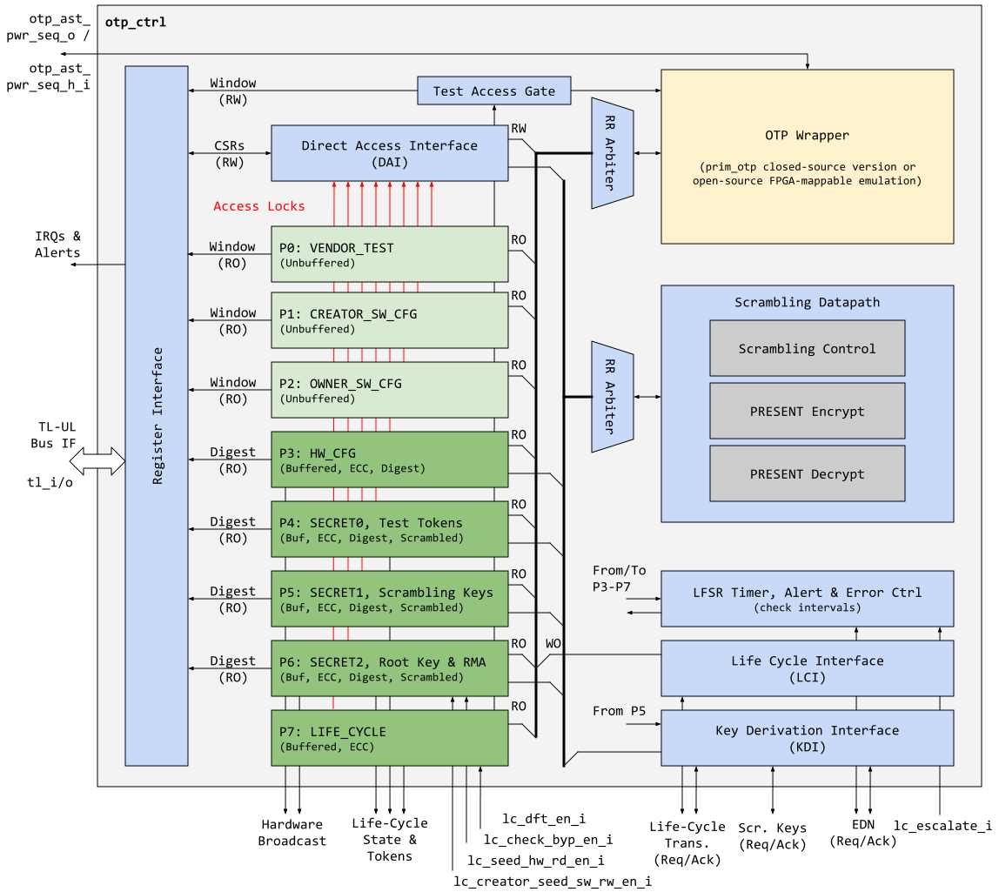
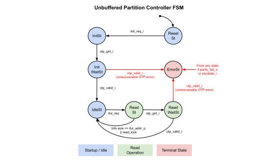
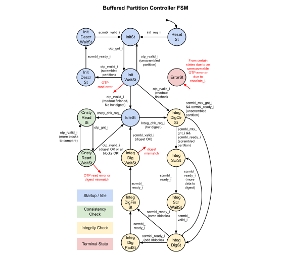
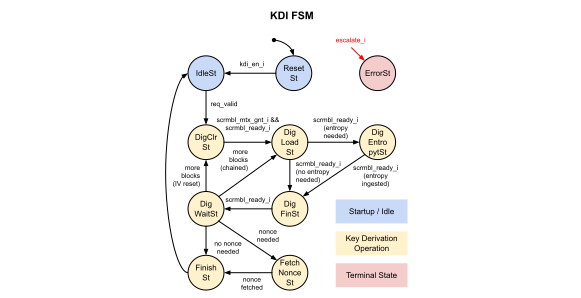
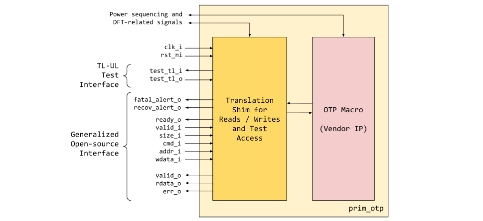

# Theory of Operation

Conceptually speaking, the OTP functionality is at a high level split into "front-end" and "back-end".
The "front-end" contains the logical partitions that feed the hardware and software consumer interfaces of the system.
The "back-end" represents the programming interface used by hardware and software components to stage the upcoming values.
The diagram below illustrates this behavioral model.


Note that the front-end contains both buffered and unbuffered partitions.
Buffered partitions are sensed once per power cycle and their contents are stored in registers, whereas unbuffered partitions are read on-demand.
The former are typically partitions that contain data like hardware configuration bits, key material and the life cycle state that need to be always available to the hardware, whereas the latter are large partitions that are accessed infrequently, such as the software configurations.
Values that are programmed into a buffered partition via the programming interface (coupled with read verification) are merely "staged", and do not take effect until the next power cycle.

The sections below describe the operation of various pieces of the OTP controller and how it supports the described functionality.

## Logical Partitions

The OTP is logically separated into partitions that represent different functions.
This means the isolation is virtual and maintained by the OTP controller instead of the underlying OTP IP.

Within each logical partition, there are specific enforceable properties

- Confidentiality via secret partitions
  - This controls whether a particular partition contains secret data.
  - If secret, a partition is not readable by software once locked, and is scrambled in storage.
- Read lockability
  - This controls whether a particular partition disables software readability for later stage software.
  - Some partitions can be locked statically (by computing and storing an associated digest in OTP), others can be read locked at runtime via CSRs.
- Write lockability
  - This controls whether a partition is locked and prevented from future updates.
  - A locked partition is stored alongside a digest to be used later for integrity verification.
- Integrity Verification
  - Once a partition is write-locked by calculating and writing a non-zero [digest](#locking-a-partition) to it, it can undergo periodic verification (time-scale configurable by software).
This verification takes two forms, partition integrity checks, and storage consistency checks.

Since the OTP is memory-like in nature (it only outputs a certain number of bits per address location), some of the logical partitions are buffered in registers for instantaneous and parallel access by hardware.
This is a critical point, since after power-up, these particular OTP contents are stored in flip flops and sourced to the system.
I.e., buffered partitions are **NOT** directly sourced from the OTP macro itself.
Thus the security of both volatile (OTP controller) and non-volatile (OTP IP) storage becomes important.

### Partition Listing and Description

The OTP controller for OpenTitan contains the seven logical partitions shown below.

{{#include otp_ctrl_partitions.md}}

Generally speaking, the production life cycle of a device is split into 5 stages "Manufacturing" -> "Calibration and Testing" -> "Provisioning" -> "Mission" -> "RMA".
OTP values are usually programmed during "Calibration and Testing", "Provisioning" and "RMA" stages, as explained below.
A detailed listing of all the items and the corresponding memory map can be found in the [Programmer's Guide](programmers_guide.md)) further below.

### Calibration and Test

During this stage, the device is tested for functionality and calibrated to ensure uniformity.
The calibration can focus on a number of things, but usually is centered around adjusting clock, voltage and timing sources to remove process variation.
These calibration values are programmed into the CREATOR_SW_CFG partition, as they are non-secret values meant to be read out by software and programmed into respective peripherals.

Early on during this stage, the various tokens are also programmed into the secret partitions and harvested by the silicon creator.

### Provisioning

During this stage, the device is provisioned with the final firmware and a "unique" seed or identity.
The secret partitions are populated with root secrets and keys that are critical to establishing the device identity.

As part of injecting the final firmware, the stock-keeping-unit-specific hardware and software configurations are also programmed.

### Life Cycle Partition

The life cycle partition is active throughout all stages and hence it is the **ONLY** partition that cannot be locked.
After the device finishes provisioning and goes into production, it must retain the ability to transition back to RMA in case of unexpected failures.

In order to support this transition, the [life cycle state](../../lc_ctrl/README.md) and counters must always be update-able.

## Locking a Partition

Write access to a partition can be permanently locked when software determines it will no longer make any updates to that partition.
To lock, an integrity constant is calculated and programmed alongside the other data of that partition.
The size of that integrity constant depends on the partition size granule, and is either 32bit or 64bit (see also [Direct Access Memory Map](#direct-access-memory-map)).

Once the "integrity digest" is non-zero, no further updates are allowed.
If the partition is secret, software is in addition no longer able to read its contents (see [Secret Partition description](#secret-vs-nonsecret-partitions)).

Note however, in all partitions, the digest itself is **ALWAYS** readable.
This gives software an opportunity to confirm that the locking operation has proceeded correctly, and if not, scrap the part immediately.

Calculation of the integrity digest depends on whether the partition requires periodic background verification.

### Vendor Test Partition

The vendor test partition is intended to be used for OTP programming smoke checks during the manufacturing flow.
The silicon creator may implement these checks inside the proprietary version of the `prim_otp` wrapper.
This partition behaves like any other SW partition, with the exception that ECC uncorrectable errors will not lead to fatal errors / alerts as they do in all other partitions.
This is due to the nature of the OTP programming smoke checks, which may leave certain OTP words in a state inconsistent with the ECC polynomial employed upon OTP readout.

### Software Configuration Partitions

The software configuration partitions are used as non-volatile storage for flags, configuration and calibration data.
As such, the contents of this partition are usually consumed once as part of code execution, or moved to another storage compartment somewhere in the design.
For example, the clock calibration values and the LDO calibration values are programmed to the analog sensor top (AST) at startup.

As such, it is not necessary to check periodically at the OTP source.
Instead, software can simply check as part of secure boot and take other measures when these values are programmed into peripherals.

For this partition it is thus the responsibility of software to calculate the integrity digest and program it into the OTP.
It is also reasonable to shadow (parts of) this partition in main memory, and there is not an immediate impact from OTP contents to hardware.

### Hardware Configuration and Secret Partitions

The hardware and secret partitions directly affect downstream hardware.
The contents must go through periodic integrity checks and therefore the stored digest is calculated by hardware when software provides the intent to lock (as opposed to the software partitions where the digest has to be calculated by software).

### Life Cycle Partition

The life cycle partition cannot be locked and will therefore not contain a stored digest.
Note however that only the life cycle controller has access to this partition, i.e., the Direct Access Interface (DAI) cannot read nor write from/to the life cycle partition.

## Secret vs Non-Secret Partitions

Non-secret OTP partitions hold data that can be public; or data that has no impact on security.
For example, the current value of lock bits or clock calibration values.
These values are stored in OTP as plaintext.

Secret partitions contain data that are critical to security, for example FLASH scrambling keys, device root secret and unlock tokens.
These values are stored scrambled in OTP, and are descrambled upon read.
The currently employed cipher is PRESENT, as it lends itself well to iterative decomposition, and it is a proven lightweight block cipher (see also [PRESENT Scrambling Primitive](../../prim/doc/prim_present.md).
The usage of a block cipher however implies that the secret partitions can only be written in 64bit chunks.

Further, the contents of a particular secret partition are not readable by software once locked (other than the digest which must be always readable); while non-secret partitions are always readable unless read accessibility is explicitly removed by software.

Unfortunately, secret partitions must utilize a global netlist key for the scrambling operation, as there is no other non-volatile storage to store a unique key.


## Partition Checks

### Integrity

Once the appropriate partitions have been locked, the hardware integrity checker employs two integrity checks to verify the content of the volatile buffer registers:

1. All buffered partitions have additional ECC protection (8bit ECC for each 64bit block) that is concurrently monitored.
2. The digest of the partition is recomputed at semi-random intervals and compared to the digest stored alongside the partition.

The purpose of this check is NOT to check between the storage flops and the OTP, but whether the buffer register contents remain consistent with the calculated digest.
This verification is primarily concerned with whether the storage flops have experienced fault attacks.
This check applies to only the HW_CFG and SECRET* partitions.
If a failure is encountered, the OTP controller will send out a `fatal_check_error` alert and reset all of its hardware outputs to their defaults.

### Storage Consistency

This verification ensures the value stored in the buffer registers remain consistent with those in the OTP.
This process re-reads the OTP at semi-random intervals and confirms the value read is the same as the value stored.
Note, given there are integrity checks in parallel, it is not necessary for some partitions to check ALL read contents for consistency.
If there is an integrity digest, only the digest needs to be read; otherwise, all values must be read.


This check applies to LIFE_CYCLE, HW_CFG and SECRET* partitions.
If a failure is encountered, the OTP controller will send out a `fatal_check_error` alert and reset all of its hardware outputs to their defaults.

Note that checks applied to life cycle could cause a failure if life cycle is updated, because life cycle is the only partition that may contain live updates.
The controller hence detects this condition based on the `lc_check_byp_en_i` signal coming from the life cycle controller, and pauses background checks on this partition in order to prevent false positives.

### Secret Partition Integrity Checks

Since the secret partitions are stored scrambled, this also implies the integrity digest is calculated over the scrambled form.
In order to balance the amount of buffer registers needed, only the decrypted form of the secret partitions is held in buffer registers.
Hardware calculates the digest by re-scrambling the data before passing it through the digest.


## Power-up and Sense

The OTP controller partition storage must output a specified safe default (it is not always 0 like a blank OTP) upon reset release.
This default output must remain until the OTP controller completes all checks.

The OTP controller reads from the OTP IP.
If the reads pass OTP IP internal checks (for example ECC or redundancy), the partition storage is updated; however the output is still held at the default state via an output mux.
After all read is complete, the OTP controller performs integrity checks on the HW_CFG and SECRET* partitions.
If a partition fails the integrity checks at this point it would signal an initialization error in the status CSR and abort further initialization.

After all integrity checks are complete, the OTP controller releases the output gating and marks outputs as valid.
However, any partition marked with "error" continues to hold its output in the default state.

Once the above steps are complete, the partition storage in buffered registers is not updated again (except for updates to the life cycle partition through the life cycle interface).
I.e., values programmed to OTP via the programming interface will not be visible in buffered registers until after the next power cycle.

At this point, outputs of the partition storage are NOT expected to change unless a periodic check suddenly fails.
When this failure occurs, all outputs are reverted to their default state, and an alert is immediately triggered to the alert handler.
For timing purposes, OTP outputs can be treated as semi-static, as this error event should be rare and exceptional.


## Partition Defaults

Partition defaults are context specific.
For example, a hardware configuration item that locks down specific access should default to "no access".
This ensures that a glitch attack on the OTP cannot easily revert the design to an insecure state.

This hence suggests that when an OTP is all 0's and all 1's, it should, whenever possible, reflect an invalid or inert state in the encoding space of the affected item.
This also implies the reset state of consuming agents (for example key manager and life cycle), should default to invalid / inert state as well.


## Program and Read Ports

As shown previously, the OTP is split into a front and back end.
The back-end interface is primarily used to update OTP contents, and read back for debug and verification purposes.
Despite being a separate functional access port from the logical partitions, the program and read ports are subjected to the same access controls.

When a partition is write-locked, programming accesses are disallowed.
If the partition is secret, read accesses by the back-end interface are also disallowed (except for the digest which must always be readable).
Software can also disable any read accesses to the software configuration partitions via CSR settings to prevent later stage software from reading any content.

The exception to the above is the life cycle partition.
The life cycle controller interface also acts as a "back-end" interface that always has programming access to ensure life cycle state can be advanced.

Note, the program and read ports can conflict with ongoing background storage checks, and the OTP controller arbitrates between these two sides.
An in-progress operation will always be completed.
Afterwards, or when two requests arrive at the same time, the priority is life cycle > programming interface > on-demand read accesses via CSR windows > background checks.


## Programming the OTP

The OTP controller has two programming paths:

1. a functional programming path through software (the program port),
2. Life cycle programming path through hardware.

The functional interface is used to update all partitions except for life cycle.
As mentioned previously, any updates made during the current power cycle are **NOT** reflected in the buffered partitions until the next reboot.

The life cycle interface is used to update the life cycle state and transition counter only.
The commands are issued from the [life cycle controller](../../lc_ctrl/README.md), and similarly, successful or failed indications are also sent back to the life cycle controller.
Similar to the functional interface, the life cycle controller allows only one update per power cycle, and after a requested transition reverts to an inert state until reboot.

For more details on how the software programs the OTP, please refer to the [Programmer's Guide](programmers_guide.md)) further below.


## Design Details

### Block Diagram

The following is a high-level block diagram that illustrates everything that has been discussed.



Each of the partitions P0-P7 has its [own controller FSM](#partition-implementations) that interacts with the OTP wrapper and the [scrambling datapath](#scrambling-datapath) to fulfill its tasks.
The partitions expose the address ranges and access control information to the Direct Access Interface (DAI) in order to block accesses that go to locked address ranges.
Further, the only two blocks that have (conditional) write access to the OTP are the DAI and the Life Cycle Interface (LCI) blocks.
The partitions can only issue read transactions to the OTP macro.
Note that the access ranges of the DAI and the LCI are mutually exclusive.
I.e., the DAI cannot read from nor write to the life cycle partition.
The LCI cannot read the OTP, but is allowed to write to the life cycle partition.

The CSR node on the left side of this diagram connects to the DAI, the OTP partitions (P0-P7) and the OTP wrapper through a gated TL-UL interface.
All connections from the partitions to the CSR node are read-only, and typically only carry a subset of the information available.
E.g., the secret partitions only expose their digest value via the CSRs.

The Key Derivation Interface (KDI) on the bottom right side interacts with the scrambling datapath, the EDN and the partition holding the scrambling root keys in order to derive static and ephemeral scrambling keys for FLASH and SRAM scrambling.

The test access gate shown at the top of the block diagram is governed by the life cycle qualification signal `dft_en_i`, which is only enabled during the TEST_UNLOCKED* life cycle states.
Otherwise, test access via this TL-UL window is locked down.

In addition to the blocks mentioned so far, the OTP controller also contains an LFSR timer that creates pseudo-randomly distributed partition check requests, and provides pseudo random data at high bandwidth in the event of a secure erase request due to chip-wide alert escalation.
For security reasons, the LFSR is periodically reseeded with entropy coming from EDN.

### Data Allocation and Packing
#### Software View

The effective word width of an OTP IP typically depends on a couple of factors, including the redundancy scheme employed.
For this the design at hand, it is assumed that this native OTP word-width is 16bit.
For software convenience, however, these details are abstracted and the open-source OTP controller exposes the OTP storage as a linear address space of 32bit words, which is aligned with the machine word size of the Ibex processor.
Since the OTP IP employs a redundancy mechanism similar to ECC, this implies however that write operations take place at a granularity of 32bit blocks for non-secret and 64bit blocks for secret partitions (due to the scrambling).
Hence, software is responsible to appropriately pack and program items, since each 32bit location can only be programmed once.

#### Life Cycle View

Since the life cycle partition is the only partition that needs live updates in-field, proper care must be taken to properly encode data in this partition such that incremental updates are possible.
The life cycle state is hence encoded such that incremental updates to the state are always carried out at the granularity of a 16bit word.
Further, the life cycle transition counter is encoded such that each stroke consumes a full 16bit word for the same reason.

See [life cycle controller documentation](../../lc_ctrl/README.md) for more details on the life cycle encoding.

### Partition Controllers

In RTL, we distinguish between buffered and unbuffered partition modules.
These are parameterized, such that we can assemble the array of OTP partitions with these two modules only.
The corresponding controller FSMs are explained in more detail below.

#### Unbuffered Partition



As shown above, the unbuffered partition module has a relatively simple controller FSM that only reads out the digest value of the partition upon initialization, and then basically waits for TL-UL read transactions to its corresponding window in the CSR space.

Write access through the DAI will be locked in case the digest is set to a non-zero value.
Also, read access through the DAI and the CSR window can be locked at runtime via a CSR.
Read transactions through the CSR window will error out if they are out of bounds, or if read access is locked.

Note that unrecoverable [OTP errors](#generalized-open-source-interface), ECC failures in the digest register or external escalation via `lc_escalate_en` will move the partition controller into a terminal error state.

#### Buffered Partition



The controller FSM of the buffered partition module is more complex than the unbuffered counterpart, since it has to account for scrambling and digest calculation.

Upon initialization, the controller reads out the whole partition and descrambles it on the fly if needed.

Then, right after the initial readout, the partition controller jumps into the first integrity check, which behaves somewhat differently, depending on whether the partition is digest protected (or not) and/or scrambled (or not).
If the partition is not digest protected, or if the digest has not yet been computed, the check completes right away, and the buffered values are released for hardware broadcast.
Otherwise, the partition contents in the buffer registers are re-scrambled if needed, and a digest is computed on the fly.
If the computed digest matches with the one that has been read out before, the buffered registers are released for hardware broadcast.
Otherwise, the buffered values are gated to their default, and an alert is triggered through the error handling logic.

After initialization, the integrity check (as described above) and the consistency check can be triggered by the LFSR timer mechanism on a periodic basis.

The consistency check behaves differently, depending on whether the partition is digest protected or not.
If it is, the consistency check will read out the digest stored in OTP and compare it with the value stored in the buffer register.
Otherwise, if no digest is available, the controller will read out the whole partition from OTP, and compare it to the contents stored in the buffer registers.
In case of a mismatch, the buffered values are gated to their default, and an alert is triggered through the error handling logic.

Note that in case of unrecoverable OTP errors or ECC failures in the buffer registers, the partition controller FSM is moved into a terminal error state, which locks down all access through DAI and clamps the values that are broadcast in hardware to their defaults.

External escalation via the `lc_escalate_en` signal will move the partition controller FSM into the terminal error state as well.
See [life cycle controller documentation](../../lc_ctrl/README.md) for more details.

### Direct Access Interface Control


Upon reset release, the DAI controller first sends an initialization command to the OTP macro.
Once the OTP macro becomes operational, an initialization request is sent to all partition controllers, which will read out and initialize the corresponding buffer registers.
The DAI then becomes operational once all partitions have initialized, and supports read, write and digest calculation commands (see [here](#direct-access-interface) for more information about how to interact with the DAI through the CSRs).

Read and write commands transfer either 32bit or 64bit of data from the OTP to the corresponding CSR and vice versa. The access size is determined automatically, depending on whether the partition is scrambled or not. Also, (de)scrambling is performed transparently, depending on whether the partition is scrambled or not.

Digest calculation commands read out the complete contents of a particular partition, compute a digest and write that digest value to the predefined location at the end of the partition.

Note that any unrecoverable OTP error will move the DAI into a terminal error state, where all access through the DAI will be locked.
Also, the DAI consumes the read and write access information provided by the partition controller, and if a certain read or write access is not permitted, a recoverable error will be flagged in the status / error CSRs.

### Life Cycle Interface Control


Upon reset release the LCI FSM waits until the OTP controller has initialized and the LCI gets enabled.
Once it is in the idle state, life cycle state updates can be initiated via the life cycle interface as [described here](#state-transitions).
The LCI controller takes the life cycle state to be programmed and writes all 16bit words to OTP.
In case of unrecoverable OTP errors, the FSM signals an error to the life cycle controller and moves into a terminal error state.

### Key Derivation Interface



Upon reset release the KDI FSM waits until the OTP controller has initialized and the KDI gets enabled.
Once it is in the idle state, key derivation can be requested via the [flash](#interface-to-flash-scrambler) and [sram](#interface-to-sram-and-otbn-scramblers) interfaces.
Based on which interface makes the request, the KDI controller will evaluate a variant of the PRESENT digest mechanism as described in more detail below.

### Scrambling Datapath


The scrambling datapath is built around an iterative implementation of the [PRESENT lightweight cipher](../../prim/doc/prim_present.md) that performs one round per cycle.
The datapath contains some additional multiplexing circuitry to enable the DAI, KDI and partition controllers to evaluate different functions with the same datapath.
The algorithmic steps of these functions are explained in more detail below.

#### Scrambling

As illustrated in subfigure a) in the diagram above, the standard 128bit-key PRESENT configuration with 31 rounds is used for scrambling operations.
The key used for scrambling is a global netlist constant chosen by the silicon creator, and all secret partitions are encrypted using the their own distinct netlist constant.
Note that the amount of data that is being scrambled is small (160byte = 20 x 64bit blocks) and the scrambled data remains constant.
Hence, no additional masking or diversification scheme is applied since only a very limited amount of information can be gathered by observing the scrambling operation via side-channels.

#### Digest Calculation

The integrity digests used in the [partition checks](#partition-checks) are computed using a custom [Merkle-Damgard](https://en.wikipedia.org/wiki/Merkle%E2%80%93Damg%C3%A5rd_construction) scheme, where the employed one-way compression function F is constructed by using PRESENT in a [Davies-Meyer arrangement](https://en.wikipedia.org/wiki/One-way_compression_function#Davies%E2%80%93Meyer).
This is illustrated in subfigure b).

At the beginning of the digest calculation the 64bit state is initialized with an initialization vector (IV).
Then, the data to be digested is split into 128bit chunks, each of which is used as a 128bit key input for updating the 64bit state with the compression function F.
Chunks that are not aligned with 128bit are padded with zero, and the finalization operation consists of another 31-round encryption pass with a finalization constant.
Note that both the IV as well as the finalization constant are global netlist constants chosen by the silicon creator.

#### Scrambling Key Derivation

The key derivation functions for ephemeral SRAM and static FLASH scrambling keys employ a similar construction as the digest calculation function.
In particular, the keys are derived by repeatedly reducing a (partially random) block of data into a 64bit block, as illustrated in subfigures c) and d).

For ephemeral SRAM scrambling keys, the data block is composed of the 128bit SRAM_DATA_KEY_SEED stored in OTP, as well as 128bit of fresh entropy fetched from the EDN.
This process is repeated twice in order to produce a 128bit key.

For static FLASH scrambling keys, the data block is composed of a 128bit part of either the FLASH_DATA_KEY_SEED or the FLASH_ADDR_KEY_SEED stored in OTP.
These key seeds are 256bit in size, allowing to use a unique chunk of 128bit of key seed data to derive a 64bit halve of a particular scrambling key.

Note that the IV and finalization constants are distinct for SRAM and FLASH data and FLASH address scrambling keys.
These constants are chosen by the silicon creator prior to the tapeout.

### Access Arbitration

Access to the OTP wrapper and the scrambling datapath are both round-robin arbitrated, where the former arbitration occurs at cycle level (i.e., individual OTP memory accesses), and the latter occurs at the level of complete transactions (i.e., full digest or encryption).
Arbitration at transaction level is implemented similarly to cycle-based arbitration, with the difference that the grant signals remain asserted until the requestor deasserts the request (thereby releasing the arbiter, which acts as a mutex in this case).
This is behavior illustrated in the example below.

```wavejson
{signal: [
  {name: 'clk_i',                  wave: 'p............'},
  {name: 'part_scrmbl_mtx_req[0]', wave: '01....0.1....'},
  {name: 'part_scrmbl_mtx_req[1]', wave: '0.1......0...'},
  {name: 'part_scrmbl_mtx_req[2]', wave: '0.1........0.'},
  {},
  {name: 'part_scrmbl_mtx_gnt[0]', wave: '01....0....1.'},
  {name: 'part_scrmbl_mtx_gnt[1]', wave: '0.....1..0...'},
  {name: 'part_scrmbl_mtx_gnt[2]', wave: '0........1.0.'},
]}
```

### Primitive Wrapper and FPGA Emulation



The OTP IP is wrapped up in a primitive wrapper that exposes a TL-UL interface for testing purposes, and a generalized open-source interface for functional operation (described below).
Any OTP redundancy mechanism like per-word ECC is assumed to be handled inside the wrapper, which means that the word width exposed as part of the generalized interface is the effective word width.

Note that the register space exposed via the TL-UL test interface, as well as DFT and power-related signals are dependent on the underlying proprietary OTP IP.
They are therefore not further described in this document.

#### Generalized Open-source Interface

The generalized open-source interface uses a couple of parameters (defaults set for Earlgrey configuration).

Parameter      | Default | Top Earlgrey  | Description
---------------|---------|---------------|---------------
`Width`        | 16      | 16            | Native OTP word width.
`Depth`        | 1024    | 1024          | Depth of OTP macro.
`CmdWidth`     | 2       | 2             | Width of the OTP command.
`ErrWidth`     | 3       | 3             | Width of error code output signal.
`PwrSeqWidth`  | 2       | 2             | Width of power sequencing signals to/from AST.
`SizeWidth`    | 2       | 2             | Width of the size field.
`IfWidth`      | 2^`SizeWidth` * `Width` | 2^`SizeWidth` * `Width` | Data interface width.

The generalized open-source interface is a simple command interface with a ready / valid handshake that makes it possible to introduce back pressure if the OTP macro is not able to accept a command due to an ongoing operation.

In order to facilitate the scrambling and digest operations, the data width has been sized such that data blocks up to the PRESENT block size (64bit) can be transferred across the generalized interface. The actual size of a transfer is determined via the size_i field. Transfer sizes are specified in multiples of the native OTP block size, as listed below.

Value of `size_i` | #Native OTP Words | Bit Slice
------------------|-------------------|------------
2'b00             |                 1 | `{word0} = data[15:0]`
2'b01             |                 2 | `{word1, word0} = data[31:0]`
2'b10             |                 3 | `{word2, word1, word0} = data[47:0]`
2'b11             |                 4 | `{word3, word2, word1, word0} = data[63:0]`

Responses are returned in-order via an unidirectional response interface (i.e., without back pressure capability).
Downstream logic must be able to sink the response in any case.
The response optionally carries read data, depending on whether the operation that took place was a read or not.
Also, an error signal returns a non-zero error code in case an error occurred while carrying out the OTP command.

The signals pertaining to the generalized open-source interface are listed below.

Signal                  | Direction        | Type                        | Description
------------------------|------------------|-----------------------------|---------------
`fatal_alert_o`         | `output`         | `logic`                     | Fatal alert output from the primitive. This is connected to a separate alert channel in the instantiating IP. The instantiating IP latches the alert indication and continuously outputs alert events until reset.
`recov_alert_o`         | `output`         | `logic`                     | Recoverable alert output from the primitive. This is connected to a separate alert channel in the instantiating IP. Should only be pulsed high for each alert occurrence. The instantiating IP then sends out a single alert event for each pulse.
`ready_o`               | `output`         | `logic`                     | Ready signal for the command handshake.
`valid_i`               | `input`          | `logic`                     | Valid signal for the command handshake.
`size_i`                | `input`          | `logic [SizeWidth-1:0]`     | Number of native OTP words to transfer, minus one: `2'b00 = 1 native word` ... `2'b11 = 4 native words`.
`cmd_i`                 | `input`          | `logic [CmdWidth-1:0]`      | OTP command: `2'b00 = read`, `2'b01 = write`, `2'b11 = initialize`
`addr_i`                | `input`          | `logic [$clog2(Depth)-1:0]` | OTP word address.
`wdata_i`               | `input`          | `logic [IfWidth-1:0]`       | Write data for write commands.
`valid_o`               | `output`         | `logic`                     | Valid signal for command response.
`rdata_o`               | `output`         | `logic [IfWidth-1:0]`       | Read data from read commands.
`err_o`                 | `output`         | `logic [ErrWidth-1:0]`      | Error code.

The `prim_otp` wrappers implements the `Macro*` error codes (0x0 - 0x4) defined in the [OTP error handling](#error-handling).

The timing diagram below illustrates the timing of a command.
Note that both read and write commands return a response, and each command is independent of the previously issued commands.
The latency from accepting a command to returning a response depends on the underlying OTP IP and is typically larger than 10 cycles.
The returned values depend on the command type and whether an error occurred or not.

```wavejson
{
  signal: [
    { name: 'clk_i',    wave: 'p.............' },
    { name: 'ready_o',  wave: '0..10|.10.|...' , node: '...a...c'},
    { name: 'valid_i',  wave: '01..0|1.0.|...' },
    { name: 'size_i',   wave: '03..0|3.0.|...' },
    { name: 'cmd_i',    wave: '04..0|4.0.|...' },
    { name: 'wdata_i',  wave: '05..0|5.0.|...' },
    { name: 'valid_o',  wave: '0....|..10|.10' , node: '........b...d'},
    { name: 'rdata_o',  wave: '0....|..50|.50' },
    { name: 'err_o',    wave: '0....|..40|.40' },
  ],
  edge: [
   'a~>b',
   'c~>d',
  ],
  head: {
    text: 'Timing of an OTP command.',
  },
  foot: {
    text: "Cmd's are accepted in cycles 3/7, and the corresponding responses return in cycles 8/12.",
    tick: 0,
  }
}
```

Note that the open source OTP controller allows up to two outstanding OTP commands, meaning that it is permissible to acknowledge an incoming command and start working on it while the results of the last command are still in the process of being output (e.g., due to an output register stage).

#### Generic Simulation and FPGA Emulation Model

For open-source simulation and FPGA emulation, a synthesizable and generic OTP wrapper module is provided (`prim_generic_otp`).
This is automatically selected in the OpenTitan build flow via the technology primitive mechanism if no proprietary OTP IP is available for a specific technology.
The OTP storage in `prim_generic_otp` is emulated using a standard RAM primitive `prim_generic_ram_1p`.
While this storage element is volatile, the primitive is constructed such that the contents are not wiped upon a system-wide reset.
I.e., only a power-cycle wipes the RAM primitive, thereby enabling limited emulation of the OTP function and life cycle transitions also on an FPGA device.
