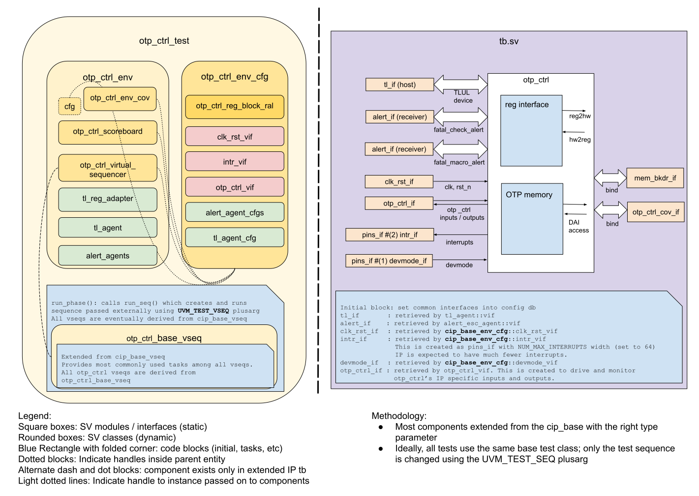

# OTP_CTRL DV document

## Goals
* **DV**
  * Verify all OTP_CTRL IP features by running dynamic simulations with a SV/UVM based testbench
  * Develop and run all tests based on the [testplan](#testplan) below towards closing code and functional coverage on the IP and all of its sub-modules
* **FPV**
  * Verify TileLink device protocol compliance with an SVA based testbench

## Current status
* [Design & verification stage](../../../README.md)
  * [HW development stages](../../../../doc/project_governance/development_stages.md)
* [Simulation results](https://reports.opentitan.org/hw/ip/otp_ctrl/dv/latest/report.html)

## Design features
For detailed information on OTP_CTRL design features, please see the [OTP_CTRL HW IP technical specification](../README.md).

## Testbench architecture
OTP_CTRL testbench has been constructed based on the [CIP testbench architecture](../../../dv/sv/cip_lib/README.md).

### Block diagram


### Top level testbench
Top level testbench is located at `hw/ip/otp_ctrl/dv/tb.sv`. It instantiates the OTP_CTRL DUT module `hw/ip/otp_ctrl/rtl/otp_ctrl.sv`.
In addition, it instantiates the following interfaces, connects them to the DUT and sets their handle into `uvm_config_db`:
* [Clock and reset interface](../../../dv/sv/common_ifs/README.md)
* [TileLink host interface](../../../dv/sv/tl_agent/README.md)
* OTP_CTRL IOs
* Interrupts ([`pins_if`](../../../dv/sv/common_ifs/README.md))
* Alerts ([`alert_esc_if`](../../../dv/sv/alert_esc_agent/README.md))

### Common DV utility components
The following utilities provide generic helper tasks and functions to perform activities that are common across the project:
* [dv_utils_pkg](../../../dv/sv/dv_utils/README.md)
* [csr_utils_pkg](../../../dv/sv/csr_utils/README.md)

### Global types & methods
All common types and methods defined at the package level can be found in
`otp_ctrl_env_pkg`. Some of them in use are:
```systemverilog
  parameter uint SCRAMBLE_DATA_SIZE = 64;
  parameter uint SCRAMBLE_KEY_SIZE  = 128;
  parameter uint NUM_ROUND          = 31;

  typedef enum bit [2:0] {
    OtpNoError,
    OtpMacroError,
    OtpMacroEccCorrError,
    OtpMacroEccUncorrError,
    OtpMacroWriteBlankError,
    OtpAccessError,
    OtpCheckFailError,
    OtpFsmStateError
  } otp_err_code_e;
```

### TL_agent
OTP_CTRL testbench instantiates (already handled in CIP base env) [tl_agent](../../../dv/sv/tl_agent/README.md), which provides the ability to drive and independently monitor random traffic via TL host interface into OTP_CTRL device.

### Alert_agents
OTP_CTRL testbench instantiates (already handled in CIP base env) two [alert_agents](../../../dv/sv/alert_esc_agent/README.md):
fatal_check_alert and fatal_macro_alert.
The alert_agents provide the ability to drive and independently monitor alert handshakes via alert interfaces in OTP_CTRL device.

### OTP_CTRL interface
OTP_CTRL design has specific inputs and outputs to communicate with other IPs including LC_CTRL, OTBN, SRAM, FLASH etc.
This interface is created to initialize, use simple task to drive, and use assertions to monitor these signals.

### Memory backdoor interface
OTP_CTRL testbench binds design's non-volatile OTP memory with a [`mem_bkdr_util`](../../../dv/sv/mem_bkdr_util/README.md), which supports read, write, and injection of ECC errors to design's OTP memory.

### UVM RAL model
The OTP_CTRL RAL model is created with the [`ralgen`](../../../dv/tools/ralgen/README.md) FuseSoC generator script automatically when the simulation is at the build stage.

It can be created manually by invoking [`regtool`](../../../../util/reggen/doc/setup_and_use.md).

### Reference models
The OTP_CTRL's utilizes [PRESENT](../../prim/doc/prim_present.md as the cipher to scramble and protect secrets.
Thus OTP_CTRL's scoreboard adopted PRESENT's C reference model, located under `hw/ip/prim/dv/prim_present/` folder, for encryption and decryption purpose.

### Stimulus strategy
#### Test sequences
All test sequences reside in `hw/ip/otp_ctrl/dv/env/seq_lib`.
The `otp_ctrl_base_vseq` virtual sequence is extended from `cip_base_vseq` and serves as a starting point.
All test sequences are extended from `otp_ctrl_base_vseq`.
It provides commonly used handles, variables, functions and tasks that the test sequences can simple use / call.
Some of the most commonly used tasks / functions are as follows:
* dai_wr: This task triggers an OTP write sequence via the DAI interface.
* dai_rd: This task triggers an OTP read sequence via the DAI interface.
* trigger_checks: This task triggers a one-time OTP check and user can choose to trigger consistency check or integrity check.
* randomize_dai_addr: This task takes a DAI address as input and randomize its last two bits, because the last two bits should be ignored in design.

#### Functional coverage
To ensure high quality constrained random stimulus, it is necessary to develop a functional coverage model.
The following two files declared OTP_CTRL's covergroups:
- `dv/env/otp_ctrl_env_cov.sv` declares functional or CSR related covergroups.
The functional coverage is collected manually inside OTP_CTRL's scoreboard by invoking the `sample` function.
- `dv/cov/otp_ctrl_cov_if.sv` declares interface signal related covergroups.
The functional coverage is collected automatically when the sampled signal is active.

### Self-checking strategy
#### Scoreboard
The `otp_ctrl_scoreboard` is primarily used for end to end checking.
It creates the following analysis ports to retrieve the data monitored by corresponding interface agents:
* tl_a_chan_fifo: tl address channel
* tl_d_chan_fifo: tl data channel
* alert_fifos: alert handshakes
* sram_fifos: sram requests
* otbn_fifo: otbn request
* lc_prog_fifo: life cycle programming request
* lc_token_fifo: life cycle token request
* flash_addr_fifo: flash address request
* flash_data_fifo: flash data request
* edn_fifo: edn response to OTP_CTRL

For all requests to OTP_CTRL as listed above, scoreboard has a corresponding task to process request, check OTP_CTRL's response value against encryption, and collect coverage.

OTP_CTRL's scoreboard has an internal array `otp_a` that tracks OTP memory data.
Every successful OTP write operation will update this internal array, and every successful OTP read operation will check the readout value against this internal array.
Note that in design, secret partitions will go through a encryption before writing to the actually OTP memory, and will be decrypted upon a read request.
For the simplicity of this internal array, we will skip this procedure.
However, if scoreboard backdoor read any secret partitions, we will decrypt the data then write the decrypted data to the internal array.
For any operation that fails, the scoreboard will predict the status and err_code according to the failure type.
If the error can trigger alert, scoreboard will use `set_exp_alert` task to check if the alert is firing correctly.
If a HW digest operation is triggered by sequence, scoreboard will calculate digest value with partition data from its internal array and update the digest value.
According to design spec, scoreboard won't lock the partition and predict the digest value to digest registers until next power cycle.

If a reset or lc_escalation_en is issued during an OTP_CTRL write operation, scoreboard cannot accurately predict how many bits have been programmed into OTP memory.
To avoid mismatches, scoreboard utilizes flags `dai_wr_ip` and `dai_digest_ip` to track otp write operations, and issue a backdoor read if the write operation is interrupted.

#### Assertions
* TLUL assertions: The `tb/otp_ctrl_bind.sv` binds the `tlul_assert` [assertions](../../tlul/doc/TlulProtocolChecker.md) to the IP to ensure TileLink interface protocol compliance.
* Unknown checks on DUT outputs: The RTL has assertions to ensure all outputs are initialized to known values after coming out of reset.
* OTP_CTRL_IF assertions: This interface has assertions to ensure certain OTP_CTRL's outputs (such as: otp_broadcast_o, keymgr_key_o) are stable after OTP initialization.

## Building and running tests
We are using our in-house developed [regression tool](../../../../util/dvsim/README.md) for building and running our tests and regressions.
Please take a look at the link for detailed information on the usage, capabilities, features and known issues.
Here's how to run a smoke test:
```console
$ $REPO_TOP/util/dvsim/dvsim.py $REPO_TOP/hw/ip/otp_ctrl/dv/otp_ctrl_sim_cfg.hjson -i otp_ctrl_smoke
```

## Testplan
[Testplan](../data/otp_ctrl_testplan.hjson)
